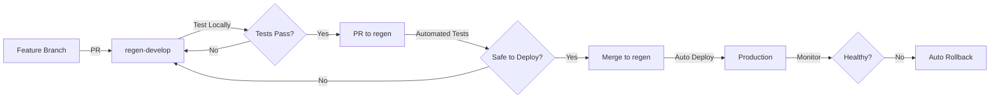

# Immediate Actions for Safe Deployment

## Current Situation
- ✅ Auto-deployment works: `regen` branch → Production
- ⚠️ No protection: Anyone can push to `regen` = instant production deploy
- ⚠️ No tests: Code deploys without validation
- ⚠️ No staging: Direct to production

## Today's Actions (Do These Now)

### 1. Protect the `regen` Branch (5 minutes)
```bash
# Go to: https://github.com/gaiaaiagent/GAIA/settings/branches

# Add branch protection rule for "regen":
- Require pull request before merging ✓
- Require approvals: 1 ✓  
- Dismiss stale reviews ✓
- Include administrators ✓ (enforce for everyone)
```

### 2. Create Simple Pre-Deploy Tests (30 minutes)
Create `.github/workflows/pre-deploy-tests.yml`:
```yaml
name: Pre-Deploy Safety Checks

on:
  pull_request:
    branches: [regen]

jobs:
  safety-checks:
    runs-on: ubuntu-latest
    steps:
      - uses: actions/checkout@v4
      
      - name: Setup Bun
        uses: oven-sh/setup-bun@v1
        with:
          bun-version: 1.2.15
      
      - name: Install Dependencies
        run: bun install
      
      - name: Build Check
        run: bun run build
        
      - name: Validate Character Files
        run: |
          for file in characters/*.character.json; do
            if [ -f "$file" ]; then
              bun -e "JSON.parse(require('fs').readFileSync('$file'))"
              echo "✓ $file is valid JSON"
            fi
          done
      
      - name: Check Startup Scripts
        run: |
          bash -n start-all-agents-single-process.sh
          bash -n start-all-agents-telegram.sh
          bash -n start-all-agents-no-telegram.sh
          
      - name: Memory Check
        run: |
          # Ensure we're not loading too much into memory
          if [ $(du -sm knowledge | cut -f1) -gt 5000 ]; then
            echo "⚠️ Knowledge folder > 5GB"
            exit 1
          fi
```

### 3. Test Locally First (Before Any PR)
```bash
# Your new pre-flight checklist:
./start-all-agents-single-process.sh  # Does it start?
curl http://localhost:3000              # Web UI responds?
ps aux | grep bun | wc -l              # 5 agents running?
tail logs/*.log | grep ERROR           # Any errors?
```

## This Week's Improvements

### Monday: Add Performance Gates
Add to the pre-deploy test:
```yaml
- name: Performance Baseline
  run: |
    # Start agent
    timeout 60 bun packages/cli/dist/index.js start --character characters/regenai.character.json &
    sleep 30
    
    # Test response time
    start_time=$(date +%s%N)
    curl -X POST http://localhost:3000/api/chat -d '{"message":"hello"}'
    end_time=$(date +%s%N)
    
    response_time=$((($end_time - $start_time) / 1000000))
    if [ $response_time -gt 5000 ]; then
      echo "⚠️ Response time ${response_time}ms > 5000ms limit"
      exit 1
    fi
```

### Tuesday: Version Pinning
Lock everything down in `package.json`:
```json
{
  "overrides": {
    "@elizaos/core": "1.4.4",
    "@elizaos/plugin-telegram": "github:gaiaaiagent/plugin-telegram.git#abc123",
    "@elizaos/plugin-knowledge": "github:gaiaaiagent/plugin-knowledge.git#def456"
  }
}
```

### Wednesday: Staging Branch
1. Create `regen-staging` branch
2. Update deployment workflow to deploy staging to different server/port
3. Test there for 24h before production

### Thursday: Rollback Script
Create `scripts/emergency-rollback.sh`:
```bash
#!/bin/bash
# Quick rollback to last known good
LAST_GOOD_COMMIT=${1:-"HEAD~1"}

git checkout regen
git reset --hard $LAST_GOOD_COMMIT
git push --force-with-lease origin regen

echo "⚠️ Rolled back to $LAST_GOOD_COMMIT"
echo "Remember to fix forward in regen-develop"
```

### Friday: Monitoring
Add health checks to deployment:
```yaml
- name: Post-Deploy Health Check
  run: |
    sleep 60  # Let services start
    
    # Check all agents responding
    for port in 3000 3001 3002 3003 3004; do
      if ! curl -f http://202.61.196.119:$port/health; then
        echo "Agent on port $port not healthy!"
        # Trigger rollback
        exit 1
      fi
    done
```

## The New Safe Workflow



## Why This Works

1. **Can't accidentally break production** - PRs required
2. **Catches obvious breaks** - Basic tests run
3. **Performance protected** - Response time limits
4. **Easy rollback** - One command to revert
5. **Gradual improvement** - Add more safety each day

## Measuring Success

Track these metrics:
- Deployments that cause downtime: Goal = 0
- Time to rollback: Goal < 2 minutes  
- Failed deployments caught by tests: Goal > 90%
- Team confidence in deploying: Goal = High

---

**Start with Step 1 right now** - protecting the branch takes 5 minutes and prevents 90% of accidents.