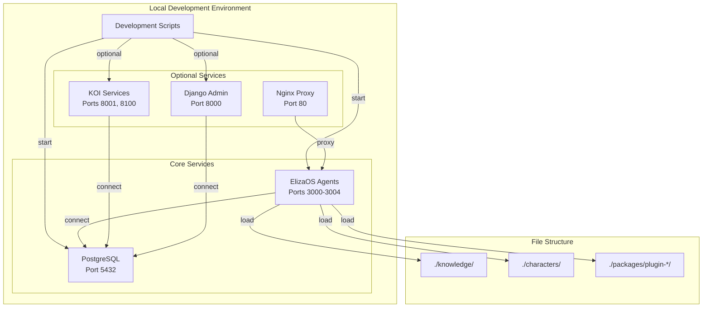
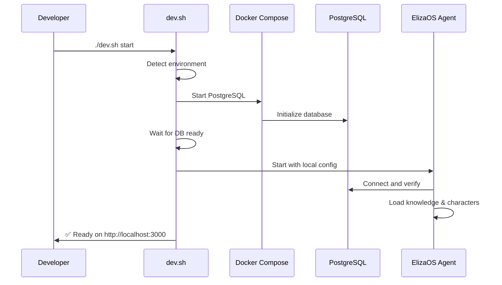
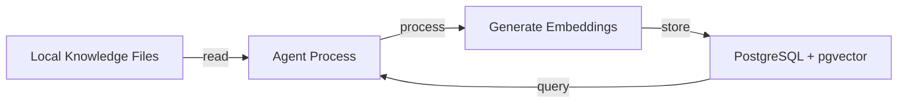

# Local Development Setup Design

## Design Vision

Create a **zero-friction local development environment** that mirrors production capabilities while remaining simple to set up and maintain. Developers should be able to go from fresh clone to running agents in under 5 minutes with a single command.

## Problem Statement

Current pain points:
- Scripts reference production paths (`/opt/projects/GAIA-direct`)
- Docker setup unclear after Darren's changes
- No clear separation between dev and prod configurations
- Plugin loading paths are confusing
- Multiple conflicting documentation sources
- No way to detect current environment programmatically

## Design Philosophy

### 1. Convention Over Configuration
Default settings should work for 90% of cases. Only require configuration for special needs.

**Design Decision**: Use `.env.local` with sensible defaults that auto-detect environment.

### 2. Progressive Complexity
Start minimal, add services as needed.

**Design Decision**: Three-tier setup:
- **Minimal**: Just PostgreSQL + one agent
- **Standard**: PostgreSQL + all agents + basic services
- **Full**: Complete production mirror with all services

### 3. Environment Parity
Development should closely mirror production without unnecessary overhead.

**Design Decision**: Same service architecture, different scale.

## System Architecture



## Core Components

### Environment Detection Service

**Purpose**: Automatically detect and configure for current environment

**Key Design Elements**:
- Environment variable `GAIA_ENV` (local, staging, production)
- Automatic detection based on hostname/paths
- Configuration cascade: env vars > config files > defaults

**Interface Design**:
```typescript
interface EnvironmentConfig {
  name: 'local' | 'staging' | 'production';
  paths: {
    knowledge: string;
    characters: string;
    plugins: string;
    logs: string;
  };
  services: {
    postgres: { host: string; port: number; };
    koi?: { nodeUrl: string; queryUrl: string; };
    django?: { url: string; };
  };
  features: {
    koi: boolean;
    django: boolean;
    nginx: boolean;
  };
}
```

### Local Development Scripts

**Purpose**: Simple, reliable local setup and management

**Design Pattern**: Progressive enhancement with clear tiers

**Key Decisions**:
- Shell scripts for maximum compatibility
- Docker Compose for service orchestration
- Bun for all Node.js operations
- Clear output with status indicators

## Data Flow Patterns

### Agent Startup Flow



### Knowledge Loading Flow



## Integration Points

### Internal Integrations
- **PostgreSQL**: Always required, runs in Docker
- **Knowledge Plugin**: Loads from local `./packages/plugin-knowledge`
- **Character Files**: Loads from local `./characters`

### External Integrations
- **OpenAI API**: For embeddings and chat (requires API key)
- **Optional LLMs**: Anthropic, Google, etc. (configurable)

## Performance Considerations

### Optimization Strategies

1. **Lazy Service Loading**: Only start services when needed
2. **Shared Database**: Single PostgreSQL for all agents
3. **Local Caching**: Cache embeddings to avoid regeneration

### Scalability Design

- **Current Scale**: 1-5 agents locally
- **Future Scale**: Support 10+ agents with service mesh
- **Scaling Approach**: Add agents as needed, share resources

## Security & Privacy

### Security Model
- Local-only by default (no external exposure)
- Optional ngrok for external testing
- Separate API keys for dev/prod

### Privacy Controls
- Git-ignored `.env.local` for secrets
- No production data in development
- Sanitized test data sets

## Error Handling Strategy

### Failure Modes

1. **Database Connection Failure**: Clear message with fix instructions
2. **Missing API Keys**: Helpful error with setup guide link
3. **Port Conflicts**: Auto-detect and suggest alternatives

### Recovery Patterns
- **Automatic Retry**: For transient failures
- **Graceful Degradation**: Run without optional services
- **Reset Command**: Clean slate with `./dev.sh reset`

## User Experience

### User Workflows

**Workflow 1: Quick Start**
1. Clone repository
2. Copy `.env.example` to `.env.local`
3. Run `./dev.sh start`
4. Open http://localhost:3000

**Workflow 2: Full Development**
1. Run `./dev.sh start --full`
2. All services start (KOI, Django, etc.)
3. Access full dashboard at http://localhost:80

### API Design (if applicable)

```bash
# Development CLI API
./dev.sh start          # Start minimal services
./dev.sh start --full   # Start all services
./dev.sh stop           # Stop all services
./dev.sh status         # Show service status
./dev.sh logs [service] # Tail service logs
./dev.sh reset          # Clean reset
./dev.sh test           # Run test suite
```

## Monitoring & Observability

### Key Metrics
- **Service Health**: Status checks for each service
- **Resource Usage**: Memory and CPU per service
- **Agent Activity**: Messages processed, response times

### Debugging & Troubleshooting
- Unified log location: `./logs/`
- Debug mode with verbose output
- Health check endpoints for each service

## Future Extensibility

### Extension Points
- Additional agent types via character files
- Custom plugins in `./packages/`
- Service additions via docker-compose override

### Future Considerations
- Kubernetes local development with Kind
- Cloud development environments (Gitpod/Codespaces)
- Distributed tracing for multi-agent debugging

## Design Alternatives Considered

### Alternative 1: Pure Docker
**Approach**: Everything in containers
**Pros**: Complete isolation, exact production mirror
**Cons**: Heavy resource usage, slow iteration
**Decision**: Rejected - too heavy for rapid development

### Alternative 2: Native Everything
**Approach**: No Docker, all services native
**Pros**: Fastest performance, minimal overhead
**Cons**: Complex setup, environment inconsistencies
**Decision**: Rejected - too many dependencies to manage

### Alternative 3: Hybrid (Chosen)
**Approach**: Database in Docker, agents native
**Pros**: Balance of isolation and performance
**Cons**: Some complexity remains
**Decision**: Accepted - best developer experience

## Success Criteria

### Functional Success
- 5-minute setup from fresh clone
- All agents start and respond correctly
- Knowledge loads and queries work
- No hardcoded production paths

### Non-Functional Success
- < 4GB RAM usage for standard setup
- < 30 second cold start time
- Clear error messages for all failure modes
- Works on Mac, Linux, and WSL2

## Open Questions

1. Should we support Windows native or just WSL2?
2. How do we handle plugin development hot-reload?
3. Should KOI be required or optional for local dev?

## Design Validation

### Validation Approach
- Test on fresh machine with team members
- Measure setup time and resource usage
- Gather feedback on developer experience

### Prototyping Plan
- Create `dev.sh` script with basic functionality
- Test with single agent first
- Gradually add services and test each tier

---

_"A frictionless development environment is the foundation of productive collaboration."_