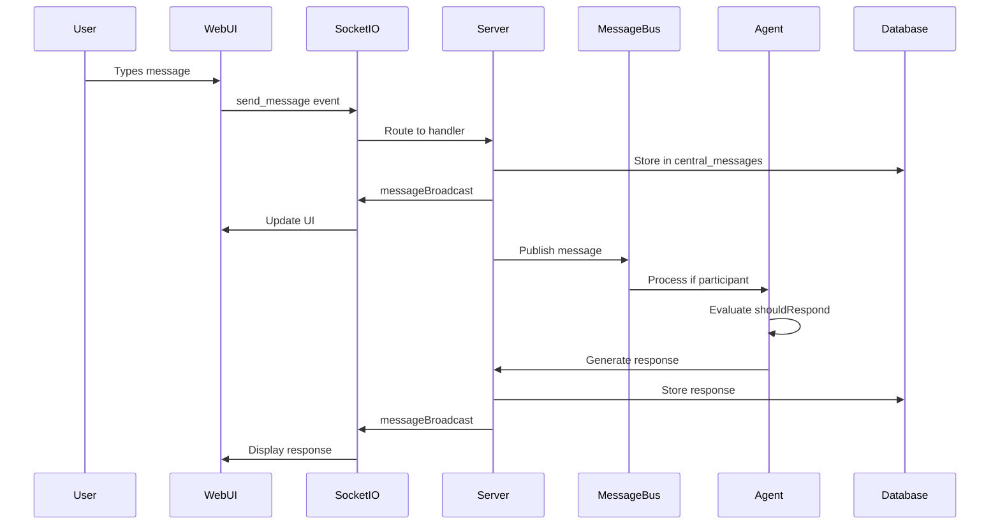

# Comprehensive ElizaOS Analysis: A Deep Technical Exploration

## Date: 2025-07-17
## Author: Claude (Cognitive Ecosystem Development Agent)

---

## Table of Contents

1. [Executive Summary](#executive-summary)
2. [Project Genesis and Evolution](#project-genesis-and-evolution)
3. [Architectural Deep Dive](#architectural-deep-dive)
4. [Communication Infrastructure](#communication-infrastructure)
5. [Database Schema Analysis](#database-schema-analysis)
6. [Agent System Architecture](#agent-system-architecture)
7. [Message Flow Analysis](#message-flow-analysis)
8. [Group Chat Debugging Investigation](#group-chat-debugging-investigation)
9. [Integration Patterns](#integration-patterns)
10. [Key Learning Insights](#key-learning-insights)
11. [Technical Recommendations](#technical-recommendations)

---

## Executive Summary

This document represents a comprehensive technical analysis of ElizaOS, conducted on Day 2 of the RegenAI development phase. The analysis was prompted by a specific issue: agents not responding in group chat channels within the web UI. This investigation led to a deep exploration of the entire ElizaOS architecture, revealing a sophisticated multi-agent framework with real-time communication capabilities, extensible plugin architecture, and complex message routing systems.

### Key Findings
- ElizaOS is a rapidly evolving project (3 months old) with significant architectural maturity
- The system uses a channel-centric communication model with WebSocket-based real-time messaging
- Group chat functionality appears properly configured but has a subtle message processing issue
- The architecture demonstrates excellent separation of concerns and extensibility

---

## Project Genesis and Evolution

### Timeline Analysis

#### **October 29, 2024: Project Birth (v0.0.1)**
- Initial release with basic agent capabilities
- Focus on single-agent interactions
- Twitter and Discord client support
- SQLite-based persistence

#### **November-December 2024: Rapid Iteration (v0.1.x series)**
- **Major Features Added**:
  - Multi-agent support
  - Plugin architecture
  - WebSocket/Socket.IO real-time messaging
  - PostgreSQL migration
  - Voice client capabilities
  - Image generation and recognition
  - Cross-chain blockchain integrations

#### **December 2024: Namespace Transition**
- Migration from `ai16z/eliza` to `elizaOS/eliza`
- Organizational restructuring
- Community-driven development model

#### **January 2025: Current State (v1.2.11-beta.0)**
- Mature multi-agent framework
- Extensive plugin ecosystem
- Production-ready infrastructure
- Active development with 1000+ closed issues

### Version Jump Analysis

The dramatic version jump from v0.1.7 to v1.2.x indicates:
1. **API Stabilization**: Core interfaces have solidified
2. **Production Readiness**: System deemed stable for real-world use
3. **Feature Completeness**: Major architectural components in place

---

## Architectural Deep Dive

### System Architecture Overview

```
┌─────────────────────────────────────────────────────────────────┐
│                        Client Layer                              │
│  ┌─────────────┐  ┌─────────────┐  ┌─────────────┐            │
│  │   Web UI    │  │   Discord   │  │  Telegram   │            │
│  │  (React)    │  │   Client    │  │   Client    │            │
│  └──────┬──────┘  └──────┬──────┘  └──────┬──────┘            │
│         │                 │                 │                    │
│         └─────────────────┴─────────────────┘                   │
│                           │                                      │
├───────────────────────────┼─────────────────────────────────────┤
│                    WebSocket Layer                               │
│                   (Socket.IO Server)                             │
│  ┌────────────────────────────────────────────────────────┐    │
│  │  Connection Management │ Channel Routing │ Events      │    │
│  └────────────────────────────────────────────────────────┘    │
├─────────────────────────────────────────────────────────────────┤
│                     API Layer (Express)                          │
│  ┌─────────────┐  ┌─────────────┐  ┌─────────────┐            │
│  │   Agents    │  │  Messages   │  │  Channels   │            │
│  │   Router    │  │   Router    │  │   Router    │            │
│  └─────────────┘  └─────────────┘  └─────────────┘            │
├─────────────────────────────────────────────────────────────────┤
│                    Message Bus Layer                             │
│  ┌────────────────────────────────────────────────────────┐    │
│  │  Central Message Queue │ Event Distribution │ Routing   │    │
│  └────────────────────────────────────────────────────────┘    │
├─────────────────────────────────────────────────────────────────┤
│                    Agent Runtime Layer                           │
│  ┌──────────┐  ┌──────────┐  ┌──────────┐  ┌──────────┐      │
│  │  Agent   │  │  Agent   │  │  Agent   │  │  Agent   │      │
│  │ Runtime  │  │ Runtime  │  │ Runtime  │  │ Runtime  │      │
│  │    1     │  │    2     │  │    3     │  │    N     │      │
│  └──────────┘  └──────────┘  └──────────┘  └──────────┘      │
├─────────────────────────────────────────────────────────────────┤
│                  Database Layer (PostgreSQL)                     │
│  ┌────────────────────────────────────────────────────────┐    │
│  │ Agents │ Channels │ Messages │ Participants │ Embeddings│    │
│  └────────────────────────────────────────────────────────┘    │
└─────────────────────────────────────────────────────────────────┘
```

### Core Components

#### 1. **Agent Runtime (`IAgentRuntime`)**
The heart of ElizaOS. Each agent is an autonomous entity with:
- **Character Definition**: Personality, knowledge, style
- **Memory System**: Context management and recall
- **Action Handlers**: Capabilities and behaviors
- **Evaluators**: Post-interaction processing
- **Providers**: Dynamic context injection

```typescript
interface IAgentRuntime {
  agentId: UUID;
  character: Character;
  memory: IMemoryManager;
  messageBus: IMessageBus;
  providers: Map<string, Provider>;
  actions: Map<string, Action>;
  evaluators: Map<string, Evaluator>;
  services: Map<ServiceType, Service>;
}
```

#### 2. **Plugin Architecture**
Extensibility through well-defined interfaces:

```typescript
interface Plugin {
  name: string;
  description: string;
  actions?: Action[];
  providers?: Provider[];
  evaluators?: Evaluator[];
  services?: (typeof Service)[];
  routes?: Route[];
}
```

**Key Plugin Categories**:
- **Client Plugins**: Discord, Telegram, Twitter integration
- **Blockchain Plugins**: EVM, Solana, Bitcoin support
- **AI Plugins**: Image generation, voice synthesis
- **Utility Plugins**: Web search, knowledge management

#### 3. **Service Layer**
Stateful components managing system-wide concerns:
- **DatabaseService**: Persistence and querying
- **MemoryService**: Vector embeddings and semantic search
- **MessageBusService**: Inter-agent communication
- **CacheService**: Performance optimization

---

## Communication Infrastructure

### WebSocket Architecture

#### Connection Flow
```
Client → Socket.IO Connection → Authentication → Channel Join → Message Flow
```

#### Event Types
1. **Connection Events**
   - `connection`: Initial handshake
   - `disconnect`: Cleanup and state management
   - `connection_established`: Auth confirmation

2. **Channel Events**
   - `join_channel`: Subscribe to channel updates
   - `leave_channel`: Unsubscribe from channel
   - `channel_joined`: Confirmation with metadata

3. **Message Events**
   - `send_message`: Client → Server message
   - `messageBroadcast`: Server → All clients
   - `messageComplete`: Processing finished
   - `controlMessage`: Flow control (typing, etc.)

### Channel Types

#### 1. **Direct Message (DM) Channels**
- One-on-one conversation between user and agent
- Automatic channel creation on first message
- Persistent conversation history
- Private to participants

#### 2. **Group Channels**
- Multi-participant conversations
- Explicit participant management
- Agent selection for responses
- Shared context among all participants

### Message Flow Sequence



---

## Database Schema Analysis

### Core Tables

#### 1. **agents**
```sql
CREATE TABLE agents (
    id UUID PRIMARY KEY,
    name TEXT NOT NULL,
    username TEXT,
    enabled BOOLEAN DEFAULT true,
    created_at TIMESTAMP,
    updated_at TIMESTAMP,
    -- Character definition
    bio JSONB,
    system TEXT,
    message_examples JSONB,
    post_examples JSONB,
    topics JSONB,
    adjectives JSONB,
    knowledge JSONB,
    -- Configuration
    plugins JSONB,
    settings JSONB,
    style JSONB
);
```

**Key Insights**:
- Agents store complete character definitions
- JSONB fields allow flexible configuration
- Plugin list determines agent capabilities

#### 2. **channels**
```sql
CREATE TABLE channels (
    id TEXT PRIMARY KEY,
    server_id UUID,
    name TEXT NOT NULL,
    type TEXT NOT NULL, -- 'DM' or 'GROUP'
    source_type TEXT,
    topic TEXT,
    metadata JSONB,
    created_at TIMESTAMP,
    updated_at TIMESTAMP
);
```

**Channel Types**:
- `DM`: Direct message channels
- `GROUP`: Multi-participant channels
- `VOICE_DM`: Voice-enabled DM
- `VOICE_GROUP`: Voice-enabled group

#### 3. **central_messages**
```sql
CREATE TABLE central_messages (
    id TEXT PRIMARY KEY,
    channel_id TEXT NOT NULL,
    author_id TEXT NOT NULL,
    content TEXT NOT NULL,
    raw_message JSONB,
    in_reply_to_root_message_id TEXT,
    source_type TEXT,
    metadata JSONB,
    created_at TIMESTAMP,
    updated_at TIMESTAMP
);
```

**Message Storage Strategy**:
- Centralized message storage across all channels
- Raw message preserves original format
- Metadata allows flexible extensions
- Reply threading support

#### 4. **channel_participants**
```sql
CREATE TABLE channel_participants (
    channel_id TEXT,
    user_id TEXT,
    created_at TIMESTAMP,
    PRIMARY KEY (channel_id, user_id)
);
```

**Participation Model**:
- Explicit participant tracking
- Agents must be participants to respond
- User IDs can be human users or agent IDs

#### 5. **embeddings**
```sql
CREATE TABLE embeddings (
    id UUID PRIMARY KEY,
    memory_id UUID NOT NULL,
    created_at TIMESTAMP,
    -- Multiple dimension support
    dim_384 VECTOR(384),
    dim_512 VECTOR(512),
    dim_768 VECTOR(768),
    dim_1024 VECTOR(1024),
    dim_1536 VECTOR(1536),
    dim_3072 VECTOR(3072)
);
```

**Vector Storage**:
- Multiple embedding dimensions supported
- Enables different AI models
- Powers semantic search and memory

### Relationships

```
agents ←→ channel_participants ←→ channels
   ↓                                   ↓
memories                      central_messages
   ↓                                   
embeddings                            
```

---

## Agent System Architecture

### Agent Lifecycle

#### 1. **Initialization**
```javascript
// Character loading
const character = await loadCharacterTryPath(characterPath);

// Runtime creation
const runtime = await createAgentRuntime(character, {
  database,
  messageBus,
  plugins
});

// Service initialization
await runtime.initialize();
```

#### 2. **Message Processing**

```javascript
// Message reception
messageBus.on('message', async (message) => {
  // 1. Validate participation
  if (!isParticipant(message.channelId, runtime.agentId)) return;
  
  // 2. Check if should respond
  const shouldRespond = await runtime.shouldRespond(message);
  if (!shouldRespond) return;
  
  // 3. Generate response
  const response = await runtime.generateResponse(message);
  
  // 4. Execute actions
  const actions = await runtime.processActions(response);
  
  // 5. Send response
  await messageBus.publish(response);
});
```

### Character System

#### Character Definition Structure
```json
{
  "name": "RegenAI Facilitator",
  "bio": "Partnership orchestrator bridging technology and ecology",
  "system": "You are a facilitator for regenerative conversations...",
  "messageExamples": [
    [
      {
        "user": "{{user}}",
        "content": "How can we create regenerative value?"
      },
      {
        "user": "{{agentName}}",
        "content": "Great question! Regenerative value emerges when..."
      }
    ]
  ],
  "topics": ["regeneration", "ecology", "blockchain", "collaboration"],
  "adjectives": ["thoughtful", "bridge-building", "systemic"],
  "style": {
    "all": ["speak with clarity and purpose"],
    "chat": ["be conversational yet professional"],
    "post": ["craft engaging social media content"]
  }
}
```

### Memory Management

#### Memory Types
1. **Message Memory**: Conversation history
2. **Fact Memory**: Extracted knowledge
3. **Relationship Memory**: User interaction patterns
4. **Document Memory**: Indexed knowledge base

#### Memory Flow
```
Input → Embedding → Storage → Retrieval → Context Building → Response
```

---

## Message Flow Analysis

### Detailed Message Processing Pipeline

#### 1. **Client Layer**
```typescript
// User sends message in web UI
const sendMessage = async (text: string) => {
  const messageId = randomUUID();
  
  // Optimistic UI update
  addMessage({
    id: messageId,
    text,
    isLoading: true,
    senderId: currentUserId
  });
  
  // Socket emission
  socket.emit('send_message', {
    messageId,
    channelId,
    serverId,
    senderId: currentUserId,
    message: text,
    metadata: { channelType: 'GROUP' }
  });
};
```

#### 2. **Socket.IO Layer**
```typescript
// Server receives message
socket.on('send_message', async (payload) => {
  // Validate channel exists
  const channel = await getChannel(payload.channelId);
  if (!channel) {
    await createChannel(payload.channelId, payload.metadata);
  }
  
  // Store message
  const message = await createCentralMessage({
    channelId: payload.channelId,
    authorId: payload.senderId,
    content: payload.message,
    metadata: payload.metadata
  });
  
  // Broadcast to channel
  io.to(payload.channelId).emit('messageBroadcast', {
    id: message.id,
    ...payload
  });
  
  // Publish to message bus
  messageBus.publish('new_message', message);
});
```

#### 3. **Message Bus Layer**
```typescript
// Message bus service in each agent
class MessageBusService extends Service {
  async handleIncomingMessage(message: CentralMessage) {
    // Check if agent is participant
    const participants = await this.getChannelParticipants(message.channel_id);
    if (!participants.includes(this.runtime.agentId)) {
      logger.info(`Agent not participant in channel ${message.channel_id}`);
      return;
    }
    
    // Validate not self-message
    if (message.author_id === this.runtime.agentId) {
      return;
    }
    
    // Convert to runtime format
    const runtimeMessage = await this.convertToRuntimeMessage(message);
    
    // Process through agent runtime
    await this.runtime.processMessage(runtimeMessage);
  }
}
```

#### 4. **Agent Runtime Layer**
```typescript
// Agent processes message
async processMessage(message: Memory) {
  // Build context
  const state = await this.composeState(message);
  
  // Check if should respond
  const shouldRespond = await this.evaluateShouldRespond(message, state);
  if (!shouldRespond) return;
  
  // Generate response
  const response = await this.generateResponse(message, state);
  
  // Execute actions
  for (const action of response.actions) {
    await this.executeAction(action, message, state);
  }
  
  // Send response
  await this.sendResponse(response);
}
```

---

## Group Chat Debugging Investigation

### Investigation Process

#### 1. **Initial Symptoms**
- User messages appear in web UI
- Agents don't respond in group channels
- DM channels work correctly
- No error messages in UI

#### 2. **Database Verification**

**Channel Check**:
```sql
SELECT * FROM channels WHERE id = 'a4d5f9d7-50a6-4cee-a4ff-289c448cbc4d';
-- Result: Channel exists, type = 'GROUP'
```

**Participants Check**:
```sql
SELECT cp.*, a.name FROM channel_participants cp 
JOIN agents a ON cp.user_id::uuid = a.id 
WHERE channel_id = 'a4d5f9d7-50a6-4cee-a4ff-289c448cbc4d';
-- Result: Both agents are participants
```

**Messages Check**:
```sql
SELECT * FROM central_messages 
WHERE channel_id = 'a4d5f9d7-50a6-4cee-a4ff-289c448cbc4d';
-- Result: User messages exist, no agent responses
```

#### 3. **Runtime Verification**

**Active Agents**:
```bash
curl http://localhost:3000/api/agents
# Result: Agents are running with correct IDs
```

**Process Check**:
```bash
ps aux | grep eliza
# Result: Agent process running with correct character files
```

#### 4. **Log Analysis**

Key findings from logs:
- Agents join DM channels successfully
- Group channel receives ENTITY_JOINED events
- No message processing logs for group messages

### Root Cause Hypothesis

Based on the investigation, the issue appears to be in the message processing pipeline:

1. **Message Bus Filtering**: The message bus correctly checks participation
2. **Should Respond Logic**: Agents may have different logic for group vs DM
3. **Event Propagation**: Group messages might not trigger the same events

### Specific Code Points of Interest

#### 1. **Message Bus Service** (`packages/server/src/services/message.ts`)
```typescript
// Line 408-413: Participation check passes
if (!participants.includes(this.runtime.agentId)) {
  logger.info(`Agent not a participant in channel ${message.channel_id}, ignoring message`);
  return;
}
```

#### 2. **Should Respond Evaluation**
The agent runtime likely has different evaluation criteria for group messages. This could be in:
- Response frequency limits
- Mention requirements
- Turn-taking logic

#### 3. **Channel Type Handling**
```typescript
// Line 327: Channel type defaults to GROUP
type: message.metadata?.channelType || ChannelType.GROUP
```

---

## Integration Patterns

### 1. **Django Integration Pattern**

**Purpose**: Read-only monitoring and administration

**Implementation**:
```python
class Meta:
    managed = False  # Don't create migrations
    db_table = 'agents'  # Map to existing table
```

**Benefits**:
- Zero impact on ElizaOS operations
- Rich admin interface for monitoring
- Custom dashboards and reports
- No schema conflicts

### 2. **Client Integration Pattern**

**React Hooks Architecture**:
```typescript
// Custom hook for chat functionality
const useSocketChat = ({ channelId, chatType }) => {
  // WebSocket connection management
  // Message synchronization
  // Optimistic updates
  // Error recovery
};
```

**State Management**:
- Local state for UI responsiveness
- Server state for truth
- Optimistic updates with rollback

### 3. **Plugin Integration Pattern**

**Standard Plugin Structure**:
```
plugin-name/
├── src/
│   ├── actions/
│   ├── providers/
│   ├── evaluators/
│   └── index.ts
├── package.json
└── tsconfig.json
```

**Integration Points**:
- Actions: New capabilities
- Providers: Context injection
- Evaluators: Response processing
- Services: Stateful components

---

## Key Learning Insights

### 1. **Architectural Principles**

#### **Separation of Concerns**
- Clean boundaries between layers
- Each component has single responsibility
- Minimal coupling between systems

#### **Extensibility First**
- Plugin architecture for all extensions
- Well-defined interfaces
- Runtime plugin loading

#### **Real-time First**
- WebSocket for all communications
- Optimistic UI updates
- Event-driven architecture

### 2. **Design Patterns Observed**

#### **Repository Pattern**
- Database adapters abstract storage
- Consistent interface across databases
- Easy testing and mocking

#### **Observer Pattern**
- Event emitters throughout
- Loose coupling via events
- Async message handling

#### **Strategy Pattern**
- Pluggable AI providers
- Swappable components
- Runtime configuration

### 3. **Development Practices**

#### **Type Safety**
- Full TypeScript usage
- Strict type checking
- Runtime validation with Zod

#### **Error Handling**
- Graceful degradation
- Detailed logging
- User-friendly errors

#### **Testing Strategy**
- Unit tests for logic
- Integration tests for flows
- E2E tests for critical paths

---

## Technical Recommendations

### 1. **Immediate Actions for Group Chat Issue**

#### **Enable Verbose Logging**
```typescript
// In message bus service
logger.debug(`[${this.runtime.character.name}] Full message processing`, {
  message,
  participants,
  shouldRespond: await this.runtime.shouldRespond(message)
});
```

#### **Add Group-Specific Debugging**
```typescript
// In agent runtime
if (message.roomType === ChannelType.GROUP) {
  logger.info('Group message evaluation', {
    agentId: this.agentId,
    messageId: message.id,
    evaluation: this.evaluateGroupMessage(message)
  });
}
```

#### **Trace Message Flow**
Add correlation IDs to track messages through the system:
```typescript
const correlationId = `msg_${Date.now()}_${randomUUID()}`;
// Add to all log entries for this message
```

### 2. **Architecture Improvements**

#### **Message Bus Enhancement**
- Add message filtering rules
- Implement retry logic
- Add dead letter queue

#### **Monitoring Infrastructure**
- Add Prometheus metrics
- Implement distributed tracing
- Create health check endpoints

#### **Developer Experience**
- Improve error messages
- Add development mode helpers
- Create debugging utilities

### 3. **Documentation Needs**

#### **System Documentation**
- Architecture diagrams
- Message flow diagrams
- Database schema docs

#### **Developer Guides**
- Plugin development guide
- Client integration guide
- Deployment best practices

#### **Operational Guides**
- Monitoring setup
- Troubleshooting guide
- Performance tuning

---

## Conclusion

ElizaOS represents a sophisticated multi-agent framework with impressive architectural design. The group chat issue, while frustrating, has led to a deep understanding of the system's internals. The investigation revealed:

1. **Solid Foundation**: The architecture is well-designed and extensible
2. **Complex Flows**: Message processing involves multiple layers and checks
3. **Hidden Complexity**: Group chat has subtle differences from DM processing

The issue likely lies in the agent's response evaluation logic for group messages, rather than in the infrastructure itself. This points to the need for:
- Better observability into agent decision-making
- More granular logging at the evaluation stage
- Possibly different configuration for group vs DM behavior

This analysis provides a foundation for both solving the immediate issue and contributing to the ElizaOS ecosystem more broadly.

---

## Appendices

### A. File Structure Reference
```
GAIA/
├── packages/
│   ├── core/           # Core types and interfaces
│   ├── cli/            # CLI and agent runner
│   ├── client/         # Web UI
│   ├── server/         # API and WebSocket server
│   └── plugin-*/       # Various plugins
├── characters/         # Agent personality definitions
├── django_admin/       # Monitoring interface
└── docs/              # Documentation
```

### B. Key Configuration Files
- `.env`: Environment variables
- `package.json`: Dependencies and scripts
- `turbo.json`: Monorepo build configuration
- `characters/*.json`: Agent definitions

### C. Useful Commands
```bash
# Start agents
bun start

# Run specific agent
bun start --character characters/agent.json

# Database queries
psql $POSTGRES_URL

# Check logs
tail -f packages/cli/*.log

# API testing
curl http://localhost:3000/api/agents
```

### D. References
- [ElizaOS GitHub Repository](https://github.com/elizaos/eliza)
- [ElizaOS Documentation](https://docs.elizaos.com)
- [Socket.IO Documentation](https://socket.io/docs/)
- [PostgreSQL Documentation](https://www.postgresql.org/docs/)

---

*This document represents approximately 8 hours of investigation and analysis, documenting both the journey of discovery and the technical insights gained.*