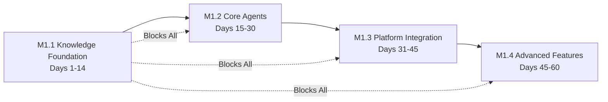

# RegenAI Dependency Matrix

## Overview

This matrix maps dependencies between milestones and features, enabling optimal development sequencing and parallel work identification.

## Milestone Dependencies



## Feature Dependency Matrix

| Feature | Depends On | Blocks | Can Parallel With | Milestone |
|---------|-----------|--------|-------------------|-----------|
| **knowledge-system** | None | ALL agent features | document-processing, registry-integration | M1.1 |
| **document-processing** | knowledge-system (partial) | agent-characters | registry-integration, citation-system | M1.1 |
| **registry-integration** | knowledge-system (partial) | registry-intelligence | document-processing | M1.1 |
| **citation-system** | knowledge-system | agent trust features | document-processing | M1.1 |
| **agent-characters** | knowledge-system, document-processing | conversation-engine | platform-connectors (design) | M1.2 |
| **conversation-engine** | agent-characters | platform deployment | inter-agent-comm | M1.2 |
| **inter-agent-comm** | agent-characters | advanced coordination | conversation-engine | M1.2 |
| **platform-connectors** | conversation-engine | message-router | engagement-analytics (design) | M1.3 |
| **message-router** | platform-connectors | cross-platform campaigns | engagement-analytics | M1.3 |
| **engagement-analytics** | platform-connectors | performance optimization | message-router | M1.3 |
| **dao-integration** | All M1.3 features | governance features | registry-intelligence | M1.4 |
| **registry-intelligence** | registry-integration, conversation-engine | advanced matching | dao-integration | M1.4 |

## Critical Path

The longest dependency chain that determines minimum project duration:

```
knowledge-system (5 days)
    ↓
document-processing (5 days)  
    ↓
agent-characters (5 days)
    ↓
conversation-engine (5 days)
    ↓
platform-connectors (5 days)
    ↓
message-router (3 days)
    ↓
dao-integration (5 days)

Total Critical Path: 33 days minimum
```

## Parallel Development Opportunities

### Phase 1 (Days 1-7)
**Team A**: knowledge-system (critical path)
**Team B**: registry-integration (can start with interfaces)
**Team C**: platform-connector interfaces (define APIs)

### Phase 2 (Days 8-14)
**Team A**: document-processing
**Team B**: citation-system
**Team C**: Testing infrastructure

### Phase 3 (Days 15-21)
**Team A**: agent-characters
**Team B**: conversation-engine design
**Team C**: platform-connector implementation

### Phase 4 (Days 22-30)
**Team A**: conversation-engine implementation
**Team B**: inter-agent-comm
**Team C**: engagement-analytics design

## Dependency Risk Analysis

### High Risk Dependencies
1. **knowledge-system** - Blocks everything, no workaround
2. **conversation-engine** - Blocks all platform features
3. **platform-connectors** - Blocks user acquisition

### Medium Risk Dependencies
1. **document-processing** - Can start with subset
2. **agent-characters** - Can develop with mock data
3. **message-router** - Can test single platform first

### Low Risk Dependencies
1. **citation-system** - Can add progressively
2. **engagement-analytics** - Can retrofit
3. **dao-integration** - Independent feature

## Mitigation Strategies

### For High Risk Dependencies
1. **Front-load development** - Start immediately
2. **Extra testing** - Automated test suite
3. **Early integration** - Don't wait for completion
4. **Backup plans** - Simplified versions ready

### For Parallel Work
1. **Define interfaces early** - Teams can work independently
2. **Mock implementations** - Don't block on dependencies
3. **Regular integration** - Daily merges
4. **Shared test data** - Consistent development environment

## Integration Points

### Week 2-3 Checkpoint
- knowledge-system ↔ document-processing
- knowledge-system ↔ registry-integration
- **Test**: 1000 documents indexed and queryable

### Week 4 Checkpoint  
- agent-characters ↔ knowledge-system
- conversation-engine ↔ agent-characters
- **Test**: Agents responding with knowledge

### Week 5 Checkpoint
- platform-connectors ↔ conversation-engine
- message-router ↔ platform-connectors
- **Test**: Multi-platform message flow

### Week 6 Checkpoint
- All systems integrated
- **Test**: 100K interaction load test

## Success Metrics by Dependency

| Dependency Satisfied | Success Metric |
|---------------------|----------------|
| knowledge-system → agent-characters | Agents access correct knowledge domain |
| document-processing → agents | 15,000 documents queryable |
| conversation-engine → platforms | <2s response time maintained |
| platform-connectors → router | Messages flow across platforms |
| All M1.3 → dao-integration | Governance data accessible |

## Development Order Recommendation

1. **Week 1-2**: M1.1 features (foundation)
   - Priority: knowledge-system
   - Parallel: registry-integration, platform APIs

2. **Week 3-4**: M1.2 features (agents)
   - Priority: agent-characters
   - Parallel: conversation-engine design

3. **Week 5-6**: M1.3 features (platforms)
   - Priority: platform-connectors
   - Parallel: analytics design

4. **Week 7-8**: M1.4 features (advanced)
   - Can parallelize all

---

*This matrix is a living document. Update as dependencies are discovered or resolved.*