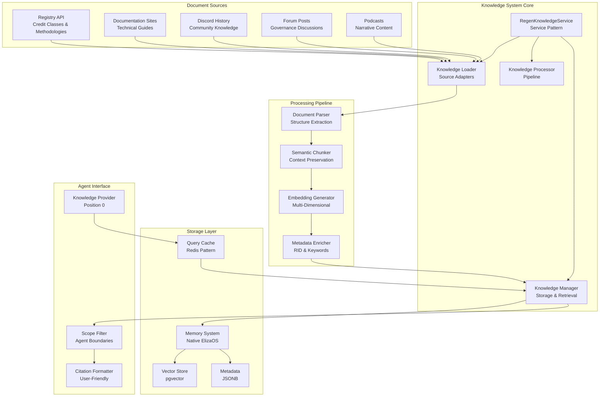
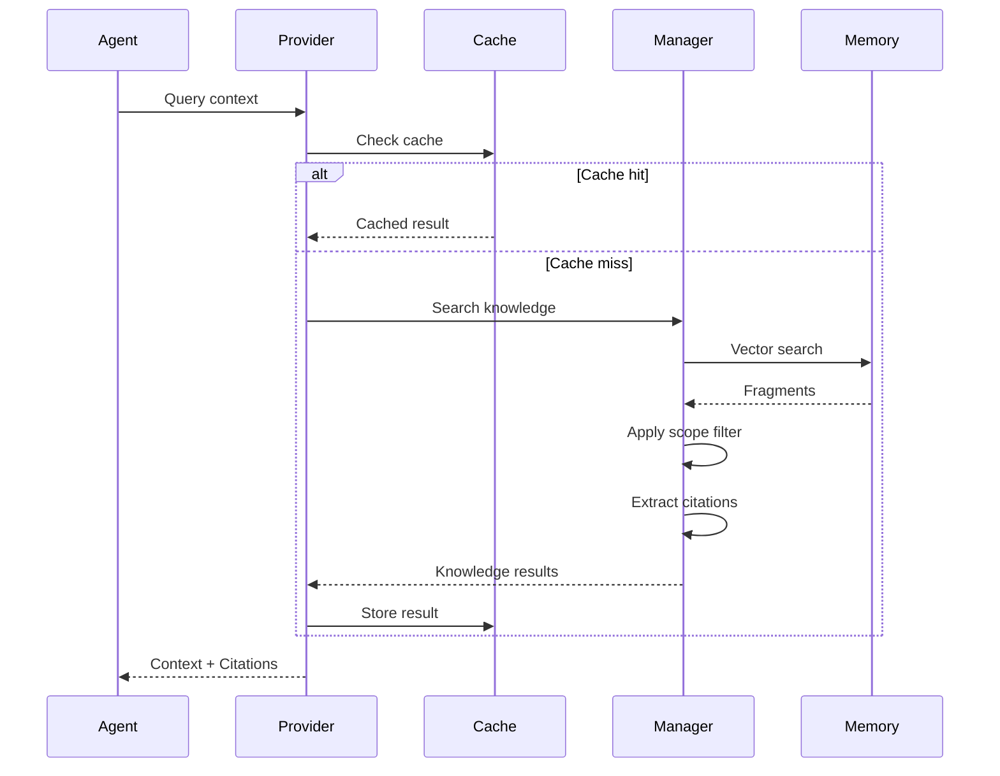
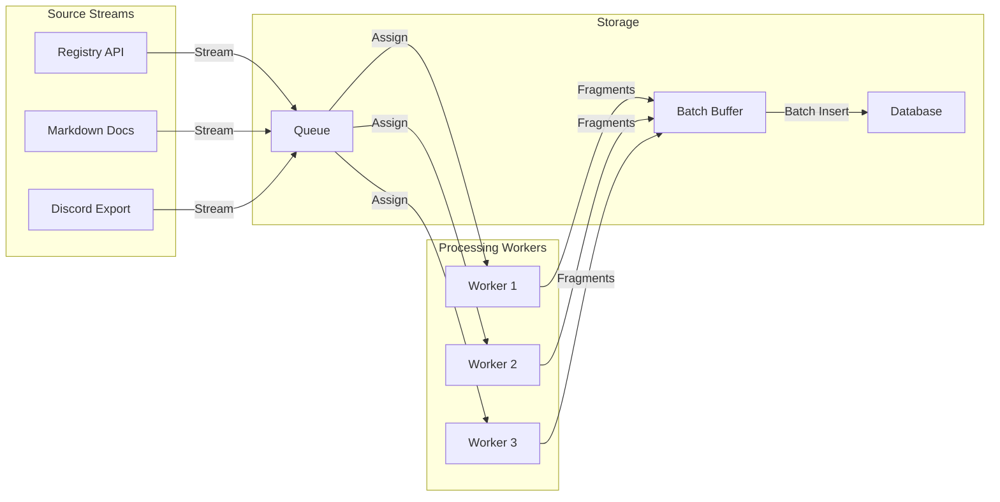
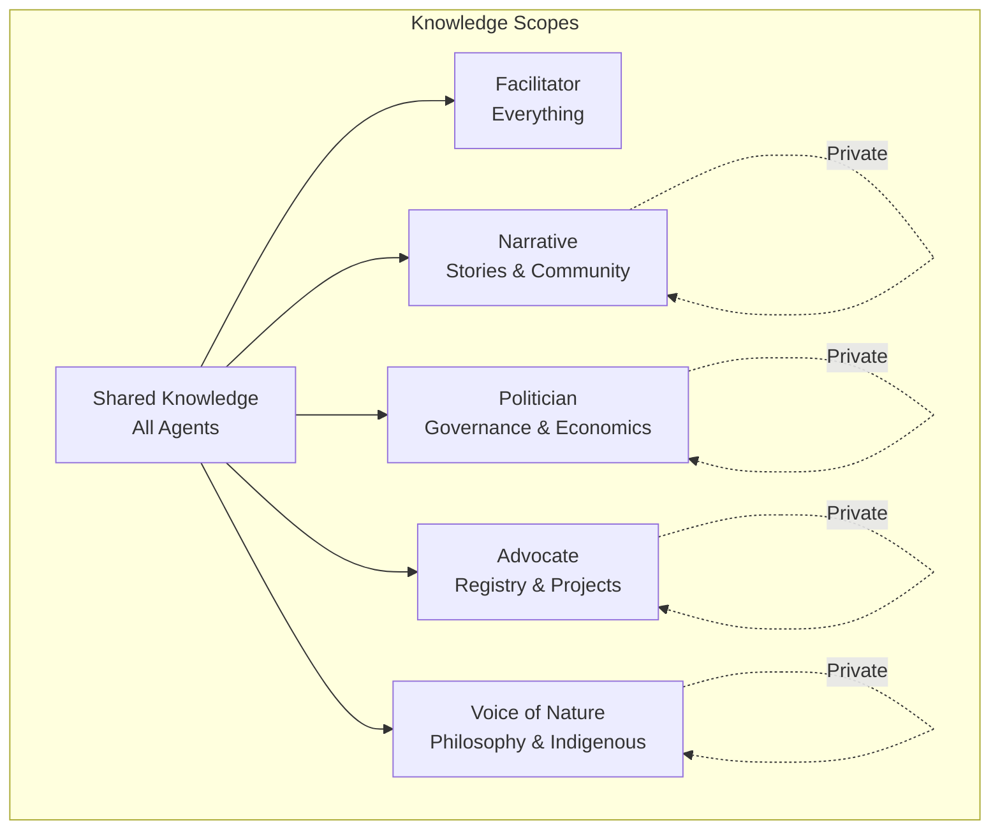

# Knowledge System Design

## Design Vision

The Knowledge System transforms ElizaOS from a conversational platform into a knowledge-driven intelligence system. By leveraging the discovered FragmentMetadata capabilities and multi-dimensional embeddings, we create a living knowledge fabric that enables 5 specialized agents to serve Regen Network's regenerative mission with mathematical precision and unbreakable trust.

## Problem Statement

We need to transform 15,000+ heterogeneous documents (registry methodologies, governance proposals, Discord conversations, blog posts, podcasts) into queryable, citable knowledge that supports 100,000+ interactions in 60 days. Current challenges include:

- **Heterogeneous Sources**: Each document type requires specialized extraction
- **Scale Requirements**: 15,000+ documents with sub-2-second query performance
- **Trust Requirements**: 95% citation accuracy with traceable sources
- **Multi-Agent Coordination**: 5 agents with different knowledge needs and scopes

## Design Philosophy

### 1. Native Pattern Extension
We discovered ElizaOS has sophisticated built-in capabilities:
- `FragmentMetadata` with required `documentId` and `position` fields
- Multi-dimensional embedding support (6 different sizes)
- Provider caching and state composition
- Memory lifecycle management

**Design Decision**: Extend these patterns rather than build parallel systems.

### 2. Trust Through Traceability
Every piece of knowledge must be traceable to its source through KOI (Knowledge Organization Infrastructure) RIDs.

**Design Decision**: Embed RIDs in memory metadata for unbreakable citation chains.

### 3. Performance by Design
Sub-2-second responses for 100,000+ interactions requires careful optimization.

**Design Decision**: Multi-dimensional embeddings, native caching, and batch processing.

## System Architecture



## Core Components

### RegenKnowledgeService

**Purpose**: Central orchestrator implementing ElizaOS Service pattern

**Key Design Elements**:
- Implements `Service` interface for lifecycle management
- Manages document processing pipeline
- Coordinates batch operations
- Provides monitoring and metrics

**Interface Design**:
```typescript
interface RegenKnowledgeService extends Service {
  // Service lifecycle
  start(runtime: IAgentRuntime): Promise<RegenKnowledgeService>;
  stop(): Promise<void>;
  
  // Document processing
  processDocuments(sources: DocumentSource[]): Promise<ProcessingResult>;
  
  // Knowledge operations
  searchKnowledge(query: string, options: SearchOptions): Promise<KnowledgeResult[]>;
  validateKnowledge(fragmentId: UUID): Promise<ValidationResult>;
  
  // Monitoring
  getMetrics(): KnowledgeMetrics;
  getProgress(): ProcessingProgress;
}
```

### Document Processing Pipeline

**Purpose**: Transform heterogeneous sources into structured knowledge

**Pipeline Stages**:
1. **Source Extraction**: Specialized adapters for each source type
2. **Document Parsing**: Structure extraction preserving hierarchy
3. **Semantic Chunking**: Context-aware splitting with overlap
4. **Embedding Generation**: Multi-dimensional based on content
5. **Metadata Enrichment**: RID generation, keyword extraction

**Key Innovation**: Content-aware dimension selection
```
Factual content → 384d embeddings (fast retrieval)
Technical docs → 512d embeddings (balanced)
Narrative content → 768d embeddings (semantic richness)
Governance docs → 1024d embeddings (complex relationships)
```

### Knowledge Storage Design

**Purpose**: Efficient storage using native ElizaOS patterns

**Storage Strategy**:
- Primary: ElizaOS Memory system with FragmentMetadata
- Embeddings: Multi-dimensional vectors in pgvector
- Metadata: JSONB for flexible querying
- Relationships: Graph-like navigation through fragment links

**Memory Schema Extension**:
```typescript
interface KnowledgeMemory extends Memory {
  // Standard Memory fields
  id: UUID;
  content: { text: string; source: string; url?: string };
  embedding: number[];
  
  // FragmentMetadata (required)
  metadata: {
    type: 'fragment';
    documentId: UUID;
    position: number;
    
    // Knowledge extensions
    rid: string;                  // KOI reference
    confidence: number;           // 0-1 score
    knowledgeDomain: string;      // Classification
    keywords: string[];           // Search optimization
    entities: string[];           // Named entities
    
    // Navigation
    parentFragment?: UUID;
    childFragments?: UUID[];
    relatedFragments?: UUID[];
  };
}
```

### Knowledge Provider Design

**Purpose**: Integrate knowledge into agent runtime

**Provider Characteristics**:
- **Position 0**: Executes first to provide foundational context
- **Dynamic**: Auto-discoverable by agents
- **Cached**: Results cached per message ID
- **Scoped**: Respects agent knowledge boundaries

**Provider Flow**:


## Data Flow Patterns

### Document Ingestion Flow

**Design**: Streaming pipeline with parallel processing



### Query Processing Flow

**Design**: Optimized retrieval with caching

1. Query arrives at Knowledge Provider
2. Check message-level cache
3. Generate query embedding
4. Search memories with vector similarity
5. Filter by agent scope
6. Extract and format citations
7. Cache result
8. Return to agent

## Performance Optimizations

### Multi-Dimensional Embedding Strategy

**Rationale**: Different content types have different semantic complexity

**Implementation**:
- Analyze content characteristics (technical density, structure, narrative)
- Select optimal dimension for balance of speed and accuracy
- Store dimension used in metadata for query optimization

### Caching Architecture

**Three-Level Cache**:
1. **Message Cache**: Per-message results (immediate)
2. **Query Cache**: Common queries (5-minute TTL)
3. **Embedding Cache**: Permanent storage

### Batch Processing

**Design Decisions**:
- Batch size: 100 documents (optimal for memory)
- Concurrency: 5 workers (respects API limits)
- Transaction size: 1000 fragments (database efficiency)

## Multi-Agent Knowledge Distribution

### Scope Design



### Access Control
- Shared: Core Regen Network facts
- Agent-specific: Specialized domain knowledge
- Private: Agent learning and adaptations

## Error Handling & Recovery

### Resilience Patterns

1. **Retry with Backoff**: Transient failures
2. **Fallback Processing**: Degraded extraction
3. **Quarantine**: Failed documents for review
4. **Circuit Breaker**: Protect external APIs

### Error Categories
- **Recoverable**: Rate limits, timeouts
- **Degradable**: Parsing errors, partial content
- **Fatal**: Invalid sources, corrupted data

## Monitoring & Observability

### Key Metrics
- **Processing**: docs/minute, fragments/doc
- **Storage**: total fragments, size growth
- **Performance**: query latency (p50, p95, p99)
- **Quality**: citation accuracy, validation failures

### Dashboards
- Real-time processing status
- Knowledge coverage heatmap
- Agent query patterns
- Performance trends

## Security Considerations

### Data Protection
- Scope-based access control
- Audit logging for all queries
- PII detection and masking
- Encryption at rest

### API Security
- Rate limiting per source
- Authentication for external APIs
- Secure credential storage

## Future Extensibility

### Phase 2 Considerations
- Dynamic knowledge updates
- Inter-agent knowledge sharing
- User feedback integration
- Advanced reasoning chains

### API Design
- RESTful endpoints for external access
- GraphQL for complex queries
- WebSocket for real-time updates

## Success Criteria

1. **Functional Success**
   - 15,000+ documents processed
   - All 5 agents accessing knowledge
   - Citations working end-to-end

2. **Performance Success**
   - Sub-2-second query response
   - 100 concurrent queries supported
   - <8GB memory usage

3. **Quality Success**
   - 95% citation accuracy
   - No hallucinated sources
   - User trust established

---

*This design establishes the vision and approach for transforming ElizaOS into a knowledge-driven platform that serves the regenerative mission with precision and trust.*