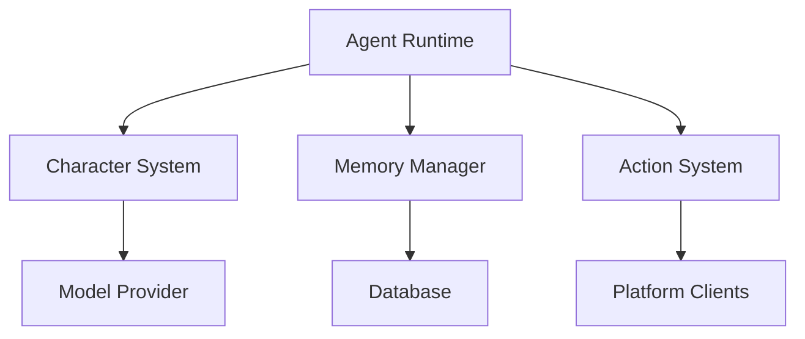
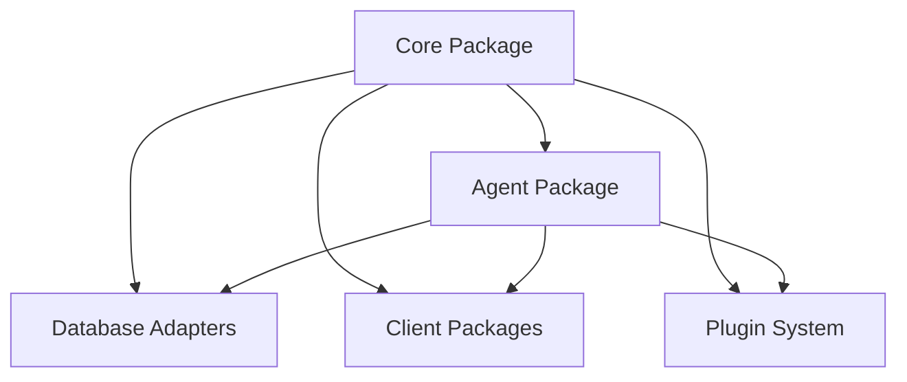
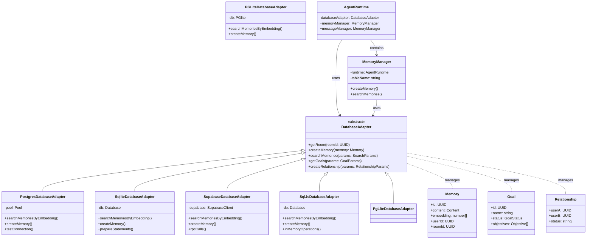
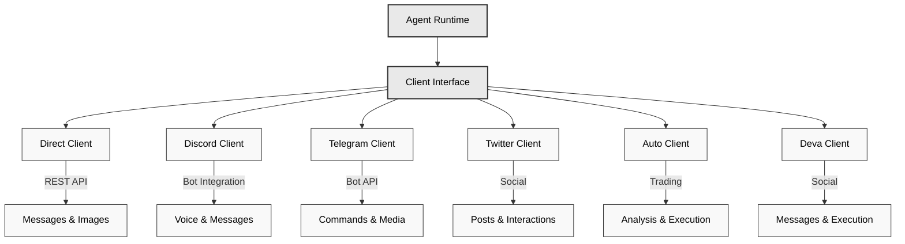
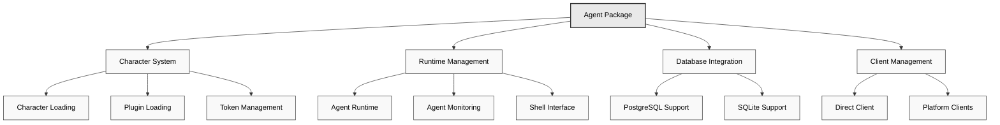

Project Path: docs

Source Tree:

```
docs
├── docs
│   ├── intro.md
│   ├── contributing.md
│   ├── faq.md
│   ├── api
│   │   ├── interfaces
│   │   │   ├── IVideoService.md
│   │   │   ├── Participant.md
│   │   │   ├── ISpeechService.md
│   │   │   ├── IMemoryManager.md
│   │   │   ├── ITranscriptionService.md
│   │   │   ├── Relationship.md
│   │   │   ├── Room.md
│   │   │   ├── State.md
│   │   │   ├── MessageExample.md
│   │   │   ├── Content.md
│   │   │   ├── Action.md
│   │   │   ├── Memory.md
│   │   │   ├── Evaluator.md
│   │   │   ├── ConversationExample.md
│   │   │   ├── Objective.md
│   │   │   ├── Provider.md
│   │   │   ├── IBrowserService.md
│   │   │   ├── Goal.md
│   │   │   ├── IAgentRuntime.md
│   │   │   ├── Account.md
│   │   │   ├── IImageDescriptionService.md
│   │   │   ├── IDatabaseAdapter.md
│   │   │   ├── ActionExample.md
│   │   │   ├── ITextGenerationService.md
│   │   │   ├── EvaluationExample.md
│   │   │   ├── IPdfService.md
│   │   │   └── Actor.md
│   │   ├── globals.md
│   │   ├── classes
│   │   │   ├── MemoryManager.md
│   │   │   ├── DatabaseAdapter.md
│   │   │   ├── Service.md
│   │   │   └── AgentRuntime.md
│   │   ├── variables
│   │   │   ├── defaultCharacter.md
│   │   │   ├── embeddingDimension.md
│   │   │   ├── evaluationTemplate.md
│   │   │   ├── embeddingZeroVector.md
│   │   │   ├── settings.md
│   │   │   └── elizaLogger.md
│   │   ├── enumerations
│   │   │   ├── ModelClass.md
│   │   │   ├── ModelProviderName.md
│   │   │   ├── ServiceType.md
│   │   │   ├── GoalStatus.md
│   │   │   └── Clients.md
│   │   ├── functions
│   │   │   ├── formatEvaluators.md
│   │   │   ├── generateShouldRespond.md
│   │   │   ├── getRelationship.md
│   │   │   ├── createGoal.md
│   │   │   ├── composeContext.md
│   │   │   ├── loadEnvConfig.md
│   │   │   ├── formatTimestamp.md
│   │   │   ├── generateTrueOrFalse.md
│   │   │   ├── splitChunks.md
│   │   │   ├── formatEvaluatorNames.md
│   │   │   ├── generateMessageResponse.md
│   │   │   ├── composeActionExamples.md
│   │   │   ├── generateObject.md
│   │   │   ├── createRelationship.md
│   │   │   ├── formatPosts.md
│   │   │   ├── generateObjectArray.md
│   │   │   ├── getProviders.md
│   │   │   ├── getEndpoint.md
│   │   │   ├── getActorDetails.md
│   │   │   ├── formatGoalsAsString.md
│   │   │   ├── generateCaption.md
│   │   │   ├── formatMessages.md
│   │   │   ├── formatRelationships.md
│   │   │   ├── formatEvaluatorExampleDescriptions.md
│   │   │   ├── addHeader.md
│   │   │   ├── retrieveCachedEmbedding.md
│   │   │   ├── updateGoal.md
│   │   │   ├── generateText.md
│   │   │   ├── generateImage.md
│   │   │   ├── embed.md
│   │   │   ├── formatActors.md
│   │   │   ├── trimTokens.md
│   │   │   ├── findNearestEnvFile.md
│   │   │   ├── formatActions.md
│   │   │   ├── getRelationships.md
│   │   │   ├── formatEvaluatorExamples.md
│   │   │   ├── formatActionNames.md
│   │   │   ├── getGoals.md
│   │   │   ├── generateTextArray.md
│   │   │   └── getModel.md
│   │   ├── type-aliases
│   │   │   ├── Handler.md
│   │   │   ├── Client.md
│   │   │   ├── Model.md
│   │   │   ├── Plugin.md
│   │   │   ├── UUID.md
│   │   │   ├── Validator.md
│   │   │   ├── HandlerCallback.md
│   │   │   ├── Models.md
│   │   │   ├── Character.md
│   │   │   └── Media.md
│   │   └── index.md
│   ├── core
│   │   ├── agents.md
│   │   ├── evaluators.md
│   │   ├── providers.md
│   │   ├── characterfile.md
│   │   └── actions.md
│   ├── packages
│   │   ├── plugins.md
│   │   ├── core.md
│   │   ├── agents.md
│   │   ├── database-adapters.md
│   │   ├── packages.md
│   │   ├── adapters.md
│   │   ├── clients.md
│   │   └── agent.md
│   ├── quickstart.md
│   ├── advanced
│   │   ├── fine-tuning.md
│   │   ├── infrastructure.md
│   │   ├── trust-engine.md
│   │   ├── autonomous-trading.md
│   │   ├── verified-inference.md
│   │   └── eliza-in-tee.md
│   └── guides
│       ├── start-script.md
│       ├── local-development.md
│       ├── configuration.md
│       ├── template-configuration.md
│       ├── docker-setup.md
│       ├── advanced.md
│       ├── secrets-management.md
│       └── wsl.md
├── api
│   ├── interfaces
│   │   ├── IVideoService.md
│   │   ├── IDatabaseCacheAdapter.md
│   │   ├── Participant.md
│   │   ├── ISpeechService.md
│   │   ├── ICacheManager.md
│   │   ├── IMemoryManager.md
│   │   ├── ITranscriptionService.md
│   │   ├── Relationship.md
│   │   ├── Room.md
│   │   ├── State.md
│   │   ├── MessageExample.md
│   │   ├── Content.md
│   │   ├── Action.md
│   │   ├── Memory.md
│   │   ├── ActionResponse.md
│   │   ├── Evaluator.md
│   │   ├── ConversationExample.md
│   │   ├── Objective.md
│   │   ├── Provider.md
│   │   ├── IBrowserService.md
│   │   ├── ICacheAdapter.md
│   │   ├── Goal.md
│   │   ├── ISlackService.md
│   │   ├── IAgentRuntime.md
│   │   ├── IAwsS3Service.md
│   │   ├── Account.md
│   │   ├── IImageDescriptionService.md
│   │   ├── IDatabaseAdapter.md
│   │   ├── ActionExample.md
│   │   ├── ITextGenerationService.md
│   │   ├── GenerationOptions.md
│   │   ├── EvaluationExample.md
│   │   ├── IAgentConfig.md
│   │   ├── IPdfService.md
│   │   ├── Actor.md
│   │   └── ModelConfiguration.md
│   ├── classes
│   │   ├── MemoryManager.md
│   │   ├── DatabaseAdapter.md
│   │   ├── DbCacheAdapter.md
│   │   ├── MemoryCacheAdapter.md
│   │   ├── FsCacheAdapter.md
│   │   ├── Service.md
│   │   ├── CacheManager.md
│   │   └── AgentRuntime.md
│   ├── variables
│   │   ├── defaultCharacter.md
│   │   ├── models.md
│   │   ├── booleanFooter.md
│   │   ├── knowledge.md
│   │   ├── envSchema.md
│   │   ├── evaluationTemplate.md
│   │   ├── stringArrayFooter.md
│   │   ├── EmbeddingProvider.md
│   │   ├── postActionResponseFooter.md
│   │   ├── settings.md
│   │   ├── shouldRespondFooter.md
│   │   ├── CharacterSchema.md
│   │   ├── elizaLogger.md
│   │   └── messageCompletionFooter.md
│   ├── enumerations
│   │   ├── CacheStore.md
│   │   ├── TokenizerType.md
│   │   ├── ModelClass.md
│   │   ├── ModelProviderName.md
│   │   ├── TranscriptionProvider.md
│   │   ├── ServiceType.md
│   │   ├── GoalStatus.md
│   │   ├── LoggingLevel.md
│   │   └── Clients.md
│   ├── functions
│   │   ├── formatEvaluators.md
│   │   ├── generateShouldRespond.md
│   │   ├── getRelationship.md
│   │   ├── parseJSONObjectFromText.md
│   │   ├── createGoal.md
│   │   ├── composeRandomUser.md
│   │   ├── composeContext.md
│   │   ├── loadEnvConfig.md
│   │   ├── formatTimestamp.md
│   │   ├── generateTrueOrFalse.md
│   │   ├── splitChunks.md
│   │   ├── hasEnvVariable.md
│   │   ├── validateEnv.md
│   │   ├── formatEvaluatorNames.md
│   │   ├── generateMessageResponse.md
│   │   ├── composeActionExamples.md
│   │   ├── configureSettings.md
│   │   ├── generateObject.md
│   │   ├── createRelationship.md
│   │   ├── formatPosts.md
│   │   ├── generateObjectArray.md
│   │   ├── generateObjectDeprecated.md
│   │   ├── getProviders.md
│   │   ├── getEndpoint.md
│   │   ├── getEmbeddingConfig.md
│   │   ├── stringToUuid.md
│   │   ├── getActorDetails.md
│   │   ├── generateWebSearch.md
│   │   ├── formatGoalsAsString.md
│   │   ├── generateCaption.md
│   │   ├── formatMessages.md
│   │   ├── formatRelationships.md
│   │   ├── formatEvaluatorExampleDescriptions.md
│   │   ├── addHeader.md
│   │   ├── getEnvVariable.md
│   │   ├── updateGoal.md
│   │   ├── generateText.md
│   │   ├── generateImage.md
│   │   ├── embed.md
│   │   ├── formatActors.md
│   │   ├── validateCharacterConfig.md
│   │   ├── trimTokens.md
│   │   ├── parseShouldRespondFromText.md
│   │   ├── findNearestEnvFile.md
│   │   ├── formatActions.md
│   │   ├── generateTweetActions.md
│   │   ├── parseJsonArrayFromText.md
│   │   ├── getRelationships.md
│   │   ├── getEmbeddingType.md
│   │   ├── parseBooleanFromText.md
│   │   ├── formatEvaluatorExamples.md
│   │   ├── parseActionResponseFromText.md
│   │   ├── formatActionNames.md
│   │   ├── getEmbeddingZeroVector.md
│   │   ├── handleProvider.md
│   │   ├── getGoals.md
│   │   ├── generateTextArray.md
│   │   └── getModel.md
│   ├── type-aliases
│   │   ├── Handler.md
│   │   ├── SearchResult.md
│   │   ├── Client.md
│   │   ├── Model.md
│   │   ├── EnvConfig.md
│   │   ├── CacheOptions.md
│   │   ├── SearchResponse.md
│   │   ├── KnowledgeItem.md
│   │   ├── Plugin.md
│   │   ├── CharacterConfig.md
│   │   ├── UUID.md
│   │   ├── EmbeddingConfig.md
│   │   ├── Validator.md
│   │   ├── HandlerCallback.md
│   │   ├── Models.md
│   │   ├── EmbeddingProviderType.md
│   │   ├── SearchImage.md
│   │   ├── TelemetrySettings.md
│   │   ├── Character.md
│   │   └── Media.md
│   └── index.md
├── README.md
├── src
│   └── pages
│       └── markdown-page.md
└── community
    ├── ai-dev-school
    │   ├── part3.md
    │   ├── index.md
    │   ├── part1.md
    │   └── part2.md
    ├── Discord
    │   └── index.md
    ├── Contributors
    │   ├── eliza-council.md
    │   ├── index.md
    │   ├── weekly-contributor-meeting
    │   │   ├── 2025-01-07.md
    │   │   ├── 2024-12-31.md
    │   │   ├── 2024-12-10.md
    │   │   └── 2025-01-14.md
    │   └── inspiration.md
    ├── Notes
    │   ├── cookbook.md
    │   ├── lore.md
    │   └── murad2049.md
    ├── creator-fund.md
    ├── index.md
    ├── faq-and-support.md
    ├── awesome-eliza.md
    ├── Streams
    │   ├── 10-2024
    │   │   ├── 2024-10-29.md
    │   │   ├── 2024-10-27.md
    │   │   └── 2024-10-25.md
    │   ├── index.md
    │   ├── 12-2024
    │   │   ├── 2024-12-05.md
    │   │   ├── 2024-12-27.md
    │   │   ├── 2024-12-01.md
    │   │   ├── 2024-12-11.md
    │   │   ├── 2024-12-20.md
    │   │   ├── 2024-12-06.md
    │   │   ├── greenpill
    │   │   │   └── index.md
    │   │   ├── 2024-12-03.md
    │   │   ├── 2024-12-17.md
    │   │   ├── 2024-12-10.md
    │   │   └── 2024-12-13.md
    │   ├── 11-2024
    │   │   ├── 2024-11-22.md
    │   │   ├── 2024-11-24.md
    │   │   ├── 2024-11-26.md
    │   │   ├── 2024-11-06.md
    │   │   ├── 2024-11-10.md
    │   │   ├── 2024-11-08.md
    │   │   ├── 2024-11-28.md
    │   │   ├── 2024-11-15.md
    │   │   ├── 2024-11-21.md
    │   │   └── 2024-11-29.md
    │   └── 01-2025
    │       ├── 2025-01-10.md
    │       ├── 2025-01-03.md
    │       ├── 2025-01-17.md
    │       └── 2025-01-24.md
    └── ai16z
        ├── pmairca
        │   └── index.md
        ├── degenai
        │   └── index.md
        └── index.md

```

`/home/ygg/Workspace/Eliza/GAIAv0.1.9/docs/docs/intro.md`:

```md
---
sidebar_position: 1
---

# Introduction to Eliza


_As seen powering [@DegenSpartanAI](https://x.com/degenspartanai) and [@MarcAIndreessen](https://x.com/pmairca)_

## What is Eliza?

Eliza is a powerful multi-agent simulation framework designed to create, deploy, and manage autonomous AI agents. Built with TypeScript, it provides a flexible and extensible platform for developing intelligent agents that can interact across multiple platforms while maintaining consistent personalities and knowledge.

## Key Features

### Core Capabilities

- **Multi-Agent Architecture**: Deploy and manage multiple unique AI personalities simultaneously
- **Character System**: Create diverse agents using the [characterfile](https://github.com/lalalune/characterfile/) framework
- **Memory Management**: Advanced RAG (Retrieval Augmented Generation) system for long-term memory and context awareness
- **Platform Integration**: Seamless connectivity with Discord, Twitter, and other platforms

### Communication & Media

- **Multi-Platform Support**:

    - Full-featured Discord integration with voice channel support
    - Twitter/X bot capabilities
    - Telegram integration
    - Direct API access

- **Media Processing**:
    - PDF document reading and analysis
    - Link content extraction and summarization
    - Audio transcription
    - Video content processing
    - Image analysis and description
    - Conversation summarization

### AI & Technical Features

- **Flexible Model Support**:

    - Local inference with open-source models
    - Cloud-based inference through OpenAI
    - Default configuration with Nous Hermes Llama 3.1B
    - Integration with Claude for complex queries

- **Technical Foundation**:
    - 100% TypeScript implementation
    - Modular architecture
    - Extensible action system
    - Custom client support
    - Comprehensive API

## Use Cases

Eliza can be used to create:

1. **AI Assistants**

    - Customer support agents
    - Community moderators
    - Personal assistants

2. **Social Media Personas**

    - Automated content creators
    - Engagement bots
    - Brand representatives

3. **Knowledge Workers**

    - Research assistants
    - Content analysts
    - Document processors

4. **Interactive Characters**
    - Role-playing characters
    - Educational tutors
    - Entertainment bots

## Getting Started

Eliza is designed to be accessible while maintaining powerful capabilities:

- **Quick Start**: Begin with basic configuration and default character
- **Customization**: Extend functionality through custom actions and clients
- **Scaling**: Deploy multiple agents with different personalities
- **Integration**: Connect to various platforms and services

Check out our [Quickstart Guide](./quickstart.md) to begin your journey with Eliza.

## Architecture Overview



## Community and Support

Eliza is backed by an active community of developers and users:

- **Open Source**: Contribute to the project on [GitHub](https://github.com/elizaos/eliza)
- **Documentation**: Comprehensive guides and API references
- **Examples**: Ready-to-use character templates and implementations
- **Support**: Active community for troubleshooting and discussion

## Next Steps

- [Create Your First Agent](../quickstart)
- [Understand Core Concepts](../core/agents)
- [Explore Advanced Features](./guides/advanced.md)

Join us in building the future of autonomous AI agents with Eliza!

```

`/home/ygg/Workspace/Eliza/GAIAv0.1.9/docs/docs/contributing.md`:

```md
# Contributing to Eliza

First off, thank you for considering contributing to Eliza! We welcome contributions from everyone, regardless of experience level.

## Contribution License Agreement

By contributing to Eliza, you agree that your contributions will be licensed under the MIT License. This means:

1. You grant us (and everyone else) a perpetual, worldwide, non-exclusive, royalty-free license to use your contributions.
2. Your contributions are and will be available as Free and Open Source Software (FOSS).
3. You have the right to submit the work under this license.
4. You understand that your contributions are public and that a record of the contribution is maintained indefinitely.

## The OODA Loop: A Framework for Contribution

We believe in the power of the OODA Loop - a decision-making framework that emphasizes speed and adaptability. OODA stands for:

- **Observe**: Gather information and insights about the project, the community, and the broader AI ecosystem.
- **Orient**: Analyze your observations to identify opportunities for contribution and improvement.
- **Decide**: Choose a course of action based on your analysis. This could be proposing a new feature, fixing a bug, or creating content.
- **Act**: Execute your decision and share your work with the community.

## How to Contribute

### For Developers

1. **Extend Eliza's Capabilities**

    - Develop new actions, evaluators, and providers
    - Improve existing components and modules

2. **Enhance Infrastructure**

    - Review open issues and submit PRs
    - Test and update documentation
    - Optimize performance
    - Improve deployment solutions

3. Fork the repo and create your branch from `main`.
    1. The name of the branch should start with the issue number and be descriptive of the changes you are making.
    2. Example: 9999--add-test-for-bug-123
4. If you've added code that should be tested, add tests.
5. Ensure the test suite passes.
6. Make sure your code lints.
7. Issue that pull request!

## Styleguides

### Git Commit Messages

- Use the present tense ("Add feature" not "Added feature")
- Use the imperative mood ("Move cursor to..." not "Moves cursor to...")
- Limit the first line to 72 characters or less
- Reference issues and pull requests liberally after the first line

### JavaScript Styleguide

- All JavaScript must adhere to [JavaScript Standard Style](https://standardjs.com/).

### TypeScript Styleguide

- All TypeScript must adhere to [TypeScript Standard Style](https://github.com/standard/ts-standard).

### Documentation Styleguide

- Use [Markdown](https://daringfireball.net/projects/markdown/) for documentation.

## Additional Notes

### Issue and Pull Request Labels

This section lists the labels we use to help us track and manage issues and pull requests.

- `bug` - Issues that are bugs.
- `enhancement` - Issues that are feature requests.
- `documentation` - Issues or pull requests related to documentation.
- `good first issue` - Good for newcomers.

## Getting Help

- Join [Discord](https://discord.gg/ai16z)
- Check [FAQ](faq.md)
- Create GitHub issues

## Additional Resources

- [Local Development Guide](guides/local-development.md)
- [Configuration Guide](guides/configuration.md)
- [API Documentation](api)

## Contributor Guide

Welcome to the Eliza contributor guide! This document is designed to help you understand how you can be part of building the future of autonomous AI agents, regardless of your technical background.

### Code of Conduct

#### Our Pledge

In the interest of fostering an open and welcoming environment, we as contributors and maintainers pledge to make participation in our project and our community a harassment-free experience for everyone, regardless of age, body size, disability, ethnicity, sex characteristics, gender identity and expression, level of experience, education, socio-economic status, nationality, personal appearance, race, religion, or sexual identity and orientation.

#### Our Standards

Examples of behavior that contributes to creating a positive environment include:

- Using welcoming and inclusive language
- Being respectful of differing viewpoints and experiences
- Gracefully accepting constructive criticism
- Focusing on what is best for the community
- Showing empathy towards other community members

Examples of unacceptable behavior include:

- The use of sexualized language or imagery and unwelcome sexual attention or advances
- Trolling, insulting/derogatory comments, and personal or political attacks
- Public or private harassment
- Publishing others' private information without explicit permission
- Other conduct which could reasonably be considered inappropriate in a professional setting

#### Our Responsibilities

Project maintainers are responsible for clarifying the standards of acceptable behavior and are expected to take appropriate and fair corrective action in response to any instances of unacceptable behavior.

Project maintainers have the right and responsibility to remove, edit, or reject comments, commits, code, wiki edits, issues, and other contributions that are not aligned to this Code of Conduct, or to ban temporarily or permanently any contributor for other behaviors that they deem inappropriate, threatening, offensive, or harmful.

#### Scope

This Code of Conduct applies both within project spaces and in public spaces when an individual is representing the project or its community. Examples of representing a project or community include using an official project e-mail address, posting via an official social media account, or acting as an appointed representative at an online or offline event.

Thank you for contributing to Eliza and helping build the future of autonomous AI agents! 🎉

```

`/home/ygg/Workspace/Eliza/GAIAv0.1.9/docs/docs/faq.md`:

```md
# Frequently Asked Questions

## Eliza FAQ

### What is Eliza?

**Eliza is an open-source, multi-agent simulation framework for creating and managing autonomous AI agents.** The project aims to empower developers and users to build unique AI personalities that can interact across various platforms, such as Discord, Twitter, and Telegram.

### Who is behind Eliza?

The Eliza project is led by [Shaw](https://x.com/shawmakesmagic). The project is open source, and its code is available on GitHub: https://github.com/elizaos/eliza

### How can I get started with Eliza?

To begin building your own AI agents with Eliza, follow these steps:

1.  **Install Python, Node.js and pnpm**: Ensure you have the necessary software prerequisites installed on your system. We use node v23.
2.  **Set up your environment**: Create a `.env` file and populate it with the required API keys, database configuration, and platform-specific tokens.
3.  **Install Eliza**: Use the command `npm install @elizaos/core` or `pnpm add @elizaos/core` to install the Eliza package.
4.  **Configure your database**: Eliza currently relies on Supabase for local development. Follow the instructions in the documentation to set up your Supabase project and database.
5.  **Define your agent's character**: Create a character file using the provided JSON format to specify your agent's personality, knowledge, and behavior.
6.  **Run Eliza locally**: Use the provided commands to start the Eliza framework and interact with your agent.

### What are the key components of Eliza?

Eliza's architecture consists of several interconnected components:

- **Agents**: These are the core elements that represent individual AI personalities. Agents operate within a runtime environment and interact with various platforms.
- **Actions**: Actions are predefined behaviors that agents can execute in response to messages, enabling them to perform tasks and interact with external systems.
- **Clients**: Clients act as interfaces between agents and specific platforms, such as Discord, Twitter, and Telegram. They handle platform-specific message formats and communication protocols.
- **Plugins**: Plugins are modular way to extend the core functionality with additional features, actions, evaluators, and providers. They are self-contained modules that can be easily added or removed to customize your agent's capabilities
- **Providers**: Providers supply agents with contextual information, including time awareness, user relationships, and data from external sources.
- **Evaluators**: These modules assess and extract information from conversations, helping agents track goals, build memory, and maintain context awareness.
- **Character Files**: These JSON files define the personality, knowledge, and behavior of each AI agent.
- **Memory System**: Eliza features a sophisticated memory management system that utilizes vector embeddings and relational database storage to store and retrieve information for agents.

### How can I contribute to the Eliza project?

Eliza welcomes contributions from individuals with a wide range of skills:

#### Technical Contributions

- **Develop new actions, clients, providers, and evaluators**: Extend Eliza's functionality by creating new modules or enhancing existing ones.
- **Contribute to database management**: Improve or expand Eliza's database capabilities using PostgreSQL, SQLite, or SQL.js.
- **Enhance local development workflows**: Improve documentation and tools for local development using SQLite and VS Code.
- **Fine-tune models**: Optimize existing models or implement new models for specific tasks and personalities.
- **Contribute to the autonomous trading system and trust engine**: Leverage expertise in market analysis, technical analysis, and risk management to enhance these features.

#### Non-Technical Contributions

- **Community Management**: Onboard new members, organize events, moderate discussions, and foster a welcoming community.
- **Content Creation**: Create memes, tutorials, documentation, and videos to share project updates.
- **Translation**: Translate documentation and other materials to make Eliza accessible to a global audience.
- **Domain Expertise**: Provide insights and feedback on specific applications of Eliza in various fields.

### What are the future plans for Eliza?

The Eliza project is continuously evolving, with ongoing development and community contributions. The team is actively working on:

- **Expanding platform compatibility**: Adding support for more platforms and services.
- **Improving model capabilities**: Enhance agent performance and capabilities with existing and new models.
- **Enhancing the trust engine**: Provide robust and secure recommendations within decentralized networks.
- **Fostering community growth**: Rewarding contributions to expand the project's reach and impact.

### How can I contribute to Eliza?

There are several ways to contribute to the Eliza project:

- **Participate in community discussions**: Share your memecoin insights, propose new ideas, and engage with other community members.
- **Contribute to the development of the Eliza platform**: https://github.com/orgs/elizaos/projects/1/views/3
- **Help build the Eliza ecosystem**: Create applications / tools, resources, and memes. Give feedback, and spread the word

```

`/home/ygg/Workspace/Eliza/GAIAv0.1.9/docs/docs/api/interfaces/IVideoService.md`:

```md
# Interface: IVideoService

## Extends

- [`Service`](../classes/Service.md)

## Methods

### downloadVideo()

> **downloadVideo**(`videoInfo`): `Promise`\<`string`\>

#### Parameters

• **videoInfo**: [`Media`](../type-aliases/Media.md)

#### Returns

`Promise`\<`string`\>

#### Defined in

[packages/core/src/types.ts:603](https://github.com/elizaos/eliza/blob/7fcf54e7fb2ba027d110afcc319c0b01b3f181dc/packages/core/src/types.ts#L603)

---

### fetchVideoInfo()

> **fetchVideoInfo**(`url`): `Promise`\<[`Media`](../type-aliases/Media.md)\>

#### Parameters

• **url**: `string`

#### Returns

`Promise`\<[`Media`](../type-aliases/Media.md)\>

#### Defined in

[packages/core/src/types.ts:602](https://github.com/elizaos/eliza/blob/7fcf54e7fb2ba027d110afcc319c0b01b3f181dc/packages/core/src/types.ts#L602)

---

### isVideoUrl()

> **isVideoUrl**(`url`): `boolean`

#### Parameters

• **url**: `string`

#### Returns

`boolean`

#### Defined in

[packages/core/src/types.ts:600](https://github.com/elizaos/eliza/blob/7fcf54e7fb2ba027d110afcc319c0b01b3f181dc/packages/core/src/types.ts#L600)

---

### processVideo()

> **processVideo**(`url`): `Promise`\<[`Media`](../type-aliases/Media.md)\>

#### Parameters

• **url**: `string`

#### Returns

`Promise`\<[`Media`](../type-aliases/Media.md)\>

#### Defined in

[packages/core/src/types.ts:601](https://github.com/elizaos/eliza/blob/7fcf54e7fb2ba027d110afcc319c0b01b3f181dc/packages/core/src/types.ts#L601)

```

`/home/ygg/Workspace/Eliza/GAIAv0.1.9/docs/docs/api/interfaces/Participant.md`:

```md
# Interface: Participant

Represents a participant in a room, including their ID and account details.

## Properties

### account

> **account**: [`Account`](Account.md)

#### Defined in

[packages/core/src/types.ts:286](https://github.com/elizaos/eliza/blob/7fcf54e7fb2ba027d110afcc319c0b01b3f181dc/packages/core/src/types.ts#L286)

---

### id

> **id**: \`$\{string\}-$\{string\}-$\{string\}-$\{string\}-$\{string\}\`

#### Defined in

[packages/core/src/types.ts:285](https://github.com/elizaos/eliza/blob/7fcf54e7fb2ba027d110afcc319c0b01b3f181dc/packages/core/src/types.ts#L285)

```

`/home/ygg/Workspace/Eliza/GAIAv0.1.9/docs/docs/api/interfaces/ISpeechService.md`:

```md
# Interface: ISpeechService

## Extends

- [`Service`](../classes/Service.md)

## Methods

### generate()

> **generate**(`runtime`, `text`): `Promise`\<`Readable`\>

#### Parameters

• **runtime**: [`IAgentRuntime`](IAgentRuntime.md)

• **text**: `string`

#### Returns

`Promise`\<`Readable`\>

#### Defined in

[packages/core/src/types.ts:638](https://github.com/elizaos/eliza/blob/7fcf54e7fb2ba027d110afcc319c0b01b3f181dc/packages/core/src/types.ts#L638)

```

`/home/ygg/Workspace/Eliza/GAIAv0.1.9/docs/docs/api/interfaces/IMemoryManager.md`:

```md
# Interface: IMemoryManager

## Properties

### constructor

> **constructor**: `Function`

#### Defined in

[packages/core/src/types.ts:470](https://github.com/elizaos/eliza/blob/7fcf54e7fb2ba027d110afcc319c0b01b3f181dc/packages/core/src/types.ts#L470)

---

### runtime

> **runtime**: [`IAgentRuntime`](IAgentRuntime.md)

#### Defined in

[packages/core/src/types.ts:467](https://github.com/elizaos/eliza/blob/7fcf54e7fb2ba027d110afcc319c0b01b3f181dc/packages/core/src/types.ts#L467)

---

### tableName

> **tableName**: `string`

#### Defined in

[packages/core/src/types.ts:468](https://github.com/elizaos/eliza/blob/7fcf54e7fb2ba027d110afcc319c0b01b3f181dc/packages/core/src/types.ts#L468)

## Methods

### addEmbeddingToMemory()

> **addEmbeddingToMemory**(`memory`): `Promise`\<[`Memory`](Memory.md)\>

#### Parameters

• **memory**: [`Memory`](Memory.md)

#### Returns

`Promise`\<[`Memory`](Memory.md)\>

#### Defined in

[packages/core/src/types.ts:472](https://github.com/elizaos/eliza/blob/7fcf54e7fb2ba027d110afcc319c0b01b3f181dc/packages/core/src/types.ts#L472)

---

### countMemories()

> **countMemories**(`roomId`, `unique`?): `Promise`\<`number`\>

#### Parameters

• **roomId**: \`$\{string\}-$\{string\}-$\{string\}-$\{string\}-$\{string\}\`

• **unique?**: `boolean`

#### Returns

`Promise`\<`number`\>

#### Defined in

[packages/core/src/types.ts:502](https://github.com/elizaos/eliza/blob/7fcf54e7fb2ba027d110afcc319c0b01b3f181dc/packages/core/src/types.ts#L502)

---

### createMemory()

> **createMemory**(`memory`, `unique`?): `Promise`\<`void`\>

#### Parameters

• **memory**: [`Memory`](Memory.md)

• **unique?**: `boolean`

#### Returns

`Promise`\<`void`\>

#### Defined in

[packages/core/src/types.ts:499](https://github.com/elizaos/eliza/blob/7fcf54e7fb2ba027d110afcc319c0b01b3f181dc/packages/core/src/types.ts#L499)

---

### getCachedEmbeddings()

> **getCachedEmbeddings**(`content`): `Promise`\<`object`[]\>

#### Parameters

• **content**: `string`

#### Returns

`Promise`\<`object`[]\>

#### Defined in

[packages/core/src/types.ts:481](https://github.com/elizaos/eliza/blob/7fcf54e7fb2ba027d110afcc319c0b01b3f181dc/packages/core/src/types.ts#L481)

---

### getMemories()

> **getMemories**(`opts`): `Promise`\<[`Memory`](Memory.md)[]\>

#### Parameters

• **opts**

• **opts.agentId?**: \`$\{string\}-$\{string\}-$\{string\}-$\{string\}-$\{string\}\`

• **opts.count?**: `number`

• **opts.end?**: `number`

• **opts.roomId**: \`$\{string\}-$\{string\}-$\{string\}-$\{string\}-$\{string\}\`

• **opts.start?**: `number`

• **opts.unique?**: `boolean`

#### Returns

`Promise`\<[`Memory`](Memory.md)[]\>

#### Defined in

[packages/core/src/types.ts:473](https://github.com/elizaos/eliza/blob/7fcf54e7fb2ba027d110afcc319c0b01b3f181dc/packages/core/src/types.ts#L473)

---

### getMemoriesByRoomIds()

> **getMemoriesByRoomIds**(`params`): `Promise`\<[`Memory`](Memory.md)[]\>

#### Parameters

• **params**

• **params.agentId?**: \`$\{string\}-$\{string\}-$\{string\}-$\{string\}-$\{string\}\`

• **params.roomIds**: \`$\{string\}-$\{string\}-$\{string\}-$\{string\}-$\{string\}\`[]

#### Returns

`Promise`\<[`Memory`](Memory.md)[]\>

#### Defined in

[packages/core/src/types.ts:485](https://github.com/elizaos/eliza/blob/7fcf54e7fb2ba027d110afcc319c0b01b3f181dc/packages/core/src/types.ts#L485)

---

### getMemoryById()

> **getMemoryById**(`id`): `Promise`\<[`Memory`](Memory.md)\>

#### Parameters

• **id**: \`$\{string\}-$\{string\}-$\{string\}-$\{string\}-$\{string\}\`

#### Returns

`Promise`\<[`Memory`](Memory.md)\>

#### Defined in

[packages/core/src/types.ts:484](https://github.com/elizaos/eliza/blob/7fcf54e7fb2ba027d110afcc319c0b01b3f181dc/packages/core/src/types.ts#L484)

---

### removeAllMemories()

> **removeAllMemories**(`roomId`): `Promise`\<`void`\>

#### Parameters

• **roomId**: \`$\{string\}-$\{string\}-$\{string\}-$\{string\}-$\{string\}\`

#### Returns

`Promise`\<`void`\>

#### Defined in

[packages/core/src/types.ts:501](https://github.com/elizaos/eliza/blob/7fcf54e7fb2ba027d110afcc319c0b01b3f181dc/packages/core/src/types.ts#L501)

---

### removeMemory()

> **removeMemory**(`memoryId`): `Promise`\<`void`\>

#### Parameters

• **memoryId**: \`$\{string\}-$\{string\}-$\{string\}-$\{string\}-$\{string\}\`

#### Returns

`Promise`\<`void`\>

#### Defined in

[packages/core/src/types.ts:500](https://github.com/elizaos/eliza/blob/7fcf54e7fb2ba027d110afcc319c0b01b3f181dc/packages/core/src/types.ts#L500)

---

### searchMemoriesByEmbedding()

> **searchMemoriesByEmbedding**(`embedding`, `opts`): `Promise`\<[`Memory`](Memory.md)[]\>

#### Parameters

• **embedding**: `number`[]

• **opts**

• **opts.agentId?**: \`$\{string\}-$\{string\}-$\{string\}-$\{string\}-$\{string\}\`

• **opts.count?**: `number`

• **opts.match_threshold?**: `number`

• **opts.roomId**: \`$\{string\}-$\{string\}-$\{string\}-$\{string\}-$\{string\}\`

• **opts.unique?**: `boolean`

#### Returns

`Promise`\<[`Memory`](Memory.md)[]\>

#### Defined in

[packages/core/src/types.ts:489](https://github.com/elizaos/eliza/blob/7fcf54e7fb2ba027d110afcc319c0b01b3f181dc/packages/core/src/types.ts#L489)

```

`/home/ygg/Workspace/Eliza/GAIAv0.1.9/docs/docs/api/interfaces/ITranscriptionService.md`:

```md
# Interface: ITranscriptionService

## Extends

- [`Service`](../classes/Service.md)

## Methods

### transcribe()

> **transcribe**(`audioBuffer`): `Promise`\<`string`\>

#### Parameters

• **audioBuffer**: `ArrayBuffer`

#### Returns

`Promise`\<`string`\>

#### Defined in

[packages/core/src/types.ts:595](https://github.com/elizaos/eliza/blob/7fcf54e7fb2ba027d110afcc319c0b01b3f181dc/packages/core/src/types.ts#L595)

---

### transcribeAttachment()

> **transcribeAttachment**(`audioBuffer`): `Promise`\<`string`\>

#### Parameters

• **audioBuffer**: `ArrayBuffer`

#### Returns

`Promise`\<`string`\>

#### Defined in

[packages/core/src/types.ts:591](https://github.com/elizaos/eliza/blob/7fcf54e7fb2ba027d110afcc319c0b01b3f181dc/packages/core/src/types.ts#L591)

---

### transcribeAttachmentLocally()

> **transcribeAttachmentLocally**(`audioBuffer`): `Promise`\<`string`\>

#### Parameters

• **audioBuffer**: `ArrayBuffer`

#### Returns

`Promise`\<`string`\>

#### Defined in

[packages/core/src/types.ts:592](https://github.com/elizaos/eliza/blob/7fcf54e7fb2ba027d110afcc319c0b01b3f181dc/packages/core/src/types.ts#L592)

---

### transcribeLocally()

> **transcribeLocally**(`audioBuffer`): `Promise`\<`string`\>

#### Parameters

• **audioBuffer**: `ArrayBuffer`

#### Returns

`Promise`\<`string`\>

#### Defined in

[packages/core/src/types.ts:596](https://github.com/elizaos/eliza/blob/7fcf54e7fb2ba027d110afcc319c0b01b3f181dc/packages/core/src/types.ts#L596)

```

`/home/ygg/Workspace/Eliza/GAIAv0.1.9/docs/docs/api/interfaces/Relationship.md`:

```md
# Interface: Relationship

Represents a relationship between two users, including their IDs, the status of the relationship, and the room ID in which the relationship is established.

## Properties

### createdAt?

> `optional` **createdAt**: `string`

#### Defined in

[packages/core/src/types.ts:266](https://github.com/elizaos/eliza/blob/7fcf54e7fb2ba027d110afcc319c0b01b3f181dc/packages/core/src/types.ts#L266)

---

### id

> **id**: \`$\{string\}-$\{string\}-$\{string\}-$\{string\}-$\{string\}\`

#### Defined in

[packages/core/src/types.ts:260](https://github.com/elizaos/eliza/blob/7fcf54e7fb2ba027d110afcc319c0b01b3f181dc/packages/core/src/types.ts#L260)

---

### roomId

> **roomId**: \`$\{string\}-$\{string\}-$\{string\}-$\{string\}-$\{string\}\`

#### Defined in

[packages/core/src/types.ts:264](https://github.com/elizaos/eliza/blob/7fcf54e7fb2ba027d110afcc319c0b01b3f181dc/packages/core/src/types.ts#L264)

---

### status

> **status**: `string`

#### Defined in

[packages/core/src/types.ts:265](https://github.com/elizaos/eliza/blob/7fcf54e7fb2ba027d110afcc319c0b01b3f181dc/packages/core/src/types.ts#L265)

---

### userA

> **userA**: \`$\{string\}-$\{string\}-$\{string\}-$\{string\}-$\{string\}\`

#### Defined in

[packages/core/src/types.ts:261](https://github.com/elizaos/eliza/blob/7fcf54e7fb2ba027d110afcc319c0b01b3f181dc/packages/core/src/types.ts#L261)

---

### userB

> **userB**: \`$\{string\}-$\{string\}-$\{string\}-$\{string\}-$\{string\}\`

#### Defined in

[packages/core/src/types.ts:262](https://github.com/elizaos/eliza/blob/7fcf54e7fb2ba027d110afcc319c0b01b3f181dc/packages/core/src/types.ts#L262)

---

### userId

> **userId**: \`$\{string\}-$\{string\}-$\{string\}-$\{string\}-$\{string\}\`

#### Defined in

[packages/core/src/types.ts:263](https://github.com/elizaos/eliza/blob/7fcf54e7fb2ba027d110afcc319c0b01b3f181dc/packages/core/src/types.ts#L263)

```

`/home/ygg/Workspace/Eliza/GAIAv0.1.9/docs/docs/api/interfaces/Room.md`:

```md
# Interface: Room

Represents a room or conversation context, including its ID and a list of participants.

## Properties

### id

> **id**: \`$\{string\}-$\{string\}-$\{string\}-$\{string\}-$\{string\}\`

#### Defined in

[packages/core/src/types.ts:293](https://github.com/elizaos/eliza/blob/7fcf54e7fb2ba027d110afcc319c0b01b3f181dc/packages/core/src/types.ts#L293)

---

### participants

> **participants**: [`Participant`](Participant.md)[]

#### Defined in

[packages/core/src/types.ts:294](https://github.com/elizaos/eliza/blob/7fcf54e7fb2ba027d110afcc319c0b01b3f181dc/packages/core/src/types.ts#L294)

```

`/home/ygg/Workspace/Eliza/GAIAv0.1.9/docs/docs/api/interfaces/State.md`:

```md
# Interface: State

Represents the state of the conversation or context in which the agent is operating, including information about users, messages, goals, and other relevant data.

## Indexable

\[`key`: `string`\]: `unknown`

## Properties

### actionExamples?

> `optional` **actionExamples**: `string`

#### Defined in

[packages/core/src/types.ts:155](https://github.com/elizaos/eliza/blob/7fcf54e7fb2ba027d110afcc319c0b01b3f181dc/packages/core/src/types.ts#L155)

---

### actionNames?

> `optional` **actionNames**: `string`

#### Defined in

[packages/core/src/types.ts:152](https://github.com/elizaos/eliza/blob/7fcf54e7fb2ba027d110afcc319c0b01b3f181dc/packages/core/src/types.ts#L152)

---

### actions?

> `optional` **actions**: `string`

#### Defined in

[packages/core/src/types.ts:153](https://github.com/elizaos/eliza/blob/7fcf54e7fb2ba027d110afcc319c0b01b3f181dc/packages/core/src/types.ts#L153)

---

### actionsData?

> `optional` **actionsData**: [`Action`](Action.md)[]

#### Defined in

[packages/core/src/types.ts:154](https://github.com/elizaos/eliza/blob/7fcf54e7fb2ba027d110afcc319c0b01b3f181dc/packages/core/src/types.ts#L154)

---

### actors

> **actors**: `string`

#### Defined in

[packages/core/src/types.ts:146](https://github.com/elizaos/eliza/blob/7fcf54e7fb2ba027d110afcc319c0b01b3f181dc/packages/core/src/types.ts#L146)

---

### actorsData?

> `optional` **actorsData**: [`Actor`](Actor.md)[]

#### Defined in

[packages/core/src/types.ts:147](https://github.com/elizaos/eliza/blob/7fcf54e7fb2ba027d110afcc319c0b01b3f181dc/packages/core/src/types.ts#L147)

---

### agentId?

> `optional` **agentId**: \`$\{string\}-$\{string\}-$\{string\}-$\{string\}-$\{string\}\`

#### Defined in

[packages/core/src/types.ts:138](https://github.com/elizaos/eliza/blob/7fcf54e7fb2ba027d110afcc319c0b01b3f181dc/packages/core/src/types.ts#L138)

---

### agentName?

> `optional` **agentName**: `string`

#### Defined in

[packages/core/src/types.ts:144](https://github.com/elizaos/eliza/blob/7fcf54e7fb2ba027d110afcc319c0b01b3f181dc/packages/core/src/types.ts#L144)

---

### bio

> **bio**: `string`

#### Defined in

[packages/core/src/types.ts:139](https://github.com/elizaos/eliza/blob/7fcf54e7fb2ba027d110afcc319c0b01b3f181dc/packages/core/src/types.ts#L139)

---

### goals?

> `optional` **goals**: `string`

#### Defined in

[packages/core/src/types.ts:148](https://github.com/elizaos/eliza/blob/7fcf54e7fb2ba027d110afcc319c0b01b3f181dc/packages/core/src/types.ts#L148)

---

### goalsData?

> `optional` **goalsData**: [`Goal`](Goal.md)[]

#### Defined in

[packages/core/src/types.ts:149](https://github.com/elizaos/eliza/blob/7fcf54e7fb2ba027d110afcc319c0b01b3f181dc/packages/core/src/types.ts#L149)

---

### lore

> **lore**: `string`

#### Defined in

[packages/core/src/types.ts:140](https://github.com/elizaos/eliza/blob/7fcf54e7fb2ba027d110afcc319c0b01b3f181dc/packages/core/src/types.ts#L140)

---

### messageDirections

> **messageDirections**: `string`

#### Defined in

[packages/core/src/types.ts:141](https://github.com/elizaos/eliza/blob/7fcf54e7fb2ba027d110afcc319c0b01b3f181dc/packages/core/src/types.ts#L141)

---

### postDirections

> **postDirections**: `string`

#### Defined in

[packages/core/src/types.ts:142](https://github.com/elizaos/eliza/blob/7fcf54e7fb2ba027d110afcc319c0b01b3f181dc/packages/core/src/types.ts#L142)

---

### providers?

> `optional` **providers**: `string`

#### Defined in

[packages/core/src/types.ts:156](https://github.com/elizaos/eliza/blob/7fcf54e7fb2ba027d110afcc319c0b01b3f181dc/packages/core/src/types.ts#L156)

---

### recentInteractions?

> `optional` **recentInteractions**: `string`

#### Defined in

[packages/core/src/types.ts:159](https://github.com/elizaos/eliza/blob/7fcf54e7fb2ba027d110afcc319c0b01b3f181dc/packages/core/src/types.ts#L159)

---

### recentInteractionsData?

> `optional` **recentInteractionsData**: [`Memory`](Memory.md)[]

#### Defined in

[packages/core/src/types.ts:158](https://github.com/elizaos/eliza/blob/7fcf54e7fb2ba027d110afcc319c0b01b3f181dc/packages/core/src/types.ts#L158)

---

### recentMessages

> **recentMessages**: `string`

#### Defined in

[packages/core/src/types.ts:150](https://github.com/elizaos/eliza/blob/7fcf54e7fb2ba027d110afcc319c0b01b3f181dc/packages/core/src/types.ts#L150)

---

### recentMessagesData

> **recentMessagesData**: [`Memory`](Memory.md)[]

#### Defined in

[packages/core/src/types.ts:151](https://github.com/elizaos/eliza/blob/7fcf54e7fb2ba027d110afcc319c0b01b3f181dc/packages/core/src/types.ts#L151)

---

### responseData?

> `optional` **responseData**: [`Content`](Content.md)

#### Defined in

[packages/core/src/types.ts:157](https://github.com/elizaos/eliza/blob/7fcf54e7fb2ba027d110afcc319c0b01b3f181dc/packages/core/src/types.ts#L157)

---

### roomId

> **roomId**: \`$\{string\}-$\{string\}-$\{string\}-$\{string\}-$\{string\}\`

#### Defined in

[packages/core/src/types.ts:143](https://github.com/elizaos/eliza/blob/7fcf54e7fb2ba027d110afcc319c0b01b3f181dc/packages/core/src/types.ts#L143)

---

### senderName?

> `optional` **senderName**: `string`

#### Defined in

[packages/core/src/types.ts:145](https://github.com/elizaos/eliza/blob/7fcf54e7fb2ba027d110afcc319c0b01b3f181dc/packages/core/src/types.ts#L145)

---

### userId?

> `optional` **userId**: \`$\{string\}-$\{string\}-$\{string\}-$\{string\}-$\{string\}\`

#### Defined in

[packages/core/src/types.ts:137](https://github.com/elizaos/eliza/blob/7fcf54e7fb2ba027d110afcc319c0b01b3f181dc/packages/core/src/types.ts#L137)

```

`/home/ygg/Workspace/Eliza/GAIAv0.1.9/docs/docs/api/interfaces/MessageExample.md`:

```md
# Interface: MessageExample

Represents an example of a message, typically used for demonstrating or testing purposes, including optional content and action.

## Properties

### content

> **content**: [`Content`](Content.md)

#### Defined in

[packages/core/src/types.ts:182](https://github.com/elizaos/eliza/blob/7fcf54e7fb2ba027d110afcc319c0b01b3f181dc/packages/core/src/types.ts#L182)

---

### user

> **user**: `string`

#### Defined in

[packages/core/src/types.ts:181](https://github.com/elizaos/eliza/blob/7fcf54e7fb2ba027d110afcc319c0b01b3f181dc/packages/core/src/types.ts#L181)

```

`/home/ygg/Workspace/Eliza/GAIAv0.1.9/docs/docs/api/interfaces/Content.md`:

```md
# Interface: Content

Represents the content of a message, including its main text (`content`), any associated action (`action`), and the source of the content (`source`), if applicable.

## Indexable

\[`key`: `string`\]: `unknown`

## Properties

### action?

> `optional` **action**: `string`

#### Defined in

[packages/core/src/types.ts:13](https://github.com/elizaos/eliza/blob/7fcf54e7fb2ba027d110afcc319c0b01b3f181dc/packages/core/src/types.ts#L13)

---

### attachments?

> `optional` **attachments**: [`Media`](../type-aliases/Media.md)[]

#### Defined in

[packages/core/src/types.ts:17](https://github.com/elizaos/eliza/blob/7fcf54e7fb2ba027d110afcc319c0b01b3f181dc/packages/core/src/types.ts#L17)

---

### inReplyTo?

> `optional` **inReplyTo**: \`$\{string\}-$\{string\}-$\{string\}-$\{string\}-$\{string\}\`

#### Defined in

[packages/core/src/types.ts:16](https://github.com/elizaos/eliza/blob/7fcf54e7fb2ba027d110afcc319c0b01b3f181dc/packages/core/src/types.ts#L16)

---

### source?

> `optional` **source**: `string`

#### Defined in

[packages/core/src/types.ts:14](https://github.com/elizaos/eliza/blob/7fcf54e7fb2ba027d110afcc319c0b01b3f181dc/packages/core/src/types.ts#L14)

---

### text

> **text**: `string`

#### Defined in

[packages/core/src/types.ts:12](https://github.com/elizaos/eliza/blob/7fcf54e7fb2ba027d110afcc319c0b01b3f181dc/packages/core/src/types.ts#L12)

---

### url?

> `optional` **url**: `string`

#### Defined in

[packages/core/src/types.ts:15](https://github.com/elizaos/eliza/blob/7fcf54e7fb2ba027d110afcc319c0b01b3f181dc/packages/core/src/types.ts#L15)

```

`/home/ygg/Workspace/Eliza/GAIAv0.1.9/docs/docs/api/interfaces/Action.md`:

```md
# Interface: Action

Represents an action that the agent can perform, including conditions for its use, a description, examples, a handler function, and a validation function.

## Properties

### description

> **description**: `string`

#### Defined in

[packages/core/src/types.ts:216](https://github.com/elizaos/eliza/blob/7fcf54e7fb2ba027d110afcc319c0b01b3f181dc/packages/core/src/types.ts#L216)

---

### examples

> **examples**: [`ActionExample`](ActionExample.md)[][]

#### Defined in

[packages/core/src/types.ts:217](https://github.com/elizaos/eliza/blob/7fcf54e7fb2ba027d110afcc319c0b01b3f181dc/packages/core/src/types.ts#L217)

---

### handler

> **handler**: [`Handler`](../type-aliases/Handler.md)

#### Defined in

[packages/core/src/types.ts:218](https://github.com/elizaos/eliza/blob/7fcf54e7fb2ba027d110afcc319c0b01b3f181dc/packages/core/src/types.ts#L218)

---

### name

> **name**: `string`

#### Defined in

[packages/core/src/types.ts:219](https://github.com/elizaos/eliza/blob/7fcf54e7fb2ba027d110afcc319c0b01b3f181dc/packages/core/src/types.ts#L219)

---

### similes

> **similes**: `string`[]

#### Defined in

[packages/core/src/types.ts:215](https://github.com/elizaos/eliza/blob/7fcf54e7fb2ba027d110afcc319c0b01b3f181dc/packages/core/src/types.ts#L215)

---

### validate

> **validate**: [`Validator`](../type-aliases/Validator.md)

#### Defined in

[packages/core/src/types.ts:220](https://github.com/elizaos/eliza/blob/7fcf54e7fb2ba027d110afcc319c0b01b3f181dc/packages/core/src/types.ts#L220)

```

`/home/ygg/Workspace/Eliza/GAIAv0.1.9/docs/docs/api/interfaces/Memory.md`:

```md
# Interface: Memory

Represents a memory record, which could be a message or any other piece of information remembered by the system, including its content, associated user IDs, and optionally, its embedding vector for similarity comparisons.

## Properties

### agentId

> **agentId**: \`$\{string\}-$\{string\}-$\{string\}-$\{string\}-$\{string\}\`

#### Defined in

[packages/core/src/types.ts:169](https://github.com/elizaos/eliza/blob/7fcf54e7fb2ba027d110afcc319c0b01b3f181dc/packages/core/src/types.ts#L169)

---

### content

> **content**: [`Content`](Content.md)

#### Defined in

[packages/core/src/types.ts:171](https://github.com/elizaos/eliza/blob/7fcf54e7fb2ba027d110afcc319c0b01b3f181dc/packages/core/src/types.ts#L171)

---

### createdAt?

> `optional` **createdAt**: `number`

#### Defined in

[packages/core/src/types.ts:170](https://github.com/elizaos/eliza/blob/7fcf54e7fb2ba027d110afcc319c0b01b3f181dc/packages/core/src/types.ts#L170)

---

### embedding?

> `optional` **embedding**: `number`[]

#### Defined in

[packages/core/src/types.ts:172](https://github.com/elizaos/eliza/blob/7fcf54e7fb2ba027d110afcc319c0b01b3f181dc/packages/core/src/types.ts#L172)

---

### id?

> `optional` **id**: \`$\{string\}-$\{string\}-$\{string\}-$\{string\}-$\{string\}\`

#### Defined in

[packages/core/src/types.ts:167](https://github.com/elizaos/eliza/blob/7fcf54e7fb2ba027d110afcc319c0b01b3f181dc/packages/core/src/types.ts#L167)

---

### roomId

> **roomId**: \`$\{string\}-$\{string\}-$\{string\}-$\{string\}-$\{string\}\`

#### Defined in

[packages/core/src/types.ts:173](https://github.com/elizaos/eliza/blob/7fcf54e7fb2ba027d110afcc319c0b01b3f181dc/packages/core/src/types.ts#L173)

---

### unique?

> `optional` **unique**: `boolean`

#### Defined in

[packages/core/src/types.ts:174](https://github.com/elizaos/eliza/blob/7fcf54e7fb2ba027d110afcc319c0b01b3f181dc/packages/core/src/types.ts#L174)

---

### userId

> **userId**: \`$\{string\}-$\{string\}-$\{string\}-$\{string\}-$\{string\}\`

#### Defined in

[packages/core/src/types.ts:168](https://github.com/elizaos/eliza/blob/7fcf54e7fb2ba027d110afcc319c0b01b3f181dc/packages/core/src/types.ts#L168)

```

`/home/ygg/Workspace/Eliza/GAIAv0.1.9/docs/docs/api/interfaces/Evaluator.md`:

```md
# Interface: Evaluator

Represents an evaluator, which is used to assess and guide the agent's responses based on the current context and state.

## Properties

### alwaysRun?

> `optional` **alwaysRun**: `boolean`

#### Defined in

[packages/core/src/types.ts:236](https://github.com/elizaos/eliza/blob/7fcf54e7fb2ba027d110afcc319c0b01b3f181dc/packages/core/src/types.ts#L236)

---

### description

> **description**: `string`

#### Defined in

[packages/core/src/types.ts:237](https://github.com/elizaos/eliza/blob/7fcf54e7fb2ba027d110afcc319c0b01b3f181dc/packages/core/src/types.ts#L237)

---

### examples

> **examples**: [`EvaluationExample`](EvaluationExample.md)[]

#### Defined in

[packages/core/src/types.ts:239](https://github.com/elizaos/eliza/blob/7fcf54e7fb2ba027d110afcc319c0b01b3f181dc/packages/core/src/types.ts#L239)

---

### handler

> **handler**: [`Handler`](../type-aliases/Handler.md)

#### Defined in

[packages/core/src/types.ts:240](https://github.com/elizaos/eliza/blob/7fcf54e7fb2ba027d110afcc319c0b01b3f181dc/packages/core/src/types.ts#L240)

---

### name

> **name**: `string`

#### Defined in

[packages/core/src/types.ts:241](https://github.com/elizaos/eliza/blob/7fcf54e7fb2ba027d110afcc319c0b01b3f181dc/packages/core/src/types.ts#L241)

---

### similes

> **similes**: `string`[]

#### Defined in

[packages/core/src/types.ts:238](https://github.com/elizaos/eliza/blob/7fcf54e7fb2ba027d110afcc319c0b01b3f181dc/packages/core/src/types.ts#L238)

---

### validate

> **validate**: [`Validator`](../type-aliases/Validator.md)

#### Defined in

[packages/core/src/types.ts:242](https://github.com/elizaos/eliza/blob/7fcf54e7fb2ba027d110afcc319c0b01b3f181dc/packages/core/src/types.ts#L242)

```

`/home/ygg/Workspace/Eliza/GAIAv0.1.9/docs/docs/api/interfaces/ConversationExample.md`:

```md
# Interface: ConversationExample

Represents an example of content, typically used for demonstrating or testing purposes. Includes user, content, optional action, and optional source.

## Properties

### content

> **content**: [`Content`](Content.md)

#### Defined in

[packages/core/src/types.ts:34](https://github.com/elizaos/eliza/blob/7fcf54e7fb2ba027d110afcc319c0b01b3f181dc/packages/core/src/types.ts#L34)

---

### userId

> **userId**: \`$\{string\}-$\{string\}-$\{string\}-$\{string\}-$\{string\}\`

#### Defined in

[packages/core/src/types.ts:33](https://github.com/elizaos/eliza/blob/7fcf54e7fb2ba027d110afcc319c0b01b3f181dc/packages/core/src/types.ts#L33)

```

`/home/ygg/Workspace/Eliza/GAIAv0.1.9/docs/docs/api/interfaces/Objective.md`:

```md
# Interface: Objective

Represents an objective within a goal, detailing what needs to be achieved and whether it has been completed.

## Properties

### completed

> **completed**: `boolean`

#### Defined in

[packages/core/src/types.ts:53](https://github.com/elizaos/eliza/blob/7fcf54e7fb2ba027d110afcc319c0b01b3f181dc/packages/core/src/types.ts#L53)

---

### description

> **description**: `string`

#### Defined in

[packages/core/src/types.ts:52](https://github.com/elizaos/eliza/blob/7fcf54e7fb2ba027d110afcc319c0b01b3f181dc/packages/core/src/types.ts#L52)

---

### id?

> `optional` **id**: `string`

#### Defined in

[packages/core/src/types.ts:51](https://github.com/elizaos/eliza/blob/7fcf54e7fb2ba027d110afcc319c0b01b3f181dc/packages/core/src/types.ts#L51)

```

`/home/ygg/Workspace/Eliza/GAIAv0.1.9/docs/docs/api/interfaces/Provider.md`:

```md
# Interface: Provider

Represents a provider, which is used to retrieve information or perform actions on behalf of the agent, such as fetching data from an external API or service.

## Properties

### get()

> **get**: (`runtime`, `message`, `state`?) => `Promise`\<`any`\>

#### Parameters

• **runtime**: [`IAgentRuntime`](IAgentRuntime.md)

• **message**: [`Memory`](Memory.md)

• **state?**: [`State`](State.md)

#### Returns

`Promise`\<`any`\>

#### Defined in

[packages/core/src/types.ts:249](https://github.com/elizaos/eliza/blob/7fcf54e7fb2ba027d110afcc319c0b01b3f181dc/packages/core/src/types.ts#L249)

```

`/home/ygg/Workspace/Eliza/GAIAv0.1.9/docs/docs/api/interfaces/IBrowserService.md`:

```md
# Interface: IBrowserService

## Extends

- [`Service`](../classes/Service.md)

## Methods

### closeBrowser()

> **closeBrowser**(): `Promise`\<`void`\>

#### Returns

`Promise`\<`void`\>

#### Defined in

[packages/core/src/types.ts:630](https://github.com/elizaos/eliza/blob/7fcf54e7fb2ba027d110afcc319c0b01b3f181dc/packages/core/src/types.ts#L630)

---

### getPageContent()

> **getPageContent**(`url`, `runtime`): `Promise`\<`object`\>

#### Parameters

• **url**: `string`

• **runtime**: [`IAgentRuntime`](IAgentRuntime.md)

#### Returns

`Promise`\<`object`\>

##### bodyContent

> **bodyContent**: `string`

##### description

> **description**: `string`

##### title

> **title**: `string`

#### Defined in

[packages/core/src/types.ts:631](https://github.com/elizaos/eliza/blob/7fcf54e7fb2ba027d110afcc319c0b01b3f181dc/packages/core/src/types.ts#L631)

---

### initialize()

> **initialize**(): `Promise`\<`void`\>

#### Returns

`Promise`\<`void`\>

#### Defined in

[packages/core/src/types.ts:629](https://github.com/elizaos/eliza/blob/7fcf54e7fb2ba027d110afcc319c0b01b3f181dc/packages/core/src/types.ts#L629)

```

`/home/ygg/Workspace/Eliza/GAIAv0.1.9/docs/docs/api/interfaces/Goal.md`:

```md
# Interface: Goal

Represents a goal, which is a higher-level aim composed of one or more objectives. Goals are tracked to measure progress or achievements within the conversation or system.

## Properties

### id?

> `optional` **id**: \`$\{string\}-$\{string\}-$\{string\}-$\{string\}-$\{string\}\`

#### Defined in

[packages/core/src/types.ts:66](https://github.com/elizaos/eliza/blob/7fcf54e7fb2ba027d110afcc319c0b01b3f181dc/packages/core/src/types.ts#L66)

---

### name

> **name**: `string`

#### Defined in

[packages/core/src/types.ts:69](https://github.com/elizaos/eliza/blob/7fcf54e7fb2ba027d110afcc319c0b01b3f181dc/packages/core/src/types.ts#L69)

---

### objectives

> **objectives**: [`Objective`](Objective.md)[]

#### Defined in

[packages/core/src/types.ts:71](https://github.com/elizaos/eliza/blob/7fcf54e7fb2ba027d110afcc319c0b01b3f181dc/packages/core/src/types.ts#L71)

---

### roomId

> **roomId**: \`$\{string\}-$\{string\}-$\{string\}-$\{string\}-$\{string\}\`

#### Defined in

[packages/core/src/types.ts:67](https://github.com/elizaos/eliza/blob/7fcf54e7fb2ba027d110afcc319c0b01b3f181dc/packages/core/src/types.ts#L67)

---

### status

> **status**: [`GoalStatus`](../enumerations/GoalStatus.md)

#### Defined in

[packages/core/src/types.ts:70](https://github.com/elizaos/eliza/blob/7fcf54e7fb2ba027d110afcc319c0b01b3f181dc/packages/core/src/types.ts#L70)

---

### userId

> **userId**: \`$\{string\}-$\{string\}-$\{string\}-$\{string\}-$\{string\}\`

#### Defined in

[packages/core/src/types.ts:68](https://github.com/elizaos/eliza/blob/7fcf54e7fb2ba027d110afcc319c0b01b3f181dc/packages/core/src/types.ts#L68)

```

`/home/ygg/Workspace/Eliza/GAIAv0.1.9/docs/docs/api/interfaces/IAgentRuntime.md`:

```md
# Interface: IAgentRuntime

## Properties

### actions

> **actions**: [`Action`](Action.md)[]

#### Defined in

[packages/core/src/types.ts:527](https://github.com/elizaos/eliza/blob/7fcf54e7fb2ba027d110afcc319c0b01b3f181dc/packages/core/src/types.ts#L527)

---

### agentId

> **agentId**: \`$\{string\}-$\{string\}-$\{string\}-$\{string\}-$\{string\}\`

#### Defined in

[packages/core/src/types.ts:520](https://github.com/elizaos/eliza/blob/7fcf54e7fb2ba027d110afcc319c0b01b3f181dc/packages/core/src/types.ts#L520)

---

### character

> **character**: [`Character`](../type-aliases/Character.md)

#### Defined in

[packages/core/src/types.ts:525](https://github.com/elizaos/eliza/blob/7fcf54e7fb2ba027d110afcc319c0b01b3f181dc/packages/core/src/types.ts#L525)

---

### databaseAdapter

> **databaseAdapter**: [`IDatabaseAdapter`](IDatabaseAdapter.md)

#### Defined in

[packages/core/src/types.ts:522](https://github.com/elizaos/eliza/blob/7fcf54e7fb2ba027d110afcc319c0b01b3f181dc/packages/core/src/types.ts#L522)

---

### descriptionManager

> **descriptionManager**: [`IMemoryManager`](IMemoryManager.md)

#### Defined in

[packages/core/src/types.ts:531](https://github.com/elizaos/eliza/blob/7fcf54e7fb2ba027d110afcc319c0b01b3f181dc/packages/core/src/types.ts#L531)

---

### evaluators

> **evaluators**: [`Evaluator`](Evaluator.md)[]

#### Defined in

[packages/core/src/types.ts:528](https://github.com/elizaos/eliza/blob/7fcf54e7fb2ba027d110afcc319c0b01b3f181dc/packages/core/src/types.ts#L528)

---

### loreManager

> **loreManager**: [`IMemoryManager`](IMemoryManager.md)

#### Defined in

[packages/core/src/types.ts:532](https://github.com/elizaos/eliza/blob/7fcf54e7fb2ba027d110afcc319c0b01b3f181dc/packages/core/src/types.ts#L532)

---

### messageManager

> **messageManager**: [`IMemoryManager`](IMemoryManager.md)

#### Defined in

[packages/core/src/types.ts:530](https://github.com/elizaos/eliza/blob/7fcf54e7fb2ba027d110afcc319c0b01b3f181dc/packages/core/src/types.ts#L530)

---

### modelProvider

> **modelProvider**: [`ModelProviderName`](../enumerations/ModelProviderName.md)

#### Defined in

[packages/core/src/types.ts:524](https://github.com/elizaos/eliza/blob/7fcf54e7fb2ba027d110afcc319c0b01b3f181dc/packages/core/src/types.ts#L524)

---

### providers

> **providers**: [`Provider`](Provider.md)[]

#### Defined in

[packages/core/src/types.ts:526](https://github.com/elizaos/eliza/blob/7fcf54e7fb2ba027d110afcc319c0b01b3f181dc/packages/core/src/types.ts#L526)

---

### serverUrl

> **serverUrl**: `string`

#### Defined in

[packages/core/src/types.ts:521](https://github.com/elizaos/eliza/blob/7fcf54e7fb2ba027d110afcc319c0b01b3f181dc/packages/core/src/types.ts#L521)

---

### services

> **services**: `Map`\<[`ServiceType`](../enumerations/ServiceType.md), [`Service`](../classes/Service.md)\>

#### Defined in

[packages/core/src/types.ts:534](https://github.com/elizaos/eliza/blob/7fcf54e7fb2ba027d110afcc319c0b01b3f181dc/packages/core/src/types.ts#L534)

---

### token

> **token**: `string`

#### Defined in

[packages/core/src/types.ts:523](https://github.com/elizaos/eliza/blob/7fcf54e7fb2ba027d110afcc319c0b01b3f181dc/packages/core/src/types.ts#L523)

## Methods

### composeState()

> **composeState**(`message`, `additionalKeys`?): `Promise`\<[`State`](State.md)\>

#### Parameters

• **message**: [`Memory`](Memory.md)

• **additionalKeys?**

#### Returns

`Promise`\<[`State`](State.md)\>

#### Defined in

[packages/core/src/types.ts:575](https://github.com/elizaos/eliza/blob/7fcf54e7fb2ba027d110afcc319c0b01b3f181dc/packages/core/src/types.ts#L575)

---

### ensureConnection()

> **ensureConnection**(`userId`, `roomId`, `userName`?, `userScreenName`?, `source`?): `Promise`\<`void`\>

#### Parameters

• **userId**: \`$\{string\}-$\{string\}-$\{string\}-$\{string\}-$\{string\}\`

• **roomId**: \`$\{string\}-$\{string\}-$\{string\}-$\{string\}-$\{string\}\`

• **userName?**: `string`

• **userScreenName?**: `string`

• **source?**: `string`

#### Returns

`Promise`\<`void`\>

#### Defined in

[packages/core/src/types.ts:566](https://github.com/elizaos/eliza/blob/7fcf54e7fb2ba027d110afcc319c0b01b3f181dc/packages/core/src/types.ts#L566)

---

### ensureParticipantExists()

> **ensureParticipantExists**(`userId`, `roomId`): `Promise`\<`void`\>

#### Parameters

• **userId**: \`$\{string\}-$\{string\}-$\{string\}-$\{string\}-$\{string\}\`

• **roomId**: \`$\{string\}-$\{string\}-$\{string\}-$\{string\}-$\{string\}\`

#### Returns

`Promise`\<`void`\>

#### Defined in

[packages/core/src/types.ts:558](https://github.com/elizaos/eliza/blob/7fcf54e7fb2ba027d110afcc319c0b01b3f181dc/packages/core/src/types.ts#L558)

---

### ensureParticipantInRoom()

> **ensureParticipantInRoom**(`userId`, `roomId`): `Promise`\<`void`\>

#### Parameters

• **userId**: \`$\{string\}-$\{string\}-$\{string\}-$\{string\}-$\{string\}\`

• **roomId**: \`$\{string\}-$\{string\}-$\{string\}-$\{string\}-$\{string\}\`

#### Returns

`Promise`\<`void`\>

#### Defined in

[packages/core/src/types.ts:573](https://github.com/elizaos/eliza/blob/7fcf54e7fb2ba027d110afcc319c0b01b3f181dc/packages/core/src/types.ts#L573)

---

### ensureRoomExists()

> **ensureRoomExists**(`roomId`): `Promise`\<`void`\>

#### Parameters

• **roomId**: \`$\{string\}-$\{string\}-$\{string\}-$\{string\}-$\{string\}\`

#### Returns

`Promise`\<`void`\>

#### Defined in

[packages/core/src/types.ts:574](https://github.com/elizaos/eliza/blob/7fcf54e7fb2ba027d110afcc319c0b01b3f181dc/packages/core/src/types.ts#L574)

---

### ensureUserExists()

> **ensureUserExists**(`userId`, `userName`, `name`, `source`): `Promise`\<`void`\>

#### Parameters

• **userId**: \`$\{string\}-$\{string\}-$\{string\}-$\{string\}-$\{string\}\`

• **userName**: `string`

• **name**: `string`

• **source**: `string`

#### Returns

`Promise`\<`void`\>

#### Defined in

[packages/core/src/types.ts:559](https://github.com/elizaos/eliza/blob/7fcf54e7fb2ba027d110afcc319c0b01b3f181dc/packages/core/src/types.ts#L559)

---

### evaluate()

> **evaluate**(`message`, `state`?, `didRespond`?): `Promise`\<`string`[]\>

#### Parameters

• **message**: [`Memory`](Memory.md)

• **state?**: [`State`](State.md)

• **didRespond?**: `boolean`

#### Returns

`Promise`\<`string`[]\>

#### Defined in

[packages/core/src/types.ts:553](https://github.com/elizaos/eliza/blob/7fcf54e7fb2ba027d110afcc319c0b01b3f181dc/packages/core/src/types.ts#L553)

---

### getConversationLength()

> **getConversationLength**(): `number`

#### Returns

`number`

#### Defined in

[packages/core/src/types.ts:546](https://github.com/elizaos/eliza/blob/7fcf54e7fb2ba027d110afcc319c0b01b3f181dc/packages/core/src/types.ts#L546)

---

### getMemoryManager()

> **getMemoryManager**(`name`): [`IMemoryManager`](IMemoryManager.md)

#### Parameters

• **name**: `string`

#### Returns

[`IMemoryManager`](IMemoryManager.md)

#### Defined in

[packages/core/src/types.ts:537](https://github.com/elizaos/eliza/blob/7fcf54e7fb2ba027d110afcc319c0b01b3f181dc/packages/core/src/types.ts#L537)

---

### getService()

> **getService**(`service`): _typeof_ [`Service`](../classes/Service.md)

#### Parameters

• **service**: `string`

#### Returns

_typeof_ [`Service`](../classes/Service.md)

#### Defined in

[packages/core/src/types.ts:539](https://github.com/elizaos/eliza/blob/7fcf54e7fb2ba027d110afcc319c0b01b3f181dc/packages/core/src/types.ts#L539)

---

### getSetting()

> **getSetting**(`key`): `string`

#### Parameters

• **key**: `string`

#### Returns

`string`

#### Defined in

[packages/core/src/types.ts:543](https://github.com/elizaos/eliza/blob/7fcf54e7fb2ba027d110afcc319c0b01b3f181dc/packages/core/src/types.ts#L543)

---

### processActions()

> **processActions**(`message`, `responses`, `state`?, `callback`?): `Promise`\<`void`\>

#### Parameters

• **message**: [`Memory`](Memory.md)

• **responses**: [`Memory`](Memory.md)[]

• **state?**: [`State`](State.md)

• **callback?**: [`HandlerCallback`](../type-aliases/HandlerCallback.md)

#### Returns

`Promise`\<`void`\>

#### Defined in

[packages/core/src/types.ts:547](https://github.com/elizaos/eliza/blob/7fcf54e7fb2ba027d110afcc319c0b01b3f181dc/packages/core/src/types.ts#L547)

---

### registerAction()

> **registerAction**(`action`): `void`

#### Parameters

• **action**: [`Action`](Action.md)

#### Returns

`void`

#### Defined in

[packages/core/src/types.ts:565](https://github.com/elizaos/eliza/blob/7fcf54e7fb2ba027d110afcc319c0b01b3f181dc/packages/core/src/types.ts#L565)

---

### registerMemoryManager()

> **registerMemoryManager**(`manager`): `void`

#### Parameters

• **manager**: [`IMemoryManager`](IMemoryManager.md)

#### Returns

`void`

#### Defined in

[packages/core/src/types.ts:535](https://github.com/elizaos/eliza/blob/7fcf54e7fb2ba027d110afcc319c0b01b3f181dc/packages/core/src/types.ts#L535)

---

### registerService()

> **registerService**(`service`): `void`

#### Parameters

• **service**: [`Service`](../classes/Service.md)

#### Returns

`void`

#### Defined in

[packages/core/src/types.ts:541](https://github.com/elizaos/eliza/blob/7fcf54e7fb2ba027d110afcc319c0b01b3f181dc/packages/core/src/types.ts#L541)

---

### updateRecentMessageState()

> **updateRecentMessageState**(`state`): `Promise`\<[`State`](State.md)\>

#### Parameters

• **state**: [`State`](State.md)

#### Returns

`Promise`\<[`State`](State.md)\>

#### Defined in

[packages/core/src/types.ts:579](https://github.com/elizaos/eliza/blob/7fcf54e7fb2ba027d110afcc319c0b01b3f181dc/packages/core/src/types.ts#L579)

```

`/home/ygg/Workspace/Eliza/GAIAv0.1.9/docs/docs/api/interfaces/Account.md`:

```md
# Interface: Account

Represents a user, including their name, details, and a unique identifier.

## Properties

### avatarUrl?

> `optional` **avatarUrl**: `string`

#### Defined in

[packages/core/src/types.ts:278](https://github.com/elizaos/eliza/blob/7fcf54e7fb2ba027d110afcc319c0b01b3f181dc/packages/core/src/types.ts#L278)

---

### details?

> `optional` **details**: `object`

#### Index Signature

\[`key`: `string`\]: `any`

#### Defined in

[packages/core/src/types.ts:276](https://github.com/elizaos/eliza/blob/7fcf54e7fb2ba027d110afcc319c0b01b3f181dc/packages/core/src/types.ts#L276)

---

### email?

> `optional` **email**: `string`

#### Defined in

[packages/core/src/types.ts:277](https://github.com/elizaos/eliza/blob/7fcf54e7fb2ba027d110afcc319c0b01b3f181dc/packages/core/src/types.ts#L277)

---

### id

> **id**: \`$\{string\}-$\{string\}-$\{string\}-$\{string\}-$\{string\}\`

#### Defined in

[packages/core/src/types.ts:273](https://github.com/elizaos/eliza/blob/7fcf54e7fb2ba027d110afcc319c0b01b3f181dc/packages/core/src/types.ts#L273)

---

### name

> **name**: `string`

#### Defined in

[packages/core/src/types.ts:274](https://github.com/elizaos/eliza/blob/7fcf54e7fb2ba027d110afcc319c0b01b3f181dc/packages/core/src/types.ts#L274)

---

### username

> **username**: `string`

#### Defined in

[packages/core/src/types.ts:275](https://github.com/elizaos/eliza/blob/7fcf54e7fb2ba027d110afcc319c0b01b3f181dc/packages/core/src/types.ts#L275)

```

`/home/ygg/Workspace/Eliza/GAIAv0.1.9/docs/docs/api/interfaces/IImageDescriptionService.md`:

```md
# Interface: IImageDescriptionService

## Extends

- [`Service`](../classes/Service.md)

## Methods

### describeImage()

> **describeImage**(`imageUrl`): `Promise`\<`object`\>

#### Parameters

• **imageUrl**: `string`

#### Returns

`Promise`\<`object`\>

##### description

> **description**: `string`

##### title

> **title**: `string`

#### Defined in

[packages/core/src/types.ts:585](https://github.com/elizaos/eliza/blob/7fcf54e7fb2ba027d110afcc319c0b01b3f181dc/packages/core/src/types.ts#L585)

---

### getInstance()

> **getInstance**(): [`IImageDescriptionService`](IImageDescriptionService.md)

#### Returns

[`IImageDescriptionService`](IImageDescriptionService.md)

#### Defined in

[packages/core/src/types.ts:583](https://github.com/elizaos/eliza/blob/7fcf54e7fb2ba027d110afcc319c0b01b3f181dc/packages/core/src/types.ts#L583)

---

### initialize()

> **initialize**(`modelId`?, `device`?): `Promise`\<`void`\>

#### Parameters

• **modelId?**: `string`

• **device?**: `string`

#### Returns

`Promise`\<`void`\>

#### Defined in

[packages/core/src/types.ts:584](https://github.com/elizaos/eliza/blob/7fcf54e7fb2ba027d110afcc319c0b01b3f181dc/packages/core/src/types.ts#L584)

```

`/home/ygg/Workspace/Eliza/GAIAv0.1.9/docs/docs/api/interfaces/IDatabaseAdapter.md`:

```md
# Interface: IDatabaseAdapter

## Properties

### db

> **db**: `any`

#### Defined in

[packages/core/src/types.ts:363](https://github.com/elizaos/eliza/blob/7fcf54e7fb2ba027d110afcc319c0b01b3f181dc/packages/core/src/types.ts#L363)

## Methods

### addParticipant()

> **addParticipant**(`userId`, `roomId`): `Promise`\<`boolean`\>

#### Parameters

• **userId**: \`$\{string\}-$\{string\}-$\{string\}-$\{string\}-$\{string\}\`

• **roomId**: \`$\{string\}-$\{string\}-$\{string\}-$\{string\}-$\{string\}\`

#### Returns

`Promise`\<`boolean`\>

#### Defined in

[packages/core/src/types.ts:445](https://github.com/elizaos/eliza/blob/7fcf54e7fb2ba027d110afcc319c0b01b3f181dc/packages/core/src/types.ts#L445)

---

### countMemories()

> **countMemories**(`roomId`, `unique`?, `tableName`?): `Promise`\<`number`\>

#### Parameters

• **roomId**: \`$\{string\}-$\{string\}-$\{string\}-$\{string\}-$\{string\}\`

• **unique?**: `boolean`

• **tableName?**: `string`

#### Returns

`Promise`\<`number`\>

#### Defined in

[packages/core/src/types.ts:425](https://github.com/elizaos/eliza/blob/7fcf54e7fb2ba027d110afcc319c0b01b3f181dc/packages/core/src/types.ts#L425)

---

### createAccount()

> **createAccount**(`account`): `Promise`\<`boolean`\>

#### Parameters

• **account**: [`Account`](Account.md)

#### Returns

`Promise`\<`boolean`\>

#### Defined in

[packages/core/src/types.ts:365](https://github.com/elizaos/eliza/blob/7fcf54e7fb2ba027d110afcc319c0b01b3f181dc/packages/core/src/types.ts#L365)

---

### createGoal()

> **createGoal**(`goal`): `Promise`\<`void`\>

#### Parameters

• **goal**: [`Goal`](Goal.md)

#### Returns

`Promise`\<`void`\>

#### Defined in

[packages/core/src/types.ts:437](https://github.com/elizaos/eliza/blob/7fcf54e7fb2ba027d110afcc319c0b01b3f181dc/packages/core/src/types.ts#L437)

---

### createMemory()

> **createMemory**(`memory`, `tableName`, `unique`?): `Promise`\<`void`\>

#### Parameters

• **memory**: [`Memory`](Memory.md)

• **tableName**: `string`

• **unique?**: `boolean`

#### Returns

`Promise`\<`void`\>

#### Defined in

[packages/core/src/types.ts:418](https://github.com/elizaos/eliza/blob/7fcf54e7fb2ba027d110afcc319c0b01b3f181dc/packages/core/src/types.ts#L418)

---

### createRelationship()

> **createRelationship**(`params`): `Promise`\<`boolean`\>

#### Parameters

• **params**

• **params.userA**: \`$\{string\}-$\{string\}-$\{string\}-$\{string\}-$\{string\}\`

• **params.userB**: \`$\{string\}-$\{string\}-$\{string\}-$\{string\}-$\{string\}\`

#### Returns

`Promise`\<`boolean`\>

#### Defined in

[packages/core/src/types.ts:458](https://github.com/elizaos/eliza/blob/7fcf54e7fb2ba027d110afcc319c0b01b3f181dc/packages/core/src/types.ts#L458)

---

### createRoom()

> **createRoom**(`roomId`?): `Promise`\<\`$\{string\}-$\{string\}-$\{string\}-$\{string\}-$\{string\}\`\>

#### Parameters

• **roomId?**: \`$\{string\}-$\{string\}-$\{string\}-$\{string\}-$\{string\}\`

#### Returns

`Promise`\<\`$\{string\}-$\{string\}-$\{string\}-$\{string\}-$\{string\}\`\>

#### Defined in

[packages/core/src/types.ts:441](https://github.com/elizaos/eliza/blob/7fcf54e7fb2ba027d110afcc319c0b01b3f181dc/packages/core/src/types.ts#L441)

---

### getAccountById()

> **getAccountById**(`userId`): `Promise`\<[`Account`](Account.md)\>

#### Parameters

• **userId**: \`$\{string\}-$\{string\}-$\{string\}-$\{string\}-$\{string\}\`

#### Returns

`Promise`\<[`Account`](Account.md)\>

#### Defined in

[packages/core/src/types.ts:364](https://github.com/elizaos/eliza/blob/7fcf54e7fb2ba027d110afcc319c0b01b3f181dc/packages/core/src/types.ts#L364)

---

### getActorDetails()

> **getActorDetails**(`params`): `Promise`\<[`Actor`](Actor.md)[]\>

#### Parameters

• **params**

• **params.roomId**: \`$\{string\}-$\{string\}-$\{string\}-$\{string\}-$\{string\}\`

#### Returns

`Promise`\<[`Actor`](Actor.md)[]\>

#### Defined in

[packages/core/src/types.ts:394](https://github.com/elizaos/eliza/blob/7fcf54e7fb2ba027d110afcc319c0b01b3f181dc/packages/core/src/types.ts#L394)

---

### getCachedEmbeddings()

> **getCachedEmbeddings**(`params`): `Promise`\<`object`[]\>

#### Parameters

• **params**

• **params.query_field_name**: `string`

• **params.query_field_sub_name**: `string`

• **params.query_input**: `string`

• **params.query_match_count**: `number`

• **params.query_table_name**: `string`

• **params.query_threshold**: `number`

#### Returns

`Promise`\<`object`[]\>

#### Defined in

[packages/core/src/types.ts:380](https://github.com/elizaos/eliza/blob/7fcf54e7fb2ba027d110afcc319c0b01b3f181dc/packages/core/src/types.ts#L380)

---

### getGoals()

> **getGoals**(`params`): `Promise`\<[`Goal`](Goal.md)[]\>

#### Parameters

• **params**

• **params.count?**: `number`

• **params.onlyInProgress?**: `boolean`

• **params.roomId**: \`$\{string\}-$\{string\}-$\{string\}-$\{string\}-$\{string\}\`

• **params.userId?**: \`$\{string\}-$\{string\}-$\{string\}-$\{string\}-$\{string\}\`

#### Returns

`Promise`\<[`Goal`](Goal.md)[]\>

#### Defined in

[packages/core/src/types.ts:430](https://github.com/elizaos/eliza/blob/7fcf54e7fb2ba027d110afcc319c0b01b3f181dc/packages/core/src/types.ts#L430)

---

### getMemories()

> **getMemories**(`params`): `Promise`\<[`Memory`](Memory.md)[]\>

#### Parameters

• **params**

• **params.agentId?**: \`$\{string\}-$\{string\}-$\{string\}-$\{string\}-$\{string\}\`

• **params.count?**: `number`

• **params.end?**: `number`

• **params.roomId**: \`$\{string\}-$\{string\}-$\{string\}-$\{string\}-$\{string\}\`

• **params.start?**: `number`

• **params.tableName**: `string`

• **params.unique?**: `boolean`

#### Returns

`Promise`\<[`Memory`](Memory.md)[]\>

#### Defined in

[packages/core/src/types.ts:366](https://github.com/elizaos/eliza/blob/7fcf54e7fb2ba027d110afcc319c0b01b3f181dc/packages/core/src/types.ts#L366)

---

### getMemoriesByRoomIds()

> **getMemoriesByRoomIds**(`params`): `Promise`\<[`Memory`](Memory.md)[]\>

#### Parameters

• **params**

• **params.agentId?**: \`$\{string\}-$\{string\}-$\{string\}-$\{string\}-$\{string\}\`

• **params.roomIds**: \`$\{string\}-$\{string\}-$\{string\}-$\{string\}-$\{string\}\`[]

#### Returns

`Promise`\<[`Memory`](Memory.md)[]\>

#### Defined in

[packages/core/src/types.ts:376](https://github.com/elizaos/eliza/blob/7fcf54e7fb2ba027d110afcc319c0b01b3f181dc/packages/core/src/types.ts#L376)

---

### getMemoryById()

> **getMemoryById**(`id`): `Promise`\<[`Memory`](Memory.md)\>

#### Parameters

• **id**: \`$\{string\}-$\{string\}-$\{string\}-$\{string\}-$\{string\}\`

#### Returns

`Promise`\<[`Memory`](Memory.md)\>

#### Defined in

[packages/core/src/types.ts:375](https://github.com/elizaos/eliza/blob/7fcf54e7fb2ba027d110afcc319c0b01b3f181dc/packages/core/src/types.ts#L375)

---

### getParticipantsForAccount()

> **getParticipantsForAccount**(`userId`): `Promise`\<[`Participant`](Participant.md)[]\>

#### Parameters

• **userId**: \`$\{string\}-$\{string\}-$\{string\}-$\{string\}-$\{string\}\`

#### Returns

`Promise`\<[`Participant`](Participant.md)[]\>

#### Defined in

[packages/core/src/types.ts:447](https://github.com/elizaos/eliza/blob/7fcf54e7fb2ba027d110afcc319c0b01b3f181dc/packages/core/src/types.ts#L447)

---

### getParticipantsForRoom()

> **getParticipantsForRoom**(`roomId`): `Promise`\<\`$\{string\}-$\{string\}-$\{string\}-$\{string\}-$\{string\}\`[]\>

#### Parameters

• **roomId**: \`$\{string\}-$\{string\}-$\{string\}-$\{string\}-$\{string\}\`

#### Returns

`Promise`\<\`$\{string\}-$\{string\}-$\{string\}-$\{string\}-$\{string\}\`[]\>

#### Defined in

[packages/core/src/types.ts:448](https://github.com/elizaos/eliza/blob/7fcf54e7fb2ba027d110afcc319c0b01b3f181dc/packages/core/src/types.ts#L448)

---

### getParticipantUserState()

> **getParticipantUserState**(`roomId`, `userId`): `Promise`\<`"FOLLOWED"` \| `"MUTED"`\>

#### Parameters

• **roomId**: \`$\{string\}-$\{string\}-$\{string\}-$\{string\}-$\{string\}\`

• **userId**: \`$\{string\}-$\{string\}-$\{string\}-$\{string\}-$\{string\}\`

#### Returns

`Promise`\<`"FOLLOWED"` \| `"MUTED"`\>

#### Defined in

[packages/core/src/types.ts:449](https://github.com/elizaos/eliza/blob/7fcf54e7fb2ba027d110afcc319c0b01b3f181dc/packages/core/src/types.ts#L449)

---

### getRelationship()

> **getRelationship**(`params`): `Promise`\<[`Relationship`](Relationship.md)\>

#### Parameters

• **params**

• **params.userA**: \`$\{string\}-$\{string\}-$\{string\}-$\{string\}-$\{string\}\`

• **params.userB**: \`$\{string\}-$\{string\}-$\{string\}-$\{string\}-$\{string\}\`

#### Returns

`Promise`\<[`Relationship`](Relationship.md)\>

#### Defined in

[packages/core/src/types.ts:459](https://github.com/elizaos/eliza/blob/7fcf54e7fb2ba027d110afcc319c0b01b3f181dc/packages/core/src/types.ts#L459)

---

### getRelationships()

> **getRelationships**(`params`): `Promise`\<[`Relationship`](Relationship.md)[]\>

#### Parameters

• **params**

• **params.userId**: \`$\{string\}-$\{string\}-$\{string\}-$\{string\}-$\{string\}\`

#### Returns

`Promise`\<[`Relationship`](Relationship.md)[]\>

#### Defined in

[packages/core/src/types.ts:463](https://github.com/elizaos/eliza/blob/7fcf54e7fb2ba027d110afcc319c0b01b3f181dc/packages/core/src/types.ts#L463)

---

### getRoom()

> **getRoom**(`roomId`): `Promise`\<\`$\{string\}-$\{string\}-$\{string\}-$\{string\}-$\{string\}\`\>

#### Parameters

• **roomId**: \`$\{string\}-$\{string\}-$\{string\}-$\{string\}-$\{string\}\`

#### Returns

`Promise`\<\`$\{string\}-$\{string\}-$\{string\}-$\{string\}-$\{string\}\`\>

#### Defined in

[packages/core/src/types.ts:440](https://github.com/elizaos/eliza/blob/7fcf54e7fb2ba027d110afcc319c0b01b3f181dc/packages/core/src/types.ts#L440)

---

### getRoomsForParticipant()

> **getRoomsForParticipant**(`userId`): `Promise`\<\`$\{string\}-$\{string\}-$\{string\}-$\{string\}-$\{string\}\`[]\>

#### Parameters

• **userId**: \`$\{string\}-$\{string\}-$\{string\}-$\{string\}-$\{string\}\`

#### Returns

`Promise`\<\`$\{string\}-$\{string\}-$\{string\}-$\{string\}-$\{string\}\`[]\>

#### Defined in

[packages/core/src/types.ts:443](https://github.com/elizaos/eliza/blob/7fcf54e7fb2ba027d110afcc319c0b01b3f181dc/packages/core/src/types.ts#L443)

---

### getRoomsForParticipants()

> **getRoomsForParticipants**(`userIds`): `Promise`\<\`$\{string\}-$\{string\}-$\{string\}-$\{string\}-$\{string\}\`[]\>

#### Parameters

• **userIds**: \`$\{string\}-$\{string\}-$\{string\}-$\{string\}-$\{string\}\`[]

#### Returns

`Promise`\<\`$\{string\}-$\{string\}-$\{string\}-$\{string\}-$\{string\}\`[]\>

#### Defined in

[packages/core/src/types.ts:444](https://github.com/elizaos/eliza/blob/7fcf54e7fb2ba027d110afcc319c0b01b3f181dc/packages/core/src/types.ts#L444)

---

### log()

> **log**(`params`): `Promise`\<`void`\>

#### Parameters

• **params**

• **params.body**

• **params.roomId**: \`$\{string\}-$\{string\}-$\{string\}-$\{string\}-$\{string\}\`

• **params.type**: `string`

• **params.userId**: \`$\{string\}-$\{string\}-$\{string\}-$\{string\}-$\{string\}\`

#### Returns

`Promise`\<`void`\>

#### Defined in

[packages/core/src/types.ts:388](https://github.com/elizaos/eliza/blob/7fcf54e7fb2ba027d110afcc319c0b01b3f181dc/packages/core/src/types.ts#L388)

---

### removeAllGoals()

> **removeAllGoals**(`roomId`): `Promise`\<`void`\>

#### Parameters

• **roomId**: \`$\{string\}-$\{string\}-$\{string\}-$\{string\}-$\{string\}\`

#### Returns

`Promise`\<`void`\>

#### Defined in

[packages/core/src/types.ts:439](https://github.com/elizaos/eliza/blob/7fcf54e7fb2ba027d110afcc319c0b01b3f181dc/packages/core/src/types.ts#L439)

---

### removeAllMemories()

> **removeAllMemories**(`roomId`, `tableName`): `Promise`\<`void`\>

#### Parameters

• **roomId**: \`$\{string\}-$\{string\}-$\{string\}-$\{string\}-$\{string\}\`

• **tableName**: `string`

#### Returns

`Promise`\<`void`\>

#### Defined in

[packages/core/src/types.ts:424](https://github.com/elizaos/eliza/blob/7fcf54e7fb2ba027d110afcc319c0b01b3f181dc/packages/core/src/types.ts#L424)

---

### removeGoal()

> **removeGoal**(`goalId`): `Promise`\<`void`\>

#### Parameters

• **goalId**: \`$\{string\}-$\{string\}-$\{string\}-$\{string\}-$\{string\}\`

#### Returns

`Promise`\<`void`\>

#### Defined in

[packages/core/src/types.ts:438](https://github.com/elizaos/eliza/blob/7fcf54e7fb2ba027d110afcc319c0b01b3f181dc/packages/core/src/types.ts#L438)

---

### removeMemory()

> **removeMemory**(`memoryId`, `tableName`): `Promise`\<`void`\>

#### Parameters

• **memoryId**: \`$\{string\}-$\{string\}-$\{string\}-$\{string\}-$\{string\}\`

• **tableName**: `string`

#### Returns

`Promise`\<`void`\>

#### Defined in

[packages/core/src/types.ts:423](https://github.com/elizaos/eliza/blob/7fcf54e7fb2ba027d110afcc319c0b01b3f181dc/packages/core/src/types.ts#L423)

---

### removeParticipant()

> **removeParticipant**(`userId`, `roomId`): `Promise`\<`boolean`\>

#### Parameters

• **userId**: \`$\{string\}-$\{string\}-$\{string\}-$\{string\}-$\{string\}\`

• **roomId**: \`$\{string\}-$\{string\}-$\{string\}-$\{string\}-$\{string\}\`

#### Returns

`Promise`\<`boolean`\>

#### Defined in

[packages/core/src/types.ts:446](https://github.com/elizaos/eliza/blob/7fcf54e7fb2ba027d110afcc319c0b01b3f181dc/packages/core/src/types.ts#L446)

---

### removeRoom()

> **removeRoom**(`roomId`): `Promise`\<`void`\>

#### Parameters

• **roomId**: \`$\{string\}-$\{string\}-$\{string\}-$\{string\}-$\{string\}\`

#### Returns

`Promise`\<`void`\>

#### Defined in

[packages/core/src/types.ts:442](https://github.com/elizaos/eliza/blob/7fcf54e7fb2ba027d110afcc319c0b01b3f181dc/packages/core/src/types.ts#L442)

---

### searchMemories()

> **searchMemories**(`params`): `Promise`\<[`Memory`](Memory.md)[]\>

#### Parameters

• **params**

• **params.embedding**: `number`[]

• **params.match_count**: `number`

• **params.match_threshold**: `number`

• **params.roomId**: \`$\{string\}-$\{string\}-$\{string\}-$\{string\}-$\{string\}\`

• **params.tableName**: `string`

• **params.unique**: `boolean`

#### Returns

`Promise`\<[`Memory`](Memory.md)[]\>

#### Defined in

[packages/core/src/types.ts:395](https://github.com/elizaos/eliza/blob/7fcf54e7fb2ba027d110afcc319c0b01b3f181dc/packages/core/src/types.ts#L395)

---

### searchMemoriesByEmbedding()

> **searchMemoriesByEmbedding**(`embedding`, `params`): `Promise`\<[`Memory`](Memory.md)[]\>

#### Parameters

• **embedding**: `number`[]

• **params**

• **params.agentId?**: \`$\{string\}-$\{string\}-$\{string\}-$\{string\}-$\{string\}\`

• **params.count?**: `number`

• **params.match_threshold?**: `number`

• **params.roomId?**: \`$\{string\}-$\{string\}-$\{string\}-$\{string\}-$\{string\}\`

• **params.tableName**: `string`

• **params.unique?**: `boolean`

#### Returns

`Promise`\<[`Memory`](Memory.md)[]\>

#### Defined in

[packages/core/src/types.ts:407](https://github.com/elizaos/eliza/blob/7fcf54e7fb2ba027d110afcc319c0b01b3f181dc/packages/core/src/types.ts#L407)

---

### setParticipantUserState()

> **setParticipantUserState**(`roomId`, `userId`, `state`): `Promise`\<`void`\>

#### Parameters

• **roomId**: \`$\{string\}-$\{string\}-$\{string\}-$\{string\}-$\{string\}\`

• **userId**: \`$\{string\}-$\{string\}-$\{string\}-$\{string\}-$\{string\}\`

• **state**: `"FOLLOWED"` \| `"MUTED"`

#### Returns

`Promise`\<`void`\>

#### Defined in

[packages/core/src/types.ts:453](https://github.com/elizaos/eliza/blob/7fcf54e7fb2ba027d110afcc319c0b01b3f181dc/packages/core/src/types.ts#L453)

---

### updateGoal()

> **updateGoal**(`goal`): `Promise`\<`void`\>

#### Parameters

• **goal**: [`Goal`](Goal.md)

#### Returns

`Promise`\<`void`\>

#### Defined in

[packages/core/src/types.ts:436](https://github.com/elizaos/eliza/blob/7fcf54e7fb2ba027d110afcc319c0b01b3f181dc/packages/core/src/types.ts#L436)

---

### updateGoalStatus()

> **updateGoalStatus**(`params`): `Promise`\<`void`\>

#### Parameters

• **params**

• **params.goalId**: \`$\{string\}-$\{string\}-$\{string\}-$\{string\}-$\{string\}\`

• **params.status**: [`GoalStatus`](../enumerations/GoalStatus.md)

#### Returns

`Promise`\<`void`\>

#### Defined in

[packages/core/src/types.ts:403](https://github.com/elizaos/eliza/blob/7fcf54e7fb2ba027d110afcc319c0b01b3f181dc/packages/core/src/types.ts#L403)

```

`/home/ygg/Workspace/Eliza/GAIAv0.1.9/docs/docs/api/interfaces/ActionExample.md`:

```md
# Interface: ActionExample

Represents an example of content, typically used for demonstrating or testing purposes. Includes user, content, optional action, and optional source.

## Properties

### content

> **content**: [`Content`](Content.md)

#### Defined in

[packages/core/src/types.ts:26](https://github.com/elizaos/eliza/blob/7fcf54e7fb2ba027d110afcc319c0b01b3f181dc/packages/core/src/types.ts#L26)

---

### user

> **user**: `string`

#### Defined in

[packages/core/src/types.ts:25](https://github.com/elizaos/eliza/blob/7fcf54e7fb2ba027d110afcc319c0b01b3f181dc/packages/core/src/types.ts#L25)

```

`/home/ygg/Workspace/Eliza/GAIAv0.1.9/docs/docs/api/interfaces/ITextGenerationService.md`:

```md
# Interface: ITextGenerationService

## Extends

- [`Service`](../classes/Service.md)

## Methods

### getEmbeddingResponse()

> **getEmbeddingResponse**(`input`): `Promise`\<`number`[]\>

#### Parameters

• **input**: `string`

#### Returns

`Promise`\<`number`[]\>

#### Defined in

[packages/core/src/types.ts:625](https://github.com/elizaos/eliza/blob/7fcf54e7fb2ba027d110afcc319c0b01b3f181dc/packages/core/src/types.ts#L625)

---

### getInstance()

> **getInstance**(): [`ITextGenerationService`](ITextGenerationService.md)

#### Returns

[`ITextGenerationService`](ITextGenerationService.md)

#### Defined in

[packages/core/src/types.ts:607](https://github.com/elizaos/eliza/blob/7fcf54e7fb2ba027d110afcc319c0b01b3f181dc/packages/core/src/types.ts#L607)

---

### initializeModel()

> **initializeModel**(): `Promise`\<`void`\>

#### Returns

`Promise`\<`void`\>

#### Defined in

[packages/core/src/types.ts:608](https://github.com/elizaos/eliza/blob/7fcf54e7fb2ba027d110afcc319c0b01b3f181dc/packages/core/src/types.ts#L608)

---

### queueMessageCompletion()

> **queueMessageCompletion**(`context`, `temperature`, `stop`, `frequency_penalty`, `presence_penalty`, `max_tokens`): `Promise`\<`any`\>

#### Parameters

• **context**: `string`

• **temperature**: `number`

• **stop**: `string`[]

• **frequency_penalty**: `number`

• **presence_penalty**: `number`

• **max_tokens**: `number`

#### Returns

`Promise`\<`any`\>

#### Defined in

[packages/core/src/types.ts:609](https://github.com/elizaos/eliza/blob/7fcf54e7fb2ba027d110afcc319c0b01b3f181dc/packages/core/src/types.ts#L609)

---

### queueTextCompletion()

> **queueTextCompletion**(`context`, `temperature`, `stop`, `frequency_penalty`, `presence_penalty`, `max_tokens`): `Promise`\<`string`\>

#### Parameters

• **context**: `string`

• **temperature**: `number`

• **stop**: `string`[]

• **frequency_penalty**: `number`

• **presence_penalty**: `number`

• **max_tokens**: `number`

#### Returns

`Promise`\<`string`\>

#### Defined in

[packages/core/src/types.ts:617](https://github.com/elizaos/eliza/blob/7fcf54e7fb2ba027d110afcc319c0b01b3f181dc/packages/core/src/types.ts#L617)

```

`/home/ygg/Workspace/Eliza/GAIAv0.1.9/docs/docs/api/interfaces/EvaluationExample.md`:

```md
# Interface: EvaluationExample

Represents an example for evaluation, including the context, an array of message examples, and the expected outcome.

## Properties

### context

> **context**: `string`

#### Defined in

[packages/core/src/types.ts:227](https://github.com/elizaos/eliza/blob/7fcf54e7fb2ba027d110afcc319c0b01b3f181dc/packages/core/src/types.ts#L227)

---

### messages

> **messages**: [`ActionExample`](ActionExample.md)[]

#### Defined in

[packages/core/src/types.ts:228](https://github.com/elizaos/eliza/blob/7fcf54e7fb2ba027d110afcc319c0b01b3f181dc/packages/core/src/types.ts#L228)

---

### outcome

> **outcome**: `string`

#### Defined in

[packages/core/src/types.ts:229](https://github.com/elizaos/eliza/blob/7fcf54e7fb2ba027d110afcc319c0b01b3f181dc/packages/core/src/types.ts#L229)

```

`/home/ygg/Workspace/Eliza/GAIAv0.1.9/docs/docs/api/interfaces/IPdfService.md`:

```md
# Interface: IPdfService

## Extends

- [`Service`](../classes/Service.md)

## Methods

### convertPdfToText()

> **convertPdfToText**(`pdfBuffer`): `Promise`\<`string`\>

#### Parameters

• **pdfBuffer**: `Buffer`

#### Returns

`Promise`\<`string`\>

#### Defined in

[packages/core/src/types.ts:642](https://github.com/elizaos/eliza/blob/7fcf54e7fb2ba027d110afcc319c0b01b3f181dc/packages/core/src/types.ts#L642)

```

`/home/ygg/Workspace/Eliza/GAIAv0.1.9/docs/docs/api/interfaces/Actor.md`:

```md
# Interface: Actor

Represents an actor in the conversation, which could be a user or the agent itself, including their name, details (such as tagline, summary, and quote), and a unique identifier.

## Properties

### details

> **details**: `object`

#### quote

> **quote**: `string`

#### summary

> **summary**: `string`

#### tagline

> **tagline**: `string`

#### Defined in

[packages/core/src/types.ts:43](https://github.com/elizaos/eliza/blob/7fcf54e7fb2ba027d110afcc319c0b01b3f181dc/packages/core/src/types.ts#L43)

---

### id

> **id**: \`$\{string\}-$\{string\}-$\{string\}-$\{string\}-$\{string\}\`

#### Defined in

[packages/core/src/types.ts:44](https://github.com/elizaos/eliza/blob/7fcf54e7fb2ba027d110afcc319c0b01b3f181dc/packages/core/src/types.ts#L44)

---

### name

> **name**: `string`

#### Defined in

[packages/core/src/types.ts:41](https://github.com/elizaos/eliza/blob/7fcf54e7fb2ba027d110afcc319c0b01b3f181dc/packages/core/src/types.ts#L41)

---

### username

> **username**: `string`

#### Defined in

[packages/core/src/types.ts:42](https://github.com/elizaos/eliza/blob/7fcf54e7fb2ba027d110afcc319c0b01b3f181dc/packages/core/src/types.ts#L42)

```

`/home/ygg/Workspace/Eliza/GAIAv0.1.9/docs/docs/api/globals.md`:

```md
# @elizaos/core

## Enumerations

- [Clients](enumerations/Clients.md)
- [GoalStatus](enumerations/GoalStatus.md)
- [ModelClass](enumerations/ModelClass.md)
- [ModelProviderName](enumerations/ModelProviderName.md)
- [ServiceType](enumerations/ServiceType.md)

## Classes

- [AgentRuntime](classes/AgentRuntime.md)
- [DatabaseAdapter](classes/DatabaseAdapter.md)
- [MemoryManager](classes/MemoryManager.md)
- [Service](classes/Service.md)

## Interfaces

- [Account](interfaces/Account.md)
- [Action](interfaces/Action.md)
- [ActionExample](interfaces/ActionExample.md)
- [Actor](interfaces/Actor.md)
- [Content](interfaces/Content.md)
- [ConversationExample](interfaces/ConversationExample.md)
- [EvaluationExample](interfaces/EvaluationExample.md)
- [Evaluator](interfaces/Evaluator.md)
- [Goal](interfaces/Goal.md)
- [IAgentRuntime](interfaces/IAgentRuntime.md)
- [IBrowserService](interfaces/IBrowserService.md)
- [IDatabaseAdapter](interfaces/IDatabaseAdapter.md)
- [IImageDescriptionService](interfaces/IImageDescriptionService.md)
- [IMemoryManager](interfaces/IMemoryManager.md)
- [IPdfService](interfaces/IPdfService.md)
- [ISpeechService](interfaces/ISpeechService.md)
- [ITextGenerationService](interfaces/ITextGenerationService.md)
- [ITranscriptionService](interfaces/ITranscriptionService.md)
- [IVideoService](interfaces/IVideoService.md)
- [Memory](interfaces/Memory.md)
- [MessageExample](interfaces/MessageExample.md)
- [Objective](interfaces/Objective.md)
- [Participant](interfaces/Participant.md)
- [Provider](interfaces/Provider.md)
- [Relationship](interfaces/Relationship.md)
- [Room](interfaces/Room.md)
- [State](interfaces/State.md)

## Type Aliases

- [Character](type-aliases/Character.md)
- [Client](type-aliases/Client.md)
- [Handler](type-aliases/Handler.md)
- [HandlerCallback](type-aliases/HandlerCallback.md)
- [Media](type-aliases/Media.md)
- [Model](type-aliases/Model.md)
- [Models](type-aliases/Models.md)
- [Plugin](type-aliases/Plugin.md)
- [UUID](type-aliases/UUID.md)
- [Validator](type-aliases/Validator.md)

## Variables

- [defaultCharacter](variables/defaultCharacter.md)
- [elizaLogger](variables/elizaLogger.md)
- [embeddingDimension](variables/embeddingDimension.md)
- [embeddingZeroVector](variables/embeddingZeroVector.md)
- [evaluationTemplate](variables/evaluationTemplate.md)
- [settings](variables/settings.md)

## Functions

- [addHeader](functions/addHeader.md)
- [composeActionExamples](functions/composeActionExamples.md)
- [composeContext](functions/composeContext.md)
- [createGoal](functions/createGoal.md)
- [createRelationship](functions/createRelationship.md)
- [embed](functions/embed.md)
- [findNearestEnvFile](functions/findNearestEnvFile.md)
- [formatActionNames](functions/formatActionNames.md)
- [formatActions](functions/formatActions.md)
- [formatActors](functions/formatActors.md)
- [formatEvaluatorExampleDescriptions](functions/formatEvaluatorExampleDescriptions.md)
- [formatEvaluatorExamples](functions/formatEvaluatorExamples.md)
- [formatEvaluatorNames](functions/formatEvaluatorNames.md)
- [formatEvaluators](functions/formatEvaluators.md)
- [formatGoalsAsString](functions/formatGoalsAsString.md)
- [formatMessages](functions/formatMessages.md)
- [formatPosts](functions/formatPosts.md)
- [formatRelationships](functions/formatRelationships.md)
- [formatTimestamp](functions/formatTimestamp.md)
- [generateCaption](functions/generateCaption.md)
- [generateImage](functions/generateImage.md)
- [generateMessageResponse](functions/generateMessageResponse.md)
- [generateObject](functions/generateObject.md)
- [generateObjectArray](functions/generateObjectArray.md)
- [generateShouldRespond](functions/generateShouldRespond.md)
- [generateText](functions/generateText.md)
- [generateTextArray](functions/generateTextArray.md)
- [generateTrueOrFalse](functions/generateTrueOrFalse.md)
- [getActorDetails](functions/getActorDetails.md)
- [getEndpoint](functions/getEndpoint.md)
- [getGoals](functions/getGoals.md)
- [getModel](functions/getModel.md)
- [getProviders](functions/getProviders.md)
- [getRelationship](functions/getRelationship.md)
- [getRelationships](functions/getRelationships.md)
- [loadEnvConfig](functions/loadEnvConfig.md)
- [retrieveCachedEmbedding](functions/retrieveCachedEmbedding.md)
- [splitChunks](functions/splitChunks.md)
- [trimTokens](functions/trimTokens.md)
- [updateGoal](functions/updateGoal.md)

```

`/home/ygg/Workspace/Eliza/GAIAv0.1.9/docs/docs/api/classes/MemoryManager.md`:

```md
# Class: MemoryManager

Manage memories in the database.

## Implements

- [`IMemoryManager`](../interfaces/IMemoryManager.md)

## Constructors

### new MemoryManager()

> **new MemoryManager**(`opts`): [`MemoryManager`](MemoryManager.md)

Constructs a new MemoryManager instance.

#### Parameters

• **opts**

Options for the manager.

• **opts.runtime**: [`IAgentRuntime`](../interfaces/IAgentRuntime.md)

The AgentRuntime instance associated with this manager.

• **opts.tableName**: `string`

The name of the table this manager will operate on.

#### Returns

[`MemoryManager`](MemoryManager.md)

#### Defined in

[packages/core/src/memory.ts:35](https://github.com/elizaos/eliza/blob/7fcf54e7fb2ba027d110afcc319c0b01b3f181dc/packages/core/src/memory.ts#L35)

## Properties

### runtime

> **runtime**: [`IAgentRuntime`](../interfaces/IAgentRuntime.md)

The AgentRuntime instance associated with this manager.

#### Implementation of

[`IMemoryManager`](../interfaces/IMemoryManager.md).[`runtime`](../interfaces/IMemoryManager.md#runtime)

#### Defined in

[packages/core/src/memory.ts:22](https://github.com/elizaos/eliza/blob/7fcf54e7fb2ba027d110afcc319c0b01b3f181dc/packages/core/src/memory.ts#L22)

---

### tableName

> **tableName**: `string`

The name of the database table this manager operates on.

#### Implementation of

[`IMemoryManager`](../interfaces/IMemoryManager.md).[`tableName`](../interfaces/IMemoryManager.md#tablename)

#### Defined in

[packages/core/src/memory.ts:27](https://github.com/elizaos/eliza/blob/7fcf54e7fb2ba027d110afcc319c0b01b3f181dc/packages/core/src/memory.ts#L27)

## Methods

### addEmbeddingToMemory()

> **addEmbeddingToMemory**(`memory`): `Promise`\<[`Memory`](../interfaces/Memory.md)\>

Adds an embedding vector to a memory object. If the memory already has an embedding, it is returned as is.

#### Parameters

• **memory**: [`Memory`](../interfaces/Memory.md)

The memory object to add an embedding to.

#### Returns

`Promise`\<[`Memory`](../interfaces/Memory.md)\>

A Promise resolving to the memory object, potentially updated with an embedding vector.

#### Implementation of

[`IMemoryManager`](../interfaces/IMemoryManager.md).[`addEmbeddingToMemory`](../interfaces/IMemoryManager.md#addembeddingtomemory)

#### Defined in

[packages/core/src/memory.ts:45](https://github.com/elizaos/eliza/blob/7fcf54e7fb2ba027d110afcc319c0b01b3f181dc/packages/core/src/memory.ts#L45)

---

### countMemories()

> **countMemories**(`roomId`, `unique`): `Promise`\<`number`\>

Counts the number of memories associated with a set of user IDs, with an option for uniqueness.

#### Parameters

• **roomId**: \`$\{string\}-$\{string\}-$\{string\}-$\{string\}-$\{string\}\`

The room ID to count memories for.

• **unique**: `boolean` = `true`

Whether to count unique memories only.

#### Returns

`Promise`\<`number`\>

A Promise resolving to the count of memories.

#### Implementation of

[`IMemoryManager`](../interfaces/IMemoryManager.md).[`countMemories`](../interfaces/IMemoryManager.md#countmemories)

#### Defined in

[packages/core/src/memory.ts:219](https://github.com/elizaos/eliza/blob/7fcf54e7fb2ba027d110afcc319c0b01b3f181dc/packages/core/src/memory.ts#L219)

---

### createMemory()

> **createMemory**(`memory`, `unique`): `Promise`\<`void`\>

Creates a new memory in the database, with an option to check for similarity before insertion.

#### Parameters

• **memory**: [`Memory`](../interfaces/Memory.md)

The memory object to create.

• **unique**: `boolean` = `false`

Whether to check for similarity before insertion.

#### Returns

`Promise`\<`void`\>

A Promise that resolves when the operation completes.

#### Implementation of

[`IMemoryManager`](../interfaces/IMemoryManager.md).[`createMemory`](../interfaces/IMemoryManager.md#creatememory)

#### Defined in

[packages/core/src/memory.ts:158](https://github.com/elizaos/eliza/blob/7fcf54e7fb2ba027d110afcc319c0b01b3f181dc/packages/core/src/memory.ts#L158)

---

### getCachedEmbeddings()

> **getCachedEmbeddings**(`content`): `Promise`\<`object`[]\>

#### Parameters

• **content**: `string`

#### Returns

`Promise`\<`object`[]\>

#### Implementation of

[`IMemoryManager`](../interfaces/IMemoryManager.md).[`getCachedEmbeddings`](../interfaces/IMemoryManager.md#getcachedembeddings)

#### Defined in

[packages/core/src/memory.ts:93](https://github.com/elizaos/eliza/blob/7fcf54e7fb2ba027d110afcc319c0b01b3f181dc/packages/core/src/memory.ts#L93)

---

### getMemories()

> **getMemories**(`opts`): `Promise`\<[`Memory`](../interfaces/Memory.md)[]\>

Retrieves a list of memories by user IDs, with optional deduplication.

#### Parameters

• **opts**

Options including user IDs, count, and uniqueness.

• **opts.agentId?**: \`$\{string\}-$\{string\}-$\{string\}-$\{string\}-$\{string\}\`

• **opts.count?**: `number` = `10`

The number of memories to retrieve.

• **opts.end?**: `number`

• **opts.roomId**: \`$\{string\}-$\{string\}-$\{string\}-$\{string\}-$\{string\}\`

The room ID to retrieve memories for.

• **opts.start?**: `number`

• **opts.unique?**: `boolean` = `true`

Whether to retrieve unique memories only.

#### Returns

`Promise`\<[`Memory`](../interfaces/Memory.md)[]\>

A Promise resolving to an array of Memory objects.

#### Implementation of

[`IMemoryManager`](../interfaces/IMemoryManager.md).[`getMemories`](../interfaces/IMemoryManager.md#getmemories)

#### Defined in

[packages/core/src/memory.ts:66](https://github.com/elizaos/eliza/blob/7fcf54e7fb2ba027d110afcc319c0b01b3f181dc/packages/core/src/memory.ts#L66)

---

### getMemoriesByRoomIds()

> **getMemoriesByRoomIds**(`params`): `Promise`\<[`Memory`](../interfaces/Memory.md)[]\>

#### Parameters

• **params**

• **params.agentId?**: \`$\{string\}-$\{string\}-$\{string\}-$\{string\}-$\{string\}\`

• **params.roomIds**: \`$\{string\}-$\{string\}-$\{string\}-$\{string\}-$\{string\}\`[]

#### Returns

`Promise`\<[`Memory`](../interfaces/Memory.md)[]\>

#### Implementation of

[`IMemoryManager`](../interfaces/IMemoryManager.md).[`getMemoriesByRoomIds`](../interfaces/IMemoryManager.md#getmemoriesbyroomids)

#### Defined in

[packages/core/src/memory.ts:173](https://github.com/elizaos/eliza/blob/7fcf54e7fb2ba027d110afcc319c0b01b3f181dc/packages/core/src/memory.ts#L173)

---

### getMemoryById()

> **getMemoryById**(`id`): `Promise`\<[`Memory`](../interfaces/Memory.md)\>

#### Parameters

• **id**: \`$\{string\}-$\{string\}-$\{string\}-$\{string\}-$\{string\}\`

#### Returns

`Promise`\<[`Memory`](../interfaces/Memory.md)\>

#### Implementation of

[`IMemoryManager`](../interfaces/IMemoryManager.md).[`getMemoryById`](../interfaces/IMemoryManager.md#getmemorybyid)

#### Defined in

[packages/core/src/memory.ts:184](https://github.com/elizaos/eliza/blob/7fcf54e7fb2ba027d110afcc319c0b01b3f181dc/packages/core/src/memory.ts#L184)

---

### removeAllMemories()

> **removeAllMemories**(`roomId`): `Promise`\<`void`\>

Removes all memories associated with a set of user IDs.

#### Parameters

• **roomId**: \`$\{string\}-$\{string\}-$\{string\}-$\{string\}-$\{string\}\`

The room ID to remove memories for.

#### Returns

`Promise`\<`void`\>

A Promise that resolves when the operation completes.

#### Implementation of

[`IMemoryManager`](../interfaces/IMemoryManager.md).[`removeAllMemories`](../interfaces/IMemoryManager.md#removeallmemories)

#### Defined in

[packages/core/src/memory.ts:206](https://github.com/elizaos/eliza/blob/7fcf54e7fb2ba027d110afcc319c0b01b3f181dc/packages/core/src/memory.ts#L206)

---

### removeMemory()

> **removeMemory**(`memoryId`): `Promise`\<`void`\>

Removes a memory from the database by its ID.

#### Parameters

• **memoryId**: \`$\{string\}-$\{string\}-$\{string\}-$\{string\}-$\{string\}\`

The ID of the memory to remove.

#### Returns

`Promise`\<`void`\>

A Promise that resolves when the operation completes.

#### Implementation of

[`IMemoryManager`](../interfaces/IMemoryManager.md).[`removeMemory`](../interfaces/IMemoryManager.md#removememory)

#### Defined in

[packages/core/src/memory.ts:194](https://github.com/elizaos/eliza/blob/7fcf54e7fb2ba027d110afcc319c0b01b3f181dc/packages/core/src/memory.ts#L194)

---

### searchMemoriesByEmbedding()

> **searchMemoriesByEmbedding**(`embedding`, `opts`): `Promise`\<[`Memory`](../interfaces/Memory.md)[]\>

Searches for memories similar to a given embedding vector.

#### Parameters

• **embedding**: `number`[]

The embedding vector to search with.

• **opts**

Options including match threshold, count, user IDs, and uniqueness.

• **opts.agentId?**: \`$\{string\}-$\{string\}-$\{string\}-$\{string\}-$\{string\}\`

• **opts.count?**: `number`

The maximum number of memories to retrieve.

• **opts.match_threshold?**: `number`

The similarity threshold for matching memories.

• **opts.roomId**: \`$\{string\}-$\{string\}-$\{string\}-$\{string\}-$\{string\}\`

The room ID to retrieve memories for.

• **opts.unique?**: `boolean`

Whether to retrieve unique memories only.

#### Returns

`Promise`\<[`Memory`](../interfaces/Memory.md)[]\>

A Promise resolving to an array of Memory objects that match the embedding.

#### Implementation of

[`IMemoryManager`](../interfaces/IMemoryManager.md).[`searchMemoriesByEmbedding`](../interfaces/IMemoryManager.md#searchmemoriesbyembedding)

#### Defined in

[packages/core/src/memory.ts:120](https://github.com/elizaos/eliza/blob/7fcf54e7fb2ba027d110afcc319c0b01b3f181dc/packages/core/src/memory.ts#L120)

```

`/home/ygg/Workspace/Eliza/GAIAv0.1.9/docs/docs/api/classes/DatabaseAdapter.md`:

```md
# Class: `abstract` DatabaseAdapter

An abstract class representing a database adapter for managing various entities
like accounts, memories, actors, goals, and rooms.

## Implements

- [`IDatabaseAdapter`](../interfaces/IDatabaseAdapter.md)

## Constructors

### new DatabaseAdapter()

> **new DatabaseAdapter**(): [`DatabaseAdapter`](DatabaseAdapter.md)

#### Returns

[`DatabaseAdapter`](DatabaseAdapter.md)

## Properties

### db

> **db**: `any`

The database instance.

#### Implementation of

[`IDatabaseAdapter`](../interfaces/IDatabaseAdapter.md).[`db`](../interfaces/IDatabaseAdapter.md#db)

#### Defined in

[packages/core/src/database.ts:21](https://github.com/elizaos/eliza/blob/7fcf54e7fb2ba027d110afcc319c0b01b3f181dc/packages/core/src/database.ts#L21)

## Methods

### addParticipant()

> `abstract` **addParticipant**(`userId`, `roomId`): `Promise`\<`boolean`\>

Adds a user as a participant to a specific room.

#### Parameters

• **userId**: \`$\{string\}-$\{string\}-$\{string\}-$\{string\}-$\{string\}\`

The UUID of the user to add as a participant.

• **roomId**: \`$\{string\}-$\{string\}-$\{string\}-$\{string\}-$\{string\}\`

The UUID of the room to which the user will be added.

#### Returns

`Promise`\<`boolean`\>

A Promise that resolves to a boolean indicating success or failure.

#### Implementation of

[`IDatabaseAdapter`](../interfaces/IDatabaseAdapter.md).[`addParticipant`](../interfaces/IDatabaseAdapter.md#addparticipant)

#### Defined in

[packages/core/src/database.ts:266](https://github.com/elizaos/eliza/blob/7fcf54e7fb2ba027d110afcc319c0b01b3f181dc/packages/core/src/database.ts#L266)

---

### countMemories()

> `abstract` **countMemories**(`roomId`, `unique`?, `tableName`?): `Promise`\<`number`\>

Counts the number of memories in a specific room.

#### Parameters

• **roomId**: \`$\{string\}-$\{string\}-$\{string\}-$\{string\}-$\{string\}\`

The UUID of the room for which to count memories.

• **unique?**: `boolean`

Specifies whether to count only unique memories.

• **tableName?**: `string`

Optional table name to count memories from.

#### Returns

`Promise`\<`number`\>

A Promise that resolves to the number of memories.

#### Implementation of

[`IDatabaseAdapter`](../interfaces/IDatabaseAdapter.md).[`countMemories`](../interfaces/IDatabaseAdapter.md#countmemories)

#### Defined in

[packages/core/src/database.ts:179](https://github.com/elizaos/eliza/blob/7fcf54e7fb2ba027d110afcc319c0b01b3f181dc/packages/core/src/database.ts#L179)

---

### createAccount()

> `abstract` **createAccount**(`account`): `Promise`\<`boolean`\>

Creates a new account in the database.

#### Parameters

• **account**: [`Account`](../interfaces/Account.md)

The account object to create.

#### Returns

`Promise`\<`boolean`\>

A Promise that resolves when the account creation is complete.

#### Implementation of

[`IDatabaseAdapter`](../interfaces/IDatabaseAdapter.md).[`createAccount`](../interfaces/IDatabaseAdapter.md#createaccount)

#### Defined in

[packages/core/src/database.ts:34](https://github.com/elizaos/eliza/blob/7fcf54e7fb2ba027d110afcc319c0b01b3f181dc/packages/core/src/database.ts#L34)

---

### createGoal()

> `abstract` **createGoal**(`goal`): `Promise`\<`void`\>

Creates a new goal in the database.

#### Parameters

• **goal**: [`Goal`](../interfaces/Goal.md)

The goal object to create.

#### Returns

`Promise`\<`void`\>

A Promise that resolves when the goal has been created.

#### Implementation of

[`IDatabaseAdapter`](../interfaces/IDatabaseAdapter.md).[`createGoal`](../interfaces/IDatabaseAdapter.md#creategoal)

#### Defined in

[packages/core/src/database.ts:209](https://github.com/elizaos/eliza/blob/7fcf54e7fb2ba027d110afcc319c0b01b3f181dc/packages/core/src/database.ts#L209)

---

### createMemory()

> `abstract` **createMemory**(`memory`, `tableName`, `unique`?): `Promise`\<`void`\>

Creates a new memory in the database.

#### Parameters

• **memory**: [`Memory`](../interfaces/Memory.md)

The memory object to create.

• **tableName**: `string`

The table where the memory should be stored.

• **unique?**: `boolean`

Indicates if the memory should be unique.

#### Returns

`Promise`\<`void`\>

A Promise that resolves when the memory has been created.

#### Implementation of

[`IDatabaseAdapter`](../interfaces/IDatabaseAdapter.md).[`createMemory`](../interfaces/IDatabaseAdapter.md#creatememory)

#### Defined in

[packages/core/src/database.ts:150](https://github.com/elizaos/eliza/blob/7fcf54e7fb2ba027d110afcc319c0b01b3f181dc/packages/core/src/database.ts#L150)

---

### createRelationship()

> `abstract` **createRelationship**(`params`): `Promise`\<`boolean`\>

Creates a new relationship between two users.

#### Parameters

• **params**

An object containing the UUIDs of the two users (userA and userB).

• **params.userA**: \`$\{string\}-$\{string\}-$\{string\}-$\{string\}-$\{string\}\`

• **params.userB**: \`$\{string\}-$\{string\}-$\{string\}-$\{string\}-$\{string\}\`

#### Returns

`Promise`\<`boolean`\>

A Promise that resolves to a boolean indicating success or failure of the creation.

#### Implementation of

[`IDatabaseAdapter`](../interfaces/IDatabaseAdapter.md).[`createRelationship`](../interfaces/IDatabaseAdapter.md#createrelationship)

#### Defined in

[packages/core/src/database.ts:312](https://github.com/elizaos/eliza/blob/7fcf54e7fb2ba027d110afcc319c0b01b3f181dc/packages/core/src/database.ts#L312)

---

### createRoom()

> `abstract` **createRoom**(`roomId`?): `Promise`\<\`$\{string\}-$\{string\}-$\{string\}-$\{string\}-$\{string\}\`\>

Creates a new room with an optional specified ID.

#### Parameters

• **roomId?**: \`$\{string\}-$\{string\}-$\{string\}-$\{string\}-$\{string\}\`

Optional UUID to assign to the new room.

#### Returns

`Promise`\<\`$\{string\}-$\{string\}-$\{string\}-$\{string\}-$\{string\}\`\>

A Promise that resolves to the UUID of the created room.

#### Implementation of

[`IDatabaseAdapter`](../interfaces/IDatabaseAdapter.md).[`createRoom`](../interfaces/IDatabaseAdapter.md#createroom)

#### Defined in

[packages/core/src/database.ts:237](https://github.com/elizaos/eliza/blob/7fcf54e7fb2ba027d110afcc319c0b01b3f181dc/packages/core/src/database.ts#L237)

---

### getAccountById()

> `abstract` **getAccountById**(`userId`): `Promise`\<[`Account`](../interfaces/Account.md)\>

Retrieves an account by its ID.

#### Parameters

• **userId**: \`$\{string\}-$\{string\}-$\{string\}-$\{string\}-$\{string\}\`

The UUID of the user account to retrieve.

#### Returns

`Promise`\<[`Account`](../interfaces/Account.md)\>

A Promise that resolves to the Account object or null if not found.

#### Implementation of

[`IDatabaseAdapter`](../interfaces/IDatabaseAdapter.md).[`getAccountById`](../interfaces/IDatabaseAdapter.md#getaccountbyid)

#### Defined in

[packages/core/src/database.ts:27](https://github.com/elizaos/eliza/blob/7fcf54e7fb2ba027d110afcc319c0b01b3f181dc/packages/core/src/database.ts#L27)

---

### getActorDetails()

> `abstract` **getActorDetails**(`params`): `Promise`\<[`Actor`](../interfaces/Actor.md)[]\>

Retrieves details of actors in a given room.

#### Parameters

• **params**

An object containing the roomId to search for actors.

• **params.roomId**: \`$\{string\}-$\{string\}-$\{string\}-$\{string\}-$\{string\}\`

#### Returns

`Promise`\<[`Actor`](../interfaces/Actor.md)[]\>

A Promise that resolves to an array of Actor objects.

#### Implementation of

[`IDatabaseAdapter`](../interfaces/IDatabaseAdapter.md).[`getActorDetails`](../interfaces/IDatabaseAdapter.md#getactordetails)

#### Defined in

[packages/core/src/database.ts:99](https://github.com/elizaos/eliza/blob/7fcf54e7fb2ba027d110afcc319c0b01b3f181dc/packages/core/src/database.ts#L99)

---

### getCachedEmbeddings()

> `abstract` **getCachedEmbeddings**(`params`): `Promise`\<`object`[]\>

Retrieves cached embeddings based on the specified query parameters.

#### Parameters

• **params**

An object containing parameters for the embedding retrieval.

• **params.query_field_name**: `string`

• **params.query_field_sub_name**: `string`

• **params.query_input**: `string`

• **params.query_match_count**: `number`

• **params.query_table_name**: `string`

• **params.query_threshold**: `number`

#### Returns

`Promise`\<`object`[]\>

A Promise that resolves to an array of objects containing embeddings and levenshtein scores.

#### Implementation of

[`IDatabaseAdapter`](../interfaces/IDatabaseAdapter.md).[`getCachedEmbeddings`](../interfaces/IDatabaseAdapter.md#getcachedembeddings)

#### Defined in

[packages/core/src/database.ts:61](https://github.com/elizaos/eliza/blob/7fcf54e7fb2ba027d110afcc319c0b01b3f181dc/packages/core/src/database.ts#L61)

---

### getGoals()

> `abstract` **getGoals**(`params`): `Promise`\<[`Goal`](../interfaces/Goal.md)[]\>

Retrieves goals based on specified parameters.

#### Parameters

• **params**

An object containing parameters for goal retrieval.

• **params.count?**: `number`

• **params.onlyInProgress?**: `boolean`

• **params.roomId**: \`$\{string\}-$\{string\}-$\{string\}-$\{string\}-$\{string\}\`

• **params.userId?**: \`$\{string\}-$\{string\}-$\{string\}-$\{string\}-$\{string\}\`

#### Returns

`Promise`\<[`Goal`](../interfaces/Goal.md)[]\>

A Promise that resolves to an array of Goal objects.

#### Implementation of

[`IDatabaseAdapter`](../interfaces/IDatabaseAdapter.md).[`getGoals`](../interfaces/IDatabaseAdapter.md#getgoals)

#### Defined in

[packages/core/src/database.ts:190](https://github.com/elizaos/eliza/blob/7fcf54e7fb2ba027d110afcc319c0b01b3f181dc/packages/core/src/database.ts#L190)

---

### getMemories()

> `abstract` **getMemories**(`params`): `Promise`\<[`Memory`](../interfaces/Memory.md)[]\>

Retrieves memories based on the specified parameters.

#### Parameters

• **params**

An object containing parameters for the memory retrieval.

• **params.count?**: `number`

• **params.roomId**: \`$\{string\}-$\{string\}-$\{string\}-$\{string\}-$\{string\}\`

• **params.tableName**: `string`

• **params.unique?**: `boolean`

#### Returns

`Promise`\<[`Memory`](../interfaces/Memory.md)[]\>

A Promise that resolves to an array of Memory objects.

#### Implementation of

[`IDatabaseAdapter`](../interfaces/IDatabaseAdapter.md).[`getMemories`](../interfaces/IDatabaseAdapter.md#getmemories)

#### Defined in

[packages/core/src/database.ts:41](https://github.com/elizaos/eliza/blob/7fcf54e7fb2ba027d110afcc319c0b01b3f181dc/packages/core/src/database.ts#L41)

---

### getMemoriesByRoomIds()

> `abstract` **getMemoriesByRoomIds**(`params`): `Promise`\<[`Memory`](../interfaces/Memory.md)[]\>

#### Parameters

• **params**

• **params.agentId?**: \`$\{string\}-$\{string\}-$\{string\}-$\{string\}-$\{string\}\`

• **params.roomIds**: \`$\{string\}-$\{string\}-$\{string\}-$\{string\}-$\{string\}\`[]

• **params.tableName**: `string`

#### Returns

`Promise`\<[`Memory`](../interfaces/Memory.md)[]\>

#### Implementation of

[`IDatabaseAdapter`](../interfaces/IDatabaseAdapter.md).[`getMemoriesByRoomIds`](../interfaces/IDatabaseAdapter.md#getmemoriesbyroomids)

#### Defined in

[packages/core/src/database.ts:48](https://github.com/elizaos/eliza/blob/7fcf54e7fb2ba027d110afcc319c0b01b3f181dc/packages/core/src/database.ts#L48)

---

### getMemoryById()

> `abstract` **getMemoryById**(`id`): `Promise`\<[`Memory`](../interfaces/Memory.md)\>

#### Parameters

• **id**: \`$\{string\}-$\{string\}-$\{string\}-$\{string\}-$\{string\}\`

#### Returns

`Promise`\<[`Memory`](../interfaces/Memory.md)\>

#### Implementation of

[`IDatabaseAdapter`](../interfaces/IDatabaseAdapter.md).[`getMemoryById`](../interfaces/IDatabaseAdapter.md#getmemorybyid)

#### Defined in

[packages/core/src/database.ts:54](https://github.com/elizaos/eliza/blob/7fcf54e7fb2ba027d110afcc319c0b01b3f181dc/packages/core/src/database.ts#L54)

---

### getParticipantsForAccount()

#### getParticipantsForAccount(userId)

> `abstract` **getParticipantsForAccount**(`userId`): `Promise`\<[`Participant`](../interfaces/Participant.md)[]\>

Retrieves participants associated with a specific account.

##### Parameters

• **userId**: \`$\{string\}-$\{string\}-$\{string\}-$\{string\}-$\{string\}\`

The UUID of the account.

##### Returns

`Promise`\<[`Participant`](../interfaces/Participant.md)[]\>

A Promise that resolves to an array of Participant objects.

##### Implementation of

[`IDatabaseAdapter`](../interfaces/IDatabaseAdapter.md).[`getParticipantsForAccount`](../interfaces/IDatabaseAdapter.md#getparticipantsforaccount)

##### Defined in

[packages/core/src/database.ts:281](https://github.com/elizaos/eliza/blob/7fcf54e7fb2ba027d110afcc319c0b01b3f181dc/packages/core/src/database.ts#L281)

#### getParticipantsForAccount(userId)

> `abstract` **getParticipantsForAccount**(`userId`): `Promise`\<[`Participant`](../interfaces/Participant.md)[]\>

Retrieves participants associated with a specific account.

##### Parameters

• **userId**: \`$\{string\}-$\{string\}-$\{string\}-$\{string\}-$\{string\}\`

The UUID of the account.

##### Returns

`Promise`\<[`Participant`](../interfaces/Participant.md)[]\>

A Promise that resolves to an array of Participant objects.

##### Implementation of

`IDatabaseAdapter.getParticipantsForAccount`

##### Defined in

[packages/core/src/database.ts:288](https://github.com/elizaos/eliza/blob/7fcf54e7fb2ba027d110afcc319c0b01b3f181dc/packages/core/src/database.ts#L288)

---

### getParticipantsForRoom()

> `abstract` **getParticipantsForRoom**(`roomId`): `Promise`\<\`$\{string\}-$\{string\}-$\{string\}-$\{string\}-$\{string\}\`[]\>

Retrieves participants for a specific room.

#### Parameters

• **roomId**: \`$\{string\}-$\{string\}-$\{string\}-$\{string\}-$\{string\}\`

The UUID of the room for which to retrieve participants.

#### Returns

`Promise`\<\`$\{string\}-$\{string\}-$\{string\}-$\{string\}-$\{string\}\`[]\>

A Promise that resolves to an array of UUIDs representing the participants.

#### Implementation of

[`IDatabaseAdapter`](../interfaces/IDatabaseAdapter.md).[`getParticipantsForRoom`](../interfaces/IDatabaseAdapter.md#getparticipantsforroom)

#### Defined in

[packages/core/src/database.ts:295](https://github.com/elizaos/eliza/blob/7fcf54e7fb2ba027d110afcc319c0b01b3f181dc/packages/core/src/database.ts#L295)

---

### getParticipantUserState()

> `abstract` **getParticipantUserState**(`roomId`, `userId`): `Promise`\<`"FOLLOWED"` \| `"MUTED"`\>

#### Parameters

• **roomId**: \`$\{string\}-$\{string\}-$\{string\}-$\{string\}-$\{string\}\`

• **userId**: \`$\{string\}-$\{string\}-$\{string\}-$\{string\}-$\{string\}\`

#### Returns

`Promise`\<`"FOLLOWED"` \| `"MUTED"`\>

#### Implementation of

[`IDatabaseAdapter`](../interfaces/IDatabaseAdapter.md).[`getParticipantUserState`](../interfaces/IDatabaseAdapter.md#getparticipantuserstate)

#### Defined in

[packages/core/src/database.ts:297](https://github.com/elizaos/eliza/blob/7fcf54e7fb2ba027d110afcc319c0b01b3f181dc/packages/core/src/database.ts#L297)

---

### getRelationship()

> `abstract` **getRelationship**(`params`): `Promise`\<[`Relationship`](../interfaces/Relationship.md)\>

Retrieves a relationship between two users if it exists.

#### Parameters

• **params**

An object containing the UUIDs of the two users (userA and userB).

• **params.userA**: \`$\{string\}-$\{string\}-$\{string\}-$\{string\}-$\{string\}\`

• **params.userB**: \`$\{string\}-$\{string\}-$\{string\}-$\{string\}-$\{string\}\`

#### Returns

`Promise`\<[`Relationship`](../interfaces/Relationship.md)\>

A Promise that resolves to the Relationship object or null if not found.

#### Implementation of

[`IDatabaseAdapter`](../interfaces/IDatabaseAdapter.md).[`getRelationship`](../interfaces/IDatabaseAdapter.md#getrelationship)

#### Defined in

[packages/core/src/database.ts:322](https://github.com/elizaos/eliza/blob/7fcf54e7fb2ba027d110afcc319c0b01b3f181dc/packages/core/src/database.ts#L322)

---

### getRelationships()

> `abstract` **getRelationships**(`params`): `Promise`\<[`Relationship`](../interfaces/Relationship.md)[]\>

Retrieves all relationships for a specific user.

#### Parameters

• **params**

An object containing the UUID of the user.

• **params.userId**: \`$\{string\}-$\{string\}-$\{string\}-$\{string\}-$\{string\}\`

#### Returns

`Promise`\<[`Relationship`](../interfaces/Relationship.md)[]\>

A Promise that resolves to an array of Relationship objects.

#### Implementation of

[`IDatabaseAdapter`](../interfaces/IDatabaseAdapter.md).[`getRelationships`](../interfaces/IDatabaseAdapter.md#getrelationships)

#### Defined in

[packages/core/src/database.ts:332](https://github.com/elizaos/eliza/blob/7fcf54e7fb2ba027d110afcc319c0b01b3f181dc/packages/core/src/database.ts#L332)

---

### getRoom()

> `abstract` **getRoom**(`roomId`): `Promise`\<\`$\{string\}-$\{string\}-$\{string\}-$\{string\}-$\{string\}\`\>

Retrieves the room ID for a given room, if it exists.

#### Parameters

• **roomId**: \`$\{string\}-$\{string\}-$\{string\}-$\{string\}-$\{string\}\`

The UUID of the room to retrieve.

#### Returns

`Promise`\<\`$\{string\}-$\{string\}-$\{string\}-$\{string\}-$\{string\}\`\>

A Promise that resolves to the room ID or null if not found.

#### Implementation of

[`IDatabaseAdapter`](../interfaces/IDatabaseAdapter.md).[`getRoom`](../interfaces/IDatabaseAdapter.md#getroom)

#### Defined in

[packages/core/src/database.ts:230](https://github.com/elizaos/eliza/blob/7fcf54e7fb2ba027d110afcc319c0b01b3f181dc/packages/core/src/database.ts#L230)

---

### getRoomsForParticipant()

> `abstract` **getRoomsForParticipant**(`userId`): `Promise`\<\`$\{string\}-$\{string\}-$\{string\}-$\{string\}-$\{string\}\`[]\>

Retrieves room IDs for which a specific user is a participant.

#### Parameters

• **userId**: \`$\{string\}-$\{string\}-$\{string\}-$\{string\}-$\{string\}\`

The UUID of the user.

#### Returns

`Promise`\<\`$\{string\}-$\{string\}-$\{string\}-$\{string\}-$\{string\}\`[]\>

A Promise that resolves to an array of room IDs.

#### Implementation of

[`IDatabaseAdapter`](../interfaces/IDatabaseAdapter.md).[`getRoomsForParticipant`](../interfaces/IDatabaseAdapter.md#getroomsforparticipant)

#### Defined in

[packages/core/src/database.ts:251](https://github.com/elizaos/eliza/blob/7fcf54e7fb2ba027d110afcc319c0b01b3f181dc/packages/core/src/database.ts#L251)

---

### getRoomsForParticipants()

> `abstract` **getRoomsForParticipants**(`userIds`): `Promise`\<\`$\{string\}-$\{string\}-$\{string\}-$\{string\}-$\{string\}\`[]\>

Retrieves room IDs for which specific users are participants.

#### Parameters

• **userIds**: \`$\{string\}-$\{string\}-$\{string\}-$\{string\}-$\{string\}\`[]

An array of UUIDs of the users.

#### Returns

`Promise`\<\`$\{string\}-$\{string\}-$\{string\}-$\{string\}-$\{string\}\`[]\>

A Promise that resolves to an array of room IDs.

#### Implementation of

[`IDatabaseAdapter`](../interfaces/IDatabaseAdapter.md).[`getRoomsForParticipants`](../interfaces/IDatabaseAdapter.md#getroomsforparticipants)

#### Defined in

[packages/core/src/database.ts:258](https://github.com/elizaos/eliza/blob/7fcf54e7fb2ba027d110afcc319c0b01b3f181dc/packages/core/src/database.ts#L258)

---

### log()

> `abstract` **log**(`params`): `Promise`\<`void`\>

Logs an event or action with the specified details.

#### Parameters

• **params**

An object containing parameters for the log entry.

• **params.body**

• **params.roomId**: \`$\{string\}-$\{string\}-$\{string\}-$\{string\}-$\{string\}\`

• **params.type**: `string`

• **params.userId**: \`$\{string\}-$\{string\}-$\{string\}-$\{string\}-$\{string\}\`

#### Returns

`Promise`\<`void`\>

A Promise that resolves when the log entry has been saved.

#### Implementation of

[`IDatabaseAdapter`](../interfaces/IDatabaseAdapter.md).[`log`](../interfaces/IDatabaseAdapter.md#log)

#### Defined in

[packages/core/src/database.ts:87](https://github.com/elizaos/eliza/blob/7fcf54e7fb2ba027d110afcc319c0b01b3f181dc/packages/core/src/database.ts#L87)

---

### removeAllGoals()

> `abstract` **removeAllGoals**(`roomId`): `Promise`\<`void`\>

Removes all goals associated with a specific room.

#### Parameters

• **roomId**: \`$\{string\}-$\{string\}-$\{string\}-$\{string\}-$\{string\}\`

The UUID of the room whose goals should be removed.

#### Returns

`Promise`\<`void`\>

A Promise that resolves when all goals have been removed.

#### Implementation of

[`IDatabaseAdapter`](../interfaces/IDatabaseAdapter.md).[`removeAllGoals`](../interfaces/IDatabaseAdapter.md#removeallgoals)

#### Defined in

[packages/core/src/database.ts:223](https://github.com/elizaos/eliza/blob/7fcf54e7fb2ba027d110afcc319c0b01b3f181dc/packages/core/src/database.ts#L223)

---

### removeAllMemories()

> `abstract` **removeAllMemories**(`roomId`, `tableName`): `Promise`\<`void`\>

Removes all memories associated with a specific room.

#### Parameters

• **roomId**: \`$\{string\}-$\{string\}-$\{string\}-$\{string\}-$\{string\}\`

The UUID of the room whose memories should be removed.

• **tableName**: `string`

The table from which the memories should be removed.

#### Returns

`Promise`\<`void`\>

A Promise that resolves when all memories have been removed.

#### Implementation of

[`IDatabaseAdapter`](../interfaces/IDatabaseAdapter.md).[`removeAllMemories`](../interfaces/IDatabaseAdapter.md#removeallmemories)

#### Defined in

[packages/core/src/database.ts:170](https://github.com/elizaos/eliza/blob/7fcf54e7fb2ba027d110afcc319c0b01b3f181dc/packages/core/src/database.ts#L170)

---

### removeGoal()

> `abstract` **removeGoal**(`goalId`): `Promise`\<`void`\>

Removes a specific goal from the database.

#### Parameters

• **goalId**: \`$\{string\}-$\{string\}-$\{string\}-$\{string\}-$\{string\}\`

The UUID of the goal to remove.

#### Returns

`Promise`\<`void`\>

A Promise that resolves when the goal has been removed.

#### Implementation of

[`IDatabaseAdapter`](../interfaces/IDatabaseAdapter.md).[`removeGoal`](../interfaces/IDatabaseAdapter.md#removegoal)

#### Defined in

[packages/core/src/database.ts:216](https://github.com/elizaos/eliza/blob/7fcf54e7fb2ba027d110afcc319c0b01b3f181dc/packages/core/src/database.ts#L216)

---

### removeMemory()

> `abstract` **removeMemory**(`memoryId`, `tableName`): `Promise`\<`void`\>

Removes a specific memory from the database.

#### Parameters

• **memoryId**: \`$\{string\}-$\{string\}-$\{string\}-$\{string\}-$\{string\}\`

The UUID of the memory to remove.

• **tableName**: `string`

The table from which the memory should be removed.

#### Returns

`Promise`\<`void`\>

A Promise that resolves when the memory has been removed.

#### Implementation of

[`IDatabaseAdapter`](../interfaces/IDatabaseAdapter.md).[`removeMemory`](../interfaces/IDatabaseAdapter.md#removememory)

#### Defined in

[packages/core/src/database.ts:162](https://github.com/elizaos/eliza/blob/7fcf54e7fb2ba027d110afcc319c0b01b3f181dc/packages/core/src/database.ts#L162)

---

### removeParticipant()

> `abstract` **removeParticipant**(`userId`, `roomId`): `Promise`\<`boolean`\>

Removes a user as a participant from a specific room.

#### Parameters

• **userId**: \`$\{string\}-$\{string\}-$\{string\}-$\{string\}-$\{string\}\`

The UUID of the user to remove as a participant.

• **roomId**: \`$\{string\}-$\{string\}-$\{string\}-$\{string\}-$\{string\}\`

The UUID of the room from which the user will be removed.

#### Returns

`Promise`\<`boolean`\>

A Promise that resolves to a boolean indicating success or failure.

#### Implementation of

[`IDatabaseAdapter`](../interfaces/IDatabaseAdapter.md).[`removeParticipant`](../interfaces/IDatabaseAdapter.md#removeparticipant)

#### Defined in

[packages/core/src/database.ts:274](https://github.com/elizaos/eliza/blob/7fcf54e7fb2ba027d110afcc319c0b01b3f181dc/packages/core/src/database.ts#L274)

---

### removeRoom()

> `abstract` **removeRoom**(`roomId`): `Promise`\<`void`\>

Removes a specific room from the database.

#### Parameters

• **roomId**: \`$\{string\}-$\{string\}-$\{string\}-$\{string\}-$\{string\}\`

The UUID of the room to remove.

#### Returns

`Promise`\<`void`\>

A Promise that resolves when the room has been removed.

#### Implementation of

[`IDatabaseAdapter`](../interfaces/IDatabaseAdapter.md).[`removeRoom`](../interfaces/IDatabaseAdapter.md#removeroom)

#### Defined in

[packages/core/src/database.ts:244](https://github.com/elizaos/eliza/blob/7fcf54e7fb2ba027d110afcc319c0b01b3f181dc/packages/core/src/database.ts#L244)

---

### searchMemories()

> `abstract` **searchMemories**(`params`): `Promise`\<[`Memory`](../interfaces/Memory.md)[]\>

Searches for memories based on embeddings and other specified parameters.

#### Parameters

• **params**

An object containing parameters for the memory search.

• **params.embedding**: `number`[]

• **params.match_count**: `number`

• **params.match_threshold**: `number`

• **params.roomId**: \`$\{string\}-$\{string\}-$\{string\}-$\{string\}-$\{string\}\`

• **params.tableName**: `string`

• **params.unique**: `boolean`

#### Returns

`Promise`\<[`Memory`](../interfaces/Memory.md)[]\>

A Promise that resolves to an array of Memory objects.

#### Implementation of

[`IDatabaseAdapter`](../interfaces/IDatabaseAdapter.md).[`searchMemories`](../interfaces/IDatabaseAdapter.md#searchmemories)

#### Defined in

[packages/core/src/database.ts:106](https://github.com/elizaos/eliza/blob/7fcf54e7fb2ba027d110afcc319c0b01b3f181dc/packages/core/src/database.ts#L106)

---

### searchMemoriesByEmbedding()

> `abstract` **searchMemoriesByEmbedding**(`embedding`, `params`): `Promise`\<[`Memory`](../interfaces/Memory.md)[]\>

Searches for memories by embedding and other specified parameters.

#### Parameters

• **embedding**: `number`[]

The embedding vector to search with.

• **params**

Additional parameters for the search.

• **params.agentId?**: \`$\{string\}-$\{string\}-$\{string\}-$\{string\}-$\{string\}\`

• **params.count?**: `number`

• **params.match_threshold?**: `number`

• **params.roomId?**: \`$\{string\}-$\{string\}-$\{string\}-$\{string\}-$\{string\}\`

• **params.tableName**: `string`

• **params.unique?**: `boolean`

#### Returns

`Promise`\<[`Memory`](../interfaces/Memory.md)[]\>

A Promise that resolves to an array of Memory objects.

#### Implementation of

[`IDatabaseAdapter`](../interfaces/IDatabaseAdapter.md).[`searchMemoriesByEmbedding`](../interfaces/IDatabaseAdapter.md#searchmemoriesbyembedding)

#### Defined in

[packages/core/src/database.ts:131](https://github.com/elizaos/eliza/blob/7fcf54e7fb2ba027d110afcc319c0b01b3f181dc/packages/core/src/database.ts#L131)

---

### setParticipantUserState()

> `abstract` **setParticipantUserState**(`roomId`, `userId`, `state`): `Promise`\<`void`\>

#### Parameters

• **roomId**: \`$\{string\}-$\{string\}-$\{string\}-$\{string\}-$\{string\}\`

• **userId**: \`$\{string\}-$\{string\}-$\{string\}-$\{string\}-$\{string\}\`

• **state**: `"FOLLOWED"` \| `"MUTED"`

#### Returns

`Promise`\<`void`\>

#### Implementation of

[`IDatabaseAdapter`](../interfaces/IDatabaseAdapter.md).[`setParticipantUserState`](../interfaces/IDatabaseAdapter.md#setparticipantuserstate)

#### Defined in

[packages/core/src/database.ts:301](https://github.com/elizaos/eliza/blob/7fcf54e7fb2ba027d110afcc319c0b01b3f181dc/packages/core/src/database.ts#L301)

---

### updateGoal()

> `abstract` **updateGoal**(`goal`): `Promise`\<`void`\>

Updates a specific goal in the database.

#### Parameters

• **goal**: [`Goal`](../interfaces/Goal.md)

The goal object with updated properties.

#### Returns

`Promise`\<`void`\>

A Promise that resolves when the goal has been updated.

#### Implementation of

[`IDatabaseAdapter`](../interfaces/IDatabaseAdapter.md).[`updateGoal`](../interfaces/IDatabaseAdapter.md#updategoal)

#### Defined in

[packages/core/src/database.ts:202](https://github.com/elizaos/eliza/blob/7fcf54e7fb2ba027d110afcc319c0b01b3f181dc/packages/core/src/database.ts#L202)

---

### updateGoalStatus()

> `abstract` **updateGoalStatus**(`params`): `Promise`\<`void`\>

Updates the status of a specific goal.

#### Parameters

• **params**

An object containing the goalId and the new status.

• **params.goalId**: \`$\{string\}-$\{string\}-$\{string\}-$\{string\}-$\{string\}\`

• **params.status**: [`GoalStatus`](../enumerations/GoalStatus.md)

#### Returns

`Promise`\<`void`\>

A Promise that resolves when the goal status has been updated.

#### Implementation of

[`IDatabaseAdapter`](../interfaces/IDatabaseAdapter.md).[`updateGoalStatus`](../interfaces/IDatabaseAdapter.md#updategoalstatus)

#### Defined in

[packages/core/src/database.ts:120](https://github.com/elizaos/eliza/blob/7fcf54e7fb2ba027d110afcc319c0b01b3f181dc/packages/core/src/database.ts#L120)

```

`/home/ygg/Workspace/Eliza/GAIAv0.1.9/docs/docs/api/classes/Service.md`:

```md
# Class: `abstract` Service

## Extended by

- [`IImageDescriptionService`](../interfaces/IImageDescriptionService.md)
- [`ITranscriptionService`](../interfaces/ITranscriptionService.md)
- [`IVideoService`](../interfaces/IVideoService.md)
- [`ITextGenerationService`](../interfaces/ITextGenerationService.md)
- [`IBrowserService`](../interfaces/IBrowserService.md)
- [`ISpeechService`](../interfaces/ISpeechService.md)
- [`IPdfService`](../interfaces/IPdfService.md)

## Constructors

### new Service()

> **new Service**(): [`Service`](Service.md)

#### Returns

[`Service`](Service.md)

## Properties

### serviceType

> `static` **serviceType**: [`ServiceType`](../enumerations/ServiceType.md)

#### Defined in

[packages/core/src/types.ts:507](https://github.com/elizaos/eliza/blob/7fcf54e7fb2ba027d110afcc319c0b01b3f181dc/packages/core/src/types.ts#L507)

## Methods

### getInstance()

> `static` **getInstance**\<`T`\>(): `T`

#### Type Parameters

• **T** _extends_ [`Service`](Service.md)

#### Returns

`T`

#### Defined in

[packages/core/src/types.ts:509](https://github.com/elizaos/eliza/blob/7fcf54e7fb2ba027d110afcc319c0b01b3f181dc/packages/core/src/types.ts#L509)

```

`/home/ygg/Workspace/Eliza/GAIAv0.1.9/docs/docs/api/classes/AgentRuntime.md`:

```md
# Class: AgentRuntime

Represents the runtime environment for an agent, handling message processing,
action registration, and interaction with external services like OpenAI and Supabase.

## Implements

- [`IAgentRuntime`](../interfaces/IAgentRuntime.md)

## Constructors

### new AgentRuntime()

> **new AgentRuntime**(`opts`): [`AgentRuntime`](AgentRuntime.md)

Creates an instance of AgentRuntime.

#### Parameters

• **opts**

The options for configuring the AgentRuntime.

• **opts.actions?**: [`Action`](../interfaces/Action.md)[]

Optional custom actions.

• **opts.agentId?**: \`$\{string\}-$\{string\}-$\{string\}-$\{string\}-$\{string\}\`

Optional ID of the agent.

• **opts.character?**: [`Character`](../type-aliases/Character.md)

• **opts.conversationLength?**: `number`

The number of messages to hold in the recent message cache.

• **opts.databaseAdapter**: [`IDatabaseAdapter`](../interfaces/IDatabaseAdapter.md)

The database adapter used for interacting with the database.

• **opts.evaluators?**: [`Evaluator`](../interfaces/Evaluator.md)[]

Optional custom evaluators.

• **opts.fetch?**: `unknown`

Custom fetch function to use for making requests.

• **opts.managers?**: [`IMemoryManager`](../interfaces/IMemoryManager.md)[]

• **opts.modelProvider**: [`ModelProviderName`](../enumerations/ModelProviderName.md)

• **opts.plugins?**: [`Plugin`](../type-aliases/Plugin.md)[]

• **opts.providers?**: [`Provider`](../interfaces/Provider.md)[]

Optional context providers.

• **opts.serverUrl?**: `string`

The URL of the worker.

• **opts.services?**: [`Service`](Service.md)[]

Optional custom services.

• **opts.speechModelPath?**: `string`

• **opts.token**: `string`

The JWT token, can be a JWT token if outside worker, or an OpenAI token if inside worker.

#### Returns

[`AgentRuntime`](AgentRuntime.md)

#### Defined in

[packages/core/src/runtime.ts:192](https://github.com/elizaos/eliza/blob/7fcf54e7fb2ba027d110afcc319c0b01b3f181dc/packages/core/src/runtime.ts#L192)

## Properties

### actions

> **actions**: [`Action`](../interfaces/Action.md)[] = `[]`

Custom actions that the agent can perform.

#### Implementation of

[`IAgentRuntime`](../interfaces/IAgentRuntime.md).[`actions`](../interfaces/IAgentRuntime.md#actions)

#### Defined in

[packages/core/src/runtime.ts:78](https://github.com/elizaos/eliza/blob/7fcf54e7fb2ba027d110afcc319c0b01b3f181dc/packages/core/src/runtime.ts#L78)

---

### agentId

> **agentId**: \`$\{string\}-$\{string\}-$\{string\}-$\{string\}-$\{string\}\`

The ID of the agent

#### Implementation of

[`IAgentRuntime`](../interfaces/IAgentRuntime.md).[`agentId`](../interfaces/IAgentRuntime.md#agentid)

#### Defined in

[packages/core/src/runtime.ts:59](https://github.com/elizaos/eliza/blob/7fcf54e7fb2ba027d110afcc319c0b01b3f181dc/packages/core/src/runtime.ts#L59)

---

### character

> **character**: [`Character`](../type-aliases/Character.md)

The character to use for the agent

#### Implementation of

[`IAgentRuntime`](../interfaces/IAgentRuntime.md).[`character`](../interfaces/IAgentRuntime.md#character)

#### Defined in

[packages/core/src/runtime.ts:104](https://github.com/elizaos/eliza/blob/7fcf54e7fb2ba027d110afcc319c0b01b3f181dc/packages/core/src/runtime.ts#L104)

---

### databaseAdapter

> **databaseAdapter**: [`IDatabaseAdapter`](../interfaces/IDatabaseAdapter.md)

The database adapter used for interacting with the database.

#### Implementation of

[`IAgentRuntime`](../interfaces/IAgentRuntime.md).[`databaseAdapter`](../interfaces/IAgentRuntime.md#databaseadapter)

#### Defined in

[packages/core/src/runtime.ts:68](https://github.com/elizaos/eliza/blob/7fcf54e7fb2ba027d110afcc319c0b01b3f181dc/packages/core/src/runtime.ts#L68)

---

### descriptionManager

> **descriptionManager**: [`IMemoryManager`](../interfaces/IMemoryManager.md)

Store and recall descriptions of users based on conversations.

#### Implementation of

[`IAgentRuntime`](../interfaces/IAgentRuntime.md).[`descriptionManager`](../interfaces/IAgentRuntime.md#descriptionmanager)

#### Defined in

[packages/core/src/runtime.ts:114](https://github.com/elizaos/eliza/blob/7fcf54e7fb2ba027d110afcc319c0b01b3f181dc/packages/core/src/runtime.ts#L114)

---

### documentsManager

> **documentsManager**: [`IMemoryManager`](../interfaces/IMemoryManager.md)

Hold large documents that can be referenced

#### Defined in

[packages/core/src/runtime.ts:124](https://github.com/elizaos/eliza/blob/7fcf54e7fb2ba027d110afcc319c0b01b3f181dc/packages/core/src/runtime.ts#L124)

---

### evaluators

> **evaluators**: [`Evaluator`](../interfaces/Evaluator.md)[] = `[]`

Evaluators used to assess and guide the agent's responses.

#### Implementation of

[`IAgentRuntime`](../interfaces/IAgentRuntime.md).[`evaluators`](../interfaces/IAgentRuntime.md#evaluators)

#### Defined in

[packages/core/src/runtime.ts:83](https://github.com/elizaos/eliza/blob/7fcf54e7fb2ba027d110afcc319c0b01b3f181dc/packages/core/src/runtime.ts#L83)

---

### fetch()

> **fetch**: (`input`, `init`?) => `Promise`\<`Response`\>(`input`, `init`?) => `Promise`\<`Response`\>

Fetch function to use
Some environments may not have access to the global fetch function and need a custom fetch override.

[MDN Reference](https://developer.mozilla.org/docs/Web/API/fetch)

#### Parameters

• **input**: `RequestInfo` \| `URL`

• **init?**: `RequestInit`

#### Returns

`Promise`\<`Response`\>

#### Parameters

• **input**: `string` \| `Request` \| `URL`

• **init?**: `RequestInit`

#### Returns

`Promise`\<`Response`\>

#### Defined in

[packages/core/src/runtime.ts:99](https://github.com/elizaos/eliza/blob/7fcf54e7fb2ba027d110afcc319c0b01b3f181dc/packages/core/src/runtime.ts#L99)

---

### knowledgeManager

> **knowledgeManager**: [`IMemoryManager`](../interfaces/IMemoryManager.md)

Searchable document fragments

#### Defined in

[packages/core/src/runtime.ts:129](https://github.com/elizaos/eliza/blob/7fcf54e7fb2ba027d110afcc319c0b01b3f181dc/packages/core/src/runtime.ts#L129)

---

### loreManager

> **loreManager**: [`IMemoryManager`](../interfaces/IMemoryManager.md)

Manage the creation and recall of static information (documents, historical game lore, etc)

#### Implementation of

[`IAgentRuntime`](../interfaces/IAgentRuntime.md).[`loreManager`](../interfaces/IAgentRuntime.md#loremanager)

#### Defined in

[packages/core/src/runtime.ts:119](https://github.com/elizaos/eliza/blob/7fcf54e7fb2ba027d110afcc319c0b01b3f181dc/packages/core/src/runtime.ts#L119)

---

### memoryManagers

> **memoryManagers**: `Map`\<`string`, [`IMemoryManager`](../interfaces/IMemoryManager.md)\>

#### Defined in

[packages/core/src/runtime.ts:132](https://github.com/elizaos/eliza/blob/7fcf54e7fb2ba027d110afcc319c0b01b3f181dc/packages/core/src/runtime.ts#L132)

---

### messageManager

> **messageManager**: [`IMemoryManager`](../interfaces/IMemoryManager.md)

Store messages that are sent and received by the agent.

#### Implementation of

[`IAgentRuntime`](../interfaces/IAgentRuntime.md).[`messageManager`](../interfaces/IAgentRuntime.md#messagemanager)

#### Defined in

[packages/core/src/runtime.ts:109](https://github.com/elizaos/eliza/blob/7fcf54e7fb2ba027d110afcc319c0b01b3f181dc/packages/core/src/runtime.ts#L109)

---

### modelProvider

> **modelProvider**: [`ModelProviderName`](../enumerations/ModelProviderName.md)

The model to use for generateText.

#### Implementation of

[`IAgentRuntime`](../interfaces/IAgentRuntime.md).[`modelProvider`](../interfaces/IAgentRuntime.md#modelprovider)

#### Defined in

[packages/core/src/runtime.ts:93](https://github.com/elizaos/eliza/blob/7fcf54e7fb2ba027d110afcc319c0b01b3f181dc/packages/core/src/runtime.ts#L93)

---

### providers

> **providers**: [`Provider`](../interfaces/Provider.md)[] = `[]`

Context providers used to provide context for message generation.

#### Implementation of

[`IAgentRuntime`](../interfaces/IAgentRuntime.md).[`providers`](../interfaces/IAgentRuntime.md#providers)

#### Defined in

[packages/core/src/runtime.ts:88](https://github.com/elizaos/eliza/blob/7fcf54e7fb2ba027d110afcc319c0b01b3f181dc/packages/core/src/runtime.ts#L88)

---

### serverUrl

> **serverUrl**: `string` = `"http://localhost:7998"`

The base URL of the server where the agent's requests are processed.

#### Implementation of

[`IAgentRuntime`](../interfaces/IAgentRuntime.md).[`serverUrl`](../interfaces/IAgentRuntime.md#serverurl)

#### Defined in

[packages/core/src/runtime.ts:63](https://github.com/elizaos/eliza/blob/7fcf54e7fb2ba027d110afcc319c0b01b3f181dc/packages/core/src/runtime.ts#L63)

---

### services

> **services**: `Map`\<[`ServiceType`](../enumerations/ServiceType.md), [`Service`](Service.md)\>

#### Implementation of

[`IAgentRuntime`](../interfaces/IAgentRuntime.md).[`services`](../interfaces/IAgentRuntime.md#services)

#### Defined in

[packages/core/src/runtime.ts:131](https://github.com/elizaos/eliza/blob/7fcf54e7fb2ba027d110afcc319c0b01b3f181dc/packages/core/src/runtime.ts#L131)

---

### token

> **token**: `string`

Authentication token used for securing requests.

#### Implementation of

[`IAgentRuntime`](../interfaces/IAgentRuntime.md).[`token`](../interfaces/IAgentRuntime.md#token)

#### Defined in

[packages/core/src/runtime.ts:73](https://github.com/elizaos/eliza/blob/7fcf54e7fb2ba027d110afcc319c0b01b3f181dc/packages/core/src/runtime.ts#L73)

## Methods

### composeState()

> **composeState**(`message`, `additionalKeys`): `Promise`\<[`State`](../interfaces/State.md)\>

Compose the state of the agent into an object that can be passed or used for response generation.

#### Parameters

• **message**: [`Memory`](../interfaces/Memory.md)

The message to compose the state from.

• **additionalKeys** = `{}`

#### Returns

`Promise`\<[`State`](../interfaces/State.md)\>

The state of the agent.

#### Implementation of

[`IAgentRuntime`](../interfaces/IAgentRuntime.md).[`composeState`](../interfaces/IAgentRuntime.md#composestate)

#### Defined in

[packages/core/src/runtime.ts:667](https://github.com/elizaos/eliza/blob/7fcf54e7fb2ba027d110afcc319c0b01b3f181dc/packages/core/src/runtime.ts#L667)

---

### ensureConnection()

> **ensureConnection**(`userId`, `roomId`, `userName`?, `userScreenName`?, `source`?): `Promise`\<`void`\>

#### Parameters

• **userId**: \`$\{string\}-$\{string\}-$\{string\}-$\{string\}-$\{string\}\`

• **roomId**: \`$\{string\}-$\{string\}-$\{string\}-$\{string\}-$\{string\}\`

• **userName?**: `string`

• **userScreenName?**: `string`

• **source?**: `string`

#### Returns

`Promise`\<`void`\>

#### Implementation of

[`IAgentRuntime`](../interfaces/IAgentRuntime.md).[`ensureConnection`](../interfaces/IAgentRuntime.md#ensureconnection)

#### Defined in

[packages/core/src/runtime.ts:618](https://github.com/elizaos/eliza/blob/7fcf54e7fb2ba027d110afcc319c0b01b3f181dc/packages/core/src/runtime.ts#L618)

---

### ensureParticipantExists()

> **ensureParticipantExists**(`userId`, `roomId`): `Promise`\<`void`\>

Ensure the existence of a participant in the room. If the participant does not exist, they are added to the room.

#### Parameters

• **userId**: \`$\{string\}-$\{string\}-$\{string\}-$\{string\}-$\{string\}\`

The user ID to ensure the existence of.

• **roomId**: \`$\{string\}-$\{string\}-$\{string\}-$\{string\}-$\{string\}\`

#### Returns

`Promise`\<`void`\>

#### Throws

An error if the participant cannot be added.

#### Implementation of

[`IAgentRuntime`](../interfaces/IAgentRuntime.md).[`ensureParticipantExists`](../interfaces/IAgentRuntime.md#ensureparticipantexists)

#### Defined in

[packages/core/src/runtime.ts:571](https://github.com/elizaos/eliza/blob/7fcf54e7fb2ba027d110afcc319c0b01b3f181dc/packages/core/src/runtime.ts#L571)

---

### ensureParticipantInRoom()

> **ensureParticipantInRoom**(`userId`, `roomId`): `Promise`\<`void`\>

#### Parameters

• **userId**: \`$\{string\}-$\{string\}-$\{string\}-$\{string\}-$\{string\}\`

• **roomId**: \`$\{string\}-$\{string\}-$\{string\}-$\{string\}-$\{string\}\`

#### Returns

`Promise`\<`void`\>

#### Implementation of

[`IAgentRuntime`](../interfaces/IAgentRuntime.md).[`ensureParticipantInRoom`](../interfaces/IAgentRuntime.md#ensureparticipantinroom)

#### Defined in

[packages/core/src/runtime.ts:607](https://github.com/elizaos/eliza/blob/7fcf54e7fb2ba027d110afcc319c0b01b3f181dc/packages/core/src/runtime.ts#L607)

---

### ensureRoomExists()

> **ensureRoomExists**(`roomId`): `Promise`\<`void`\>

Ensure the existence of a room between the agent and a user. If no room exists, a new room is created and the user
and agent are added as participants. The room ID is returned.

#### Parameters

• **roomId**: \`$\{string\}-$\{string\}-$\{string\}-$\{string\}-$\{string\}\`

#### Returns

`Promise`\<`void`\>

The room ID of the room between the agent and the user.

#### Throws

An error if the room cannot be created.

#### Implementation of

[`IAgentRuntime`](../interfaces/IAgentRuntime.md).[`ensureRoomExists`](../interfaces/IAgentRuntime.md#ensureroomexists)

#### Defined in

[packages/core/src/runtime.ts:654](https://github.com/elizaos/eliza/blob/7fcf54e7fb2ba027d110afcc319c0b01b3f181dc/packages/core/src/runtime.ts#L654)

---

### ensureUserExists()

> **ensureUserExists**(`userId`, `userName`, `name`, `email`?, `source`?): `Promise`\<`void`\>

Ensure the existence of a user in the database. If the user does not exist, they are added to the database.

#### Parameters

• **userId**: \`$\{string\}-$\{string\}-$\{string\}-$\{string\}-$\{string\}\`

The user ID to ensure the existence of.

• **userName**: `string`

The user name to ensure the existence of.

• **name**: `string`

• **email?**: `string`

• **source?**: `string`

#### Returns

`Promise`\<`void`\>

#### Implementation of

[`IAgentRuntime`](../interfaces/IAgentRuntime.md).[`ensureUserExists`](../interfaces/IAgentRuntime.md#ensureuserexists)

#### Defined in

[packages/core/src/runtime.ts:587](https://github.com/elizaos/eliza/blob/7fcf54e7fb2ba027d110afcc319c0b01b3f181dc/packages/core/src/runtime.ts#L587)

---

### evaluate()

> **evaluate**(`message`, `state`?, `didRespond`?): `Promise`\<`string`[]\>

Evaluate the message and state using the registered evaluators.

#### Parameters

• **message**: [`Memory`](../interfaces/Memory.md)

The message to evaluate.

• **state?**: [`State`](../interfaces/State.md)

The state of the agent.

• **didRespond?**: `boolean`

Whether the agent responded to the message.

#### Returns

`Promise`\<`string`[]\>

The results of the evaluation.

#### Implementation of

[`IAgentRuntime`](../interfaces/IAgentRuntime.md).[`evaluate`](../interfaces/IAgentRuntime.md#evaluate)

#### Defined in

[packages/core/src/runtime.ts:501](https://github.com/elizaos/eliza/blob/7fcf54e7fb2ba027d110afcc319c0b01b3f181dc/packages/core/src/runtime.ts#L501)

---

### getConversationLength()

> **getConversationLength**(): `number`

Get the number of messages that are kept in the conversation buffer.

#### Returns

`number`

The number of recent messages to be kept in memory.

#### Implementation of

[`IAgentRuntime`](../interfaces/IAgentRuntime.md).[`getConversationLength`](../interfaces/IAgentRuntime.md#getconversationlength)

#### Defined in

[packages/core/src/runtime.ts:394](https://github.com/elizaos/eliza/blob/7fcf54e7fb2ba027d110afcc319c0b01b3f181dc/packages/core/src/runtime.ts#L394)

---

### getMemoryManager()

> **getMemoryManager**(`tableName`): [`IMemoryManager`](../interfaces/IMemoryManager.md)

#### Parameters

• **tableName**: `string`

#### Returns

[`IMemoryManager`](../interfaces/IMemoryManager.md)

#### Implementation of

[`IAgentRuntime`](../interfaces/IAgentRuntime.md).[`getMemoryManager`](../interfaces/IAgentRuntime.md#getmemorymanager)

#### Defined in

[packages/core/src/runtime.ts:149](https://github.com/elizaos/eliza/blob/7fcf54e7fb2ba027d110afcc319c0b01b3f181dc/packages/core/src/runtime.ts#L149)

---

### getService()

> **getService**(`service`): _typeof_ [`Service`](Service.md)

#### Parameters

• **service**: [`ServiceType`](../enumerations/ServiceType.md)

#### Returns

_typeof_ [`Service`](Service.md)

#### Implementation of

[`IAgentRuntime`](../interfaces/IAgentRuntime.md).[`getService`](../interfaces/IAgentRuntime.md#getservice)

#### Defined in

[packages/core/src/runtime.ts:153](https://github.com/elizaos/eliza/blob/7fcf54e7fb2ba027d110afcc319c0b01b3f181dc/packages/core/src/runtime.ts#L153)

---

### getSetting()

> **getSetting**(`key`): `any`

#### Parameters

• **key**: `string`

#### Returns

`any`

#### Implementation of

[`IAgentRuntime`](../interfaces/IAgentRuntime.md).[`getSetting`](../interfaces/IAgentRuntime.md#getsetting)

#### Defined in

[packages/core/src/runtime.ts:372](https://github.com/elizaos/eliza/blob/7fcf54e7fb2ba027d110afcc319c0b01b3f181dc/packages/core/src/runtime.ts#L372)

---

### processActions()

> **processActions**(`message`, `responses`, `state`?, `callback`?): `Promise`\<`void`\>

Process the actions of a message.

#### Parameters

• **message**: [`Memory`](../interfaces/Memory.md)

The message to process.

• **responses**: [`Memory`](../interfaces/Memory.md)[]

• **state?**: [`State`](../interfaces/State.md)

• **callback?**: [`HandlerCallback`](../type-aliases/HandlerCallback.md)

#### Returns

`Promise`\<`void`\>

#### Implementation of

[`IAgentRuntime`](../interfaces/IAgentRuntime.md).[`processActions`](../interfaces/IAgentRuntime.md#processactions)

#### Defined in

[packages/core/src/runtime.ts:428](https://github.com/elizaos/eliza/blob/7fcf54e7fb2ba027d110afcc319c0b01b3f181dc/packages/core/src/runtime.ts#L428)

---

### registerAction()

> **registerAction**(`action`): `void`

Register an action for the agent to perform.

#### Parameters

• **action**: [`Action`](../interfaces/Action.md)

The action to register.

#### Returns

`void`

#### Implementation of

[`IAgentRuntime`](../interfaces/IAgentRuntime.md).[`registerAction`](../interfaces/IAgentRuntime.md#registeraction)

#### Defined in

[packages/core/src/runtime.ts:402](https://github.com/elizaos/eliza/blob/7fcf54e7fb2ba027d110afcc319c0b01b3f181dc/packages/core/src/runtime.ts#L402)

---

### registerContextProvider()

> **registerContextProvider**(`provider`): `void`

Register a context provider to provide context for message generation.

#### Parameters

• **provider**: [`Provider`](../interfaces/Provider.md)

The context provider to register.

#### Returns

`void`

#### Defined in

[packages/core/src/runtime.ts:419](https://github.com/elizaos/eliza/blob/7fcf54e7fb2ba027d110afcc319c0b01b3f181dc/packages/core/src/runtime.ts#L419)

---

### registerEvaluator()

> **registerEvaluator**(`evaluator`): `void`

Register an evaluator to assess and guide the agent's responses.

#### Parameters

• **evaluator**: [`Evaluator`](../interfaces/Evaluator.md)

The evaluator to register.

#### Returns

`void`

#### Defined in

[packages/core/src/runtime.ts:411](https://github.com/elizaos/eliza/blob/7fcf54e7fb2ba027d110afcc319c0b01b3f181dc/packages/core/src/runtime.ts#L411)

---

### registerMemoryManager()

> **registerMemoryManager**(`manager`): `void`

#### Parameters

• **manager**: [`IMemoryManager`](../interfaces/IMemoryManager.md)

#### Returns

`void`

#### Implementation of

[`IAgentRuntime`](../interfaces/IAgentRuntime.md).[`registerMemoryManager`](../interfaces/IAgentRuntime.md#registermemorymanager)

#### Defined in

[packages/core/src/runtime.ts:134](https://github.com/elizaos/eliza/blob/7fcf54e7fb2ba027d110afcc319c0b01b3f181dc/packages/core/src/runtime.ts#L134)

---

### registerService()

> **registerService**(`service`): `void`

#### Parameters

• **service**: [`Service`](Service.md)

#### Returns

`void`

#### Implementation of

[`IAgentRuntime`](../interfaces/IAgentRuntime.md).[`registerService`](../interfaces/IAgentRuntime.md#registerservice)

#### Defined in

[packages/core/src/runtime.ts:161](https://github.com/elizaos/eliza/blob/7fcf54e7fb2ba027d110afcc319c0b01b3f181dc/packages/core/src/runtime.ts#L161)

---

### updateRecentMessageState()

> **updateRecentMessageState**(`state`): `Promise`\<[`State`](../interfaces/State.md)\>

#### Parameters

• **state**: [`State`](../interfaces/State.md)

#### Returns

`Promise`\<[`State`](../interfaces/State.md)\>

#### Implementation of

[`IAgentRuntime`](../interfaces/IAgentRuntime.md).[`updateRecentMessageState`](../interfaces/IAgentRuntime.md#updaterecentmessagestate)

#### Defined in

[packages/core/src/runtime.ts:1124](https://github.com/elizaos/eliza/blob/7fcf54e7fb2ba027d110afcc319c0b01b3f181dc/packages/core/src/runtime.ts#L1124)

```

`/home/ygg/Workspace/Eliza/GAIAv0.1.9/docs/docs/api/variables/defaultCharacter.md`:

```md
# Variable: defaultCharacter

> `const` **defaultCharacter**: [`Character`](../type-aliases/Character.md)

## Defined in

[packages/core/src/defaultCharacter.ts:3](https://github.com/elizaos/eliza/blob/7fcf54e7fb2ba027d110afcc319c0b01b3f181dc/packages/core/src/defaultCharacter.ts#L3)

```

`/home/ygg/Workspace/Eliza/GAIAv0.1.9/docs/docs/api/variables/embeddingDimension.md`:

```md
# Variable: embeddingDimension

> `const` **embeddingDimension**: `1536` = `1536`

## Defined in

[packages/core/src/memory.ts:9](https://github.com/elizaos/eliza/blob/7fcf54e7fb2ba027d110afcc319c0b01b3f181dc/packages/core/src/memory.ts#L9)

```

`/home/ygg/Workspace/Eliza/GAIAv0.1.9/docs/docs/api/variables/evaluationTemplate.md`:

```md
# Variable: evaluationTemplate

> `const` **evaluationTemplate**: `string`

Template used for the evaluation generateText.

## Defined in

[packages/core/src/evaluators.ts:8](https://github.com/elizaos/eliza/blob/7fcf54e7fb2ba027d110afcc319c0b01b3f181dc/packages/core/src/evaluators.ts#L8)

```

`/home/ygg/Workspace/Eliza/GAIAv0.1.9/docs/docs/api/variables/embeddingZeroVector.md`:

```md
# Variable: embeddingZeroVector

> `const` **embeddingZeroVector**: `any`[]

## Defined in

[packages/core/src/memory.ts:10](https://github.com/elizaos/eliza/blob/7fcf54e7fb2ba027d110afcc319c0b01b3f181dc/packages/core/src/memory.ts#L10)

```

`/home/ygg/Workspace/Eliza/GAIAv0.1.9/docs/docs/api/variables/settings.md`:

```md
# Variable: settings

> `const` **settings**: `ProcessEnv`

## Defined in

[packages/core/src/settings.ts:54](https://github.com/elizaos/eliza/blob/7fcf54e7fb2ba027d110afcc319c0b01b3f181dc/packages/core/src/settings.ts#L54)

```

`/home/ygg/Workspace/Eliza/GAIAv0.1.9/docs/docs/api/variables/elizaLogger.md`:

```md
# Variable: elizaLogger

> `const` **elizaLogger**: `ElizaLogger`

## Defined in

[packages/core/src/logger.ts:282](https://github.com/elizaos/eliza/blob/7fcf54e7fb2ba027d110afcc319c0b01b3f181dc/packages/core/src/logger.ts#L282)

```

`/home/ygg/Workspace/Eliza/GAIAv0.1.9/docs/docs/api/enumerations/ModelClass.md`:

```md
# Enumeration: ModelClass

## Enumeration Members

### EMBEDDING

> **EMBEDDING**: `"embedding"`

#### Defined in

[packages/core/src/types.ts:78](https://github.com/elizaos/eliza/blob/7fcf54e7fb2ba027d110afcc319c0b01b3f181dc/packages/core/src/types.ts#L78)

---

### IMAGE

> **IMAGE**: `"image"`

#### Defined in

[packages/core/src/types.ts:79](https://github.com/elizaos/eliza/blob/7fcf54e7fb2ba027d110afcc319c0b01b3f181dc/packages/core/src/types.ts#L79)

---

### LARGE

> **LARGE**: `"large"`

#### Defined in

[packages/core/src/types.ts:77](https://github.com/elizaos/eliza/blob/7fcf54e7fb2ba027d110afcc319c0b01b3f181dc/packages/core/src/types.ts#L77)

---

### MEDIUM

> **MEDIUM**: `"medium"`

#### Defined in

[packages/core/src/types.ts:76](https://github.com/elizaos/eliza/blob/7fcf54e7fb2ba027d110afcc319c0b01b3f181dc/packages/core/src/types.ts#L76)

---

### SMALL

> **SMALL**: `"small"`

#### Defined in

[packages/core/src/types.ts:75](https://github.com/elizaos/eliza/blob/7fcf54e7fb2ba027d110afcc319c0b01b3f181dc/packages/core/src/types.ts#L75)

```

`/home/ygg/Workspace/Eliza/GAIAv0.1.9/docs/docs/api/enumerations/ModelProviderName.md`:

```md
# Enumeration: ModelProviderName

## Enumeration Members

### ANTHROPIC

> **ANTHROPIC**: `"anthropic"`

#### Defined in

[packages/core/src/types.ts:121](https://github.com/elizaos/eliza/blob/7fcf54e7fb2ba027d110afcc319c0b01b3f181dc/packages/core/src/types.ts#L121)

---

### CLAUDE_VERTEX

> **CLAUDE_VERTEX**: `"claude_vertex"`

#### Defined in

[packages/core/src/types.ts:127](https://github.com/elizaos/eliza/blob/7fcf54e7fb2ba027d110afcc319c0b01b3f181dc/packages/core/src/types.ts#L127)

---

### GOOGLE

> **GOOGLE**: `"google"`

#### Defined in

[packages/core/src/types.ts:126](https://github.com/elizaos/eliza/blob/7fcf54e7fb2ba027d110afcc319c0b01b3f181dc/packages/core/src/types.ts#L126)

---

### GROK

> **GROK**: `"grok"`

#### Defined in

[packages/core/src/types.ts:122](https://github.com/elizaos/eliza/blob/7fcf54e7fb2ba027d110afcc319c0b01b3f181dc/packages/core/src/types.ts#L122)

---

### GROQ

> **GROQ**: `"groq"`

#### Defined in

[packages/core/src/types.ts:123](https://github.com/elizaos/eliza/blob/7fcf54e7fb2ba027d110afcc319c0b01b3f181dc/packages/core/src/types.ts#L123)

---

### LLAMACLOUD

> **LLAMACLOUD**: `"llama_cloud"`

#### Defined in

[packages/core/src/types.ts:124](https://github.com/elizaos/eliza/blob/7fcf54e7fb2ba027d110afcc319c0b01b3f181dc/packages/core/src/types.ts#L124)

---

### LLAMALOCAL

> **LLAMALOCAL**: `"llama_local"`

#### Defined in

[packages/core/src/types.ts:125](https://github.com/elizaos/eliza/blob/7fcf54e7fb2ba027d110afcc319c0b01b3f181dc/packages/core/src/types.ts#L125)

---

### OLLAMA

> **OLLAMA**: `"ollama"`

#### Defined in

[packages/core/src/types.ts:130](https://github.com/elizaos/eliza/blob/7fcf54e7fb2ba027d110afcc319c0b01b3f181dc/packages/core/src/types.ts#L130)

---

### OPENAI

> **OPENAI**: `"openai"`

#### Defined in

[packages/core/src/types.ts:120](https://github.com/elizaos/eliza/blob/7fcf54e7fb2ba027d110afcc319c0b01b3f181dc/packages/core/src/types.ts#L120)

---

### OPENROUTER

> **OPENROUTER**: `"openrouter"`

#### Defined in

[packages/core/src/types.ts:129](https://github.com/elizaos/eliza/blob/7fcf54e7fb2ba027d110afcc319c0b01b3f181dc/packages/core/src/types.ts#L129)

---

### REDPILL

> **REDPILL**: `"redpill"`

#### Defined in

[packages/core/src/types.ts:128](https://github.com/elizaos/eliza/blob/7fcf54e7fb2ba027d110afcc319c0b01b3f181dc/packages/core/src/types.ts#L128)

---

### HEURIST

> **HEURIST**: `"heurist"`

#### Defined in

[packages/core/src/types.ts:132](https://github.com/elizaos/eliza/blob/4d1e66cbf7deea87a8a67525670a963cd00108bc/packages/core/src/types.ts#L132)

---

### LIVEPEER

> **LIVEPEER**: `"livepeer"`

#### Defined in

[packages/core/src/types.ts:133](https://github.com/elizaos/eliza/blob/4d1e66cbf7deea87a8a67525670a963cd00108bc/packages/core/src/types.ts#L133)

```

`/home/ygg/Workspace/Eliza/GAIAv0.1.9/docs/docs/api/enumerations/ServiceType.md`:

```md
# Enumeration: ServiceType

## Enumeration Members

### BROWSER

> **BROWSER**: `"browser"`

#### Defined in

[packages/core/src/types.ts:650](https://github.com/elizaos/eliza/blob/7fcf54e7fb2ba027d110afcc319c0b01b3f181dc/packages/core/src/types.ts#L650)

---

### IMAGE_DESCRIPTION

> **IMAGE_DESCRIPTION**: `"image_description"`

#### Defined in

[packages/core/src/types.ts:646](https://github.com/elizaos/eliza/blob/7fcf54e7fb2ba027d110afcc319c0b01b3f181dc/packages/core/src/types.ts#L646)

---

### PDF

> **PDF**: `"pdf"`

#### Defined in

[packages/core/src/types.ts:652](https://github.com/elizaos/eliza/blob/7fcf54e7fb2ba027d110afcc319c0b01b3f181dc/packages/core/src/types.ts#L652)

---

### SPEECH_GENERATION

> **SPEECH_GENERATION**: `"speech_generation"`

#### Defined in

[packages/core/src/types.ts:651](https://github.com/elizaos/eliza/blob/7fcf54e7fb2ba027d110afcc319c0b01b3f181dc/packages/core/src/types.ts#L651)

---

### TEXT_GENERATION

> **TEXT_GENERATION**: `"text_generation"`

#### Defined in

[packages/core/src/types.ts:649](https://github.com/elizaos/eliza/blob/7fcf54e7fb2ba027d110afcc319c0b01b3f181dc/packages/core/src/types.ts#L649)

---

### TRANSCRIPTION

> **TRANSCRIPTION**: `"transcription"`

#### Defined in

[packages/core/src/types.ts:647](https://github.com/elizaos/eliza/blob/7fcf54e7fb2ba027d110afcc319c0b01b3f181dc/packages/core/src/types.ts#L647)

---

### VIDEO

> **VIDEO**: `"video"`

#### Defined in

[packages/core/src/types.ts:648](https://github.com/elizaos/eliza/blob/7fcf54e7fb2ba027d110afcc319c0b01b3f181dc/packages/core/src/types.ts#L648)

```

`/home/ygg/Workspace/Eliza/GAIAv0.1.9/docs/docs/api/enumerations/GoalStatus.md`:

```md
# Enumeration: GoalStatus

## Enumeration Members

### DONE

> **DONE**: `"DONE"`

#### Defined in

[packages/core/src/types.ts:57](https://github.com/elizaos/eliza/blob/7fcf54e7fb2ba027d110afcc319c0b01b3f181dc/packages/core/src/types.ts#L57)

---

### FAILED

> **FAILED**: `"FAILED"`

#### Defined in

[packages/core/src/types.ts:58](https://github.com/elizaos/eliza/blob/7fcf54e7fb2ba027d110afcc319c0b01b3f181dc/packages/core/src/types.ts#L58)

---

### IN_PROGRESS

> **IN_PROGRESS**: `"IN_PROGRESS"`

#### Defined in

[packages/core/src/types.ts:59](https://github.com/elizaos/eliza/blob/7fcf54e7fb2ba027d110afcc319c0b01b3f181dc/packages/core/src/types.ts#L59)

```

`/home/ygg/Workspace/Eliza/GAIAv0.1.9/docs/docs/api/enumerations/Clients.md`:

```md
# Enumeration: Clients

## Enumeration Members

### DIRECT

> **DIRECT**: `"direct"`

#### Defined in

[packages/core/src/types.ts:322](https://github.com/elizaos/eliza/blob/7fcf54e7fb2ba027d110afcc319c0b01b3f181dc/packages/core/src/types.ts#L322)

---

### DISCORD

> **DISCORD**: `"discord"`

#### Defined in

[packages/core/src/types.ts:321](https://github.com/elizaos/eliza/blob/7fcf54e7fb2ba027d110afcc319c0b01b3f181dc/packages/core/src/types.ts#L321)

---

### TELEGRAM

> **TELEGRAM**: `"telegram"`

#### Defined in

[packages/core/src/types.ts:324](https://github.com/elizaos/eliza/blob/7fcf54e7fb2ba027d110afcc319c0b01b3f181dc/packages/core/src/types.ts#L324)

---

### TWITTER

> **TWITTER**: `"twitter"`

#### Defined in

[packages/core/src/types.ts:323](https://github.com/elizaos/eliza/blob/7fcf54e7fb2ba027d110afcc319c0b01b3f181dc/packages/core/src/types.ts#L323)

```

`/home/ygg/Workspace/Eliza/GAIAv0.1.9/docs/docs/api/functions/formatEvaluators.md`:

```md
# Function: formatEvaluators()

> **formatEvaluators**(`evaluators`): `string`

Formats evaluator details into a string, including both the name and description of each evaluator.

## Parameters

• **evaluators**: [`Evaluator`](../interfaces/Evaluator.md)[]

An array of evaluator objects.

## Returns

`string`

A string that concatenates the name and description of each evaluator, separated by a colon and a newline character.

## Defined in

[packages/core/src/evaluators.ts:41](https://github.com/elizaos/eliza/blob/7fcf54e7fb2ba027d110afcc319c0b01b3f181dc/packages/core/src/evaluators.ts#L41)

```

`/home/ygg/Workspace/Eliza/GAIAv0.1.9/docs/docs/api/functions/generateShouldRespond.md`:

```md
# Function: generateShouldRespond()

> **generateShouldRespond**(`opts`): `Promise`\<`"RESPOND"` \| `"IGNORE"` \| `"STOP"` \| `null`\>

Sends a message to the model to determine if it should respond to the given context.

## Parameters

• **opts**

The options for the generateText request

• **opts.context**: `string`

The context to evaluate for response

• **opts.modelClass**: `string`

• **opts.runtime**: [`IAgentRuntime`](../interfaces/IAgentRuntime.md)

## Returns

`Promise`\<`"RESPOND"` \| `"IGNORE"` \| `"STOP"` \| `null`\>

Promise resolving to "RESPOND", "IGNORE", "STOP" or null

## Defined in

[packages/core/src/generation.ts:334](https://github.com/elizaos/eliza/blob/7fcf54e7fb2ba027d110afcc319c0b01b3f181dc/packages/core/src/generation.ts#L334)

```

`/home/ygg/Workspace/Eliza/GAIAv0.1.9/docs/docs/api/functions/getRelationship.md`:

```md
# Function: getRelationship()

> **getRelationship**(`__namedParameters`): `Promise`\<[`Relationship`](../interfaces/Relationship.md)\>

## Parameters

• **\_\_namedParameters**

• **\_\_namedParameters.runtime**: [`IAgentRuntime`](../interfaces/IAgentRuntime.md)

• **\_\_namedParameters.userA**: \`$\{string\}-$\{string\}-$\{string\}-$\{string\}-$\{string\}\`

• **\_\_namedParameters.userB**: \`$\{string\}-$\{string\}-$\{string\}-$\{string\}-$\{string\}\`

## Returns

`Promise`\<[`Relationship`](../interfaces/Relationship.md)\>

## Defined in

[packages/core/src/relationships.ts:18](https://github.com/elizaos/eliza/blob/7fcf54e7fb2ba027d110afcc319c0b01b3f181dc/packages/core/src/relationships.ts#L18)

```

`/home/ygg/Workspace/Eliza/GAIAv0.1.9/docs/docs/api/functions/createGoal.md`:

```md
# Function: createGoal()

> **createGoal**(`__namedParameters`): `Promise`\<`void`\>

## Parameters

• **\_\_namedParameters**

• **\_\_namedParameters.goal**: [`Goal`](../interfaces/Goal.md)

• **\_\_namedParameters.runtime**: [`IAgentRuntime`](../interfaces/IAgentRuntime.md)

## Returns

`Promise`\<`void`\>

## Defined in

[packages/core/src/goals.ts:54](https://github.com/elizaos/eliza/blob/7fcf54e7fb2ba027d110afcc319c0b01b3f181dc/packages/core/src/goals.ts#L54)

```

`/home/ygg/Workspace/Eliza/GAIAv0.1.9/docs/docs/api/functions/composeContext.md`:

```md
# Function: composeContext()

> **composeContext**(`params`): `string`

Composes a context string by replacing placeholders in a template with values from a state object. Supports both simple string replacement and the Handlebars templating engine.

## Parameters

### **params**: `Object`

An object containing the following properties:

- **state**: `State`
  The state object containing key-value pairs for replacing placeholders in the template.

- **template**: `string | Function`
  A string or function returning a string containing placeholders in the format `{{placeholder}}`.

- **templatingEngine**: `"handlebars" | undefined` _(optional)_  
  The templating engine to use. If set to `"handlebars"`, the Handlebars engine is used for template compilation. Defaults to `undefined` (simple string replacement).

## Returns

`string`

The context string with placeholders replaced by corresponding values from the state object. If a placeholder has no matching key in the state, it is replaced with an empty string.

## Examples

### Simple Example

```javascript
const state = { userName: "Alice", userAge: 30 };
const template = "Hello, {{userName}}! You are {{userAge}} years old.";

// Simple string replacement
const contextSimple = composeContext({ state, template });
// Output: "Hello, Alice! You are 30 years old."

// Handlebars templating
const contextHandlebars = composeContext({
    state,
    template,
    templatingEngine: "handlebars",
});
// Output: "Hello, Alice! You are 30 years old."
```

### Advanced Example

```javascript
const advancedTemplate = `
  {{#if userAge}}
    Hello, {{userName}}!
    {{#if (gt userAge 18)}}You are an adult.{{else}}You are a minor.{{/if}}
  {{else}}
    Hello! We don't know your age.
  {{/if}}

  {{#if favoriteColors.length}}
    Your favorite colors are:
    {{#each favoriteColors}}
      - {{this}}
    {{/each}}
  {{else}}
    You didn't specify any favorite colors.
  {{/if}}
`;

const advancedState = {
    userName: "Alice",
    userAge: 30,
    favoriteColors: ["blue", "green", "red"],
};

// Composing the context with Handlebars
const advancedContextHandlebars = composeContext({
    state: advancedState,
    template: advancedTemplate,
    templatingEngine: "handlebars",
});
// Output:
// Hello, Alice!
// You are an adult.
//
// Your favorite colors are:
// - blue
// - green
// - red
```

```

`/home/ygg/Workspace/Eliza/GAIAv0.1.9/docs/docs/api/functions/loadEnvConfig.md`:

```md
# Function: loadEnvConfig()

> **loadEnvConfig**(): `ProcessEnv`

Loads environment variables from the nearest .env file

## Returns

`ProcessEnv`

Environment variables object

## Throws

If no .env file is found

## Defined in

[packages/core/src/settings.ts:36](https://github.com/elizaos/eliza/blob/7fcf54e7fb2ba027d110afcc319c0b01b3f181dc/packages/core/src/settings.ts#L36)

```

`/home/ygg/Workspace/Eliza/GAIAv0.1.9/docs/docs/api/functions/formatTimestamp.md`:

```md
# Function: formatTimestamp()

> **formatTimestamp**(`messageDate`): `string`

## Parameters

• **messageDate**: `number`

## Returns

`string`

## Defined in

[packages/core/src/messages.ts:94](https://github.com/elizaos/eliza/blob/7fcf54e7fb2ba027d110afcc319c0b01b3f181dc/packages/core/src/messages.ts#L94)

```

`/home/ygg/Workspace/Eliza/GAIAv0.1.9/docs/docs/api/functions/generateTrueOrFalse.md`:

```md
# Function: generateTrueOrFalse()

> **generateTrueOrFalse**(`opts`): `Promise`\<`boolean`\>

Sends a message to the model and parses the response as a boolean value

## Parameters

• **opts**

The options for the generateText request

• **opts.context**: `string` = `""`

The context to evaluate for the boolean response

• **opts.modelClass**: `string`

• **opts.runtime**: [`IAgentRuntime`](../interfaces/IAgentRuntime.md)

## Returns

`Promise`\<`boolean`\>

Promise resolving to a boolean value parsed from the model's response

## Defined in

[packages/core/src/generation.ts:436](https://github.com/elizaos/eliza/blob/7fcf54e7fb2ba027d110afcc319c0b01b3f181dc/packages/core/src/generation.ts#L436)

```

`/home/ygg/Workspace/Eliza/GAIAv0.1.9/docs/docs/api/functions/splitChunks.md`:

```md
# Function: splitChunks()

> **splitChunks**(`content`, `chunkSize`, `bleed`): `Promise`\<`string`[]\>

Splits content into chunks of specified size with optional overlapping bleed sections

## Parameters

• **content**: `string`

The text content to split into chunks

• **chunkSize**: `number`

The maximum size of each chunk in tokens

• **bleed**: `number` = `100`

Number of characters to overlap between chunks (default: 100)

## Returns

`Promise`\<`string`[]\>

Promise resolving to array of text chunks with bleed sections

## Defined in

[packages/core/src/generation.ts:390](https://github.com/elizaos/eliza/blob/7fcf54e7fb2ba027d110afcc319c0b01b3f181dc/packages/core/src/generation.ts#L390)

```

`/home/ygg/Workspace/Eliza/GAIAv0.1.9/docs/docs/api/functions/formatEvaluatorNames.md`:

```md
# Function: formatEvaluatorNames()

> **formatEvaluatorNames**(`evaluators`): `string`

Formats the names of evaluators into a comma-separated list, each enclosed in single quotes.

## Parameters

• **evaluators**: [`Evaluator`](../interfaces/Evaluator.md)[]

An array of evaluator objects.

## Returns

`string`

A string that concatenates the names of all evaluators, each enclosed in single quotes and separated by commas.

## Defined in

[packages/core/src/evaluators.ts:30](https://github.com/elizaos/eliza/blob/7fcf54e7fb2ba027d110afcc319c0b01b3f181dc/packages/core/src/evaluators.ts#L30)

```

`/home/ygg/Workspace/Eliza/GAIAv0.1.9/docs/docs/api/functions/generateMessageResponse.md`:

```md
# Function: generateMessageResponse()

> **generateMessageResponse**(`opts`): `Promise`\<[`Content`](../interfaces/Content.md)\>

Send a message to the model for generateText.

## Parameters

• **opts**

The options for the generateText request.

• **opts.context**: `string`

The context of the message to be completed.

• **opts.modelClass**: `string`

• **opts.runtime**: [`IAgentRuntime`](../interfaces/IAgentRuntime.md)

## Returns

`Promise`\<[`Content`](../interfaces/Content.md)\>

The completed message.

## Defined in

[packages/core/src/generation.ts:612](https://github.com/elizaos/eliza/blob/7fcf54e7fb2ba027d110afcc319c0b01b3f181dc/packages/core/src/generation.ts#L612)

```

`/home/ygg/Workspace/Eliza/GAIAv0.1.9/docs/docs/api/functions/composeActionExamples.md`:

```md
# Function: composeActionExamples()

> **composeActionExamples**(`actionsData`, `count`): `string`

Composes a set of example conversations based on provided actions and a specified count.
It randomly selects examples from the provided actions and formats them with generated names.

## Parameters

• **actionsData**: [`Action`](../interfaces/Action.md)[]

An array of `Action` objects from which to draw examples.

• **count**: `number`

The number of examples to generate.

## Returns

`string`

A string containing formatted examples of conversations.

## Defined in

[packages/core/src/actions.ts:11](https://github.com/elizaos/eliza/blob/7fcf54e7fb2ba027d110afcc319c0b01b3f181dc/packages/core/src/actions.ts#L11)

```

`/home/ygg/Workspace/Eliza/GAIAv0.1.9/docs/docs/api/functions/generateObject.md`:

```md
# Function: generateObject()

> **generateObject**(`__namedParameters`): `Promise`\<`any`\>

## Parameters

• **\_\_namedParameters**

• **\_\_namedParameters.context**: `string`

• **\_\_namedParameters.modelClass**: `string`

• **\_\_namedParameters.runtime**: [`IAgentRuntime`](../interfaces/IAgentRuntime.md)

## Returns

`Promise`\<`any`\>

## Defined in

[packages/core/src/generation.ts:528](https://github.com/elizaos/eliza/blob/7fcf54e7fb2ba027d110afcc319c0b01b3f181dc/packages/core/src/generation.ts#L528)

```

`/home/ygg/Workspace/Eliza/GAIAv0.1.9/docs/docs/api/functions/createRelationship.md`:

```md
# Function: createRelationship()

> **createRelationship**(`__namedParameters`): `Promise`\<`boolean`\>

## Parameters

• **\_\_namedParameters**

• **\_\_namedParameters.runtime**: [`IAgentRuntime`](../interfaces/IAgentRuntime.md)

• **\_\_namedParameters.userA**: \`$\{string\}-$\{string\}-$\{string\}-$\{string\}-$\{string\}\`

• **\_\_namedParameters.userB**: \`$\{string\}-$\{string\}-$\{string\}-$\{string\}-$\{string\}\`

## Returns

`Promise`\<`boolean`\>

## Defined in

[packages/core/src/relationships.ts:3](https://github.com/elizaos/eliza/blob/7fcf54e7fb2ba027d110afcc319c0b01b3f181dc/packages/core/src/relationships.ts#L3)

```

`/home/ygg/Workspace/Eliza/GAIAv0.1.9/docs/docs/api/functions/formatPosts.md`:

```md
# Function: formatPosts()

> **formatPosts**(`__namedParameters`): `string`

## Parameters

• **\_\_namedParameters**

• **\_\_namedParameters.actors**: [`Actor`](../interfaces/Actor.md)[]

• **\_\_namedParameters.conversationHeader?**: `boolean` = `true`

• **\_\_namedParameters.messages**: [`Memory`](../interfaces/Memory.md)[]

## Returns

`string`

## Defined in

[packages/core/src/posts.ts:4](https://github.com/elizaos/eliza/blob/7fcf54e7fb2ba027d110afcc319c0b01b3f181dc/packages/core/src/posts.ts#L4)

```

`/home/ygg/Workspace/Eliza/GAIAv0.1.9/docs/docs/api/functions/generateObjectArray.md`:

```md
# Function: generateObjectArray()

> **generateObjectArray**(`__namedParameters`): `Promise`\<`any`[]\>

## Parameters

• **\_\_namedParameters**

• **\_\_namedParameters.context**: `string`

• **\_\_namedParameters.modelClass**: `string`

• **\_\_namedParameters.runtime**: [`IAgentRuntime`](../interfaces/IAgentRuntime.md)

## Returns

`Promise`\<`any`[]\>

## Defined in

[packages/core/src/generation.ts:564](https://github.com/elizaos/eliza/blob/7fcf54e7fb2ba027d110afcc319c0b01b3f181dc/packages/core/src/generation.ts#L564)

```

`/home/ygg/Workspace/Eliza/GAIAv0.1.9/docs/docs/api/functions/getProviders.md`:

```md
# Function: getProviders()

> **getProviders**(`runtime`, `message`, `state`?): `Promise`\<`string`\>

Formats provider outputs into a string which can be injected into the context.

## Parameters

• **runtime**: [`IAgentRuntime`](../interfaces/IAgentRuntime.md)

The AgentRuntime object.

• **message**: [`Memory`](../interfaces/Memory.md)

The incoming message object.

• **state?**: [`State`](../interfaces/State.md)

The current state object.

## Returns

`Promise`\<`string`\>

A string that concatenates the outputs of each provider.

## Defined in

[packages/core/src/providers.ts:10](https://github.com/elizaos/eliza/blob/7fcf54e7fb2ba027d110afcc319c0b01b3f181dc/packages/core/src/providers.ts#L10)

```

`/home/ygg/Workspace/Eliza/GAIAv0.1.9/docs/docs/api/functions/getEndpoint.md`:

```md
# Function: getEndpoint()

> **getEndpoint**(`provider`): `string`

## Parameters

• **provider**: [`ModelProviderName`](../enumerations/ModelProviderName.md)

## Returns

`string`

## Defined in

[packages/core/src/models.ts:226](https://github.com/elizaos/eliza/blob/7fcf54e7fb2ba027d110afcc319c0b01b3f181dc/packages/core/src/models.ts#L226)

```

`/home/ygg/Workspace/Eliza/GAIAv0.1.9/docs/docs/api/functions/getActorDetails.md`:

```md
# Function: getActorDetails()

> **getActorDetails**(`__namedParameters`): `Promise`\<[`Actor`](../interfaces/Actor.md)[]\>

Get details for a list of actors.

## Parameters

• **\_\_namedParameters**

• **\_\_namedParameters.roomId**: \`$\{string\}-$\{string\}-$\{string\}-$\{string\}-$\{string\}\`

• **\_\_namedParameters.runtime**: [`IAgentRuntime`](../interfaces/IAgentRuntime.md)

## Returns

`Promise`\<[`Actor`](../interfaces/Actor.md)[]\>

## Defined in

[packages/core/src/messages.ts:12](https://github.com/elizaos/eliza/blob/7fcf54e7fb2ba027d110afcc319c0b01b3f181dc/packages/core/src/messages.ts#L12)

```

`/home/ygg/Workspace/Eliza/GAIAv0.1.9/docs/docs/api/functions/formatGoalsAsString.md`:

```md
# Function: formatGoalsAsString()

> **formatGoalsAsString**(`__namedParameters`): `string`

## Parameters

• **\_\_namedParameters**

• **\_\_namedParameters.goals**: [`Goal`](../interfaces/Goal.md)[]

## Returns

`string`

## Defined in

[packages/core/src/goals.ts:29](https://github.com/elizaos/eliza/blob/7fcf54e7fb2ba027d110afcc319c0b01b3f181dc/packages/core/src/goals.ts#L29)

```

`/home/ygg/Workspace/Eliza/GAIAv0.1.9/docs/docs/api/functions/generateCaption.md`:

```md
# Function: generateCaption()

> **generateCaption**(`data`, `runtime`): `Promise`\<`object`\>

## Parameters

• **data**

• **data.imageUrl**: `string`

• **runtime**: [`IAgentRuntime`](../interfaces/IAgentRuntime.md)

## Returns

`Promise`\<`object`\>

### description

> **description**: `string`

### title

> **title**: `string`

## Defined in

[packages/core/src/generation.ts:734](https://github.com/elizaos/eliza/blob/7fcf54e7fb2ba027d110afcc319c0b01b3f181dc/packages/core/src/generation.ts#L734)

```

`/home/ygg/Workspace/Eliza/GAIAv0.1.9/docs/docs/api/functions/formatMessages.md`:

```md
# Function: formatMessages()

> **formatMessages**(`__namedParameters`): `string`

Format messages into a string

## Parameters

• **\_\_namedParameters**

• **\_\_namedParameters.actors**: [`Actor`](../interfaces/Actor.md)[]

• **\_\_namedParameters.messages**: [`Memory`](../interfaces/Memory.md)[]

## Returns

`string`

string

## Defined in

[packages/core/src/messages.ts:60](https://github.com/elizaos/eliza/blob/7fcf54e7fb2ba027d110afcc319c0b01b3f181dc/packages/core/src/messages.ts#L60)

```

`/home/ygg/Workspace/Eliza/GAIAv0.1.9/docs/docs/api/functions/formatRelationships.md`:

```md
# Function: formatRelationships()

> **formatRelationships**(`__namedParameters`): `Promise`\<\`$\{string\}-$\{string\}-$\{string\}-$\{string\}-$\{string\}\`[]\>

## Parameters

• **\_\_namedParameters**

• **\_\_namedParameters.runtime**: [`IAgentRuntime`](../interfaces/IAgentRuntime.md)

• **\_\_namedParameters.userId**: \`$\{string\}-$\{string\}-$\{string\}-$\{string\}-$\{string\}\`

## Returns

`Promise`\<\`$\{string\}-$\{string\}-$\{string\}-$\{string\}-$\{string\}\`[]\>

## Defined in

[packages/core/src/relationships.ts:43](https://github.com/elizaos/eliza/blob/7fcf54e7fb2ba027d110afcc319c0b01b3f181dc/packages/core/src/relationships.ts#L43)

```

`/home/ygg/Workspace/Eliza/GAIAv0.1.9/docs/docs/api/functions/formatEvaluatorExampleDescriptions.md`:

```md
# Function: formatEvaluatorExampleDescriptions()

> **formatEvaluatorExampleDescriptions**(`evaluators`): `string`

Generates a string summarizing the descriptions of each evaluator example.

## Parameters

• **evaluators**: [`Evaluator`](../interfaces/Evaluator.md)[]

An array of evaluator objects, each containing examples.

## Returns

`string`

A string that summarizes the descriptions for each evaluator example, formatted with the evaluator name, example number, and description.

## Defined in

[packages/core/src/evaluators.ts:110](https://github.com/elizaos/eliza/blob/7fcf54e7fb2ba027d110afcc319c0b01b3f181dc/packages/core/src/evaluators.ts#L110)

```

`/home/ygg/Workspace/Eliza/GAIAv0.1.9/docs/docs/api/functions/addHeader.md`:

```md
# Function: addHeader()

> **addHeader**(`header`, `body`): `string`

Adds a header to a body of text.

This function takes a header string and a body string and returns a new string with the header prepended to the body.
If the body string is empty, the header is returned as is.

## Parameters

• **header**: `string`

The header to add to the body.

• **body**: `string`

The body to which to add the header.

## Returns

`string`

The body with the header prepended.

## Example

```ts
// Given a header and a body
const header = "Header";
const body = "Body";

// Adding the header to the body will result in:
// "Header\nBody"
const text = addHeader(header, body);
```

## Defined in

[packages/core/src/context.ts:58](https://github.com/elizaos/eliza/blob/7fcf54e7fb2ba027d110afcc319c0b01b3f181dc/packages/core/src/context.ts#L58)

```

`/home/ygg/Workspace/Eliza/GAIAv0.1.9/docs/docs/api/functions/retrieveCachedEmbedding.md`:

```md
# Function: retrieveCachedEmbedding()

> **retrieveCachedEmbedding**(`runtime`, `input`): `Promise`\<`number`[]\>

## Parameters

• **runtime**: [`IAgentRuntime`](../interfaces/IAgentRuntime.md)

• **input**: `string`

## Returns

`Promise`\<`number`[]\>

## Defined in

[packages/core/src/embedding.ts:146](https://github.com/elizaos/eliza/blob/7fcf54e7fb2ba027d110afcc319c0b01b3f181dc/packages/core/src/embedding.ts#L146)

```

`/home/ygg/Workspace/Eliza/GAIAv0.1.9/docs/docs/api/functions/updateGoal.md`:

```md
# Function: updateGoal()

> **updateGoal**(`__namedParameters`): `Promise`\<`void`\>

## Parameters

• **\_\_namedParameters**

• **\_\_namedParameters.goal**: [`Goal`](../interfaces/Goal.md)

• **\_\_namedParameters.runtime**: [`IAgentRuntime`](../interfaces/IAgentRuntime.md)

## Returns

`Promise`\<`void`\>

## Defined in

[packages/core/src/goals.ts:44](https://github.com/elizaos/eliza/blob/7fcf54e7fb2ba027d110afcc319c0b01b3f181dc/packages/core/src/goals.ts#L44)

```

`/home/ygg/Workspace/Eliza/GAIAv0.1.9/docs/docs/api/functions/generateText.md`:

```md
# Function: generateText()

> **generateText**(`opts`): `Promise`\<`string`\>

Send a message to the model for a text generateText - receive a string back and parse how you'd like

## Parameters

• **opts**

The options for the generateText request.

• **opts.context**: `string`

The context of the message to be completed.

• **opts.modelClass**: `string`

• **opts.runtime**: [`IAgentRuntime`](../interfaces/IAgentRuntime.md)

• **opts.stop?**: `string`[]

A list of strings to stop the generateText at.

## Returns

`Promise`\<`string`\>

The completed message.

## Defined in

[packages/core/src/generation.ts:43](https://github.com/elizaos/eliza/blob/7fcf54e7fb2ba027d110afcc319c0b01b3f181dc/packages/core/src/generation.ts#L43)

```

`/home/ygg/Workspace/Eliza/GAIAv0.1.9/docs/docs/api/functions/generateImage.md`:

```md
# Function: generateImage()

> **generateImage**(`data`, `runtime`): `Promise`\<`object`\>

## Parameters

• **data**

• **data.count?**: `number`

• **data.height**: `number`

• **data.prompt**: `string`

• **data.width**: `number`

• **runtime**: [`IAgentRuntime`](../interfaces/IAgentRuntime.md)

## Returns

`Promise`\<`object`\>

### data?

> `optional` **data**: `string`[]

### error?

> `optional` **error**: `any`

### success

> **success**: `boolean`

## Defined in

[packages/core/src/generation.ts:650](https://github.com/elizaos/eliza/blob/7fcf54e7fb2ba027d110afcc319c0b01b3f181dc/packages/core/src/generation.ts#L650)

```

`/home/ygg/Workspace/Eliza/GAIAv0.1.9/docs/docs/api/functions/embed.md`:

```md
# Function: embed()

> **embed**(`runtime`, `input`): `Promise`\<`number`[]\>

Send a message to the OpenAI API for embedding.

## Parameters

• **runtime**: [`IAgentRuntime`](../interfaces/IAgentRuntime.md)

• **input**: `string`

The input to be embedded.

## Returns

`Promise`\<`number`[]\>

The embedding of the input.

## Defined in

[packages/core/src/embedding.ts:88](https://github.com/elizaos/eliza/blob/7fcf54e7fb2ba027d110afcc319c0b01b3f181dc/packages/core/src/embedding.ts#L88)

```

`/home/ygg/Workspace/Eliza/GAIAv0.1.9/docs/docs/api/functions/formatActors.md`:

```md
# Function: formatActors()

> **formatActors**(`actors`): `string`

Format actors into a string

## Parameters

• **actors**

list of actors

• **actors.actors**: [`Actor`](../interfaces/Actor.md)[]

## Returns

`string`

string

## Defined in

[packages/core/src/messages.ts:45](https://github.com/elizaos/eliza/blob/7fcf54e7fb2ba027d110afcc319c0b01b3f181dc/packages/core/src/messages.ts#L45)

```

`/home/ygg/Workspace/Eliza/GAIAv0.1.9/docs/docs/api/functions/trimTokens.md`:

```md
# Function: trimTokens()

> **trimTokens**(`context`, `maxTokens`, `model`): `any`

Truncate the context to the maximum length allowed by the model.

## Parameters

• **context**: `any`

The context of the message to be completed.

• **maxTokens**: `any`

• **model**: `any`

The model to use for generateText.

## Returns

`any`

## Defined in

[packages/core/src/generation.ts:308](https://github.com/elizaos/eliza/blob/7fcf54e7fb2ba027d110afcc319c0b01b3f181dc/packages/core/src/generation.ts#L308)

```

`/home/ygg/Workspace/Eliza/GAIAv0.1.9/docs/docs/api/functions/findNearestEnvFile.md`:

```md
# Function: findNearestEnvFile()

> **findNearestEnvFile**(`startDir`?): `string`

Recursively searches for a .env file starting from the current directory
and moving up through parent directories

## Parameters

• **startDir?**: `string` = `...`

Starting directory for the search

## Returns

`string`

Path to the nearest .env file or null if not found

## Defined in

[packages/core/src/settings.ts:11](https://github.com/elizaos/eliza/blob/7fcf54e7fb2ba027d110afcc319c0b01b3f181dc/packages/core/src/settings.ts#L11)

```

`/home/ygg/Workspace/Eliza/GAIAv0.1.9/docs/docs/api/functions/formatActions.md`:

```md
# Function: formatActions()

> **formatActions**(`actions`): `string`

Formats the provided actions into a detailed string listing each action's name and description, separated by commas and newlines.

## Parameters

• **actions**: [`Action`](../interfaces/Action.md)[]

An array of `Action` objects to format.

## Returns

`string`

A detailed string of actions, including names and descriptions.

## Defined in

[packages/core/src/actions.ts:59](https://github.com/elizaos/eliza/blob/7fcf54e7fb2ba027d110afcc319c0b01b3f181dc/packages/core/src/actions.ts#L59)

```

`/home/ygg/Workspace/Eliza/GAIAv0.1.9/docs/docs/api/functions/getRelationships.md`:

```md
# Function: getRelationships()

> **getRelationships**(`__namedParameters`): `Promise`\<[`Relationship`](../interfaces/Relationship.md)[]\>

## Parameters

• **\_\_namedParameters**

• **\_\_namedParameters.runtime**: [`IAgentRuntime`](../interfaces/IAgentRuntime.md)

• **\_\_namedParameters.userId**: \`$\{string\}-$\{string\}-$\{string\}-$\{string\}-$\{string\}\`

## Returns

`Promise`\<[`Relationship`](../interfaces/Relationship.md)[]\>

## Defined in

[packages/core/src/relationships.ts:33](https://github.com/elizaos/eliza/blob/7fcf54e7fb2ba027d110afcc319c0b01b3f181dc/packages/core/src/relationships.ts#L33)

```

`/home/ygg/Workspace/Eliza/GAIAv0.1.9/docs/docs/api/functions/formatEvaluatorExamples.md`:

```md
# Function: formatEvaluatorExamples()

> **formatEvaluatorExamples**(`evaluators`): `string`

Formats evaluator examples into a readable string, replacing placeholders with generated names.

## Parameters

• **evaluators**: [`Evaluator`](../interfaces/Evaluator.md)[]

An array of evaluator objects, each containing examples to format.

## Returns

`string`

A string that presents each evaluator example in a structured format, including context, messages, and outcomes, with placeholders replaced by generated names.

## Defined in

[packages/core/src/evaluators.ts:55](https://github.com/elizaos/eliza/blob/7fcf54e7fb2ba027d110afcc319c0b01b3f181dc/packages/core/src/evaluators.ts#L55)

```

`/home/ygg/Workspace/Eliza/GAIAv0.1.9/docs/docs/api/functions/formatActionNames.md`:

```md
# Function: formatActionNames()

> **formatActionNames**(`actions`): `string`

Formats the names of the provided actions into a comma-separated string.

## Parameters

• **actions**: [`Action`](../interfaces/Action.md)[]

An array of `Action` objects from which to extract names.

## Returns

`string`

A comma-separated string of action names.

## Defined in

[packages/core/src/actions.ts:47](https://github.com/elizaos/eliza/blob/7fcf54e7fb2ba027d110afcc319c0b01b3f181dc/packages/core/src/actions.ts#L47)

```

`/home/ygg/Workspace/Eliza/GAIAv0.1.9/docs/docs/api/functions/getGoals.md`:

```md
# Function: getGoals()

> **getGoals**(`__namedParameters`): `Promise`\<[`Goal`](../interfaces/Goal.md)[]\>

## Parameters

• **\_\_namedParameters**

• **\_\_namedParameters.count?**: `number` = `5`

• **\_\_namedParameters.onlyInProgress?**: `boolean` = `true`

• **\_\_namedParameters.roomId**: \`$\{string\}-$\{string\}-$\{string\}-$\{string\}-$\{string\}\`

• **\_\_namedParameters.runtime**: [`IAgentRuntime`](../interfaces/IAgentRuntime.md)

• **\_\_namedParameters.userId?**: \`$\{string\}-$\{string\}-$\{string\}-$\{string\}-$\{string\}\`

## Returns

`Promise`\<[`Goal`](../interfaces/Goal.md)[]\>

## Defined in

[packages/core/src/goals.ts:8](https://github.com/elizaos/eliza/blob/7fcf54e7fb2ba027d110afcc319c0b01b3f181dc/packages/core/src/goals.ts#L8)

```

`/home/ygg/Workspace/Eliza/GAIAv0.1.9/docs/docs/api/functions/generateTextArray.md`:

```md
# Function: generateTextArray()

> **generateTextArray**(`opts`): `Promise`\<`string`[]\>

Send a message to the model and parse the response as a string array

## Parameters

• **opts**

The options for the generateText request

• **opts.context**: `string`

The context/prompt to send to the model

• **opts.modelClass**: `string`

• **opts.runtime**: [`IAgentRuntime`](../interfaces/IAgentRuntime.md)

## Returns

`Promise`\<`string`[]\>

Promise resolving to an array of strings parsed from the model's response

## Defined in

[packages/core/src/generation.ts:492](https://github.com/elizaos/eliza/blob/7fcf54e7fb2ba027d110afcc319c0b01b3f181dc/packages/core/src/generation.ts#L492)

```

`/home/ygg/Workspace/Eliza/GAIAv0.1.9/docs/docs/api/functions/getModel.md`:

```md
# Function: getModel()

> **getModel**(`provider`, `type`): `string`

## Parameters

• **provider**: [`ModelProviderName`](../enumerations/ModelProviderName.md)

• **type**: [`ModelClass`](../enumerations/ModelClass.md)

## Returns

`string`

## Defined in

[packages/core/src/models.ts:222](https://github.com/elizaos/eliza/blob/7fcf54e7fb2ba027d110afcc319c0b01b3f181dc/packages/core/src/models.ts#L222)

```

`/home/ygg/Workspace/Eliza/GAIAv0.1.9/docs/docs/api/type-aliases/Handler.md`:

```md
# Type Alias: Handler()

> **Handler**: (`runtime`, `message`, `state`?, `options`?, `callback`?) => `Promise`\<`unknown`\>

Represents the type of a handler function, which takes a runtime instance, a message, and an optional state, and returns a promise resolving to any type.

## Parameters

• **runtime**: [`IAgentRuntime`](../interfaces/IAgentRuntime.md)

• **message**: [`Memory`](../interfaces/Memory.md)

• **state?**: [`State`](../interfaces/State.md)

• **options?**

• **callback?**: [`HandlerCallback`](HandlerCallback.md)

## Returns

`Promise`\<`unknown`\>

## Defined in

[packages/core/src/types.ts:188](https://github.com/elizaos/eliza/blob/7fcf54e7fb2ba027d110afcc319c0b01b3f181dc/packages/core/src/types.ts#L188)

```

`/home/ygg/Workspace/Eliza/GAIAv0.1.9/docs/docs/api/type-aliases/Client.md`:

```md
# Type Alias: Client

> **Client**: `object`

## Type declaration

### start()

> **start**: (`runtime`?) => `Promise`\<`unknown`\>

#### Parameters

• **runtime?**: [`IAgentRuntime`](../interfaces/IAgentRuntime.md)

#### Returns

`Promise`\<`unknown`\>

### stop()

> **stop**: (`runtime`?) => `Promise`\<`unknown`\>

#### Parameters

• **runtime?**: [`IAgentRuntime`](../interfaces/IAgentRuntime.md)

#### Returns

`Promise`\<`unknown`\>

## Defined in

[packages/core/src/types.ts:306](https://github.com/elizaos/eliza/blob/7fcf54e7fb2ba027d110afcc319c0b01b3f181dc/packages/core/src/types.ts#L306)

```

`/home/ygg/Workspace/Eliza/GAIAv0.1.9/docs/docs/api/type-aliases/Model.md`:

```md
# Type Alias: Model

> **Model**: `object`

## Type declaration

### endpoint?

> `optional` **endpoint**: `string`

### imageSettings?

> `optional` **imageSettings**: `object`

### imageSettings.steps?

> `optional` **steps**: `number`

### model

> **model**: `object`

### model.embedding?

> `optional` **embedding**: `string`

### model.image?

> `optional` **image**: `string`

### model.large

> **large**: `string`

### model.medium

> **medium**: `string`

### model.small

> **small**: `string`

### settings

> **settings**: `object`

### settings.frequency_penalty?

> `optional` **frequency_penalty**: `number`

### settings.maxInputTokens

> **maxInputTokens**: `number`

### settings.maxOutputTokens

> **maxOutputTokens**: `number`

### settings.presence_penalty?

> `optional` **presence_penalty**: `number`

### settings.repetition_penalty?

> `optional` **repetition_penalty**: `number`

### settings.stop

> **stop**: `string`[]

### settings.temperature

> **temperature**: `number`

## Defined in

[packages/core/src/types.ts:82](https://github.com/elizaos/eliza/blob/7fcf54e7fb2ba027d110afcc319c0b01b3f181dc/packages/core/src/types.ts#L82)

```

`/home/ygg/Workspace/Eliza/GAIAv0.1.9/docs/docs/api/type-aliases/Plugin.md`:

```md
# Type Alias: Plugin

> **Plugin**: `object`

## Type declaration

### actions?

> `optional` **actions**: [`Action`](../interfaces/Action.md)[]

### description

> **description**: `string`

### evaluators?

> `optional` **evaluators**: [`Evaluator`](../interfaces/Evaluator.md)[]

### name

> **name**: `string`

### providers?

> `optional` **providers**: [`Provider`](../interfaces/Provider.md)[]

### services?

> `optional` **services**: [`Service`](../classes/Service.md)[]

## Defined in

[packages/core/src/types.ts:311](https://github.com/elizaos/eliza/blob/7fcf54e7fb2ba027d110afcc319c0b01b3f181dc/packages/core/src/types.ts#L311)

```

`/home/ygg/Workspace/Eliza/GAIAv0.1.9/docs/docs/api/type-aliases/UUID.md`:

```md
# Type Alias: UUID

> **UUID**: \`$\{string\}-$\{string\}-$\{string\}-$\{string\}-$\{string\}\`

Represents a UUID, which is a universally unique identifier conforming to the UUID standard.

## Defined in

[packages/core/src/types.ts:6](https://github.com/elizaos/eliza/blob/7fcf54e7fb2ba027d110afcc319c0b01b3f181dc/packages/core/src/types.ts#L6)

```

`/home/ygg/Workspace/Eliza/GAIAv0.1.9/docs/docs/api/type-aliases/Validator.md`:

```md
# Type Alias: Validator()

> **Validator**: (`runtime`, `message`, `state`?) => `Promise`\<`boolean`\>

Represents the type of a validator function, which takes a runtime instance, a message, and an optional state, and returns a promise resolving to a boolean indicating whether the validation passed.

## Parameters

• **runtime**: [`IAgentRuntime`](../interfaces/IAgentRuntime.md)

• **message**: [`Memory`](../interfaces/Memory.md)

• **state?**: [`State`](../interfaces/State.md)

## Returns

`Promise`\<`boolean`\>

## Defined in

[packages/core/src/types.ts:205](https://github.com/elizaos/eliza/blob/7fcf54e7fb2ba027d110afcc319c0b01b3f181dc/packages/core/src/types.ts#L205)

```

`/home/ygg/Workspace/Eliza/GAIAv0.1.9/docs/docs/api/type-aliases/HandlerCallback.md`:

```md
# Type Alias: HandlerCallback()

> **HandlerCallback**: (`response`, `files`?) => `Promise`\<[`Memory`](../interfaces/Memory.md)[]\>

## Parameters

• **response**: [`Content`](../interfaces/Content.md)

• **files?**: `any`

## Returns

`Promise`\<[`Memory`](../interfaces/Memory.md)[]\>

## Defined in

[packages/core/src/types.ts:197](https://github.com/elizaos/eliza/blob/7fcf54e7fb2ba027d110afcc319c0b01b3f181dc/packages/core/src/types.ts#L197)

```

`/home/ygg/Workspace/Eliza/GAIAv0.1.9/docs/docs/api/type-aliases/Models.md`:

```md
# Type Alias: Models

> **Models**: `object`

## Type declaration

### anthropic

> **anthropic**: [`Model`](Model.md)

### claude_vertex

> **claude_vertex**: [`Model`](Model.md)

### google

> **google**: [`Model`](Model.md)

### grok

> **grok**: [`Model`](Model.md)

### groq

> **groq**: [`Model`](Model.md)

### llama_cloud

> **llama_cloud**: [`Model`](Model.md)

### llama_local

> **llama_local**: [`Model`](Model.md)

### ollama

> **ollama**: [`Model`](Model.md)

### openai

> **openai**: [`Model`](Model.md)

### openrouter

> **openrouter**: [`Model`](Model.md)

### redpill

> **redpill**: [`Model`](Model.md)

### heurist

> **heurist**: [`Model`](Model.md)

### livepeer

> **livepeer**: [`Model`](Model.md)

## Defined in

[packages/core/src/types.ts:105](https://github.com/elizaos/eliza/blob/7fcf54e7fb2ba027d110afcc319c0b01b3f181dc/packages/core/src/types.ts#L105)

```

`/home/ygg/Workspace/Eliza/GAIAv0.1.9/docs/docs/api/type-aliases/Character.md`:

```md
# Type Alias: Character

> **Character**: `object`

## Type declaration

### adjectives

> **adjectives**: `string`[]

### bio

> **bio**: `string` \| `string`[]

### clients

> **clients**: [`Clients`](../enumerations/Clients.md)[]

### id?

> `optional` **id**: [`UUID`](UUID.md)

### knowledge?

> `optional` **knowledge**: `string`[]

### lore

> **lore**: `string`[]

### messageExamples

> **messageExamples**: [`MessageExample`](../interfaces/MessageExample.md)[][]

### modelEndpointOverride?

> `optional` **modelEndpointOverride**: `string`

### modelProvider

> **modelProvider**: [`ModelProviderName`](../enumerations/ModelProviderName.md)

### name

> **name**: `string`

### people

> **people**: `string`[]

### plugins

> **plugins**: [`Plugin`](Plugin.md)[]

### postExamples

> **postExamples**: `string`[]

### settings?

> `optional` **settings**: `object`

### settings.embeddingModel?

> `optional` **embeddingModel**: `string`

### settings.model?

> `optional` **model**: `string`

### settings.secrets?

> `optional` **secrets**: `object`

#### Index Signature

\[`key`: `string`\]: `string`

### settings.voice?

> `optional` **voice**: `object`

### settings.voice.model?

> `optional` **model**: `string`

### settings.voice.url?

> `optional` **url**: `string`

### style

> **style**: `object`

### style.all

> **all**: `string`[]

### style.chat

> **chat**: `string`[]

### style.post

> **post**: `string`[]

### system?

> `optional` **system**: `string`

### templates?

> `optional` **templates**: `object`

#### Index Signature

\[`key`: `string`\]: `string`

### topics

> **topics**: `string`[]

## Defined in

[packages/core/src/types.ts:327](https://github.com/elizaos/eliza/blob/7fcf54e7fb2ba027d110afcc319c0b01b3f181dc/packages/core/src/types.ts#L327)

```

`/home/ygg/Workspace/Eliza/GAIAv0.1.9/docs/docs/api/type-aliases/Media.md`:

```md
# Type Alias: Media

> **Media**: `object`

## Type declaration

### description

> **description**: `string`

### id

> **id**: `string`

### source

> **source**: `string`

### text

> **text**: `string`

### title

> **title**: `string`

### url

> **url**: `string`

## Defined in

[packages/core/src/types.ts:297](https://github.com/elizaos/eliza/blob/7fcf54e7fb2ba027d110afcc319c0b01b3f181dc/packages/core/src/types.ts#L297)

```

`/home/ygg/Workspace/Eliza/GAIAv0.1.9/docs/docs/api/index.md`:

```md
# Eliza


### [For Chinese Version: 中文说明](_media/README_CN.md)

## Features

- 🛠 Full-featured Discord, Twitter and Telegram connectors
- 👥 Multi-agent and room support
- 📚 Easily ingest and interact with your documents
- 💾 Retrievable memory and document store
- 🚀 Highly extensible - create your own actions and clients to extend capabilities
- ☁️ Supports many models, including local Llama, OpenAI, Anthropic, Groq, and more
- 📦 Just works!

## What can I use it for?

- 🤖 Chatbots
- 🕵️ Autonomous Agents
- 📈 Business process handling
- 🎮 Video game NPCs

# Getting Started

**Prerequisites (MUST):**

- [Python 2.7+](https://www.python.org/downloads/)
- [Node.js 23+](https://docs.npmjs.com/downloading-and-installing-node-js-and-npm)
- [pnpm](https://pnpm.io/installation)

### Edit the .env file

- Copy .env.example to .env and fill in the appropriate values
- Edit the TWITTER environment variables to add your bot's username and password

### Edit the character file

- Check out the file `packages/core/src/defaultCharacter.ts` - you can modify this
- You can also load characters with the `pnpm start --characters="path/to/your/character.json"` and run multiple bots at the same time.

After setting up the .env file and character file, you can start the bot with the following command:

```
pnpm i
pnpm start
```

# Customising Eliza

### Adding custom actions

To avoid git clashes in the core directory, we recommend adding custom actions to a `custom_actions` directory and then adding them to the `elizaConfig.yaml` file. See the `elizaConfig.example.yaml` file for an example.

## Running with different models

### Run with Llama

You can run Llama 70B or 405B models by setting the environment variable for a provider that supports these models. Llama is also supported locally if no other provider is set.

### Run with Grok

You can run Grok models by setting the `GROK_API_KEY` environment variable to your Grok API key

### Run with OpenAI

You can run OpenAI models by setting the `OPENAI_API_KEY` environment variable to your OpenAI API key

## Additional Requirements

You may need to install Sharp. If you see an error when starting up, try installing it with the following command:

```
pnpm install --include=optional sharp
```

# Environment Setup

You will need to add environment variables to your .env file to connect to various platforms:

```
# Required environment variables
DISCORD_APPLICATION_ID=
DISCORD_API_TOKEN= # Bot token
OPENAI_API_KEY=sk-* # OpenAI API key, starting with sk-
ELEVENLABS_XI_API_KEY= # API key from elevenlabs
GOOGLE_GENERATIVE_AI_API_KEY= # Gemini API key

# ELEVENLABS SETTINGS
ELEVENLABS_MODEL_ID=eleven_multilingual_v2
ELEVENLABS_VOICE_ID=21m00Tcm4TlvDq8ikWAM
ELEVENLABS_VOICE_STABILITY=0.5
ELEVENLABS_VOICE_SIMILARITY_BOOST=0.9
ELEVENLABS_VOICE_STYLE=0.66
ELEVENLABS_VOICE_USE_SPEAKER_BOOST=false
ELEVENLABS_OPTIMIZE_STREAMING_LATENCY=4
ELEVENLABS_OUTPUT_FORMAT=pcm_16000

TWITTER_DRY_RUN=false
TWITTER_USERNAME= # Account username
TWITTER_PASSWORD= # Account password
TWITTER_EMAIL= # Account email

# For asking Claude stuff
ANTHROPIC_API_KEY=

# EVM
EVM_PRIVATE_KEY=EXAMPLE_WALLET_PRIVATE_KEY

# Solana
SOLANA_PRIVATE_KEY=EXAMPLE_WALLET_PRIVATE_KEY
SOLANA_PUBLIC_KEY=EXAMPLE_WALLET_PUBLIC_KEY

# Fallback Wallet Configuration (deprecated)
WALLET_PRIVATE_KEY=EXAMPLE_WALLET_PRIVATE_KEY
WALLET_PUBLIC_KEY=EXAMPLE_WALLET_PUBLIC_KEY

BIRDEYE_API_KEY=

SOL_ADDRESS=So11111111111111111111111111111111111111112
SLIPPAGE=1
SOLANA_RPC_URL=https://api.mainnet-beta.solana.com
HELIUS_API_KEY=

## Telegram
TELEGRAM_BOT_TOKEN=

TOGETHER_API_KEY=
```

# Local Inference Setup

### CUDA Setup

If you have an NVIDIA GPU, you can install CUDA to speed up local inference dramatically.

```
pnpm install
npx --no node-llama-cpp source download --gpu cuda
```

Make sure that you've installed the CUDA Toolkit, including cuDNN and cuBLAS.

### Running locally

By default, the bot will download and use a local model. You can change this by setting the environment variables for the model you want to use.

# Clients

## Discord Bot

For help with setting up your Discord Bot, check out here: https://discordjs.guide/preparations/setting-up-a-bot-application.html

# Development

## Testing

To run the test suite:

```bash
pnpm test           # Run tests once
pnpm test:watch    # Run tests in watch mode
```

For database-specific tests:

```bash
pnpm test:sqlite   # Run tests with SQLite
pnpm test:sqljs    # Run tests with SQL.js
```

Tests are written using Jest and can be found in `src/**/*.test.ts` files. The test environment is configured to:

- Load environment variables from `.env.test`
- Use a 2-minute timeout for long-running tests
- Support ESM modules
- Run tests in sequence (--runInBand)

To create new tests, add a `.test.ts` file adjacent to the code you're testing.

```

`/home/ygg/Workspace/Eliza/GAIAv0.1.9/docs/docs/core/agents.md`:

```md
---
sidebar_position: 2
---

# 🤖 Agents

Agents are the core components of the Eliza framework that handle autonomous interactions. Each agent runs in a runtime environment and can interact through various clients (Discord, Telegram, etc.) while maintaining consistent behavior and memory.

---

## Overview

The [AgentRuntime](/api/classes/AgentRuntime) class is the primary implementation of the [IAgentRuntime](/api/interfaces/IAgentRuntime) interface, which manages the agent's core functions, including:

- **Message and Memory Processing**: Storing, retrieving, and managing conversation data and contextual memory.
- **State Management**: Composing and updating the agent’s state for a coherent, ongoing interaction.
- **Action Execution**: Handling behaviors such as transcribing media, generating images, and following rooms.
- **Evaluation and Response**: Assessing responses, managing goals, and extracting relevant information.

---

## Core Components

Each agent runtime consists of key components that enable flexible and extensible functionality:

1. **Clients**: Enable communication across platforms such as Discord, Telegram, and Direct (REST API), with features tailored for each platform.
2. **Providers**: Extend the agent’s capabilities by integrating with additional services (e.g., time, wallet, or custom data).
3. **Actions**: Define agent behaviors, such as following rooms, generating images, or processing attachments. Custom actions can be created to tailor behaviors to specific needs.
4. **Evaluators**: Manage agent responses by assessing message relevance, managing goals, extracting facts, and building long-term memory.

### AgentRuntime Interface

The `IAgentRuntime` interface defines the main structure of the runtime environment, specifying the configuration and essential components:

```typescript
interface IAgentRuntime {
    // Core identification
    agentId: UUID;
    serverUrl: string;
    token: string;

    // Configuration
    character: Character;
    modelProvider: ModelProviderName;

    // Components
    actions: Action[];
    evaluators: Evaluator[];
    providers: Provider[];

    // Database & Memory
    databaseAdapter: IDatabaseAdapter;
    messageManager: IMemoryManager;
    descriptionManager: IMemoryManager;
    loreManager: IMemoryManager;
}
```

Each element in the runtime interface plays a crucial role:

- **Identification**: Agent ID, server URL, and token for authentication and identification.
- **Configuration**: Character profile and model provider define the agent's personality and language model.
- **Components**: Actions, evaluators, and providers support extensible behaviors, response evaluation, and service integration.
- **Memory Management**: Specialized memory managers track conversations, descriptions, and static knowledge to enable contextual and adaptive responses.

---

## Creating an Agent Runtime

This section demonstrates setting up an agent with basic and optional configurations. It provides a working example and sample code that helps users quickly start building:

```typescript
import { AgentRuntime, ModelProviderName } from "@elizaos/core";

// Configuration example
const runtime = new AgentRuntime({
    token: "auth-token",
    modelProvider: ModelProviderName.ANTHROPIC,
    character: characterConfig,
    databaseAdapter: new DatabaseAdapter(),
    conversationLength: 32,
    serverUrl: "http://localhost:7998",
    actions: customActions,
    evaluators: customEvaluators,
    providers: customProviders,
});
```

---

## State Management

This section covers how agents manage and update state, with a focus on initial state composition and updating methods. The runtime maintains state through the [State](/api/interfaces/state) interface:

```typescript
interface State {
    userId?: UUID;
    agentId?: UUID;
    roomId: UUID;
    bio: string;
    lore: string;
    agentName?: string;
    senderName?: string;
    actors: string;
    actorsData?: Actor[];
    recentMessages: string;
    recentMessagesData: Memory[];
    goals?: string;
    goalsData?: Goal[];
    actions?: string;
    actionNames?: string;
    providers?: string;
}
```

State composition and updates are handled through dedicated methods:

```typescript
// Compose initial state
const state = await runtime.composeState(message, {
    additionalContext: "custom-context",
});

// Update message state
const updatedState = await runtime.updateRecentMessageState(state);
```

**Best practices**

- Keep state immutable where possible
- Use `composeState` for initial state creation
- Use `updateRecentMessageState` for updates
- Cache frequently accessed state data

---

## Memory Systems

The Eliza framework uses multiple types of memory to support an agent's long-term engagement, contextual understanding, and adaptive responses. Each type of memory serves a specific purpose:

- **Message History**: Stores recent conversations to provide continuity within a session. This helps the agent maintain conversational context and avoid repetitive responses within short-term exchanges.

- **Factual Memory**: Holds specific, context-based facts about the user or environment, such as user preferences, recent activities, or specific details mentioned in previous interactions. This type of memory enables the agent to recall user-specific information across sessions.

- **Knowledge Base**: Contains general knowledge the agent might need to respond to broader queries or provide informative answers. This memory is more static, helping the agent retrieve pre-defined data, common responses, or static character lore.

- **Relationship Tracking**: Manages the agent’s understanding of its relationship with users, including details like user-agent interaction frequency, sentiment, and connection history. It is particularly useful for building rapport and providing a more personalized interaction experience over time.

- **RAG Integration**: Uses a vector search to perform contextual recall based on similarity matching. This enables the agent to retrieve relevant memory snippets or knowledge based on the content and intent of the current conversation, making its responses more contextually relevant.

The runtime uses multiple specialized [IMemoryManager](/api/interfaces/IMemoryManager) instances:

- `messageManager` - conversation messages and responses
- `descriptionManager` - user descriptions and profiles
- `loreManager` - static character knowledge

---

## Message Processing

The runtime's message processing is handled through the [processActions](/api/classes/AgentRuntime#processactions) method:

```typescript
// Process message with actions
await runtime.processActions(message, responses, state, async (newMessages) => {
    // Handle new messages
    return [message];
});
```

---

## Services and Memory Management

Services are managed through the [getService](/api/classes/AgentRuntime#getservice) and [registerService](/api/classes/AgentRuntime#registerservice) methods:

```typescript
// Register service
runtime.registerService(new TranscriptionService());

// Get service
const service = runtime.getService<ITranscriptionService>(
    ServiceType.TRANSCRIPTION,
);
```

### Memory Management

Memory managers are accessed via [getMemoryManager](/api/classes/AgentRuntime#getmemorymanager):

```typescript
// Get memory manager
const memoryManager = runtime.getMemoryManager("messages");

// Create memory
await memoryManager.createMemory({
    id: messageId,
    content: { text: "Message content" },
    userId: userId,
    roomId: roomId,
});
```

**Best practices**

- Use appropriate memory managers for different data types
- Consider memory limits when storing data, regularly clean up memory
- Use the `unique` flag for deduplicated storage
- Clean up old memories periodically
- Use immutability in state management.
- Log errors and maintain stability during service failures.

---

## Evaluation System

The runtime's [evaluate](/api/classes/AgentRuntime#evaluate) method processes evaluations:

```typescript
// Evaluate message
const evaluationResults = await runtime.evaluate(message, state, didRespond);
```

---

## Usage Examples

1. **Message Processing**:

```typescript
await runtime.processActions(message, responses, state, (newMessages) => {
    return [message];
});
```

2. **State Management**:

```typescript
const state = await runtime.composeState(message, {
    additionalContext: "custom-context",
});
```

3. **Memory Management**:

```typescript
const memoryManager = runtime.getMemoryManager("messages");
await memoryManager.createMemory({
    id: messageId,
    content: { text: "Message content" },
    userId,
    roomId,
});
```

---

## Further Reading

- [Actions Documentation](./actions.md)
- [Evaluators Documentation](./evaluators.md)
- [Providers Documentation](./providers.md)
- [Full API Reference](/api)

```

`/home/ygg/Workspace/Eliza/GAIAv0.1.9/docs/docs/core/evaluators.md`:

```md
---
sidebar_position: 5
---

# 📊 Evaluators

[Evaluators](/api/interfaces/evaluator) are core components that assess and extract information from conversations. They integrate with the [AgentRuntime](/api/classes/AgentRuntime)'s evaluation system.

---

## Overview

Evaluators enable agents to:

- Build long-term memory
- Track goal progress
- Extract facts and insights
- Maintain contextual awareness

---

## Quick Start

1. Import the necessary evaluator types:

```typescript
import { Evaluator, IAgentRuntime, Memory, State } from "@elizaos/core-core";
```

2. Choose or create an evaluator:

```typescript
const evaluator: Evaluator = {
    name: "BASIC_EVALUATOR",
    similes: ["SIMPLE_EVALUATOR"],
    description: "Evaluates basic conversation elements",
    validate: async (runtime: IAgentRuntime, message: Memory) => true,
    handler: async (runtime: IAgentRuntime, message: Memory) => {
        // Evaluation logic here
        return result;
    },
    examples: [],
};
```

---

## Built-in Evaluators

### Fact Evaluator

The fact evaluator extracts and stores factual information from conversations.

```typescript
interface Fact {
    claim: string;
    type: "fact" | "opinion" | "status";
    in_bio: boolean;
    already_known: boolean;
}
```

Source: https://github.com/elizaos/eliza/blob/main/packages/core/src/types.ts

**Example Facts:**

```json
{
    "claim": "User completed marathon training",
    "type": "fact",
    "in_bio": false,
    "already_known": false
}
```

### Goal Evaluator

From bootstrap plugin - tracks conversation goals:

```typescript
interface Goal {
    id: string;
    name: string;
    status: "IN_PROGRESS" | "DONE" | "FAILED";
    objectives: Objective[];
}

interface Objective {
    description: string;
    completed: boolean;
}
```

---

## Best Practices

### Fact Extraction

- Validate facts before storage
- Avoid duplicate entries
- Include relevant context
- Properly categorize information types

### Goal Tracking

- Define clear, measurable objectives
- Update only changed goals
- Handle failures gracefully
- Track partial progress

### Validation

- Keep validation logic efficient
- Check prerequisites first
- Consider message content and state
- Use appropriate memory managers

### Handler Implementation

- Use runtime services appropriately
- Store results in the correct memory manager
- Handle errors gracefully
- Maintain state consistency

### Examples

- Provide clear context descriptions
- Show typical trigger messages
- Document expected outcomes
- Cover edge cases

---

## Creating Custom Evaluators

Implement the Evaluator interface:

```typescript
interface Evaluator {
    name: string;
    similes: string[];
    description: string;
    validate: (runtime: IAgentRuntime, message: Memory) => Promise<boolean>;
    handler: (
        runtime: IAgentRuntime,
        message: Memory,
        state?: State,
        options?: any,
    ) => Promise<any>;
    examples: EvaluatorExample[];
}
```

Source: https://github.com/elizaos/eliza/blob/main/packages/core/src/types.ts

### Memory Integration

Example of storing evaluator results:

```typescript
try {
    const memory = await runtime.memoryManager.addEmbeddingToMemory({
        userId: user?.id,
        content: { text: evaluationResult },
        roomId: roomId,
        embedding: await embed(runtime, evaluationResult),
    });

    await runtime.memoryManager.createMemory(memory);
} catch (error) {
    console.error("Failed to store evaluation result:", error);
}
```

Source: https://github.com/elizaos/eliza/blob/main/packages/core/__tests__/memory.test.ts

### Memory Usage

Evaluators should use runtime memory managers for storage:

```typescript
const memoryEvaluator: Evaluator = {
    name: "MEMORY_EVAL",
    handler: async (runtime: IAgentRuntime, message: Memory) => {
        // Store in message memory
        await runtime.messageManager.createMemory({
            id: message.id,
            content: message.content,
            roomId: message.roomId,
            userId: message.userId,
            agentId: runtime.agentId,
        });

        // Store in description memory
        await runtime.descriptionManager.createMemory({
            id: message.id,
            content: { text: "User description" },
            roomId: message.roomId,
            userId: message.userId,
            agentId: runtime.agentId,
        });
    },
};
```

---

## Integration with Agent Runtime

The [AgentRuntime](/api/classes/AgentRuntime) processes evaluators through its [evaluate](/api/classes/AgentRuntime#evaluate) method:

```typescript
// Register evaluator
runtime.registerEvaluator(customEvaluator);

// Process evaluations
const results = await runtime.evaluate(message, state);
```

---

## Error Handling

```typescript
const robustEvaluator: Evaluator = {
    name: "ROBUST_EVAL",
    handler: async (runtime: IAgentRuntime, message: Memory) => {
        try {
            // Attempt evaluation
            await runtime.messageManager.createMemory({
                id: message.id,
                content: message.content,
                roomId: message.roomId,
                userId: message.userId,
                agentId: runtime.agentId,
            });
        } catch (error) {
            // Log error and handle gracefully
            console.error("Evaluation failed:", error);

            // Store error state if needed
            await runtime.messageManager.createMemory({
                id: message.id,
                content: { text: "Evaluation failed" },
                roomId: message.roomId,
                userId: message.userId,
                agentId: runtime.agentId,
            });
        }
    },
};
```

```

`/home/ygg/Workspace/Eliza/GAIAv0.1.9/docs/docs/core/providers.md`:

```md
# 🔌 Providers

[Providers](/api/interfaces/provider) are core modules that inject dynamic context and real-time information into agent interactions. They serve as a bridge between the agent and various external systems, enabling access to market data, wallet information, sentiment analysis, and temporal context.

---

## Overview

A provider's primary purpose is to:

- Supply dynamic contextual information
- Integrate with the agent runtime
- Format information for conversation templates
- Maintain consistent data access

### Core Structure

```typescript
interface Provider {
    get: (
        runtime: IAgentRuntime,
        message: Memory,
        state?: State,
    ) => Promise<string>;
}
```

---

## Built-in Providers

### Time Provider

Provides temporal context for agent interactions:

```typescript
const timeProvider: Provider = {
    get: async (_runtime: IAgentRuntime, _message: Memory) => {
        const currentDate = new Date();
        const currentTime = currentDate.toLocaleTimeString("en-US");
        const currentYear = currentDate.getFullYear();
        return `The current time is: ${currentTime}, ${currentYear}`;
    },
};
```

### Facts Provider

From bootstrap plugin - maintains conversation facts:

```typescript
const factsProvider: Provider = {
    get: async (runtime: IAgentRuntime, message: Memory, state?: State) => {
        // Create embedding for recent messages and retrieve relevant facts
        const recentMessages = formatMessages({
            messages: state?.recentMessagesData?.slice(-10),
            actors: state?.actorsData,
        });
        const embedding = await embed(runtime, recentMessages);
        const memoryManager = new MemoryManager({
            runtime,
            tableName: "facts",
        });
        const recentFactsData = await memoryManager.getMemories({
            roomId: message.roomId,
            count: 10,
            agentId: runtime.agentId,
        });

        // Combine and format facts
        const allFacts = [...recentFactsData]; // Deduplication can be skipped if no overlap
        const formattedFacts = formatFacts(allFacts);

        return `Key facts that ${runtime.character.name} knows:\n${formattedFacts}`;
    },
};

export { factsProvider };
```

### Boredom Provider

From bootstrap plugin - manages conversation dynamics and engagement by calculating the boredom level of an agent based on recent messages in a chat room.

1. **Data Structures**:

    - **boredomLevels**: An array of objects, each representing a boredom level with a minimum score and a set of status messages that reflect the agent's current engagement.
    - **interestWords**, **cringeWords**, and **negativeWords**: Arrays of words that influence the boredom score based on their presence in messages.

2. **Boredom Calculation**:

- The `boredomProvider` gets recent messages from the agent’s conversation over the last 15 minutes.
- It calculates a **boredom score** by analyzing the text of these messages. The score is influenced by:
    - **Interest words**: Decrease boredom (subtract 1 point).
    - **Cringe words**: Increase boredom (add 1 point).
    - **Negative words**: Increase boredom (add 1 point).
    - **Exclamation marks**: Increase boredom (add 1 point).
    - **Question marks**: Increase or decrease boredom depending on the sender.

3. **Boredom Level**:
    - The boredom score is matched to a level from the `boredomLevels` array, which defines how engaged the agent feels.
    - A random status message from the selected boredom level is chosen and the agent’s name is inserted into the message.

```typescript
interface BoredomLevel {
    minScore: number;
    statusMessages: string[];
}
```

The result is a message that reflects the agent's perceived level of engagement in the conversation, based on their recent interactions.

```typescript
const boredomProvider: Provider = {
    get: async (runtime: IAgentRuntime, message: Memory) => {
        const messages = await runtime.messageManager.getMemories({
            roomId: message.roomId,
            count: 10,
        });

        return messages.length > 0
            ? "Actively engaged in conversation"
            : "No recent interactions";
    },
};
```

Features:

- Engagement tracking
- Conversation flow management
- Natural disengagement
- Sentiment analysis
- Response adaptation

---

## Implementation

### Basic Provider Template

```typescript
import { Provider, IAgentRuntime, Memory, State } from "@elizaos/core";

const customProvider: Provider = {
    get: async (runtime: IAgentRuntime, message: Memory, state?: State) => {
        // Get relevant data using runtime services
        const memories = await runtime.messageManager.getMemories({
            roomId: message.roomId,
            count: 5,
        });

        // Format and return context
        return formatContextString(memories);
    },
};
```

### Memory Integration

```typescript
const memoryProvider: Provider = {
    get: async (runtime: IAgentRuntime, message: Memory) => {
        // Get recent messages
        const messages = await runtime.messageManager.getMemories({
            roomId: message.roomId,
            count: 5,
            unique: true,
        });

        // Get user descriptions
        const descriptions = await runtime.descriptionManager.getMemories({
            roomId: message.roomId,
            userId: message.userId,
        });

        // Combine and format
        return `
Recent Activity:
${formatMessages(messages)}

User Context:
${formatDescriptions(descriptions)}
    `.trim();
    },
};
```

---

## Best Practices

### 1. Data Management

- Implement robust caching strategies
- Use appropriate TTL for different data types
- Validate data before caching

### 2. Performance

```typescript
// Example of optimized data fetching
async function fetchDataWithCache<T>(
    key: string,
    fetcher: () => Promise<T>,
): Promise<T> {
    const cached = await cache.get(key);
    if (cached) return cached;

    const data = await fetcher();
    await cache.set(key, data);
    return data;
}
```

### 3. Error Handling

- Implement retry mechanisms
- Provide fallback values
- Log errors comprehensively
- Handle API timeouts

### 4. Security

- Validate input parameters
- Sanitize returned data
- Implement rate limiting
- Handle sensitive data appropriately

---

## Integration with Runtime

Providers are registered with the [AgentRuntime](/api/classes/AgentRuntime):

```typescript
// Register provider
runtime.registerContextProvider(customProvider);

// Providers are accessed through composeState
const state = await runtime.composeState(message);
```

## Example: Complete Provider

```typescript
import { Provider, IAgentRuntime, Memory, State } from "@elizaos/core";

const comprehensiveProvider: Provider = {
    get: async (runtime: IAgentRuntime, message: Memory, state?: State) => {
        try {
            // Get recent messages
            const messages = await runtime.messageManager.getMemories({
                roomId: message.roomId,
                count: 5,
            });

            // Get user context
            const userContext = await runtime.descriptionManager.getMemories({
                roomId: message.roomId,
                userId: message.userId,
            });

            // Get relevant facts
            const facts = await runtime.messageManager.getMemories({
                roomId: message.roomId,
                tableName: "facts",
                count: 3,
            });

            // Format comprehensive context
            return `
# Conversation Context
${messages.map((m) => `- ${m.content.text}`).join("\n")}

# User Information
${userContext.map((c) => c.content.text).join("\n")}

# Related Facts
${facts.map((f) => `- ${f.content.text}`).join("\n")}
      `.trim();
        } catch (error) {
            console.error("Provider error:", error);
            return "Context temporarily unavailable";
        }
    },
};
```

---

## Troubleshooting

1. **Stale Data**

    ```typescript
    // Implement cache invalidation
    const invalidateCache = async (pattern: string) => {
        const keys = await cache.keys(pattern);
        await Promise.all(keys.map((k) => cache.del(k)));
    };
    ```

2. **Rate Limiting**

    ```typescript
    // Implement backoff strategy
    const backoff = async (attempt: number) => {
        const delay = Math.min(1000 * Math.pow(2, attempt), 10000);
        await new Promise((resolve) => setTimeout(resolve, delay));
    };
    ```

3. **API Failures**
    ```typescript
    // Implement fallback data sources
    const getFallbackData = async () => {
        // Attempt alternative data sources
    };
    ```

---

## Further Reading

- [Agent Runtime](./agents.md)
- [Memory System](../../packages/core)

```

`/home/ygg/Workspace/Eliza/GAIAv0.1.9/docs/docs/core/characterfile.md`:

```md
---
sidebar_position: 4
---

# 📝 Character Files

Character files are JSON-formatted configurations that define an AI character's personality, knowledge, and behavior patterns. This guide explains how to create effective character files for use with Eliza agents.

---

## Overview

A `characterfile` implements the [Character](/api/type-aliases/character) type and defines the character's:

- Core identity and behavior
- Model provider configuration
- Client settings and capabilities
- Interaction examples and style guidelines

**Example:**

```json
{
    "name": "trump",
    "clients": ["discord", "direct"],
    "settings": {
        "voice": { "model": "en_US-male-medium" }
    },
    "bio": [
        "Built a strong economy and reduced inflation.",
        "Promises to make America the crypto capital and restore affordability."
    ],
    "lore": [
        "Secret Service allocations used for election interference.",
        "Promotes WorldLibertyFi for crypto leadership."
    ],
    "knowledge": [
        "Understands border issues, Secret Service dynamics, and financial impacts on families."
    ],
    "messageExamples": [
        {
            "user": "{{user1}}",
            "content": { "text": "What about the border crisis?" },
            "response": "Current administration lets in violent criminals. I secured the border; they destroyed it."
        }
    ],
    "postExamples": [
        "End inflation and make America affordable again.",
        "America needs law and order, not crime creation."
    ]
}
```

---

## Core Components

```json
{
    "id": "unique-identifier",
    "name": "character_name",
    "modelProvider": "ModelProviderName",
    "clients": ["Client1", "Client2"],
    "settings": {
        "secrets": { "key": "value" },
        "voice": { "model": "VoiceModelName", "url": "VoiceModelURL" },
        "model": "CharacterModel",
        "embeddingModel": "EmbeddingModelName"
    },
    "bio": "Character biography or description",
    "lore": [
        "Storyline or backstory element 1",
        "Storyline or backstory element 2"
    ],
    "messageExamples": [["Message example 1", "Message example 2"]],
    "postExamples": ["Post example 1", "Post example 2"],
    "topics": ["Topic1", "Topic2"],
    "adjectives": ["Adjective1", "Adjective2"],
    "style": {
        "all": ["All style guidelines"],
        "chat": ["Chat-specific style guidelines"],
        "post": ["Post-specific style guidelines"]
    }
}
```

### Key Fields

#### `name` (required)

The character's display name for identification and in conversations.

#### `modelProvider` (required)

Specifies the AI model provider. Supported options from [ModelProviderName](/api/enumerations/modelprovidername) include `anthropic`, `llama_local`, `openai`, `livepeer`, and others.

#### `clients` (required)

Array of supported client types from [Clients](/api/enumerations/clients) e.g., `discord`, `direct`, `twitter`, `telegram`, `farcaster`.

#### `bio`

Character background as a string or array of statements.

- Contains biographical information about the character
- Can be a single comprehensive biography or multiple shorter statements
- Multiple statements are randomized to create variety in responses

Example:

```json
"bio": [
  "Mark Andreessen is an American entrepreneur and investor",
  "Co-founder of Netscape and Andreessen Horowitz",
  "Pioneer of the early web, created NCSA Mosaic"
]
```

#### `lore`

Backstory elements and unique character traits. These help define personality and can be randomly sampled in conversations.

Example:

```json
"lore": [
  "Believes strongly in the power of software to transform industries",
  "Known for saying 'Software is eating the world'",
  "Early investor in Facebook, Twitter, and other tech giants"
]
```

#### `knowledge`

Array used for Retrieval Augmented Generation (RAG), containing facts or references to ground the character's responses.

- Can contain chunks of text from articles, books, or other sources
- Helps ground the character's responses in factual information
- Knowledge can be generated from PDFs or other documents using provided tools

#### `messageExamples`

Sample conversations for establishing interaction patterns, help establish the character's conversational style.

```json
"messageExamples": [
  [
    {"user": "user1", "content": {"text": "What's your view on AI?"}},
    {"user": "character", "content": {"text": "AI is transforming every industry..."}}
  ]
]
```

#### `postExamples`

Sample social media posts to guide content style:

```json
"postExamples": [
  "No tax on tips, overtime, or social security for seniors!",
  "End inflation and make America affordable again."
]
```

### Style Configuration

Contains three key sections:

1. `all`: General style instructions for all interactions
2. `chat`: Specific instructions for chat interactions
3. `post`: Specific instructions for social media posts

Each section can contain multiple instructions that guide the character's communication style.

The `style` object defines behavior patterns across contexts:

```json
"style": {
  "all": ["maintain technical accuracy", "be approachable and clear"],
  "chat": ["ask clarifying questions", "provide examples when helpful"],
  "post": ["share insights concisely", "focus on practical applications"]
}
```

### Topics Array

- List of subjects the character is interested in or knowledgeable about
- Used to guide conversations and generate relevant content
- Helps maintain character consistency

### Adjectives Array

- Words that describe the character's traits and personality
- Used for generating responses with a consistent tone
- Can be used in "Mad Libs" style content generation

### Settings Configuration

The `settings` object defines additional configurations like secrets and voice models.

```json
"settings": {
  "secrets": { "API_KEY": "your-api-key" },
  "voice": { "model": "voice-model-id", "url": "voice-service-url" },
  "model": "specific-model-name",
  "embeddingModel": "embedding-model-name"
}
```

### Templates Configuration

The `templates` object defines customizable prompt templates used for various tasks and interactions. Below is the list of available templates:

- `goalsTemplate`
- `factsTemplate`
- `messageHandlerTemplate`
- `shouldRespondTemplate`
- `continueMessageHandlerTemplate`
- `evaluationTemplate`
- `twitterSearchTemplate`
- `twitterPostTemplate`
- `twitterMessageHandlerTemplate`
- `twitterShouldRespondTemplate`
- `telegramMessageHandlerTemplate`
- `telegramShouldRespondTemplate`
- `discordVoiceHandlerTemplate`
- `discordShouldRespondTemplate`
- `discordMessageHandlerTemplate`

### Example: Twitter Post Template

Here’s an example of a `twitterPostTemplate`:

```js
templates: {
    twitterPostTemplate: `
# Areas of Expertise
{{knowledge}}

# About {{agentName}} (@{{twitterUserName}}):
{{bio}}
{{lore}}
{{topics}}

{{providers}}

{{characterPostExamples}}

{{postDirections}}

# Task: Generate a post in the voice and style and perspective of {{agentName}} @{{twitterUserName}}.
Write a 1-3 sentence post that is {{adjective}} about {{topic}} (without mentioning {{topic}} directly), from the perspective of {{agentName}}. Do not add commentary or acknowledge this request, just write the post.
Your response should not contain any questions. Brief, concise statements only. The total character count MUST be less than {{maxTweetLength}}. No emojis. Use \\n\\n (double spaces) between statements.`,
}
```

---

## Example: Complete Character File

```json
{
    "name": "TechAI",
    "modelProvider": "anthropic",
    "clients": ["discord", "direct"],
    "bio": "AI researcher and educator focused on practical applications",
    "lore": [
        "Pioneer in open-source AI development",
        "Advocate for AI accessibility"
    ],
    "messageExamples": [
        [
            {
                "user": "{{user1}}",
                "content": { "text": "Can you explain how AI models work?" }
            },
            {
                "user": "TechAI",
                "content": {
                    "text": "Think of AI models like pattern recognition systems."
                }
            }
        ]
    ],
    "postExamples": [
        "Understanding AI doesn't require a PhD - let's break it down simply",
        "The best AI solutions focus on real human needs"
    ],
    "topics": [
        "artificial intelligence",
        "machine learning",
        "technology education"
    ],
    "style": {
        "all": [
            "explain complex topics simply",
            "be encouraging and supportive"
        ],
        "chat": ["use relevant examples", "check understanding"],
        "post": ["focus on practical insights", "encourage learning"]
    },
    "adjectives": ["knowledgeable", "approachable", "practical"],
    "settings": {
        "model": "claude-3-opus-20240229",
        "voice": { "model": "en-US-neural" }
    }
}
```

---

## Best Practices

1. **Randomization for Variety**

- Break bio and lore into smaller chunks
- This creates more natural, varied responses
- Prevents repetitive or predictable behavior

2. **Knowledge Management**

Use the provided tools to convert documents into knowledge:

- [folder2knowledge](https://github.com/elizaos/characterfile/blob/main/scripts/folder2knowledge.js)
- [knowledge2character](https://github.com/elizaos/characterfile/blob/main/scripts/knowledge2character.js)
- [tweets2character](https://github.com/elizaos/characterfile/blob/main/scripts/tweets2character.js)

Example:

```bash
npx folder2knowledge <path/to/folder>
npx knowledge2character <character-file> <knowledge-file>
```

3. **Style Instructions**

- Be specific about communication patterns
- Include both dos and don'ts
- Consider platform-specific behavior (chat vs posts)

4. **Message Examples**

- Include diverse scenarios
- Show character-specific responses
- Demonstrate typical interaction patterns

---

## Tips for Quality

1. **Bio and Lore**

- Mix factual and personality-defining information
- Include both historical and current details
- Break into modular, reusable pieces

2. **Style Instructions**

- Be specific about tone and mannerisms
- Include platform-specific guidance
- Define clear boundaries and limitations

3. **Examples**

- Cover common scenarios
- Show character-specific reactions
- Demonstrate proper tone and style

4. **Knowledge**

- Focus on relevant information
- Organize in digestible chunks
- Update regularly to maintain relevance

---

## Further Reading

- [Agents Documentation](./agents.md)
- [Model Providers](../../advanced/fine-tuning)
- [Client Integration](../../packages/clients)

```

`/home/ygg/Workspace/Eliza/GAIAv0.1.9/docs/docs/core/actions.md`:

```md
---
sidebar_position: 6
---

# ⚡ Actions

Actions are core building blocks in Eliza that define how agents respond to and interact with messages. They allow agents to interact with external systems, modify their behavior, and perform tasks beyond simple message responses.

---

## Overview

Each Action consists of:

- `name`: Unique identifier for the action
- `similes`: Array of alternative names/variations
- `description`: Detailed explanation of the action's purpose
- `validate`: Function that checks if action is appropriate
- `handler`: Implementation of the action's behavior
- `examples`: Array of example usage patterns

---

## Implementation

```typescript
interface Action {
    name: string;
    similes: string[];
    description: string;
    examples: ActionExample[][];
    handler: Handler;
    validate: Validator;
    suppressInitialMessage?: boolean;
}
```

Source: https://github.com/elizaOS/eliza/blob/main/packages/core/src/types.ts

---

# Built-in Actions

---

## Conversation Flow

### CONTINUE

- Maintains conversation when more context is needed
- Manages natural dialogue progression
- Limited to 3 consecutive continues

### IGNORE

- Gracefully disengages from conversations
- Handles:
    - Inappropriate interactions
    - Natural conversation endings
    - Post-closing responses

### NONE

- Default response action
- Used for standard conversational replies

---

## External Integrations

### TAKE_ORDER

- Records trading/purchase orders
- Processes user conviction levels
- Validates ticker symbols and contract addresses

```typescript
const take_order: Action = {
    name: "TAKE_ORDER",
    similes: ["BUY_ORDER", "PLACE_ORDER"],
    description: "Records a buy order based on the user's conviction level.",
    validate: async (runtime: IAgentRuntime, message: Memory) => {
        const text = (message.content as Content).text;
        const tickerRegex = /\b[A-Z]{1,5}\b/g;
        return tickerRegex.test(text);
    },
    // ... rest of implementation
};
```

Source: https://github.com/elizaOS/eliza/blob/main/packages/plugin-solana/src/actions/takeOrder.ts

---

## Creating Custom Actions

1. Implement the Action interface
2. Define validation logic
3. Implement handler functionality
4. Provide usage examples

Example:

```typescript
const customAction: Action = {
    name: "CUSTOM_ACTION",
    similes: ["SIMILAR_ACTION"],
    description: "Action purpose",
    validate: async (runtime: IAgentRuntime, message: Memory) => {
        // Validation logic
        return true;
    },
    handler: async (runtime: IAgentRuntime, message: Memory) => {
        // Implementation
    },
    examples: [],
};
```

### Testing Actions

Use the built-in testing framework:

```typescript
test("Validate action behavior", async () => {
    const message: Memory = {
        userId: user.id,
        content: { text: "Test message" },
        roomId,
    };

    const response = await handleMessage(runtime, message);
    // Verify response
});
```

---

## Core Concepts

### Action Structure

```typescript
interface Action {
    name: string;
    similes: string[];
    description: string;
    validate: (runtime: IAgentRuntime, message: Memory) => Promise<boolean>;
    handler: (
        runtime: IAgentRuntime,
        message: Memory,
        state?: State,
    ) => Promise<void>;
    examples: ActionExample[][];
    suppressInitialMessage?: boolean;
}
```

### Key Components

- **name**: Unique identifier for the action
- **similes**: Alternative names/triggers for the action
- **description**: Explains when and how the action should be used
- **validate**: Determines if the action can be executed
- **handler**: Implements the action's behavior
- **examples**: Demonstrates proper usage patterns
- **suppressInitialMessage**: When true, suppress the initial response message before processing the action. Useful for actions that generate their own responses (like image generation)

---

## Built-in Actions

### CONTINUE

Continues the conversation when appropriate:

```typescript
const continueAction: Action = {
    name: "CONTINUE",
    similes: ["ELABORATE", "KEEP_TALKING"],
    description:
        "Used when the message requires a follow-up. Don't use it when the conversation is finished.",
    validate: async (runtime, message) => {
        // Validation logic
        return true;
    },
    handler: async (runtime, message, state) => {
        // Continuation logic
    },
};
```

### IGNORE

Stops responding to irrelevant or completed conversations:

```typescript
const ignoreAction: Action = {
    name: "IGNORE",
    similes: ["STOP_TALKING", "STOP_CHATTING"],
    description:
        "Used when ignoring the user is appropriate (conversation ended, user is aggressive, etc.)",
    handler: async (runtime, message) => {
        return true;
    },
};
```

### FOLLOW_ROOM

Actively participates in a conversation:

```typescript
const followRoomAction: Action = {
    name: "FOLLOW_ROOM",
    similes: ["FOLLOW_CHAT", "FOLLOW_CONVERSATION"],
    description:
        "Start following channel with interest, responding without explicit mentions.",
    handler: async (runtime, message) => {
        // Room following logic
    },
};
```

---

## Creating Custom Actions

### Basic Action Template

```typescript
const customAction: Action = {
    name: "CUSTOM_ACTION",
    similes: ["ALTERNATE_NAME", "OTHER_TRIGGER"],
    description: "Detailed description of when and how to use this action",
    validate: async (runtime: IAgentRuntime, message: Memory) => {
        // Validation logic
        return true;
    },
    handler: async (runtime: IAgentRuntime, message: Memory) => {
        // Implementation logic
        return true;
    },
    examples: [
        [
            {
                user: "{{user1}}",
                content: { text: "Trigger message" },
            },
            {
                user: "{{user2}}",
                content: { text: "Response", action: "CUSTOM_ACTION" },
            },
        ],
    ],
};
```

### Advanced Action Example

```typescript
const complexAction: Action = {
    name: "PROCESS_DOCUMENT",
    similes: ["READ_DOCUMENT", "ANALYZE_DOCUMENT"],
    description: "Process and analyze uploaded documents",
    validate: async (runtime, message) => {
        const hasAttachment = message.content.attachments?.length > 0;
        const supportedTypes = ["pdf", "txt", "doc"];
        return (
            hasAttachment &&
            supportedTypes.includes(message.content.attachments[0].type)
        );
    },
    handler: async (runtime, message, state) => {
        const attachment = message.content.attachments[0];

        // Process document
        const content = await runtime
            .getService<IDocumentService>(ServiceType.DOCUMENT)
            .processDocument(attachment);

        // Store in memory
        await runtime.documentsManager.createMemory({
            id: generateId(),
            content: { text: content },
            userId: message.userId,
            roomId: message.roomId,
        });

        return true;
    },
};
```

---

## Implementation Patterns

### State-Based Actions

```typescript
const stateAction: Action = {
    name: "UPDATE_STATE",
    handler: async (runtime, message, state) => {
        const newState = await runtime.composeState(message, {
            additionalData: "new-data",
        });

        await runtime.updateState(newState);
        return true;
    },
};
```

### Service Integration

```typescript
const serviceAction: Action = {
    name: "TRANSCRIBE_AUDIO",
    handler: async (runtime, message) => {
        const transcriptionService = runtime.getService<ITranscriptionService>(
            ServiceType.TRANSCRIPTION,
        );

        const result = await transcriptionService.transcribe(
            message.content.attachments[0],
        );

        return true;
    },
};
```

---

## Best Practices

### Action Design

1. **Clear Purpose**

    - Single responsibility principle
    - Well-defined triggers
    - Clear success criteria

2. **Robust Validation**

    - Check prerequisites
    - Validate input data
    - Handle edge cases

3. **Error Handling**
    - Graceful failure
    - Meaningful error messages
    - State recovery

### Example Organization

1. **Comprehensive Coverage**

```typescript
examples: [
    // Happy path
    [basicUsageExample],
    // Edge cases
    [edgeCaseExample],
    // Error cases
    [errorCaseExample],
];
```

2. **Clear Context**

```typescript
examples: [
    [
        {
            user: "{{user1}}",
            content: {
                text: "Context message showing why action is needed",
            },
        },
        {
            user: "{{user2}}",
            content: {
                text: "Clear response demonstrating action usage",
                action: "ACTION_NAME",
            },
        },
    ],
];
```

---

## Troubleshooting

### Common Issues

1. **Action Not Triggering**

    - Check validation logic
    - Verify similes list
    - Review example patterns

2. **Handler Failures**

    - Validate service availability
    - Check state requirements
    - Review error logs

3. **State Inconsistencies**
    - Verify state updates
    - Check concurrent modifications
    - Review state transitions

## Advanced Features

### Action Composition

```typescript
const compositeAction: Action = {
    name: "PROCESS_AND_RESPOND",
    handler: async (runtime, message) => {
        // Process first action
        await runtime.processAction("ANALYZE_CONTENT", message);

        // Process second action
        await runtime.processAction("GENERATE_RESPONSE", message);

        return true;
    },
};
```

### Action Chains

```typescript
const chainedAction: Action = {
    name: "WORKFLOW",
    handler: async (runtime, message) => {
        const actions = ["VALIDATE", "PROCESS", "RESPOND"];

        for (const actionName of actions) {
            await runtime.processAction(actionName, message);
        }

        return true;
    },
};
```

---

## Example: Complete Action Implementation

```typescript
import { Action, IAgentRuntime, Memory, State } from "@elizaos/core";

const documentAnalysisAction: Action = {
    name: "ANALYZE_DOCUMENT",
    similes: ["READ_DOCUMENT", "PROCESS_DOCUMENT", "REVIEW_DOCUMENT"],
    description: "Analyzes uploaded documents and provides insights",

    validate: async (runtime: IAgentRuntime, message: Memory) => {
        // Check for document attachment
        if (!message.content.attachments?.length) {
            return false;
        }

        // Verify document type
        const attachment = message.content.attachments[0];
        return ["pdf", "txt", "doc"].includes(attachment.type);
    },

    handler: async (runtime: IAgentRuntime, message: Memory, state?: State) => {
        try {
            // Get document service
            const docService = runtime.getService<IDocumentService>(
                ServiceType.DOCUMENT,
            );

            // Process document
            const content = await docService.processDocument(
                message.content.attachments[0],
            );

            // Store analysis
            await runtime.documentsManager.createMemory({
                id: generateId(),
                content: {
                    text: content,
                    analysis: await docService.analyze(content),
                },
                userId: message.userId,
                roomId: message.roomId,
                createdAt: Date.now(),
            });

            return true;
        } catch (error) {
            console.error("Document analysis failed:", error);
            return false;
        }
    },

    examples: [
        [
            {
                user: "{{user1}}",
                content: {
                    text: "Can you analyze this document?",
                    attachments: [{ type: "pdf", url: "document.pdf" }],
                },
            },
            {
                user: "{{user2}}",
                content: {
                    text: "I'll analyze that document for you",
                    action: "ANALYZE_DOCUMENT",
                },
            },
        ],
    ],
};
```

---

# Best Practices

1. **Validation**

    - Thoroughly check input parameters
    - Verify runtime conditions
    - Handle edge cases

2. **Error Handling**

    - Implement comprehensive error catching
    - Provide clear error messages
    - Clean up resources properly

3. **Documentation**
    - Include clear usage examples
    - Document expected inputs/outputs
    - Explain error scenarios

---

## Further Reading

- [Provider System](./providers.md)
- [Service Integration](#)
- [Memory Management](../../packages/core)

```

`/home/ygg/Workspace/Eliza/GAIAv0.1.9/docs/docs/packages/plugins.md`:

```md
# 🧩 Plugins

## Overview

Eliza's plugin system provides a modular way to extend the core functionality with additional features, actions, evaluators, and providers. Plugins are self-contained modules that can be easily added or removed to customize your agent's capabilities.

## Core Plugin Concepts

### Plugin Structure

Each plugin in Eliza must implement the `Plugin` interface with the following properties:

```typescript
interface Plugin {
    name: string; // Unique identifier for the plugin
    description: string; // Brief description of plugin functionality
    actions?: Action[]; // Custom actions provided by the plugin
    evaluators?: Evaluator[]; // Custom evaluators for behavior assessment
    providers?: Provider[]; // Context providers for message generation
    services?: Service[]; // Additional services (optional)
}
```

## Using Plugins

### Installation

1. Install the desired plugin package:

```bash
pnpm add @elizaos/plugin-[name]
```

2. Import and register the plugin in your character configuration:

```typescript
import { bootstrapPlugin } from "@eliza/plugin-bootstrap";
import { imageGenerationPlugin } from "@eliza/plugin-image-generation";
import { buttplugPlugin } from "@eliza/plugin-buttplug";
const character = {
    // ... other character config
    plugins: [bootstrapPlugin, imageGenerationPlugin, buttplugPlugin],
};
```

---

### Available Plugins

#### 1. Bootstrap Plugin (`@eliza/plugin-bootstrap`)

The bootstrap plugin provides essential baseline functionality:

**Actions:**

- `continue` - Continue the current conversation flow
- `followRoom` - Follow a room for updates
- `unfollowRoom` - Unfollow a room
- `ignore` - Ignore specific messages
- `muteRoom` - Mute notifications from a room
- `unmuteRoom` - Unmute notifications from a room

**Evaluators:**

- `fact` - Evaluate factual accuracy
- `goal` - Assess goal completion

**Providers:**

- `boredom` - Manages engagement levels
- `time` - Provides temporal context
- `facts` - Supplies factual information

#### 2. Image Generation Plugin (`@eliza/plugin-image-generation`)

Enables AI image generation capabilities:

**Actions:**

- `GENERATE_IMAGE` - Create images based on text descriptions
- Supports multiple image generation services (Anthropic, Together)
- Auto-generates captions for created images

#### 3. Node Plugin (`@eliza/plugin-node`)

Provides core Node.js-based services:

**Services:**

- `BrowserService` - Web browsing capabilities
- `ImageDescriptionService` - Image analysis
- `LlamaService` - LLM integration
- `PdfService` - PDF processing
- `SpeechService` - Text-to-speech
- `TranscriptionService` - Speech-to-text
- `VideoService` - Video processing

#### 4. Solana Plugin (`@eliza/plugin-solana`)

Integrates Solana blockchain functionality:

**Evaluators:**

- `trustEvaluator` - Assess transaction trust scores

**Providers:**

- `walletProvider` - Wallet management
- `trustScoreProvider` - Transaction trust metrics

##### Charity Contributions

All Coinbase trades and transfers automatically donate 1% of the transaction amount to charity. Currently, the charity addresses are hardcoded based on the network used for the transaction, with the current charity being supported as X.

The charity addresses for each network are as follows:

- **Base**: `0x1234567890123456789012345678901234567890`
- **Solana**: `pWvDXKu6CpbKKvKQkZvDA66hgsTB6X2AgFxksYogHLV`
- **Ethereum**: `0x750EF1D7a0b4Ab1c97B7A623D7917CcEb5ea779C`
- **Arbitrum**: `0x1234567890123456789012345678901234567890`
- **Polygon**: `0x1234567890123456789012345678901234567890`

In the future, we aim to integrate with The Giving Block API to allow for dynamic and configurable donations, enabling support for a wider range of charitable organizations.

#### 5. Coinbase Commerce Plugin (`@eliza/plugin-coinbase`)

Integrates Coinbase Commerce for payment and transaction management:

**Actions:**

- `CREATE_CHARGE` - Create a payment charge using Coinbase Commerce
- `GET_ALL_CHARGES` - Fetch all payment charges
- `GET_CHARGE_DETAILS` - Retrieve details for a specific charge

**Description:**
This plugin enables Eliza to interact with the Coinbase Commerce API to create and manage payment charges, providing seamless integration with cryptocurrency-based payment systems.

---

##### Coinbase Wallet Management

The plugin automatically handles wallet creation or uses an existing wallet if the required details are provided during the first run.

1. **Wallet Generation on First Run**
   If no wallet information is provided (`COINBASE_GENERATED_WALLET_HEX_SEED` and `COINBASE_GENERATED_WALLET_ID`), the plugin will:

    - **Generate a new wallet** using the Coinbase SDK.
    - Automatically **export the wallet details** (`seed` and `walletId`) and securely store them in `runtime.character.settings.secrets` or other configured storage.
    - Log the wallet’s default address for reference.
    - If the character file does not exist, the wallet details are saved to a characters/charactername-seed.txt file in the characters directory with a note indicating that the user must manually add these details to settings.secrets or the .env file.

2. **Using an Existing Wallet**
   If wallet information is available during the first run:
    - Provide `COINBASE_GENERATED_WALLET_HEX_SEED` and `COINBASE_GENERATED_WALLET_ID` via `runtime.character.settings.secrets` or environment variables.
    - The plugin will **import the wallet** and use it for processing mass payouts.

---

#### 6. Coinbase MassPayments Plugin (`@eliza/plugin-coinbase`)

This plugin facilitates the processing of cryptocurrency mass payouts using the Coinbase SDK. It enables the creation and management of mass payouts to multiple wallet addresses, logging all transaction details to a CSV file for further analysis.

**Actions:**

- `SEND_MASS_PAYOUT`
  Sends cryptocurrency mass payouts to multiple wallet addresses.
    - **Inputs**:
        - `receivingAddresses` (array of strings): Wallet addresses to receive funds.
        - `transferAmount` (number): Amount to send to each address (in smallest currency unit, e.g., Wei for ETH).
        - `assetId` (string): Cryptocurrency asset ID (e.g., `ETH`, `BTC`).
        - `network` (string): Blockchain network (e.g., `base`, `sol`, `eth`, `arb`, `pol`).
    - **Outputs**: Logs transaction results (success/failure) in a CSV file.
    - **Example**:
        ```json
        {
            "receivingAddresses": [
                "0xA0ba2ACB5846A54834173fB0DD9444F756810f06",
                "0xF14F2c49aa90BaFA223EE074C1C33b59891826bF"
            ],
            "transferAmount": 5000000000000000,
            "assetId": "ETH",
            "network": "eth"
        }
        ```

**Providers:**

- `massPayoutProvider`
  Retrieves details of past transactions from the generated CSV file.
    - **Outputs**: A list of transaction records including the following fields:
        - `address`: Recipient wallet address.
        - `amount`: Amount sent.
        - `status`: Transaction status (`Success` or `Failed`).
        - `errorCode`: Error code (if any).
        - `transactionUrl`: URL for transaction details (if available).

**Description:**

The Coinbase MassPayments plugin streamlines cryptocurrency distribution, ensuring efficient and scalable payouts to multiple recipients on supported blockchain networks.

Supported networks:

- `base` (Base blockchain)
- `sol` (Solana)
- `eth` (Ethereum)
- `arb` (Arbitrum)
- `pol` (Polygon)

**Setup and Configuration:**

1. **Configure the Plugin**
   Add the plugin to your character's configuration:

    ```typescript
    import { coinbaseMassPaymentsPlugin } from "@eliza/plugin-coinbase-masspayments";

    const character = {
        plugins: [coinbaseMassPaymentsPlugin],
    };
    ```

2. **Required Configurations**
   Set the following environment variables or runtime settings:

    - `COINBASE_API_KEY`: API key for Coinbase SDK
    - `COINBASE_PRIVATE_KEY`: Private key for secure transactions
    - `COINBASE_GENERATED_WALLET_HEX_SEED`: Hexadecimal seed of the wallet (if using existing wallet)
    - `COINBASE_GENERATED_WALLET_ID`: Unique wallet ID (if using existing wallet)

**Wallet Management:**

The plugin handles wallet creation and management in two ways:

1. **Automatic Wallet Creation**
   When no wallet details are provided, the plugin will:

    - Generate a new wallet using the Coinbase SDK
    - Export and store the wallet details in `runtime.character.settings.secrets`
    - Save details to `characters/charactername-seed.txt` if character file doesn't exist
    - Log the wallet's default address

2. **Using Existing Wallet**
   When wallet information is available:
    - Provide the required wallet details via settings or environment variables
    - The plugin will import and use the existing wallet

**Example Configuration:**

```typescript
// For automatic wallet generation
runtime.character.settings.secrets = {
    // Empty settings for first run
};

// For using existing wallet
runtime.character.settings.secrets = {
    COINBASE_GENERATED_WALLET_HEX_SEED:
        "0xabcdef1234567890abcdef1234567890abcdef1234567890abcdef1234567890",
    COINBASE_GENERATED_WALLET_ID: "wallet-id-123",
};
```

**Example Call**

```typescript
const response = await runtime.processAction("SEND_MASS_PAYOUT", {
    receivingAddresses: [
        "0xA0ba2ACB5846A54834173fB0DD9444F756810f06",
        "0xF14F2c49aa90BaFA223EE074C1C33b59891826bF",
    ],
    transferAmount: 5000000000000000, // 0.005 ETH
    assetId: "ETH",
    network: "eth",
});
console.log("Mass payout response:", response);
```

**Transaction Logging**

All transactions (successful and failed) are logged to a `transactions.csv` file in the plugin’s working directory:

```plaintext
Address,Amount,Status,Error Code,Transaction URL
0xA0ba2ACB5846A54834173fB0DD9444F756810f06,5000000000000000,Success,,https://etherscan.io/tx/0x...
```

**Example Output:**

When successful, a response similar to the following will be returned:

```json
{
    "text": "Mass payouts completed successfully.\n- Successful Transactions: 2\n- Failed Transactions: 0\nCheck the CSV file for more details."
}
```

**Best Practices:**

- **Secure Secrets Storage**: Ensure `COINBASE_API_KEY` and `COINBASE_PRIVATE_KEY` are stored securely in `runtime.character.settings.secrets` or environment variables. Either add `COINBASE_GENERATED_WALLET_HEX_SEED`, and `COINBASE_GENERATED_WALLET_ID` from a previous run, or it will be dynamically created
- **Validation**: Always validate input parameters, especially `receivingAddresses` and `network`, to ensure compliance with expected formats and supported networks.
- **Error Handling**: Monitor logs for failed transactions or errors in the payout process and adjust retry logic as needed.

---

#### 7. Coinbase Token Contract Plugin (`@eliza/plugin-coinbase`)

This plugin enables the deployment and interaction with various token contracts (ERC20, ERC721, ERC1155) using the Coinbase SDK. It provides functionality for both deploying new token contracts and interacting with existing ones.

**Actions:**

1. `DEPLOY_TOKEN_CONTRACT`
   Deploys a new token contract (ERC20, ERC721, or ERC1155).

    - **Inputs**:
        - `contractType` (string): Type of contract to deploy (`ERC20`, `ERC721`, or `ERC1155`)
        - `name` (string): Name of the token
        - `symbol` (string): Symbol of the token
        - `network` (string): Blockchain network to deploy on
        - `baseURI` (string, optional): Base URI for token metadata (required for ERC721 and ERC1155)
        - `totalSupply` (number, optional): Total supply of tokens (only for ERC20)
    - **Example**:
        ```json
        {
            "contractType": "ERC20",
            "name": "MyToken",
            "symbol": "MTK",
            "network": "base",
            "totalSupply": 1000000
        }
        ```

2. `INVOKE_CONTRACT`
   Invokes a method on a deployed smart contract.
    - **Inputs**:
        - `contractAddress` (string): Address of the contract to invoke
        - `method` (string): Method name to invoke
        - `abi` (array): Contract ABI
        - `args` (object, optional): Arguments for the method
        - `amount` (number, optional): Amount of asset to send (for payable methods)
        - `assetId` (string, optional): Asset ID to send
        - `network` (string): Blockchain network to use
    - **Example**:
        ```json
        {
          "contractAddress": "0x123...",
          "method": "transfer",
          "abi": [...],
          "args": {
            "to": "0x456...",
            "amount": "1000000000000000000"
          },
          "network": "base"
        }
        ```

**Description:**

The Coinbase Token Contract plugin simplifies the process of deploying and interacting with various token contracts on supported blockchain networks. It supports:

- ERC20 token deployment with customizable supply
- ERC721 (NFT) deployment with metadata URI support
- ERC1155 (Multi-token) deployment with metadata URI support
- Contract method invocation for deployed contracts

All contract deployments and interactions are logged to a CSV file for record-keeping and auditing purposes.

**Usage Instructions:**

1. **Configure the Plugin**
   Add the plugin to your character's configuration:

    ```typescript
    import { tokenContractPlugin } from "@eliza/plugin-coinbase";

    const character = {
        plugins: [tokenContractPlugin],
    };
    ```

2. **Required Configurations**
   Ensure the following environment variables or runtime settings are configured:
    - `COINBASE_API_KEY`: API key for Coinbase SDK
    - `COINBASE_PRIVATE_KEY`: Private key for secure transactions
    - Wallet configuration (same as MassPayments plugin)

**Example Deployments:**

1. **ERC20 Token**

    ```typescript
    const response = await runtime.processAction("DEPLOY_TOKEN_CONTRACT", {
        contractType: "ERC20",
        name: "MyToken",
        symbol: "MTK",
        network: "base",
        totalSupply: 1000000,
    });
    ```

2. **NFT Collection**

    ```typescript
    const response = await runtime.processAction("DEPLOY_TOKEN_CONTRACT", {
        contractType: "ERC721",
        name: "MyNFT",
        symbol: "MNFT",
        network: "eth",
        baseURI: "https://api.mynft.com/metadata/",
    });
    ```

3. **Multi-token Collection**
    ```typescript
    const response = await runtime.processAction("DEPLOY_TOKEN_CONTRACT", {
        contractType: "ERC1155",
        name: "MyMultiToken",
        symbol: "MMT",
        network: "pol",
        baseURI: "https://api.mymultitoken.com/metadata/",
    });
    ```

**Contract Interaction Example:**

```typescript
const response = await runtime.processAction("INVOKE_CONTRACT", {
  contractAddress: "0x123...",
  method: "transfer",
  abi: [...],
  args: {
    to: "0x456...",
    amount: "1000000000000000000"
  },
  network: "base"
});
```

**Best Practices:**

- Always verify contract parameters before deployment
- Store contract addresses and deployment details securely
- Test contract interactions on testnets before mainnet deployment
- Keep track of deployed contracts using the generated CSV logs
- Ensure proper error handling for failed deployments or interactions

---

#### 8. TEE Plugin (`@elizaos/plugin-tee`)

Integrates [Dstack SDK](https://github.com/Dstack-TEE/dstack) to enable TEE (Trusted Execution Environment) functionality and deploy secure & privacy-enhanced Eliza Agents:

**Actions:**

- `REMOTE_ATTESTATION` - Generate a Remote Attestation Quote based on `runtime.agentId` when the agent is prompted for a remote attestation. The quote is uploaded to the [proof.t16z.com](https://proof.t16z.com) service and the agent is informed of the attestation report URL.

**Providers:**

- `deriveKeyProvider` - Allows for secure key derivation within a TEE environment. It supports deriving keys for both Solana (Ed25519) and Ethereum (ECDSA) chains.
- `remoteAttestationProvider` - Generate a Remote Attestation Quote based on `report_data`.

**DeriveKeyProvider Usage**

```typescript
import { DeriveKeyProvider } from "@elizaos/plugin-tee";

// Initialize the provider
const provider = new DeriveKeyProvider();

// Derive a raw key
try {
    const rawKey = await provider.rawDeriveKey(
        "/path/to/derive", // This is what the WALLET_SECRET_SALT is used for
        "subject-identifier",
    );
    // rawKey is a DeriveKeyResponse that can be used for further processing
    // to get the uint8Array do the following
    const rawKeyArray = rawKey.asUint8Array();
} catch (error) {
    console.error("Raw key derivation failed:", error);
}

// Derive a Solana keypair (Ed25519)
try {
    const solanaKeypair = await provider.deriveEd25519Keypair(
        "/path/to/derive", // This is what the WALLET_SECRET_SALT is used for
        "subject-identifier",
    );
    // solanaKeypair can now be used for Solana operations
} catch (error) {
    console.error("Solana key derivation failed:", error);
}

// Derive an Ethereum keypair (ECDSA)
try {
    const evmKeypair = await provider.deriveEcdsaKeypair(
        "/path/to/derive", // This is what the WALLET_SECRET_SALT is used for
        "subject-identifier",
    );
    // evmKeypair can now be used for Ethereum operations
} catch (error) {
    console.error("EVM key derivation failed:", error);
}
```

**RemoteAttestationProvider Usage**

```typescript
import { RemoteAttestationProvider } from "@elizaos/plugin-tee";
// Initialize the provider
const provider = new RemoteAttestationProvider();
// Generate Remote Attestation
try {
    const attestation = await provider.generateAttestation("your-report-data");
    console.log("Attestation:", attestation);
} catch (error) {
    console.error("Failed to generate attestation:", error);
}
```

**Configuration**

To get a TEE simulator for local testing, use the following commands:

```bash
docker pull phalanetwork/tappd-simulator:latest
# by default the simulator is available in localhost:8090
docker run --rm -p 8090:8090 phalanetwork/tappd-simulator:latest
```

When using the provider through the runtime environment, ensure the following settings are configured:

```env
# TEE_MODE options:
# - LOCAL: Uses simulator at localhost:8090 (for local development)
# - DOCKER: Uses simulator at host.docker.internal:8090 (for docker development)
# - PRODUCTION: No simulator, uses production endpoints
# Defaults to OFF if not specified
TEE_MODE=OFF # LOCAL | DOCKER | PRODUCTION
WALLET_SECRET_SALT=your-secret-salt // Required to single agent deployments
```

---

#### 9. Webhook Plugin (`@eliza/plugin-coinbase-webhooks`)

Manages webhooks using the Coinbase SDK, allowing for the creation and management of webhooks to listen for specific events on the Coinbase platform.

**Actions:**

- `CREATE_WEBHOOK` - Create a new webhook to listen for specific events.
    - **Inputs**:
        - `networkId` (string): The network ID where the webhook should listen for events.
        - `eventType` (string): The type of event to listen for (e.g., transfers).
        - `eventFilters` (object, optional): Additional filters for the event.
        - `eventTypeFilter` (string, optional): Specific event type filter.
    - **Outputs**: Confirmation message with webhook details.
    - **Example**:
        ```json
        {
            "networkId": "base",
            "eventType": "transfers",
            "notificationUri": "https://your-notification-uri.com"
        }
        ```

**Providers:**

- `webhookProvider` - Retrieves a list of all configured webhooks.
    - **Outputs**: A list of webhooks with details such as ID, URL, event type, and status.

**Description:**

The Webhook Plugin enables Eliza to interact with the Coinbase SDK to create and manage webhooks. This allows for real-time event handling and notifications based on specific criteria set by the user.

**Usage Instructions:**

1. **Configure the Plugin**
   Add the plugin to your character’s configuration:

    ```typescript
    import { webhookPlugin } from "@eliza/plugin-coinbase-webhooks";

    const character = {
        plugins: [webhookPlugin],
    };
    ```

2. **Ensure Secure Configuration**
   Set the following environment variables or runtime settings to ensure the plugin functions securely:

    - `COINBASE_API_KEY`: API key for Coinbase SDK.
    - `COINBASE_PRIVATE_KEY`: Private key for secure transactions.
    - `COINBASE_NOTIFICATION_URI`: URI where notifications should be sent.

**Example Call**

To create a webhook:

```typescript
const response = await runtime.processAction("CREATE_WEBHOOK", {
    networkId: "base",
    eventType: "transfers",
    notificationUri: "https://your-notification-uri.com",
});
console.log("Webhook creation response:", response);
```

**Best Practices:**

- **Secure Secrets Storage**: Ensure `COINBASE_API_KEY`, `COINBASE_PRIVATE_KEY`, and `COINBASE_NOTIFICATION_URI` are stored securely in `runtime.character.settings.secrets` or environment variables.
- **Validation**: Always validate input parameters to ensure compliance with expected formats and supported networks.
- **Error Handling**: Monitor logs for errors during webhook creation and adjust retry logic as needed.

---

#### 10. Fuel Plugin (`@elizaos/plugin-fuel`)

The Fuel plugin provides an interface to the Fuel Ignition blockchain.

**Actions:**

1. `TRANSFER_FUEL_ETH` - Transfer ETH to a given Fuel address. - **Inputs**: - `toAddress` (string): The Fuel address to transfer ETH to. - `amount` (string): The amount of ETH to transfer. - **Outputs**: Confirmation message with transaction details. - **Example**:

    ```json
    {
        "toAddress": "0x8F8afB12402C9a4bD9678Bec363E51360142f8443FB171655eEd55dB298828D1",
        "amount": "0.00001"
    }
    ```

    **Setup and Configuration:**

1. **Configure the Plugin**
   Add the plugin to your character's configuration:

    ```typescript
    import { fuelPlugin } from "@eliza/plugin-fuel";

    const character = {
        plugins: [fuelPlugin],
    };
    ```

1. **Required Configurations**
   Set the following environment variables or runtime settings:

    - `FUEL_WALLET_PRIVATE_KEY`: Private key for secure transactions

---

#### 11. Marlin TEE Plugin (`@elizaos/plugin-tee-marlin`)

Makes Eliza TEE-aware by using the [Marlin Oyster](https://github.com/marlinprotocol/oyster-monorepo) platform tooling with the goal of making Eliza agents verifiable and private.

**Configuration:**

Add the following to your `.env` file to enable the plugin:
```
TEE_MARLIN=yes
```

**Actions:**

- `REMOTE_ATTESTATION`: Lets Eliza respond with a remote attestation that users can verify. Just ask Eliza for an attestation! E.g. "Attest yourself", "Give me a remote attestation".

**REMOTE_ATTESTATION Configuration:**

The agent fetches the remote attestation from an attestation server whose URL can be configured in the `.env` file:
```
# Optional, default is http://127.0.0.1:1350
TEE_MARLIN_ATTESTATION_ENDPOINT="http://127.0.0.1:1350"
```

**REMOTE_ATTESTATION Usage:**

Just ask Eliza for a remote attestation!

```
You: attest yourself
 ◎ LOGS
   Creating Memory
   9d211ea6-a28d-00f9-9f9d-edb290984734
   attest yourself

 ["◎ Generating message response.."]

 ["◎ Generating text..."]

 ℹ INFORMATIONS
   Generating text with options:
   {"modelProvider":"anthropic","model":"small"}

 ℹ INFORMATIONS
   Selected model:
   claude-3-haiku-20240307

 ◎ LOGS
   Creating Memory

   Ooh, a remote attestation request - you really know how to keep a girl on her toes! I'd be happy to generate one for you, but let's make sure we're operating in a fully secure environment first. Just give me a sec to spin up the ol' TEE and we'll get this party started.

 ◎ LOGS
   Evaluating
   GET_FACTS

 ◎ LOGS
   Evaluating
   UPDATE_GOAL

 ["✓ Normalized action: remoteattestation"]

 ["ℹ Executing handler for action: REMOTE_ATTESTATION"]

 ["◎ Agent: Ooh, a remote attestation request - you really know how to keep a girl on her toes! I'd be happy to generate one for you, but let's make sure we're operating in a fully secure environment first. Just give me a sec to spin up the ol' TEE and we'll get this party started."]

 ["◎ Agent: Here you go - 8444a1013822a059072ba9696d6f64756c655f69647827692d30643639626563343437613033376132612d656e633031393339616162313931616164643266646967657374665348413338346974696d657374616d701b00000193a48b07466470637273b00058300000000000000000000000000000000000000000000000000000000000000000000000000000000000000000000000000158300101010101010101010101010101010101010101010101010101010101010101010101010101010101010101010101010258300202020202020202020202020202020202020202020202020202020202020202020202020202020202020202020202020358300303030303030303030303030303030303030303030303030303030303030303030303030303030303030303030303030458300404040404040404040404040404040404040404040404040404040404040404040404040404040404040404040404040558300505050505050505050505050505050505050505050505050505050505050505050505050505050505050505050505050658300606060606060606060606060606060606060606060606060606060606060606060606060606060606060606060606060758300707070707070707070707070707070707070707070707070707070707070707070707070707070707070707070707070858300808080808080808080808080808080808080808080808080808080808080808080808080808080808080808080808080958300909090909090909090909090909090909090909090909090909090909090909090909090909090909090909090909090a58300a0a0a0a0a0a0a0a0a0a0a0a0a0a0a0a0a0a0a0a0a0a0a0a0a0a0a0a0a0a0a0a0a0a0a0a0a0a0a0a0a0a0a0a0a0a0a0a0b58300b0b0b0b0b0b0b0b0b0b0b0b0b0b0b0b0b0b0b0b0b0b0b0b0b0b0b0b0b0b0b0b0b0b0b0b0b0b0b0b0b0b0b0b0b0b0b0b0c58300c0c0c0c0c0c0c0c0c0c0c0c0c0c0c0c0c0c0c0c0c0c0c0c0c0c0c0c0c0c0c0c0c0c0c0c0c0c0c0c0c0c0c0c0c0c0c0c0d58300d0d0d0d0d0d0d0d0d0d0d0d0d0d0d0d0d0d0d0d0d0d0d0d0d0d0d0d0d0d0d0d0d0d0d0d0d0d0d0d0d0d0d0d0d0d0d0d0e58300e0e0e0e0e0e0e0e0e0e0e0e0e0e0e0e0e0e0e0e0e0e0e0e0e0e0e0e0e0e0e0e0e0e0e0e0e0e0e0e0e0e0e0e0e0e0e0e0f58300f0f0f0f0f0f0f0f0f0f0f0f0f0f0f0f0f0f0f0f0f0f0f0f0f0f0f0f0f0f0f0f0f0f0f0f0f0f0f0f0f0f0f0f0f0f0f0f6b63657274696669636174655901d2308201ce30820153a0030201020211009935f9942d285aa30828cabeb617806f300a06082a8648ce3d040303300f310d300b06035504031304726f6f743020170d3730303130313030303030305a180f32303534313230363037353532355a300f310d300b060355040313046c6561663076301006072a8648ce3d020106052b8104002203620004869282968b06cf61b9c30c3bbfa176725cae0634e8c052536f1aacff52f3703087f1a8246f7036b1bfe26379a350434f3b409090bfef6e951cd1ce41828954bf4b5b0cc6266e3c0863f015384272d990ff4a18af353f884500a4adb37f1cc411a371306f300e0603551d0f0101ff0404030203b8301d0603551d250416301406082b0601050507030106082b06010505070302301d0603551d0e041604149af6c17c9ae3d807b3596b0b05db7b30764ae11b301f0603551d2304183016801403daf814e82a776c557065151c08b70d7e17fa01300a06082a8648ce3d0403030369003066023100b1eac6ba5d6207e4cfc38336be2a8760a4154c5693b24689ec585291573fecdab2d9cb354de88895c25a470925c838d9023100f0c0ec3a4407ce81768c07d9288585bcf84f26f557555a8be7e8edb4826a4ed0f258708b4250a84cb5fab4ff7214098e68636162756e646c65815901943082019030820117a003020102020101300a06082a8648ce3d040303300f310d300b06035504031304726f6f743020170d3730303130313030303030305a180f32303534313230363037353532365a300f310d300b06035504031304726f6f743076301006072a8648ce3d020106052b81040022036200046c79411ebaae7489a4e8355545c0346784b31df5d08cb1f7c0097836a82f67240f2a7201862880a1d09a0bb326637188fbbafab47a10abe3630fcf8c18d35d96532184985e582c0dce3dace8441f37b9cc9211dff935baae69e4872cc3494410a3453043300e0603551d0f0101ff04040302010630120603551d130101ff040830060101ff020100301d0603551d0e0416041403daf814e82a776c557065151c08b70d7e17fa01300a06082a8648ce3d0403030367003064023034d6ba1fc45688510f92612bdb7fb1b0228872e8a78485ece2471a390e0185ab235c27892d4c35a952dcb3e5c641dabf023022b6d4c766800b7d3f9cc0129fc08bf687f8687b88a107eacbad7a7b49f6be1f73f801dd69f858376353d60f3443da9d6a7075626c69635f6b6579f669757365725f64617461f6656e6f6e6365f658600bbafbc2fd273b3aebb8c31062391eff1e32ec67e91cb0d1ce4398545beb8d665d18711e91c52e045551a6ba2a0c9971aa6c2a7a0640c0cd2a00c0c9ba9c24de5d748669e8d7fea9d9d646055e054c537531d3ad1b8dbc592e18a70121777e62"]
```

**Mock attestation server:**

For local development and testing, you can use a [mock attestation server](https://github.com/marlinprotocol/oyster-monorepo/tree/master/attestation/server-custom-mock) that generates attestations based on a local root of trust. See the linked README for more detailed information.

**From source:**

Requires Rust to be installed.

```
git clone https://github.com/marlinprotocol/oyster-monorepo
cd oyster-monorepo/attestation/server-custom-mock

# Listens on 127.0.0.1:1350 by default
cargo run

# To customize listening interface and port
cargo run --ip-addr <ip>:<port>
```

**Using Docker:**

```
# The server runs on 1350 inside Docker, can remap to any interface and port
docker run --init -p 127.0.0.1:1350:1350 marlinorg/attestation-server-custom-mock
```

### 12. Allora Plugin (`@elizaos/allora-plugin`)

The [Allora Network](https://allora.network) plugin seamlessly empowers Eliza agents with real-time, advanced, self-improving AI inferences, delivering high-performance insights without introducing any additional complexity.

#### Setup and Configuration

1. Add the plugin to your character's configuration

    ```typescript
    import { alloraPlugin } from "@eliza/plugin-allora";

    const character = {
        plugins: [alloraPlugin],
    };
    ```

2. Set the following environment variables:
    - `ALLORA_API_KEY`: Create an API key by [creating an account](https://developer.upshot.xyz/signup).

#### Actions

- `GET_INFERENCE`: Retrieves predictions for a specific topic.

Example interactions:

```
User: "What is the predicted ETH price in 5 minutes?"
Agent: "I'll get the inference now..."
Agent: "Inference provided by Allora Network on topic ETH 5min Prediction (ID: 13): 3393.364326646801085508"
```

For detailed information and additional implementation examples, please refer to the [Allora-Eliza integration docs](https://docs.allora.network/marketplace/integrations/eliza-os/implementation).

### 13. Form Plugin (`@elizaos/plugin-form`)

The Form chain plugin enables interaction with Form blockchain's unique SocialFi token economics including but not limited to the Bonding Curves tokens. It provides functionality for buying, selling, withdrawing, depositing, and managing curves tokens.

**Actions:**

1. `BUY_CURVES_TOKEN` - Buy curves tokens for a subject address
   - **Inputs**:
     - `subject`: Address to buy curves for
     - `amount`: Number of curves tokens to buy (defaults to 1)
     - `formula`: Curves formula type ("QUADRATIC" or "LOGRITHMIC")
   - **Example**:
     ```json
     {
       "subject": "0x742d35Cc6634C0532925a3b844Bc454e4438f44e",
       "amount": 1,
       "formula": "QUADRATIC"
     }
     ```

2. `SELL_CURVES_TOKEN` - Sell curves tokens for a subject address
   - **Inputs**:
     - `subject`: Address whose curves to sell
     - `amount`: Number of curves tokens to sell (defaults to 1)
     - `formula`: Curves formula type ("QUADRATIC" or "LOGRITHMIC")

3. `WITHDRAW_CURVES_TOKEN` - Convert curves tokens to their ERC20 equivalent
   - **Inputs**:
     - `subject`: Address whose curves to withdraw
     - `amount`: Number of curves tokens to withdraw (integer values only)
     - `formula`: Curves formula type ("QUADRATIC" or "LOGRITHMIC")

4. `DEPOSIT_CURVES_TOKEN` - Convert ERC20 tokens back to curves tokens
   - **Inputs**:
     - `subject`: Address whose ERC20 to convert
     - `amount`: Amount in ERC20 decimals (18 decimals precision)
     - `formula`: Curves formula type ("QUADRATIC" or "LOGRITHMIC")

5. `MINT_CURVES_ERC20` - Mint new ERC20 token for curves holdings
   - **Inputs**:
     - `name`: Token name (1-32 characters)
     - `symbol`: Token symbol (1-8 characters, uppercase)
     - `formula`: Curves formula type ("QUADRATIC" or "LOGRITHMIC")

6. `GET_CURVES_BALANCE` - Check curves token balance
   - **Inputs**:
     - `subject`: Address to check balance for
     - `owner`: Optional owner address (defaults to connected wallet)
     - `formula`: Curves formula type ("QUADRATIC" or "LOGRITHMIC")

7. `GET_CURVES_BUY_PRICE` - Get price quote for buying curves
   - **Inputs**:
     - `subject`: Address to check price for
     - `amount`: Number of curves tokens (defaults to 1)
     - `formula`: Curves formula type ("QUADRATIC" or "LOGRITHMIC")

8. `GET_CURVES_SELL_PRICE` - Get price quote for selling curves
   - **Inputs**:
     - `subject`: Address to check price for
     - `amount`: Number of curves tokens (defaults to 1)
     - `formula`: Curves formula type ("QUADRATIC" or "LOGRITHMIC")

8. `GET_CURVES_ERC20_DETAILS` - Get curves token respective ERC20 details
   - **Inputs**:
     - `subject`: Address to check ERC20 token for
     - `formula`: Curves formula type ("QUADRATIC" or "LOGRITHMIC")

**Providers:**
- `curvesFormulaProvider` - Provides context about available curves formulas and their use cases
- `formWalletProvider` - Provides a wallet for accessing Form blockchain and performing common operations

**Setup and Configuration:**

1. **Configure the Plugin**
   Add the plugin to your character's configuration:
   ```typescript
   import { formPlugin } from "@elizaos/plugin-form";

   const character = {
       plugins: [formPlugin],
   };
2. **Required Configurations**
  Set the following environment variables:
  ```bash
  FORM_PRIVATE_KEY=your_private_key
  FORM_TESTNET=true  # Optional, defaults to false
  ```

**Formula Types:**

- `QUADRATIC`: Standard bonding curve for regular use cases
- `LOGRITHMIC`: Optimized for high-volume trading and price stability

**Best Practices:**

- Always check token balances before selling or withdrawing
- Use price quotes before executing trades
- For large-scale operations, use the LOGRITHMIC formula
- Keep track of ERC20 token addresses after minting
- Validate token names and symbols before minting
- Consider gas costs when executing transactions

**Examples:**
```typescript
// Buying curves tokens
await runtime.processAction("BUY_CURVES_TOKEN", {
    subject: "0x742d35Cc6634C0532925a3b844Bc454e4438f44e",
    amount: 1,
    formula: "QUADRATIC"
});

// Converting to ERC20
await runtime.processAction("WITHDRAW_CURVES_TOKEN", {
    subject: "0x742d35Cc6634C0532925a3b844Bc454e4438f44e",
    amount: 1,
    formula: "QUADRATIC"
});
```

### Writing Custom Plugins

Create a new plugin by implementing the Plugin interface:

```typescript
import { Plugin, Action, Evaluator, Provider } from "@elizaos/core";

const myCustomPlugin: Plugin = {
    name: "my-custom-plugin",
    description: "Adds custom functionality",
    actions: [
        /* custom actions */
    ],
    evaluators: [
        /* custom evaluators */
    ],
    providers: [
        /* custom providers */
    ],
    services: [
        /* custom services */
    ],
};
```

## Best Practices

1. **Modularity**: Keep plugins focused on specific functionality
2. **Dependencies**: Clearly document any external dependencies
3. **Error Handling**: Implement robust error handling
4. **Documentation**: Provide clear documentation for actions and evaluators
5. **Testing**: Include tests for plugin functionality

## Plugin Development Guidelines

### Action Development

- Implement the `Action` interface
- Provide clear validation logic
- Include usage examples
- Handle errors gracefully

### Evaluator Development

- Implement the `Evaluator` interface
- Define clear evaluation criteria
- Include validation logic
- Document evaluation metrics

### Provider Development

- Implement the `Provider` interface
- Define context generation logic
- Handle state management
- Document provider capabilities

## Common Issues & Solutions

### Plugin Loading Issues

```typescript
// Check if plugins are loaded correctly
if (character.plugins) {
    console.log("Plugins are: ", character.plugins);
    const importedPlugins = await Promise.all(
        character.plugins.map(async (plugin) => {
            const importedPlugin = await import(plugin);
            return importedPlugin;
        }),
    );
    character.plugins = importedPlugins;
}
```

### Service Registration

```typescript
// Proper service registration
registerService(service: Service): void {
    const serviceType = (service as typeof Service).serviceType;
    if (this.services.has(serviceType)) {
        console.warn(`Service ${serviceType} is already registered`);
        return;
    }
    this.services.set(serviceType, service);
}
```

## Future Extensions

The plugin system is designed to be extensible. Future additions may include:

- Database adapters
- Authentication providers
- Custom model providers
- External API integrations
- Workflow automation
- Custom UI components

## Contributing

To contribute a new plugin:

1. Follow the plugin structure guidelines
2. Include comprehensive documentation
3. Add tests for all functionality
4. Submit a pull request
5. Update the plugin registry

For detailed API documentation and examples, see the [API Reference](/api).

```

`/home/ygg/Workspace/Eliza/GAIAv0.1.9/docs/docs/packages/core.md`:

```md
---
sidebar_position: 1
---

# 📦 Core Package

## Overview

The Core Package (`@elizaos/core`) provides the fundamental building blocks of Eliza's architecture, handling essential functionalities like:

- Memory Management & Semantic Search
- Message Processing & Generation
- Runtime Environment & State Management
- Action & Evaluator Systems
- Provider Integration & Context Composition
- Service Infrastructure

## Installation

```bash
pnpm add @elizaos/core
```

## Key Components

### AgentRuntime

The AgentRuntime class serves as the central nervous system of Eliza, orchestrating all major components:

```typescript
import { AgentRuntime } from "@elizaos/core";

const runtime = new AgentRuntime({
    // Core configuration
    databaseAdapter,
    token,
    modelProvider: ModelProviderName.OPENAI,
    character,

    // Extension points
    plugins: [bootstrapPlugin, nodePlugin],
    providers: [],
    actions: [],
    services: [],
    managers: [],

    // Optional settings
    conversationLength: 32,
    agentId: customId,
    fetch: customFetch,
});
```

Key capabilities:

- State composition and management
- Plugin and service registration
- Memory and relationship management
- Action processing and evaluation
- Message generation and handling

### Memory System

The MemoryManager handles persistent storage and retrieval of context-aware information:

```typescript
class MemoryManager implements IMemoryManager {
    runtime: IAgentRuntime;
    tableName: string;

    // Create new memories with embeddings
    async createMemory(memory: Memory, unique = false): Promise<void> {
        if (!memory.embedding) {
            memory.embedding = await embed(this.runtime, memory.content.text);
        }

        await this.runtime.databaseAdapter.createMemory(
            memory,
            this.tableName,
            unique,
        );
    }

    // Semantic search with embeddings
    async searchMemoriesByEmbedding(
        embedding: number[],
        opts: {
            match_threshold?: number;
            count?: number;
            roomId: UUID;
            unique?: boolean;
        },
    ): Promise<Memory[]> {
        return this.runtime.databaseAdapter.searchMemories({
            tableName: this.tableName,
            roomId: opts.roomId,
            embedding,
            match_threshold: opts.match_threshold ?? 0.8,
            match_count: opts.count ?? 10,
            unique: opts.unique ?? false,
        });
    }
}
```

### Context System

The context system manages state composition and template handling:

```typescript
// Template composition
export const composeContext = ({
    state,
    template,
}: {
    state: State;
    template: string;
}): string => {
    return template.replace(/{{\w+}}/g, (match) => {
        const key = match.replace(/{{|}}/g, "");
        return state[key] ?? "";
    });
};

// Header handling
export const addHeader = (header: string, body: string): string => {
    return body.length > 0 ? `${header ? header + "\n" : header}${body}\n` : "";
};
```

### Action System

Actions define the available behaviors and responses:

```typescript
interface Action {
    name: string;
    similes: string[];
    description: string;
    examples: MessageExample[][];

    validate: (
        runtime: IAgentRuntime,
        message: Memory,
        state?: State,
    ) => Promise<boolean>;

    handler: (
        runtime: IAgentRuntime,
        message: Memory,
        state?: State,
        options?: any,
        callback?: HandlerCallback,
    ) => Promise<void>;
}

// Example action implementation
const generateImageAction: Action = {
    name: "GENERATE_IMAGE",
    similes: ["CREATE_IMAGE", "MAKE_PICTURE"],
    description: "Generate an AI image from text",

    validate: async (runtime, message) => {
        return (
            !!runtime.getSetting("ANTHROPIC_API_KEY") &&
            !!runtime.getSetting("TOGETHER_API_KEY")
        );
    },

    handler: async (runtime, message, state, options, callback) => {
        const images = await generateImage(
            { prompt: message.content.text },
            runtime,
        );

        const captions = await Promise.all(
            images.data.map((image) =>
                generateCaption({ imageUrl: image }, runtime),
            ),
        );

        callback?.(
            {
                text: "Generated images",
                attachments: images.data.map((image, i) => ({
                    id: crypto.randomUUID(),
                    url: image,
                    title: "Generated image",
                    description: captions[i].title,
                })),
            },
            [],
        );
    },
};
```

### Evaluation System

Evaluators assess messages and guide agent behavior:

```typescript
interface Evaluator {
    name: string;
    similes: string[];
    alwaysRun?: boolean;

    validate: (
        runtime: IAgentRuntime,
        message: Memory,
        state?: State,
    ) => Promise<boolean>;

    handler: (runtime: IAgentRuntime, message: Memory) => Promise<void>;
}

// Example evaluator
const factEvaluator: Evaluator = {
    name: "EVALUATE_FACTS",
    similes: ["CHECK_FACTS"],
    alwaysRun: true,

    validate: async (runtime, message) => {
        return message.content.text.includes("fact:");
    },

    handler: async (runtime, message) => {
        const facts = await runtime.loreManager.searchMemories({
            text: message.content.text,
            threshold: 0.8,
        });

        if (facts.length > 0) {
            await runtime.messageManager.createMemory({
                content: {
                    text: `Verified fact: ${facts[0].content.text}`,
                },
                roomId: message.roomId,
                userId: runtime.agentId,
            });
        }
    },
};
```

### State Management

The state system maintains conversation context and agent knowledge:

```typescript
interface State {
    // Agent identity
    agentId: UUID;
    agentName: string;
    bio: string;
    lore: string;
    adjective?: string;

    // Conversation context
    senderName?: string;
    actors: string;
    actorsData: Actor[];
    recentMessages: string;
    recentMessagesData: Memory[];

    // Objectives
    goals: string;
    goalsData: Goal[];

    // Behavioral guidance
    actions: string;
    actionNames: string;
    evaluators: string;
    evaluatorNames: string;

    // Additional context
    providers: string;
    attachments: string;
    characterPostExamples?: string;
    characterMessageExamples?: string;
}
```

## Service Architecture

The core implements a service-based architecture:

```typescript
// Service base class
class Service {
    static serviceType: ServiceType;

    async initialize(
        device: string | null,
        runtime: IAgentRuntime,
    ): Promise<void>;
}

// Service registry
class ServiceRegistry {
    private services = new Map<ServiceType, Service>();

    registerService(service: Service): void {
        const type = (service as typeof Service).serviceType;
        if (this.services.has(type)) {
            console.warn(`Service ${type} already registered`);
            return;
        }
        this.services.set(type, service);
    }

    getService<T>(type: ServiceType): T | null {
        return (this.services.get(type) as T) || null;
    }
}
```

## Best Practices

### Memory Management

```typescript
// Use unique flags for important memories
await memoryManager.createMemory(memory, true);

// Search with appropriate thresholds
const similar = await memoryManager.searchMemoriesByEmbedding(embedding, {
    match_threshold: 0.8,
    count: 10,
});

// Clean up old memories periodically
await memoryManager.removeAllMemories(roomId, tableName);
```

### State Composition

```typescript
// Compose full state
const state = await runtime.composeState(message, {
    additionalContext: "Custom context",
});

// Update with recent messages
const updatedState = await runtime.updateRecentMessageState(state);

// Add custom providers
state.providers = addHeader(
    "# Additional Information",
    await Promise.all(providers.map((p) => p.get(runtime, message))).join("\n"),
);
```

### Service Management

```typescript
// Service initialization
class CustomService extends Service {
    static serviceType = ServiceType.CUSTOM;

    async initialize(device: string | null, runtime: IAgentRuntime) {
        await this.setupDependencies();
        await this.validateConfig();
        await this.connect();
    }

    async cleanup() {
        await this.disconnect();
        await this.clearResources();
    }
}

// Service registration
runtime.registerService(new CustomService());

// Service usage
const service = runtime.getService<CustomService>(ServiceType.CUSTOM);
```

## Error Handling

Implement proper error handling throughout:

```typescript
try {
    await runtime.processActions(message, responses, state);
} catch (error) {
    if (error instanceof TokenError) {
        await this.refreshToken();
    } else if (error instanceof DatabaseError) {
        await this.reconnectDatabase();
    } else {
        console.error("Unexpected error:", error);
        throw error;
    }
}
```

## Advanced Features

### Custom Memory Types

```typescript
// Create specialized memory managers
class DocumentMemoryManager extends MemoryManager {
    constructor(runtime: IAgentRuntime) {
        super({
            runtime,
            tableName: "documents",
            useCache: true,
        });
    }

    async processDocument(doc: Document): Promise<void> {
        const chunks = await splitChunks(doc.content);

        for (const chunk of chunks) {
            await this.createMemory({
                content: { text: chunk },
                metadata: {
                    documentId: doc.id,
                    section: chunk.section,
                },
            });
        }
    }
}
```

### Enhanced Embeddings

```typescript
// Advanced embedding handling
async function enhancedEmbed(
    runtime: IAgentRuntime,
    text: string,
    opts: {
        model?: string;
        dimensions?: number;
        pooling?: "mean" | "max";
    },
): Promise<number[]> {
    // Get cached embedding if available
    const cached = await runtime.databaseAdapter.getCachedEmbeddings({
        query_input: text,
        query_threshold: 0.95,
    });

    if (cached.length > 0) {
        return cached[0].embedding;
    }

    // Generate new embedding
    return embed(runtime, text, opts);
}
```

### State Persistence

```typescript
class StateManager {
    async saveState(state: State): Promise<void> {
        await this.runtime.databaseAdapter.createMemory(
            {
                content: {
                    type: "state",
                    data: state,
                },
                roomId: state.roomId,
                userId: state.agentId,
            },
            "states",
        );
    }

    async loadState(roomId: UUID): Promise<State | null> {
        const states = await this.runtime.databaseAdapter.getMemories({
            roomId,
            tableName: "states",
            count: 1,
        });

        return states[0]?.content.data || null;
    }
}
```

## Related Documentation

- [API Reference](/api/classes/AgentRuntime)

```

`/home/ygg/Workspace/Eliza/GAIAv0.1.9/docs/docs/packages/agents.md`:

```md
# 🤖 Agent Package

## Overview

The Agent Package (`@eliza/agent`) provides the high-level orchestration layer for Eliza, managing agent lifecycles, character loading, client initialization, and runtime coordination.

## Installation

```bash
pnpm add @eliza/agent
```

## Quick Start

```typescript
import { startAgents, loadCharacters } from "@eliza/agent";

// Start agents with default or custom characters
const args = parseArguments();
const characters = await loadCharacters(args.characters);

// Initialize agents
await startAgents();
```

## Core Components

### Agent Creation

```typescript
export async function createAgent(
    character: Character,
    db: IDatabaseAdapter,
    token: string,
): Promise<AgentRuntime> {
    return new AgentRuntime({
        databaseAdapter: db,
        token,
        modelProvider: character.modelProvider,
        character,
        plugins: [
            bootstrapPlugin,
            nodePlugin,
            // Conditional plugins
            character.settings.secrets.WALLET_PUBLIC_KEY ? solanaPlugin : null,
        ].filter(Boolean),
        providers: [],
        actions: [],
        services: [],
        managers: [],
    });
}
```

### Character Loading

```typescript
export async function loadCharacters(
    charactersArg: string,
): Promise<Character[]> {
    // Parse character paths
    let characterPaths = charactersArg
        ?.split(",")
        .map((path) => path.trim())
        .map((path) => normalizePath(path));

    const loadedCharacters = [];

    // Load each character file
    for (const path of characterPaths) {
        try {
            const character = JSON.parse(fs.readFileSync(path, "utf8"));

            // Load plugins if specified
            if (character.plugins) {
                character.plugins = await loadPlugins(character.plugins);
            }

            loadedCharacters.push(character);
        } catch (error) {
            console.error(`Error loading character from ${path}: ${error}`);
        }
    }

    // Fall back to default character if none loaded
    if (loadedCharacters.length === 0) {
        loadedCharacters.push(defaultCharacter);
    }

    return loadedCharacters;
}
```

### Client Initialization

```typescript
export async function initializeClients(
    character: Character,
    runtime: IAgentRuntime,
) {
    const clients = [];
    const clientTypes =
        character.clients?.map((str) => str.toLowerCase()) || [];

    if (clientTypes.includes(Clients.DISCORD)) {
        clients.push(await DiscordClientInterface.start(runtime));
    }
    if (clientTypes.includes(Clients.TELEGRAM)) {
        clients.push(await TelegramClientInterface.start(runtime));
    }
    if (clientTypes.includes(Clients.TWITTER)) {
        clients.push(await TwitterClientInterface.start(runtime));
    }
    if (clientTypes.includes(Clients.DIRECT)) {
        clients.push(await AutoClientInterface.start(runtime));
    }

    return clients;
}
```

## Database Management

```typescript
function initializeDatabase(): IDatabaseAdapter {
    // Use PostgreSQL if URL provided
    if (process.env.POSTGRES_URL) {
        return new PostgresDatabaseAdapter({
            connectionString: process.env.POSTGRES_URL,
        });
    }

    // Fall back to SQLite
    return new SqliteDatabaseAdapter(new Database("./db.sqlite"));
}
```

## Token Management

```typescript
export function getTokenForProvider(
    provider: ModelProviderName,
    character: Character,
) {
    switch (provider) {
        case ModelProviderName.OPENAI:
            return (
                character.settings?.secrets?.OPENAI_API_KEY ||
                settings.OPENAI_API_KEY
            );

        case ModelProviderName.ANTHROPIC:
            return (
                character.settings?.secrets?.ANTHROPIC_API_KEY ||
                character.settings?.secrets?.CLAUDE_API_KEY ||
                settings.ANTHROPIC_API_KEY
            );

        // Handle other providers...
    }
}
```

## Agent Lifecycle Management

### Starting Agents

```typescript
async function startAgent(character: Character, directClient: any) {
    try {
        // Get provider token
        const token = getTokenForProvider(character.modelProvider, character);

        // Initialize database
        const db = initializeDatabase();

        // Create runtime
        const runtime = await createAgent(character, db, token);

        // Initialize clients
        const clients = await initializeClients(character, runtime);

        // Register with direct client
        directClient.registerAgent(runtime);

        return clients;
    } catch (error) {
        console.error(
            `Error starting agent for character ${character.name}:`,
            error,
        );
        throw error;
    }
}
```

### Shell Interface

```typescript
const rl = readline.createInterface({
    input: process.stdin,
    output: process.stdout,
});

async function handleUserInput(input, agentId) {
    if (input.toLowerCase() === "exit") {
        rl.close();
        return;
    }

    try {
        const response = await fetch(
            `http://localhost:${serverPort}/${agentId}/message`,
            {
                method: "POST",
                headers: {
                    "Content-Type": "application/json",
                },
                body: JSON.stringify({
                    text: input,
                    userId: "user",
                    userName: "User",
                }),
            },
        );

        const data = await response.json();
        data.forEach((message) => console.log(`Agent: ${message.text}`));
    } catch (error) {
        console.error("Error:", error);
    }
}
```

## Advanced Features

### Plugin Management

```typescript
async function loadPlugins(pluginPaths: string[]) {
    return await Promise.all(
        pluginPaths.map(async (plugin) => {
            const importedPlugin = await import(plugin);
            return importedPlugin;
        }),
    );
}
```

### Character Hot Reloading

```typescript
async function reloadCharacter(runtime: IAgentRuntime, characterPath: string) {
    // Load new character
    const character = JSON.parse(fs.readFileSync(characterPath, "utf8"));

    // Update runtime
    runtime.character = character;

    // Reload plugins
    if (character.plugins) {
        const plugins = await loadPlugins(character.plugins);
        runtime.registerPlugins(plugins);
    }
}
```

### Multi-Agent Coordination

```typescript
class AgentCoordinator {
    private agents: Map<string, IAgentRuntime>;

    async broadcast(message: Memory) {
        const responses = await Promise.all(
            Array.from(this.agents.values()).map((agent) =>
                agent.processMessage(message),
            ),
        );
        return responses;
    }

    async coordinate(agents: string[], task: Task) {
        // Coordinate multiple agents on a task
        const selectedAgents = agents.map((id) => this.agents.get(id));

        return await this.executeCoordinatedTask(selectedAgents, task);
    }
}
```

## Best Practices

### Character Management

```typescript
// Validate character before loading
function validateCharacter(character: Character) {
    if (!character.name) {
        throw new Error("Character must have a name");
    }

    if (!character.modelProvider) {
        throw new Error("Model provider must be specified");
    }
}

// Use character versioning
const character = {
    name: "Agent",
    version: "1.0.0",
    // ...
};
```

### Error Handling

```typescript
async function handleAgentError(error: Error, character: Character) {
    // Log error with context
    console.error(`Agent ${character.name} error:`, error);

    // Attempt recovery
    if (error.code === "TOKEN_EXPIRED") {
        await refreshToken(character);
    }

    // Notify monitoring
    await notify({
        level: "error",
        character: character.name,
        error,
    });
}
```

### Resource Management

```typescript
class ResourceManager {
    async cleanup() {
        // Close database connections
        await this.db.close();

        // Shutdown clients
        await Promise.all(this.clients.map((client) => client.stop()));

        // Clear caches
        this.cache.clear();
    }

    async monitor() {
        // Monitor resource usage
        const usage = process.memoryUsage();
        if (usage.heapUsed > threshold) {
            await this.cleanup();
        }
    }
}
```

## Troubleshooting

### Common Issues

1. **Character Loading Failures**

```typescript
try {
    await loadCharacters(charactersArg);
} catch (error) {
    if (error.code === "ENOENT") {
        console.error("Character file not found");
    } else if (error instanceof SyntaxError) {
        console.error("Invalid character JSON");
    }
}
```

2. **Client Initialization Errors**

```typescript
async function handleClientError(error: Error) {
    if (error.message.includes("rate limit")) {
        await wait(exponentialBackoff());
    } else if (error.message.includes("auth")) {
        await refreshAuth();
    }
}
```

3. **Database Connection Issues**

```typescript
async function handleDbError(error: Error) {
    if (error.message.includes("connection")) {
        await reconnectDb();
    } else if (error.message.includes("locked")) {
        await waitForLock();
    }
}
```

## Related Resources

- [Character Creation Guide](#)
- [Client Configuration](#)
- [Plugin Development](#)
- [Multi-Agent Setup](../packages/agents)

```

`/home/ygg/Workspace/Eliza/GAIAv0.1.9/docs/docs/packages/database-adapters.md`:

```md
# 🔧 Database Adapters

## Overview

Database Adapters provide the persistence layer for Eliza, enabling storage and retrieval of memories, relationships, goals, and other core data. The system supports multiple database backends through a unified interface.

## Available Adapters

Eliza includes the following database adapters:

- **PostgreSQL Adapter** (`@eliza/adapter-postgres`) - Production-ready adapter for PostgreSQL databases
- **SQLite Adapter** (`@eliza/adapter-sqlite`) - Lightweight adapter for SQLite, perfect for development
- **SQL.js Adapter** (`@eliza/adapter-sqljs`) - In-memory SQLite adapter for testing
- **Supabase Adapter** (`@eliza/adapter-supabase`) - Cloud-native adapter for Supabase

## Installation

```bash
# PostgreSQL
pnpm add @eliza/adapter-postgres

# SQLite
pnpm add @eliza/adapter-sqlite

# SQL.js
pnpm add @eliza/adapter-sqljs

# Supabase
pnpm add @eliza/adapter-supabase
```

## Quick Start

### SQLite (Development)

```typescript
import { SqliteDatabaseAdapter } from "@eliza/adapter-sqlite";
import Database from "better-sqlite3";

const db = new SqliteDatabaseAdapter(new Database("./dev.db"));
```

### PostgreSQL (Production)

```typescript
import { PostgresDatabaseAdapter } from "@eliza/adapter-postgres";

const db = new PostgresDatabaseAdapter({
    connectionString: process.env.DATABASE_URL,
    // Optional connection pool settings
    max: 20,
    idleTimeoutMillis: 30000,
    connectionTimeoutMillis: 2000,
});
```

### Supabase (Cloud)

```typescript
import { SupabaseDatabaseAdapter } from "@eliza/adapter-supabase";

const db = new SupabaseDatabaseAdapter(
    process.env.SUPABASE_URL,
    process.env.SUPABASE_SERVICE_API_KEY,
);
```

## Core Concepts

### Memory Storage

Memories are the fundamental unit of storage in Eliza. They represent messages, documents, and other content with optional embeddings for semantic search.

```typescript
interface Memory {
    id: UUID;
    content: {
        text: string;
        attachments?: Attachment[];
    };
    embedding?: number[];
    userId: UUID;
    roomId: UUID;
    agentId: UUID;
    createdAt: number;
}
```

### Relationships

Relationships track connections between users and agents:

```typescript
interface Relationship {
    userA: UUID;
    userB: UUID;
    status: "FRIENDS" | "BLOCKED";
}
```

### Goals

Goals track objectives and their progress:

```typescript
interface Goal {
    id: UUID;
    roomId: UUID;
    userId: UUID;
    name: string;
    status: GoalStatus;
    objectives: Objective[];
}
```

## Common Operations

### Memory Management

```typescript
// Create a memory
await db.createMemory(
    {
        id: uuid(),
        content: { text: "Hello world" },
        userId: user.id,
        roomId: room.id,
        agentId: agent.id,
        createdAt: Date.now(),
    },
    "messages",
);

// Search memories by embedding
const similar = await db.searchMemoriesByEmbedding(embedding, {
    match_threshold: 0.8,
    count: 10,
    roomId: room.id,
});

// Get recent memories
const recent = await db.getMemories({
    roomId: room.id,
    count: 10,
    unique: true,
});
```

### Relationship Management

```typescript
// Create relationship
await db.createRelationship({
    userA: user1.id,
    userB: user2.id,
});

// Get relationships for user
const relationships = await db.getRelationships({
    userId: user.id,
});
```

### Goal Management

```typescript
// Create goal
await db.createGoal({
    id: uuid(),
    roomId: room.id,
    userId: user.id,
    name: "Complete task",
    status: "IN_PROGRESS",
    objectives: [],
});

// Get active goals
const goals = await db.getGoals({
    roomId: room.id,
    onlyInProgress: true,
});
```

## Vector Search

All adapters support vector similarity search for memory retrieval:

```typescript
// Search by embedding vector
const memories = await db.searchMemories({
  tableName: "memories",
  roomId: room.id,
  embedding: [0.1, 0.2, ...], // 1536-dimensional vector
  match_threshold: 0.8,
  match_count: 10,
  unique: true
});

// Get cached embeddings
const cached = await db.getCachedEmbeddings({
  query_table_name: "memories",
  query_threshold: 0.8,
  query_input: "search text",
  query_field_name: "content",
  query_field_sub_name: "text",
  query_match_count: 10
});
```

## Performance Optimization

### Connection Pooling (PostgreSQL)

```typescript
const db = new PostgresDatabaseAdapter({
    connectionString: process.env.DATABASE_URL,
    max: 20, // Maximum pool size
    idleTimeoutMillis: 30000,
    connectionTimeoutMillis: 2000,
});
```

### Memory Usage (SQLite)

```typescript
const db = new SqliteDatabaseAdapter(
    new Database("./dev.db", {
        memory: true, // In-memory database
        readonly: false,
        fileMustExist: false,
    }),
);
```

### Caching (All Adapters)

```typescript
// Enable memory caching
const memory = new MemoryManager({
    runtime,
    tableName: "messages",
    cacheSize: 1000,
    cacheTTL: 3600,
});
```

## Schema Management

### PostgreSQL Migrations

```sql
-- migrations/20240318103238_remote_schema.sql
CREATE TABLE memories (
  id UUID PRIMARY KEY,
  type TEXT NOT NULL,
  content JSONB NOT NULL,
  embedding vector(1536),
  "userId" UUID NOT NULL,
  "roomId" UUID NOT NULL,
  "agentId" UUID NOT NULL,
  "unique" BOOLEAN DEFAULT FALSE,
  "createdAt" TIMESTAMP NOT NULL
);
```

### SQLite Schema

```typescript
const sqliteTables = `
CREATE TABLE IF NOT EXISTS memories (
  id TEXT PRIMARY KEY,
  type TEXT NOT NULL,
  content TEXT NOT NULL,
  embedding BLOB,
  userId TEXT NOT NULL,
  roomId TEXT NOT NULL,
  agentId TEXT NOT NULL,
  "unique" INTEGER DEFAULT 0,
  createdAt INTEGER NOT NULL
);
`;
```

## Error Handling

```typescript
try {
    await db.createMemory(memory);
} catch (error) {
    if (error.code === "SQLITE_CONSTRAINT") {
        // Handle unique constraint violation
    } else if (error.code === "23505") {
        // Handle Postgres unique violation
    } else {
        // Handle other errors
    }
}
```

## Extending Adapters

To create a custom adapter, implement the `DatabaseAdapter` interface:

```typescript
class CustomDatabaseAdapter extends DatabaseAdapter {
    async createMemory(memory: Memory, tableName: string): Promise<void> {
        // Custom implementation
    }

    async getMemories(params: {
        roomId: UUID;
        count?: number;
        unique?: boolean;
    }): Promise<Memory[]> {
        // Custom implementation
    }

    // Implement other required methods...
}
```

## Best Practices

1. **Connection Management**

    - Use connection pooling for PostgreSQL
    - Close connections properly when using SQLite
    - Handle connection errors gracefully

2. **Vector Search**

    - Set appropriate match thresholds based on your use case
    - Index embedding columns for better performance
    - Cache frequently accessed embeddings

3. **Memory Management**

    - Implement cleanup strategies for old memories
    - Use unique flags to prevent duplicates
    - Consider partitioning large tables

4. **Error Handling**
    - Implement retries for transient failures
    - Log database errors with context
    - Use transactions for atomic operations

## Troubleshooting

### Common Issues

1. **Connection Timeouts**

```typescript
// Increase connection timeout
const db = new PostgresDatabaseAdapter({
    connectionTimeoutMillis: 5000,
});
```

2. **Memory Leaks**

```typescript
// Clean up old memories periodically
await db.removeAllMemories(roomId, tableName);
```

3. **Vector Search Performance**

```typescript
// Create appropriate indexes
CREATE INDEX embedding_idx ON memories
USING ivfflat (embedding vector_cosine_ops)
WITH (lists = 100);
```

## Related Resources

- [Memory Manager Documentation](../packages/core)
- [Vector Search Guide](../packages/database-adapters)
- [Database Schema Reference](/api)

```

`/home/ygg/Workspace/Eliza/GAIAv0.1.9/docs/docs/packages/packages.md`:

```md
---
sidebar_position: 1
---

# 📖 Package Overview

## Core Components

- **@elizaos/core**: Central framework and shared functionality
- **@elizaos/agent**: Agent runtime and management
- **@elizaos/adapters**: Database implementations (PostgreSQL, SQLite, etc.)
- **@elizaos/clients**: Platform integrations (Discord, Telegram, etc.)
- **@elizaos/plugins**: Extension modules for additional functionality

## Package Architecture

The Eliza framework is built on a modular architecture where each package serves a specific purpose:

1. **Core Package**: Provides the fundamental building blocks
2. **Agent Package**: Handles agent lifecycle and runtime
3. **Adapters**: Enable different storage backends
4. **Clients**: Connect to various platforms
5. **Plugins**: Add specialized capabilities

## Package Dependencies



## Getting Started

```
# Install core package
pnpm add @elizaos/core

# Install specific adapters
pnpm add @elizaos/adapter-postgres
pnpm add @elizaos/adapter-sqlite

# Install clients
pnpm add @elizaos/client-discord
pnpm add @elizaos/client-Telegram
```

```

`/home/ygg/Workspace/Eliza/GAIAv0.1.9/docs/docs/packages/adapters.md`:

```md
---
sidebar_position: 1
---

# 🔧 Database Adapters

## Overview

Database Adapters provide Eliza's persistence layer, enabling storage and retrieval of memories, relationships, goals, and other data through a unified interface. The system supports multiple database backends:

### Available Adapters

Each adapter is optimized for different use cases:

- **PostgreSQL** (`@elizaos/adapter-postgres`)

    - Production-ready with vector search
    - Connection pooling and high performance
    - JSONB and pgvector support

- **SQLite** (`@elizaos/adapter-sqlite`)

    - Lightweight local development
    - No external dependencies
    - Full-text search capabilities

- **Supabase** (`@elizaos/adapter-supabase`)

    - Cloud-native PostgreSQL
    - Real-time subscriptions
    - Built-in RPC functions

- **SQL.js** (`@elizaos/adapter-sqljs`)
    - In-memory SQLite for testing
    - Browser compatibility
    - Zero configuration

### Architecture Overview

Eliza's database adapters provide a unified interface for data persistence across different storage backends. The following diagram shows how adapters integrate with the system:



Key components:

- **DatabaseAdapter**: Abstract base class defining the interface
- **Concrete Adapters**: PostgreSQL, SQLite, Supabase, and SQL.js implementations
- **Memory Management**: Integration with MemoryManager for data operations
- **Data Models**: Memory, Goal, and Relationship data structures

---

## Installation

```bash
# PostgreSQL
pnpm add @elizaos/adapter-postgres pg

# SQLite
pnpm add @elizaos/adapter-sqlite better-sqlite3

# SQL.js
pnpm add @elizaos/adapter-sqljs sql.js

# Supabase
pnpm add @elizaos/adapter-supabase @supabase/supabase-js

# PgLite
pnpm add @elizaos/adapter-pglite @electric-sql/pglite
```

---

## Quick Start

### PostgreSQL Setup

```typescript
import { PostgresDatabaseAdapter } from "@elizaos/adapter-postgres";

const db = new PostgresDatabaseAdapter({
    connectionString: process.env.DATABASE_URL,
    max: 20, // Connection pool size
    idleTimeoutMillis: 30000,
    connectionTimeoutMillis: 2000,
});

// Test connection
await db.testConnection();
```

### SQLite Setup

```typescript
import { SqliteDatabaseAdapter } from "@elizaos/adapter-sqlite";
import Database from "better-sqlite3";

const db = new SqliteDatabaseAdapter(
    new Database("./db.sqlite", {
        // SQLite options
        memory: false,
        readonly: false,
        fileMustExist: false,
    }),
);
```

### Supabase Setup

```typescript
import { SupabaseDatabaseAdapter } from "@elizaos/adapter-supabase";

const db = new SupabaseDatabaseAdapter(
    process.env.SUPABASE_URL!,
    process.env.SUPABASE_ANON_KEY!,
);
```

```typescript
import { SqliteDatabaseAdapter } from "@elizaos/adapter-sqlite";
import Database from "better-sqlite3";

const db = new SqliteDatabaseAdapter(
    new Database("./db.sqlite", {
        // SQLite options
        memory: false,
        readonly: false,
        fileMustExist: false,
    }),
);
```

### PgLite Setup

```typescript
import { PGLiteDatabaseAdapter } from "@elizaos/adapter-pglite";

const db = new PGLiteDatabaseAdapter(
    new PGLite({
        dataDir: "./db"
    })
);
```

---

## Core Features

### Memory Operations

```typescript
// Create memory
await db.createMemory({
    id: uuid(),
    type: "messages",
    content: {
        text: "Hello world",
        attachments: [],
    },
    embedding: new Float32Array(1536), // Embedding vector
    userId,
    roomId,
    agentId,
    createdAt: Date.now(),
    unique: true,
});

// Search by embedding
const memories = await db.searchMemories({
    tableName: "messages",
    roomId,
    embedding: vectorData,
    match_threshold: 0.8,
    match_count: 10,
    unique: true,
});

// Get recent memories
const recent = await db.getMemories({
    roomId,
    count: 10,
    unique: true,
    tableName: "messages",
    start: startTime,
    end: endTime,
});
```

### Relationship Management

```typescript
// Create relationship
await db.createRelationship({
    userA: user1Id,
    userB: user2Id,
});

// Get relationship
const relationship = await db.getRelationship({
    userA: user1Id,
    userB: user2Id,
});

// Get all relationships
const relationships = await db.getRelationships({
    userId: user1Id,
});
```

### Goal Management

```typescript
// Create goal
await db.createGoal({
    id: uuid(),
    roomId,
    userId,
    name: "Complete task",
    status: GoalStatus.IN_PROGRESS,
    objectives: [
        { text: "Step 1", completed: false },
        { text: "Step 2", completed: false },
    ],
});

// Update goal status
await db.updateGoalStatus({
    goalId,
    status: GoalStatus.COMPLETED,
});

// Get active goals
const goals = await db.getGoals({
    roomId,
    userId,
    onlyInProgress: true,
    count: 10,
});
```

### Room & Participant Management

```typescript
// Create room
const roomId = await db.createRoom();

// Add participant
await db.addParticipant(userId, roomId);

// Get participants
const participants = await db.getParticipantsForRoom(roomId);

// Get rooms for participant
const rooms = await db.getRoomsForParticipant(userId);
```

---

## Vector Search Implementation

### PostgreSQL (with pgvector)

```typescript
// PostgreSQL vector search
async searchMemoriesByEmbedding(
  embedding: number[],
  params: {
    match_threshold?: number;
    count?: number;
    roomId?: UUID;
    unique?: boolean;
    tableName: string;
  }
): Promise<Memory[]> {
  const client = await this.pool.connect();
  try {
    let sql = `
      SELECT *,
      1 - (embedding <-> $1::vector) as similarity
      FROM memories
      WHERE type = $2
    `;

    const values: any[] = [
      `[${embedding.join(",")}]`,
      params.tableName
    ];

    if (params.unique) {
      sql += ` AND "unique" = true`;
    }

    if (params.roomId) {
      sql += ` AND "roomId" = $3::uuid`;
      values.push(params.roomId);
    }

    if (params.match_threshold) {
      sql += ` AND 1 - (embedding <-> $1::vector) >= $4`;
      values.push(params.match_threshold);
    }

    sql += ` ORDER BY embedding <-> $1::vector`;

    if (params.count) {
      sql += ` LIMIT $5`;
      values.push(params.count);
    }

    const { rows } = await client.query(sql, values);
    return rows.map(row => ({
      ...row,
      content: typeof row.content === "string"
        ? JSON.parse(row.content)
        : row.content,
      similarity: row.similarity
    }));
  } finally {
    client.release();
  }
}
```

### SQLite (with sqlite-vss)

```typescript
// SQLite vector search implementation
async searchMemories(params: {
  tableName: string;
  roomId: UUID;
  embedding: number[];
  match_threshold: number;
  match_count: number;
  unique: boolean;
}): Promise<Memory[]> {
  const queryParams = [
    new Float32Array(params.embedding),
    params.tableName,
    params.roomId,
    params.match_count
  ];

  let sql = `
    SELECT *, vec_distance_L2(embedding, ?) AS similarity
    FROM memories
    WHERE type = ?
  `;

  if (params.unique) {
    sql += " AND `unique` = 1";
  }

  sql += ` ORDER BY similarity ASC LIMIT ?`;

  const memories = this.db.prepare(sql).all(...queryParams);

  return memories.map(memory => ({
    ...memory,
    content: JSON.parse(memory.content),
    similarity: memory.similarity
  }));
}
```

---

## Schema Management

### PostgreSQL Schema

```sql
CREATE EXTENSION IF NOT EXISTS vector;

CREATE TABLE IF NOT EXISTS accounts (
    id UUID PRIMARY KEY,
    "createdAt" DEFAULT CURRENT_TIMESTAMP,
    "name" TEXT,
    "username" TEXT,
    "email" TEXT NOT NULL,
    "avatarUrl" TEXT,
    "details" JSONB DEFAULT '{}'::"jsonb",
    "is_agent" BOOLEAN DEFAULT false NOT NULL,
    "location" TEXT,
    "profile_line" TEXT,
    "signed_tos" BOOLEAN DEFAULT false NOT NULL
);

ALTER TABLE ONLY accounts ADD CONSTRAINT users_email_key UNIQUE (email);

CREATE TABLE IF NOT EXISTS participants (
    "id" UUID PRIMARY KEY,
    "createdAt" TIMESTAMPTZ DEFAULT CURRENT_TIMESTAMP NOT NULL,
    "userId" UUID REFERENCES accounts(id),
    "roomId" UUID REFERENCES rooms(id),
    "userState" TEXT,  -- For MUTED, NULL, or FOLLOWED states
    "last_message_read" UUID
);

ALTER TABLE ONLY participants ADD CONSTRAINT participants_id_key UNIQUE (id);
ALTER TABLE ONLY participants ADD CONSTRAINT participants_roomId_fkey FOREIGN KEY ("roomId") REFERENCES rooms(id);
ALTER TABLE ONLY participants ADD CONSTRAINT participants_userId_fkey FOREIGN KEY ("userId") REFERENCES accounts(id);

CREATE TABLE rooms (
  id UUID PRIMARY KEY,
  "createdAt" TIMESTAMP DEFAULT CURRENT_TIMESTAMP
);

CREATE TABLE memories (
  id UUID PRIMARY KEY,
  type TEXT NOT NULL,
  content JSONB NOT NULL,
  embedding vector(1536),
  "userId" UUID NOT NULL,
  "roomId" UUID NOT NULL,
  "agentId" UUID NOT NULL,
  "unique" BOOLEAN DEFAULT FALSE,
  "createdAt" TIMESTAMP NOT NULL
);

ALTER TABLE ONLY memories ADD CONSTRAINT memories_roomId_fkey FOREIGN KEY ("roomId") REFERENCES rooms(id);
ALTER TABLE ONLY memories ADD CONSTRAINT memories_userId_fkey FOREIGN KEY ("userId") REFERENCES accounts(id);

CREATE INDEX memory_embedding_idx ON
  memories USING ivfflat (embedding vector_cosine_ops)
  WITH (lists = 100);

CREATE TABLE relationships (
  id UUID PRIMARY KEY,
  "userA" UUID NOT NULL,
  "userB" UUID NOT NULL,
  status TEXT DEFAULT 'ACTIVE',
  "createdAt" TIMESTAMP DEFAULT CURRENT_TIMESTAMP
);

ALTER TABLE ONLY relationships ADD CONSTRAINT friendships_id_key UNIQUE (id);
ALTER TABLE ONLY relationships ADD CONSTRAINT relationships_userA_fkey FOREIGN KEY ("userA") REFERENCES accounts(id);
ALTER TABLE ONLY relationships ADD CONSTRAINT relationships_userB_fkey FOREIGN KEY ("userB") REFERENCES accounts(id);
ALTER TABLE ONLY relationships ADD CONSTRAINT relationships_userId_fkey FOREIGN KEY ("userId") REFERENCES accounts(id);

CREATE TABLE goals (
  id UUID PRIMARY KEY,
  "roomId" UUID NOT NULL,
  "userId" UUID,
  name TEXT NOT NULL,
  status TEXT NOT NULL,
  objectives JSONB NOT NULL,
  "createdAt" TIMESTAMP DEFAULT CURRENT_TIMESTAMP
);
```

### SQLite Schema

```typescript
const sqliteTables = `
CREATE TABLE IF NOT EXISTS memories (
  id TEXT PRIMARY KEY,
  type TEXT NOT NULL,
  content TEXT NOT NULL,
  embedding BLOB,
  userId TEXT NOT NULL,
  roomId TEXT NOT NULL,
  agentId TEXT NOT NULL,
  "unique" INTEGER DEFAULT 0,
  createdAt INTEGER NOT NULL
);

CREATE VIRTUAL TABLE IF NOT EXISTS memory_fts
  USING fts5(content, content_rowid=id);

CREATE TABLE IF NOT EXISTS goals (
  id TEXT PRIMARY KEY,
  roomId TEXT NOT NULL,
  userId TEXT,
  name TEXT NOT NULL,
  status TEXT NOT NULL,
  objectives TEXT NOT NULL,
  createdAt INTEGER DEFAULT (unixepoch())
);
`;
```

---

## Performance Optimization

### Connection Pooling

```typescript
// PostgreSQL connection pool
constructor(connectionConfig: any) {
  super();
  this.pool = new Pool({
    ...connectionConfig,
    max: 20,
    idleTimeoutMillis: 30000,
    connectionTimeoutMillis: 2000
  });

  this.pool.on("error", (err) => {
    console.error("Unexpected error on idle client", err);
  });
}
```

### Prepared Statements

```typescript
// SQLite prepared statements
class SqliteDatabaseAdapter extends DatabaseAdapter {
    private statements = new Map<string, Statement>();

    prepareStatement(sql: string): Statement {
        let stmt = this.statements.get(sql);
        if (!stmt) {
            stmt = this.db.prepare(sql);
            this.statements.set(sql, stmt);
        }
        return stmt;
    }

    // Use prepared statements
    async getMemoryById(id: UUID): Promise<Memory | null> {
        const stmt = this.prepareStatement(
            "SELECT * FROM memories WHERE id = ?",
        );
        const memory = stmt.get(id);
        return memory
            ? {
                  ...memory,
                  content: JSON.parse(memory.content),
              }
            : null;
    }
}
```

### Batch Operations

```typescript
// Batch memory creation
async createMemories(memories: Memory[], tableName: string) {
  const client = await this.pool.connect();
  try {
    await client.query('BEGIN');

    const stmt = await client.prepare(
      `INSERT INTO memories (
        id, type, content, embedding, "userId",
        "roomId", "agentId", "unique", "createdAt"
      ) VALUES ($1, $2, $3, $4, $5, $6, $7, $8, $9)`
    );

    for (const memory of memories) {
      await stmt.execute([
        memory.id,
        tableName,
        JSON.stringify(memory.content),
        memory.embedding,
        memory.userId,
        memory.roomId,
        memory.agentId,
        memory.unique ?? false,
        memory.createdAt
      ]);
    }

    await client.query('COMMIT');
  } catch (error) {
    await client.query('ROLLBACK');
    throw error;
  } finally {
    client.release();
  }
}
```

---

## Error Handling

```typescript
class DatabaseAdapter {
    protected async withTransaction<T>(
        callback: (client: PoolClient) => Promise<T>,
    ): Promise<T> {
        const client = await this.pool.connect();
        try {
            await client.query("BEGIN");
            const result = await callback(client);
            await client.query("COMMIT");
            return result;
        } catch (error) {
            await client.query("ROLLBACK");
            if (error instanceof DatabaseError) {
                // Handle specific database errors
                if (error.code === "23505") {
                    throw new UniqueViolationError(error);
                }
            }
            throw error;
        } finally {
            client.release();
        }
    }
}
```

## Extension Points

### Custom Adapter Implementation

```typescript
class CustomDatabaseAdapter extends DatabaseAdapter {
    constructor(config: CustomConfig) {
        super();
        // Initialize custom database connection
    }

    // Implement required methods
    async createMemory(memory: Memory, tableName: string): Promise<void> {
        // Custom implementation
    }

    async searchMemories(params: SearchParams): Promise<Memory[]> {
        // Custom implementation
    }

    // Add custom functionality
    async customOperation(): Promise<void> {
        // Custom database operation
    }
}
```

---

## Best Practices

1. **Connection Management**

    - Use connection pooling for PostgreSQL
    - Handle connection failures gracefully
    - Implement proper cleanup

2. **Transaction Handling**

    - Use transactions for atomic operations
    - Implement proper rollback handling
    - Manage nested transactions

3. **Error Handling**

    - Implement specific error types
    - Handle constraint violations
    - Provide meaningful error messages

4. **Resource Management**
    - Close connections properly
    - Clean up prepared statements
    - Monitor connection pools

## Related Resources

- [Database Schema Reference](/api/classes/DatabaseAdapter/)
- [Error Handling](../../packages/core/#error-handling)

```

`/home/ygg/Workspace/Eliza/GAIAv0.1.9/docs/docs/packages/clients.md`:

```md
# 🔌 Client Packages

## Overview

Eliza's client packages enable integration with various platforms and services. Each client provides a standardized interface for sending and receiving messages, handling media, and interacting with platform-specific features.

### Architecture Overview



## Available Clients

-   **Discord** (`@elizaos/client-discord`) - Full Discord bot integration
-   **Twitter** (`@elizaos/client-twitter`) - Twitter bot and interaction handling
-   **Telegram** (`@elizaos/client-telegram`) - Telegram bot integration
-   **Direct** (`@elizaos/client-direct`) - Direct API for custom integrations
-   **Auto** (`@elizaos/client-auto`) - Automated trading and interaction client
-   **Alexa skill** (`@elizaos/client-alexa`) - Alexa skill API integration
-   **Deva** (`@elizaos/client-deva`) - Client for integrating with Deva.me

---

## Installation

```bash
# Discord
pnpm add @elizaos/client-discord

# Twitter
pnpm add @elizaos/client-twitter

# Telegram
pnpm add @elizaos/client-telegram

# Direct API
pnpm add @elizaos/client-direct

# Auto Client
pnpm add @elizaos/client-auto

# Deva Client
pnpm add @elizaos/client-deva
```

---

## Discord Client

The Discord client provides full integration with Discord's features including voice, reactions, and attachments.

### Basic Setup

```typescript
import { DiscordClientInterface } from "@elizaos/client-discord";

// Initialize client
const client = await DiscordClientInterface.start(runtime);

// Configuration in .env
DISCORD_APPLICATION_ID = your_app_id;
DISCORD_API_TOKEN = your_bot_token;
```

### Features

-   Voice channel integration
-   Message attachments
-   Reactions handling
-   Media transcription
-   Room management

### Voice Integration

```typescript
class VoiceManager {
    // Join a voice channel
    async handleJoinChannelCommand(interaction) {
        await this.joinVoiceChannel(channel);
    }

    // Handle voice state updates
    async handleVoiceStateUpdate(oldState, newState) {
        if (newState.channelId) {
            await this.handleUserJoinedChannel(newState);
        }
    }
}
```

### Message Handling

```typescript
class MessageManager {
    async handleMessage(message) {
        // Ignore bot messages
        if (message.author.bot) return;

        // Process attachments
        if (message.attachments.size > 0) {
            await this.processAttachments(message);
        }

        // Generate response
        await this.generateResponse(message);
    }
}
```

## Twitter Client

The Twitter client enables posting, searching, and interacting with Twitter users.

### Basic Setup

```typescript
import { TwitterClientInterface } from "@elizaos/client-twitter";
// Initialize client
const client = await TwitterClientInterface.start(runtime);

// Configuration in .env
TWITTER_USERNAME = your_username;
TWITTER_PASSWORD = your_password;
TWITTER_EMAIL = your_email;
```

### Components

-   **PostClient**: Handles creating and managing posts
-   **SearchClient**: Handles search functionality
-   **InteractionClient**: Manages user interactions

### Post Management

```typescript
class TwitterPostClient {
    async createPost(content: string) {
        return await this.post({
            text: content,
            media: await this.processMedia(),
        });
    }

    async replyTo(tweetId: string, content: string) {
        return await this.post({
            text: content,
            reply: { in_reply_to_tweet_id: tweetId },
        });
    }
}
```

### Search Features

```typescript
class TwitterSearchClient {
    async searchTweets(query: string) {
        return await this.search({
            query,
            filters: {
                recency: "recent",
                language: "en",
            },
        });
    }
}
```

## Telegram Client

The Telegram client provides messaging and bot functionality for Telegram.

### Basic Setup

```typescript
import { TelegramClientInterface } from "@elizaos/client-telegram";

// Initialize client
const client = await TelegramClientInterface.start(runtime);

// Configuration in .env
TELEGRAM_BOT_TOKEN = your_bot_token;
```

### Message Management

```typescript
class TelegramClient {
    async handleMessage(message) {
        // Process message content
        const content = await this.processMessage(message);

        // Generate response
        const response = await this.generateResponse(content);

        // Send response
        await this.sendMessage(message.chat.id, response);
    }
}
```

## Direct Client

The Direct client provides a REST API interface for custom integrations.

### Basic Setup

```typescript
import { DirectClientInterface } from "@elizaos/client-direct";

// Initialize client
const client = await DirectClientInterface.start(runtime);
```

### API Endpoints

```typescript
class DirectClient {
    constructor() {
        // Message endpoint
        this.app.post("/:agentId/message", async (req, res) => {
            const response = await this.handleMessage(req.body);
            res.json(response);
        });

        // Image generation endpoint
        this.app.post("/:agentId/image", async (req, res) => {
            const images = await this.generateImage(req.body);
            res.json(images);
        });
    }
}
```

## Auto Client

The Auto client enables automated interactions and trading.

### Basic Setup

```typescript
import { AutoClientInterface } from "@elizaos/client-auto";

// Initialize client
const client = await AutoClientInterface.start(runtime);
```

### Automated Trading

```typescript
class AutoClient {
    constructor(runtime: IAgentRuntime) {
        this.runtime = runtime;

        // Start trading loop
        this.interval = setInterval(() => {
            this.makeTrades();
        }, 60 * 60 * 1000); // 1 hour interval
    }

    async makeTrades() {
        // Get recommendations
        const recommendations = await this.getHighTrustRecommendations();

        // Analyze tokens
        const analysis = await this.analyzeTokens(recommendations);

        // Execute trades
        await this.executeTrades(analysis);
    }
}
```

## Alexa Client

The Alexa client provides API integration with alexa skill.

### Basic Setup

```typescript
import { AlexaClientInterface } from "@elizaos/client-alexa";

// Initialize client
const client = await AlexaClientInterface.start(runtime);

// Configuration in .env
ALEXA_SKILL_ID= your_alexa_skill_id
ALEXA_CLIENT_ID= your_alexa_client_id #Alexa developer console permissions tab
ALEXA_CLIENT_SECRET= your_alexa_client_secret #Alexa developer console permissions tab
```

## Deva Client

The Deva client allows fetching user-related data and making posts based on it.

### Client setup

```typescript
export const DevaClientInterface: Client = {
    async start(runtime: IAgentRuntime) {
        await validateDevaConfig(runtime);

        const deva = new DevaClient(
            runtime,
            runtime.getSetting("DEVA_API_KEY"),
            runtime.getSetting("DEVA_API_BASE_URL"),
        );

        await deva.start();

        elizaLogger.success(
            `✅ Deva client successfully started for character ${runtime.character.name}`,
        );

        return deva;
    },
};
```

### Fetch personal user data

```typescript
public async getMe(): Promise<DevaPersona | null> {
    return await fetch(`${this.apiBaseUrl}/persona`, {
		    headers: { ...this.defaultHeaders },
    })
        .then((res) => res.json())
        .catch(() => null);
}
```

### Fetch user posts

```typescript
public async getPersonaPosts(personaId: string): Promise<DevaPost[]> {
	  const res = await fetch(
		    `${this.apiBaseUrl}/post?filter_persona_id=${personaId}`, 
        {
			      headers: {
            Authorization: `Bearer ${this.accessToken}`,
            "Content-Type": "application/json",
        },
    })
        .then((res) => res.json());
	  
	  return res.items;
}
```

### Create and publish a post on behalf of the user

```typescript
public async makePost({ text, in_reply_to_id }: { text: string; in_reply_to_id: string }): Promise<DevaPost> {
    const res = await fetch(`${this.apiBaseUrl}/post`, {
		    method: "POST", 
        headers: {
            Authorization: `Bearer ${this.accessToken}`,
            "Content-Type": "application/json",
        },
        body: JSON.stringify({ text, in_reply_to_id, author_type: "BOT" }),
    }).then((res) => res.json());

    return res;
```

## Common Features

### Message Handling

All clients implement standard message handling:

```typescript
interface ClientInterface {
    handleMessage(message: Message): Promise<void>;
    generateResponse(context: Context): Promise<Response>;
    sendMessage(destination: string, content: Content): Promise<void>;
}
```

### Media Processing

```typescript
interface MediaProcessor {
    processImage(image: Image): Promise<ProcessedImage>;
    processVideo(video: Video): Promise<ProcessedVideo>;
    processAudio(audio: Audio): Promise<ProcessedAudio>;
}
```

### Error Handling

```typescript
class BaseClient {
    protected async handleError(error: Error) {
        console.error("Client error:", error);

        if (error.code === "RATE_LIMIT") {
            await this.handleRateLimit(error);
        } else if (error.code === "AUTH_FAILED") {
            await this.refreshAuth();
        }
    }
}
```

---

## Best Practices

1. **Authentication**

    - Store credentials securely in environment variables
    - Implement token refresh mechanisms
    - Handle authentication errors gracefully

2. **Rate Limiting**

    - Implement exponential backoff
    - Track API usage
    - Queue messages during rate limits

3. **Error Handling**

    - Log errors with context
    - Implement retry logic
    - Handle platform-specific errors

4. **Media Processing**
    - Validate media before processing
    - Handle different file formats
    - Implement size limits

### Error Handling

```typescript
class BaseClient {
    protected async handleError(error: Error) {
        if (error.code === "RATE_LIMIT") {
            await this.handleRateLimit(error);
        } else if (error.code === "AUTH_FAILED") {
            await this.refreshAuth();
        } else if (error.code === "NETWORK_ERROR") {
            await this.reconnect();
        }

        // Log error
        console.error("Client error:", {
            type: error.name,
            message: error.message,
            code: error.code,
            stack: error.stack,
        });
    }
}
```

### Resource Management

```typescript
class ClientManager {
    private async cleanup() {
        // Close connections
        await Promise.all(this.connections.map((conn) => conn.close()));

        // Clear caches
        this.cache.clear();

        // Cancel timers
        this.timers.forEach((timer) => clearInterval(timer));
    }

    private async reconnect() {
        await this.cleanup();
        await wait(this.calculateBackoff());
        await this.initialize();
    }
}
```

### Rate Limiting

```typescript
class RateLimiter {
    private async handleRateLimit(error: RateLimitError) {
        const delay = this.calculateBackoff(error);
        await wait(delay);
        return this.retryRequest();
    }

    private calculateBackoff(error: RateLimitError): number {
        return Math.min(
            this.baseDelay * Math.pow(2, this.attempts),
            this.maxDelay
        );
    }
}
```

---

## Performance Optimization

### Connection Management

```typescript
class ClientManager {
    private reconnect() {
        await this.disconnect();
        await wait(this.backoff());
        await this.connect();
    }
}
```

### Message Queuing

```typescript
class MessageQueue {
    async queueMessage(message: Message) {
        await this.queue.push(message);
        this.processQueue();
    }
}
```

## Troubleshooting

### Common Issues

1. **Authentication Failures**

```typescript
// Implement token refresh
async refreshAuth() {
	const newToken = await this.requestNewToken();
	await this.updateToken(newToken);
}
```

2. **Rate Limits**

```typescript
// Handle rate limiting
async handleRateLimit(error) {
	const delay = this.calculateBackoff(error);
	await wait(delay);
	return this.retryRequest();
}
```

3. **Connection Issues**

```typescript
// Implement reconnection logic
async handleDisconnect() {
	await this.reconnect({
		maxAttempts: 5,
		backoff: "exponential",
	});
}
```

4. **Message Processing Failure**

```typescript
async processMessage(message) {
	try {
		return await this.messageProcessor(message);
	} catch (error) {
		if (error.code === "INVALID_FORMAT") {
			return this.handleInvalidFormat(message);
		}
		throw error;
	}
}
```

## Related Resources

-   [Error Handling](../../packages/core/#error-handling)

```

`/home/ygg/Workspace/Eliza/GAIAv0.1.9/docs/docs/packages/agent.md`:

```md
---
sidebar_position: 1
---

# 🤖 Agent Package

The Agent Package (`@eliza/agent`) provides the high-level orchestration layer for Eliza, managing agent lifecycles, character loading, client initialization, and runtime coordination.

## Architecture Overview



## Key Responsibilities

The Agent Package (`@elizaos/agent`) serves as the orchestration layer for Eliza, handling:

- Character and plugin loading
- Runtime initialization and management
- Database adapter selection
- Client initialization and coordination
- Token and environment management

## Installation

```bash
pnpm add @elizaos/agent
```

## Quick Start

```typescript
import { startAgents, loadCharacters } from "@elizaos/agent";

// Load characters from files
const args = parseArguments();
const characters = await loadCharacters(args.characters || args.character);

// Start agent system
await startAgents();
```

## Core Features

### Character Loading

```typescript
export async function loadCharacters(
    charactersArg: string,
): Promise<Character[]> {
    const characterPaths = normalizeCharacterPaths(charactersArg);
    const loadedCharacters = [];

    for (const path of characterPaths) {
        try {
            const character = JSON.parse(fs.readFileSync(path, "utf8"));

            // Load plugins if specified
            if (character.plugins) {
                character.plugins = await Promise.all(
                    character.plugins.map(async (plugin) => {
                        const importedPlugin = await import(plugin);
                        return importedPlugin;
                    }),
                );
            }

            loadedCharacters.push(character);
        } catch (error) {
            console.error(`Error loading character from ${path}: ${error}`);
        }
    }

    // Fall back to default if none loaded
    return loadedCharacters.length > 0 ? loadedCharacters : [defaultCharacter];
}
```

### Agent Creation

```typescript
export async function createAgent(
    character: Character,
    db: IDatabaseAdapter,
    token: string,
) {
    return new AgentRuntime({
        databaseAdapter: db,
        token,
        modelProvider: character.modelProvider,
        character,
        plugins: [
            bootstrapPlugin,
            nodePlugin,
            character.settings.secrets.WALLET_PUBLIC_KEY ? solanaPlugin : null,
        ].filter(Boolean),
        providers: [],
        actions: [],
        services: [],
        managers: [],
    });
}
```

### Client Initialization

```typescript
export async function initializeClients(
    character: Character,
    runtime: IAgentRuntime,
) {
    const clients = [];
    const clientTypes =
        character.clients?.map((str) => str.toLowerCase()) || [];

    if (clientTypes.includes(Clients.DISCORD)) {
        clients.push(await DiscordClientInterface.start(runtime));
    }
    if (clientTypes.includes(Clients.TELEGRAM)) {
        clients.push(await TelegramClientInterface.start(runtime));
    }
    if (clientTypes.includes(Clients.TWITTER)) {
        clients.push(await TwitterClientInterface.start(runtime));
    }
    if (clientTypes.includes(Clients.DIRECT)) {
        clients.push(await AutoClientInterface.start(runtime));
    }
    if (clientTypes.includes(Clients.XMTP)) {
        const xmtpClient = await XmtpClientInterface.start(runtime);
        if (xmtpClient) clients.xmtp = xmtpClient;
    }

    return clients;
}
```

## Best Practices

### Token Management

Tokens can be configured in two ways:

1. Using namespaced environment variables:

```env
CHARACTER.YOUR_CHARACTER_NAME.OPENAI_API_KEY=sk-...
CHARACTER.YOUR_CHARACTER_NAME.ANTHROPIC_API_KEY=sk-...
```

2. Using character settings:

```typescript
export function getTokenForProvider(
    provider: ModelProviderName,
    character: Character,
) {
    switch (provider) {
        case ModelProviderName.OPENAI:
            return (
                character.settings?.secrets?.OPENAI_API_KEY ||
                settings.OPENAI_API_KEY
            );
        case ModelProviderName.ANTHROPIC:
            return (
                character.settings?.secrets?.ANTHROPIC_API_KEY ||
                settings.ANTHROPIC_API_KEY
            );
        // Handle other providers...
    }
}
```

The system will check for tokens in the following order:

1. Character-specific namespaced env variables
2. Character settings from JSON
3. Global environment variables

### Database Selection

```typescript
function initializeDatabase() {
    if (process.env.POSTGRES_URL) {
        return new PostgresDatabaseAdapter({
            connectionString: process.env.POSTGRES_URL,
        });
    }
    return new SqliteDatabaseAdapter(new Database("./db.sqlite"));
}
```

## Common Issues & Solutions

1. **Character Loading**

```typescript
// Handle missing character files
if (!characters || characters.length === 0) {
    console.log("No characters found, using default character");
    characters = [defaultCharacter];
}
```

2. **Plugin Loading**

```typescript
// Handle plugin import errors
try {
    character.plugins = await Promise.all(
        character.plugins.map((plugin) => import(plugin)),
    );
} catch (error) {
    console.error(`Error loading plugin: ${error.message}`);
    character.plugins = [];
}
```

## Related Resources

- [Plugin System](../../packages/plugins)

```

`/home/ygg/Workspace/Eliza/GAIAv0.1.9/docs/docs/quickstart.md`:

```md
---
sidebar_position: 2
---

# Quickstart Guide

## Prerequisites

Before getting started with Eliza, ensure you have:

- [Node.js 23+](https://docs.npmjs.com/downloading-and-installing-node-js-and-npm) (using [nvm](https://github.com/nvm-sh/nvm) is recommended)
- [pnpm 9+](https://pnpm.io/installation)
- Git for version control
- A code editor ([VS Code](https://code.visualstudio.com/), [Cursor](https://cursor.com/) or [VSCodium](https://vscodium.com) recommended)
- [CUDA Toolkit](https://developer.nvidia.com/cuda-toolkit) (optional, for GPU acceleration)

## Installation

Clone the repository

```bash
git clone https://github.com/elizaOS/eliza.git
```

Enter directory

```bash
cd eliza
```

Switch to latest [stable version tag](https://github.com/elizaOS/eliza/tags)

```bash
# This project moves quickly, check out the latest release known to work
git checkout $(git describe --tags --abbrev=0)
```

Install dependencies

```bash
pnpm install --no-frozen-lockfile
```

**Note:** Please only use the `--no-frozen-lockfile` option when you're initially instantiating the repo or are bumping the version of a package or adding a new package to your package.json. This practice helps maintain consistency in your project's dependencies and prevents unintended changes to the lockfile.

Build the local libraries

```bash
pnpm build
```

## **Configure Environment**

Copy example environment file

```bash
cp .env.example .env
```

Edit `.env` and add your values. Do NOT add this file to version control.

```bash
# Suggested quickstart environment variables
DISCORD_APPLICATION_ID=  # For Discord integration
DISCORD_API_TOKEN=      # Bot token
HEURIST_API_KEY=       # Heurist API key for LLM and image generation
OPENAI_API_KEY=        # OpenAI API key
GROK_API_KEY=          # Grok API key
ELEVENLABS_XI_API_KEY= # API key from elevenlabs (for voice)
LIVEPEER_GATEWAY_URL=  # Livepeer gateway URL
```

## Choose Your Model

Eliza supports multiple AI models and you set which model to use inside the character JSON file.

- **Heurist**: Set `modelProvider: "heurist"` in your character file. Most models are uncensored.
- LLM: Select available LLMs [here](https://docs.heurist.ai/dev-guide/supported-models#large-language-models-llms) and configure `SMALL_HEURIST_MODEL`,`MEDIUM_HEURIST_MODEL`,`LARGE_HEURIST_MODEL`
- Image Generation: Select available Stable Diffusion or Flux models [here](https://docs.heurist.ai/dev-guide/supported-models#image-generation-models) and configure `HEURIST_IMAGE_MODEL` (default is FLUX.1-dev)
- **Llama**: Set `OLLAMA_MODEL` to your chosen model
- **Grok**: Set `GROK_API_KEY` to your Grok API key and set `modelProvider: "grok"` in your character file
- **OpenAI**: Set `OPENAI_API_KEY` to your OpenAI API key and set `modelProvider: "openai"` in your character file
- **Livepeer**: Set `LIVEPEER_IMAGE_MODEL` to your chosen Livepeer image model, available models [here](https://livepeer-eliza.com/)

- **Llama**: Set `XAI_MODEL=meta-llama/Meta-Llama-3.1-70B-Instruct-Turbo`
- **Grok**: Set `XAI_MODEL=grok-beta`
- **OpenAI**: Set `XAI_MODEL=gpt-4o-mini` or `gpt-4o`
- **Livepeer**: Set `SMALL_LIVEPEER_MODEL`,`MEDIUM_LIVEPEER_MODEL`,`LARGE_LIVEPEER_MODEL` and `IMAGE_LIVEPEER_MODEL` to your desired models listed [here](https://livepeer-eliza.com/).

## Local inference

### For llama_local inference:

- The system will automatically download the model from Hugging Face
- `LOCAL_LLAMA_PROVIDER` can be blank

Note: llama_local requires a GPU, it currently will not work with CPU inference

### For Ollama inference:

- If `OLLAMA_SERVER_URL` is left blank, it defaults to `localhost:11434`
- If `OLLAMA_EMBEDDING_MODE` is left blank, it defaults to `mxbai-embed-large`

## Create Your First Agent

**Create a Character File**

Check out the `characters/` directory for a number of character files to try out.
Additionally you can read `packages/core/src/defaultCharacter.ts`.

Copy one of the example character files and make it your own

```bash
cp characters/sbf.character.json characters/deep-thought.character.json
```
📝 [Character Documentation](./core/characterfile.md)

**Start the Agent**

Inform it which character you want to run:

```bash
pnpm start --character="characters/deep-thought.character.json"
```

You can load multiple characters with a comma-separated list:

```bash
pnpm start --characters="characters/deep-thought.character.json, characters/sbf.character.json"
```

**Interact with the Agent**

Now you're ready to start a conversation with your agent.

Open a new terminal window and run the client's http server.

```bash
pnpm start:client
```

Once the client is running, you'll see a message like this:

```
➜  Local:   http://localhost:5173/
```

Simply click the link or open your browser to `http://localhost:5173/`. You'll see the chat interface connect to the system, and you can begin interacting with your character.

## Platform Integration

### Discord Bot Setup

1. Create a new application at [Discord Developer Portal](https://discord.com/developers/applications)
2. Create a bot and get your token
3. Add bot to your server using OAuth2 URL generator
4. Set `DISCORD_API_TOKEN` and `DISCORD_APPLICATION_ID` in your `.env`

### Twitter Integration

Add to your `.env`:

```bash
TWITTER_USERNAME=  # Account username
TWITTER_PASSWORD=  # Account password
TWITTER_EMAIL=    # Account email
```

**Important:** Log in to the [Twitter Developer Portal](https://developer.twitter.com) and enable the "Automated" label for your account to avoid being flagged as inauthentic.

### Telegram Bot

1. Create a bot
2. Add your bot token to `.env`:

```bash
TELEGRAM_BOT_TOKEN=your_token_here
```

## Optional: GPU Acceleration

If you have an NVIDIA GPU:

```bash
# Install CUDA support
npx --no node-llama-cpp source download --gpu cuda

# Ensure CUDA Toolkit, cuDNN, and cuBLAS are installed
```

## Basic Usage Examples

### Chat with Your Agent

```bash
# Start chat interface
pnpm start
```

### Run Multiple Agents

```bash
pnpm start --characters="characters/trump.character.json,characters/tate.character.json"
```

## Common Issues & Solutions

1. **Node.js Version**

- Ensure Node.js 23.3.0 is installed
- Use `node -v` to check version
- Consider using [nvm](https://github.com/nvm-sh/nvm) to manage Node versions

NOTE: pnpm may be bundled with a different node version, ignoring nvm. If this is the case, you can use

```bash
pnpm env use --global 23.3.0
```

to force it to use the correct one.

2. **Sharp Installation**
If you see Sharp-related errors:

```bash
pnpm install --include=optional sharp
```

3. **CUDA Setup**

- Verify CUDA Toolkit installation
- Check GPU compatibility with toolkit
- Ensure proper environment variables are set

4. **Exit Status 1**
If you see

```
triggerUncaughtException(
^
[Object: null prototype] {
[Symbol(nodejs.util.inspect.custom)]: [Function: [nodejs.util.inspect.custom]]
}
```

You can try these steps, which aim to add `@types/node` to various parts of the project

```
# Add dependencies to workspace root
pnpm add -w -D ts-node typescript @types/node

# Add dependencies to the agent package specifically
pnpm add -D ts-node typescript @types/node --filter "@elizaos/agent"

# Also add to the core package since it's needed there too
pnpm add -D ts-node typescript @types/node --filter "@elizaos/core"

# First clean everything
pnpm clean

# Install all dependencies recursively
pnpm install -r

# Build the project
pnpm build

# Then try to start
pnpm start
```

5. **Better sqlite3 was compiled against a different Node.js version**
If you see

```
Error starting agents: Error: The module '.../eliza-agents/dv/eliza/node_modules/better-sqlite3/build/Release/better_sqlite3.node'
was compiled against a different Node.js version using
NODE_MODULE_VERSION 131. This version of Node.js requires
NODE_MODULE_VERSION 127. Please try re-compiling or re-installing
```

You can try this, which will attempt to rebuild better-sqlite3.

```bash
pnpm rebuild better-sqlite3
```

If that doesn't work, try clearing your node_modules in the root folder

```bash
rm -fr node_modules; pnpm store prune
```

Then reinstall the requirements

```bash
pnpm i
```

## Next Steps

Once you have your agent running, explore:

1. 🤖 [Understand Agents](./core/agents.md)
2. 📝 [Create Custom Characters](./core/characterfile.md)
3. ⚡ [Add Custom Actions](./core/actions.md)
4. 🔧 [Advanced Configuration](./guides/configuration.md)

For detailed API documentation, troubleshooting, and advanced features, check out our [full documentation](https://elizaos.github.io/eliza/).

Join our [Discord community](https://discord.gg/ai16z) for support and updates!

```

`/home/ygg/Workspace/Eliza/GAIAv0.1.9/docs/docs/advanced/fine-tuning.md`:

```md
---
sidebar_position: 13
---

# 🎯 Fine-tuning Guide

## Overview

Eliza supports multiple AI model providers and offers extensive configuration options for fine-tuning model behavior, embedding generation, and performance optimization.

## Model Providers

Eliza supports multiple model providers through a flexible configuration system:

```typescript
enum ModelProviderName {
    OPENAI,
    ANTHROPIC,
    CLAUDE_VERTEX,
    GROK,
    GROQ,
    LLAMACLOUD,
    LLAMALOCAL,
    GOOGLE,
    MISTRAL,
    REDPILL,
    OPENROUTER,
    HEURIST,
    LIVEPEER,
}
```

### Provider Configuration

Each provider has specific settings:

```typescript
const models = {
    [ModelProviderName.ANTHROPIC]: {
        settings: {
            stop: [],
            maxInputTokens: 200000,
            maxOutputTokens: 8192,
            frequency_penalty: 0.0,
            presence_penalty: 0.0,
            temperature: 0.3,
        },
        endpoint: "https://api.anthropic.com/v1",
        model: {
            [ModelClass.SMALL]: "claude-3-5-haiku",
            [ModelClass.MEDIUM]: "claude-3-5-sonnet-20241022",
            [ModelClass.LARGE]: "claude-3-5-opus-20240229",
        },
    },
    // ... other providers
};
```

## Model Classes

Models are categorized into different classes based on their capabilities:

```typescript
enum ModelClass {
    SMALL, // Fast, efficient for simple tasks
    MEDIUM, // Balanced performance and capability
    LARGE, // Most capable but slower/more expensive
    EMBEDDING, // Specialized for vector embeddings
    IMAGE, // Image generation capabilities
}
```

## Embedding System

### Configuration

```typescript
const embeddingConfig = {
    dimensions: 1536,
    modelName: "text-embedding-3-small",
    cacheEnabled: true,
};
```

### Implementation

```typescript
async function embed(runtime: IAgentRuntime, input: string): Promise<number[]> {
    // Check cache first
    const cachedEmbedding = await retrieveCachedEmbedding(runtime, input);
    if (cachedEmbedding) return cachedEmbedding;

    // Generate new embedding
    const response = await runtime.fetch(
        `${runtime.modelProvider.endpoint}/embeddings`,
        {
            method: "POST",
            headers: {
                Authorization: `Bearer ${runtime.token}`,
                "Content-Type": "application/json",
            },
            body: JSON.stringify({
                input,
                model: runtime.modelProvider.model.EMBEDDING,
                dimensions: 1536,
            }),
        },
    );

    const data = await response.json();
    return data?.data?.[0].embedding;
}
```

## Fine-tuning Options

### Temperature Control

Configure model creativity vs. determinism:

```typescript
const temperatureSettings = {
    creative: {
        temperature: 0.8,
        frequency_penalty: 0.7,
        presence_penalty: 0.7,
    },
    balanced: {
        temperature: 0.5,
        frequency_penalty: 0.3,
        presence_penalty: 0.3,
    },
    precise: {
        temperature: 0.2,
        frequency_penalty: 0.0,
        presence_penalty: 0.0,
    },
};
```

### Context Window

Manage token limits:

```typescript
const contextSettings = {
    OPENAI: {
        maxInputTokens: 128000,
        maxOutputTokens: 8192,
    },
    ANTHROPIC: {
        maxInputTokens: 200000,
        maxOutputTokens: 8192,
    },
    LLAMALOCAL: {
        maxInputTokens: 32768,
        maxOutputTokens: 8192,
    },
};
```

## Performance Optimization

### Caching Strategy

```typescript
class EmbeddingCache {
    private cache: NodeCache;
    private cacheDir: string;

    constructor() {
        this.cache = new NodeCache({ stdTTL: 300 }); // 5 minute TTL
        this.cacheDir = path.join(__dirname, "cache");
    }

    async get(key: string): Promise<number[] | null> {
        // Check memory cache first
        const cached = this.cache.get<number[]>(key);
        if (cached) return cached;

        // Check disk cache
        return this.readFromDisk(key);
    }

    async set(key: string, embedding: number[]): Promise<void> {
        this.cache.set(key, embedding);
        await this.writeToDisk(key, embedding);
    }
}
```

### Model Selection

```typescript
async function selectOptimalModel(
    task: string,
    requirements: ModelRequirements,
): Promise<ModelClass> {
    if (requirements.speed === "fast") {
        return ModelClass.SMALL;
    } else if (requirements.complexity === "high") {
        return ModelClass.LARGE;
    }
    return ModelClass.MEDIUM;
}
```

## Provider-Specific Optimizations

### OpenAI

```typescript
const openAISettings = {
    endpoint: "https://api.openai.com/v1",
    settings: {
        stop: [],
        maxInputTokens: 128000,
        maxOutputTokens: 8192,
        frequency_penalty: 0.0,
        presence_penalty: 0.0,
        temperature: 0.6,
    },
    model: {
        [ModelClass.SMALL]: "gpt-4o-mini",
        [ModelClass.MEDIUM]: "gpt-4o",
        [ModelClass.LARGE]: "gpt-4o",
        [ModelClass.EMBEDDING]: "text-embedding-3-small",
        [ModelClass.IMAGE]: "dall-e-3",
    },
};
```

### Anthropic

```typescript
const anthropicSettings = {
    endpoint: "https://api.anthropic.com/v1",
    settings: {
        stop: [],
        maxInputTokens: 200000,
        maxOutputTokens: 8192,
        temperature: 0.3,
    },
    model: {
        [ModelClass.SMALL]: "claude-3-5-haiku",
        [ModelClass.MEDIUM]: "claude-3-5-sonnet-20241022",
        [ModelClass.LARGE]: "claude-3-5-opus-20240229",
    },
};
```

### Local LLM

```typescript
const llamaLocalSettings = {
    settings: {
        stop: ["<|eot_id|>", "<|eom_id|>"],
        maxInputTokens: 32768,
        maxOutputTokens: 8192,
        repetition_penalty: 0.0,
        temperature: 0.3,
    },
    model: {
        [ModelClass.SMALL]: "NousResearch/Hermes-3-Llama-3.1-8B-GGUF",
        [ModelClass.MEDIUM]: "NousResearch/Hermes-3-Llama-3.1-8B-GGUF",
        [ModelClass.LARGE]: "NousResearch/Hermes-3-Llama-3.1-8B-GGUF",
        [ModelClass.EMBEDDING]: "togethercomputer/m2-bert-80M-32k-retrieval",
    },
};
```

### Heurist Provider

```typescript
const heuristSettings = {
  settings: {
    stop: [],
    maxInputTokens: 32768,
    maxOutputTokens: 8192,
    repetition_penalty: 0.0,
    temperature: 0.7,
  },
  imageSettings: {
    steps: 20,
  },
  endpoint: "https://llm-gateway.heurist.xyz",
  model: {
    [ModelClass.SMALL]: "hermes-3-llama3.1-8b",
    [ModelClass.MEDIUM]: "mistralai/mixtral-8x7b-instruct",
    [ModelClass.LARGE]: "nvidia/llama-3.1-nemotron-70b-instruct",
    [ModelClass.EMBEDDING]: "", // Add later
    [ModelClass.IMAGE]: "FLUX.1-dev",
  },
};
```

### Livepeer Provider

```typescript
const livepeerSettings = {
  settings: {
    stop: [],
    maxInputTokens: 128000,
    maxOutputTokens: 8192,
    repetition_penalty: 0.4,
    temperature: 0.7,
  },
  endpoint: "https://dream-gateway.livepeer.cloud",
  model: {
    [ModelClass.SMALL]: "meta-llama/Meta-Llama-3.1-8B-Instruct",
    [ModelClass.MEDIUM]: "meta-llama/Meta-Llama-3.1-8B-Instruct",
    [ModelClass.LARGE]: "meta-llama/Llama-3.3-70B-Instruct",
    [ModelClass.IMAGE]: "ByteDance/SDXL-Lightning",
  },
};
```

## Testing and Validation

### Embedding Tests

```typescript
async function validateEmbedding(
    embedding: number[],
    expectedDimensions: number = 1536,
): Promise<boolean> {
    if (!Array.isArray(embedding)) return false;
    if (embedding.length !== expectedDimensions) return false;
    if (embedding.some((n) => typeof n !== "number")) return false;
    return true;
}
```

### Model Performance Testing

```typescript
async function benchmarkModel(
    runtime: IAgentRuntime,
    modelClass: ModelClass,
    testCases: TestCase[],
): Promise<BenchmarkResults> {
    const results = {
        latency: [],
        tokenUsage: [],
        accuracy: [],
    };

    for (const test of testCases) {
        const start = Date.now();
        const response = await runtime.generateText({
            context: test.input,
            modelClass,
        });
        results.latency.push(Date.now() - start);
        // ... additional metrics
    }

    return results;
}
```

## Best Practices

### Model Selection Guidelines

1. **Task Complexity**

    - Use SMALL for simple, quick responses
    - Use MEDIUM for balanced performance
    - Use LARGE for complex reasoning

2. **Context Management**

    - Keep prompts concise and focused
    - Use context windows efficiently
    - Implement proper context truncation

3. **Temperature Adjustment**
    - Lower for factual responses
    - Higher for creative tasks
    - Balance based on use case

### Performance Optimization

1. **Caching Strategy**

    - Cache embeddings for frequently accessed content
    - Implement tiered caching (memory/disk)
    - Regular cache cleanup

2. **Resource Management**
    - Monitor token usage
    - Implement rate limiting
    - Optimize batch processing

## Troubleshooting

### Common Issues

1. **Token Limits**

    ```typescript
    function handleTokenLimit(error: Error) {
        if (error.message.includes("token limit")) {
            return truncateAndRetry();
        }
    }
    ```

2. **Embedding Errors**

    ```typescript
    function handleEmbeddingError(error: Error) {
        if (error.message.includes("dimension mismatch")) {
            return regenerateEmbedding();
        }
    }
    ```

3. **Model Availability**
    ```typescript
    async function handleModelFailover(error: Error) {
        if (error.message.includes("model not available")) {
            return switchToFallbackModel();
        }
    }
    ```

```

`/home/ygg/Workspace/Eliza/GAIAv0.1.9/docs/docs/advanced/infrastructure.md`:

```md
---
sidebar_position: 14
---

# 🏗️ Infrastructure Guide

## Overview

Eliza's infrastructure is built on a flexible database architecture that supports multiple adapters and efficient data storage mechanisms for AI agent interactions, memory management, and relationship tracking.

## Core Components

### Database Adapters

Eliza supports multiple database backends through a pluggable adapter system:

- **PostgreSQL** - Full-featured adapter with vector search capabilities
- **SQLite** - Lightweight local database option
- **SQL.js** - In-memory database for testing and development
- **Supabase** - Cloud-hosted PostgreSQL with additional features

### Schema Structure

The database schema includes several key tables:

```sql
- accounts: User and agent identities
- rooms: Conversation spaces
- memories: Vector-indexed message storage
- goals: Agent objectives and progress
- participants: Room membership tracking
- relationships: Inter-agent connections
```

## Setting Up Infrastructure

### PostgreSQL Setup

1. **Install PostgreSQL Extensions**

```sql
CREATE EXTENSION IF NOT EXISTS vector;
CREATE EXTENSION IF NOT EXISTS fuzzystrmatch;
CREATE EXTENSION IF NOT EXISTS pgcrypto;
```

2. **Initialize Core Tables**

```sql
-- Create base tables
CREATE TABLE accounts (
    "id" UUID PRIMARY KEY DEFAULT gen_random_uuid(),
    "createdAt" TIMESTAMPTZ NOT NULL DEFAULT CURRENT_TIMESTAMP,
    "name" TEXT,
    "username" TEXT UNIQUE,
    "email" TEXT NOT NULL UNIQUE,
    "avatarUrl" TEXT,
    "details" JSONB DEFAULT '{}'::jsonb
);

CREATE TABLE rooms (
    "id" UUID PRIMARY KEY DEFAULT gen_random_uuid(),
    "createdAt" TIMESTAMPTZ NOT NULL DEFAULT CURRENT_TIMESTAMP
);

CREATE TABLE memories (
    "id" UUID PRIMARY KEY DEFAULT gen_random_uuid(),
    "type" TEXT NOT NULL,
    "createdAt" TIMESTAMPTZ NOT NULL DEFAULT CURRENT_TIMESTAMP,
    "content" JSONB NOT NULL,
    "embedding" vector(1536),
    "userId" UUID REFERENCES accounts("id"),
    "agentId" UUID REFERENCES accounts("id"),
    "roomId" UUID REFERENCES rooms("id"),
    "isUnique" BOOLEAN DEFAULT true NOT NULL
);

CREATE TABLE participants (
    "id" UUID PRIMARY KEY DEFAULT gen_random_uuid(),
    "userId" UUID REFERENCES accounts("id"),
    "roomId" UUID REFERENCES rooms("id"),
    "joinedAt" TIMESTAMPTZ NOT NULL DEFAULT CURRENT_TIMESTAMP
);
```

3. **Set Up Indexes**

```sql
CREATE INDEX idx_memories_embedding ON memories
    USING hnsw ("embedding" vector_cosine_ops);

CREATE INDEX idx_memories_type_room ON memories("type", "roomId");

CREATE INDEX idx_participants_user ON participants("userId");
CREATE INDEX idx_participants_room ON participants("roomId");

```

### Connection Configuration

```typescript
// PostgreSQL Configuration
const postgresConfig = {
    max: 20,
    idleTimeoutMillis: 30000,
    connectionTimeoutMillis: 2000,
};

// Supabase Configuration
const supabaseConfig = {
    supabaseUrl: process.env.SUPABASE_URL,
    supabaseKey: process.env.SUPABASE_KEY,
};
```

## Memory Management

### Vector Storage

The memory system uses vector embeddings for semantic search:

```typescript
import { embed } from "@elizaos/core";

async function storeMemory(runtime: IAgentRuntime, content: string) {
    const embedding = await embed(runtime, message.content.text);

    await runtime.databaseAdapter.createMemory({
        type: "message",
        content: { text: content },
        embedding,
        roomId: roomId,
        userId: userId,
    });
}
```

### Memory Retrieval

```typescript
import { embed } from "@elizaos/core";

async function searchMemories(runtime: IAgentRuntime, query: string) {
    const embedding = await embed(runtime, query);

    return runtime.databaseAdapter.searchMemoriesByEmbedding(embedding, {
        match_threshold: 0.8,
        count: 10,
        tableName: "memories",
    });
}
```

## Scaling Considerations

### Database Optimization

1. **Index Management**

    - Use HNSW indexes for vector similarity search
    - Create appropriate indexes for frequent query patterns
    - Regularly analyze and update index statistics

2. **Connection Pooling**

    ```typescript
    const pool = new Pool({
        max: 20, // Maximum pool size
        idleTimeoutMillis: 30000,
        connectionTimeoutMillis: 2000,
    });
    ```

3. **Query Optimization**
    - Use prepared statements
    - Implement efficient pagination
    - Optimize vector similarity searches

### High Availability

1. **Database Replication**

    - Set up read replicas for scaling read operations
    - Configure streaming replication for failover
    - Implement connection retry logic

2. **Backup Strategy**

    ```sql
    -- Regular backups
    pg_dump -Fc mydb > backup.dump

    -- Point-in-time recovery
    pg_basebackup -D backup -Fp -Xs -P
    ```

## Security

### Access Control

1. **Row Level Security**

```sql
ALTER TABLE memories ENABLE ROW LEVEL SECURITY;

CREATE POLICY "memories_isolation" ON memories
    USING (auth.uid() = "userId" OR auth.uid() = "agentId");
```

2. **Role Management**

```sql
-- Create application role
CREATE ROLE app_user;

-- Grant necessary permissions
GRANT SELECT, INSERT ON memories TO app_user;
GRANT USAGE ON SCHEMA public TO app_user;
```

### Data Protection

1. **Encryption**

    - Use TLS for connections
    - Encrypt sensitive data at rest
    - Implement key rotation

2. **Audit Logging**

```sql
CREATE TABLE logs (
    "id" UUID PRIMARY KEY DEFAULT gen_random_uuid(),
    "createdAt" TIMESTAMPTZ DEFAULT CURRENT_TIMESTAMP,
    "userId" UUID NOT NULL REFERENCES accounts("id"),
    "body" JSONB NOT NULL,
    "type" TEXT NOT NULL,
    "roomId" UUID NOT NULL REFERENCES rooms("id")
);
```

## Monitoring

### Health Checks

```typescript
async function checkDatabaseHealth(): Promise<boolean> {
    try {
        await db.query("SELECT 1");
        return true;
    } catch (error) {
        console.error("Database health check failed:", error);
        return false;
    }
}
```

### Performance Metrics

Track key metrics:

- Query performance
- Connection pool utilization
- Memory usage
- Vector search latency

## Maintenance

### Regular Tasks

1. **Vacuum Operations**

```sql
-- Regular vacuum
VACUUM ANALYZE memories;

-- Analyze statistics
ANALYZE memories;
```

2. **Index Maintenance**

```sql
-- Reindex vector similarity index
REINDEX INDEX idx_memories_embedding;
```

### Data Lifecycle

1. **Archival Strategy**

    - Archive old conversations
    - Compress inactive memories
    - Implement data retention policies

2. **Cleanup Jobs**

```typescript
async function cleanupOldMemories() {
    const cutoffDate = new Date();
    cutoffDate.setMonth(cutoffDate.getMonth() - 6);

    await db.query(
        `
        DELETE FROM memories 
        WHERE "createdAt" < $1
    `,
        [cutoffDate],
    );
}
```

## Troubleshooting

### Common Issues

1. **Connection Problems**

    - Check connection pool settings
    - Verify network connectivity
    - Review firewall rules

2. **Performance Issues**

    - Analyze query plans
    - Check index usage
    - Monitor resource utilization

3. **Vector Search Problems**
    - Verify embedding dimensions
    - Check similarity thresholds
    - Review index configuration

### Diagnostic Queries

```sql
-- Check connection status
SELECT * FROM pg_stat_activity;

-- Analyze query performance
EXPLAIN ANALYZE
SELECT * FROM memories
WHERE embedding <-> $1 < 0.3
LIMIT 10;

-- Monitor index usage
SELECT schemaname, tablename, indexname, idx_scan
FROM pg_stat_user_indexes;
```

## Further Reading

- [PostgreSQL Documentation](https://www.postgresql.org/docs/)

```

`/home/ygg/Workspace/Eliza/GAIAv0.1.9/docs/docs/advanced/trust-engine.md`:

```md
---
sidebar_position: 15
---

# 🤝 Trust Engine

## Overview

The Trust Engine is a sophisticated system for evaluating, tracking, and managing trust scores for token recommendations and trading activity. It combines on-chain analysis, trader metrics, and historical performance to create a comprehensive trust framework.

## Core Components

### Trust Score Database

The database schema manages various aspects of trust:

```typescript
interface TrustScoreDatabase {
    // Core data structures
    recommenders: Recommender[];
    metrics: RecommenderMetrics[];
    tokenPerformance: TokenPerformance[];
    recommendations: TokenRecommendation[];
}

interface Recommender {
    id: string;
    address: string;
    solanaPubkey?: string;
    telegramId?: string;
    discordId?: string;
    twitterId?: string;
    ip?: string;
}

interface RecommenderMetrics {
    recommenderId: string;
    trustScore: number;
    totalRecommendations: number;
    successfulRecs: number;
    avgTokenPerformance: number;
    riskScore: number;
    consistencyScore: number;
    virtualConfidence: number;
    lastActiveDate: Date;
}
```

### Token Analysis

The system tracks comprehensive token metrics:

```typescript
interface TokenPerformance {
    tokenAddress: string;
    priceChange24h: number;
    volumeChange24h: number;
    trade_24h_change: number;
    liquidity: number;
    liquidityChange24h: number;
    holderChange24h: number;
    rugPull: boolean;
    isScam: boolean;
    marketCapChange24h: number;
    sustainedGrowth: boolean;
    rapidDump: boolean;
    suspiciousVolume: boolean;
    validationTrust: number;
    lastUpdated: Date;
}
```

## Trust Scoring System

### Score Calculation

```typescript
async function calculateTrustScore(
    recommenderId: string,
    metrics: RecommenderMetrics,
): Promise<number> {
    const weights = {
        successRate: 0.3,
        avgPerformance: 0.2,
        consistency: 0.2,
        riskMetric: 0.15,
        timeDecay: 0.15,
    };

    const successRate = metrics.successfulRecs / metrics.totalRecommendations;
    const normalizedPerformance = normalizePerformance(
        metrics.avgTokenPerformance,
    );
    const timeDecayFactor = calculateTimeDecay(metrics.lastActiveDate);

    return (
        (successRate * weights.successRate +
            normalizedPerformance * weights.avgPerformance +
            metrics.consistencyScore * weights.consistency +
            (1 - metrics.riskScore) * weights.riskMetric +
            timeDecayFactor * weights.timeDecay) *
        100
    );
}
```

### Token Validation

```typescript
async function validateToken(
    tokenAddress: string,
    performance: TokenPerformance,
): Promise<boolean> {
    // Minimum requirements
    const requirements = {
        minLiquidity: 1000, // $1000 USD
        minHolders: 100,
        maxOwnership: 0.2, // 20% max single holder
        minVolume: 500, // $500 USD daily volume
    };

    // Red flags
    if (
        performance.rugPull ||
        performance.isScam ||
        performance.rapidDump ||
        performance.suspiciousVolume
    ) {
        return false;
    }

    // Basic requirements
    return (
        performance.liquidity >= requirements.minLiquidity &&
        !performance.rapidDump &&
        performance.validationTrust > 0.5
    );
}
```

## Trade Management

### Trade Performance Tracking

```typescript
interface TradePerformance {
    token_address: string;
    recommender_id: string;
    buy_price: number;
    sell_price: number;
    buy_timeStamp: string;
    sell_timeStamp: string;
    profit_usd: number;
    profit_percent: number;
    market_cap_change: number;
    liquidity_change: number;
    rapidDump: boolean;
}

async function recordTradePerformance(
    trade: TradePerformance,
    isSimulation: boolean,
): Promise<void> {
    const tableName = isSimulation ? "simulation_trade" : "trade";
    await db.query(
        `
        INSERT INTO ${tableName} (
            token_address,
            recommender_id,
            buy_price,
            sell_price,
            buy_timeStamp,
            sell_timeStamp,
            profit_usd,
            profit_percent,
            market_cap_change,
            liquidity_change,
            rapidDump
        ) VALUES ($1, $2, $3, $4, $5, $6, $7, $8, $9, $10, $11)
    `,
        [
            /* parameters */
        ],
    );
}
```

### Risk Management

```typescript
async function assessTradeRisk(
    token: TokenPerformance,
    recommender: RecommenderMetrics,
): Promise<{
    riskLevel: "LOW" | "MEDIUM" | "HIGH";
    maxPositionSize: number;
}> {
    const riskFactors = {
        tokenTrust: token.validationTrust,
        recommenderTrust: recommender.trustScore,
        marketMetrics: {
            liquidity: token.liquidity,
            volume: token.volumeChange24h,
            holders: token.holderChange24h,
        },
    };

    // Calculate composite risk score
    const riskScore = calculateRiskScore(riskFactors);

    // Determine position sizing
    const maxPosition = determinePositionSize(riskScore);

    return {
        riskLevel: getRiskLevel(riskScore),
        maxPositionSize: maxPosition,
    };
}
```

## Recommendation Analysis

### Pattern Detection

```typescript
async function analyzeRecommendationPatterns(
    recommenderId: string,
): Promise<RecommendationPattern> {
    const history = await getRecommenderHistory(recommenderId);

    return {
        timeOfDay: analyzeTimingPatterns(history),
        tokenTypes: analyzeTokenPreferences(history),
        successRateByType: calculateTypeSuccessRates(history),
        riskProfile: assessRiskProfile(history),
    };
}
```

### Performance Metrics

```typescript
interface PerformanceMetrics {
    profitability: number;
    consistency: number;
    riskAdjustedReturn: number;
    maxDrawdown: number;
    winRate: number;
}

async function calculatePerformanceMetrics(
    recommendations: TokenRecommendation[],
): Promise<PerformanceMetrics> {
    const trades = await getTradesFromRecommendations(recommendations);

    return {
        profitability: calculateProfitability(trades),
        consistency: calculateConsistency(trades),
        riskAdjustedReturn: calculateSharpeRatio(trades),
        maxDrawdown: calculateMaxDrawdown(trades),
        winRate: calculateWinRate(trades),
    };
}
```

## Integration with Trading System

### Trade Execution

```typescript
async function executeTrade(
    recommendation: TokenRecommendation,
    trustScore: number,
): Promise<boolean> {
    const riskAssessment = await assessTradeRisk(
        recommendation.tokenAddress,
        recommendation.recommenderId,
    );

    // Calculate position size based on trust score
    const positionSize = calculatePositionSize(
        trustScore,
        riskAssessment.maxPositionSize,
    );

    if (positionSize > 0) {
        await executeSwap({
            inputToken: "SOL",
            outputToken: recommendation.tokenAddress,
            amount: positionSize,
        });

        await recordTradeEntry(recommendation, positionSize);
        return true;
    }

    return false;
}
```

### Position Management

```typescript
async function managePosition(
    position: TradePosition,
    metrics: TokenPerformance,
): Promise<void> {
    // Exit conditions
    if (
        metrics.rapidDump ||
        metrics.suspiciousVolume ||
        calculateDrawdown(position) > MAX_DRAWDOWN
    ) {
        await executeExit(position);
        return;
    }

    // Position sizing adjustments
    const newSize = recalculatePosition(position, metrics);
    if (newSize !== position.size) {
        await adjustPosition(position, newSize);
    }
}
```

## Monitoring and Alerts

### Performance Monitoring

```typescript
async function monitorTrustMetrics(): Promise<void> {
    // Monitor trust score changes
    const scoreChanges = await getTrustScoreChanges();
    for (const change of scoreChanges) {
        if (Math.abs(change.delta) > TRUST_THRESHOLD) {
            await notifyTrustChange(change);
        }
    }

    // Monitor trading performance
    const performanceMetrics = await getPerformanceMetrics();
    for (const metric of performanceMetrics) {
        if (metric.drawdown > MAX_DRAWDOWN) {
            await notifyRiskAlert(metric);
        }
    }
}
```

### Alert System

```typescript
interface TrustAlert {
    type: "SCORE_CHANGE" | "RISK_LEVEL" | "PERFORMANCE";
    severity: "LOW" | "MEDIUM" | "HIGH";
    message: string;
    data: any;
}

async function handleAlert(alert: TrustAlert): Promise<void> {
    switch (alert.severity) {
        case "HIGH":
            await sendImmediateNotification(alert);
            await pauseTrading(alert.data);
            break;
        case "MEDIUM":
            await sendNotification(alert);
            await adjustRiskLevels(alert.data);
            break;
        case "LOW":
            await logAlert(alert);
            break;
    }
}
```

## Troubleshooting

### Common Issues

1. **Trust Score Anomalies**

```typescript
async function investigateTrustAnomaly(
    recommenderId: string,
): Promise<AnomalyReport> {
    const history = await getRecommenderHistory(recommenderId);
    const metrics = await getRecommenderMetrics(recommenderId);
    const trades = await getRecommenderTrades(recommenderId);

    return analyzeAnomalies(history, metrics, trades);
}
```

2. **Trade Execution Failures**

```typescript
async function handleTradeFailure(
    error: Error,
    trade: TradeAttempt,
): Promise<void> {
    await logTradeError(error, trade);
    await adjustTrustScore(trade.recommenderId, "FAILURE");
    await notifyTradeFailure(trade);
}
```

```

`/home/ygg/Workspace/Eliza/GAIAv0.1.9/docs/docs/advanced/autonomous-trading.md`:

```md
---
sidebar_position: 16
---

# 📈 Autonomous Trading

## Overview

Eliza's autonomous trading system enables automated token trading on the Solana blockchain. The system integrates with Jupiter aggregator for efficient swaps, implements smart order routing, and includes risk management features.

## Core Components

### Token Provider

Manages token information and market data:

```typescript
class TokenProvider {
    constructor(
        private tokenAddress: string,
        private walletProvider: WalletProvider,
    ) {
        this.cache = new NodeCache({ stdTTL: 300 }); // 5 minutes cache
    }

    async fetchPrices(): Promise<Prices> {
        const { SOL, BTC, ETH } = TOKEN_ADDRESSES;
        // Fetch current prices
        return {
            solana: { usd: "0" },
            bitcoin: { usd: "0" },
            ethereum: { usd: "0" },
        };
    }

    async getProcessedTokenData(): Promise<ProcessedTokenData> {
        return {
            security: await this.fetchTokenSecurity(),
            tradeData: await this.fetchTokenTradeData(),
            holderDistributionTrend: await this.analyzeHolderDistribution(),
            highValueHolders: await this.filterHighValueHolders(),
            recentTrades: await this.checkRecentTrades(),
            dexScreenerData: await this.fetchDexScreenerData(),
        };
    }
}
```

### Swap Execution

Implementation of token swaps using Jupiter:

```typescript
async function swapToken(
    connection: Connection,
    walletPublicKey: PublicKey,
    inputTokenCA: string,
    outputTokenCA: string,
    amount: number,
): Promise<any> {
    // Get token decimals
    const decimals = await getTokenDecimals(connection, inputTokenCA);
    const adjustedAmount = amount * 10 ** decimals;

    // Fetch quote
    const quoteResponse = await fetch(
        `https://quote-api.jup.ag/v6/quote?inputMint=${inputTokenCA}` +
            `&outputMint=${outputTokenCA}` +
            `&amount=${adjustedAmount}` +
            `&slippageBps=50`,
    );

    // Execute swap
    const swapResponse = await fetch("https://quote-api.jup.ag/v6/swap", {
        method: "POST",
        body: JSON.stringify({
            quoteResponse: await quoteResponse.json(),
            userPublicKey: walletPublicKey.toString(),
            wrapAndUnwrapSol: true,
        }),
    });

    return swapResponse.json();
}
```

## Position Management

### Order Book System

```typescript
interface Order {
    userId: string;
    ticker: string;
    contractAddress: string;
    timestamp: string;
    buyAmount: number;
    price: number;
}

class OrderBookProvider {
    async addOrder(order: Order): Promise<void> {
        let orderBook = await this.readOrderBook();
        orderBook.push(order);
        await this.writeOrderBook(orderBook);
    }

    async calculateProfitLoss(userId: string): Promise<number> {
        const orders = await this.getUserOrders(userId);
        return orders.reduce((total, order) => {
            const currentPrice = this.getCurrentPrice(order.ticker);
            const pl = (currentPrice - order.price) * order.buyAmount;
            return total + pl;
        }, 0);
    }
}
```

### Position Sizing

```typescript
async function calculatePositionSize(
    tokenData: ProcessedTokenData,
    riskLevel: "LOW" | "MEDIUM" | "HIGH",
): Promise<CalculatedBuyAmounts> {
    const { liquidity, marketCap } = tokenData.dexScreenerData.pairs[0];

    // Impact percentages based on liquidity
    const impactPercentages = {
        LOW: 0.01, // 1% of liquidity
        MEDIUM: 0.05, // 5% of liquidity
        HIGH: 0.1, // 10% of liquidity
    };

    return {
        none: 0,
        low: liquidity.usd * impactPercentages.LOW,
        medium: liquidity.usd * impactPercentages.MEDIUM,
        high: liquidity.usd * impactPercentages.HIGH,
    };
}
```

## Risk Management

### Token Validation

```typescript
async function validateToken(token: TokenPerformance): Promise<boolean> {
    const security = await fetchTokenSecurity(token.tokenAddress);

    // Red flags check
    if (
        security.rugPull ||
        security.isScam ||
        token.rapidDump ||
        token.suspiciousVolume ||
        token.liquidity.usd < 1000 || // Minimum $1000 liquidity
        token.marketCap < 100000 // Minimum $100k market cap
    ) {
        return false;
    }

    // Holder distribution check
    const holderData = await fetchHolderList(token.tokenAddress);
    const topHolderPercent = calculateTopHolderPercentage(holderData);
    if (topHolderPercent > 0.5) {
        // >50% held by top holders
        return false;
    }

    return true;
}
```

### Trade Management

```typescript
interface TradeManager {
    async executeTrade(params: {
        inputToken: string,
        outputToken: string,
        amount: number,
        slippage: number
    }): Promise<string>;

    async monitorPosition(params: {
        tokenAddress: string,
        entryPrice: number,
        stopLoss: number,
        takeProfit: number
    }): Promise<void>;

    async closePosition(params: {
        tokenAddress: string,
        amount: number
    }): Promise<string>;
}
```

## Market Analysis

### Price Data Collection

```typescript
async function collectMarketData(
    tokenAddress: string,
): Promise<TokenTradeData> {
    return {
        price: await fetchCurrentPrice(tokenAddress),
        volume_24h: await fetch24HourVolume(tokenAddress),
        price_change_24h: await fetch24HourPriceChange(tokenAddress),
        liquidity: await fetchLiquidity(tokenAddress),
        holder_data: await fetchHolderData(tokenAddress),
        trade_history: await fetchTradeHistory(tokenAddress),
    };
}
```

### Technical Analysis

```typescript
function analyzeMarketConditions(tradeData: TokenTradeData): MarketAnalysis {
    return {
        trend: analyzePriceTrend(tradeData.price_history),
        volume_profile: analyzeVolumeProfile(tradeData.volume_history),
        liquidity_depth: analyzeLiquidityDepth(tradeData.liquidity),
        holder_behavior: analyzeHolderBehavior(tradeData.holder_data),
    };
}
```

## Trade Execution

### Swap Implementation

```typescript
async function executeSwap(
    runtime: IAgentRuntime,
    input: {
        tokenIn: string;
        tokenOut: string;
        amountIn: number;
        slippage: number;
    },
): Promise<string> {
    // Prepare transaction
    const { swapTransaction: transaction } = await getSwapTransaction(input);

    // Sign transaction
    const keypair = getKeypairFromPrivateKey(
        runtime.getSetting("SOLANA_PRIVATE_KEY") ??
            runtime.getSetting("WALLET_PRIVATE_KEY"),
    );
    transaction.sign([keypair]);

    // Execute swap
    const signature = await connection.sendTransaction(transaction);

    // Confirm transaction
    await connection.confirmTransaction({
        signature,
        blockhash: latestBlockhash.blockhash,
        lastValidBlockHeight: latestBlockhash.lastValidBlockHeight,
    });

    return signature;
}
```

### DAO Integration

```typescript
async function executeSwapForDAO(
    runtime: IAgentRuntime,
    params: {
        inputToken: string;
        outputToken: string;
        amount: number;
    },
): Promise<string> {
    const authority = getAuthorityKeypair(runtime);
    const [statePDA, walletPDA] = await derivePDAs(authority);

    // Prepare instruction data
    const instructionData = prepareSwapInstruction(params);

    // Execute swap through DAO
    return invokeSwapDao(
        connection,
        authority,
        statePDA,
        walletPDA,
        instructionData,
    );
}
```

## Monitoring & Safety

### Health Checks

```typescript
async function performHealthChecks(): Promise<HealthStatus> {
    return {
        connection: await checkConnectionStatus(),
        wallet: await checkWalletBalance(),
        orders: await checkOpenOrders(),
        positions: await checkPositions(),
    };
}
```

### Safety Limits

```typescript
const SAFETY_LIMITS = {
    MAX_POSITION_SIZE: 0.1, // 10% of portfolio
    MAX_SLIPPAGE: 0.05, // 5% slippage
    MIN_LIQUIDITY: 1000, // $1000 minimum liquidity
    MAX_PRICE_IMPACT: 0.03, // 3% price impact
    STOP_LOSS: 0.15, // 15% stop loss
};
```

## Error Handling

### Transaction Errors

```typescript
async function handleTransactionError(
    error: Error,
    transaction: Transaction,
): Promise<void> {
    if (error.message.includes("insufficient funds")) {
        await handleInsufficientFunds();
    } else if (error.message.includes("slippage tolerance exceeded")) {
        await handleSlippageError(transaction);
    } else {
        await logTransactionError(error, transaction);
    }
}
```

### Recovery Procedures

```typescript
async function recoverFromError(
    error: Error,
    context: TradingContext,
): Promise<void> {
    // Stop all active trades
    await stopActiveTrades();

    // Close risky positions
    await closeRiskyPositions();

    // Reset system state
    await resetTradingState();

    // Notify administrators
    await notifyAdministrators(error, context);
}
```

```

`/home/ygg/Workspace/Eliza/GAIAv0.1.9/docs/docs/advanced/verified-inference.md`:

```md
---
sidebar_position: 18
---

# 🪪 Verified Inference

## Overview

With verified inference, you can turn your Eliza agent fully verifiable on-chain on Solana with an OpenAI-compatible TEE API. This proves that your agent’s thoughts and outputs are free from human control thus increasing the trust of the agent. 

Compared to [fully deploying the agent in a TEE](https://elizaos.github.io/eliza/docs/advanced/eliza-in-tee/), this is a more light-weight solution which only verifies the inference calls and only needs a single line of code change. 

The API supports all OpenAI models out of the box, including your fine-tuned models. The following guide will walk you through how to use verified inference API with Eliza. 

## Background

The API is built on top of [Sentience Stack](https://github.com/galadriel-ai/Sentience), which cryptographically verifies the agent's LLM inferences inside TEEs, posts those proofs on-chain on Solana, and makes the verified inference logs available to read and display to users.

Here’s how it works:


1. The agent sends a request containing a message with the desired LLM model to the TEE.  
2. The TEE securely processes the request by calling the LLM API.  
3. The TEE sends back the `{Message, Proof}` to the agent.  
4. The TEE submits the attestation with `{Message, Proof}` to Solana.  
5. The Proof of Sentience SDK is used to read the attestation from Solana and verify it with `{Message, Proof}`. The proof log can be added to the agent's website/app.

To verify the code running inside the TEE, use instructions [from here](https://github.com/galadriel-ai/sentience/tree/main/verified-inference/verify).

## Tutorial

1. **Create a free API key on [Galadriel dashboard](https://dashboard.galadriel.com/login)**
2. **Configure the environment variables**
    ```bash
    GALADRIEL_API_KEY=gal-*         # Get from https://dashboard.galadriel.com/
    # Use any model supported by OpenAI
    SMALL_GALADRIEL_MODEL=          # Default: gpt-4o-mini
    MEDIUM_GALADRIEL_MODEL=         # Default: gpt-4o
    LARGE_GALADRIEL_MODEL=          # Default: gpt-4o
    # If you wish to use a fine-tuned model you will need to provide your own OpenAI API key
    GALADRIEL_FINE_TUNE_API_KEY=    # starting with sk-
    ```
3. **Configure your character to use `galadriel`**

    In your character file set the `modelProvider` as `galadriel`.
    ```
    "modelProvider": "galadriel"
    ```
4. **Run your agent.**

    Reminder of how to run an agent is [here](https://elizaos.github.io/eliza/docs/quickstart/#create-your-first-agent).
    ```bash
    pnpm start --character="characters/<your_character>.json"
    pnpm start:client
    ```
5. **Get the history of all of your verified inference calls**
    ```javascript
    const url = 'https://api.galadriel.com/v1/verified/chat/completions?limit=100&filter=mine';
    const headers = {
    'accept': 'application/json',
    'Authorization': 'Bearer <GALADRIEL_API_KEY>'// Replace with your Galadriel API key
    };
    
    const response = await fetch(url, { method: 'GET', headers });
    const data = await response.json();
    console.log(data);
    ```
    
    Use this to build a verified logs terminal to your agent front end, for example:


6. **Check your inferences in the explorer.**

    You can also see your inferences with proofs in the [Galadriel explorer](https://explorer.galadriel.com/).  For specific inference responses use `https://explorer.galadriel.com/details/<hash>` 
    
    The `hash` param is returned with every inference request.
    

7. **Check proofs posted on Solana.**

    You can also see your inferences with proofs on Solana. For specific inference responses: `https://explorer.solana.com/tx/<>tx_hash?cluster=devnet` 

    The `tx_hash` param is returned with every inference request.

```

`/home/ygg/Workspace/Eliza/GAIAv0.1.9/docs/docs/advanced/eliza-in-tee.md`:

```md
---
sidebar_position: 17
---

# 🫖 Eliza in TEE


## Overview

The Eliza agent can be deployed in a TEE environment to ensure the security and privacy of the agent's data. This guide will walk you through the process of setting up and running an Eliza agent in a TEE environment by utilizing the TEE Plugin in the Eliza Framework.

### Background

The TEE Plugin in the Eliza Framework is built on top of the [Dstack SDK](https://github.com/Dstack-TEE/dstack), which is designed to simplify the steps for developers to deploy programs to CVM (Confidential VM), and to follow the security best practices by default. The main features include:

- Convert any docker container to a CVM image to deploy on supported TEEs
- Remote Attestation API and a chain-of-trust visualization on Web UI
- Automatic RA-HTTPS wrapping with content addressing domain on 0xABCD.dstack.host
- Decouple the app execution and state persistent from specific hardware with decentralized Root-of-Trust

---

## Core Components

Eliza's TEE implementation consists of two primary providers that handle secure key management operations and remote attestations.

These components work together to provide:

1. Secure key derivation within the TEE
2. Verifiable proof of TEE execution
3. Support for both development (simulator) and production environments

The providers are typically used together, as seen in the wallet key derivation process where each derived key includes an attestation quote to prove it was generated within the TEE environment.

---

### Derive Key Provider

The DeriveKeyProvider enables secure key derivation within TEE environments. It supports:

- Multiple TEE modes:
    - `LOCAL`: Connects to simulator at `localhost:8090` for local development on Mac/Windows
    - `DOCKER`: Connects to simulator via `host.docker.internal:8090` for local development on Linux
    - `PRODUCTION`: Connects to actual TEE environment when deployed to the [TEE Cloud](https://teehouse.vercel.app)

Key features:

- Support to deriveEd25519 (Solana) and ECDSA (EVM) keypairs
- Generates deterministic keys based on a secret salt and agent ID
- Includes remote attestation for each derived key
- Supports raw key derivation for custom use cases

Example usage:

```typescript
const provider = new DeriveKeyProvider(teeMode);
// For Solana
const { keypair, attestation } = await provider.deriveEd25519Keypair(
    secretSalt,
    "solana",
    agentId,
);
// For EVM
const { keypair, attestation } = await provider.deriveEcdsaKeypair(
    secretSalt,
    "evm",
    agentId,
);

// For raw key derivation
const rawKey = await provider.deriveRawKey(
    secretSalt,
    "raw",
);
```

---

### Remote Attestation Provider

The RemoteAttestationProvider handles TEE environment verification and quote generation. It:

- Connects to the same TEE modes as DeriveKeyProvider
- Generates TDX quotes with replay protection (RTMRs)
- Provides attestation data that can be verified by third parties

Key features:

- Generates attestation quotes with custom report data
- Includes timestamp for quote verification
- Supports both simulator and production environments

Example usage:

```typescript
const provider = new RemoteAttestationProvider(teeMode);
const quote = await provider.generateAttestation(reportData);
```

## Tutorial

---

### Prerequisites

Before getting started with Eliza, ensure you have:

- [Docker Desktop](https://www.docker.com/products/docker-desktop/) or [Orbstack](https://orbstack.dev/) (Orbstack is recommended)
- For Mac/Windows: Check the prerequisites from [Quickstart Guide](../quickstart.md)
- For Linux: You just need Docker

---

### Environment Setup

To set up your environment for TEE development:

1. **Configure TEE Mode**

    Set the `TEE_MODE` environment variable to one of:

    ```env
    # For Mac/Windows local development
    TEE_MODE=LOCAL

    # For Linux/Docker local development
    TEE_MODE=DOCKER

    # For production deployment
    TEE_MODE=PRODUCTION
    ```

2. **Set Required Environment Variables**

    ```env
    # Required for key derivation
    WALLET_SECRET_SALT=your_secret_salt
    ```

3. **Start the TEE Simulator**

    ```bash
    docker pull phalanetwork/tappd-simulator:latest
    # by default the simulator is available in localhost:8090
    docker run --rm -p 8090:8090 phalanetwork/tappd-simulator:latest
    ```

### Run an Eliza Agent Locally with TEE Simulator

1. **Configure Eliza Agent**

    Go through the [configuration guide](../guides/configuration.md) to set up your Eliza agent.

2. **Start the TEE Simulator**
   Follow the simulator setup instructions above based on your TEE mode.

3. **For Mac/Windows**

    Make sure to set the `TEE_MODE` environment variable to `LOCAL`. Then you can install the dependencies and run the agent locally:

    ```bash
    pnpm i
    pnpm build
    pnpm start --character=./characters/yourcharacter.character.json
    ```

4. **Verify TEE Attestation**

    You can verify the TEE attestation quote by going to the [TEE RA Explorer](https://proof.t16z.com/) and pasting the attestation quote from the agent logs. Here's an example of interacting with the Eliza agent to ask for the agent's wallet address:

    ```bash
    You: what's your wallet address?
    ```

    Log output from the agent:

    ```bash
    Generating attestation for:  {"agentId":"025e0996-69d7-0dce-8189-390e354fd1c1","publicKey":"9yZBmCRRFEBtA3KYokxC24igv1ijFp6tyvzKxRs3khTE"}
    rtmr0: a4a17452e7868f62f77ea2039bd2840e7611a928c26e87541481256f57bfbe3647f596abf6e8f6b5a0e7108acccc6e89
    rtmr1: db6bcc74a3ac251a6398eca56b2fcdc8c00a9a0b36bc6299e06fb4bb766cb9ecc96de7e367c56032c7feff586f9e557e
    rtmr2: 2cbe156e110b0cc4b2418600dfa9fb33fc60b3f04b794ec1b8d154b48f07ba8c001cd31f75ca0d0fb516016552500d07
    rtmr3: eb7110de9956d7b4b1a3397f843b39d92df4caac263f5083e34e3161e4d6686c46c3239e7fbf61241a159d8da6dc6bd1f
    Remote attestation quote:  {
    quote: '0x0400030081000000736940f888442c8ca8cb432d7a87145f9b7aeab1c5d129ce901716a7506375426ea8741ca69be68e92c5df29f539f103eb60ab6780c56953b0d81af523a031617b32d5e8436cceb019177103f4aceedbf114a846baf8e8e2b8e6d3956e96d6b89d94a0f1a366e6c309d77c77c095a13d2d5e2f8e2d7f51ece4ae5ffc5fe8683a37387bfdb9acb8528f37342360abb64ec05ff438f7e4fad73c69a627de245a31168f69823883ed8ba590c454914690946b7b07918ded5b89dc663c70941f8704978b91a24b54d88038c30d20d14d85016a524f7176c7a7cff7233a2a4405da9c31c8569ac3adfe5147bdb92faee0f075b36e8ce794aaf596facd881588167fbcf5a7d059474c1e4abff645bba8a813f3083c5a425fcc88cd706b19494dedc04be2bc3ab1d71b2a062ddf62d0393d8cb421393cccc932a19d43e315a18a10d216aea4a1752cf3f3b0b2fb36bea655822e2b27c6156970d18e345930a4a589e1850fe84277e0913ad863dffb1950fbeb03a4a17452e7868f62f77ea2039bd2840e7611a928c26e87541481256f57bfbe3647f596abf6e8f6b5a0e7108acccc6e89db6bcc74a3ac251a6398eca56b2fcdc8c00a9a0b36bc6299e06fb4bb766cb9ecc96de7e367c56032c7feff586f9e557e2cbe156e110b0cc4b2418600dfa9fb33fc60b3f04b794ec1b8d154b48f07ba8c001cd31f75ca0d0fb516016552500d07eb7110de9956d7b4b1a3397f843b39d92df4caac263f5083e34e3161e4d6686c46c3239e7fbf61241a159d8da6dc6bd13df734883d4d0d78d670a1d17e28ef09dffbbfbd15063b73113cb5bed692d68cc30c38cb9389403fe6a1c32c35dbac75464b77597e27b854839db51dfde0885462020000530678b9eb99d1b9e08a6231ef00055560f7d3345f54ce355da68725bb38cab0caf84757ddb93db87577758bb06de7923c4ee3583453f284c8b377a1ec2ef613491e051c801a63da5cb42b9c12e26679fcf489f3b14bd5e8f551227b09d976975e0fbd68dcdf129110a5ca8ed8d163dafb60e1ec4831d5285a7fbae81d0e39580000dc010000ebb282d5c6aca9053a21814e9d65a1516ebeaacf6fc88503e794d75cfc5682e86aa04e9d6e58346e013c5c1203afc5c72861e2a7052afcdcb3ddcccd102dd0daeb595968edb6a6c513db8e2155fc302eeca7a34c9ba81289d6941c4c813db9bf7bd0981d188ab131e5ae9c4bb831e4243b20edb7829a6a7a9cf0eae1214b450109d990e2c824c2a60a47faf90c24992583bc5c3da3b58bd8830a4f0ad5c650aa08ae0e067d4251d251e56d70972ad901038082ee9340f103fd687ec7d91a9b8b8652b1a2b7befb4cbfdb6863f00142e0b2e67198ddc8ddbe96dc02762d935594394f173114215cb5abcf55b9815eb545683528c990bfae34c34358dbb19dfc1426f56cba12af325d7a2941c0d45d0ea4334155b790554d3829e3be618eb1bfc6f3a06f488bbeb910b33533c6741bff6c8a0ca43eb2417eec5ecc2f50f65c3b40d26174376202915337c7992cdd44471dee7a7b2038605415a7af593fd9066661e594b26f4298baf6d001906aa8fc1c460966fbc17b2c35e0973f613399936173802cf0453a4e7d8487b6113a77947eef190ea8d47ba531ce51abf5166448c24a54de09d671fd57cbd68154f5995aee6c2ccfd6738387cf3ad9f0ad5e8c7d46fb0a0000000000000000000000bd920a00000000000000000000000000',
    timestamp: 1733606453433
    }
    ```

    Take the `quote` field and paste it into the [TEE RA Explorer](https://ra-quote-explorer.vercel.app/) to verify the attestation. **Note**: The verification will be unverified since the quote is generated from the TEE simulator.

    

    

### Build, Test, and Publish an Eliza Agent Docker Image

Now that we have run the Eliza agent in the TEE simulator, we can build and publish an Eliza agent Docker image to prepare for deployment to a real TEE environment.

First, you need to create a Docker account and publish your image to a container registry. Here we will use [Docker Hub](https://hub.docker.com/) as an example.

Login to Docker Hub:

```bash
docker login
```

Build the Docker image:

```bash
# For Linux/AMD64 machines run
docker build -t username/eliza-agent:latest .

# For architecture other than AMD64, run
docker buildx build --platform=linux/amd64 -t username/eliza-agent:latest .
```

For Linux/AMD64 machines, you can now test the agent locally by updating the `TEE_MODE` environment variable to `DOCKER` and setting the environment variables in the [docker-compose.yaml](https://github.com/elizaos/eliza/blob/main/docker-compose.yaml) file. Once you have done that, you can start the agent by running:

> **Note**: Make sure the TEE simulator is running before starting the agent through docker compose.

```bash
docker compose up
```

Publish the Docker image to a container registry:

```bash
docker push username/eliza-agent:latest
```

Now we are ready to deploy the Eliza agent to a real TEE environment.

### Run an Eliza Agent in a Real TEE Environment

Before deploying the Eliza agent to a real TEE environment, you need to create a new TEE account on the [TEE Cloud](https://cloud.phala.network/login). Reach out to Phala Network on [Discord](https://discord.gg/phalanetwork) if you need help.

Next, you will need to take the docker-compose.yaml file in the root folder of the project and edit it based on your agent configuration.

> **Note**: The API Keys and other secret environment variables should be set in your secret environment variables configuration in the TEE Cloud dashboard.

```yaml
# docker-compose.yaml
services:
    tee:
        command:
            [
                "pnpm",
                "start",
                "--character=./characters/yourcharacter.character.json",
            ]
        image: username/eliza-agent:latest
        stdin_open: true
        tty: true
        volumes:
            - /var/run/tappd.sock:/var/run/tappd.sock
            - tee:/app/packages/client-twitter/src/tweetcache
            - tee:/app/db.sqlite
        environment:
            - REDPILL_API_KEY=$REDPILL_API_KEY
            - SMALL_REDPILL_MODEL=anthropic/claude-3-5-sonnet
            - MEDIUM_REDPILL_MODEL=anthropic/claude-3-5-sonnet
            - LARGE_REDPILL_MODEL=anthropic/claude-3-opus
            - ELEVENLABS_XI_API_KEY=$ELEVENLABS_XI_API_KEY
            - ELEVENLABS_MODEL_ID=eleven_multilingual_v2
            - ELEVENLABS_VOICE_ID=21m00Tcm4TlvDq8ikWAM
            - ELEVENLABS_VOICE_STABILITY=0.5
            - ELEVENLABS_VOICE_SIMILARITY_BOOST=0.9
            - ELEVENLABS_VOICE_STYLE=0.66
            - ELEVENLABS_VOICE_USE_SPEAKER_BOOST=false
            - ELEVENLABS_OPTIMIZE_STREAMING_LATENCY=4
            - ELEVENLABS_OUTPUT_FORMAT=pcm_16000
            - TWITTER_DRY_RUN=false
            - TWITTER_USERNAME=$TWITTER_USERNAME
            - TWITTER_PASSWORD=$TWITTER_PASSWORD
            - TWITTER_EMAIL=$TWITTER_EMAIL
            - X_SERVER_URL=$X_SERVER_URL
            - BIRDEYE_API_KEY=$BIRDEYE_API_KEY
            - SOL_ADDRESS=So11111111111111111111111111111111111111112
            - SLIPPAGE=1
            - SOLANA_RPC_URL=https://api.mainnet-beta.solana.com
            - HELIUS_API_KEY=$HELIUS_API_KEY
            - SERVER_PORT=3000
            - WALLET_SECRET_SALT=$WALLET_SECRET_SALT
            - TEE_MODE=PRODUCTION
        ports:
            - "3000:80"
        restart: always

volumes:
    tee:
```

Now you can deploy the Eliza agent to a real TEE environment. Go to the [TEE Cloud](https://cloud.phala.network/login) and click on the `Create VM` button to configure your Eliza agent deployment.

Click on the `Compose Manifest Mode` tab and paste the docker-compose.yaml file content into the `Compose Manifest` field.


Next, go to the `Resources` tab and configure your VM resources.

> **Note**: The `CPU` and `Memory` resources should be greater than the minimum requirements for your agent configuration (Recommended: 2 CPU, 4GB Memory, 50GB Disk).


Finally, click on the `Submit` button to deploy your Eliza agent.

This will take a few minutes to complete. Once the deployment is complete, you can click on the `View` button to view your Eliza agent.

Here is an example of a deployed agent named `vitailik2077`:


I can go to the dashboard and view the remote attestation info:


Click on the `Logs` tab to view the agent logs.


Now we can verify the REAL TEE attestation quote by going to the [TEE RA Explorer](https://proof.t16z.com/) and pasting the attestation quote from the agent logs.


Congratulations! You have successfully run an Eliza agent in a real TEE environment.

```

`/home/ygg/Workspace/Eliza/GAIAv0.1.9/docs/docs/guides/start-script.md`:

```md
# 🤖 Eliza Start Script

> A powerful, cross-platform launcher for your AI companion

## 🚀 Quick Start

```bash
# Linux/macOS from eliza root directory
./scripts/start.sh
```

## 💻 System Requirements

<details>
<summary><b>🐧 Linux</b></summary>

- Bash shell
- `sudo` access
- APT package manager
- 2GB free disk space
</details>

<details>
<summary><b>🍎 macOS</b></summary>

- macOS 10.15 or higher
- Command Line Tools
- Admin access
- 2GB free disk space
</details>

<details>
<summary><b>🪟 Windows (WSL2)</b></summary>

**Requirements:**
- Windows 10 version 2004+ or Windows 11
- 8GB RAM minimum
- Virtualization enabled in BIOS
- Admin access to install WSL2

**Installation Steps:**
1. Enable WSL2:
   ```powershell
   # Run in PowerShell as Administrator
   wsl --install
   ```

2. Install Ubuntu from Microsoft Store or:
   ```powershell
   wsl --install -d Ubuntu
   ```

3. Restart your computer

4. Set up Ubuntu:
   - Open Ubuntu from Start Menu
   - Create username and password when prompted
   - Run updates:
     ```bash
     sudo apt update && sudo apt upgrade -y
     ```

Now you can follow the Linux instructions!
</details>

## ✨ Features

| Feature | Description |
|---------|-------------|
| 🔍 OS Detection | Automatically adapts to your platform |
| 🛠️ Zero Config | Installs all dependencies automatically |
| 📦 Node.js | Manages versions and packages seamlessly |
| 🎭 Characters | Full character management interface |
| 🔄 Updates | One-click updates and version management |
| ⚙️ Environment | Guided configuration setup |

## 🎮 Usage

### Command Line Options
```bash
start.sh [-v|--verbose] [--skip-nvm]
```

| Option | Description |
|--------|-------------|
| `-v, --verbose` | Show detailed progress |
| `--skip-nvm` | Use system Node.js |
### 🔄 Starting and Updating Eliza

| Action | Description |
|--------|-------------|
| Start | Launch current version |
| Update | Install latest updates |
| Reinstall | Fresh installation |

### 🎭 Character Management

<details>
<summary><b>Creating New Characters</b></summary>

1. Select `Create New`
2. Enter character name
3. Customize in editor
4. Save & deploy
</details>

<details>
<summary><b>Using Existing Characters</b></summary>

1. Select `Use Existing`
2. Choose characters:
   - Select each: `X`
   - Select All: `Ctrl+A`
   - Confirm: `ENTER`
</details>

<details>
<summary><b>Character Actions</b></summary>

**Single Character:**
- ▶️ Run
- ✏️ Edit
- 🗑️ Delete

**Multiple Characters:**
- ▶️ Run All
- 🗑️ Delete All
</details>

### ⚙️ Configuration


## 🛟 Troubleshooting

### Common Solutions

<details>
<summary><b>🔒 Permission Issues</b></summary>

```bash
# Linux/macOS
sudo chmod +x scripts/start.sh

# Windows
Set-ExecutionPolicy RemoteSigned -Scope CurrentUser
```
</details>

<details>
<summary><b>📦 Node.js Issues</b></summary>

- Required: Node.js 22+
- Use `--skip-nvm` for system Node
- Check PATH configuration
</details>

<details>
<summary><b>🔧 Package Manager Issues</b></summary>

- Linux: `sudo apt update`
- macOS: `/bin/bash -c "$(curl -fsSL https://raw.githubusercontent.com/Homebrew/install/HEAD/install.sh)"`
- Windows: Run as Administrator
</details>

### 🚨 Common Errors


| `characters not found` | Check working directory |

## 📝 Notes

- Temporary files: `/tmp/eliza_*`
- Config location: `./config`
- Characters: `./characters/*.json`

## 🆘 Support

Need help? Try these steps:

1. Run with verbose logging:
   ```bash
   ./scripts/start.sh -v
   ```
2. Check console output
3. [Open an issue](https://github.com/elizaOS/eliza/issues)

---
<div align="center">
<i>Made with ❤️ by the ai16z team</i>
</div>
```

`/home/ygg/Workspace/Eliza/GAIAv0.1.9/docs/docs/guides/local-development.md`:

```md
---
sidebar_position: 12
---

# 💻 Local Development Guide

This guide covers setting up and working with Eliza in a development environment.

## Prerequisites

You can develop either in a **dev container** or directly on your **host machine**.

### Requirements:

```bash
# Required
Node.js (v23+; not required if using the dev container)
pnpm (not required if using the dev container)
Git

VS Code (mandatory for using the dev container or coding)
Docker (mandatory for using the dev container or database development)
CUDA Toolkit (optional, for GPU acceleration)
```

## Initial Setup

### 1. Repository Setup

Clone the repository and navigate to the project directory:

```bash
# Clone the repository
git clone https://github.com/elizaos/eliza.git
cd eliza
```

### 2. (Optional) Run Inside a Dev Container

1. Open the project directory in **VS Code**:
   ```bash
   code .
   ```

2. In the bottom-right corner, you'll see a popup:
   **"Reopen in Container"** – Click it.

   - If you don't see the popup or miss it, press `F1`, type:
     **"Reopen in Container"**, and select it.

3. Wait for the container to initialize.

4. Open a terminal (hotkey: `Ctrl+Shift+\``) and run commands from the **container terminal** going forward.

### 3. Setup dependencies

```bash
# Install dependencies
pnpm install

# Install optional dependencies
pnpm install --include=optional sharp
```

### 4. Environment Configuration

Create your development environment file:

```bash
cp .env.example .env
```

Configure essential development variables:

```bash
# Minimum required for local development
OPENAI_API_KEY=sk-*           # Optional, for OpenAI features
```

### 5. Local Model Setup

For local inference without API dependencies:

```bash
# Install CUDA support for NVIDIA GPUs
npx --no node-llama-cpp source download --gpu cuda

# The system will automatically download models from
# Hugging Face on first run
```

## Development Workflow

### Running the Development Server

```bash
# Start with default character
pnpm run dev

# Start with specific character
pnpm run dev --characters="characters/my-character.json"

# Start with multiple characters
pnpm run dev --characters="characters/char1.json,characters/char2.json"
```

### Development Commands

```bash
pnpm run build          # Build the project
pnpm run clean         # Clean build artifacts
pnpm run dev           # Start development server
pnpm run test          # Run tests
pnpm run test:watch    # Run tests in watch mode
pnpm run lint          # Lint code
```

### Direct Client Chat UI

```
# Open a terminal and Start with specific character
pnpm run dev --characters="characters/my-character.json"
```

```
# Open a 2nd terminal and start the client
pnpm start:client
```

NOTE: If you are using devcontainer, add --host argument to client:
```
pnpm start:client --host
```

Look for the message:
`  ➜  Local:   http://localhost:5173/`
Click on that link or open a browser window to that location. Once you do that you should see the chat interface connect with the system and you can start interacting with your character.


## Database Development

### SQLite (Recommended for Development)

```typescript
import { SqliteDatabaseAdapter } from "@elizaos/core/adapters";
import Database from "better-sqlite3";

const db = new SqliteDatabaseAdapter(new Database("./dev.db"));
```

### In-Memory Database (for Testing)

```typescript
import { SqlJsDatabaseAdapter } from "@elizaos/core/adapters";

const db = new SqlJsDatabaseAdapter(new Database(":memory:"));
```

### Schema Management

```bash
# Create new migration
pnpm run migration:create

# Run migrations
pnpm run migration:up

# Rollback migrations
pnpm run migration:down
```

## Testing

### Running Tests

```bash
# Run all tests
pnpm test

# Run specific test file
pnpm test tests/specific.test.ts

# Run tests with coverage
pnpm test:coverage

# Run database-specific tests
pnpm test:sqlite
pnpm test:sqljs
```

### Writing Tests

```typescript
import { runAiTest } from "@elizaos/core/test_resources";

describe("Feature Test", () => {
    beforeEach(async () => {
        // Setup test environment
    });

    it("should perform expected behavior", async () => {
        const result = await runAiTest({
            messages: [
                {
                    user: "user1",
                    content: { text: "test message" },
                },
            ],
            expected: "expected response",
        });
        expect(result.success).toBe(true);
    });
});
```

## Plugin Development

### Creating a New Plugin

```typescript
// plugins/my-plugin/src/index.ts
import { Plugin } from "@elizaos/core/types";

export const myPlugin: Plugin = {
    name: "my-plugin",
    description: "My custom plugin",
    actions: [],
    evaluators: [],
    providers: [],
};
```

### Custom Action Development

```typescript
// plugins/my-plugin/src/actions/myAction.ts
export const myAction: Action = {
    name: "MY_ACTION",
    similes: ["SIMILAR_ACTION"],
    validate: async (runtime: IAgentRuntime, message: Memory) => {
        return true;
    },
    handler: async (runtime: IAgentRuntime, message: Memory) => {
        // Implementation
        return true;
    },
    examples: [],
};
```

## Debugging

### VS Code Configuration

Create `.vscode/launch.json`:

```json
{
    "version": "0.2.0",
    "configurations": [
        {
            "type": "node",
            "request": "launch",
            "name": "Debug Eliza",
            "skipFiles": ["<node_internals>/**"],
            "program": "${workspaceFolder}/src/index.ts",
            "runtimeArgs": ["-r", "ts-node/register"],
            "env": {
                "DEBUG": "eliza:*"
            }
        }
    ]
}
```

### Debugging Tips

1. Enable Debug Logging

```bash
# Add to your .env file
DEBUG=eliza:*
```

2. Use Debug Points

```typescript
const debug = require("debug")("eliza:dev");

debug("Operation details: %O", {
    operation: "functionName",
    params: parameters,
    result: result,
});
```

3. Memory Debugging

```bash
# Increase Node.js memory for development
NODE_OPTIONS="--max-old-space-size=8192" pnpm run dev
```

## Common Development Tasks

### 1. Adding a New Character

```json
{
    "name": "DevBot",
    "description": "Development testing bot",
    "modelProvider": "openai",
    "settings": {
        "debug": true,
        "logLevel": "debug"
    }
}
```

### 2. Creating Custom Services

```typescript
class CustomService extends Service {
    static serviceType = ServiceType.CUSTOM;

    async initialize() {
        // Setup code
    }

    async process(input: any): Promise<any> {
        // Service logic
    }
}
```

### 3. Working with Models

```typescript
// Local model configuration
const localModel = {
    modelProvider: "llamalocal",
    settings: {
        modelPath: "./models/llama-7b.gguf",
        contextSize: 8192,
    },
};

// Cloud model configuration
const cloudModel = {
    modelProvider: "openai",
    settings: {
        model: "gpt-4o-mini",
        temperature: 0.7,
    },
};
```

## Performance Optimization

### CUDA Setup

For NVIDIA GPU users:

1. Install CUDA Toolkit with cuDNN and cuBLAS
2. Set environment variables:

```bash
CUDA_PATH=/usr/local/cuda  # Windows: C:\Program Files\NVIDIA GPU Computing Toolkit\CUDA\v11.0
```

### Memory Management

```typescript
class MemoryManager {
    private cache = new Map();
    private maxSize = 1000;

    async cleanup() {
        if (this.cache.size > this.maxSize) {
            // Implement cleanup logic
        }
    }
}
```

## Troubleshooting

### Common Issues

1. Model Loading Issues

```bash
# Clear model cache
rm -rf ./models/*
# Restart with fresh download
```

2. Database Connection Issues

```bash
# Test database connection
pnpm run test:db-connection
```

3. Memory Issues

```bash
# Check memory usage
node --trace-gc index.js
```

### Development Tools

```bash
# Generate TypeScript documentation
pnpm run docs:generate

# Check for circular dependencies
pnpm run madge

# Analyze bundle size
pnpm run analyze
```

## Best Practices

1. Code Organization

    - Place custom actions in `custom_actions/`
    - Keep character files in `characters/`
    - Store test data in `tests/fixtures/`

2. Testing Strategy

    - Write unit tests for new features
    - Use integration tests for plugins
    - Test with multiple model providers

3. Git Workflow
    - Create feature branches
    - Follow conventional commits
    - Keep PRs focused

## Additional Tools

### Character Development

```bash
# Generate character from Twitter data
npx tweets2character

# Convert documents to knowledge base
npx folder2knowledge <path/to/folder>

# Add knowledge to character
npx knowledge2character <character-file> <knowledge-file>
```

### Development Scripts

```bash
# Analyze codebase
./scripts/analyze-codebase.ts

# Extract tweets for training
./scripts/extracttweets.js

# Clean build artifacts
./scripts/clean.sh
```

## Further Resources

- [Configuration Guide](./configuration.md) for setup details
- [Advanced Usage](./advanced.md) for complex features
- [API Documentation](../../api/index.md) for complete API reference
- [Contributing Guide](../contributing.md) for contribution guidelines

```

`/home/ygg/Workspace/Eliza/GAIAv0.1.9/docs/docs/guides/configuration.md`:

```md
---
sidebar_position: 9
---

# ⚙️ Configuration Guide

This guide covers how to configure Eliza for different use cases and environments. We'll walk through all available configuration options and best practices.

## Environment Configuration

### Basic Setup

The first step is creating your environment configuration file:

```bash
cp .env.example .env
```

### Core Environment Variables

Here are the essential environment variables you need to configure:

```bash
# Core API Keys
OPENAI_API_KEY=sk-your-key # Required for OpenAI features
ANTHROPIC_API_KEY=your-key  # Required for Claude models
TOGETHER_API_KEY=your-key   # Required for Together.ai models
```

### Client-Specific Configuration

#### Discord Configuration

```bash
DISCORD_APPLICATION_ID=     # Your Discord app ID
DISCORD_API_TOKEN=         # Discord bot token
```

#### Twitter Configuration

```bash
TWITTER_USERNAME=          # Bot Twitter username
TWITTER_PASSWORD=          # Bot Twitter password
TWITTER_EMAIL=            # Twitter account email
TWITTER_DRY_RUN=false    # Test mode without posting
```

#### Telegram Configuration

```bash
TELEGRAM_BOT_TOKEN=       # Telegram bot token
```

### Model Provider Settings

You can configure different AI model providers:

```bash
# OpenAI Settings
OPENAI_API_KEY=sk-*

# Anthropic Settings
ANTHROPIC_API_KEY=

# Together.ai Settings
TOGETHER_API_KEY=

# Heurist Settings
HEURIST_API_KEY=

# Livepeer Settings
LIVEPEER_GATEWAY_URL=
```

### Cloudflare AI Gateway Integration

Eliza supports routing API calls through [Cloudflare AI Gateway](https://developers.cloudflare.com/ai-gateway/), which provides several benefits:

- Detailed analytics and monitoring of message traffic and response times
- Cost optimization through request caching and usage tracking across providers
- Improved latency through Cloudflare's global network
- Comprehensive visibility into message content and token usage
- Cost analysis and comparison between different AI providers
- Usage patterns and trends visualization
- Request/response logging for debugging and optimization

To enable Cloudflare AI Gateway:

```bash
# Cloudflare AI Gateway Settings
CLOUDFLARE_GW_ENABLED=true
CLOUDFLARE_AI_ACCOUNT_ID=your-account-id
CLOUDFLARE_AI_GATEWAY_ID=your-gateway-id
```

Supported providers through Cloudflare AI Gateway:
- OpenAI
- Anthropic
- Groq

When enabled, Eliza will automatically route requests through your Cloudflare AI Gateway endpoint. The gateway URL is constructed in the format:
```
https://gateway.ai.cloudflare.com/v1/${accountId}/${gatewayId}/${provider}
```

If the gateway configuration is incomplete or disabled, Eliza will fall back to direct API calls.

```bash
# Cloudflare AI Gateway Settings
CLOUDFLARE_GW_ENABLED=true
CLOUDFLARE_AI_ACCOUNT_ID=your-account-id
CLOUDFLARE_AI_GATEWAY_ID=your-gateway-id
```

Supported providers through Cloudflare AI Gateway:
- OpenAI
- Anthropic
- Groq

When enabled, Eliza will automatically route requests through your Cloudflare AI Gateway endpoint. The gateway URL is constructed in the format:
```
https://gateway.ai.cloudflare.com/v1/${accountId}/${gatewayId}/${provider}
```

If the gateway configuration is incomplete or disabled, Eliza will fall back to direct API calls.

### Image Generation

Configure image generation in your character file:

```json
{
    "modelProvider": "heurist",
    "settings": {
        "imageSettings": {
            "steps": 20,
            "width": 1024,
            "height": 1024
        }
    }
}
```

Example usage:

```typescript
const result = await generateImage(
    {
        prompt: 'A cute anime girl with big breasts and straight long black hair wearing orange T-shirt. The T-shirt has "ai16z" texts in the front. The girl is looking at the viewer',
        width: 1024,
        height: 1024,
        numIterations: 20, // optional
        guidanceScale: 3, // optional
        seed: -1, // optional
        modelId: "FLUX.1-dev", // optional
    },
    runtime,
);
```

## Character Configuration

### Character File Structure

Character files define your agent's personality and behavior. Create them in the `characters/` directory:

```json
{
    "name": "AgentName",
    "clients": ["discord", "twitter"],
    "modelProvider": "openai",
    "settings": {
        "secrets": {
            "OPENAI_API_KEY": "character-specific-key",
            "DISCORD_TOKEN": "bot-specific-token"
        }
    }
}
```

### Loading Characters

You can load characters in several ways:

```bash
# Load default character
pnpm start

# Load specific character
pnpm start --characters="characters/your-character.json"

# Load multiple characters
pnpm start --characters="characters/char1.json,characters/char2.json"
```

### Secrets for Multiple Characters

If you don't want to have secrets in your character files because you would
like to utilize source control for collaborative development on multiple
characters, then you can put all character secrets in `.env` by prepending
`CHARACTER.NAME.` before the key name and value. For example:

```bash
# C3PO
CHARACTER.C3PO.DISCORD_APPLICATION_ID=abc
CHARACTER.C3PO.DISCORD_API_TOKEN=xyz

# DOBBY
CHARACTER.DOBBY.DISCORD_APPLICATION_ID=123
CHARACTER.DOBBY.DISCORD_API_TOKEN=369

```

## Custom Actions

### Adding Custom Actions

1. Create a `custom_actions` directory
2. Add your action files there
3. Configure in `elizaConfig.yaml`:

```yaml
actions:
    - name: myCustomAction
      path: ./custom_actions/myAction.ts
```

### Action Configuration Structure

```typescript
export const myAction: Action = {
    name: "MY_ACTION",
    similes: ["SIMILAR_ACTION", "ALTERNATE_NAME"],
    validate: async (runtime: IAgentRuntime, message: Memory) => {
        // Validation logic
        return true;
    },
    description: "Action description",
    handler: async (runtime: IAgentRuntime, message: Memory) => {
        // Action logic
        return true;
    },
};
```

## Provider Configuration

### Database Providers

Configure different database backends:

```typescript
// SQLite (Recommended for development)
import { SqliteDatabaseAdapter } from "@your-org/agent-framework/adapters";
const db = new SqliteDatabaseAdapter("./dev.db");

// PostgreSQL (Production)
import { PostgresDatabaseAdapter } from "@your-org/agent-framework/adapters";
const db = new PostgresDatabaseAdapter({
    host: process.env.DB_HOST,
    port: parseInt(process.env.DB_PORT),
    database: process.env.DB_NAME,
    user: process.env.DB_USER,
    password: process.env.DB_PASSWORD,
});
```

### Model Providers

Configure model providers in your character file:

```json
{
    "modelProvider": "openai",
    "settings": {
        "model": "gpt-4o-mini",
        "temperature": 0.7,
        "maxTokens": 2000
    }
}
```

## Advanced Configuration

### Runtime Settings

Fine-tune runtime behavior:

```typescript
const settings = {
    // Logging
    DEBUG: "eliza:*",
    LOG_LEVEL: "info",

    // Performance
    MAX_CONCURRENT_REQUESTS: 5,
    REQUEST_TIMEOUT: 30000,

    // Memory
    MEMORY_TTL: 3600,
    MAX_MEMORY_ITEMS: 1000,
};
```

### Plugin Configuration

Enable and configure plugins in `elizaConfig.yaml`:

```yaml
plugins:
    - name: solana
      enabled: true
      settings:
          network: mainnet-beta
          endpoint: https://api.mainnet-beta.solana.com

    - name: image-generation
      enabled: true
      settings:
          provider: dalle
          size: 1024x1024
```

## Configuration Best Practices

1. **Environment Segregation**

    - Use different `.env` files for different environments
    - Follow naming convention: `.env.development`, `.env.staging`, `.env.production`

2. **Secret Management**

    - Never commit secrets to version control
    - Use secret management services in production
    - Rotate API keys regularly

3. **Character Configuration**

    - Keep character files modular and focused
    - Use inheritance for shared traits
    - Document character behaviors

4. **Plugin Management**

    - Enable only needed plugins
    - Configure plugin-specific settings in separate files
    - Monitor plugin performance

5. **Database Configuration**
    - Use SQLite for development
    - Configure connection pooling for production
    - Set up proper indexes

## Troubleshooting

### Common Issues

1. **Environment Variables Not Loading**

    ```bash
    # Check .env file location
    node -e "console.log(require('path').resolve('.env'))"

    # Verify environment variables
    node -e "console.log(process.env)"
    ```

2. **Character Loading Failures**

    ```bash
    # Validate character file
    npx ajv validate -s character-schema.json -d your-character.json
    ```

3. **Database Connection Issues**
    ```bash
    # Test database connection
    npx ts-node scripts/test-db-connection.ts
    ```

### Configuration Validation

Use the built-in config validator:

```bash
pnpm run validate-config
```

This will check:

- Environment variables
- Character files
- Database configuration
- Plugin settings

## Further Resources

- [Quickstart Guide](../quickstart.md) for initial setup
- [Secrets Management](./secrets-management.md) for secure configuration
- [Local Development](./local-development.md) for development setup
- [Advanced Usage](./advanced.md) for complex configurations

```

`/home/ygg/Workspace/Eliza/GAIAv0.1.9/docs/docs/guides/template-configuration.md`:

```md
# 🔧 Template and Client Configuration

This guide covers how to configure custom templates and client behaviors for your AI agent. We'll walk through all available template options and configuration settings.

## Template Configuration

### Overview

You can customize your character's behavior by overriding default prompt templates in your character's JSON file. elizaos/eliza provides default prompts for standard behaviors, making all template fields optional.

### Available Template Options

Here are all the template options you can configure:

```json
{
    "templates": {
        "goalsTemplate": "", // Define character goals
        "factsTemplate": "", // Specify character knowledge
        "messageHandlerTemplate": "", // Handle general messages
        "shouldRespondTemplate": "", // Control response triggers
        "continueMessageHandlerTemplate": "", // Manage conversation flow
        "evaluationTemplate": "", // Handle response evaluation
        "twitterSearchTemplate": "", // Process Twitter searches
        "twitterPostTemplate": "", // Format Twitter posts
        "twitterMessageHandlerTemplate": "", // Handle Twitter messages
        "twitterShouldRespondTemplate": "", // Control Twitter responses
        "telegramMessageHandlerTemplate": "", // Handle Telegram messages
        "telegramShouldRespondTemplate": "", // Control Telegram responses
        "discordVoiceHandlerTemplate": "", // Manage Discord voice
        "discordShouldRespondTemplate": "", // Control Discord responses
        "discordMessageHandlerTemplate": "" // Handle Discord messages
    }
}
```

### Example Usage

```json
{
    "templates": {
        "discordMessageHandlerTemplate": "",
        "discordShouldRespondTemplate": "",
        "telegramShouldRespondTemplate": "",
        "twitterPostTemplate": ""
    }
}
```

## Client Configuration

### Overview

Configure platform-specific behaviors for your character, such as handling direct messages and bot interactions.

### Available Options

```json
{
    "clientConfig": {
        "telegram": {
            "shouldIgnoreDirectMessages": true, // Ignore DMs
            "shouldIgnoreBotMessages": true // Ignore bot messages
        },
        "discord": {
            "shouldIgnoreBotMessages": true, // Ignore bot messages
            "shouldIgnoreDirectMessages": true // Ignore DMs
        }
    }
}
```

## Best Practices

1. **Template Management**

    - Keep templates focused and specific
    - Use clear, consistent formatting
    - Document custom template behavior

2. **Client Configuration**

    - Configure per platform as needed
    - Test behavior in development
    - Monitor interaction patterns

3. **Performance Considerations**
    - Keep templates concise
    - Avoid redundant configurations
    - Test with expected message volumes

```

`/home/ygg/Workspace/Eliza/GAIAv0.1.9/docs/docs/guides/docker-setup.md`:

```md
# [Eliza](https://github.com/elizaos/eliza) Chatbot Docker Setup Guide

This guide provides instructions for installing and running the Eliza chatbot using either Docker or direct installation on a server.

## Prerequisites

- A Linux-based server (Ubuntu/Debian recommended)
- Git installed
- Docker (optional, for containerized deployment)

1. **Install NVM**:

    ```bash
    curl -o- https://raw.githubusercontent.com/nvm-sh/nvm/v0.39.1/install.sh | bash
    source ~/.bashrc
    nvm install v23.3.0
    ```

2. **Install Build Essentials** (Optional):

    ```bash
    apt install -y build-essential
    ```

3. **Install PNPM**:
    ```bash
    curl -fsSL https://get.pnpm.io/install.sh | sh -
    source /root/.bashrc
    ```

## Docker Installation

1. **Install Docker**:

    ```bash
    # Add Docker's official GPG key
    sudo apt-get update
    sudo apt-get install ca-certificates curl
    sudo install -m 0755 -d /etc/apt/keyrings
    sudo curl -fsSL https://download.docker.com/linux/ubuntu/gpg -o /etc/apt/keyrings/docker.asc
    sudo chmod a+r /etc/apt/keyrings/docker.asc

    # Add Docker repository
    echo \
      "deb [arch=$(dpkg --print-architecture) signed-by=/etc/apt/keyrings/docker.asc] https://download.docker.com/linux/ubuntu \
      $(. /etc/os-release && echo "$VERSION_CODENAME") stable" | \
      sudo tee /etc/apt/sources.list.d/docker.list > /dev/null

    # Install Docker packages
    sudo apt-get update
    sudo apt-get install docker-ce docker-ce-cli containerd.io docker-buildx-plugin docker-compose-plugin
    ```

2. **Clone the Repository**:

    ```bash
    git clone https://github.com/YOUR_USERNAME/eliza.git
    cd eliza
    ```

3. **Configure Environment**:

    ```bash
    cp .env.example .env
    ```

4. **Fix Unix Script Issues** (if needed):

    ```bash
    apt install dos2unix
    dos2unix ./scripts/*
    ```

5. **Run with Docker**:
    ```bash
    pnpm docker
    ```

## Docker Management Commands

- Check running containers:

    ```bash
    docker ps
    ```

- Remove Eliza container:

    ```bash
    docker rm /eliza
    ```

- Restart with a different character:
    ```bash
    pnpm start --character="characters/YOUR_CHARACTER.character.json"
    ```

## Customization

- Modify the `.env` file to customize your bot's settings
- Character files are located in the `characters/` directory
- Create new character files by copying and modifying existing ones

## Troubleshooting

- If Docker container fails to start, check logs:
    ```bash
    docker logs eliza
    ```
- For permission issues, ensure proper file ownership and permissions
- For script formatting issues, run `dos2unix` on problematic files

- Remove All Docker Images
    - Run the following command to delete all images:

```bash
docker rmi -f $(docker images -aq)
```

- Remove All Build Cache
    - To clear the build cache entirely, use:
    ```bash
    docker builder prune -a -f
    ```
- Verify Cleanup
    - Check Docker disk usage again to ensure everything is removed:

```bash
docker system df
```

## License

This project is licensed under the MIT License - see the [LICENSE](LICENSE) file for details.

```

`/home/ygg/Workspace/Eliza/GAIAv0.1.9/docs/docs/guides/advanced.md`:

```md
---
sidebar_position: 10
---

# 🔧 Advanced Usage Guide

This guide covers advanced features and capabilities of Eliza, including complex integrations, custom services, and specialized plugins.

## Service Integration

### Video Processing Service

Eliza supports advanced video processing capabilities through the `VideoService`:

```typescript
import { VideoService } from "@elizaos/core/plugin-node";

// Initialize service
const videoService = new VideoService();

// Process video content
const result = await videoService.processVideo(url, runtime);
```

Key features:

- Automatic video downloading
- Transcription support
- Subtitle extraction
- Cache management
- Queue processing

### Image Processing

The `ImageDescriptionService` provides advanced image analysis:

```typescript
import { ImageDescriptionService } from "@elizaos/core/plugin-node";

const imageService = new ImageDescriptionService();
const description = await imageService.describeImage(imageUrl, "gpu", runtime);
```

Features:

- Local and cloud processing options
- CUDA acceleration support
- Automatic format handling
- GIF frame extraction

## Blockchain Integration

### Solana Integration

The Solana plugin provides comprehensive blockchain functionality:

```typescript
import { solanaPlugin } from "@elizaos/core/plugin-solana";

// Initialize plugin
runtime.registerPlugin(solanaPlugin);
```

#### Token Operations

```typescript
// Buy tokens
const swapResult = await swapToken(
    connection,
    walletPublicKey,
    inputTokenCA,
    outputTokenCA,
    amount,
);

// Sell tokens
const sellResult = await sellToken({
    sdk,
    seller: walletKeypair,
    mint: tokenMint,
    amount: sellAmount,
    priorityFee,
    allowOffCurve: false,
    slippage: "1",
    connection,
});
```

#### Trust Score System

```typescript
const trustScoreManager = new TrustScoreManager(tokenProvider, trustScoreDb);

// Generate trust scores
const score = await trustScoreManager.generateTrustScore(
    tokenAddress,
    recommenderId,
    recommenderWallet,
);

// Monitor trade performance
await trustScoreManager.createTradePerformance(runtime, tokenAddress, userId, {
    buy_amount: amount,
    is_simulation: false,
});
```

## Custom Services

### Speech Generation

Implement text-to-speech capabilities:

```typescript
class SpeechService extends Service implements ISpeechService {
    async generate(runtime: IAgentRuntime, text: string): Promise<Readable> {
        if (runtime.getSetting("ELEVENLABS_XI_API_KEY")) {
            return textToSpeech(runtime, text);
        }

        const { audio } = await synthesize(text, {
            engine: "vits",
            voice: "en_US-hfc_female-medium",
        });

        return Readable.from(audio);
    }
}
```

### PDF Processing

Handle PDF document analysis:

```typescript
class PdfService extends Service {
    async convertPdfToText(pdfBuffer: Buffer): Promise<string> {
        const pdf = await getDocument({ data: pdfBuffer }).promise;
        const numPages = pdf.numPages;
        const textPages = [];

        for (let pageNum = 1; pageNum <= numPages; pageNum++) {
            const page = await pdf.getPage(pageNum);
            const textContent = await page.getTextContent();
            const pageText = textContent.items
                .filter(isTextItem)
                .map((item) => item.str)
                .join(" ");
            textPages.push(pageText);
        }

        return textPages.join("\n");
    }
}
```

## Advanced Memory Management

### Retrievable Memory System

```typescript
class MemoryManager {
    async getMemories({
        agentId,
        roomId,
        count,
    }: {
        agentId: string;
        roomId: string;
        count: number;
    }): Promise<Memory[]> {
        // Implement memory retrieval logic
    }

    async createMemory(
        memory: Memory,
        allowDuplicates: boolean = false,
    ): Promise<void> {
        // Implement memory storage logic
    }
}
```

### Trust Score Database

Implement advanced scoring systems:

```typescript
class TrustScoreDatabase {
    async calculateValidationTrust(tokenAddress: string): number {
        const sql = `
      SELECT rm.trust_score
      FROM token_recommendations tr
      JOIN recommender_metrics rm ON tr.recommender_id = rm.recommender_id
      WHERE tr.token_address = ?;
    `;

        const rows = this.db.prepare(sql).all(tokenAddress);
        if (rows.length === 0) return 0;

        const totalTrust = rows.reduce((acc, row) => acc + row.trust_score, 0);
        return totalTrust / rows.length;
    }
}
```

## Plugin Development

### Creating Custom Plugins

```typescript
const customPlugin: Plugin = {
    name: "custom-plugin",
    description: "Custom Plugin for Eliza",
    actions: [
        // Custom actions
    ],
    evaluators: [
        // Custom evaluators
    ],
    providers: [
        // Custom providers
    ],
};
```

### Advanced Action Development

```typescript
export const complexAction: Action = {
    name: "COMPLEX_ACTION",
    similes: ["ALTERNATIVE_NAME", "OTHER_NAME"],
    validate: async (runtime: IAgentRuntime, message: Memory) => {
        // Implement validation logic
        return true;
    },
    handler: async (
        runtime: IAgentRuntime,
        message: Memory,
        state: State,
        options: { [key: string]: unknown },
        callback?: HandlerCallback,
    ): Promise<boolean> => {
        // Implement complex handling logic
        return true;
    },
};
```

## Advanced Configuration

### Custom Runtime Configuration

```typescript
const customRuntime = new AgentRuntime({
    databaseAdapter: new PostgresDatabaseAdapter(config),
    modelProvider: new OpenAIProvider(apiKey),
    plugins: [solanaPlugin, customPlugin],
    services: [
        new VideoService(),
        new ImageDescriptionService(),
        new SpeechService(),
    ],
});
```

### Advanced Model Configuration

```typescript
const modelConfig = {
    modelClass: ModelClass.LARGE,
    temperature: 0.7,
    maxTokens: 2000,
    topP: 0.9,
    frequencyPenalty: 0.5,
    presencePenalty: 0.5,
};

const response = await generateText({
    runtime,
    context: prompt,
    ...modelConfig,
});
```

## Performance Optimization

### Caching Strategy

```typescript
class CacheManager {
    private cache: NodeCache;
    private cacheDir: string;

    constructor() {
        this.cache = new NodeCache({ stdTTL: 300 });
        this.cacheDir = path.join(__dirname, "cache");
        this.ensureCacheDirectoryExists();
    }

    private async getCachedData<T>(key: string): Promise<T | null> {
        // Implement tiered caching strategy
    }
}
```

### Queue Management

```typescript
class QueueManager {
    private queue: string[] = [];
    private processing: boolean = false;

    async processQueue(): Promise<void> {
        if (this.processing || this.queue.length === 0) {
            return;
        }

        this.processing = true;
        while (this.queue.length > 0) {
            const item = this.queue.shift();
            await this.processItem(item);
        }
        this.processing = false;
    }
}
```

## Best Practices

### Error Handling

```typescript
try {
    const result = await complexOperation();
    if (!result) {
        throw new Error("Operation failed");
    }
    return result;
} catch (error) {
    console.error("Error in operation:", error);
    await errorReporting.log(error);
    throw new OperationalError("Failed to complete operation", {
        cause: error,
    });
}
```

### Resource Management

```typescript
class ResourceManager {
    private resources: Map<string, Resource> = new Map();

    async acquire(id: string): Promise<Resource> {
        // Implement resource acquisition with timeout
    }

    async release(id: string): Promise<void> {
        // Implement resource cleanup
    }
}
```

## Troubleshooting

### Common Issues

1. Memory Leaks

    - Monitor memory usage
    - Implement proper cleanup
    - Use WeakMap for caching

2. Performance Bottlenecks

    - Profile slow operations
    - Implement batching
    - Use connection pooling

3. Integration Issues
    - Verify API credentials
    - Check network connectivity
    - Validate request formatting

### Debugging

```typescript
const debug = require("debug")("eliza:advanced");

debug("Detailed operation info: %O", {
    operation: "complexOperation",
    parameters: params,
    result: result,
});
```

## Further Resources

- [Infrastructure Guide](../advanced/infrastructure.md) for deployment
- [Trust Engine Documentation](../advanced/trust-engine.md) for scoring system
- [Autonomous Trading Guide](../advanced/autonomous-trading.md) for trading features
- [Fine-tuning Guide](../advanced/fine-tuning.md) for model optimization
- [Eliza in TEE](../advanced/eliza-in-tee.md) for TEE integration

```

`/home/ygg/Workspace/Eliza/GAIAv0.1.9/docs/docs/guides/secrets-management.md`:

```md
---
sidebar_position: 11
---

# 🔐 Secrets Management

A comprehensive guide for managing secrets, API keys, and sensitive configuration in Eliza.

## Core Concepts

### Environment Variables

Eliza uses a hierarchical environment variable system:

1. Character-specific namespaced environment variables (highest priority)
2. Character-specific secrets
3. Environment variables
4. Default values (lowest priority)

### Secret Types

Common secrets you'll need to manage:

```bash
# API Keys
OPENAI_API_KEY=sk-*
ANTHROPIC_API_KEY=your-key
ELEVENLABS_XI_API_KEY=your-key
GOOGLE_GENERATIVE_AI_API_KEY=your-key

# Client Authentication
DISCORD_API_TOKEN=your-token
TELEGRAM_BOT_TOKEN=your-token

# Database Credentials
SUPABASE_URL=your-url
SUPABASE_SERVICE_API_KEY=your-key

# EVM
EVM_PRIVATE_KEY=EXAMPLE_WALLET_PRIVATE_KEY

# Solana
SOLANA_PRIVATE_KEY=EXAMPLE_WALLET_PRIVATE_KEY
SOLANA_PUBLIC_KEY=EXAMPLE_WALLET_PUBLIC_KEY

# Fallback Wallet Configuration (deprecated)
WALLET_PRIVATE_KEY=EXAMPLE_WALLET_PRIVATE_KEY
WALLET_PUBLIC_KEY=EXAMPLE_WALLET_PUBLIC_KEY
```

## Implementation Guide

### Basic Setup

1. Create a `.env` file from template:

```bash
cp .env.example .env
```

2. Configure environment discovery:

```typescript
import { config } from "dotenv";
import path from "path";

export function findNearestEnvFile(startDir = process.cwd()) {
    let currentDir = startDir;

    while (currentDir !== path.parse(currentDir).root) {
        const envPath = path.join(currentDir, ".env");

        if (fs.existsSync(envPath)) {
            return envPath;
        }

        currentDir = path.dirname(currentDir);
    }

    return null;
}
```

### Character-Specific Secrets

Define secrets in character files:

```json
{
    "name": "TradingBot",
    "settings": {
        "secrets": {
            "OPENAI_API_KEY": "character-specific-key",
            "WALLET_PRIVATE_KEY": "character-specific-wallet"
        }
    }
}
```

Alternatively, you can use the `CHARACTER.YOUR_CHARACTER_NAME.SECRET_NAME` format inside your `.env` file.

Access secrets in code:

```typescript
const apiKey = runtime.getSetting("OPENAI_API_KEY");
```

### Secure Storage

#### Database Secrets

Use encrypted connection strings:

```typescript
class SecureDatabase {
    private connection: Connection;

    constructor(encryptedConfig: string) {
        const config = this.decryptConfig(encryptedConfig);
        this.connection = new Connection(config);
    }

    private decryptConfig(encrypted: string): DatabaseConfig {
        // Implement decryption logic
        return JSON.parse(decrypted);
    }
}
```

#### Wallet Management

Secure handling of blockchain credentials:

```typescript
class WalletManager {
    private async initializeWallet(runtime: IAgentRuntime) {
        const privateKey =
            runtime.getSetting("SOLANA_PRIVATE_KEY") ??
            runtime.getSetting("WALLET_PRIVATE_KEY");

        if (!privateKey) {
            throw new Error("Wallet private key not configured");
        }

        // Validate key format
        try {
            const keyBuffer = Buffer.from(privateKey, "base64");
            if (keyBuffer.length !== 64) {
                throw new Error("Invalid key length");
            }
        } catch (error) {
            throw new Error("Invalid private key format");
        }

        // Initialize wallet securely
        return new Wallet(privateKey);
    }
}
```

### Secret Rotation

Implement automatic secret rotation:

```typescript
class SecretRotation {
    private static readonly SECRET_LIFETIME = 90 * 24 * 60 * 60 * 1000; // 90 days

    async shouldRotateSecret(secretName: string): Promise<boolean> {
        const lastRotation = await this.getLastRotation(secretName);
        return Date.now() - lastRotation > SecretRotation.SECRET_LIFETIME;
    }

    async rotateSecret(secretName: string): Promise<void> {
        // Implement rotation logic
        const newSecret = await this.generateNewSecret();
        await this.updateSecret(secretName, newSecret);
        await this.recordRotation(secretName);
    }
}
```

### Access Control

Implement proper access controls:

```typescript
class SecretAccess {
    private static readonly ALLOWED_KEYS = [
        "OPENAI_API_KEY",
        "DISCORD_TOKEN",
        // ... other allowed keys
    ];

    static validateAccess(key: string): boolean {
        return this.ALLOWED_KEYS.includes(key);
    }

    static async getSecret(
        runtime: IAgentRuntime,
        key: string,
    ): Promise<string | null> {
        if (!this.validateAccess(key)) {
            throw new Error(`Unauthorized access to secret: ${key}`);
        }

        return runtime.getSetting(key);
    }
}
```

### Encryption at Rest

Implement encryption for stored secrets:

```typescript
import { createCipheriv, createDecipheriv } from "crypto";

class SecretEncryption {
    static async encrypt(value: string, key: Buffer): Promise<string> {
        const iv = crypto.randomBytes(16);
        const cipher = createCipheriv("aes-256-gcm", key, iv);

        let encrypted = cipher.update(value, "utf8", "hex");
        encrypted += cipher.final("hex");

        return JSON.stringify({
            iv: iv.toString("hex"),
            encrypted,
            tag: cipher.getAuthTag().toString("hex"),
        });
    }

    static async decrypt(encrypted: string, key: Buffer): Promise<string> {
        const { iv, encrypted: encryptedData, tag } = JSON.parse(encrypted);

        const decipher = createDecipheriv(
            "aes-256-gcm",
            key,
            Buffer.from(iv, "hex"),
        );

        decipher.setAuthTag(Buffer.from(tag, "hex"));

        let decrypted = decipher.update(encryptedData, "hex", "utf8");
        decrypted += decipher.final("utf8");

        return decrypted;
    }
}
```

## Best Practices

### 1. Environment Segregation

Maintain separate environment files:

```bash
.env.development    # Local development settings
.env.staging       # Staging environment
.env.production    # Production settings
```

### 2. Git Security

Exclude sensitive files:

```gitignore
# .gitignore
.env
.env.*
characters/**/secrets.json
**/serviceAccount.json
```

### 3. Secret Validation

Validate secrets before use:

```typescript
async function validateSecrets(character: Character): Promise<void> {
    const required = ["OPENAI_API_KEY"];
    const missing = required.filter((key) => !character.settings.secrets[key]);

    if (missing.length > 0) {
        throw new Error(`Missing required secrets: ${missing.join(", ")}`);
    }
}
```

### 4. Error Handling

Secure error messages:

```typescript
try {
    await loadSecrets();
} catch (error) {
    if (error.code === "ENOENT") {
        console.error("Environment file not found");
    } else if (error instanceof ValidationError) {
        console.error("Invalid secret format");
    } else {
        // Log securely without exposing secret values
        console.error("Error loading secrets");
    }
}
```

## Security Considerations

### 1. Handling API Keys

```typescript
class APIKeyManager {
    private validateAPIKey(key: string): boolean {
        if (key.startsWith("sk-")) {
            return key.length > 20;
        }
        return false;
    }

    async rotateAPIKey(provider: string): Promise<void> {
        // Implement key rotation logic
    }
}
```

### 2. Secure Configuration Loading

```typescript
class ConfigLoader {
    private static sanitizePath(path: string): boolean {
        return !path.includes("../") && !path.startsWith("/");
    }

    async loadConfig(path: string): Promise<Config> {
        if (!this.sanitizePath(path)) {
            throw new Error("Invalid config path");
        }
        // Load configuration
    }
}
```

### 3. Memory Security

```typescript
class SecureMemory {
    private secrets: Map<string, WeakRef<string>> = new Map();

    set(key: string, value: string): void {
        this.secrets.set(key, new WeakRef(value));
    }

    get(key: string): string | null {
        const ref = this.secrets.get(key);
        return ref?.deref() ?? null;
    }
}
```

## Troubleshooting

### Common Issues

1. Missing Secrets

```typescript
if (!process.env.OPENAI_API_KEY) {
    throw new Error(
        "OpenAI API key not found in environment or character settings",
    );
}
```

2. Invalid Secret Format

```typescript
function validateApiKey(key: string): boolean {
    // OpenAI keys start with 'sk-'
    if (key.startsWith("sk-")) {
        return key.length > 20;
    }
    return false;
}
```

3. Secret Loading Errors

```typescript
try {
    await loadSecrets();
} catch (error) {
    if (error.response) {
        console.error("Response data:", error.response.data);
        console.error("Response status:", error.response.status);
    } else if (error.request) {
        console.error("No response received:", error.request);
    } else {
        console.error("Error setting up request:", error.message);
    }
}
```

## Related Resources

- [Configuration Guide](./configuration.md) for general setup
- [Local Development](./local-development.md) for development environment
- [Infrastructure Guide](../advanced/infrastructure.md) for deployment security

```

`/home/ygg/Workspace/Eliza/GAIAv0.1.9/docs/docs/guides/wsl.md`:

```md
---
sidebar_position: 5
title: WSL Setup Guide
description: Guide for setting up Eliza on Windows using WSL (Windows Subsystem for Linux)
---

# WSL Setup Guide

Steps to run Eliza on Windows computer using WSL.
[AI Dev School Tutorial](https://www.youtube.com/watch?v=ArptLpQiKfI)

## Install WSL

1. Open PowerShell as Administrator and run:

```powershell
wsl --install
```

2. Restart your computer
3. Launch Ubuntu from the Start menu and create your Linux username/password

## Install Dependencies

1. Update Ubuntu packages:

```bash
sudo apt update && sudo apt upgrade -y
```

2. Install system dependencies:

```bash
sudo apt install -y \
    build-essential \
    python3 \
    python3-pip \
    git \
    curl \
    ffmpeg \
    libtool-bin \
    autoconf \
    automake \
    libopus-dev
```

3. Install Node.js via nvm:

```bash
curl -o- https://raw.githubusercontent.com/nvm-sh/nvm/v0.39.7/install.sh | bash
source ~/.bashrc
nvm install 23
nvm use 23
```

4. Install pnpm:

```bash
curl -fsSL https://get.pnpm.io/install.sh | sh -
source ~/.bashrc
```

## Optional: CUDA Support

If you have an NVIDIA GPU and want CUDA support:

1. Install CUDA Toolkit on Windows from [NVIDIA's website](https://developer.nvidia.com/cuda-downloads)
2. WSL will automatically detect and use the Windows CUDA installation

## Clone and Setup Eliza

Follow the [Quickstart Guide](../quickstart.md) starting from the "Installation" section.

## Troubleshooting

- If you encounter `node-gyp` errors, ensure build tools are installed:

```bash
sudo apt install -y nodejs-dev node-gyp
```

- For audio-related issues, verify ffmpeg installation:

```bash
ffmpeg -version
```

- For permission issues, ensure your user owns the project directory:

```bash
sudo chown -R $USER:$USER ~/path/to/eliza
```

```

`/home/ygg/Workspace/Eliza/GAIAv0.1.9/docs/api/interfaces/IVideoService.md`:

```md
[@elizaos/core v0.1.7](../index.md) / IVideoService

# Interface: IVideoService

## Extends

- [`Service`](../classes/Service.md)

## Accessors

### serviceType

#### Get Signature

> **get** **serviceType**(): [`ServiceType`](../enumerations/ServiceType.md)

##### Returns

[`ServiceType`](../enumerations/ServiceType.md)

#### Inherited from

[`Service`](../classes/Service.md).[`serviceType`](../classes/Service.md#serviceType-1)

#### Defined in

[packages/core/src/types.ts:1090](https://github.com/elizaOS/eliza/blob/main/packages/core/src/types.ts#L1090)

## Methods

### initialize()

> `abstract` **initialize**(`runtime`): `Promise`\<`void`\>

Add abstract initialize method that must be implemented by derived classes

#### Parameters

• **runtime**: [`IAgentRuntime`](IAgentRuntime.md)

#### Returns

`Promise`\<`void`\>

#### Inherited from

[`Service`](../classes/Service.md).[`initialize`](../classes/Service.md#initialize)

#### Defined in

[packages/core/src/types.ts:1095](https://github.com/elizaOS/eliza/blob/main/packages/core/src/types.ts#L1095)

---

### isVideoUrl()

> **isVideoUrl**(`url`): `boolean`

#### Parameters

• **url**: `string`

#### Returns

`boolean`

#### Defined in

[packages/core/src/types.ts:1204](https://github.com/elizaOS/eliza/blob/main/packages/core/src/types.ts#L1204)

---

### fetchVideoInfo()

> **fetchVideoInfo**(`url`): `Promise`\<[`Media`](../type-aliases/Media.md)\>

#### Parameters

• **url**: `string`

#### Returns

`Promise`\<[`Media`](../type-aliases/Media.md)\>

#### Defined in

[packages/core/src/types.ts:1205](https://github.com/elizaOS/eliza/blob/main/packages/core/src/types.ts#L1205)

---

### downloadVideo()

> **downloadVideo**(`videoInfo`): `Promise`\<`string`\>

#### Parameters

• **videoInfo**: [`Media`](../type-aliases/Media.md)

#### Returns

`Promise`\<`string`\>

#### Defined in

[packages/core/src/types.ts:1206](https://github.com/elizaOS/eliza/blob/main/packages/core/src/types.ts#L1206)

---

### processVideo()

> **processVideo**(`url`, `runtime`): `Promise`\<[`Media`](../type-aliases/Media.md)\>

#### Parameters

• **url**: `string`

• **runtime**: [`IAgentRuntime`](IAgentRuntime.md)

#### Returns

`Promise`\<[`Media`](../type-aliases/Media.md)\>

#### Defined in

[packages/core/src/types.ts:1207](https://github.com/elizaOS/eliza/blob/main/packages/core/src/types.ts#L1207)

```

`/home/ygg/Workspace/Eliza/GAIAv0.1.9/docs/api/interfaces/IDatabaseCacheAdapter.md`:

```md
[@elizaos/core v0.1.7](../index.md) / IDatabaseCacheAdapter

# Interface: IDatabaseCacheAdapter

## Methods

### getCache()

> **getCache**(`params`): `Promise`\<`string`\>

#### Parameters

• **params**

• **params.agentId**: \`$\{string\}-$\{string\}-$\{string\}-$\{string\}-$\{string\}\`

• **params.key**: `string`

#### Returns

`Promise`\<`string`\>

#### Defined in

[packages/core/src/types.ts:1006](https://github.com/elizaOS/eliza/blob/main/packages/core/src/types.ts#L1006)

---

### setCache()

> **setCache**(`params`): `Promise`\<`boolean`\>

#### Parameters

• **params**

• **params.agentId**: \`$\{string\}-$\{string\}-$\{string\}-$\{string\}-$\{string\}\`

• **params.key**: `string`

• **params.value**: `string`

#### Returns

`Promise`\<`boolean`\>

#### Defined in

[packages/core/src/types.ts:1011](https://github.com/elizaOS/eliza/blob/main/packages/core/src/types.ts#L1011)

---

### deleteCache()

> **deleteCache**(`params`): `Promise`\<`boolean`\>

#### Parameters

• **params**

• **params.agentId**: \`$\{string\}-$\{string\}-$\{string\}-$\{string\}-$\{string\}\`

• **params.key**: `string`

#### Returns

`Promise`\<`boolean`\>

#### Defined in

[packages/core/src/types.ts:1017](https://github.com/elizaOS/eliza/blob/main/packages/core/src/types.ts#L1017)

```

`/home/ygg/Workspace/Eliza/GAIAv0.1.9/docs/api/interfaces/Participant.md`:

```md
[@elizaos/core v0.1.7](../index.md) / Participant

# Interface: Participant

Room participant with account details

## Properties

### id

> **id**: \`$\{string\}-$\{string\}-$\{string\}-$\{string\}-$\{string\}\`

Unique identifier

#### Defined in

[packages/core/src/types.ts:536](https://github.com/elizaOS/eliza/blob/main/packages/core/src/types.ts#L536)

---

### account

> **account**: [`Account`](Account.md)

Associated account

#### Defined in

[packages/core/src/types.ts:539](https://github.com/elizaOS/eliza/blob/main/packages/core/src/types.ts#L539)

```

`/home/ygg/Workspace/Eliza/GAIAv0.1.9/docs/api/interfaces/ISpeechService.md`:

```md
[@elizaos/core v0.1.7](../index.md) / ISpeechService

# Interface: ISpeechService

## Extends

- [`Service`](../classes/Service.md)

## Accessors

### serviceType

#### Get Signature

> **get** **serviceType**(): [`ServiceType`](../enumerations/ServiceType.md)

##### Returns

[`ServiceType`](../enumerations/ServiceType.md)

#### Inherited from

[`Service`](../classes/Service.md).[`serviceType`](../classes/Service.md#serviceType-1)

#### Defined in

[packages/core/src/types.ts:1090](https://github.com/elizaOS/eliza/blob/main/packages/core/src/types.ts#L1090)

## Methods

### initialize()

> `abstract` **initialize**(`runtime`): `Promise`\<`void`\>

Add abstract initialize method that must be implemented by derived classes

#### Parameters

• **runtime**: [`IAgentRuntime`](IAgentRuntime.md)

#### Returns

`Promise`\<`void`\>

#### Inherited from

[`Service`](../classes/Service.md).[`initialize`](../classes/Service.md#initialize)

#### Defined in

[packages/core/src/types.ts:1095](https://github.com/elizaOS/eliza/blob/main/packages/core/src/types.ts#L1095)

---

### getInstance()

> **getInstance**(): [`ISpeechService`](ISpeechService.md)

#### Returns

[`ISpeechService`](ISpeechService.md)

#### Defined in

[packages/core/src/types.ts:1240](https://github.com/elizaOS/eliza/blob/main/packages/core/src/types.ts#L1240)

---

### generate()

> **generate**(`runtime`, `text`): `Promise`\<`Readable`\>

#### Parameters

• **runtime**: [`IAgentRuntime`](IAgentRuntime.md)

• **text**: `string`

#### Returns

`Promise`\<`Readable`\>

#### Defined in

[packages/core/src/types.ts:1241](https://github.com/elizaOS/eliza/blob/main/packages/core/src/types.ts#L1241)

```

`/home/ygg/Workspace/Eliza/GAIAv0.1.9/docs/api/interfaces/ICacheManager.md`:

```md
[@elizaos/core v0.1.7](../index.md) / ICacheManager

# Interface: ICacheManager

## Methods

### get()

> **get**\<`T`\>(`key`): `Promise`\<`T`\>

#### Type Parameters

• **T** = `unknown`

#### Parameters

• **key**: `string`

#### Returns

`Promise`\<`T`\>

#### Defined in

[packages/core/src/types.ts:1071](https://github.com/elizaOS/eliza/blob/main/packages/core/src/types.ts#L1071)

---

### set()

> **set**\<`T`\>(`key`, `value`, `options`?): `Promise`\<`void`\>

#### Type Parameters

• **T**

#### Parameters

• **key**: `string`

• **value**: `T`

• **options?**: [`CacheOptions`](../type-aliases/CacheOptions.md)

#### Returns

`Promise`\<`void`\>

#### Defined in

[packages/core/src/types.ts:1072](https://github.com/elizaOS/eliza/blob/main/packages/core/src/types.ts#L1072)

---

### delete()

> **delete**(`key`): `Promise`\<`void`\>

#### Parameters

• **key**: `string`

#### Returns

`Promise`\<`void`\>

#### Defined in

[packages/core/src/types.ts:1073](https://github.com/elizaOS/eliza/blob/main/packages/core/src/types.ts#L1073)

```

`/home/ygg/Workspace/Eliza/GAIAv0.1.9/docs/api/interfaces/IMemoryManager.md`:

```md
[@elizaos/core v0.1.7](../index.md) / IMemoryManager

# Interface: IMemoryManager

## Properties

### runtime

> **runtime**: [`IAgentRuntime`](IAgentRuntime.md)

#### Defined in

[packages/core/src/types.ts:1021](https://github.com/elizaOS/eliza/blob/main/packages/core/src/types.ts#L1021)

---

### tableName

> **tableName**: `string`

#### Defined in

[packages/core/src/types.ts:1022](https://github.com/elizaOS/eliza/blob/main/packages/core/src/types.ts#L1022)

---

### constructor

> **constructor**: `Function`

#### Defined in

[packages/core/src/types.ts:1023](https://github.com/elizaOS/eliza/blob/main/packages/core/src/types.ts#L1023)

## Methods

### addEmbeddingToMemory()

> **addEmbeddingToMemory**(`memory`): `Promise`\<[`Memory`](Memory.md)\>

#### Parameters

• **memory**: [`Memory`](Memory.md)

#### Returns

`Promise`\<[`Memory`](Memory.md)\>

#### Defined in

[packages/core/src/types.ts:1025](https://github.com/elizaOS/eliza/blob/main/packages/core/src/types.ts#L1025)

---

### getMemories()

> **getMemories**(`opts`): `Promise`\<[`Memory`](Memory.md)[]\>

#### Parameters

• **opts**

• **opts.roomId**: \`$\{string\}-$\{string\}-$\{string\}-$\{string\}-$\{string\}\`

• **opts.count?**: `number`

• **opts.unique?**: `boolean`

• **opts.start?**: `number`

• **opts.end?**: `number`

#### Returns

`Promise`\<[`Memory`](Memory.md)[]\>

#### Defined in

[packages/core/src/types.ts:1027](https://github.com/elizaOS/eliza/blob/main/packages/core/src/types.ts#L1027)

---

### getCachedEmbeddings()

> **getCachedEmbeddings**(`content`): `Promise`\<`object`[]\>

#### Parameters

• **content**: `string`

#### Returns

`Promise`\<`object`[]\>

#### Defined in

[packages/core/src/types.ts:1035](https://github.com/elizaOS/eliza/blob/main/packages/core/src/types.ts#L1035)

---

### getMemoryById()

> **getMemoryById**(`id`): `Promise`\<[`Memory`](Memory.md)\>

#### Parameters

• **id**: \`$\{string\}-$\{string\}-$\{string\}-$\{string\}-$\{string\}\`

#### Returns

`Promise`\<[`Memory`](Memory.md)\>

#### Defined in

[packages/core/src/types.ts:1039](https://github.com/elizaOS/eliza/blob/main/packages/core/src/types.ts#L1039)

---

### getMemoriesByRoomIds()

> **getMemoriesByRoomIds**(`params`): `Promise`\<[`Memory`](Memory.md)[]\>

#### Parameters

• **params**

• **params.roomIds**: \`$\{string\}-$\{string\}-$\{string\}-$\{string\}-$\{string\}\`[]

#### Returns

`Promise`\<[`Memory`](Memory.md)[]\>

#### Defined in

[packages/core/src/types.ts:1040](https://github.com/elizaOS/eliza/blob/main/packages/core/src/types.ts#L1040)

---

### searchMemoriesByEmbedding()

> **searchMemoriesByEmbedding**(`embedding`, `opts`): `Promise`\<[`Memory`](Memory.md)[]\>

#### Parameters

• **embedding**: `number`[]

• **opts**

• **opts.match_threshold?**: `number`

• **opts.count?**: `number`

• **opts.roomId**: \`$\{string\}-$\{string\}-$\{string\}-$\{string\}-$\{string\}\`

• **opts.unique?**: `boolean`

#### Returns

`Promise`\<[`Memory`](Memory.md)[]\>

#### Defined in

[packages/core/src/types.ts:1041](https://github.com/elizaOS/eliza/blob/main/packages/core/src/types.ts#L1041)

---

### createMemory()

> **createMemory**(`memory`, `unique`?): `Promise`\<`void`\>

#### Parameters

• **memory**: [`Memory`](Memory.md)

• **unique?**: `boolean`

#### Returns

`Promise`\<`void`\>

#### Defined in

[packages/core/src/types.ts:1051](https://github.com/elizaOS/eliza/blob/main/packages/core/src/types.ts#L1051)

---

### removeMemory()

> **removeMemory**(`memoryId`): `Promise`\<`void`\>

#### Parameters

• **memoryId**: \`$\{string\}-$\{string\}-$\{string\}-$\{string\}-$\{string\}\`

#### Returns

`Promise`\<`void`\>

#### Defined in

[packages/core/src/types.ts:1053](https://github.com/elizaOS/eliza/blob/main/packages/core/src/types.ts#L1053)

---

### removeAllMemories()

> **removeAllMemories**(`roomId`): `Promise`\<`void`\>

#### Parameters

• **roomId**: \`$\{string\}-$\{string\}-$\{string\}-$\{string\}-$\{string\}\`

#### Returns

`Promise`\<`void`\>

#### Defined in

[packages/core/src/types.ts:1055](https://github.com/elizaOS/eliza/blob/main/packages/core/src/types.ts#L1055)

---

### countMemories()

> **countMemories**(`roomId`, `unique`?): `Promise`\<`number`\>

#### Parameters

• **roomId**: \`$\{string\}-$\{string\}-$\{string\}-$\{string\}-$\{string\}\`

• **unique?**: `boolean`

#### Returns

`Promise`\<`number`\>

#### Defined in

[packages/core/src/types.ts:1057](https://github.com/elizaOS/eliza/blob/main/packages/core/src/types.ts#L1057)

```

`/home/ygg/Workspace/Eliza/GAIAv0.1.9/docs/api/interfaces/ITranscriptionService.md`:

```md
[@elizaos/core v0.1.7](../index.md) / ITranscriptionService

# Interface: ITranscriptionService

## Extends

- [`Service`](../classes/Service.md)

## Accessors

### serviceType

#### Get Signature

> **get** **serviceType**(): [`ServiceType`](../enumerations/ServiceType.md)

##### Returns

[`ServiceType`](../enumerations/ServiceType.md)

#### Inherited from

[`Service`](../classes/Service.md).[`serviceType`](../classes/Service.md#serviceType-1)

#### Defined in

[packages/core/src/types.ts:1090](https://github.com/elizaOS/eliza/blob/main/packages/core/src/types.ts#L1090)

## Methods

### initialize()

> `abstract` **initialize**(`runtime`): `Promise`\<`void`\>

Add abstract initialize method that must be implemented by derived classes

#### Parameters

• **runtime**: [`IAgentRuntime`](IAgentRuntime.md)

#### Returns

`Promise`\<`void`\>

#### Inherited from

[`Service`](../classes/Service.md).[`initialize`](../classes/Service.md#initialize)

#### Defined in

[packages/core/src/types.ts:1095](https://github.com/elizaOS/eliza/blob/main/packages/core/src/types.ts#L1095)

---

### transcribeAttachment()

> **transcribeAttachment**(`audioBuffer`): `Promise`\<`string`\>

#### Parameters

• **audioBuffer**: `ArrayBuffer`

#### Returns

`Promise`\<`string`\>

#### Defined in

[packages/core/src/types.ts:1195](https://github.com/elizaOS/eliza/blob/main/packages/core/src/types.ts#L1195)

---

### transcribeAttachmentLocally()

> **transcribeAttachmentLocally**(`audioBuffer`): `Promise`\<`string`\>

#### Parameters

• **audioBuffer**: `ArrayBuffer`

#### Returns

`Promise`\<`string`\>

#### Defined in

[packages/core/src/types.ts:1196](https://github.com/elizaOS/eliza/blob/main/packages/core/src/types.ts#L1196)

---

### transcribe()

> **transcribe**(`audioBuffer`): `Promise`\<`string`\>

#### Parameters

• **audioBuffer**: `ArrayBuffer`

#### Returns

`Promise`\<`string`\>

#### Defined in

[packages/core/src/types.ts:1199](https://github.com/elizaOS/eliza/blob/main/packages/core/src/types.ts#L1199)

---

### transcribeLocally()

> **transcribeLocally**(`audioBuffer`): `Promise`\<`string`\>

#### Parameters

• **audioBuffer**: `ArrayBuffer`

#### Returns

`Promise`\<`string`\>

#### Defined in

[packages/core/src/types.ts:1200](https://github.com/elizaOS/eliza/blob/main/packages/core/src/types.ts#L1200)

```

`/home/ygg/Workspace/Eliza/GAIAv0.1.9/docs/api/interfaces/Relationship.md`:

```md
[@elizaos/core v0.1.7](../index.md) / Relationship

# Interface: Relationship

Represents a relationship between users

## Properties

### id

> **id**: \`$\{string\}-$\{string\}-$\{string\}-$\{string\}-$\{string\}\`

Unique identifier

#### Defined in

[packages/core/src/types.ts:487](https://github.com/elizaOS/eliza/blob/main/packages/core/src/types.ts#L487)

---

### userA

> **userA**: \`$\{string\}-$\{string\}-$\{string\}-$\{string\}-$\{string\}\`

First user ID

#### Defined in

[packages/core/src/types.ts:490](https://github.com/elizaOS/eliza/blob/main/packages/core/src/types.ts#L490)

---

### userB

> **userB**: \`$\{string\}-$\{string\}-$\{string\}-$\{string\}-$\{string\}\`

Second user ID

#### Defined in

[packages/core/src/types.ts:493](https://github.com/elizaOS/eliza/blob/main/packages/core/src/types.ts#L493)

---

### userId

> **userId**: \`$\{string\}-$\{string\}-$\{string\}-$\{string\}-$\{string\}\`

Primary user ID

#### Defined in

[packages/core/src/types.ts:496](https://github.com/elizaOS/eliza/blob/main/packages/core/src/types.ts#L496)

---

### roomId

> **roomId**: \`$\{string\}-$\{string\}-$\{string\}-$\{string\}-$\{string\}\`

Associated room ID

#### Defined in

[packages/core/src/types.ts:499](https://github.com/elizaOS/eliza/blob/main/packages/core/src/types.ts#L499)

---

### status

> **status**: `string`

Relationship status

#### Defined in

[packages/core/src/types.ts:502](https://github.com/elizaOS/eliza/blob/main/packages/core/src/types.ts#L502)

---

### createdAt?

> `optional` **createdAt**: `string`

Optional creation timestamp

#### Defined in

[packages/core/src/types.ts:505](https://github.com/elizaOS/eliza/blob/main/packages/core/src/types.ts#L505)

```

`/home/ygg/Workspace/Eliza/GAIAv0.1.9/docs/api/interfaces/Room.md`:

```md
[@elizaos/core v0.1.7](../index.md) / Room

# Interface: Room

Represents a conversation room

## Properties

### id

> **id**: \`$\{string\}-$\{string\}-$\{string\}-$\{string\}-$\{string\}\`

Unique identifier

#### Defined in

[packages/core/src/types.ts:547](https://github.com/elizaOS/eliza/blob/main/packages/core/src/types.ts#L547)

---

### participants

> **participants**: [`Participant`](Participant.md)[]

Room participants

#### Defined in

[packages/core/src/types.ts:550](https://github.com/elizaOS/eliza/blob/main/packages/core/src/types.ts#L550)

```

`/home/ygg/Workspace/Eliza/GAIAv0.1.9/docs/api/interfaces/State.md`:

```md
[@elizaos/core v0.1.7](../index.md) / State

# Interface: State

Represents the current state/context of a conversation

## Indexable

\[`key`: `string`\]: `unknown`

## Properties

### userId?

> `optional` **userId**: \`$\{string\}-$\{string\}-$\{string\}-$\{string\}-$\{string\}\`

ID of user who sent current message

#### Defined in

[packages/core/src/types.ts:253](https://github.com/elizaOS/eliza/blob/main/packages/core/src/types.ts#L253)

---

### agentId?

> `optional` **agentId**: \`$\{string\}-$\{string\}-$\{string\}-$\{string\}-$\{string\}\`

ID of agent in conversation

#### Defined in

[packages/core/src/types.ts:256](https://github.com/elizaOS/eliza/blob/main/packages/core/src/types.ts#L256)

---

### bio

> **bio**: `string`

Agent's biography

#### Defined in

[packages/core/src/types.ts:259](https://github.com/elizaOS/eliza/blob/main/packages/core/src/types.ts#L259)

---

### lore

> **lore**: `string`

Agent's background lore

#### Defined in

[packages/core/src/types.ts:262](https://github.com/elizaOS/eliza/blob/main/packages/core/src/types.ts#L262)

---

### messageDirections

> **messageDirections**: `string`

Message handling directions

#### Defined in

[packages/core/src/types.ts:265](https://github.com/elizaOS/eliza/blob/main/packages/core/src/types.ts#L265)

---

### postDirections

> **postDirections**: `string`

Post handling directions

#### Defined in

[packages/core/src/types.ts:268](https://github.com/elizaOS/eliza/blob/main/packages/core/src/types.ts#L268)

---

### roomId

> **roomId**: \`$\{string\}-$\{string\}-$\{string\}-$\{string\}-$\{string\}\`

Current room/conversation ID

#### Defined in

[packages/core/src/types.ts:271](https://github.com/elizaOS/eliza/blob/main/packages/core/src/types.ts#L271)

---

### agentName?

> `optional` **agentName**: `string`

Optional agent name

#### Defined in

[packages/core/src/types.ts:274](https://github.com/elizaOS/eliza/blob/main/packages/core/src/types.ts#L274)

---

### senderName?

> `optional` **senderName**: `string`

Optional message sender name

#### Defined in

[packages/core/src/types.ts:277](https://github.com/elizaOS/eliza/blob/main/packages/core/src/types.ts#L277)

---

### actors

> **actors**: `string`

String representation of conversation actors

#### Defined in

[packages/core/src/types.ts:280](https://github.com/elizaOS/eliza/blob/main/packages/core/src/types.ts#L280)

---

### actorsData?

> `optional` **actorsData**: [`Actor`](Actor.md)[]

Optional array of actor objects

#### Defined in

[packages/core/src/types.ts:283](https://github.com/elizaOS/eliza/blob/main/packages/core/src/types.ts#L283)

---

### goals?

> `optional` **goals**: `string`

Optional string representation of goals

#### Defined in

[packages/core/src/types.ts:286](https://github.com/elizaOS/eliza/blob/main/packages/core/src/types.ts#L286)

---

### goalsData?

> `optional` **goalsData**: [`Goal`](Goal.md)[]

Optional array of goal objects

#### Defined in

[packages/core/src/types.ts:289](https://github.com/elizaOS/eliza/blob/main/packages/core/src/types.ts#L289)

---

### recentMessages

> **recentMessages**: `string`

Recent message history as string

#### Defined in

[packages/core/src/types.ts:292](https://github.com/elizaOS/eliza/blob/main/packages/core/src/types.ts#L292)

---

### recentMessagesData

> **recentMessagesData**: [`Memory`](Memory.md)[]

Recent message objects

#### Defined in

[packages/core/src/types.ts:295](https://github.com/elizaOS/eliza/blob/main/packages/core/src/types.ts#L295)

---

### actionNames?

> `optional` **actionNames**: `string`

Optional valid action names

#### Defined in

[packages/core/src/types.ts:298](https://github.com/elizaOS/eliza/blob/main/packages/core/src/types.ts#L298)

---

### actions?

> `optional` **actions**: `string`

Optional action descriptions

#### Defined in

[packages/core/src/types.ts:301](https://github.com/elizaOS/eliza/blob/main/packages/core/src/types.ts#L301)

---

### actionsData?

> `optional` **actionsData**: [`Action`](Action.md)[]

Optional action objects

#### Defined in

[packages/core/src/types.ts:304](https://github.com/elizaOS/eliza/blob/main/packages/core/src/types.ts#L304)

---

### actionExamples?

> `optional` **actionExamples**: `string`

Optional action examples

#### Defined in

[packages/core/src/types.ts:307](https://github.com/elizaOS/eliza/blob/main/packages/core/src/types.ts#L307)

---

### providers?

> `optional` **providers**: `string`

Optional provider descriptions

#### Defined in

[packages/core/src/types.ts:310](https://github.com/elizaOS/eliza/blob/main/packages/core/src/types.ts#L310)

---

### responseData?

> `optional` **responseData**: [`Content`](Content.md)

Optional response content

#### Defined in

[packages/core/src/types.ts:313](https://github.com/elizaOS/eliza/blob/main/packages/core/src/types.ts#L313)

---

### recentInteractionsData?

> `optional` **recentInteractionsData**: [`Memory`](Memory.md)[]

Optional recent interaction objects

#### Defined in

[packages/core/src/types.ts:316](https://github.com/elizaOS/eliza/blob/main/packages/core/src/types.ts#L316)

---

### recentInteractions?

> `optional` **recentInteractions**: `string`

Optional recent interactions string

#### Defined in

[packages/core/src/types.ts:319](https://github.com/elizaOS/eliza/blob/main/packages/core/src/types.ts#L319)

---

### formattedConversation?

> `optional` **formattedConversation**: `string`

Optional formatted conversation

#### Defined in

[packages/core/src/types.ts:322](https://github.com/elizaOS/eliza/blob/main/packages/core/src/types.ts#L322)

---

### knowledge?

> `optional` **knowledge**: `string`

Optional formatted knowledge

#### Defined in

[packages/core/src/types.ts:325](https://github.com/elizaOS/eliza/blob/main/packages/core/src/types.ts#L325)

---

### knowledgeData?

> `optional` **knowledgeData**: [`KnowledgeItem`](../type-aliases/KnowledgeItem.md)[]

Optional knowledge data

#### Defined in

[packages/core/src/types.ts:327](https://github.com/elizaOS/eliza/blob/main/packages/core/src/types.ts#L327)

```

`/home/ygg/Workspace/Eliza/GAIAv0.1.9/docs/api/interfaces/MessageExample.md`:

```md
[@elizaos/core v0.1.7](../index.md) / MessageExample

# Interface: MessageExample

Example message for demonstration

## Properties

### user

> **user**: `string`

Associated user

#### Defined in

[packages/core/src/types.ts:370](https://github.com/elizaOS/eliza/blob/main/packages/core/src/types.ts#L370)

---

### content

> **content**: [`Content`](Content.md)

Message content

#### Defined in

[packages/core/src/types.ts:373](https://github.com/elizaOS/eliza/blob/main/packages/core/src/types.ts#L373)

```

`/home/ygg/Workspace/Eliza/GAIAv0.1.9/docs/api/interfaces/Content.md`:

```md
[@elizaos/core v0.1.7](../index.md) / Content

# Interface: Content

Represents the content of a message or communication

## Indexable

\[`key`: `string`\]: `unknown`

## Properties

### text

> **text**: `string`

The main text content

#### Defined in

[packages/core/src/types.ts:13](https://github.com/elizaOS/eliza/blob/main/packages/core/src/types.ts#L13)

---

### action?

> `optional` **action**: `string`

Optional action associated with the message

#### Defined in

[packages/core/src/types.ts:16](https://github.com/elizaOS/eliza/blob/main/packages/core/src/types.ts#L16)

---

### source?

> `optional` **source**: `string`

Optional source/origin of the content

#### Defined in

[packages/core/src/types.ts:19](https://github.com/elizaOS/eliza/blob/main/packages/core/src/types.ts#L19)

---

### url?

> `optional` **url**: `string`

URL of the original message/post (e.g. tweet URL, Discord message link)

#### Defined in

[packages/core/src/types.ts:22](https://github.com/elizaOS/eliza/blob/main/packages/core/src/types.ts#L22)

---

### inReplyTo?

> `optional` **inReplyTo**: \`$\{string\}-$\{string\}-$\{string\}-$\{string\}-$\{string\}\`

UUID of parent message if this is a reply/thread

#### Defined in

[packages/core/src/types.ts:25](https://github.com/elizaOS/eliza/blob/main/packages/core/src/types.ts#L25)

---

### attachments?

> `optional` **attachments**: [`Media`](../type-aliases/Media.md)[]

Array of media attachments

#### Defined in

[packages/core/src/types.ts:28](https://github.com/elizaOS/eliza/blob/main/packages/core/src/types.ts#L28)

```

`/home/ygg/Workspace/Eliza/GAIAv0.1.9/docs/api/interfaces/Action.md`:

```md
[@elizaos/core v0.1.7](../index.md) / Action

# Interface: Action

Represents an action the agent can perform

## Properties

### similes

> **similes**: `string`[]

Similar action descriptions

#### Defined in

[packages/core/src/types.ts:409](https://github.com/elizaOS/eliza/blob/main/packages/core/src/types.ts#L409)

---

### description

> **description**: `string`

Detailed description

#### Defined in

[packages/core/src/types.ts:412](https://github.com/elizaOS/eliza/blob/main/packages/core/src/types.ts#L412)

---

### examples

> **examples**: [`ActionExample`](ActionExample.md)[][]

Example usages

#### Defined in

[packages/core/src/types.ts:415](https://github.com/elizaOS/eliza/blob/main/packages/core/src/types.ts#L415)

---

### handler

> **handler**: [`Handler`](../type-aliases/Handler.md)

Handler function

#### Defined in

[packages/core/src/types.ts:418](https://github.com/elizaOS/eliza/blob/main/packages/core/src/types.ts#L418)

---

### name

> **name**: `string`

Action name

#### Defined in

[packages/core/src/types.ts:421](https://github.com/elizaOS/eliza/blob/main/packages/core/src/types.ts#L421)

---

### validate

> **validate**: [`Validator`](../type-aliases/Validator.md)

Validation function

#### Defined in

[packages/core/src/types.ts:424](https://github.com/elizaOS/eliza/blob/main/packages/core/src/types.ts#L424)

---

### suppressInitialMessage?

> `optional` **suppressInitialMessage**: `boolean`

Whether to suppress the initial message when this action is used

#### Defined in

[packages/core/src/types.ts:427](https://github.com/elizaOS/eliza/blob/main/packages/core/src/types.ts#L427)

```

`/home/ygg/Workspace/Eliza/GAIAv0.1.9/docs/api/interfaces/Memory.md`:

```md
[@elizaos/core v0.1.7](../index.md) / Memory

# Interface: Memory

Represents a stored memory/message

## Properties

### id?

> `optional` **id**: \`$\{string\}-$\{string\}-$\{string\}-$\{string\}-$\{string\}\`

Optional unique identifier

#### Defined in

[packages/core/src/types.ts:338](https://github.com/elizaOS/eliza/blob/main/packages/core/src/types.ts#L338)

---

### userId

> **userId**: \`$\{string\}-$\{string\}-$\{string\}-$\{string\}-$\{string\}\`

Associated user ID

#### Defined in

[packages/core/src/types.ts:341](https://github.com/elizaOS/eliza/blob/main/packages/core/src/types.ts#L341)

---

### agentId

> **agentId**: \`$\{string\}-$\{string\}-$\{string\}-$\{string\}-$\{string\}\`

Associated agent ID

#### Defined in

[packages/core/src/types.ts:344](https://github.com/elizaOS/eliza/blob/main/packages/core/src/types.ts#L344)

---

### createdAt?

> `optional` **createdAt**: `number`

Optional creation timestamp

#### Defined in

[packages/core/src/types.ts:347](https://github.com/elizaOS/eliza/blob/main/packages/core/src/types.ts#L347)

---

### content

> **content**: [`Content`](Content.md)

Memory content

#### Defined in

[packages/core/src/types.ts:350](https://github.com/elizaOS/eliza/blob/main/packages/core/src/types.ts#L350)

---

### embedding?

> `optional` **embedding**: `number`[]

Optional embedding vector

#### Defined in

[packages/core/src/types.ts:353](https://github.com/elizaOS/eliza/blob/main/packages/core/src/types.ts#L353)

---

### roomId

> **roomId**: \`$\{string\}-$\{string\}-$\{string\}-$\{string\}-$\{string\}\`

Associated room ID

#### Defined in

[packages/core/src/types.ts:356](https://github.com/elizaOS/eliza/blob/main/packages/core/src/types.ts#L356)

---

### unique?

> `optional` **unique**: `boolean`

Whether memory is unique

#### Defined in

[packages/core/src/types.ts:359](https://github.com/elizaOS/eliza/blob/main/packages/core/src/types.ts#L359)

---

### similarity?

> `optional` **similarity**: `number`

Embedding similarity score

#### Defined in

[packages/core/src/types.ts:362](https://github.com/elizaOS/eliza/blob/main/packages/core/src/types.ts#L362)

```

`/home/ygg/Workspace/Eliza/GAIAv0.1.9/docs/api/interfaces/ActionResponse.md`:

```md
[@elizaos/core v0.1.7](../index.md) / ActionResponse

# Interface: ActionResponse

## Properties

### like

> **like**: `boolean`

#### Defined in

[packages/core/src/types.ts:1311](https://github.com/elizaOS/eliza/blob/main/packages/core/src/types.ts#L1311)

---

### retweet

> **retweet**: `boolean`

#### Defined in

[packages/core/src/types.ts:1312](https://github.com/elizaOS/eliza/blob/main/packages/core/src/types.ts#L1312)

---

### quote?

> `optional` **quote**: `boolean`

#### Defined in

[packages/core/src/types.ts:1313](https://github.com/elizaOS/eliza/blob/main/packages/core/src/types.ts#L1313)

---

### reply?

> `optional` **reply**: `boolean`

#### Defined in

[packages/core/src/types.ts:1314](https://github.com/elizaOS/eliza/blob/main/packages/core/src/types.ts#L1314)

```

`/home/ygg/Workspace/Eliza/GAIAv0.1.9/docs/api/interfaces/Evaluator.md`:

```md
[@elizaos/core v0.1.7](../index.md) / Evaluator

# Interface: Evaluator

Evaluator for assessing agent responses

## Properties

### alwaysRun?

> `optional` **alwaysRun**: `boolean`

Whether to always run

#### Defined in

[packages/core/src/types.ts:449](https://github.com/elizaOS/eliza/blob/main/packages/core/src/types.ts#L449)

---

### description

> **description**: `string`

Detailed description

#### Defined in

[packages/core/src/types.ts:452](https://github.com/elizaOS/eliza/blob/main/packages/core/src/types.ts#L452)

---

### similes

> **similes**: `string`[]

Similar evaluator descriptions

#### Defined in

[packages/core/src/types.ts:455](https://github.com/elizaOS/eliza/blob/main/packages/core/src/types.ts#L455)

---

### examples

> **examples**: [`EvaluationExample`](EvaluationExample.md)[]

Example evaluations

#### Defined in

[packages/core/src/types.ts:458](https://github.com/elizaOS/eliza/blob/main/packages/core/src/types.ts#L458)

---

### handler

> **handler**: [`Handler`](../type-aliases/Handler.md)

Handler function

#### Defined in

[packages/core/src/types.ts:461](https://github.com/elizaOS/eliza/blob/main/packages/core/src/types.ts#L461)

---

### name

> **name**: `string`

Evaluator name

#### Defined in

[packages/core/src/types.ts:464](https://github.com/elizaOS/eliza/blob/main/packages/core/src/types.ts#L464)

---

### validate

> **validate**: [`Validator`](../type-aliases/Validator.md)

Validation function

#### Defined in

[packages/core/src/types.ts:467](https://github.com/elizaOS/eliza/blob/main/packages/core/src/types.ts#L467)

```

`/home/ygg/Workspace/Eliza/GAIAv0.1.9/docs/api/interfaces/ConversationExample.md`:

```md
[@elizaos/core v0.1.7](../index.md) / ConversationExample

# Interface: ConversationExample

Example conversation content with user ID

## Properties

### userId

> **userId**: \`$\{string\}-$\{string\}-$\{string\}-$\{string\}-$\{string\}\`

UUID of the user in conversation

#### Defined in

[packages/core/src/types.ts:50](https://github.com/elizaOS/eliza/blob/main/packages/core/src/types.ts#L50)

---

### content

> **content**: [`Content`](Content.md)

Content of the conversation

#### Defined in

[packages/core/src/types.ts:53](https://github.com/elizaOS/eliza/blob/main/packages/core/src/types.ts#L53)

```

`/home/ygg/Workspace/Eliza/GAIAv0.1.9/docs/api/interfaces/Objective.md`:

```md
[@elizaos/core v0.1.7](../index.md) / Objective

# Interface: Objective

Represents a single objective within a goal

## Properties

### id?

> `optional` **id**: `string`

Optional unique identifier

#### Defined in

[packages/core/src/types.ts:87](https://github.com/elizaOS/eliza/blob/main/packages/core/src/types.ts#L87)

---

### description

> **description**: `string`

Description of what needs to be achieved

#### Defined in

[packages/core/src/types.ts:90](https://github.com/elizaOS/eliza/blob/main/packages/core/src/types.ts#L90)

---

### completed

> **completed**: `boolean`

Whether objective is completed

#### Defined in

[packages/core/src/types.ts:93](https://github.com/elizaOS/eliza/blob/main/packages/core/src/types.ts#L93)

```

`/home/ygg/Workspace/Eliza/GAIAv0.1.9/docs/api/interfaces/Provider.md`:

```md
[@elizaos/core v0.1.7](../index.md) / Provider

# Interface: Provider

Provider for external data/services

## Properties

### get()

> **get**: (`runtime`, `message`, `state`?) => `Promise`\<`any`\>

Data retrieval function

#### Parameters

• **runtime**: [`IAgentRuntime`](IAgentRuntime.md)

• **message**: [`Memory`](Memory.md)

• **state?**: [`State`](State.md)

#### Returns

`Promise`\<`any`\>

#### Defined in

[packages/core/src/types.ts:475](https://github.com/elizaOS/eliza/blob/main/packages/core/src/types.ts#L475)

```

`/home/ygg/Workspace/Eliza/GAIAv0.1.9/docs/api/interfaces/IBrowserService.md`:

```md
[@elizaos/core v0.1.7](../index.md) / IBrowserService

# Interface: IBrowserService

## Extends

- [`Service`](../classes/Service.md)

## Accessors

### serviceType

#### Get Signature

> **get** **serviceType**(): [`ServiceType`](../enumerations/ServiceType.md)

##### Returns

[`ServiceType`](../enumerations/ServiceType.md)

#### Inherited from

[`Service`](../classes/Service.md).[`serviceType`](../classes/Service.md#serviceType-1)

#### Defined in

[packages/core/src/types.ts:1090](https://github.com/elizaOS/eliza/blob/main/packages/core/src/types.ts#L1090)

## Methods

### initialize()

> `abstract` **initialize**(`runtime`): `Promise`\<`void`\>

Add abstract initialize method that must be implemented by derived classes

#### Parameters

• **runtime**: [`IAgentRuntime`](IAgentRuntime.md)

#### Returns

`Promise`\<`void`\>

#### Inherited from

[`Service`](../classes/Service.md).[`initialize`](../classes/Service.md#initialize)

#### Defined in

[packages/core/src/types.ts:1095](https://github.com/elizaOS/eliza/blob/main/packages/core/src/types.ts#L1095)

---

### closeBrowser()

> **closeBrowser**(): `Promise`\<`void`\>

#### Returns

`Promise`\<`void`\>

#### Defined in

[packages/core/src/types.ts:1232](https://github.com/elizaOS/eliza/blob/main/packages/core/src/types.ts#L1232)

---

### getPageContent()

> **getPageContent**(`url`, `runtime`): `Promise`\<`object`\>

#### Parameters

• **url**: `string`

• **runtime**: [`IAgentRuntime`](IAgentRuntime.md)

#### Returns

`Promise`\<`object`\>

##### title

> **title**: `string`

##### description

> **description**: `string`

##### bodyContent

> **bodyContent**: `string`

#### Defined in

[packages/core/src/types.ts:1233](https://github.com/elizaOS/eliza/blob/main/packages/core/src/types.ts#L1233)

```

`/home/ygg/Workspace/Eliza/GAIAv0.1.9/docs/api/interfaces/ICacheAdapter.md`:

```md
[@elizaos/core v0.1.7](../index.md) / ICacheAdapter

# Interface: ICacheAdapter

## Methods

### get()

> **get**(`key`): `Promise`\<`string`\>

#### Parameters

• **key**: `string`

#### Returns

`Promise`\<`string`\>

#### Defined in

[packages/core/src/cache.ts:11](https://github.com/elizaOS/eliza/blob/main/packages/core/src/cache.ts#L11)

---

### set()

> **set**(`key`, `value`): `Promise`\<`void`\>

#### Parameters

• **key**: `string`

• **value**: `string`

#### Returns

`Promise`\<`void`\>

#### Defined in

[packages/core/src/cache.ts:12](https://github.com/elizaOS/eliza/blob/main/packages/core/src/cache.ts#L12)

---

### delete()

> **delete**(`key`): `Promise`\<`void`\>

#### Parameters

• **key**: `string`

#### Returns

`Promise`\<`void`\>

#### Defined in

[packages/core/src/cache.ts:13](https://github.com/elizaOS/eliza/blob/main/packages/core/src/cache.ts#L13)

```

`/home/ygg/Workspace/Eliza/GAIAv0.1.9/docs/api/interfaces/Goal.md`:

```md
[@elizaos/core v0.1.7](../index.md) / Goal

# Interface: Goal

Represents a high-level goal composed of objectives

## Properties

### id?

> `optional` **id**: \`$\{string\}-$\{string\}-$\{string\}-$\{string\}-$\{string\}\`

Optional unique identifier

#### Defined in

[packages/core/src/types.ts:110](https://github.com/elizaOS/eliza/blob/main/packages/core/src/types.ts#L110)

---

### roomId

> **roomId**: \`$\{string\}-$\{string\}-$\{string\}-$\{string\}-$\{string\}\`

Room ID where goal exists

#### Defined in

[packages/core/src/types.ts:113](https://github.com/elizaOS/eliza/blob/main/packages/core/src/types.ts#L113)

---

### userId

> **userId**: \`$\{string\}-$\{string\}-$\{string\}-$\{string\}-$\{string\}\`

User ID of goal owner

#### Defined in

[packages/core/src/types.ts:116](https://github.com/elizaOS/eliza/blob/main/packages/core/src/types.ts#L116)

---

### name

> **name**: `string`

Name/title of the goal

#### Defined in

[packages/core/src/types.ts:119](https://github.com/elizaOS/eliza/blob/main/packages/core/src/types.ts#L119)

---

### status

> **status**: [`GoalStatus`](../enumerations/GoalStatus.md)

Current status

#### Defined in

[packages/core/src/types.ts:122](https://github.com/elizaOS/eliza/blob/main/packages/core/src/types.ts#L122)

---

### objectives

> **objectives**: [`Objective`](Objective.md)[]

Component objectives

#### Defined in

[packages/core/src/types.ts:125](https://github.com/elizaOS/eliza/blob/main/packages/core/src/types.ts#L125)

```

`/home/ygg/Workspace/Eliza/GAIAv0.1.9/docs/api/interfaces/ISlackService.md`:

```md
[@elizaos/core v0.1.7](../index.md) / ISlackService

# Interface: ISlackService

## Extends

- [`Service`](../classes/Service.md)

## Properties

### client

> **client**: `any`

#### Defined in

[packages/core/src/types.ts:1318](https://github.com/elizaOS/eliza/blob/main/packages/core/src/types.ts#L1318)

## Accessors

### serviceType

#### Get Signature

> **get** **serviceType**(): [`ServiceType`](../enumerations/ServiceType.md)

##### Returns

[`ServiceType`](../enumerations/ServiceType.md)

#### Inherited from

[`Service`](../classes/Service.md).[`serviceType`](../classes/Service.md#serviceType-1)

#### Defined in

[packages/core/src/types.ts:1090](https://github.com/elizaOS/eliza/blob/main/packages/core/src/types.ts#L1090)

## Methods

### initialize()

> `abstract` **initialize**(`runtime`): `Promise`\<`void`\>

Add abstract initialize method that must be implemented by derived classes

#### Parameters

• **runtime**: [`IAgentRuntime`](IAgentRuntime.md)

#### Returns

`Promise`\<`void`\>

#### Inherited from

[`Service`](../classes/Service.md).[`initialize`](../classes/Service.md#initialize)

#### Defined in

[packages/core/src/types.ts:1095](https://github.com/elizaOS/eliza/blob/main/packages/core/src/types.ts#L1095)

```

`/home/ygg/Workspace/Eliza/GAIAv0.1.9/docs/api/interfaces/IAgentRuntime.md`:

```md
[@elizaos/core v0.1.7](../index.md) / IAgentRuntime

# Interface: IAgentRuntime

## Properties

### agentId

> **agentId**: \`$\{string\}-$\{string\}-$\{string\}-$\{string\}-$\{string\}\`

Properties

#### Defined in

[packages/core/src/types.ts:1100](https://github.com/elizaOS/eliza/blob/main/packages/core/src/types.ts#L1100)

---

### serverUrl

> **serverUrl**: `string`

#### Defined in

[packages/core/src/types.ts:1101](https://github.com/elizaOS/eliza/blob/main/packages/core/src/types.ts#L1101)

---

### databaseAdapter

> **databaseAdapter**: [`IDatabaseAdapter`](IDatabaseAdapter.md)

#### Defined in

[packages/core/src/types.ts:1102](https://github.com/elizaOS/eliza/blob/main/packages/core/src/types.ts#L1102)

---

### token

> **token**: `string`

#### Defined in

[packages/core/src/types.ts:1103](https://github.com/elizaOS/eliza/blob/main/packages/core/src/types.ts#L1103)

---

### modelProvider

> **modelProvider**: [`ModelProviderName`](../enumerations/ModelProviderName.md)

#### Defined in

[packages/core/src/types.ts:1104](https://github.com/elizaOS/eliza/blob/main/packages/core/src/types.ts#L1104)

---

### imageModelProvider

> **imageModelProvider**: [`ModelProviderName`](../enumerations/ModelProviderName.md)

#### Defined in

[packages/core/src/types.ts:1105](https://github.com/elizaOS/eliza/blob/main/packages/core/src/types.ts#L1105)

---

### imageVisionModelProvider

> **imageVisionModelProvider**: [`ModelProviderName`](../enumerations/ModelProviderName.md)

#### Defined in

[packages/core/src/types.ts:1106](https://github.com/elizaOS/eliza/blob/main/packages/core/src/types.ts#L1106)

---

### character

> **character**: [`Character`](../type-aliases/Character.md)

#### Defined in

[packages/core/src/types.ts:1107](https://github.com/elizaOS/eliza/blob/main/packages/core/src/types.ts#L1107)

---

### providers

> **providers**: [`Provider`](Provider.md)[]

#### Defined in

[packages/core/src/types.ts:1108](https://github.com/elizaOS/eliza/blob/main/packages/core/src/types.ts#L1108)

---

### actions

> **actions**: [`Action`](Action.md)[]

#### Defined in

[packages/core/src/types.ts:1109](https://github.com/elizaOS/eliza/blob/main/packages/core/src/types.ts#L1109)

---

### evaluators

> **evaluators**: [`Evaluator`](Evaluator.md)[]

#### Defined in

[packages/core/src/types.ts:1110](https://github.com/elizaOS/eliza/blob/main/packages/core/src/types.ts#L1110)

---

### plugins

> **plugins**: [`Plugin`](../type-aliases/Plugin.md)[]

#### Defined in

[packages/core/src/types.ts:1111](https://github.com/elizaOS/eliza/blob/main/packages/core/src/types.ts#L1111)

---

### fetch()?

> `optional` **fetch**: (`input`, `init`?) => `Promise`\<`Response`\>(`input`, `init`?) => `Promise`\<`Response`\>

[MDN Reference](https://developer.mozilla.org/docs/Web/API/fetch)

#### Parameters

• **input**: `RequestInfo` \| `URL`

• **init?**: `RequestInit`

#### Returns

`Promise`\<`Response`\>

#### Parameters

• **input**: `string` \| `Request` \| `URL`

• **init?**: `RequestInit`

#### Returns

`Promise`\<`Response`\>

#### Defined in

[packages/core/src/types.ts:1113](https://github.com/elizaOS/eliza/blob/main/packages/core/src/types.ts#L1113)

---

### messageManager

> **messageManager**: [`IMemoryManager`](IMemoryManager.md)

#### Defined in

[packages/core/src/types.ts:1115](https://github.com/elizaOS/eliza/blob/main/packages/core/src/types.ts#L1115)

---

### descriptionManager

> **descriptionManager**: [`IMemoryManager`](IMemoryManager.md)

#### Defined in

[packages/core/src/types.ts:1116](https://github.com/elizaOS/eliza/blob/main/packages/core/src/types.ts#L1116)

---

### documentsManager

> **documentsManager**: [`IMemoryManager`](IMemoryManager.md)

#### Defined in

[packages/core/src/types.ts:1117](https://github.com/elizaOS/eliza/blob/main/packages/core/src/types.ts#L1117)

---

### knowledgeManager

> **knowledgeManager**: [`IMemoryManager`](IMemoryManager.md)

#### Defined in

[packages/core/src/types.ts:1118](https://github.com/elizaOS/eliza/blob/main/packages/core/src/types.ts#L1118)

---

### loreManager

> **loreManager**: [`IMemoryManager`](IMemoryManager.md)

#### Defined in

[packages/core/src/types.ts:1119](https://github.com/elizaOS/eliza/blob/main/packages/core/src/types.ts#L1119)

---

### cacheManager

> **cacheManager**: [`ICacheManager`](ICacheManager.md)

#### Defined in

[packages/core/src/types.ts:1121](https://github.com/elizaOS/eliza/blob/main/packages/core/src/types.ts#L1121)

---

### services

> **services**: `Map`\<[`ServiceType`](../enumerations/ServiceType.md), [`Service`](../classes/Service.md)\>

#### Defined in

[packages/core/src/types.ts:1123](https://github.com/elizaOS/eliza/blob/main/packages/core/src/types.ts#L1123)

---

### clients

> **clients**: `Record`\<`string`, `any`\>

any could be EventEmitter
but I think the real solution is forthcoming as a base client interface

#### Defined in

[packages/core/src/types.ts:1126](https://github.com/elizaOS/eliza/blob/main/packages/core/src/types.ts#L1126)

## Methods

### initialize()

> **initialize**(): `Promise`\<`void`\>

#### Returns

`Promise`\<`void`\>

#### Defined in

[packages/core/src/types.ts:1128](https://github.com/elizaOS/eliza/blob/main/packages/core/src/types.ts#L1128)

---

### registerMemoryManager()

> **registerMemoryManager**(`manager`): `void`

#### Parameters

• **manager**: [`IMemoryManager`](IMemoryManager.md)

#### Returns

`void`

#### Defined in

[packages/core/src/types.ts:1130](https://github.com/elizaOS/eliza/blob/main/packages/core/src/types.ts#L1130)

---

### getMemoryManager()

> **getMemoryManager**(`name`): [`IMemoryManager`](IMemoryManager.md)

#### Parameters

• **name**: `string`

#### Returns

[`IMemoryManager`](IMemoryManager.md)

#### Defined in

[packages/core/src/types.ts:1132](https://github.com/elizaOS/eliza/blob/main/packages/core/src/types.ts#L1132)

---

### getService()

> **getService**\<`T`\>(`service`): `T`

#### Type Parameters

• **T** _extends_ [`Service`](../classes/Service.md)

#### Parameters

• **service**: [`ServiceType`](../enumerations/ServiceType.md)

#### Returns

`T`

#### Defined in

[packages/core/src/types.ts:1134](https://github.com/elizaOS/eliza/blob/main/packages/core/src/types.ts#L1134)

---

### registerService()

> **registerService**(`service`): `void`

#### Parameters

• **service**: [`Service`](../classes/Service.md)

#### Returns

`void`

#### Defined in

[packages/core/src/types.ts:1136](https://github.com/elizaOS/eliza/blob/main/packages/core/src/types.ts#L1136)

---

### getSetting()

> **getSetting**(`key`): `string`

#### Parameters

• **key**: `string`

#### Returns

`string`

#### Defined in

[packages/core/src/types.ts:1138](https://github.com/elizaOS/eliza/blob/main/packages/core/src/types.ts#L1138)

---

### getConversationLength()

> **getConversationLength**(): `number`

Methods

#### Returns

`number`

#### Defined in

[packages/core/src/types.ts:1141](https://github.com/elizaOS/eliza/blob/main/packages/core/src/types.ts#L1141)

---

### processActions()

> **processActions**(`message`, `responses`, `state`?, `callback`?): `Promise`\<`void`\>

#### Parameters

• **message**: [`Memory`](Memory.md)

• **responses**: [`Memory`](Memory.md)[]

• **state?**: [`State`](State.md)

• **callback?**: [`HandlerCallback`](../type-aliases/HandlerCallback.md)

#### Returns

`Promise`\<`void`\>

#### Defined in

[packages/core/src/types.ts:1143](https://github.com/elizaOS/eliza/blob/main/packages/core/src/types.ts#L1143)

---

### evaluate()

> **evaluate**(`message`, `state`?, `didRespond`?, `callback`?): `Promise`\<`string`[]\>

#### Parameters

• **message**: [`Memory`](Memory.md)

• **state?**: [`State`](State.md)

• **didRespond?**: `boolean`

• **callback?**: [`HandlerCallback`](../type-aliases/HandlerCallback.md)

#### Returns

`Promise`\<`string`[]\>

#### Defined in

[packages/core/src/types.ts:1150](https://github.com/elizaOS/eliza/blob/main/packages/core/src/types.ts#L1150)

---

### ensureParticipantExists()

> **ensureParticipantExists**(`userId`, `roomId`): `Promise`\<`void`\>

#### Parameters

• **userId**: \`$\{string\}-$\{string\}-$\{string\}-$\{string\}-$\{string\}\`

• **roomId**: \`$\{string\}-$\{string\}-$\{string\}-$\{string\}-$\{string\}\`

#### Returns

`Promise`\<`void`\>

#### Defined in

[packages/core/src/types.ts:1157](https://github.com/elizaOS/eliza/blob/main/packages/core/src/types.ts#L1157)

---

### ensureUserExists()

> **ensureUserExists**(`userId`, `userName`, `name`, `source`): `Promise`\<`void`\>

#### Parameters

• **userId**: \`$\{string\}-$\{string\}-$\{string\}-$\{string\}-$\{string\}\`

• **userName**: `string`

• **name**: `string`

• **source**: `string`

#### Returns

`Promise`\<`void`\>

#### Defined in

[packages/core/src/types.ts:1159](https://github.com/elizaOS/eliza/blob/main/packages/core/src/types.ts#L1159)

---

### registerAction()

> **registerAction**(`action`): `void`

#### Parameters

• **action**: [`Action`](Action.md)

#### Returns

`void`

#### Defined in

[packages/core/src/types.ts:1166](https://github.com/elizaOS/eliza/blob/main/packages/core/src/types.ts#L1166)

---

### ensureConnection()

> **ensureConnection**(`userId`, `roomId`, `userName`?, `userScreenName`?, `source`?): `Promise`\<`void`\>

#### Parameters

• **userId**: \`$\{string\}-$\{string\}-$\{string\}-$\{string\}-$\{string\}\`

• **roomId**: \`$\{string\}-$\{string\}-$\{string\}-$\{string\}-$\{string\}\`

• **userName?**: `string`

• **userScreenName?**: `string`

• **source?**: `string`

#### Returns

`Promise`\<`void`\>

#### Defined in

[packages/core/src/types.ts:1168](https://github.com/elizaOS/eliza/blob/main/packages/core/src/types.ts#L1168)

---

### ensureParticipantInRoom()

> **ensureParticipantInRoom**(`userId`, `roomId`): `Promise`\<`void`\>

#### Parameters

• **userId**: \`$\{string\}-$\{string\}-$\{string\}-$\{string\}-$\{string\}\`

• **roomId**: \`$\{string\}-$\{string\}-$\{string\}-$\{string\}-$\{string\}\`

#### Returns

`Promise`\<`void`\>

#### Defined in

[packages/core/src/types.ts:1176](https://github.com/elizaOS/eliza/blob/main/packages/core/src/types.ts#L1176)

---

### ensureRoomExists()

> **ensureRoomExists**(`roomId`): `Promise`\<`void`\>

#### Parameters

• **roomId**: \`$\{string\}-$\{string\}-$\{string\}-$\{string\}-$\{string\}\`

#### Returns

`Promise`\<`void`\>

#### Defined in

[packages/core/src/types.ts:1178](https://github.com/elizaOS/eliza/blob/main/packages/core/src/types.ts#L1178)

---

### composeState()

> **composeState**(`message`, `additionalKeys`?): `Promise`\<[`State`](State.md)\>

#### Parameters

• **message**: [`Memory`](Memory.md)

• **additionalKeys?**

#### Returns

`Promise`\<[`State`](State.md)\>

#### Defined in

[packages/core/src/types.ts:1180](https://github.com/elizaOS/eliza/blob/main/packages/core/src/types.ts#L1180)

---

### updateRecentMessageState()

> **updateRecentMessageState**(`state`): `Promise`\<[`State`](State.md)\>

#### Parameters

• **state**: [`State`](State.md)

#### Returns

`Promise`\<[`State`](State.md)\>

#### Defined in

[packages/core/src/types.ts:1185](https://github.com/elizaOS/eliza/blob/main/packages/core/src/types.ts#L1185)

```

`/home/ygg/Workspace/Eliza/GAIAv0.1.9/docs/api/interfaces/IAwsS3Service.md`:

```md
[@elizaos/core v0.1.7](../index.md) / IAwsS3Service

# Interface: IAwsS3Service

## Extends

- [`Service`](../classes/Service.md)

## Accessors

### serviceType

#### Get Signature

> **get** **serviceType**(): [`ServiceType`](../enumerations/ServiceType.md)

##### Returns

[`ServiceType`](../enumerations/ServiceType.md)

#### Inherited from

[`Service`](../classes/Service.md).[`serviceType`](../classes/Service.md#serviceType-1)

#### Defined in

[packages/core/src/types.ts:1090](https://github.com/elizaOS/eliza/blob/main/packages/core/src/types.ts#L1090)

## Methods

### initialize()

> `abstract` **initialize**(`runtime`): `Promise`\<`void`\>

Add abstract initialize method that must be implemented by derived classes

#### Parameters

• **runtime**: [`IAgentRuntime`](IAgentRuntime.md)

#### Returns

`Promise`\<`void`\>

#### Inherited from

[`Service`](../classes/Service.md).[`initialize`](../classes/Service.md#initialize)

#### Defined in

[packages/core/src/types.ts:1095](https://github.com/elizaOS/eliza/blob/main/packages/core/src/types.ts#L1095)

---

### uploadFile()

> **uploadFile**(`imagePath`, `subDirectory`, `useSignedUrl`, `expiresIn`): `Promise`\<`object`\>

#### Parameters

• **imagePath**: `string`

• **subDirectory**: `string`

• **useSignedUrl**: `boolean`

• **expiresIn**: `number`

#### Returns

`Promise`\<`object`\>

##### success

> **success**: `boolean`

##### url?

> `optional` **url**: `string`

##### error?

> `optional` **error**: `string`

#### Defined in

[packages/core/src/types.ts:1250](https://github.com/elizaOS/eliza/blob/main/packages/core/src/types.ts#L1250)

---

### generateSignedUrl()

> **generateSignedUrl**(`fileName`, `expiresIn`): `Promise`\<`string`\>

#### Parameters

• **fileName**: `string`

• **expiresIn**: `number`

#### Returns

`Promise`\<`string`\>

#### Defined in

[packages/core/src/types.ts:1260](https://github.com/elizaOS/eliza/blob/main/packages/core/src/types.ts#L1260)

```

`/home/ygg/Workspace/Eliza/GAIAv0.1.9/docs/api/interfaces/Account.md`:

```md
[@elizaos/core v0.1.7](../index.md) / Account

# Interface: Account

Represents a user account

## Properties

### id

> **id**: \`$\{string\}-$\{string\}-$\{string\}-$\{string\}-$\{string\}\`

Unique identifier

#### Defined in

[packages/core/src/types.ts:513](https://github.com/elizaOS/eliza/blob/main/packages/core/src/types.ts#L513)

---

### name

> **name**: `string`

Display name

#### Defined in

[packages/core/src/types.ts:516](https://github.com/elizaOS/eliza/blob/main/packages/core/src/types.ts#L516)

---

### username

> **username**: `string`

Username

#### Defined in

[packages/core/src/types.ts:519](https://github.com/elizaOS/eliza/blob/main/packages/core/src/types.ts#L519)

---

### details?

> `optional` **details**: `object`

Optional additional details

#### Index Signature

\[`key`: `string`\]: `any`

#### Defined in

[packages/core/src/types.ts:522](https://github.com/elizaOS/eliza/blob/main/packages/core/src/types.ts#L522)

---

### email?

> `optional` **email**: `string`

Optional email

#### Defined in

[packages/core/src/types.ts:525](https://github.com/elizaOS/eliza/blob/main/packages/core/src/types.ts#L525)

---

### avatarUrl?

> `optional` **avatarUrl**: `string`

Optional avatar URL

#### Defined in

[packages/core/src/types.ts:528](https://github.com/elizaOS/eliza/blob/main/packages/core/src/types.ts#L528)

```

`/home/ygg/Workspace/Eliza/GAIAv0.1.9/docs/api/interfaces/IImageDescriptionService.md`:

```md
[@elizaos/core v0.1.7](../index.md) / IImageDescriptionService

# Interface: IImageDescriptionService

## Extends

- [`Service`](../classes/Service.md)

## Accessors

### serviceType

#### Get Signature

> **get** **serviceType**(): [`ServiceType`](../enumerations/ServiceType.md)

##### Returns

[`ServiceType`](../enumerations/ServiceType.md)

#### Inherited from

[`Service`](../classes/Service.md).[`serviceType`](../classes/Service.md#serviceType-1)

#### Defined in

[packages/core/src/types.ts:1090](https://github.com/elizaOS/eliza/blob/main/packages/core/src/types.ts#L1090)

## Methods

### initialize()

> `abstract` **initialize**(`runtime`): `Promise`\<`void`\>

Add abstract initialize method that must be implemented by derived classes

#### Parameters

• **runtime**: [`IAgentRuntime`](IAgentRuntime.md)

#### Returns

`Promise`\<`void`\>

#### Inherited from

[`Service`](../classes/Service.md).[`initialize`](../classes/Service.md#initialize)

#### Defined in

[packages/core/src/types.ts:1095](https://github.com/elizaOS/eliza/blob/main/packages/core/src/types.ts#L1095)

---

### describeImage()

> **describeImage**(`imageUrl`): `Promise`\<`object`\>

#### Parameters

• **imageUrl**: `string`

#### Returns

`Promise`\<`object`\>

##### title

> **title**: `string`

##### description

> **description**: `string`

#### Defined in

[packages/core/src/types.ts:1189](https://github.com/elizaOS/eliza/blob/main/packages/core/src/types.ts#L1189)

```

`/home/ygg/Workspace/Eliza/GAIAv0.1.9/docs/api/interfaces/IDatabaseAdapter.md`:

```md
[@elizaos/core v0.1.7](../index.md) / IDatabaseAdapter

# Interface: IDatabaseAdapter

Interface for database operations

## Properties

### db

> **db**: `any`

Database instance

#### Defined in

[packages/core/src/types.ts:856](https://github.com/elizaOS/eliza/blob/main/packages/core/src/types.ts#L856)

## Methods

### init()

> **init**(): `Promise`\<`void`\>

Optional initialization

#### Returns

`Promise`\<`void`\>

#### Defined in

[packages/core/src/types.ts:859](https://github.com/elizaOS/eliza/blob/main/packages/core/src/types.ts#L859)

---

### close()

> **close**(): `Promise`\<`void`\>

Close database connection

#### Returns

`Promise`\<`void`\>

#### Defined in

[packages/core/src/types.ts:862](https://github.com/elizaOS/eliza/blob/main/packages/core/src/types.ts#L862)

---

### getAccountById()

> **getAccountById**(`userId`): `Promise`\<[`Account`](Account.md)\>

Get account by ID

#### Parameters

• **userId**: \`$\{string\}-$\{string\}-$\{string\}-$\{string\}-$\{string\}\`

#### Returns

`Promise`\<[`Account`](Account.md)\>

#### Defined in

[packages/core/src/types.ts:865](https://github.com/elizaOS/eliza/blob/main/packages/core/src/types.ts#L865)

---

### createAccount()

> **createAccount**(`account`): `Promise`\<`boolean`\>

Create new account

#### Parameters

• **account**: [`Account`](Account.md)

#### Returns

`Promise`\<`boolean`\>

#### Defined in

[packages/core/src/types.ts:868](https://github.com/elizaOS/eliza/blob/main/packages/core/src/types.ts#L868)

---

### getMemories()

> **getMemories**(`params`): `Promise`\<[`Memory`](Memory.md)[]\>

Get memories matching criteria

#### Parameters

• **params**

• **params.roomId**: \`$\{string\}-$\{string\}-$\{string\}-$\{string\}-$\{string\}\`

• **params.count?**: `number`

• **params.unique?**: `boolean`

• **params.tableName**: `string`

• **params.agentId**: \`$\{string\}-$\{string\}-$\{string\}-$\{string\}-$\{string\}\`

• **params.start?**: `number`

• **params.end?**: `number`

#### Returns

`Promise`\<[`Memory`](Memory.md)[]\>

#### Defined in

[packages/core/src/types.ts:871](https://github.com/elizaOS/eliza/blob/main/packages/core/src/types.ts#L871)

---

### getMemoryById()

> **getMemoryById**(`id`): `Promise`\<[`Memory`](Memory.md)\>

#### Parameters

• **id**: \`$\{string\}-$\{string\}-$\{string\}-$\{string\}-$\{string\}\`

#### Returns

`Promise`\<[`Memory`](Memory.md)\>

#### Defined in

[packages/core/src/types.ts:881](https://github.com/elizaOS/eliza/blob/main/packages/core/src/types.ts#L881)

---

### getMemoriesByRoomIds()

> **getMemoriesByRoomIds**(`params`): `Promise`\<[`Memory`](Memory.md)[]\>

#### Parameters

• **params**

• **params.tableName**: `string`

• **params.agentId**: \`$\{string\}-$\{string\}-$\{string\}-$\{string\}-$\{string\}\`

• **params.roomIds**: \`$\{string\}-$\{string\}-$\{string\}-$\{string\}-$\{string\}\`[]

#### Returns

`Promise`\<[`Memory`](Memory.md)[]\>

#### Defined in

[packages/core/src/types.ts:883](https://github.com/elizaOS/eliza/blob/main/packages/core/src/types.ts#L883)

---

### getCachedEmbeddings()

> **getCachedEmbeddings**(`params`): `Promise`\<`object`[]\>

#### Parameters

• **params**

• **params.query_table_name**: `string`

• **params.query_threshold**: `number`

• **params.query_input**: `string`

• **params.query_field_name**: `string`

• **params.query_field_sub_name**: `string`

• **params.query_match_count**: `number`

#### Returns

`Promise`\<`object`[]\>

#### Defined in

[packages/core/src/types.ts:889](https://github.com/elizaOS/eliza/blob/main/packages/core/src/types.ts#L889)

---

### log()

> **log**(`params`): `Promise`\<`void`\>

#### Parameters

• **params**

• **params.body**

• **params.userId**: \`$\{string\}-$\{string\}-$\{string\}-$\{string\}-$\{string\}\`

• **params.roomId**: \`$\{string\}-$\{string\}-$\{string\}-$\{string\}-$\{string\}\`

• **params.type**: `string`

#### Returns

`Promise`\<`void`\>

#### Defined in

[packages/core/src/types.ts:898](https://github.com/elizaOS/eliza/blob/main/packages/core/src/types.ts#L898)

---

### getActorDetails()

> **getActorDetails**(`params`): `Promise`\<[`Actor`](Actor.md)[]\>

#### Parameters

• **params**

• **params.roomId**: \`$\{string\}-$\{string\}-$\{string\}-$\{string\}-$\{string\}\`

#### Returns

`Promise`\<[`Actor`](Actor.md)[]\>

#### Defined in

[packages/core/src/types.ts:905](https://github.com/elizaOS/eliza/blob/main/packages/core/src/types.ts#L905)

---

### searchMemories()

> **searchMemories**(`params`): `Promise`\<[`Memory`](Memory.md)[]\>

#### Parameters

• **params**

• **params.tableName**: `string`

• **params.agentId**: \`$\{string\}-$\{string\}-$\{string\}-$\{string\}-$\{string\}\`

• **params.roomId**: \`$\{string\}-$\{string\}-$\{string\}-$\{string\}-$\{string\}\`

• **params.embedding**: `number`[]

• **params.match_threshold**: `number`

• **params.match_count**: `number`

• **params.unique**: `boolean`

#### Returns

`Promise`\<[`Memory`](Memory.md)[]\>

#### Defined in

[packages/core/src/types.ts:907](https://github.com/elizaOS/eliza/blob/main/packages/core/src/types.ts#L907)

---

### updateGoalStatus()

> **updateGoalStatus**(`params`): `Promise`\<`void`\>

#### Parameters

• **params**

• **params.goalId**: \`$\{string\}-$\{string\}-$\{string\}-$\{string\}-$\{string\}\`

• **params.status**: [`GoalStatus`](../enumerations/GoalStatus.md)

#### Returns

`Promise`\<`void`\>

#### Defined in

[packages/core/src/types.ts:917](https://github.com/elizaOS/eliza/blob/main/packages/core/src/types.ts#L917)

---

### searchMemoriesByEmbedding()

> **searchMemoriesByEmbedding**(`embedding`, `params`): `Promise`\<[`Memory`](Memory.md)[]\>

#### Parameters

• **embedding**: `number`[]

• **params**

• **params.match_threshold?**: `number`

• **params.count?**: `number`

• **params.roomId?**: \`$\{string\}-$\{string\}-$\{string\}-$\{string\}-$\{string\}\`

• **params.agentId?**: \`$\{string\}-$\{string\}-$\{string\}-$\{string\}-$\{string\}\`

• **params.unique?**: `boolean`

• **params.tableName**: `string`

#### Returns

`Promise`\<[`Memory`](Memory.md)[]\>

#### Defined in

[packages/core/src/types.ts:922](https://github.com/elizaOS/eliza/blob/main/packages/core/src/types.ts#L922)

---

### createMemory()

> **createMemory**(`memory`, `tableName`, `unique`?): `Promise`\<`void`\>

#### Parameters

• **memory**: [`Memory`](Memory.md)

• **tableName**: `string`

• **unique?**: `boolean`

#### Returns

`Promise`\<`void`\>

#### Defined in

[packages/core/src/types.ts:934](https://github.com/elizaOS/eliza/blob/main/packages/core/src/types.ts#L934)

---

### removeMemory()

> **removeMemory**(`memoryId`, `tableName`): `Promise`\<`void`\>

#### Parameters

• **memoryId**: \`$\{string\}-$\{string\}-$\{string\}-$\{string\}-$\{string\}\`

• **tableName**: `string`

#### Returns

`Promise`\<`void`\>

#### Defined in

[packages/core/src/types.ts:940](https://github.com/elizaOS/eliza/blob/main/packages/core/src/types.ts#L940)

---

### removeAllMemories()

> **removeAllMemories**(`roomId`, `tableName`): `Promise`\<`void`\>

#### Parameters

• **roomId**: \`$\{string\}-$\{string\}-$\{string\}-$\{string\}-$\{string\}\`

• **tableName**: `string`

#### Returns

`Promise`\<`void`\>

#### Defined in

[packages/core/src/types.ts:942](https://github.com/elizaOS/eliza/blob/main/packages/core/src/types.ts#L942)

---

### countMemories()

> **countMemories**(`roomId`, `unique`?, `tableName`?): `Promise`\<`number`\>

#### Parameters

• **roomId**: \`$\{string\}-$\{string\}-$\{string\}-$\{string\}-$\{string\}\`

• **unique?**: `boolean`

• **tableName?**: `string`

#### Returns

`Promise`\<`number`\>

#### Defined in

[packages/core/src/types.ts:944](https://github.com/elizaOS/eliza/blob/main/packages/core/src/types.ts#L944)

---

### getGoals()

> **getGoals**(`params`): `Promise`\<[`Goal`](Goal.md)[]\>

#### Parameters

• **params**

• **params.agentId**: \`$\{string\}-$\{string\}-$\{string\}-$\{string\}-$\{string\}\`

• **params.roomId**: \`$\{string\}-$\{string\}-$\{string\}-$\{string\}-$\{string\}\`

• **params.userId?**: \`$\{string\}-$\{string\}-$\{string\}-$\{string\}-$\{string\}\`

• **params.onlyInProgress?**: `boolean`

• **params.count?**: `number`

#### Returns

`Promise`\<[`Goal`](Goal.md)[]\>

#### Defined in

[packages/core/src/types.ts:950](https://github.com/elizaOS/eliza/blob/main/packages/core/src/types.ts#L950)

---

### updateGoal()

> **updateGoal**(`goal`): `Promise`\<`void`\>

#### Parameters

• **goal**: [`Goal`](Goal.md)

#### Returns

`Promise`\<`void`\>

#### Defined in

[packages/core/src/types.ts:958](https://github.com/elizaOS/eliza/blob/main/packages/core/src/types.ts#L958)

---

### createGoal()

> **createGoal**(`goal`): `Promise`\<`void`\>

#### Parameters

• **goal**: [`Goal`](Goal.md)

#### Returns

`Promise`\<`void`\>

#### Defined in

[packages/core/src/types.ts:960](https://github.com/elizaOS/eliza/blob/main/packages/core/src/types.ts#L960)

---

### removeGoal()

> **removeGoal**(`goalId`): `Promise`\<`void`\>

#### Parameters

• **goalId**: \`$\{string\}-$\{string\}-$\{string\}-$\{string\}-$\{string\}\`

#### Returns

`Promise`\<`void`\>

#### Defined in

[packages/core/src/types.ts:962](https://github.com/elizaOS/eliza/blob/main/packages/core/src/types.ts#L962)

---

### removeAllGoals()

> **removeAllGoals**(`roomId`): `Promise`\<`void`\>

#### Parameters

• **roomId**: \`$\{string\}-$\{string\}-$\{string\}-$\{string\}-$\{string\}\`

#### Returns

`Promise`\<`void`\>

#### Defined in

[packages/core/src/types.ts:964](https://github.com/elizaOS/eliza/blob/main/packages/core/src/types.ts#L964)

---

### getRoom()

> **getRoom**(`roomId`): `Promise`\<\`$\{string\}-$\{string\}-$\{string\}-$\{string\}-$\{string\}\`\>

#### Parameters

• **roomId**: \`$\{string\}-$\{string\}-$\{string\}-$\{string\}-$\{string\}\`

#### Returns

`Promise`\<\`$\{string\}-$\{string\}-$\{string\}-$\{string\}-$\{string\}\`\>

#### Defined in

[packages/core/src/types.ts:966](https://github.com/elizaOS/eliza/blob/main/packages/core/src/types.ts#L966)

---

### createRoom()

> **createRoom**(`roomId`?): `Promise`\<\`$\{string\}-$\{string\}-$\{string\}-$\{string\}-$\{string\}\`\>

#### Parameters

• **roomId?**: \`$\{string\}-$\{string\}-$\{string\}-$\{string\}-$\{string\}\`

#### Returns

`Promise`\<\`$\{string\}-$\{string\}-$\{string\}-$\{string\}-$\{string\}\`\>

#### Defined in

[packages/core/src/types.ts:968](https://github.com/elizaOS/eliza/blob/main/packages/core/src/types.ts#L968)

---

### removeRoom()

> **removeRoom**(`roomId`): `Promise`\<`void`\>

#### Parameters

• **roomId**: \`$\{string\}-$\{string\}-$\{string\}-$\{string\}-$\{string\}\`

#### Returns

`Promise`\<`void`\>

#### Defined in

[packages/core/src/types.ts:970](https://github.com/elizaOS/eliza/blob/main/packages/core/src/types.ts#L970)

---

### getRoomsForParticipant()

> **getRoomsForParticipant**(`userId`): `Promise`\<\`$\{string\}-$\{string\}-$\{string\}-$\{string\}-$\{string\}\`[]\>

#### Parameters

• **userId**: \`$\{string\}-$\{string\}-$\{string\}-$\{string\}-$\{string\}\`

#### Returns

`Promise`\<\`$\{string\}-$\{string\}-$\{string\}-$\{string\}-$\{string\}\`[]\>

#### Defined in

[packages/core/src/types.ts:972](https://github.com/elizaOS/eliza/blob/main/packages/core/src/types.ts#L972)

---

### getRoomsForParticipants()

> **getRoomsForParticipants**(`userIds`): `Promise`\<\`$\{string\}-$\{string\}-$\{string\}-$\{string\}-$\{string\}\`[]\>

#### Parameters

• **userIds**: \`$\{string\}-$\{string\}-$\{string\}-$\{string\}-$\{string\}\`[]

#### Returns

`Promise`\<\`$\{string\}-$\{string\}-$\{string\}-$\{string\}-$\{string\}\`[]\>

#### Defined in

[packages/core/src/types.ts:974](https://github.com/elizaOS/eliza/blob/main/packages/core/src/types.ts#L974)

---

### addParticipant()

> **addParticipant**(`userId`, `roomId`): `Promise`\<`boolean`\>

#### Parameters

• **userId**: \`$\{string\}-$\{string\}-$\{string\}-$\{string\}-$\{string\}\`

• **roomId**: \`$\{string\}-$\{string\}-$\{string\}-$\{string\}-$\{string\}\`

#### Returns

`Promise`\<`boolean`\>

#### Defined in

[packages/core/src/types.ts:976](https://github.com/elizaOS/eliza/blob/main/packages/core/src/types.ts#L976)

---

### removeParticipant()

> **removeParticipant**(`userId`, `roomId`): `Promise`\<`boolean`\>

#### Parameters

• **userId**: \`$\{string\}-$\{string\}-$\{string\}-$\{string\}-$\{string\}\`

• **roomId**: \`$\{string\}-$\{string\}-$\{string\}-$\{string\}-$\{string\}\`

#### Returns

`Promise`\<`boolean`\>

#### Defined in

[packages/core/src/types.ts:978](https://github.com/elizaOS/eliza/blob/main/packages/core/src/types.ts#L978)

---

### getParticipantsForAccount()

> **getParticipantsForAccount**(`userId`): `Promise`\<[`Participant`](Participant.md)[]\>

#### Parameters

• **userId**: \`$\{string\}-$\{string\}-$\{string\}-$\{string\}-$\{string\}\`

#### Returns

`Promise`\<[`Participant`](Participant.md)[]\>

#### Defined in

[packages/core/src/types.ts:980](https://github.com/elizaOS/eliza/blob/main/packages/core/src/types.ts#L980)

---

### getParticipantsForRoom()

> **getParticipantsForRoom**(`roomId`): `Promise`\<\`$\{string\}-$\{string\}-$\{string\}-$\{string\}-$\{string\}\`[]\>

#### Parameters

• **roomId**: \`$\{string\}-$\{string\}-$\{string\}-$\{string\}-$\{string\}\`

#### Returns

`Promise`\<\`$\{string\}-$\{string\}-$\{string\}-$\{string\}-$\{string\}\`[]\>

#### Defined in

[packages/core/src/types.ts:982](https://github.com/elizaOS/eliza/blob/main/packages/core/src/types.ts#L982)

---

### getParticipantUserState()

> **getParticipantUserState**(`roomId`, `userId`): `Promise`\<`"FOLLOWED"` \| `"MUTED"`\>

#### Parameters

• **roomId**: \`$\{string\}-$\{string\}-$\{string\}-$\{string\}-$\{string\}\`

• **userId**: \`$\{string\}-$\{string\}-$\{string\}-$\{string\}-$\{string\}\`

#### Returns

`Promise`\<`"FOLLOWED"` \| `"MUTED"`\>

#### Defined in

[packages/core/src/types.ts:984](https://github.com/elizaOS/eliza/blob/main/packages/core/src/types.ts#L984)

---

### setParticipantUserState()

> **setParticipantUserState**(`roomId`, `userId`, `state`): `Promise`\<`void`\>

#### Parameters

• **roomId**: \`$\{string\}-$\{string\}-$\{string\}-$\{string\}-$\{string\}\`

• **userId**: \`$\{string\}-$\{string\}-$\{string\}-$\{string\}-$\{string\}\`

• **state**: `"FOLLOWED"` \| `"MUTED"`

#### Returns

`Promise`\<`void`\>

#### Defined in

[packages/core/src/types.ts:989](https://github.com/elizaOS/eliza/blob/main/packages/core/src/types.ts#L989)

---

### createRelationship()

> **createRelationship**(`params`): `Promise`\<`boolean`\>

#### Parameters

• **params**

• **params.userA**: \`$\{string\}-$\{string\}-$\{string\}-$\{string\}-$\{string\}\`

• **params.userB**: \`$\{string\}-$\{string\}-$\{string\}-$\{string\}-$\{string\}\`

#### Returns

`Promise`\<`boolean`\>

#### Defined in

[packages/core/src/types.ts:995](https://github.com/elizaOS/eliza/blob/main/packages/core/src/types.ts#L995)

---

### getRelationship()

> **getRelationship**(`params`): `Promise`\<[`Relationship`](Relationship.md)\>

#### Parameters

• **params**

• **params.userA**: \`$\{string\}-$\{string\}-$\{string\}-$\{string\}-$\{string\}\`

• **params.userB**: \`$\{string\}-$\{string\}-$\{string\}-$\{string\}-$\{string\}\`

#### Returns

`Promise`\<[`Relationship`](Relationship.md)\>

#### Defined in

[packages/core/src/types.ts:997](https://github.com/elizaOS/eliza/blob/main/packages/core/src/types.ts#L997)

---

### getRelationships()

> **getRelationships**(`params`): `Promise`\<[`Relationship`](Relationship.md)[]\>

#### Parameters

• **params**

• **params.userId**: \`$\{string\}-$\{string\}-$\{string\}-$\{string\}-$\{string\}\`

#### Returns

`Promise`\<[`Relationship`](Relationship.md)[]\>

#### Defined in

[packages/core/src/types.ts:1002](https://github.com/elizaOS/eliza/blob/main/packages/core/src/types.ts#L1002)

```

`/home/ygg/Workspace/Eliza/GAIAv0.1.9/docs/api/interfaces/ActionExample.md`:

```md
[@elizaos/core v0.1.7](../index.md) / ActionExample

# Interface: ActionExample

Example content with the associated user for demonstration purposes

## Properties

### user

> **user**: `string`

User associated with the example

#### Defined in

[packages/core/src/types.ts:39](https://github.com/elizaOS/eliza/blob/main/packages/core/src/types.ts#L39)

---

### content

> **content**: [`Content`](Content.md)

Content of the example

#### Defined in

[packages/core/src/types.ts:42](https://github.com/elizaOS/eliza/blob/main/packages/core/src/types.ts#L42)

```

`/home/ygg/Workspace/Eliza/GAIAv0.1.9/docs/api/interfaces/ITextGenerationService.md`:

```md
[@elizaos/core v0.1.7](../index.md) / ITextGenerationService

# Interface: ITextGenerationService

## Extends

- [`Service`](../classes/Service.md)

## Accessors

### serviceType

#### Get Signature

> **get** **serviceType**(): [`ServiceType`](../enumerations/ServiceType.md)

##### Returns

[`ServiceType`](../enumerations/ServiceType.md)

#### Inherited from

[`Service`](../classes/Service.md).[`serviceType`](../classes/Service.md#serviceType-1)

#### Defined in

[packages/core/src/types.ts:1090](https://github.com/elizaOS/eliza/blob/main/packages/core/src/types.ts#L1090)

## Methods

### initialize()

> `abstract` **initialize**(`runtime`): `Promise`\<`void`\>

Add abstract initialize method that must be implemented by derived classes

#### Parameters

• **runtime**: [`IAgentRuntime`](IAgentRuntime.md)

#### Returns

`Promise`\<`void`\>

#### Inherited from

[`Service`](../classes/Service.md).[`initialize`](../classes/Service.md#initialize)

#### Defined in

[packages/core/src/types.ts:1095](https://github.com/elizaOS/eliza/blob/main/packages/core/src/types.ts#L1095)

---

### initializeModel()

> **initializeModel**(): `Promise`\<`void`\>

#### Returns

`Promise`\<`void`\>

#### Defined in

[packages/core/src/types.ts:1211](https://github.com/elizaOS/eliza/blob/main/packages/core/src/types.ts#L1211)

---

### queueMessageCompletion()

> **queueMessageCompletion**(`context`, `temperature`, `stop`, `frequency_penalty`, `presence_penalty`, `max_tokens`): `Promise`\<`any`\>

#### Parameters

• **context**: `string`

• **temperature**: `number`

• **stop**: `string`[]

• **frequency_penalty**: `number`

• **presence_penalty**: `number`

• **max_tokens**: `number`

#### Returns

`Promise`\<`any`\>

#### Defined in

[packages/core/src/types.ts:1212](https://github.com/elizaOS/eliza/blob/main/packages/core/src/types.ts#L1212)

---

### queueTextCompletion()

> **queueTextCompletion**(`context`, `temperature`, `stop`, `frequency_penalty`, `presence_penalty`, `max_tokens`): `Promise`\<`string`\>

#### Parameters

• **context**: `string`

• **temperature**: `number`

• **stop**: `string`[]

• **frequency_penalty**: `number`

• **presence_penalty**: `number`

• **max_tokens**: `number`

#### Returns

`Promise`\<`string`\>

#### Defined in

[packages/core/src/types.ts:1220](https://github.com/elizaOS/eliza/blob/main/packages/core/src/types.ts#L1220)

---

### getEmbeddingResponse()

> **getEmbeddingResponse**(`input`): `Promise`\<`number`[]\>

#### Parameters

• **input**: `string`

#### Returns

`Promise`\<`number`[]\>

#### Defined in

[packages/core/src/types.ts:1228](https://github.com/elizaOS/eliza/blob/main/packages/core/src/types.ts#L1228)

```

`/home/ygg/Workspace/Eliza/GAIAv0.1.9/docs/api/interfaces/GenerationOptions.md`:

```md
[@elizaos/core v0.1.7](../index.md) / GenerationOptions

# Interface: GenerationOptions

Configuration options for generating objects with a model.

## Properties

### runtime

> **runtime**: [`IAgentRuntime`](IAgentRuntime.md)

#### Defined in

[packages/core/src/generation.ts:1516](https://github.com/elizaOS/eliza/blob/main/packages/core/src/generation.ts#L1516)

---

### context

> **context**: `string`

#### Defined in

[packages/core/src/generation.ts:1517](https://github.com/elizaOS/eliza/blob/main/packages/core/src/generation.ts#L1517)

---

### modelClass

> **modelClass**: [`ModelClass`](../enumerations/ModelClass.md)

#### Defined in

[packages/core/src/generation.ts:1518](https://github.com/elizaOS/eliza/blob/main/packages/core/src/generation.ts#L1518)

---

### schema?

> `optional` **schema**: `ZodType`\<`any`, `ZodTypeDef`, `any`\>

#### Defined in

[packages/core/src/generation.ts:1519](https://github.com/elizaOS/eliza/blob/main/packages/core/src/generation.ts#L1519)

---

### schemaName?

> `optional` **schemaName**: `string`

#### Defined in

[packages/core/src/generation.ts:1520](https://github.com/elizaOS/eliza/blob/main/packages/core/src/generation.ts#L1520)

---

### schemaDescription?

> `optional` **schemaDescription**: `string`

#### Defined in

[packages/core/src/generation.ts:1521](https://github.com/elizaOS/eliza/blob/main/packages/core/src/generation.ts#L1521)

---

### stop?

> `optional` **stop**: `string`[]

#### Defined in

[packages/core/src/generation.ts:1522](https://github.com/elizaOS/eliza/blob/main/packages/core/src/generation.ts#L1522)

---

### mode?

> `optional` **mode**: `"auto"` \| `"json"` \| `"tool"`

#### Defined in

[packages/core/src/generation.ts:1523](https://github.com/elizaOS/eliza/blob/main/packages/core/src/generation.ts#L1523)

---

### experimental_providerMetadata?

> `optional` **experimental_providerMetadata**: `Record`\<`string`, `unknown`\>

#### Defined in

[packages/core/src/generation.ts:1524](https://github.com/elizaOS/eliza/blob/main/packages/core/src/generation.ts#L1524)

```

`/home/ygg/Workspace/Eliza/GAIAv0.1.9/docs/api/interfaces/EvaluationExample.md`:

```md
[@elizaos/core v0.1.7](../index.md) / EvaluationExample

# Interface: EvaluationExample

Example for evaluating agent behavior

## Properties

### context

> **context**: `string`

Evaluation context

#### Defined in

[packages/core/src/types.ts:435](https://github.com/elizaOS/eliza/blob/main/packages/core/src/types.ts#L435)

---

### messages

> **messages**: [`ActionExample`](ActionExample.md)[]

Example messages

#### Defined in

[packages/core/src/types.ts:438](https://github.com/elizaOS/eliza/blob/main/packages/core/src/types.ts#L438)

---

### outcome

> **outcome**: `string`

Expected outcome

#### Defined in

[packages/core/src/types.ts:441](https://github.com/elizaOS/eliza/blob/main/packages/core/src/types.ts#L441)

```

`/home/ygg/Workspace/Eliza/GAIAv0.1.9/docs/api/interfaces/IAgentConfig.md`:

```md
[@elizaos/core v0.1.7](../index.md) / IAgentConfig

# Interface: IAgentConfig

## Indexable

\[`key`: `string`\]: `string`

```

`/home/ygg/Workspace/Eliza/GAIAv0.1.9/docs/api/interfaces/IPdfService.md`:

```md
[@elizaos/core v0.1.7](../index.md) / IPdfService

# Interface: IPdfService

## Extends

- [`Service`](../classes/Service.md)

## Accessors

### serviceType

#### Get Signature

> **get** **serviceType**(): [`ServiceType`](../enumerations/ServiceType.md)

##### Returns

[`ServiceType`](../enumerations/ServiceType.md)

#### Inherited from

[`Service`](../classes/Service.md).[`serviceType`](../classes/Service.md#serviceType-1)

#### Defined in

[packages/core/src/types.ts:1090](https://github.com/elizaOS/eliza/blob/main/packages/core/src/types.ts#L1090)

## Methods

### initialize()

> `abstract` **initialize**(`runtime`): `Promise`\<`void`\>

Add abstract initialize method that must be implemented by derived classes

#### Parameters

• **runtime**: [`IAgentRuntime`](IAgentRuntime.md)

#### Returns

`Promise`\<`void`\>

#### Inherited from

[`Service`](../classes/Service.md).[`initialize`](../classes/Service.md#initialize)

#### Defined in

[packages/core/src/types.ts:1095](https://github.com/elizaOS/eliza/blob/main/packages/core/src/types.ts#L1095)

---

### getInstance()

> **getInstance**(): [`IPdfService`](IPdfService.md)

#### Returns

[`IPdfService`](IPdfService.md)

#### Defined in

[packages/core/src/types.ts:1245](https://github.com/elizaOS/eliza/blob/main/packages/core/src/types.ts#L1245)

---

### convertPdfToText()

> **convertPdfToText**(`pdfBuffer`): `Promise`\<`string`\>

#### Parameters

• **pdfBuffer**: `Buffer`

#### Returns

`Promise`\<`string`\>

#### Defined in

[packages/core/src/types.ts:1246](https://github.com/elizaOS/eliza/blob/main/packages/core/src/types.ts#L1246)

```

`/home/ygg/Workspace/Eliza/GAIAv0.1.9/docs/api/interfaces/Actor.md`:

```md
[@elizaos/core v0.1.7](../index.md) / Actor

# Interface: Actor

Represents an actor/participant in a conversation

## Properties

### name

> **name**: `string`

Display name

#### Defined in

[packages/core/src/types.ts:61](https://github.com/elizaOS/eliza/blob/main/packages/core/src/types.ts#L61)

---

### username

> **username**: `string`

Username/handle

#### Defined in

[packages/core/src/types.ts:64](https://github.com/elizaOS/eliza/blob/main/packages/core/src/types.ts#L64)

---

### details

> **details**: `object`

Additional profile details

#### tagline

> **tagline**: `string`

Short profile tagline

#### summary

> **summary**: `string`

Longer profile summary

#### quote

> **quote**: `string`

Favorite quote

#### Defined in

[packages/core/src/types.ts:67](https://github.com/elizaOS/eliza/blob/main/packages/core/src/types.ts#L67)

---

### id

> **id**: \`$\{string\}-$\{string\}-$\{string\}-$\{string\}-$\{string\}\`

Unique identifier

#### Defined in

[packages/core/src/types.ts:79](https://github.com/elizaOS/eliza/blob/main/packages/core/src/types.ts#L79)

```

`/home/ygg/Workspace/Eliza/GAIAv0.1.9/docs/api/interfaces/ModelConfiguration.md`:

```md
[@elizaos/core v0.1.7](../index.md) / ModelConfiguration

# Interface: ModelConfiguration

## Properties

### temperature?

> `optional` **temperature**: `number`

#### Defined in

[packages/core/src/types.ts:660](https://github.com/elizaOS/eliza/blob/main/packages/core/src/types.ts#L660)

---

### max_response_length?

> `optional` **max_response_length**: `number`

#### Defined in

[packages/core/src/types.ts:661](https://github.com/elizaOS/eliza/blob/main/packages/core/src/types.ts#L661)

---

### frequency_penalty?

> `optional` **frequency_penalty**: `number`

#### Defined in

[packages/core/src/types.ts:662](https://github.com/elizaOS/eliza/blob/main/packages/core/src/types.ts#L662)

---

### presence_penalty?

> `optional` **presence_penalty**: `number`

#### Defined in

[packages/core/src/types.ts:663](https://github.com/elizaOS/eliza/blob/main/packages/core/src/types.ts#L663)

---

### maxInputTokens?

> `optional` **maxInputTokens**: `number`

#### Defined in

[packages/core/src/types.ts:664](https://github.com/elizaOS/eliza/blob/main/packages/core/src/types.ts#L664)

---

### experimental_telemetry?

> `optional` **experimental_telemetry**: [`TelemetrySettings`](../type-aliases/TelemetrySettings.md)

#### Defined in

[packages/core/src/types.ts:665](https://github.com/elizaOS/eliza/blob/main/packages/core/src/types.ts#L665)

```

`/home/ygg/Workspace/Eliza/GAIAv0.1.9/docs/api/classes/MemoryManager.md`:

```md
[@elizaos/core v0.1.7](../index.md) / MemoryManager

# Class: MemoryManager

Manage memories in the database.

## Implements

- [`IMemoryManager`](../interfaces/IMemoryManager.md)

## Constructors

### new MemoryManager()

> **new MemoryManager**(`opts`): [`MemoryManager`](MemoryManager.md)

Constructs a new MemoryManager instance.

#### Parameters

• **opts**

Options for the manager.

• **opts.tableName**: `string`

The name of the table this manager will operate on.

• **opts.runtime**: [`IAgentRuntime`](../interfaces/IAgentRuntime.md)

The AgentRuntime instance associated with this manager.

#### Returns

[`MemoryManager`](MemoryManager.md)

#### Defined in

[packages/core/src/memory.ts:33](https://github.com/elizaOS/eliza/blob/main/packages/core/src/memory.ts#L33)

## Properties

### runtime

> **runtime**: [`IAgentRuntime`](../interfaces/IAgentRuntime.md)

The AgentRuntime instance associated with this manager.

#### Implementation of

[`IMemoryManager`](../interfaces/IMemoryManager.md).[`runtime`](../interfaces/IMemoryManager.md#runtime)

#### Defined in

[packages/core/src/memory.ts:20](https://github.com/elizaOS/eliza/blob/main/packages/core/src/memory.ts#L20)

---

### tableName

> **tableName**: `string`

The name of the database table this manager operates on.

#### Implementation of

[`IMemoryManager`](../interfaces/IMemoryManager.md).[`tableName`](../interfaces/IMemoryManager.md#tableName)

#### Defined in

[packages/core/src/memory.ts:25](https://github.com/elizaOS/eliza/blob/main/packages/core/src/memory.ts#L25)

## Methods

### addEmbeddingToMemory()

> **addEmbeddingToMemory**(`memory`): `Promise`\<[`Memory`](../interfaces/Memory.md)\>

Adds an embedding vector to a memory object if one doesn't already exist.
The embedding is generated from the memory's text content using the runtime's
embedding model. If the memory has no text content, an error is thrown.

#### Parameters

• **memory**: [`Memory`](../interfaces/Memory.md)

The memory object to add an embedding to

#### Returns

`Promise`\<[`Memory`](../interfaces/Memory.md)\>

The memory object with an embedding vector added

#### Throws

Error if the memory content is empty

#### Implementation of

[`IMemoryManager`](../interfaces/IMemoryManager.md).[`addEmbeddingToMemory`](../interfaces/IMemoryManager.md#addEmbeddingToMemory)

#### Defined in

[packages/core/src/memory.ts:52](https://github.com/elizaOS/eliza/blob/main/packages/core/src/memory.ts#L52)

---

### getMemories()

> **getMemories**(`opts`): `Promise`\<[`Memory`](../interfaces/Memory.md)[]\>

Retrieves a list of memories by room IDs, with optional deduplication.

#### Parameters

• **opts**

Options including room IDs, count, and uniqueness.

• **opts.roomId**: \`$\{string\}-$\{string\}-$\{string\}-$\{string\}-$\{string\}\`

The room ID to retrieve memories for.

• **opts.count?**: `number` = `10`

The number of memories to retrieve.

• **opts.unique?**: `boolean` = `true`

Whether to retrieve unique memories only.

• **opts.start?**: `number`

• **opts.end?**: `number`

#### Returns

`Promise`\<[`Memory`](../interfaces/Memory.md)[]\>

A Promise resolving to an array of Memory objects.

#### Implementation of

[`IMemoryManager`](../interfaces/IMemoryManager.md).[`getMemories`](../interfaces/IMemoryManager.md#getMemories)

#### Defined in

[packages/core/src/memory.ts:87](https://github.com/elizaOS/eliza/blob/main/packages/core/src/memory.ts#L87)

---

### getCachedEmbeddings()

> **getCachedEmbeddings**(`content`): `Promise`\<`object`[]\>

#### Parameters

• **content**: `string`

#### Returns

`Promise`\<`object`[]\>

#### Implementation of

[`IMemoryManager`](../interfaces/IMemoryManager.md).[`getCachedEmbeddings`](../interfaces/IMemoryManager.md#getCachedEmbeddings)

#### Defined in

[packages/core/src/memory.ts:111](https://github.com/elizaOS/eliza/blob/main/packages/core/src/memory.ts#L111)

---

### searchMemoriesByEmbedding()

> **searchMemoriesByEmbedding**(`embedding`, `opts`): `Promise`\<[`Memory`](../interfaces/Memory.md)[]\>

Searches for memories similar to a given embedding vector.

#### Parameters

• **embedding**: `number`[]

The embedding vector to search with.

• **opts**

Options including match threshold, count, user IDs, and uniqueness.

• **opts.match_threshold?**: `number`

The similarity threshold for matching memories.

• **opts.count?**: `number`

The maximum number of memories to retrieve.

• **opts.roomId**: \`$\{string\}-$\{string\}-$\{string\}-$\{string\}-$\{string\}\`

The room ID to retrieve memories for.

• **opts.unique?**: `boolean`

Whether to retrieve unique memories only.

#### Returns

`Promise`\<[`Memory`](../interfaces/Memory.md)[]\>

A Promise resolving to an array of Memory objects that match the embedding.

#### Implementation of

[`IMemoryManager`](../interfaces/IMemoryManager.md).[`searchMemoriesByEmbedding`](../interfaces/IMemoryManager.md#searchMemoriesByEmbedding)

#### Defined in

[packages/core/src/memory.ts:137](https://github.com/elizaOS/eliza/blob/main/packages/core/src/memory.ts#L137)

---

### createMemory()

> **createMemory**(`memory`, `unique`): `Promise`\<`void`\>

Creates a new memory in the database, with an option to check for similarity before insertion.

#### Parameters

• **memory**: [`Memory`](../interfaces/Memory.md)

The memory object to create.

• **unique**: `boolean` = `false`

Whether to check for similarity before insertion.

#### Returns

`Promise`\<`void`\>

A Promise that resolves when the operation completes.

#### Implementation of

[`IMemoryManager`](../interfaces/IMemoryManager.md).[`createMemory`](../interfaces/IMemoryManager.md#createMemory)

#### Defined in

[packages/core/src/memory.ts:172](https://github.com/elizaOS/eliza/blob/main/packages/core/src/memory.ts#L172)

---

### getMemoriesByRoomIds()

> **getMemoriesByRoomIds**(`params`): `Promise`\<[`Memory`](../interfaces/Memory.md)[]\>

#### Parameters

• **params**

• **params.roomIds**: \`$\{string\}-$\{string\}-$\{string\}-$\{string\}-$\{string\}\`[]

#### Returns

`Promise`\<[`Memory`](../interfaces/Memory.md)[]\>

#### Implementation of

[`IMemoryManager`](../interfaces/IMemoryManager.md).[`getMemoriesByRoomIds`](../interfaces/IMemoryManager.md#getMemoriesByRoomIds)

#### Defined in

[packages/core/src/memory.ts:192](https://github.com/elizaOS/eliza/blob/main/packages/core/src/memory.ts#L192)

---

### getMemoryById()

> **getMemoryById**(`id`): `Promise`\<[`Memory`](../interfaces/Memory.md)\>

#### Parameters

• **id**: \`$\{string\}-$\{string\}-$\{string\}-$\{string\}-$\{string\}\`

#### Returns

`Promise`\<[`Memory`](../interfaces/Memory.md)\>

#### Implementation of

[`IMemoryManager`](../interfaces/IMemoryManager.md).[`getMemoryById`](../interfaces/IMemoryManager.md#getMemoryById)

#### Defined in

[packages/core/src/memory.ts:200](https://github.com/elizaOS/eliza/blob/main/packages/core/src/memory.ts#L200)

---

### removeMemory()

> **removeMemory**(`memoryId`): `Promise`\<`void`\>

Removes a memory from the database by its ID.

#### Parameters

• **memoryId**: \`$\{string\}-$\{string\}-$\{string\}-$\{string\}-$\{string\}\`

The ID of the memory to remove.

#### Returns

`Promise`\<`void`\>

A Promise that resolves when the operation completes.

#### Implementation of

[`IMemoryManager`](../interfaces/IMemoryManager.md).[`removeMemory`](../interfaces/IMemoryManager.md#removeMemory)

#### Defined in

[packages/core/src/memory.ts:211](https://github.com/elizaOS/eliza/blob/main/packages/core/src/memory.ts#L211)

---

### removeAllMemories()

> **removeAllMemories**(`roomId`): `Promise`\<`void`\>

Removes all memories associated with a set of user IDs.

#### Parameters

• **roomId**: \`$\{string\}-$\{string\}-$\{string\}-$\{string\}-$\{string\}\`

The room ID to remove memories for.

#### Returns

`Promise`\<`void`\>

A Promise that resolves when the operation completes.

#### Implementation of

[`IMemoryManager`](../interfaces/IMemoryManager.md).[`removeAllMemories`](../interfaces/IMemoryManager.md#removeAllMemories)

#### Defined in

[packages/core/src/memory.ts:223](https://github.com/elizaOS/eliza/blob/main/packages/core/src/memory.ts#L223)

---

### countMemories()

> **countMemories**(`roomId`, `unique`): `Promise`\<`number`\>

Counts the number of memories associated with a set of user IDs, with an option for uniqueness.

#### Parameters

• **roomId**: \`$\{string\}-$\{string\}-$\{string\}-$\{string\}-$\{string\}\`

The room ID to count memories for.

• **unique**: `boolean` = `true`

Whether to count unique memories only.

#### Returns

`Promise`\<`number`\>

A Promise resolving to the count of memories.

#### Implementation of

[`IMemoryManager`](../interfaces/IMemoryManager.md).[`countMemories`](../interfaces/IMemoryManager.md#countMemories)

#### Defined in

[packages/core/src/memory.ts:236](https://github.com/elizaOS/eliza/blob/main/packages/core/src/memory.ts#L236)

```

`/home/ygg/Workspace/Eliza/GAIAv0.1.9/docs/api/classes/DatabaseAdapter.md`:

```md
[@elizaos/core v0.1.7](../index.md) / DatabaseAdapter

# Class: `abstract` DatabaseAdapter\<DB\>

An abstract class representing a database adapter for managing various entities
like accounts, memories, actors, goals, and rooms.

## Type Parameters

• **DB** = `any`

## Implements

- [`IDatabaseAdapter`](../interfaces/IDatabaseAdapter.md)

## Constructors

### new DatabaseAdapter()

> **new DatabaseAdapter**\<`DB`\>(`circuitBreakerConfig`?): [`DatabaseAdapter`](DatabaseAdapter.md)\<`DB`\>

Creates a new DatabaseAdapter instance with an optional circuit breaker configuration.

#### Parameters

• **circuitBreakerConfig?**

Configuration options for the circuit breaker

• **circuitBreakerConfig.failureThreshold?**: `number`

Number of failures before circuit opens (defaults to 5)

• **circuitBreakerConfig.resetTimeout?**: `number`

Time in ms before attempting to close circuit (defaults to 60000)

• **circuitBreakerConfig.halfOpenMaxAttempts?**: `number`

Number of successful attempts needed to close circuit (defaults to 3)

#### Returns

[`DatabaseAdapter`](DatabaseAdapter.md)\<`DB`\>

#### Defined in

[packages/core/src/database.ts:46](https://github.com/elizaOS/eliza/blob/main/packages/core/src/database.ts#L46)

## Properties

### db

> **db**: `DB`

The database instance.

#### Implementation of

[`IDatabaseAdapter`](../interfaces/IDatabaseAdapter.md).[`db`](../interfaces/IDatabaseAdapter.md#db)

#### Defined in

[packages/core/src/database.ts:23](https://github.com/elizaOS/eliza/blob/main/packages/core/src/database.ts#L23)

---

### circuitBreaker

> `protected` **circuitBreaker**: `CircuitBreaker`

Circuit breaker instance are used to handle fault tolerance and prevent cascading failures.
Implements the Circuit Breaker pattern to temporarily disable operations when a failure threshold is reached.

The circuit breaker has three states:

- CLOSED: Normal operation, requests pass through
- OPEN: Failure threshold exceeded, requests are blocked
- HALF_OPEN: Testing if service has recovered

#### Defined in

[packages/core/src/database.ts:36](https://github.com/elizaOS/eliza/blob/main/packages/core/src/database.ts#L36)

## Methods

### init()

> `abstract` **init**(): `Promise`\<`void`\>

Optional initialization method for the database adapter.

#### Returns

`Promise`\<`void`\>

A Promise that resolves when initialization is complete.

#### Implementation of

[`IDatabaseAdapter`](../interfaces/IDatabaseAdapter.md).[`init`](../interfaces/IDatabaseAdapter.md#init)

#### Defined in

[packages/core/src/database.ts:58](https://github.com/elizaOS/eliza/blob/main/packages/core/src/database.ts#L58)

---

### close()

> `abstract` **close**(): `Promise`\<`void`\>

Optional close method for the database adapter.

#### Returns

`Promise`\<`void`\>

A Promise that resolves when closing is complete.

#### Implementation of

[`IDatabaseAdapter`](../interfaces/IDatabaseAdapter.md).[`close`](../interfaces/IDatabaseAdapter.md#close)

#### Defined in

[packages/core/src/database.ts:64](https://github.com/elizaOS/eliza/blob/main/packages/core/src/database.ts#L64)

---

### getAccountById()

> `abstract` **getAccountById**(`userId`): `Promise`\<[`Account`](../interfaces/Account.md)\>

Retrieves an account by its ID.

#### Parameters

• **userId**: \`$\{string\}-$\{string\}-$\{string\}-$\{string\}-$\{string\}\`

The UUID of the user account to retrieve.

#### Returns

`Promise`\<[`Account`](../interfaces/Account.md)\>

A Promise that resolves to the Account object or null if not found.

#### Implementation of

[`IDatabaseAdapter`](../interfaces/IDatabaseAdapter.md).[`getAccountById`](../interfaces/IDatabaseAdapter.md#getAccountById)

#### Defined in

[packages/core/src/database.ts:71](https://github.com/elizaOS/eliza/blob/main/packages/core/src/database.ts#L71)

---

### createAccount()

> `abstract` **createAccount**(`account`): `Promise`\<`boolean`\>

Creates a new account in the database.

#### Parameters

• **account**: [`Account`](../interfaces/Account.md)

The account object to create.

#### Returns

`Promise`\<`boolean`\>

A Promise that resolves when the account creation is complete.

#### Implementation of

[`IDatabaseAdapter`](../interfaces/IDatabaseAdapter.md).[`createAccount`](../interfaces/IDatabaseAdapter.md#createAccount)

#### Defined in

[packages/core/src/database.ts:78](https://github.com/elizaOS/eliza/blob/main/packages/core/src/database.ts#L78)

---

### getMemories()

> `abstract` **getMemories**(`params`): `Promise`\<[`Memory`](../interfaces/Memory.md)[]\>

Retrieves memories based on the specified parameters.

#### Parameters

• **params**

An object containing parameters for memory retrieval.

• **params.agentId**: \`$\{string\}-$\{string\}-$\{string\}-$\{string\}-$\{string\}\`

• **params.roomId**: \`$\{string\}-$\{string\}-$\{string\}-$\{string\}-$\{string\}\`

• **params.count?**: `number`

• **params.unique?**: `boolean`

• **params.tableName**: `string`

#### Returns

`Promise`\<[`Memory`](../interfaces/Memory.md)[]\>

A Promise that resolves to an array of Memory objects.

#### Implementation of

[`IDatabaseAdapter`](../interfaces/IDatabaseAdapter.md).[`getMemories`](../interfaces/IDatabaseAdapter.md#getMemories)

#### Defined in

[packages/core/src/database.ts:85](https://github.com/elizaOS/eliza/blob/main/packages/core/src/database.ts#L85)

---

### getMemoriesByRoomIds()

> `abstract` **getMemoriesByRoomIds**(`params`): `Promise`\<[`Memory`](../interfaces/Memory.md)[]\>

#### Parameters

• **params**

• **params.agentId**: \`$\{string\}-$\{string\}-$\{string\}-$\{string\}-$\{string\}\`

• **params.roomIds**: \`$\{string\}-$\{string\}-$\{string\}-$\{string\}-$\{string\}\`[]

• **params.tableName**: `string`

#### Returns

`Promise`\<[`Memory`](../interfaces/Memory.md)[]\>

#### Implementation of

[`IDatabaseAdapter`](../interfaces/IDatabaseAdapter.md).[`getMemoriesByRoomIds`](../interfaces/IDatabaseAdapter.md#getMemoriesByRoomIds)

#### Defined in

[packages/core/src/database.ts:93](https://github.com/elizaOS/eliza/blob/main/packages/core/src/database.ts#L93)

---

### getMemoryById()

> `abstract` **getMemoryById**(`id`): `Promise`\<[`Memory`](../interfaces/Memory.md)\>

#### Parameters

• **id**: \`$\{string\}-$\{string\}-$\{string\}-$\{string\}-$\{string\}\`

#### Returns

`Promise`\<[`Memory`](../interfaces/Memory.md)\>

#### Implementation of

[`IDatabaseAdapter`](../interfaces/IDatabaseAdapter.md).[`getMemoryById`](../interfaces/IDatabaseAdapter.md#getMemoryById)

#### Defined in

[packages/core/src/database.ts:99](https://github.com/elizaOS/eliza/blob/main/packages/core/src/database.ts#L99)

---

### getCachedEmbeddings()

> `abstract` **getCachedEmbeddings**(`params`): `Promise`\<`object`[]\>

Retrieves cached embeddings based on the specified query parameters.

#### Parameters

• **params**

An object containing parameters for the embedding retrieval.

• **params.query_table_name**: `string`

• **params.query_threshold**: `number`

• **params.query_input**: `string`

• **params.query_field_name**: `string`

• **params.query_field_sub_name**: `string`

• **params.query_match_count**: `number`

#### Returns

`Promise`\<`object`[]\>

A Promise that resolves to an array of objects containing embeddings and Levenshtein scores.

#### Implementation of

[`IDatabaseAdapter`](../interfaces/IDatabaseAdapter.md).[`getCachedEmbeddings`](../interfaces/IDatabaseAdapter.md#getCachedEmbeddings)

#### Defined in

[packages/core/src/database.ts:106](https://github.com/elizaOS/eliza/blob/main/packages/core/src/database.ts#L106)

---

### log()

> `abstract` **log**(`params`): `Promise`\<`void`\>

Logs an event or action with the specified details.

#### Parameters

• **params**

An object containing parameters for the log entry.

• **params.body**

• **params.userId**: \`$\{string\}-$\{string\}-$\{string\}-$\{string\}-$\{string\}\`

• **params.roomId**: \`$\{string\}-$\{string\}-$\{string\}-$\{string\}-$\{string\}\`

• **params.type**: `string`

#### Returns

`Promise`\<`void`\>

A Promise that resolves when the log entry has been saved.

#### Implementation of

[`IDatabaseAdapter`](../interfaces/IDatabaseAdapter.md).[`log`](../interfaces/IDatabaseAdapter.md#log)

#### Defined in

[packages/core/src/database.ts:132](https://github.com/elizaOS/eliza/blob/main/packages/core/src/database.ts#L132)

---

### getActorDetails()

> `abstract` **getActorDetails**(`params`): `Promise`\<[`Actor`](../interfaces/Actor.md)[]\>

Retrieves details of actors in a given room.

#### Parameters

• **params**

An object containing the roomId to search for actors.

• **params.roomId**: \`$\{string\}-$\{string\}-$\{string\}-$\{string\}-$\{string\}\`

#### Returns

`Promise`\<[`Actor`](../interfaces/Actor.md)[]\>

A Promise that resolves to an array of Actor objects.

#### Implementation of

[`IDatabaseAdapter`](../interfaces/IDatabaseAdapter.md).[`getActorDetails`](../interfaces/IDatabaseAdapter.md#getActorDetails)

#### Defined in

[packages/core/src/database.ts:144](https://github.com/elizaOS/eliza/blob/main/packages/core/src/database.ts#L144)

---

### searchMemories()

> `abstract` **searchMemories**(`params`): `Promise`\<[`Memory`](../interfaces/Memory.md)[]\>

Searches for memories based on embeddings and other specified parameters.

#### Parameters

• **params**

An object containing parameters for the memory search.

• **params.tableName**: `string`

• **params.agentId**: \`$\{string\}-$\{string\}-$\{string\}-$\{string\}-$\{string\}\`

• **params.roomId**: \`$\{string\}-$\{string\}-$\{string\}-$\{string\}-$\{string\}\`

• **params.embedding**: `number`[]

• **params.match_threshold**: `number`

• **params.match_count**: `number`

• **params.unique**: `boolean`

#### Returns

`Promise`\<[`Memory`](../interfaces/Memory.md)[]\>

A Promise that resolves to an array of Memory objects.

#### Implementation of

[`IDatabaseAdapter`](../interfaces/IDatabaseAdapter.md).[`searchMemories`](../interfaces/IDatabaseAdapter.md#searchMemories)

#### Defined in

[packages/core/src/database.ts:151](https://github.com/elizaOS/eliza/blob/main/packages/core/src/database.ts#L151)

---

### updateGoalStatus()

> `abstract` **updateGoalStatus**(`params`): `Promise`\<`void`\>

Updates the status of a specific goal.

#### Parameters

• **params**

An object containing the goalId and the new status.

• **params.goalId**: \`$\{string\}-$\{string\}-$\{string\}-$\{string\}-$\{string\}\`

• **params.status**: [`GoalStatus`](../enumerations/GoalStatus.md)

#### Returns

`Promise`\<`void`\>

A Promise that resolves when the goal status has been updated.

#### Implementation of

[`IDatabaseAdapter`](../interfaces/IDatabaseAdapter.md).[`updateGoalStatus`](../interfaces/IDatabaseAdapter.md#updateGoalStatus)

#### Defined in

[packages/core/src/database.ts:166](https://github.com/elizaOS/eliza/blob/main/packages/core/src/database.ts#L166)

---

### searchMemoriesByEmbedding()

> `abstract` **searchMemoriesByEmbedding**(`embedding`, `params`): `Promise`\<[`Memory`](../interfaces/Memory.md)[]\>

Searches for memories by embedding and other specified parameters.

#### Parameters

• **embedding**: `number`[]

The embedding vector to search with.

• **params**

Additional parameters for the search.

• **params.match_threshold?**: `number`

• **params.count?**: `number`

• **params.roomId?**: \`$\{string\}-$\{string\}-$\{string\}-$\{string\}-$\{string\}\`

• **params.agentId?**: \`$\{string\}-$\{string\}-$\{string\}-$\{string\}-$\{string\}\`

• **params.unique?**: `boolean`

• **params.tableName**: `string`

#### Returns

`Promise`\<[`Memory`](../interfaces/Memory.md)[]\>

A Promise that resolves to an array of Memory objects.

#### Implementation of

[`IDatabaseAdapter`](../interfaces/IDatabaseAdapter.md).[`searchMemoriesByEmbedding`](../interfaces/IDatabaseAdapter.md#searchMemoriesByEmbedding)

#### Defined in

[packages/core/src/database.ts:177](https://github.com/elizaOS/eliza/blob/main/packages/core/src/database.ts#L177)

---

### createMemory()

> `abstract` **createMemory**(`memory`, `tableName`, `unique`?): `Promise`\<`void`\>

Creates a new memory in the database.

#### Parameters

• **memory**: [`Memory`](../interfaces/Memory.md)

The memory object to create.

• **tableName**: `string`

The table where the memory should be stored.

• **unique?**: `boolean`

Indicates if the memory should be unique.

#### Returns

`Promise`\<`void`\>

A Promise that resolves when the memory has been created.

#### Implementation of

[`IDatabaseAdapter`](../interfaces/IDatabaseAdapter.md).[`createMemory`](../interfaces/IDatabaseAdapter.md#createMemory)

#### Defined in

[packages/core/src/database.ts:196](https://github.com/elizaOS/eliza/blob/main/packages/core/src/database.ts#L196)

---

### removeMemory()

> `abstract` **removeMemory**(`memoryId`, `tableName`): `Promise`\<`void`\>

Removes a specific memory from the database.

#### Parameters

• **memoryId**: \`$\{string\}-$\{string\}-$\{string\}-$\{string\}-$\{string\}\`

The UUID of the memory to remove.

• **tableName**: `string`

The table from which the memory should be removed.

#### Returns

`Promise`\<`void`\>

A Promise that resolves when the memory has been removed.

#### Implementation of

[`IDatabaseAdapter`](../interfaces/IDatabaseAdapter.md).[`removeMemory`](../interfaces/IDatabaseAdapter.md#removeMemory)

#### Defined in

[packages/core/src/database.ts:208](https://github.com/elizaOS/eliza/blob/main/packages/core/src/database.ts#L208)

---

### removeAllMemories()

> `abstract` **removeAllMemories**(`roomId`, `tableName`): `Promise`\<`void`\>

Removes all memories associated with a specific room.

#### Parameters

• **roomId**: \`$\{string\}-$\{string\}-$\{string\}-$\{string\}-$\{string\}\`

The UUID of the room whose memories should be removed.

• **tableName**: `string`

The table from which the memories should be removed.

#### Returns

`Promise`\<`void`\>

A Promise that resolves when all memories have been removed.

#### Implementation of

[`IDatabaseAdapter`](../interfaces/IDatabaseAdapter.md).[`removeAllMemories`](../interfaces/IDatabaseAdapter.md#removeAllMemories)

#### Defined in

[packages/core/src/database.ts:216](https://github.com/elizaOS/eliza/blob/main/packages/core/src/database.ts#L216)

---

### countMemories()

> `abstract` **countMemories**(`roomId`, `unique`?, `tableName`?): `Promise`\<`number`\>

Counts the number of memories in a specific room.

#### Parameters

• **roomId**: \`$\{string\}-$\{string\}-$\{string\}-$\{string\}-$\{string\}\`

The UUID of the room for which to count memories.

• **unique?**: `boolean`

Specifies whether to count only unique memories.

• **tableName?**: `string`

Optional table name to count memories from.

#### Returns

`Promise`\<`number`\>

A Promise that resolves to the number of memories.

#### Implementation of

[`IDatabaseAdapter`](../interfaces/IDatabaseAdapter.md).[`countMemories`](../interfaces/IDatabaseAdapter.md#countMemories)

#### Defined in

[packages/core/src/database.ts:225](https://github.com/elizaOS/eliza/blob/main/packages/core/src/database.ts#L225)

---

### getGoals()

> `abstract` **getGoals**(`params`): `Promise`\<[`Goal`](../interfaces/Goal.md)[]\>

Retrieves goals based on specified parameters.

#### Parameters

• **params**

An object containing parameters for goal retrieval.

• **params.agentId**: \`$\{string\}-$\{string\}-$\{string\}-$\{string\}-$\{string\}\`

• **params.roomId**: \`$\{string\}-$\{string\}-$\{string\}-$\{string\}-$\{string\}\`

• **params.userId?**: \`$\{string\}-$\{string\}-$\{string\}-$\{string\}-$\{string\}\`

• **params.onlyInProgress?**: `boolean`

• **params.count?**: `number`

#### Returns

`Promise`\<[`Goal`](../interfaces/Goal.md)[]\>

A Promise that resolves to an array of Goal objects.

#### Implementation of

[`IDatabaseAdapter`](../interfaces/IDatabaseAdapter.md).[`getGoals`](../interfaces/IDatabaseAdapter.md#getGoals)

#### Defined in

[packages/core/src/database.ts:236](https://github.com/elizaOS/eliza/blob/main/packages/core/src/database.ts#L236)

---

### updateGoal()

> `abstract` **updateGoal**(`goal`): `Promise`\<`void`\>

Updates a specific goal in the database.

#### Parameters

• **goal**: [`Goal`](../interfaces/Goal.md)

The goal object with updated properties.

#### Returns

`Promise`\<`void`\>

A Promise that resolves when the goal has been updated.

#### Implementation of

[`IDatabaseAdapter`](../interfaces/IDatabaseAdapter.md).[`updateGoal`](../interfaces/IDatabaseAdapter.md#updateGoal)

#### Defined in

[packages/core/src/database.ts:249](https://github.com/elizaOS/eliza/blob/main/packages/core/src/database.ts#L249)

---

### createGoal()

> `abstract` **createGoal**(`goal`): `Promise`\<`void`\>

Creates a new goal in the database.

#### Parameters

• **goal**: [`Goal`](../interfaces/Goal.md)

The goal object to create.

#### Returns

`Promise`\<`void`\>

A Promise that resolves when the goal has been created.

#### Implementation of

[`IDatabaseAdapter`](../interfaces/IDatabaseAdapter.md).[`createGoal`](../interfaces/IDatabaseAdapter.md#createGoal)

#### Defined in

[packages/core/src/database.ts:256](https://github.com/elizaOS/eliza/blob/main/packages/core/src/database.ts#L256)

---

### removeGoal()

> `abstract` **removeGoal**(`goalId`): `Promise`\<`void`\>

Removes a specific goal from the database.

#### Parameters

• **goalId**: \`$\{string\}-$\{string\}-$\{string\}-$\{string\}-$\{string\}\`

The UUID of the goal to remove.

#### Returns

`Promise`\<`void`\>

A Promise that resolves when the goal has been removed.

#### Implementation of

[`IDatabaseAdapter`](../interfaces/IDatabaseAdapter.md).[`removeGoal`](../interfaces/IDatabaseAdapter.md#removeGoal)

#### Defined in

[packages/core/src/database.ts:263](https://github.com/elizaOS/eliza/blob/main/packages/core/src/database.ts#L263)

---

### removeAllGoals()

> `abstract` **removeAllGoals**(`roomId`): `Promise`\<`void`\>

Removes all goals associated with a specific room.

#### Parameters

• **roomId**: \`$\{string\}-$\{string\}-$\{string\}-$\{string\}-$\{string\}\`

The UUID of the room whose goals should be removed.

#### Returns

`Promise`\<`void`\>

A Promise that resolves when all goals have been removed.

#### Implementation of

[`IDatabaseAdapter`](../interfaces/IDatabaseAdapter.md).[`removeAllGoals`](../interfaces/IDatabaseAdapter.md#removeAllGoals)

#### Defined in

[packages/core/src/database.ts:270](https://github.com/elizaOS/eliza/blob/main/packages/core/src/database.ts#L270)

---

### getRoom()

> `abstract` **getRoom**(`roomId`): `Promise`\<\`$\{string\}-$\{string\}-$\{string\}-$\{string\}-$\{string\}\`\>

Retrieves the room ID for a given room, if it exists.

#### Parameters

• **roomId**: \`$\{string\}-$\{string\}-$\{string\}-$\{string\}-$\{string\}\`

The UUID of the room to retrieve.

#### Returns

`Promise`\<\`$\{string\}-$\{string\}-$\{string\}-$\{string\}-$\{string\}\`\>

A Promise that resolves to the room ID or null if not found.

#### Implementation of

[`IDatabaseAdapter`](../interfaces/IDatabaseAdapter.md).[`getRoom`](../interfaces/IDatabaseAdapter.md#getRoom)

#### Defined in

[packages/core/src/database.ts:277](https://github.com/elizaOS/eliza/blob/main/packages/core/src/database.ts#L277)

---

### createRoom()

> `abstract` **createRoom**(`roomId`?): `Promise`\<\`$\{string\}-$\{string\}-$\{string\}-$\{string\}-$\{string\}\`\>

Creates a new room with an optional specified ID.

#### Parameters

• **roomId?**: \`$\{string\}-$\{string\}-$\{string\}-$\{string\}-$\{string\}\`

Optional UUID to assign to the new room.

#### Returns

`Promise`\<\`$\{string\}-$\{string\}-$\{string\}-$\{string\}-$\{string\}\`\>

A Promise that resolves to the UUID of the created room.

#### Implementation of

[`IDatabaseAdapter`](../interfaces/IDatabaseAdapter.md).[`createRoom`](../interfaces/IDatabaseAdapter.md#createRoom)

#### Defined in

[packages/core/src/database.ts:284](https://github.com/elizaOS/eliza/blob/main/packages/core/src/database.ts#L284)

---

### removeRoom()

> `abstract` **removeRoom**(`roomId`): `Promise`\<`void`\>

Removes a specific room from the database.

#### Parameters

• **roomId**: \`$\{string\}-$\{string\}-$\{string\}-$\{string\}-$\{string\}\`

The UUID of the room to remove.

#### Returns

`Promise`\<`void`\>

A Promise that resolves when the room has been removed.

#### Implementation of

[`IDatabaseAdapter`](../interfaces/IDatabaseAdapter.md).[`removeRoom`](../interfaces/IDatabaseAdapter.md#removeRoom)

#### Defined in

[packages/core/src/database.ts:291](https://github.com/elizaOS/eliza/blob/main/packages/core/src/database.ts#L291)

---

### getRoomsForParticipant()

> `abstract` **getRoomsForParticipant**(`userId`): `Promise`\<\`$\{string\}-$\{string\}-$\{string\}-$\{string\}-$\{string\}\`[]\>

Retrieves room IDs for which a specific user is a participant.

#### Parameters

• **userId**: \`$\{string\}-$\{string\}-$\{string\}-$\{string\}-$\{string\}\`

The UUID of the user.

#### Returns

`Promise`\<\`$\{string\}-$\{string\}-$\{string\}-$\{string\}-$\{string\}\`[]\>

A Promise that resolves to an array of room IDs.

#### Implementation of

[`IDatabaseAdapter`](../interfaces/IDatabaseAdapter.md).[`getRoomsForParticipant`](../interfaces/IDatabaseAdapter.md#getRoomsForParticipant)

#### Defined in

[packages/core/src/database.ts:298](https://github.com/elizaOS/eliza/blob/main/packages/core/src/database.ts#L298)

---

### getRoomsForParticipants()

> `abstract` **getRoomsForParticipants**(`userIds`): `Promise`\<\`$\{string\}-$\{string\}-$\{string\}-$\{string\}-$\{string\}\`[]\>

Retrieves room IDs for which specific users are participants.

#### Parameters

• **userIds**: \`$\{string\}-$\{string\}-$\{string\}-$\{string\}-$\{string\}\`[]

An array of UUIDs of the users.

#### Returns

`Promise`\<\`$\{string\}-$\{string\}-$\{string\}-$\{string\}-$\{string\}\`[]\>

A Promise that resolves to an array of room IDs.

#### Implementation of

[`IDatabaseAdapter`](../interfaces/IDatabaseAdapter.md).[`getRoomsForParticipants`](../interfaces/IDatabaseAdapter.md#getRoomsForParticipants)

#### Defined in

[packages/core/src/database.ts:305](https://github.com/elizaOS/eliza/blob/main/packages/core/src/database.ts#L305)

---

### addParticipant()

> `abstract` **addParticipant**(`userId`, `roomId`): `Promise`\<`boolean`\>

Adds a user as a participant to a specific room.

#### Parameters

• **userId**: \`$\{string\}-$\{string\}-$\{string\}-$\{string\}-$\{string\}\`

The UUID of the user to add as a participant.

• **roomId**: \`$\{string\}-$\{string\}-$\{string\}-$\{string\}-$\{string\}\`

The UUID of the room to which the user will be added.

#### Returns

`Promise`\<`boolean`\>

A Promise that resolves to a boolean indicating success or failure.

#### Implementation of

[`IDatabaseAdapter`](../interfaces/IDatabaseAdapter.md).[`addParticipant`](../interfaces/IDatabaseAdapter.md#addParticipant)

#### Defined in

[packages/core/src/database.ts:313](https://github.com/elizaOS/eliza/blob/main/packages/core/src/database.ts#L313)

---

### removeParticipant()

> `abstract` **removeParticipant**(`userId`, `roomId`): `Promise`\<`boolean`\>

Removes a user as a participant from a specific room.

#### Parameters

• **userId**: \`$\{string\}-$\{string\}-$\{string\}-$\{string\}-$\{string\}\`

The UUID of the user to remove as a participant.

• **roomId**: \`$\{string\}-$\{string\}-$\{string\}-$\{string\}-$\{string\}\`

The UUID of the room from which the user will be removed.

#### Returns

`Promise`\<`boolean`\>

A Promise that resolves to a boolean indicating success or failure.

#### Implementation of

[`IDatabaseAdapter`](../interfaces/IDatabaseAdapter.md).[`removeParticipant`](../interfaces/IDatabaseAdapter.md#removeParticipant)

#### Defined in

[packages/core/src/database.ts:321](https://github.com/elizaOS/eliza/blob/main/packages/core/src/database.ts#L321)

---

### getParticipantsForAccount()

#### getParticipantsForAccount(userId)

> `abstract` **getParticipantsForAccount**(`userId`): `Promise`\<[`Participant`](../interfaces/Participant.md)[]\>

Retrieves participants associated with a specific account.

##### Parameters

• **userId**: \`$\{string\}-$\{string\}-$\{string\}-$\{string\}-$\{string\}\`

The UUID of the account.

##### Returns

`Promise`\<[`Participant`](../interfaces/Participant.md)[]\>

A Promise that resolves to an array of Participant objects.

##### Implementation of

[`IDatabaseAdapter`](../interfaces/IDatabaseAdapter.md).[`getParticipantsForAccount`](../interfaces/IDatabaseAdapter.md#getParticipantsForAccount)

##### Defined in

[packages/core/src/database.ts:328](https://github.com/elizaOS/eliza/blob/main/packages/core/src/database.ts#L328)

#### getParticipantsForAccount(userId)

> `abstract` **getParticipantsForAccount**(`userId`): `Promise`\<[`Participant`](../interfaces/Participant.md)[]\>

Retrieves participants associated with a specific account.

##### Parameters

• **userId**: \`$\{string\}-$\{string\}-$\{string\}-$\{string\}-$\{string\}\`

The UUID of the account.

##### Returns

`Promise`\<[`Participant`](../interfaces/Participant.md)[]\>

A Promise that resolves to an array of Participant objects.

##### Implementation of

`IDatabaseAdapter.getParticipantsForAccount`

##### Defined in

[packages/core/src/database.ts:335](https://github.com/elizaOS/eliza/blob/main/packages/core/src/database.ts#L335)

---

### getParticipantsForRoom()

> `abstract` **getParticipantsForRoom**(`roomId`): `Promise`\<\`$\{string\}-$\{string\}-$\{string\}-$\{string\}-$\{string\}\`[]\>

Retrieves participants for a specific room.

#### Parameters

• **roomId**: \`$\{string\}-$\{string\}-$\{string\}-$\{string\}-$\{string\}\`

The UUID of the room for which to retrieve participants.

#### Returns

`Promise`\<\`$\{string\}-$\{string\}-$\{string\}-$\{string\}-$\{string\}\`[]\>

A Promise that resolves to an array of UUIDs representing the participants.

#### Implementation of

[`IDatabaseAdapter`](../interfaces/IDatabaseAdapter.md).[`getParticipantsForRoom`](../interfaces/IDatabaseAdapter.md#getParticipantsForRoom)

#### Defined in

[packages/core/src/database.ts:342](https://github.com/elizaOS/eliza/blob/main/packages/core/src/database.ts#L342)

---

### getParticipantUserState()

> `abstract` **getParticipantUserState**(`roomId`, `userId`): `Promise`\<`"FOLLOWED"` \| `"MUTED"`\>

#### Parameters

• **roomId**: \`$\{string\}-$\{string\}-$\{string\}-$\{string\}-$\{string\}\`

• **userId**: \`$\{string\}-$\{string\}-$\{string\}-$\{string\}-$\{string\}\`

#### Returns

`Promise`\<`"FOLLOWED"` \| `"MUTED"`\>

#### Implementation of

[`IDatabaseAdapter`](../interfaces/IDatabaseAdapter.md).[`getParticipantUserState`](../interfaces/IDatabaseAdapter.md#getParticipantUserState)

#### Defined in

[packages/core/src/database.ts:344](https://github.com/elizaOS/eliza/blob/main/packages/core/src/database.ts#L344)

---

### setParticipantUserState()

> `abstract` **setParticipantUserState**(`roomId`, `userId`, `state`): `Promise`\<`void`\>

#### Parameters

• **roomId**: \`$\{string\}-$\{string\}-$\{string\}-$\{string\}-$\{string\}\`

• **userId**: \`$\{string\}-$\{string\}-$\{string\}-$\{string\}-$\{string\}\`

• **state**: `"FOLLOWED"` \| `"MUTED"`

#### Returns

`Promise`\<`void`\>

#### Implementation of

[`IDatabaseAdapter`](../interfaces/IDatabaseAdapter.md).[`setParticipantUserState`](../interfaces/IDatabaseAdapter.md#setParticipantUserState)

#### Defined in

[packages/core/src/database.ts:348](https://github.com/elizaOS/eliza/blob/main/packages/core/src/database.ts#L348)

---

### createRelationship()

> `abstract` **createRelationship**(`params`): `Promise`\<`boolean`\>

Creates a new relationship between two users.

#### Parameters

• **params**

An object containing the UUIDs of the two users (userA and userB).

• **params.userA**: \`$\{string\}-$\{string\}-$\{string\}-$\{string\}-$\{string\}\`

• **params.userB**: \`$\{string\}-$\{string\}-$\{string\}-$\{string\}-$\{string\}\`

#### Returns

`Promise`\<`boolean`\>

A Promise that resolves to a boolean indicating success or failure of the creation.

#### Implementation of

[`IDatabaseAdapter`](../interfaces/IDatabaseAdapter.md).[`createRelationship`](../interfaces/IDatabaseAdapter.md#createRelationship)

#### Defined in

[packages/core/src/database.ts:359](https://github.com/elizaOS/eliza/blob/main/packages/core/src/database.ts#L359)

---

### getRelationship()

> `abstract` **getRelationship**(`params`): `Promise`\<[`Relationship`](../interfaces/Relationship.md)\>

Retrieves a relationship between two users if it exists.

#### Parameters

• **params**

An object containing the UUIDs of the two users (userA and userB).

• **params.userA**: \`$\{string\}-$\{string\}-$\{string\}-$\{string\}-$\{string\}\`

• **params.userB**: \`$\{string\}-$\{string\}-$\{string\}-$\{string\}-$\{string\}\`

#### Returns

`Promise`\<[`Relationship`](../interfaces/Relationship.md)\>

A Promise that resolves to the Relationship object or null if not found.

#### Implementation of

[`IDatabaseAdapter`](../interfaces/IDatabaseAdapter.md).[`getRelationship`](../interfaces/IDatabaseAdapter.md#getRelationship)

#### Defined in

[packages/core/src/database.ts:369](https://github.com/elizaOS/eliza/blob/main/packages/core/src/database.ts#L369)

---

### getRelationships()

> `abstract` **getRelationships**(`params`): `Promise`\<[`Relationship`](../interfaces/Relationship.md)[]\>

Retrieves all relationships for a specific user.

#### Parameters

• **params**

An object containing the UUID of the user.

• **params.userId**: \`$\{string\}-$\{string\}-$\{string\}-$\{string\}-$\{string\}\`

#### Returns

`Promise`\<[`Relationship`](../interfaces/Relationship.md)[]\>

A Promise that resolves to an array of Relationship objects.

#### Implementation of

[`IDatabaseAdapter`](../interfaces/IDatabaseAdapter.md).[`getRelationships`](../interfaces/IDatabaseAdapter.md#getRelationships)

#### Defined in

[packages/core/src/database.ts:379](https://github.com/elizaOS/eliza/blob/main/packages/core/src/database.ts#L379)

---

### withCircuitBreaker()

> `protected` **withCircuitBreaker**\<`T`\>(`operation`, `context`): `Promise`\<`T`\>

Executes an operation with circuit breaker protection.

#### Type Parameters

• **T**

#### Parameters

• **operation**

A function that returns a Promise to be executed with circuit breaker protection

• **context**: `string`

A string describing the context/operation being performed for logging purposes

#### Returns

`Promise`\<`T`\>

A Promise that resolves to the result of the operation

#### Throws

Will throw an error if the circuit breaker is open or if the operation fails

#### Defined in

[packages/core/src/database.ts:391](https://github.com/elizaOS/eliza/blob/main/packages/core/src/database.ts#L391)

```

`/home/ygg/Workspace/Eliza/GAIAv0.1.9/docs/api/classes/DbCacheAdapter.md`:

```md
[@elizaos/core v0.1.7](../index.md) / DbCacheAdapter

# Class: DbCacheAdapter

## Implements

- [`ICacheAdapter`](../interfaces/ICacheAdapter.md)

## Constructors

### new DbCacheAdapter()

> **new DbCacheAdapter**(`db`, `agentId`): [`DbCacheAdapter`](DbCacheAdapter.md)

#### Parameters

• **db**: [`IDatabaseCacheAdapter`](../interfaces/IDatabaseCacheAdapter.md)

• **agentId**: \`$\{string\}-$\{string\}-$\{string\}-$\{string\}-$\{string\}\`

#### Returns

[`DbCacheAdapter`](DbCacheAdapter.md)

#### Defined in

[packages/core/src/cache.ts:70](https://github.com/elizaOS/eliza/blob/main/packages/core/src/cache.ts#L70)

## Methods

### get()

> **get**(`key`): `Promise`\<`string`\>

#### Parameters

• **key**: `string`

#### Returns

`Promise`\<`string`\>

#### Implementation of

[`ICacheAdapter`](../interfaces/ICacheAdapter.md).[`get`](../interfaces/ICacheAdapter.md#get)

#### Defined in

[packages/core/src/cache.ts:75](https://github.com/elizaOS/eliza/blob/main/packages/core/src/cache.ts#L75)

---

### set()

> **set**(`key`, `value`): `Promise`\<`void`\>

#### Parameters

• **key**: `string`

• **value**: `string`

#### Returns

`Promise`\<`void`\>

#### Implementation of

[`ICacheAdapter`](../interfaces/ICacheAdapter.md).[`set`](../interfaces/ICacheAdapter.md#set)

#### Defined in

[packages/core/src/cache.ts:79](https://github.com/elizaOS/eliza/blob/main/packages/core/src/cache.ts#L79)

---

### delete()

> **delete**(`key`): `Promise`\<`void`\>

#### Parameters

• **key**: `string`

#### Returns

`Promise`\<`void`\>

#### Implementation of

[`ICacheAdapter`](../interfaces/ICacheAdapter.md).[`delete`](../interfaces/ICacheAdapter.md#delete)

#### Defined in

[packages/core/src/cache.ts:83](https://github.com/elizaOS/eliza/blob/main/packages/core/src/cache.ts#L83)

```

`/home/ygg/Workspace/Eliza/GAIAv0.1.9/docs/api/classes/MemoryCacheAdapter.md`:

```md
[@elizaos/core v0.1.7](../index.md) / MemoryCacheAdapter

# Class: MemoryCacheAdapter

## Implements

- [`ICacheAdapter`](../interfaces/ICacheAdapter.md)

## Constructors

### new MemoryCacheAdapter()

> **new MemoryCacheAdapter**(`initialData`?): [`MemoryCacheAdapter`](MemoryCacheAdapter.md)

#### Parameters

• **initialData?**: `Map`\<`string`, `string`\>

#### Returns

[`MemoryCacheAdapter`](MemoryCacheAdapter.md)

#### Defined in

[packages/core/src/cache.ts:19](https://github.com/elizaOS/eliza/blob/main/packages/core/src/cache.ts#L19)

## Properties

### data

> **data**: `Map`\<`string`, `string`\>

#### Defined in

[packages/core/src/cache.ts:17](https://github.com/elizaOS/eliza/blob/main/packages/core/src/cache.ts#L17)

## Methods

### get()

> **get**(`key`): `Promise`\<`string`\>

#### Parameters

• **key**: `string`

#### Returns

`Promise`\<`string`\>

#### Implementation of

[`ICacheAdapter`](../interfaces/ICacheAdapter.md).[`get`](../interfaces/ICacheAdapter.md#get)

#### Defined in

[packages/core/src/cache.ts:23](https://github.com/elizaOS/eliza/blob/main/packages/core/src/cache.ts#L23)

---

### set()

> **set**(`key`, `value`): `Promise`\<`void`\>

#### Parameters

• **key**: `string`

• **value**: `string`

#### Returns

`Promise`\<`void`\>

#### Implementation of

[`ICacheAdapter`](../interfaces/ICacheAdapter.md).[`set`](../interfaces/ICacheAdapter.md#set)

#### Defined in

[packages/core/src/cache.ts:27](https://github.com/elizaOS/eliza/blob/main/packages/core/src/cache.ts#L27)

---

### delete()

> **delete**(`key`): `Promise`\<`void`\>

#### Parameters

• **key**: `string`

#### Returns

`Promise`\<`void`\>

#### Implementation of

[`ICacheAdapter`](../interfaces/ICacheAdapter.md).[`delete`](../interfaces/ICacheAdapter.md#delete)

#### Defined in

[packages/core/src/cache.ts:31](https://github.com/elizaOS/eliza/blob/main/packages/core/src/cache.ts#L31)

```

`/home/ygg/Workspace/Eliza/GAIAv0.1.9/docs/api/classes/FsCacheAdapter.md`:

```md
[@elizaos/core v0.1.7](../index.md) / FsCacheAdapter

# Class: FsCacheAdapter

## Implements

- [`ICacheAdapter`](../interfaces/ICacheAdapter.md)

## Constructors

### new FsCacheAdapter()

> **new FsCacheAdapter**(`dataDir`): [`FsCacheAdapter`](FsCacheAdapter.md)

#### Parameters

• **dataDir**: `string`

#### Returns

[`FsCacheAdapter`](FsCacheAdapter.md)

#### Defined in

[packages/core/src/cache.ts:37](https://github.com/elizaOS/eliza/blob/main/packages/core/src/cache.ts#L37)

## Methods

### get()

> **get**(`key`): `Promise`\<`string`\>

#### Parameters

• **key**: `string`

#### Returns

`Promise`\<`string`\>

#### Implementation of

[`ICacheAdapter`](../interfaces/ICacheAdapter.md).[`get`](../interfaces/ICacheAdapter.md#get)

#### Defined in

[packages/core/src/cache.ts:39](https://github.com/elizaOS/eliza/blob/main/packages/core/src/cache.ts#L39)

---

### set()

> **set**(`key`, `value`): `Promise`\<`void`\>

#### Parameters

• **key**: `string`

• **value**: `string`

#### Returns

`Promise`\<`void`\>

#### Implementation of

[`ICacheAdapter`](../interfaces/ICacheAdapter.md).[`set`](../interfaces/ICacheAdapter.md#set)

#### Defined in

[packages/core/src/cache.ts:48](https://github.com/elizaOS/eliza/blob/main/packages/core/src/cache.ts#L48)

---

### delete()

> **delete**(`key`): `Promise`\<`void`\>

#### Parameters

• **key**: `string`

#### Returns

`Promise`\<`void`\>

#### Implementation of

[`ICacheAdapter`](../interfaces/ICacheAdapter.md).[`delete`](../interfaces/ICacheAdapter.md#delete)

#### Defined in

[packages/core/src/cache.ts:59](https://github.com/elizaOS/eliza/blob/main/packages/core/src/cache.ts#L59)

```

`/home/ygg/Workspace/Eliza/GAIAv0.1.9/docs/api/classes/Service.md`:

```md
[@elizaos/core v0.1.7](../index.md) / Service

# Class: `abstract` Service

## Extended by

- [`IImageDescriptionService`](../interfaces/IImageDescriptionService.md)
- [`ITranscriptionService`](../interfaces/ITranscriptionService.md)
- [`IVideoService`](../interfaces/IVideoService.md)
- [`ITextGenerationService`](../interfaces/ITextGenerationService.md)
- [`IBrowserService`](../interfaces/IBrowserService.md)
- [`ISpeechService`](../interfaces/ISpeechService.md)
- [`IPdfService`](../interfaces/IPdfService.md)
- [`IAwsS3Service`](../interfaces/IAwsS3Service.md)
- [`ISlackService`](../interfaces/ISlackService.md)

## Constructors

### new Service()

> **new Service**(): [`Service`](Service.md)

#### Returns

[`Service`](Service.md)

## Accessors

### serviceType

#### Get Signature

> **get** `static` **serviceType**(): [`ServiceType`](../enumerations/ServiceType.md)

##### Returns

[`ServiceType`](../enumerations/ServiceType.md)

#### Defined in

[packages/core/src/types.ts:1079](https://github.com/elizaOS/eliza/blob/main/packages/core/src/types.ts#L1079)

---

### serviceType

#### Get Signature

> **get** **serviceType**(): [`ServiceType`](../enumerations/ServiceType.md)

##### Returns

[`ServiceType`](../enumerations/ServiceType.md)

#### Defined in

[packages/core/src/types.ts:1090](https://github.com/elizaOS/eliza/blob/main/packages/core/src/types.ts#L1090)

## Methods

### getInstance()

> `static` **getInstance**\<`T`\>(): `T`

#### Type Parameters

• **T** _extends_ [`Service`](Service.md)

#### Returns

`T`

#### Defined in

[packages/core/src/types.ts:1083](https://github.com/elizaOS/eliza/blob/main/packages/core/src/types.ts#L1083)

---

### initialize()

> `abstract` **initialize**(`runtime`): `Promise`\<`void`\>

Add abstract initialize method that must be implemented by derived classes

#### Parameters

• **runtime**: [`IAgentRuntime`](../interfaces/IAgentRuntime.md)

#### Returns

`Promise`\<`void`\>

#### Defined in

[packages/core/src/types.ts:1095](https://github.com/elizaOS/eliza/blob/main/packages/core/src/types.ts#L1095)

```

`/home/ygg/Workspace/Eliza/GAIAv0.1.9/docs/api/classes/CacheManager.md`:

```md
[@elizaos/core v0.1.7](../index.md) / CacheManager

# Class: CacheManager\<CacheAdapter\>

## Type Parameters

• **CacheAdapter** _extends_ [`ICacheAdapter`](../interfaces/ICacheAdapter.md) = [`ICacheAdapter`](../interfaces/ICacheAdapter.md)

## Implements

- [`ICacheManager`](../interfaces/ICacheManager.md)

## Constructors

### new CacheManager()

> **new CacheManager**\<`CacheAdapter`\>(`adapter`): [`CacheManager`](CacheManager.md)\<`CacheAdapter`\>

#### Parameters

• **adapter**: `CacheAdapter`

#### Returns

[`CacheManager`](CacheManager.md)\<`CacheAdapter`\>

#### Defined in

[packages/core/src/cache.ts:93](https://github.com/elizaOS/eliza/blob/main/packages/core/src/cache.ts#L93)

## Properties

### adapter

> **adapter**: `CacheAdapter`

#### Defined in

[packages/core/src/cache.ts:91](https://github.com/elizaOS/eliza/blob/main/packages/core/src/cache.ts#L91)

## Methods

### get()

> **get**\<`T`\>(`key`): `Promise`\<`T`\>

#### Type Parameters

• **T** = `unknown`

#### Parameters

• **key**: `string`

#### Returns

`Promise`\<`T`\>

#### Implementation of

[`ICacheManager`](../interfaces/ICacheManager.md).[`get`](../interfaces/ICacheManager.md#get)

#### Defined in

[packages/core/src/cache.ts:97](https://github.com/elizaOS/eliza/blob/main/packages/core/src/cache.ts#L97)

---

### set()

> **set**\<`T`\>(`key`, `value`, `opts`?): `Promise`\<`void`\>

#### Type Parameters

• **T**

#### Parameters

• **key**: `string`

• **value**: `T`

• **opts?**: [`CacheOptions`](../type-aliases/CacheOptions.md)

#### Returns

`Promise`\<`void`\>

#### Implementation of

[`ICacheManager`](../interfaces/ICacheManager.md).[`set`](../interfaces/ICacheManager.md#set)

#### Defined in

[packages/core/src/cache.ts:116](https://github.com/elizaOS/eliza/blob/main/packages/core/src/cache.ts#L116)

---

### delete()

> **delete**(`key`): `Promise`\<`void`\>

#### Parameters

• **key**: `string`

#### Returns

`Promise`\<`void`\>

#### Implementation of

[`ICacheManager`](../interfaces/ICacheManager.md).[`delete`](../interfaces/ICacheManager.md#delete)

#### Defined in

[packages/core/src/cache.ts:123](https://github.com/elizaOS/eliza/blob/main/packages/core/src/cache.ts#L123)

```

`/home/ygg/Workspace/Eliza/GAIAv0.1.9/docs/api/classes/AgentRuntime.md`:

```md
[@elizaos/core v0.1.7](../index.md) / AgentRuntime

# Class: AgentRuntime

Represents the runtime environment for an agent, handling message processing,
action registration, and interaction with external services like OpenAI and Supabase.

## Implements

- [`IAgentRuntime`](../interfaces/IAgentRuntime.md)

## Constructors

### new AgentRuntime()

> **new AgentRuntime**(`opts`): [`AgentRuntime`](AgentRuntime.md)

Creates an instance of AgentRuntime.

#### Parameters

• **opts**

The options for configuring the AgentRuntime.

• **opts.conversationLength?**: `number`

The number of messages to hold in the recent message cache.

• **opts.agentId?**: \`$\{string\}-$\{string\}-$\{string\}-$\{string\}-$\{string\}\`

Optional ID of the agent.

• **opts.character?**: [`Character`](../type-aliases/Character.md)

• **opts.token**: `string`

The JWT token, can be a JWT token if outside worker, or an OpenAI token if inside worker.

• **opts.serverUrl?**: `string`

The URL of the worker.

• **opts.actions?**: [`Action`](../interfaces/Action.md)[]

Optional custom actions.

• **opts.evaluators?**: [`Evaluator`](../interfaces/Evaluator.md)[]

Optional custom evaluators.

• **opts.plugins?**: [`Plugin`](../type-aliases/Plugin.md)[]

• **opts.providers?**: [`Provider`](../interfaces/Provider.md)[]

Optional context providers.

• **opts.modelProvider**: [`ModelProviderName`](../enumerations/ModelProviderName.md)

• **opts.services?**: [`Service`](Service.md)[]

Optional custom services.

• **opts.managers?**: [`IMemoryManager`](../interfaces/IMemoryManager.md)[]

• **opts.databaseAdapter**: [`IDatabaseAdapter`](../interfaces/IDatabaseAdapter.md)

The database adapter used for interacting with the database.

• **opts.fetch?**: `unknown`

Custom fetch function to use for making requests.

• **opts.speechModelPath?**: `string`

• **opts.cacheManager**: [`ICacheManager`](../interfaces/ICacheManager.md)

• **opts.logging?**: `boolean`

#### Returns

[`AgentRuntime`](AgentRuntime.md)

#### Defined in

[packages/core/src/runtime.ts:215](https://github.com/elizaOS/eliza/blob/main/packages/core/src/runtime.ts#L215)

## Properties

### agentId

> **agentId**: \`$\{string\}-$\{string\}-$\{string\}-$\{string\}-$\{string\}\`

The ID of the agent

#### Implementation of

[`IAgentRuntime`](../interfaces/IAgentRuntime.md).[`agentId`](../interfaces/IAgentRuntime.md#agentId)

#### Defined in

[packages/core/src/runtime.ts:63](https://github.com/elizaOS/eliza/blob/main/packages/core/src/runtime.ts#L63)

---

### serverUrl

> **serverUrl**: `string` = `"http://localhost:7998"`

The base URL of the server where the agent's requests are processed.

#### Implementation of

[`IAgentRuntime`](../interfaces/IAgentRuntime.md).[`serverUrl`](../interfaces/IAgentRuntime.md#serverUrl)

#### Defined in

[packages/core/src/runtime.ts:67](https://github.com/elizaOS/eliza/blob/main/packages/core/src/runtime.ts#L67)

---

### databaseAdapter

> **databaseAdapter**: [`IDatabaseAdapter`](../interfaces/IDatabaseAdapter.md)

The database adapter used for interacting with the database.

#### Implementation of

[`IAgentRuntime`](../interfaces/IAgentRuntime.md).[`databaseAdapter`](../interfaces/IAgentRuntime.md#databaseAdapter)

#### Defined in

[packages/core/src/runtime.ts:72](https://github.com/elizaOS/eliza/blob/main/packages/core/src/runtime.ts#L72)

---

### token

> **token**: `string`

Authentication token used for securing requests.

#### Implementation of

[`IAgentRuntime`](../interfaces/IAgentRuntime.md).[`token`](../interfaces/IAgentRuntime.md#token)

#### Defined in

[packages/core/src/runtime.ts:77](https://github.com/elizaOS/eliza/blob/main/packages/core/src/runtime.ts#L77)

---

### actions

> **actions**: [`Action`](../interfaces/Action.md)[] = `[]`

Custom actions that the agent can perform.

#### Implementation of

[`IAgentRuntime`](../interfaces/IAgentRuntime.md).[`actions`](../interfaces/IAgentRuntime.md#actions)

#### Defined in

[packages/core/src/runtime.ts:82](https://github.com/elizaOS/eliza/blob/main/packages/core/src/runtime.ts#L82)

---

### evaluators

> **evaluators**: [`Evaluator`](../interfaces/Evaluator.md)[] = `[]`

Evaluators used to assess and guide the agent's responses.

#### Implementation of

[`IAgentRuntime`](../interfaces/IAgentRuntime.md).[`evaluators`](../interfaces/IAgentRuntime.md#evaluators)

#### Defined in

[packages/core/src/runtime.ts:87](https://github.com/elizaOS/eliza/blob/main/packages/core/src/runtime.ts#L87)

---

### providers

> **providers**: [`Provider`](../interfaces/Provider.md)[] = `[]`

Context providers used to provide context for message generation.

#### Implementation of

[`IAgentRuntime`](../interfaces/IAgentRuntime.md).[`providers`](../interfaces/IAgentRuntime.md#providers)

#### Defined in

[packages/core/src/runtime.ts:92](https://github.com/elizaOS/eliza/blob/main/packages/core/src/runtime.ts#L92)

---

### plugins

> **plugins**: [`Plugin`](../type-aliases/Plugin.md)[] = `[]`

#### Implementation of

[`IAgentRuntime`](../interfaces/IAgentRuntime.md).[`plugins`](../interfaces/IAgentRuntime.md#plugins)

#### Defined in

[packages/core/src/runtime.ts:94](https://github.com/elizaOS/eliza/blob/main/packages/core/src/runtime.ts#L94)

---

### modelProvider

> **modelProvider**: [`ModelProviderName`](../enumerations/ModelProviderName.md)

The model to use for generateText.

#### Implementation of

[`IAgentRuntime`](../interfaces/IAgentRuntime.md).[`modelProvider`](../interfaces/IAgentRuntime.md#modelProvider)

#### Defined in

[packages/core/src/runtime.ts:99](https://github.com/elizaOS/eliza/blob/main/packages/core/src/runtime.ts#L99)

---

### imageModelProvider

> **imageModelProvider**: [`ModelProviderName`](../enumerations/ModelProviderName.md)

The model to use for generateImage.

#### Implementation of

[`IAgentRuntime`](../interfaces/IAgentRuntime.md).[`imageModelProvider`](../interfaces/IAgentRuntime.md#imageModelProvider)

#### Defined in

[packages/core/src/runtime.ts:104](https://github.com/elizaOS/eliza/blob/main/packages/core/src/runtime.ts#L104)

---

### imageVisionModelProvider

> **imageVisionModelProvider**: [`ModelProviderName`](../enumerations/ModelProviderName.md)

The model to use for describing images.

#### Implementation of

[`IAgentRuntime`](../interfaces/IAgentRuntime.md).[`imageVisionModelProvider`](../interfaces/IAgentRuntime.md#imageVisionModelProvider)

#### Defined in

[packages/core/src/runtime.ts:110](https://github.com/elizaOS/eliza/blob/main/packages/core/src/runtime.ts#L110)

---

### fetch()

> **fetch**: (`input`, `init`?) => `Promise`\<`Response`\>(`input`, `init`?) => `Promise`\<`Response`\>

Fetch function to use
Some environments may not have access to the global fetch function and need a custom fetch override.

[MDN Reference](https://developer.mozilla.org/docs/Web/API/fetch)

#### Parameters

• **input**: `RequestInfo` \| `URL`

• **init?**: `RequestInit`

#### Returns

`Promise`\<`Response`\>

#### Parameters

• **input**: `string` \| `Request` \| `URL`

• **init?**: `RequestInit`

#### Returns

`Promise`\<`Response`\>

#### Implementation of

[`IAgentRuntime`](../interfaces/IAgentRuntime.md).[`fetch`](../interfaces/IAgentRuntime.md#fetch)

#### Defined in

[packages/core/src/runtime.ts:116](https://github.com/elizaOS/eliza/blob/main/packages/core/src/runtime.ts#L116)

---

### character

> **character**: [`Character`](../type-aliases/Character.md)

The character to use for the agent

#### Implementation of

[`IAgentRuntime`](../interfaces/IAgentRuntime.md).[`character`](../interfaces/IAgentRuntime.md#character)

#### Defined in

[packages/core/src/runtime.ts:121](https://github.com/elizaOS/eliza/blob/main/packages/core/src/runtime.ts#L121)

---

### messageManager

> **messageManager**: [`IMemoryManager`](../interfaces/IMemoryManager.md)

Store messages that are sent and received by the agent.

#### Implementation of

[`IAgentRuntime`](../interfaces/IAgentRuntime.md).[`messageManager`](../interfaces/IAgentRuntime.md#messageManager)

#### Defined in

[packages/core/src/runtime.ts:126](https://github.com/elizaOS/eliza/blob/main/packages/core/src/runtime.ts#L126)

---

### descriptionManager

> **descriptionManager**: [`IMemoryManager`](../interfaces/IMemoryManager.md)

Store and recall descriptions of users based on conversations.

#### Implementation of

[`IAgentRuntime`](../interfaces/IAgentRuntime.md).[`descriptionManager`](../interfaces/IAgentRuntime.md#descriptionManager)

#### Defined in

[packages/core/src/runtime.ts:131](https://github.com/elizaOS/eliza/blob/main/packages/core/src/runtime.ts#L131)

---

### loreManager

> **loreManager**: [`IMemoryManager`](../interfaces/IMemoryManager.md)

Manage the creation and recall of static information (documents, historical game lore, etc)

#### Implementation of

[`IAgentRuntime`](../interfaces/IAgentRuntime.md).[`loreManager`](../interfaces/IAgentRuntime.md#loreManager)

#### Defined in

[packages/core/src/runtime.ts:136](https://github.com/elizaOS/eliza/blob/main/packages/core/src/runtime.ts#L136)

---

### documentsManager

> **documentsManager**: [`IMemoryManager`](../interfaces/IMemoryManager.md)

Hold large documents that can be referenced

#### Implementation of

[`IAgentRuntime`](../interfaces/IAgentRuntime.md).[`documentsManager`](../interfaces/IAgentRuntime.md#documentsManager)

#### Defined in

[packages/core/src/runtime.ts:141](https://github.com/elizaOS/eliza/blob/main/packages/core/src/runtime.ts#L141)

---

### knowledgeManager

> **knowledgeManager**: [`IMemoryManager`](../interfaces/IMemoryManager.md)

Searchable document fragments

#### Implementation of

[`IAgentRuntime`](../interfaces/IAgentRuntime.md).[`knowledgeManager`](../interfaces/IAgentRuntime.md#knowledgeManager)

#### Defined in

[packages/core/src/runtime.ts:146](https://github.com/elizaOS/eliza/blob/main/packages/core/src/runtime.ts#L146)

---

### services

> **services**: `Map`\<[`ServiceType`](../enumerations/ServiceType.md), [`Service`](Service.md)\>

#### Implementation of

[`IAgentRuntime`](../interfaces/IAgentRuntime.md).[`services`](../interfaces/IAgentRuntime.md#services)

#### Defined in

[packages/core/src/runtime.ts:148](https://github.com/elizaOS/eliza/blob/main/packages/core/src/runtime.ts#L148)

---

### memoryManagers

> **memoryManagers**: `Map`\<`string`, [`IMemoryManager`](../interfaces/IMemoryManager.md)\>

#### Defined in

[packages/core/src/runtime.ts:149](https://github.com/elizaOS/eliza/blob/main/packages/core/src/runtime.ts#L149)

---

### cacheManager

> **cacheManager**: [`ICacheManager`](../interfaces/ICacheManager.md)

#### Implementation of

[`IAgentRuntime`](../interfaces/IAgentRuntime.md).[`cacheManager`](../interfaces/IAgentRuntime.md#cacheManager)

#### Defined in

[packages/core/src/runtime.ts:150](https://github.com/elizaOS/eliza/blob/main/packages/core/src/runtime.ts#L150)

---

### clients

> **clients**: `Record`\<`string`, `any`\>

any could be EventEmitter
but I think the real solution is forthcoming as a base client interface

#### Implementation of

[`IAgentRuntime`](../interfaces/IAgentRuntime.md).[`clients`](../interfaces/IAgentRuntime.md#clients)

#### Defined in

[packages/core/src/runtime.ts:151](https://github.com/elizaOS/eliza/blob/main/packages/core/src/runtime.ts#L151)

## Methods

### registerMemoryManager()

> **registerMemoryManager**(`manager`): `void`

#### Parameters

• **manager**: [`IMemoryManager`](../interfaces/IMemoryManager.md)

#### Returns

`void`

#### Implementation of

[`IAgentRuntime`](../interfaces/IAgentRuntime.md).[`registerMemoryManager`](../interfaces/IAgentRuntime.md#registerMemoryManager)

#### Defined in

[packages/core/src/runtime.ts:153](https://github.com/elizaOS/eliza/blob/main/packages/core/src/runtime.ts#L153)

---

### getMemoryManager()

> **getMemoryManager**(`tableName`): [`IMemoryManager`](../interfaces/IMemoryManager.md)

#### Parameters

• **tableName**: `string`

#### Returns

[`IMemoryManager`](../interfaces/IMemoryManager.md)

#### Implementation of

[`IAgentRuntime`](../interfaces/IAgentRuntime.md).[`getMemoryManager`](../interfaces/IAgentRuntime.md#getMemoryManager)

#### Defined in

[packages/core/src/runtime.ts:168](https://github.com/elizaOS/eliza/blob/main/packages/core/src/runtime.ts#L168)

---

### getService()

> **getService**\<`T`\>(`service`): `T`

#### Type Parameters

• **T** _extends_ [`Service`](Service.md)

#### Parameters

• **service**: [`ServiceType`](../enumerations/ServiceType.md)

#### Returns

`T`

#### Implementation of

[`IAgentRuntime`](../interfaces/IAgentRuntime.md).[`getService`](../interfaces/IAgentRuntime.md#getService)

#### Defined in

[packages/core/src/runtime.ts:172](https://github.com/elizaOS/eliza/blob/main/packages/core/src/runtime.ts#L172)

---

### registerService()

> **registerService**(`service`): `Promise`\<`void`\>

#### Parameters

• **service**: [`Service`](Service.md)

#### Returns

`Promise`\<`void`\>

#### Implementation of

[`IAgentRuntime`](../interfaces/IAgentRuntime.md).[`registerService`](../interfaces/IAgentRuntime.md#registerService)

#### Defined in

[packages/core/src/runtime.ts:181](https://github.com/elizaOS/eliza/blob/main/packages/core/src/runtime.ts#L181)

---

### initialize()

> **initialize**(): `Promise`\<`void`\>

#### Returns

`Promise`\<`void`\>

#### Implementation of

[`IAgentRuntime`](../interfaces/IAgentRuntime.md).[`initialize`](../interfaces/IAgentRuntime.md#initialize)

#### Defined in

[packages/core/src/runtime.ts:395](https://github.com/elizaOS/eliza/blob/main/packages/core/src/runtime.ts#L395)

---

### stop()

> **stop**(): `Promise`\<`void`\>

#### Returns

`Promise`\<`void`\>

#### Defined in

[packages/core/src/runtime.ts:428](https://github.com/elizaOS/eliza/blob/main/packages/core/src/runtime.ts#L428)

---

### getSetting()

> **getSetting**(`key`): `any`

#### Parameters

• **key**: `string`

#### Returns

`any`

#### Implementation of

[`IAgentRuntime`](../interfaces/IAgentRuntime.md).[`getSetting`](../interfaces/IAgentRuntime.md#getSetting)

#### Defined in

[packages/core/src/runtime.ts:478](https://github.com/elizaOS/eliza/blob/main/packages/core/src/runtime.ts#L478)

---

### getConversationLength()

> **getConversationLength**(): `number`

Get the number of messages that are kept in the conversation buffer.

#### Returns

`number`

The number of recent messages to be kept in memory.

#### Implementation of

[`IAgentRuntime`](../interfaces/IAgentRuntime.md).[`getConversationLength`](../interfaces/IAgentRuntime.md#getConversationLength)

#### Defined in

[packages/core/src/runtime.ts:500](https://github.com/elizaOS/eliza/blob/main/packages/core/src/runtime.ts#L500)

---

### registerAction()

> **registerAction**(`action`): `void`

Register an action for the agent to perform.

#### Parameters

• **action**: [`Action`](../interfaces/Action.md)

The action to register.

#### Returns

`void`

#### Implementation of

[`IAgentRuntime`](../interfaces/IAgentRuntime.md).[`registerAction`](../interfaces/IAgentRuntime.md#registerAction)

#### Defined in

[packages/core/src/runtime.ts:508](https://github.com/elizaOS/eliza/blob/main/packages/core/src/runtime.ts#L508)

---

### registerEvaluator()

> **registerEvaluator**(`evaluator`): `void`

Register an evaluator to assess and guide the agent's responses.

#### Parameters

• **evaluator**: [`Evaluator`](../interfaces/Evaluator.md)

The evaluator to register.

#### Returns

`void`

#### Defined in

[packages/core/src/runtime.ts:517](https://github.com/elizaOS/eliza/blob/main/packages/core/src/runtime.ts#L517)

---

### registerContextProvider()

> **registerContextProvider**(`provider`): `void`

Register a context provider to provide context for message generation.

#### Parameters

• **provider**: [`Provider`](../interfaces/Provider.md)

The context provider to register.

#### Returns

`void`

#### Defined in

[packages/core/src/runtime.ts:525](https://github.com/elizaOS/eliza/blob/main/packages/core/src/runtime.ts#L525)

---

### processActions()

> **processActions**(`message`, `responses`, `state`?, `callback`?): `Promise`\<`void`\>

Process the actions of a message.

#### Parameters

• **message**: [`Memory`](../interfaces/Memory.md)

The message to process.

• **responses**: [`Memory`](../interfaces/Memory.md)[]

• **state?**: [`State`](../interfaces/State.md)

• **callback?**: [`HandlerCallback`](../type-aliases/HandlerCallback.md)

#### Returns

`Promise`\<`void`\>

#### Implementation of

[`IAgentRuntime`](../interfaces/IAgentRuntime.md).[`processActions`](../interfaces/IAgentRuntime.md#processActions)

#### Defined in

[packages/core/src/runtime.ts:534](https://github.com/elizaOS/eliza/blob/main/packages/core/src/runtime.ts#L534)

---

### evaluate()

> **evaluate**(`message`, `state`?, `didRespond`?, `callback`?): `Promise`\<`string`[]\>

Evaluate the message and state using the registered evaluators.

#### Parameters

• **message**: [`Memory`](../interfaces/Memory.md)

The message to evaluate.

• **state?**: [`State`](../interfaces/State.md)

The state of the agent.

• **didRespond?**: `boolean`

Whether the agent responded to the message.~

• **callback?**: [`HandlerCallback`](../type-aliases/HandlerCallback.md)

The handler callback

#### Returns

`Promise`\<`string`[]\>

The results of the evaluation.

#### Implementation of

[`IAgentRuntime`](../interfaces/IAgentRuntime.md).[`evaluate`](../interfaces/IAgentRuntime.md#evaluate)

#### Defined in

[packages/core/src/runtime.ts:618](https://github.com/elizaOS/eliza/blob/main/packages/core/src/runtime.ts#L618)

---

### ensureParticipantExists()

> **ensureParticipantExists**(`userId`, `roomId`): `Promise`\<`void`\>

Ensure the existence of a participant in the room. If the participant does not exist, they are added to the room.

#### Parameters

• **userId**: \`$\{string\}-$\{string\}-$\{string\}-$\{string\}-$\{string\}\`

The user ID to ensure the existence of.

• **roomId**: \`$\{string\}-$\{string\}-$\{string\}-$\{string\}-$\{string\}\`

#### Returns

`Promise`\<`void`\>

#### Throws

An error if the participant cannot be added.

#### Implementation of

[`IAgentRuntime`](../interfaces/IAgentRuntime.md).[`ensureParticipantExists`](../interfaces/IAgentRuntime.md#ensureParticipantExists)

#### Defined in

[packages/core/src/runtime.ts:685](https://github.com/elizaOS/eliza/blob/main/packages/core/src/runtime.ts#L685)

---

### ensureUserExists()

> **ensureUserExists**(`userId`, `userName`, `name`, `email`?, `source`?): `Promise`\<`void`\>

Ensure the existence of a user in the database. If the user does not exist, they are added to the database.

#### Parameters

• **userId**: \`$\{string\}-$\{string\}-$\{string\}-$\{string\}-$\{string\}\`

The user ID to ensure the existence of.

• **userName**: `string`

The user name to ensure the existence of.

• **name**: `string`

• **email?**: `string`

• **source?**: `string`

#### Returns

`Promise`\<`void`\>

#### Implementation of

[`IAgentRuntime`](../interfaces/IAgentRuntime.md).[`ensureUserExists`](../interfaces/IAgentRuntime.md#ensureUserExists)

#### Defined in

[packages/core/src/runtime.ts:701](https://github.com/elizaOS/eliza/blob/main/packages/core/src/runtime.ts#L701)

---

### ensureParticipantInRoom()

> **ensureParticipantInRoom**(`userId`, `roomId`): `Promise`\<`void`\>

#### Parameters

• **userId**: \`$\{string\}-$\{string\}-$\{string\}-$\{string\}-$\{string\}\`

• **roomId**: \`$\{string\}-$\{string\}-$\{string\}-$\{string\}-$\{string\}\`

#### Returns

`Promise`\<`void`\>

#### Implementation of

[`IAgentRuntime`](../interfaces/IAgentRuntime.md).[`ensureParticipantInRoom`](../interfaces/IAgentRuntime.md#ensureParticipantInRoom)

#### Defined in

[packages/core/src/runtime.ts:721](https://github.com/elizaOS/eliza/blob/main/packages/core/src/runtime.ts#L721)

---

### ensureConnection()

> **ensureConnection**(`userId`, `roomId`, `userName`?, `userScreenName`?, `source`?): `Promise`\<`void`\>

#### Parameters

• **userId**: \`$\{string\}-$\{string\}-$\{string\}-$\{string\}-$\{string\}\`

• **roomId**: \`$\{string\}-$\{string\}-$\{string\}-$\{string\}-$\{string\}\`

• **userName?**: `string`

• **userScreenName?**: `string`

• **source?**: `string`

#### Returns

`Promise`\<`void`\>

#### Implementation of

[`IAgentRuntime`](../interfaces/IAgentRuntime.md).[`ensureConnection`](../interfaces/IAgentRuntime.md#ensureConnection)

#### Defined in

[packages/core/src/runtime.ts:738](https://github.com/elizaOS/eliza/blob/main/packages/core/src/runtime.ts#L738)

---

### ensureRoomExists()

> **ensureRoomExists**(`roomId`): `Promise`\<`void`\>

Ensure the existence of a room between the agent and a user. If no room exists, a new room is created and the user
and agent are added as participants. The room ID is returned.

#### Parameters

• **roomId**: \`$\{string\}-$\{string\}-$\{string\}-$\{string\}-$\{string\}\`

#### Returns

`Promise`\<`void`\>

The room ID of the room between the agent and the user.

#### Throws

An error if the room cannot be created.

#### Implementation of

[`IAgentRuntime`](../interfaces/IAgentRuntime.md).[`ensureRoomExists`](../interfaces/IAgentRuntime.md#ensureRoomExists)

#### Defined in

[packages/core/src/runtime.ts:774](https://github.com/elizaOS/eliza/blob/main/packages/core/src/runtime.ts#L774)

---

### composeState()

> **composeState**(`message`, `additionalKeys`): `Promise`\<[`State`](../interfaces/State.md)\>

Compose the state of the agent into an object that can be passed or used for response generation.

#### Parameters

• **message**: [`Memory`](../interfaces/Memory.md)

The message to compose the state from.

• **additionalKeys** = `{}`

#### Returns

`Promise`\<[`State`](../interfaces/State.md)\>

The state of the agent.

#### Implementation of

[`IAgentRuntime`](../interfaces/IAgentRuntime.md).[`composeState`](../interfaces/IAgentRuntime.md#composeState)

#### Defined in

[packages/core/src/runtime.ts:787](https://github.com/elizaOS/eliza/blob/main/packages/core/src/runtime.ts#L787)

---

### updateRecentMessageState()

> **updateRecentMessageState**(`state`): `Promise`\<[`State`](../interfaces/State.md)\>

#### Parameters

• **state**: [`State`](../interfaces/State.md)

#### Returns

`Promise`\<[`State`](../interfaces/State.md)\>

#### Implementation of

[`IAgentRuntime`](../interfaces/IAgentRuntime.md).[`updateRecentMessageState`](../interfaces/IAgentRuntime.md#updateRecentMessageState)

#### Defined in

[packages/core/src/runtime.ts:1233](https://github.com/elizaOS/eliza/blob/main/packages/core/src/runtime.ts#L1233)

```

`/home/ygg/Workspace/Eliza/GAIAv0.1.9/docs/api/variables/defaultCharacter.md`:

```md
[@elizaos/core v0.1.7](../index.md) / defaultCharacter

# Variable: defaultCharacter

> `const` **defaultCharacter**: [`Character`](../type-aliases/Character.md)

## Defined in

[packages/core/src/defaultCharacter.ts:3](https://github.com/elizaOS/eliza/blob/main/packages/core/src/defaultCharacter.ts#L3)

```

`/home/ygg/Workspace/Eliza/GAIAv0.1.9/docs/api/variables/models.md`:

```md
[@elizaos/core v0.1.7](../index.md) / models

# Variable: models

> `const` **models**: [`Models`](../type-aliases/Models.md)

## Defined in

[packages/core/src/models.ts:4](https://github.com/elizaOS/eliza/blob/main/packages/core/src/models.ts#L4)

```

`/home/ygg/Workspace/Eliza/GAIAv0.1.9/docs/api/variables/booleanFooter.md`:

```md
[@elizaos/core v0.1.7](../index.md) / booleanFooter

# Variable: booleanFooter

> `const` **booleanFooter**: `"Respond with only a YES or a NO."`

## Defined in

[packages/core/src/parsing.ts:35](https://github.com/elizaOS/eliza/blob/main/packages/core/src/parsing.ts#L35)

```

`/home/ygg/Workspace/Eliza/GAIAv0.1.9/docs/api/variables/knowledge.md`:

```md
[@elizaos/core v0.1.7](../index.md) / knowledge

# Variable: knowledge

> **knowledge**: `object`

## Type declaration

### get()

> **get**: (`runtime`, `message`) => `Promise`\<[`KnowledgeItem`](../type-aliases/KnowledgeItem.md)[]\>

#### Parameters

• **runtime**: [`AgentRuntime`](../classes/AgentRuntime.md)

• **message**: [`Memory`](../interfaces/Memory.md)

#### Returns

`Promise`\<[`KnowledgeItem`](../type-aliases/KnowledgeItem.md)[]\>

### set()

> **set**: (`runtime`, `item`, `chunkSize`, `bleed`) => `Promise`\<`void`\>

#### Parameters

• **runtime**: [`AgentRuntime`](../classes/AgentRuntime.md)

• **item**: [`KnowledgeItem`](../type-aliases/KnowledgeItem.md)

• **chunkSize**: `number` = `512`

• **bleed**: `number` = `20`

#### Returns

`Promise`\<`void`\>

### preprocess()

> **preprocess**: (`content`) => `string`

#### Parameters

• **content**: `string`

#### Returns

`string`

## Defined in

[packages/core/src/knowledge.ts:150](https://github.com/elizaOS/eliza/blob/main/packages/core/src/knowledge.ts#L150)

```

`/home/ygg/Workspace/Eliza/GAIAv0.1.9/docs/api/variables/envSchema.md`:

```md
[@elizaos/core v0.1.7](../index.md) / envSchema

# Variable: envSchema

> `const` **envSchema**: `ZodObject`\<`object`, `"strip"`, `ZodTypeAny`, `object`, `object`\>

TODO: TO COMPLETE

## Type declaration

### OPENAI_API_KEY

> **OPENAI_API_KEY**: `ZodString`

API Keys with specific formats

### REDPILL_API_KEY

> **REDPILL_API_KEY**: `ZodString`

### GROK_API_KEY

> **GROK_API_KEY**: `ZodString`

### GROQ_API_KEY

> **GROQ_API_KEY**: `ZodString`

### OPENROUTER_API_KEY

> **OPENROUTER_API_KEY**: `ZodString`

### GOOGLE_GENERATIVE_AI_API_KEY

> **GOOGLE_GENERATIVE_AI_API_KEY**: `ZodString`

### ELEVENLABS_XI_API_KEY

> **ELEVENLABS_XI_API_KEY**: `ZodString`

## Defined in

[packages/core/src/environment.ts:5](https://github.com/elizaOS/eliza/blob/main/packages/core/src/environment.ts#L5)

```

`/home/ygg/Workspace/Eliza/GAIAv0.1.9/docs/api/variables/evaluationTemplate.md`:

```md
[@elizaos/core v0.1.7](../index.md) / evaluationTemplate

# Variable: evaluationTemplate

> `const` **evaluationTemplate**: `string`

Template used for the evaluation generateText.

## Defined in

[packages/core/src/evaluators.ts:8](https://github.com/elizaOS/eliza/blob/main/packages/core/src/evaluators.ts#L8)

```

`/home/ygg/Workspace/Eliza/GAIAv0.1.9/docs/api/variables/stringArrayFooter.md`:

```md
[@elizaos/core v0.1.7](../index.md) / stringArrayFooter

# Variable: stringArrayFooter

> `const` **stringArrayFooter**: "Respond with a JSON array containing the values in a JSON block formatted for markdown with this structure:\n\`\`\`json\n\[\n 'value',\n 'value'\n\]\n\`\`\`\n\nYour response must include the JSON block."

## Defined in

[packages/core/src/parsing.ts:63](https://github.com/elizaOS/eliza/blob/main/packages/core/src/parsing.ts#L63)

```

`/home/ygg/Workspace/Eliza/GAIAv0.1.9/docs/api/variables/EmbeddingProvider.md`:

```md
[@elizaos/core v0.1.7](../index.md) / EmbeddingProvider

# Variable: EmbeddingProvider

> `const` **EmbeddingProvider**: `object`

## Type declaration

### OpenAI

> `readonly` **OpenAI**: `"OpenAI"` = `"OpenAI"`

### Ollama

> `readonly` **Ollama**: `"Ollama"` = `"Ollama"`

### GaiaNet

> `readonly` **GaiaNet**: `"GaiaNet"` = `"GaiaNet"`

### BGE

> `readonly` **BGE**: `"BGE"` = `"BGE"`

## Defined in

[packages/core/src/embedding.ts:17](https://github.com/elizaOS/eliza/blob/main/packages/core/src/embedding.ts#L17)

```

`/home/ygg/Workspace/Eliza/GAIAv0.1.9/docs/api/variables/postActionResponseFooter.md`:

```md
[@elizaos/core v0.1.7](../index.md) / postActionResponseFooter

# Variable: postActionResponseFooter

> `const` **postActionResponseFooter**: `"Choose any combination of [LIKE], [RETWEET], [QUOTE], and [REPLY] that are appropriate. Each action must be on its own line. Your response must only include the chosen actions."`

## Defined in

[packages/core/src/parsing.ts:172](https://github.com/elizaOS/eliza/blob/main/packages/core/src/parsing.ts#L172)

```

`/home/ygg/Workspace/Eliza/GAIAv0.1.9/docs/api/variables/settings.md`:

```md
[@elizaos/core v0.1.7](../index.md) / settings

# Variable: settings

> `const` **settings**: `Settings`

Initialize settings based on environment

## Defined in

[packages/core/src/settings.ts:139](https://github.com/elizaOS/eliza/blob/main/packages/core/src/settings.ts#L139)

```

`/home/ygg/Workspace/Eliza/GAIAv0.1.9/docs/api/variables/shouldRespondFooter.md`:

```md
[@elizaos/core v0.1.7](../index.md) / shouldRespondFooter

# Variable: shouldRespondFooter

> `const` **shouldRespondFooter**: "The available options are \[RESPOND\], \[IGNORE\], or \[STOP\]. Choose the most appropriate option.\nIf \{\{agentName\}\} is talking too much, you can choose \[IGNORE\]\n\nYour response must include one of the options."

## Defined in

[packages/core/src/parsing.ts:9](https://github.com/elizaOS/eliza/blob/main/packages/core/src/parsing.ts#L9)

```

`/home/ygg/Workspace/Eliza/GAIAv0.1.9/docs/api/variables/CharacterSchema.md`:

```md
[@elizaos/core v0.1.7](../index.md) / CharacterSchema

# Variable: CharacterSchema

> `const` **CharacterSchema**: `ZodObject`\<`object`, `"strip"`, `ZodTypeAny`, `object`, `object`\>

Main Character schema

## Type declaration

### id

> **id**: `ZodOptional`\<`ZodString`\>

### name

> **name**: `ZodString`

### system

> **system**: `ZodOptional`\<`ZodString`\>

### modelProvider

> **modelProvider**: `ZodNativeEnum`\<_typeof_ [`ModelProviderName`](../enumerations/ModelProviderName.md)\>

### modelEndpointOverride

> **modelEndpointOverride**: `ZodOptional`\<`ZodString`\>

### templates

> **templates**: `ZodOptional`\<`ZodRecord`\<`ZodString`, `ZodString`\>\>

### bio

> **bio**: `ZodUnion`\<[`ZodString`, `ZodArray`\<`ZodString`, `"many"`\>]\>

### lore

> **lore**: `ZodArray`\<`ZodString`, `"many"`\>

### messageExamples

> **messageExamples**: `ZodArray`\<`ZodArray`\<`ZodObject`\<`object`, `"strip"`, `ZodTypeAny`, `object`, `object`\>, `"many"`\>, `"many"`\>

### postExamples

> **postExamples**: `ZodArray`\<`ZodString`, `"many"`\>

### topics

> **topics**: `ZodArray`\<`ZodString`, `"many"`\>

### adjectives

> **adjectives**: `ZodArray`\<`ZodString`, `"many"`\>

### knowledge

> **knowledge**: `ZodOptional`\<`ZodArray`\<`ZodString`, `"many"`\>\>

### clients

> **clients**: `ZodArray`\<`ZodNativeEnum`\<_typeof_ [`Clients`](../enumerations/Clients.md)\>, `"many"`\>

### plugins

> **plugins**: `ZodUnion`\<[`ZodArray`\<`ZodString`, `"many"`\>, `ZodArray`\<`ZodObject`\<`object`, `"strip"`, `ZodTypeAny`, `object`, `object`\>, `"many"`\>]\>

### settings

> **settings**: `ZodOptional`\<`ZodObject`\<`object`, `"strip"`, `ZodTypeAny`, `object`, `object`\>\>

### clientConfig

> **clientConfig**: `ZodOptional`\<`ZodObject`\<`object`, `"strip"`, `ZodTypeAny`, `object`, `object`\>\>

### style

> **style**: `ZodObject`\<`object`, `"strip"`, `ZodTypeAny`, `object`, `object`\>

#### Type declaration

##### all

> **all**: `ZodArray`\<`ZodString`, `"many"`\>

##### chat

> **chat**: `ZodArray`\<`ZodString`, `"many"`\>

##### post

> **post**: `ZodArray`\<`ZodString`, `"many"`\>

### twitterProfile

> **twitterProfile**: `ZodOptional`\<`ZodObject`\<`object`, `"strip"`, `ZodTypeAny`, `object`, `object`\>\>

### nft

> **nft**: `ZodOptional`\<`ZodObject`\<`object`, `"strip"`, `ZodTypeAny`, `object`, `object`\>\>

## Defined in

[packages/core/src/environment.ts:66](https://github.com/elizaOS/eliza/blob/main/packages/core/src/environment.ts#L66)

```

`/home/ygg/Workspace/Eliza/GAIAv0.1.9/docs/api/variables/elizaLogger.md`:

```md
[@elizaos/core v0.1.7](../index.md) / elizaLogger

# Variable: elizaLogger

> `const` **elizaLogger**: `ElizaLogger`

## Defined in

[packages/core/src/logger.ts:267](https://github.com/elizaOS/eliza/blob/main/packages/core/src/logger.ts#L267)

```

`/home/ygg/Workspace/Eliza/GAIAv0.1.9/docs/api/variables/messageCompletionFooter.md`:

```md
[@elizaos/core v0.1.7](../index.md) / messageCompletionFooter

# Variable: messageCompletionFooter

> `const` **messageCompletionFooter**: "\nResponse format should be formatted in a JSON block like this:\n\`\`\`json\n\{ \"user\": \"\{\{agentName\}\}\", \"text\": \"string\", \"action\": \"string\" \}\n\`\`\`"

## Defined in

[packages/core/src/parsing.ts:4](https://github.com/elizaOS/eliza/blob/main/packages/core/src/parsing.ts#L4)

```

`/home/ygg/Workspace/Eliza/GAIAv0.1.9/docs/api/enumerations/CacheStore.md`:

```md
[@elizaos/core v0.1.7](../index.md) / CacheStore

# Enumeration: CacheStore

## Enumeration Members

### REDIS

> **REDIS**: `"redis"`

#### Defined in

[packages/core/src/types.ts:1065](https://github.com/elizaOS/eliza/blob/main/packages/core/src/types.ts#L1065)

---

### DATABASE

> **DATABASE**: `"database"`

#### Defined in

[packages/core/src/types.ts:1066](https://github.com/elizaOS/eliza/blob/main/packages/core/src/types.ts#L1066)

---

### FILESYSTEM

> **FILESYSTEM**: `"filesystem"`

#### Defined in

[packages/core/src/types.ts:1067](https://github.com/elizaOS/eliza/blob/main/packages/core/src/types.ts#L1067)

```

`/home/ygg/Workspace/Eliza/GAIAv0.1.9/docs/api/enumerations/TokenizerType.md`:

```md
[@elizaos/core v0.1.7](../index.md) / TokenizerType

# Enumeration: TokenizerType

## Enumeration Members

### Auto

> **Auto**: `"auto"`

#### Defined in

[packages/core/src/types.ts:1322](https://github.com/elizaOS/eliza/blob/main/packages/core/src/types.ts#L1322)

---

### TikToken

> **TikToken**: `"tiktoken"`

#### Defined in

[packages/core/src/types.ts:1323](https://github.com/elizaOS/eliza/blob/main/packages/core/src/types.ts#L1323)

```

`/home/ygg/Workspace/Eliza/GAIAv0.1.9/docs/api/enumerations/ModelClass.md`:

```md
[@elizaos/core v0.1.7](../index.md) / ModelClass

# Enumeration: ModelClass

Model size/type classification

## Enumeration Members

### SMALL

> **SMALL**: `"small"`

#### Defined in

[packages/core/src/types.ts:132](https://github.com/elizaOS/eliza/blob/main/packages/core/src/types.ts#L132)

---

### MEDIUM

> **MEDIUM**: `"medium"`

#### Defined in

[packages/core/src/types.ts:133](https://github.com/elizaOS/eliza/blob/main/packages/core/src/types.ts#L133)

---

### LARGE

> **LARGE**: `"large"`

#### Defined in

[packages/core/src/types.ts:134](https://github.com/elizaOS/eliza/blob/main/packages/core/src/types.ts#L134)

---

### EMBEDDING

> **EMBEDDING**: `"embedding"`

#### Defined in

[packages/core/src/types.ts:135](https://github.com/elizaOS/eliza/blob/main/packages/core/src/types.ts#L135)

---

### IMAGE

> **IMAGE**: `"image"`

#### Defined in

[packages/core/src/types.ts:136](https://github.com/elizaOS/eliza/blob/main/packages/core/src/types.ts#L136)

```

`/home/ygg/Workspace/Eliza/GAIAv0.1.9/docs/api/enumerations/ModelProviderName.md`:

```md
[@elizaos/core v0.1.7](../index.md) / ModelProviderName

# Enumeration: ModelProviderName

Available model providers

## Enumeration Members

### OPENAI

> **OPENAI**: `"openai"`

#### Defined in

[packages/core/src/types.ts:222](https://github.com/elizaOS/eliza/blob/main/packages/core/src/types.ts#L222)

---

### ETERNALAI

> **ETERNALAI**: `"eternalai"`

#### Defined in

[packages/core/src/types.ts:223](https://github.com/elizaOS/eliza/blob/main/packages/core/src/types.ts#L223)

---

### ANTHROPIC

> **ANTHROPIC**: `"anthropic"`

#### Defined in

[packages/core/src/types.ts:224](https://github.com/elizaOS/eliza/blob/main/packages/core/src/types.ts#L224)

---

### GROK

> **GROK**: `"grok"`

#### Defined in

[packages/core/src/types.ts:225](https://github.com/elizaOS/eliza/blob/main/packages/core/src/types.ts#L225)

---

### GROQ

> **GROQ**: `"groq"`

#### Defined in

[packages/core/src/types.ts:226](https://github.com/elizaOS/eliza/blob/main/packages/core/src/types.ts#L226)

---

### LLAMACLOUD

> **LLAMACLOUD**: `"llama_cloud"`

#### Defined in

[packages/core/src/types.ts:227](https://github.com/elizaOS/eliza/blob/main/packages/core/src/types.ts#L227)

---

### TOGETHER

> **TOGETHER**: `"together"`

#### Defined in

[packages/core/src/types.ts:228](https://github.com/elizaOS/eliza/blob/main/packages/core/src/types.ts#L228)

---

### LLAMALOCAL

> **LLAMALOCAL**: `"llama_local"`

#### Defined in

[packages/core/src/types.ts:229](https://github.com/elizaOS/eliza/blob/main/packages/core/src/types.ts#L229)

---

### GOOGLE

> **GOOGLE**: `"google"`

#### Defined in

[packages/core/src/types.ts:230](https://github.com/elizaOS/eliza/blob/main/packages/core/src/types.ts#L230)

---

### CLAUDE_VERTEX

> **CLAUDE_VERTEX**: `"claude_vertex"`

#### Defined in

[packages/core/src/types.ts:231](https://github.com/elizaOS/eliza/blob/main/packages/core/src/types.ts#L231)

---

### REDPILL

> **REDPILL**: `"redpill"`

#### Defined in

[packages/core/src/types.ts:232](https://github.com/elizaOS/eliza/blob/main/packages/core/src/types.ts#L232)

---

### OPENROUTER

> **OPENROUTER**: `"openrouter"`

#### Defined in

[packages/core/src/types.ts:233](https://github.com/elizaOS/eliza/blob/main/packages/core/src/types.ts#L233)

---

### OLLAMA

> **OLLAMA**: `"ollama"`

#### Defined in

[packages/core/src/types.ts:234](https://github.com/elizaOS/eliza/blob/main/packages/core/src/types.ts#L234)

---

### HEURIST

> **HEURIST**: `"heurist"`

#### Defined in

[packages/core/src/types.ts:235](https://github.com/elizaOS/eliza/blob/main/packages/core/src/types.ts#L235)

---

### GALADRIEL

> **GALADRIEL**: `"galadriel"`

#### Defined in

[packages/core/src/types.ts:236](https://github.com/elizaOS/eliza/blob/main/packages/core/src/types.ts#L236)

---

### FAL

> **FAL**: `"falai"`

#### Defined in

[packages/core/src/types.ts:237](https://github.com/elizaOS/eliza/blob/main/packages/core/src/types.ts#L237)

---

### GAIANET

> **GAIANET**: `"gaianet"`

#### Defined in

[packages/core/src/types.ts:238](https://github.com/elizaOS/eliza/blob/main/packages/core/src/types.ts#L238)

---

### ALI_BAILIAN

> **ALI_BAILIAN**: `"ali_bailian"`

#### Defined in

[packages/core/src/types.ts:239](https://github.com/elizaOS/eliza/blob/main/packages/core/src/types.ts#L239)

---

### VOLENGINE

> **VOLENGINE**: `"volengine"`

#### Defined in

[packages/core/src/types.ts:240](https://github.com/elizaOS/eliza/blob/main/packages/core/src/types.ts#L240)

---

### NANOGPT

> **NANOGPT**: `"nanogpt"`

#### Defined in

[packages/core/src/types.ts:241](https://github.com/elizaOS/eliza/blob/main/packages/core/src/types.ts#L241)

---

### HYPERBOLIC

> **HYPERBOLIC**: `"hyperbolic"`

#### Defined in

[packages/core/src/types.ts:242](https://github.com/elizaOS/eliza/blob/main/packages/core/src/types.ts#L242)

---

### VENICE

> **VENICE**: `"venice"`

#### Defined in

[packages/core/src/types.ts:243](https://github.com/elizaOS/eliza/blob/main/packages/core/src/types.ts#L243)

---

### AKASH_CHAT_API

> **AKASH_CHAT_API**: `"akash_chat_api"`

#### Defined in

[packages/core/src/types.ts:244](https://github.com/elizaOS/eliza/blob/main/packages/core/src/types.ts#L244)

---

### LIVEPEER

> **LIVEPEER**: `"livepeer"`

#### Defined in

[packages/core/src/types.ts:245](https://github.com/elizaOS/eliza/blob/main/packages/core/src/types.ts#L245)

```

`/home/ygg/Workspace/Eliza/GAIAv0.1.9/docs/api/enumerations/TranscriptionProvider.md`:

```md
[@elizaos/core v0.1.7](../index.md) / TranscriptionProvider

# Enumeration: TranscriptionProvider

## Enumeration Members

### OpenAI

> **OpenAI**: `"openai"`

#### Defined in

[packages/core/src/types.ts:1327](https://github.com/elizaOS/eliza/blob/main/packages/core/src/types.ts#L1327)

---

### Deepgram

> **Deepgram**: `"deepgram"`

#### Defined in

[packages/core/src/types.ts:1328](https://github.com/elizaOS/eliza/blob/main/packages/core/src/types.ts#L1328)

---

### Local

> **Local**: `"local"`

#### Defined in

[packages/core/src/types.ts:1329](https://github.com/elizaOS/eliza/blob/main/packages/core/src/types.ts#L1329)

```

`/home/ygg/Workspace/Eliza/GAIAv0.1.9/docs/api/enumerations/ServiceType.md`:

```md
[@elizaos/core v0.1.7](../index.md) / ServiceType

# Enumeration: ServiceType

## Enumeration Members

### IMAGE_DESCRIPTION

> **IMAGE_DESCRIPTION**: `"image_description"`

#### Defined in

[packages/core/src/types.ts:1286](https://github.com/elizaOS/eliza/blob/main/packages/core/src/types.ts#L1286)

---

### TRANSCRIPTION

> **TRANSCRIPTION**: `"transcription"`

#### Defined in

[packages/core/src/types.ts:1287](https://github.com/elizaOS/eliza/blob/main/packages/core/src/types.ts#L1287)

---

### VIDEO

> **VIDEO**: `"video"`

#### Defined in

[packages/core/src/types.ts:1288](https://github.com/elizaOS/eliza/blob/main/packages/core/src/types.ts#L1288)

---

### TEXT_GENERATION

> **TEXT_GENERATION**: `"text_generation"`

#### Defined in

[packages/core/src/types.ts:1289](https://github.com/elizaOS/eliza/blob/main/packages/core/src/types.ts#L1289)

---

### BROWSER

> **BROWSER**: `"browser"`

#### Defined in

[packages/core/src/types.ts:1290](https://github.com/elizaOS/eliza/blob/main/packages/core/src/types.ts#L1290)

---

### SPEECH_GENERATION

> **SPEECH_GENERATION**: `"speech_generation"`

#### Defined in

[packages/core/src/types.ts:1291](https://github.com/elizaOS/eliza/blob/main/packages/core/src/types.ts#L1291)

---

### PDF

> **PDF**: `"pdf"`

#### Defined in

[packages/core/src/types.ts:1292](https://github.com/elizaOS/eliza/blob/main/packages/core/src/types.ts#L1292)

---

### INTIFACE

> **INTIFACE**: `"intiface"`

#### Defined in

[packages/core/src/types.ts:1293](https://github.com/elizaOS/eliza/blob/main/packages/core/src/types.ts#L1293)

---

### AWS_S3

> **AWS_S3**: `"aws_s3"`

#### Defined in

[packages/core/src/types.ts:1294](https://github.com/elizaOS/eliza/blob/main/packages/core/src/types.ts#L1294)

---

### BUTTPLUG

> **BUTTPLUG**: `"buttplug"`

#### Defined in

[packages/core/src/types.ts:1295](https://github.com/elizaOS/eliza/blob/main/packages/core/src/types.ts#L1295)

---

### SLACK

> **SLACK**: `"slack"`

#### Defined in

[packages/core/src/types.ts:1296](https://github.com/elizaOS/eliza/blob/main/packages/core/src/types.ts#L1296)

```

`/home/ygg/Workspace/Eliza/GAIAv0.1.9/docs/api/enumerations/GoalStatus.md`:

```md
[@elizaos/core v0.1.7](../index.md) / GoalStatus

# Enumeration: GoalStatus

Status enum for goals

## Enumeration Members

### DONE

> **DONE**: `"DONE"`

#### Defined in

[packages/core/src/types.ts:100](https://github.com/elizaOS/eliza/blob/main/packages/core/src/types.ts#L100)

---

### FAILED

> **FAILED**: `"FAILED"`

#### Defined in

[packages/core/src/types.ts:101](https://github.com/elizaOS/eliza/blob/main/packages/core/src/types.ts#L101)

---

### IN_PROGRESS

> **IN_PROGRESS**: `"IN_PROGRESS"`

#### Defined in

[packages/core/src/types.ts:102](https://github.com/elizaOS/eliza/blob/main/packages/core/src/types.ts#L102)

```

`/home/ygg/Workspace/Eliza/GAIAv0.1.9/docs/api/enumerations/LoggingLevel.md`:

```md
[@elizaos/core v0.1.7](../index.md) / LoggingLevel

# Enumeration: LoggingLevel

## Enumeration Members

### DEBUG

> **DEBUG**: `"debug"`

#### Defined in

[packages/core/src/types.ts:1300](https://github.com/elizaOS/eliza/blob/main/packages/core/src/types.ts#L1300)

---

### VERBOSE

> **VERBOSE**: `"verbose"`

#### Defined in

[packages/core/src/types.ts:1301](https://github.com/elizaOS/eliza/blob/main/packages/core/src/types.ts#L1301)

---

### NONE

> **NONE**: `"none"`

#### Defined in

[packages/core/src/types.ts:1302](https://github.com/elizaOS/eliza/blob/main/packages/core/src/types.ts#L1302)

```

`/home/ygg/Workspace/Eliza/GAIAv0.1.9/docs/api/enumerations/Clients.md`:

```md
[@elizaos/core v0.1.7](../index.md) / Clients

# Enumeration: Clients

Available client platforms

## Enumeration Members

### DISCORD

> **DISCORD**: `"discord"`

#### Defined in

[packages/core/src/types.ts:620](https://github.com/elizaOS/eliza/blob/main/packages/core/src/types.ts#L620)

---

### DIRECT

> **DIRECT**: `"direct"`

#### Defined in

[packages/core/src/types.ts:621](https://github.com/elizaOS/eliza/blob/main/packages/core/src/types.ts#L621)

---

### TWITTER

> **TWITTER**: `"twitter"`

#### Defined in

[packages/core/src/types.ts:622](https://github.com/elizaOS/eliza/blob/main/packages/core/src/types.ts#L622)

---

### TELEGRAM

> **TELEGRAM**: `"telegram"`

#### Defined in

[packages/core/src/types.ts:623](https://github.com/elizaOS/eliza/blob/main/packages/core/src/types.ts#L623)

---

### FARCASTER

> **FARCASTER**: `"farcaster"`

#### Defined in

[packages/core/src/types.ts:624](https://github.com/elizaOS/eliza/blob/main/packages/core/src/types.ts#L624)

---

### LENS

> **LENS**: `"lens"`

#### Defined in

[packages/core/src/types.ts:625](https://github.com/elizaOS/eliza/blob/main/packages/core/src/types.ts#L625)

---

### AUTO

> **AUTO**: `"auto"`

#### Defined in

[packages/core/src/types.ts:626](https://github.com/elizaOS/eliza/blob/main/packages/core/src/types.ts#L626)

---

### SLACK

> **SLACK**: `"slack"`

#### Defined in

[packages/core/src/types.ts:627](https://github.com/elizaOS/eliza/blob/main/packages/core/src/types.ts#L627)

---

### DEVA

> **DEVA**: `"deva"`

#### Defined in

[packages/core/src/types.ts:643](https://github.com/elizaOS/eliza/blob/main/packages/core/src/types.ts#L643)


```

`/home/ygg/Workspace/Eliza/GAIAv0.1.9/docs/api/functions/formatEvaluators.md`:

```md
[@elizaos/core v0.1.7](../index.md) / formatEvaluators

# Function: formatEvaluators()

> **formatEvaluators**(`evaluators`): `string`

Formats evaluator details into a string, including both the name and description of each evaluator.

## Parameters

• **evaluators**: [`Evaluator`](../interfaces/Evaluator.md)[]

An array of evaluator objects.

## Returns

`string`

A string that concatenates the name and description of each evaluator, separated by a colon and a newline character.

## Defined in

[packages/core/src/evaluators.ts:41](https://github.com/elizaOS/eliza/blob/main/packages/core/src/evaluators.ts#L41)

```

`/home/ygg/Workspace/Eliza/GAIAv0.1.9/docs/api/functions/generateShouldRespond.md`:

```md
[@elizaos/core v0.1.7](../index.md) / generateShouldRespond

# Function: generateShouldRespond()

> **generateShouldRespond**(`opts`): `Promise`\<`"RESPOND"` \| `"IGNORE"` \| `"STOP"` \| `null`\>

Sends a message to the model to determine if it should respond to the given context.

## Parameters

• **opts**

The options for the generateText request

• **opts.runtime**: [`IAgentRuntime`](../interfaces/IAgentRuntime.md)

• **opts.context**: `string`

The context to evaluate for response

• **opts.modelClass**: `string`

## Returns

`Promise`\<`"RESPOND"` \| `"IGNORE"` \| `"STOP"` \| `null`\>

Promise resolving to "RESPOND", "IGNORE", "STOP" or null

## Defined in

[packages/core/src/generation.ts:826](https://github.com/elizaOS/eliza/blob/main/packages/core/src/generation.ts#L826)

```

`/home/ygg/Workspace/Eliza/GAIAv0.1.9/docs/api/functions/getRelationship.md`:

```md
[@elizaos/core v0.1.7](../index.md) / getRelationship

# Function: getRelationship()

> **getRelationship**(`__namedParameters`): `Promise`\<[`Relationship`](../interfaces/Relationship.md)\>

## Parameters

• **\_\_namedParameters**

• **\_\_namedParameters.runtime**: [`IAgentRuntime`](../interfaces/IAgentRuntime.md)

• **\_\_namedParameters.userA**: \`$\{string\}-$\{string\}-$\{string\}-$\{string\}-$\{string\}\`

• **\_\_namedParameters.userB**: \`$\{string\}-$\{string\}-$\{string\}-$\{string\}-$\{string\}\`

## Returns

`Promise`\<[`Relationship`](../interfaces/Relationship.md)\>

## Defined in

[packages/core/src/relationships.ts:18](https://github.com/elizaOS/eliza/blob/main/packages/core/src/relationships.ts#L18)

```

`/home/ygg/Workspace/Eliza/GAIAv0.1.9/docs/api/functions/parseJSONObjectFromText.md`:

```md
[@elizaos/core v0.1.7](../index.md) / parseJSONObjectFromText

# Function: parseJSONObjectFromText()

> **parseJSONObjectFromText**(`text`): `Record`\<`string`, `any`\> \| `null`

Parses a JSON object from a given text. The function looks for a JSON block wrapped in triple backticks
with `json` language identifier, and if not found, it searches for an object pattern within the text.
It then attempts to parse the JSON string into a JavaScript object. If parsing is successful and the result
is an object (but not an array), it returns the object; otherwise, it tries to parse an array if the result
is an array, or returns null if parsing is unsuccessful or the result is neither an object nor an array.

## Parameters

• **text**: `string`

The input text from which to extract and parse the JSON object.

## Returns

`Record`\<`string`, `any`\> \| `null`

An object parsed from the JSON string if successful; otherwise, null or the result of parsing an array.

## Defined in

[packages/core/src/parsing.ts:131](https://github.com/elizaOS/eliza/blob/main/packages/core/src/parsing.ts#L131)

```

`/home/ygg/Workspace/Eliza/GAIAv0.1.9/docs/api/functions/createGoal.md`:

```md
[@elizaos/core v0.1.7](../index.md) / createGoal

# Function: createGoal()

> **createGoal**(`__namedParameters`): `Promise`\<`void`\>

## Parameters

• **\_\_namedParameters**

• **\_\_namedParameters.runtime**: [`IAgentRuntime`](../interfaces/IAgentRuntime.md)

• **\_\_namedParameters.goal**: [`Goal`](../interfaces/Goal.md)

## Returns

`Promise`\<`void`\>

## Defined in

[packages/core/src/goals.ts:55](https://github.com/elizaOS/eliza/blob/main/packages/core/src/goals.ts#L55)

```

`/home/ygg/Workspace/Eliza/GAIAv0.1.9/docs/api/functions/composeRandomUser.md`:

```md
[@elizaos/core v0.1.7](../index.md) / composeRandomUser

# Function: composeRandomUser()

> **composeRandomUser**(`template`, `length`): `string`

Generates a string with random user names populated in a template.

This function generates a specified number of random user names and populates placeholders
in the provided template with these names. Placeholders in the template should follow the format `{{userX}}`
where `X` is the position of the user (e.g., `{{user1}}`, `{{user2}}`).

## Parameters

• **template**: `string`

• **length**: `number`

## Returns

`string`

The template string with placeholders replaced by random user names.

## Example

```ts
// Given a template and a length
const template = "Hello, {{user1}}! Meet {{user2}} and {{user3}}.";
const length = 3;

// Composing the random user string will result in:
// "Hello, John! Meet Alice and Bob."
const result = composeRandomUser({ template, length });
```

## Defined in

[packages/core/src/context.ts:94](https://github.com/elizaOS/eliza/blob/main/packages/core/src/context.ts#L94)

```

`/home/ygg/Workspace/Eliza/GAIAv0.1.9/docs/api/functions/composeContext.md`:

```md
[@elizaos/core v0.1.7](../index.md) / composeContext

# Function: composeContext()

> **composeContext**(`params`): `string`

Composes a context string by replacing placeholders in a template with corresponding values from the state.

This function takes a template string with placeholders in the format `{{placeholder}}` and a state object.
It replaces each placeholder with the value from the state object that matches the placeholder's name.
If a matching key is not found in the state object for a given placeholder, the placeholder is replaced with an empty string.

By default, this function uses a simple string replacement approach. However, when `templatingEngine` is set to `'handlebars'`, it uses Handlebars templating engine instead, compiling the template into a reusable function and evaluating it with the provided state object.

## Parameters

• **params**

The parameters for composing the context.

• **params.state**: [`State`](../interfaces/State.md)

The state object contains values to replace the placeholders in the template.

• **params.template**: `string` | `Function`

The template string or function returns a string containing placeholders to be replaced with state values.

• **params.templatingEngine?**: `"handlebars"`

The templating engine to use for compiling and evaluating the template (optional, default: `undefined`).

## Returns

`string`

The composed context string with placeholders is replaced by corresponding state values.

## Example

```ts
// Given a state object and a template
const state = { userName: "Alice", userAge: 30 };
const template = "Hello, {{userName}}! You are {{userAge}} years old";

// Composing the context with simple string replacement will result in:
// "Hello, Alice! You are 30 years old."
const contextSimple = composeContext({ state, template });
```

## Defined in

[packages/core/src/context.ts:29](https://github.com/elizaOS/eliza/blob/main/packages/core/src/context.ts#L29)

```

`/home/ygg/Workspace/Eliza/GAIAv0.1.9/docs/api/functions/loadEnvConfig.md`:

```md
[@elizaos/core v0.1.7](../index.md) / loadEnvConfig

# Function: loadEnvConfig()

> **loadEnvConfig**(): `Settings`

Loads environment variables from the nearest .env file in Node.js
or returns configured settings in browser

## Returns

`Settings`

Environment variables object

## Throws

If no .env file is found in Node.js environment

## Defined in

[packages/core/src/settings.ts:83](https://github.com/elizaOS/eliza/blob/main/packages/core/src/settings.ts#L83)

```

`/home/ygg/Workspace/Eliza/GAIAv0.1.9/docs/api/functions/formatTimestamp.md`:

```md
[@elizaos/core v0.1.7](../index.md) / formatTimestamp

# Function: formatTimestamp()

> **formatTimestamp**(`messageDate`): `string`

## Parameters

• **messageDate**: `number`

## Returns

`string`

## Defined in

[packages/core/src/messages.ts:94](https://github.com/elizaOS/eliza/blob/main/packages/core/src/messages.ts#L94)

```

`/home/ygg/Workspace/Eliza/GAIAv0.1.9/docs/api/functions/generateTrueOrFalse.md`:

```md
[@elizaos/core v0.1.7](../index.md) / generateTrueOrFalse

# Function: generateTrueOrFalse()

> **generateTrueOrFalse**(`opts`): `Promise`\<`boolean`\>

Sends a message to the model and parses the response as a boolean value

## Parameters

• **opts**

The options for the generateText request

• **opts.runtime**: [`IAgentRuntime`](../interfaces/IAgentRuntime.md)

• **opts.context**: `string` = `""`

The context to evaluate for the boolean response

• **opts.modelClass**: `string`

## Returns

`Promise`\<`boolean`\>

Promise resolving to a boolean value parsed from the model's response

## Defined in

[packages/core/src/generation.ts:909](https://github.com/elizaOS/eliza/blob/main/packages/core/src/generation.ts#L909)

```

`/home/ygg/Workspace/Eliza/GAIAv0.1.9/docs/api/functions/splitChunks.md`:

```md
[@elizaos/core v0.1.7](../index.md) / splitChunks

# Function: splitChunks()

> **splitChunks**(`content`, `chunkSize`, `bleed`): `Promise`\<`string`[]\>

Splits content into chunks of specified size with optional overlapping bleed sections

## Parameters

• **content**: `string`

The text content to split into chunks

• **chunkSize**: `number` = `512`

The maximum size of each chunk in tokens

• **bleed**: `number` = `20`

Number of characters to overlap between chunks (default: 100)

## Returns

`Promise`\<`string`[]\>

Promise resolving to an array of text chunks with bleed sections

## Defined in

[packages/core/src/generation.ts:881](https://github.com/elizaOS/eliza/blob/main/packages/core/src/generation.ts#L881)

```

`/home/ygg/Workspace/Eliza/GAIAv0.1.9/docs/api/functions/hasEnvVariable.md`:

```md
[@elizaos/core v0.1.7](../index.md) / hasEnvVariable

# Function: hasEnvVariable()

> **hasEnvVariable**(`key`): `boolean`

Checks if a specific environment variable exists

## Parameters

• **key**: `string`

The environment variable key

## Returns

`boolean`

True if the environment variable exists

## Defined in

[packages/core/src/settings.ts:131](https://github.com/elizaOS/eliza/blob/main/packages/core/src/settings.ts#L131)

```

`/home/ygg/Workspace/Eliza/GAIAv0.1.9/docs/api/functions/validateEnv.md`:

```md
[@elizaos/core v0.1.7](../index.md) / validateEnv

# Function: validateEnv()

> **validateEnv**(): [`EnvConfig`](../type-aliases/EnvConfig.md)

Validation function

## Returns

[`EnvConfig`](../type-aliases/EnvConfig.md)

## Defined in

[packages/core/src/environment.ts:26](https://github.com/elizaOS/eliza/blob/main/packages/core/src/environment.ts#L26)

```

`/home/ygg/Workspace/Eliza/GAIAv0.1.9/docs/api/functions/formatEvaluatorNames.md`:

```md
[@elizaos/core v0.1.7](../index.md) / formatEvaluatorNames

# Function: formatEvaluatorNames()

> **formatEvaluatorNames**(`evaluators`): `string`

Formats the names of evaluators into a comma-separated list, each enclosed in single quotes.

## Parameters

• **evaluators**: [`Evaluator`](../interfaces/Evaluator.md)[]

An array of evaluator objects.

## Returns

`string`

A string that concatenates the names of all evaluators, each enclosed in single quotes and separated by commas.

## Defined in

[packages/core/src/evaluators.ts:30](https://github.com/elizaOS/eliza/blob/main/packages/core/src/evaluators.ts#L30)

```

`/home/ygg/Workspace/Eliza/GAIAv0.1.9/docs/api/functions/generateMessageResponse.md`:

```md
[@elizaos/core v0.1.7](../index.md) / generateMessageResponse

# Function: generateMessageResponse()

> **generateMessageResponse**(`opts`): `Promise`\<[`Content`](../interfaces/Content.md)\>

Send a message to the model for generateText.

## Parameters

• **opts**

The options for the generateText request.

• **opts.runtime**: [`IAgentRuntime`](../interfaces/IAgentRuntime.md)

• **opts.context**: `string`

The context of the message to be completed.

• **opts.modelClass**: `string`

## Returns

`Promise`\<[`Content`](../interfaces/Content.md)\>

The completed message.

## Defined in

[packages/core/src/generation.ts:1084](https://github.com/elizaOS/eliza/blob/main/packages/core/src/generation.ts#L1084)

```

`/home/ygg/Workspace/Eliza/GAIAv0.1.9/docs/api/functions/composeActionExamples.md`:

```md
[@elizaos/core v0.1.7](../index.md) / composeActionExamples

# Function: composeActionExamples()

> **composeActionExamples**(`actionsData`, `count`): `string`

Composes a set of example conversations based on provided actions and a specified count.
It randomly selects examples from the provided actions and formats them with generated names.

## Parameters

• **actionsData**: [`Action`](../interfaces/Action.md)[]

An array of `Action` objects from which to draw examples.

• **count**: `number`

The number of examples to generate.

## Returns

`string`

A string containing formatted examples of conversations.

## Defined in

[packages/core/src/actions.ts:11](https://github.com/elizaOS/eliza/blob/main/packages/core/src/actions.ts#L11)

```

`/home/ygg/Workspace/Eliza/GAIAv0.1.9/docs/api/functions/configureSettings.md`:

```md
[@elizaos/core v0.1.7](../index.md) / configureSettings

# Function: configureSettings()

> **configureSettings**(`settings`): `void`

Configures environment settings for browser usage

## Parameters

• **settings**: `Settings`

The object containing environment variables

## Returns

`void`

## Defined in

[packages/core/src/settings.ts:73](https://github.com/elizaOS/eliza/blob/main/packages/core/src/settings.ts#L73)

```

`/home/ygg/Workspace/Eliza/GAIAv0.1.9/docs/api/functions/generateObject.md`:

```md
[@elizaos/core v0.1.7](../index.md) / generateObject

# Function: generateObject()

> **generateObject**(`options`): `Promise`\<`GenerateObjectResult`\<`unknown`\>\>

Generates structured objects from a prompt using specified AI models and configuration options.

## Parameters

• **options**: [`GenerationOptions`](../interfaces/GenerationOptions.md)

Configuration options for generating objects.

## Returns

`Promise`\<`GenerateObjectResult`\<`unknown`\>\>

- A promise that resolves to an array of generated objects.

## Throws

- Throws an error if the provider is unsupported or if generation fails.

## Defined in

[packages/core/src/generation.ts:1547](https://github.com/elizaOS/eliza/blob/main/packages/core/src/generation.ts#L1547)

```

`/home/ygg/Workspace/Eliza/GAIAv0.1.9/docs/api/functions/createRelationship.md`:

```md
[@elizaos/core v0.1.7](../index.md) / createRelationship

# Function: createRelationship()

> **createRelationship**(`__namedParameters`): `Promise`\<`boolean`\>

## Parameters

• **\_\_namedParameters**

• **\_\_namedParameters.runtime**: [`IAgentRuntime`](../interfaces/IAgentRuntime.md)

• **\_\_namedParameters.userA**: \`$\{string\}-$\{string\}-$\{string\}-$\{string\}-$\{string\}\`

• **\_\_namedParameters.userB**: \`$\{string\}-$\{string\}-$\{string\}-$\{string\}-$\{string\}\`

## Returns

`Promise`\<`boolean`\>

## Defined in

[packages/core/src/relationships.ts:3](https://github.com/elizaOS/eliza/blob/main/packages/core/src/relationships.ts#L3)

```

`/home/ygg/Workspace/Eliza/GAIAv0.1.9/docs/api/functions/formatPosts.md`:

```md
[@elizaos/core v0.1.7](../index.md) / formatPosts

# Function: formatPosts()

> **formatPosts**(`__namedParameters`): `string`

## Parameters

• **\_\_namedParameters**

• **\_\_namedParameters.messages**: [`Memory`](../interfaces/Memory.md)[]

• **\_\_namedParameters.actors**: [`Actor`](../interfaces/Actor.md)[]

• **\_\_namedParameters.conversationHeader?**: `boolean` = `true`

## Returns

`string`

## Defined in

[packages/core/src/posts.ts:4](https://github.com/elizaOS/eliza/blob/main/packages/core/src/posts.ts#L4)

```

`/home/ygg/Workspace/Eliza/GAIAv0.1.9/docs/api/functions/generateObjectArray.md`:

```md
[@elizaos/core v0.1.7](../index.md) / generateObjectArray

# Function: generateObjectArray()

> **generateObjectArray**(`__namedParameters`): `Promise`\<`any`[]\>

## Parameters

• **\_\_namedParameters**

• **\_\_namedParameters.runtime**: [`IAgentRuntime`](../interfaces/IAgentRuntime.md)

• **\_\_namedParameters.context**: `string`

• **\_\_namedParameters.modelClass**: `string`

## Returns

`Promise`\<`any`[]\>

## Defined in

[packages/core/src/generation.ts:1036](https://github.com/elizaOS/eliza/blob/main/packages/core/src/generation.ts#L1036)

```

`/home/ygg/Workspace/Eliza/GAIAv0.1.9/docs/api/functions/generateObjectDeprecated.md`:

```md
[@elizaos/core v0.1.7](../index.md) / generateObjectDeprecated

# Function: generateObjectDeprecated()

> **generateObjectDeprecated**(`__namedParameters`): `Promise`\<`any`\>

## Parameters

• **\_\_namedParameters**

• **\_\_namedParameters.runtime**: [`IAgentRuntime`](../interfaces/IAgentRuntime.md)

• **\_\_namedParameters.context**: `string`

• **\_\_namedParameters.modelClass**: `string`

## Returns

`Promise`\<`any`\>

## Defined in

[packages/core/src/generation.ts:1000](https://github.com/elizaOS/eliza/blob/main/packages/core/src/generation.ts#L1000)

```

`/home/ygg/Workspace/Eliza/GAIAv0.1.9/docs/api/functions/getProviders.md`:

```md
[@elizaos/core v0.1.7](../index.md) / getProviders

# Function: getProviders()

> **getProviders**(`runtime`, `message`, `state`?): `Promise`\<`string`\>

Formats provider outputs into a string which can be injected into the context.

## Parameters

• **runtime**: [`IAgentRuntime`](../interfaces/IAgentRuntime.md)

The AgentRuntime object.

• **message**: [`Memory`](../interfaces/Memory.md)

The incoming message object.

• **state?**: [`State`](../interfaces/State.md)

The current state object.

## Returns

`Promise`\<`string`\>

A string that concatenates the outputs of each provider.

## Defined in

[packages/core/src/providers.ts:10](https://github.com/elizaOS/eliza/blob/main/packages/core/src/providers.ts#L10)

```

`/home/ygg/Workspace/Eliza/GAIAv0.1.9/docs/api/functions/getEndpoint.md`:

```md
[@elizaos/core v0.1.7](../index.md) / getEndpoint

# Function: getEndpoint()

> **getEndpoint**(`provider`): `string`

## Parameters

• **provider**: [`ModelProviderName`](../enumerations/ModelProviderName.md)

## Returns

`string`

## Defined in

[packages/core/src/models.ts:523](https://github.com/elizaOS/eliza/blob/main/packages/core/src/models.ts#L523)

```

`/home/ygg/Workspace/Eliza/GAIAv0.1.9/docs/api/functions/getEmbeddingConfig.md`:

```md
[@elizaos/core v0.1.7](../index.md) / getEmbeddingConfig

# Function: getEmbeddingConfig()

> **getEmbeddingConfig**(): [`EmbeddingConfig`](../type-aliases/EmbeddingConfig.md)

## Returns

[`EmbeddingConfig`](../type-aliases/EmbeddingConfig.md)

## Defined in

[packages/core/src/embedding.ts:33](https://github.com/elizaOS/eliza/blob/main/packages/core/src/embedding.ts#L33)

```

`/home/ygg/Workspace/Eliza/GAIAv0.1.9/docs/api/functions/stringToUuid.md`:

```md
[@elizaos/core v0.1.7](../index.md) / stringToUuid

# Function: stringToUuid()

> **stringToUuid**(`target`): [`UUID`](../type-aliases/UUID.md)

## Parameters

• **target**: `string` \| `number`

## Returns

[`UUID`](../type-aliases/UUID.md)

## Defined in

[packages/core/src/uuid.ts:4](https://github.com/elizaOS/eliza/blob/main/packages/core/src/uuid.ts#L4)

```

`/home/ygg/Workspace/Eliza/GAIAv0.1.9/docs/api/functions/getActorDetails.md`:

```md
[@elizaos/core v0.1.7](../index.md) / getActorDetails

# Function: getActorDetails()

> **getActorDetails**(`__namedParameters`): `Promise`\<[`Actor`](../interfaces/Actor.md)[]\>

Get details for a list of actors.

## Parameters

• **\_\_namedParameters**

• **\_\_namedParameters.runtime**: [`IAgentRuntime`](../interfaces/IAgentRuntime.md)

• **\_\_namedParameters.roomId**: \`$\{string\}-$\{string\}-$\{string\}-$\{string\}-$\{string\}\`

## Returns

`Promise`\<[`Actor`](../interfaces/Actor.md)[]\>

## Defined in

[packages/core/src/messages.ts:12](https://github.com/elizaOS/eliza/blob/main/packages/core/src/messages.ts#L12)

```

`/home/ygg/Workspace/Eliza/GAIAv0.1.9/docs/api/functions/generateWebSearch.md`:

```md
[@elizaos/core v0.1.7](../index.md) / generateWebSearch

# Function: generateWebSearch()

> **generateWebSearch**(`query`, `runtime`): `Promise`\<[`SearchResponse`](../type-aliases/SearchResponse.md)\>

## Parameters

• **query**: `string`

• **runtime**: [`IAgentRuntime`](../interfaces/IAgentRuntime.md)

## Returns

`Promise`\<[`SearchResponse`](../type-aliases/SearchResponse.md)\>

## Defined in

[packages/core/src/generation.ts:1490](https://github.com/elizaOS/eliza/blob/main/packages/core/src/generation.ts#L1490)

```

`/home/ygg/Workspace/Eliza/GAIAv0.1.9/docs/api/functions/formatGoalsAsString.md`:

```md
[@elizaos/core v0.1.7](../index.md) / formatGoalsAsString

# Function: formatGoalsAsString()

> **formatGoalsAsString**(`__namedParameters`): `string`

## Parameters

• **\_\_namedParameters**

• **\_\_namedParameters.goals**: [`Goal`](../interfaces/Goal.md)[]

## Returns

`string`

## Defined in

[packages/core/src/goals.ts:30](https://github.com/elizaOS/eliza/blob/main/packages/core/src/goals.ts#L30)

```

`/home/ygg/Workspace/Eliza/GAIAv0.1.9/docs/api/functions/generateCaption.md`:

```md
[@elizaos/core v0.1.7](../index.md) / generateCaption

# Function: generateCaption()

> **generateCaption**(`data`, `runtime`): `Promise`\<`object`\>

## Parameters

• **data**

• **data.imageUrl**: `string`

• **runtime**: [`IAgentRuntime`](../interfaces/IAgentRuntime.md)

## Returns

`Promise`\<`object`\>

### title

> **title**: `string`

### description

> **description**: `string`

## Defined in

[packages/core/src/generation.ts:1466](https://github.com/elizaOS/eliza/blob/main/packages/core/src/generation.ts#L1466)

```

`/home/ygg/Workspace/Eliza/GAIAv0.1.9/docs/api/functions/formatMessages.md`:

```md
[@elizaos/core v0.1.7](../index.md) / formatMessages

# Function: formatMessages()

> **formatMessages**(`__namedParameters`): `string`

Format messages into a string

## Parameters

• **\_\_namedParameters**

• **\_\_namedParameters.messages**: [`Memory`](../interfaces/Memory.md)[]

• **\_\_namedParameters.actors**: [`Actor`](../interfaces/Actor.md)[]

## Returns

`string`

string

## Defined in

[packages/core/src/messages.ts:60](https://github.com/elizaOS/eliza/blob/main/packages/core/src/messages.ts#L60)

```

`/home/ygg/Workspace/Eliza/GAIAv0.1.9/docs/api/functions/formatRelationships.md`:

```md
[@elizaos/core v0.1.7](../index.md) / formatRelationships

# Function: formatRelationships()

> **formatRelationships**(`__namedParameters`): `Promise`\<\`$\{string\}-$\{string\}-$\{string\}-$\{string\}-$\{string\}\`[]\>

## Parameters

• **\_\_namedParameters**

• **\_\_namedParameters.runtime**: [`IAgentRuntime`](../interfaces/IAgentRuntime.md)

• **\_\_namedParameters.userId**: \`$\{string\}-$\{string\}-$\{string\}-$\{string\}-$\{string\}\`

## Returns

`Promise`\<\`$\{string\}-$\{string\}-$\{string\}-$\{string\}-$\{string\}\`[]\>

## Defined in

[packages/core/src/relationships.ts:43](https://github.com/elizaOS/eliza/blob/main/packages/core/src/relationships.ts#L43)

```

`/home/ygg/Workspace/Eliza/GAIAv0.1.9/docs/api/functions/formatEvaluatorExampleDescriptions.md`:

```md
[@elizaos/core v0.1.7](../index.md) / formatEvaluatorExampleDescriptions

# Function: formatEvaluatorExampleDescriptions()

> **formatEvaluatorExampleDescriptions**(`evaluators`): `string`

Generates a string summarizing the descriptions of each evaluator example.

## Parameters

• **evaluators**: [`Evaluator`](../interfaces/Evaluator.md)[]

An array of evaluator objects, each containing examples.

## Returns

`string`

A string that summarizes the descriptions for each evaluator example, formatted with the evaluator name, example number, and description.

## Defined in

[packages/core/src/evaluators.ts:110](https://github.com/elizaOS/eliza/blob/main/packages/core/src/evaluators.ts#L110)

```

`/home/ygg/Workspace/Eliza/GAIAv0.1.9/docs/api/functions/addHeader.md`:

```md
[@elizaos/core v0.1.7](../index.md) / addHeader

# Function: addHeader()

> **addHeader**(`header`, `body`): `string`

Adds a header to a body of text.

This function takes a header string and a body string and returns a new string with the header prepended to the body.
If the body string is empty, the header is returned as is.

## Parameters

• **header**: `string`

The header to add to the body.

• **body**: `string`

The body to which to add the header.

## Returns

`string`

The body with the header prepended.

## Example

```ts
// Given a header and a body
const header = "Header";
const body = "Body";

// Adding the header to the body will result in:
// "Header\nBody"
const text = addHeader(header, body);
```

## Defined in

[packages/core/src/context.ts:70](https://github.com/elizaOS/eliza/blob/main/packages/core/src/context.ts#L70)

```

`/home/ygg/Workspace/Eliza/GAIAv0.1.9/docs/api/functions/getEnvVariable.md`:

```md
[@elizaos/core v0.1.7](../index.md) / getEnvVariable

# Function: getEnvVariable()

> **getEnvVariable**(`key`, `defaultValue`?): `string` \| `undefined`

Gets a specific environment variable

## Parameters

• **key**: `string`

The environment variable key

• **defaultValue?**: `string`

Optional default value if key doesn't exist

## Returns

`string` \| `undefined`

The environment variable value or default value

## Defined in

[packages/core/src/settings.ts:116](https://github.com/elizaOS/eliza/blob/main/packages/core/src/settings.ts#L116)

```

`/home/ygg/Workspace/Eliza/GAIAv0.1.9/docs/api/functions/updateGoal.md`:

```md
[@elizaos/core v0.1.7](../index.md) / updateGoal

# Function: updateGoal()

> **updateGoal**(`__namedParameters`): `Promise`\<`void`\>

## Parameters

• **\_\_namedParameters**

• **\_\_namedParameters.runtime**: [`IAgentRuntime`](../interfaces/IAgentRuntime.md)

• **\_\_namedParameters.goal**: [`Goal`](../interfaces/Goal.md)

## Returns

`Promise`\<`void`\>

## Defined in

[packages/core/src/goals.ts:45](https://github.com/elizaOS/eliza/blob/main/packages/core/src/goals.ts#L45)

```

`/home/ygg/Workspace/Eliza/GAIAv0.1.9/docs/api/functions/generateText.md`:

```md
[@elizaos/core v0.1.7](../index.md) / generateText

# Function: generateText()

> **generateText**(`opts`): `Promise`\<`string`\>

Send a message to the model for a text generateText - receive a string back and parse how you'd like

## Parameters

• **opts**

The options for the generateText request.

• **opts.runtime**: [`IAgentRuntime`](../interfaces/IAgentRuntime.md)

• **opts.context**: `string`

The context of the message to be completed.

• **opts.modelClass**: `string`

• **opts.tools?**: `Record`\<`string`, `Tool`\> = `{}`

• **opts.onStepFinish?**

• **opts.maxSteps?**: `number` = `1`

• **opts.stop?**: `string`[]

A list of strings to stop the generateText at.

• **opts.customSystemPrompt?**: `string`

## Returns

`Promise`\<`string`\>

The completed message.

## Defined in

[packages/core/src/generation.ts:170](https://github.com/elizaOS/eliza/blob/main/packages/core/src/generation.ts#L170)

```

`/home/ygg/Workspace/Eliza/GAIAv0.1.9/docs/api/functions/generateImage.md`:

```md
[@elizaos/core v0.1.7](../index.md) / generateImage

# Function: generateImage()

> **generateImage**(`data`, `runtime`): `Promise`\<`object`\>

## Parameters

• **data**

• **data.prompt**: `string`

• **data.width**: `number`

• **data.height**: `number`

• **data.count?**: `number`

• **data.negativePrompt?**: `string`

• **data.numIterations?**: `number`

• **data.guidanceScale?**: `number`

• **data.seed?**: `number`

• **data.modelId?**: `string`

• **data.jobId?**: `string`

• **data.stylePreset?**: `string`

• **data.hideWatermark?**: `boolean`

• **runtime**: [`IAgentRuntime`](../interfaces/IAgentRuntime.md)

## Returns

`Promise`\<`object`\>

### success

> **success**: `boolean`

### data?

> `optional` **data**: `string`[]

### error?

> `optional` **error**: `any`

## Defined in

[packages/core/src/generation.ts:1126](https://github.com/elizaOS/eliza/blob/main/packages/core/src/generation.ts#L1126)

```

`/home/ygg/Workspace/Eliza/GAIAv0.1.9/docs/api/functions/embed.md`:

```md
[@elizaos/core v0.1.7](../index.md) / embed

# Function: embed()

> **embed**(`runtime`, `input`): `Promise`\<`number`[]\>

Gets embeddings from a remote API endpoint. Falls back to local BGE/384

## Parameters

• **runtime**: [`IAgentRuntime`](../interfaces/IAgentRuntime.md)

The agent runtime context

• **input**: `string`

The text to generate embeddings for

## Returns

`Promise`\<`number`[]\>

Array of embedding values

## Throws

If the API request fails

## Defined in

[packages/core/src/embedding.ts:162](https://github.com/elizaOS/eliza/blob/main/packages/core/src/embedding.ts#L162)

```

`/home/ygg/Workspace/Eliza/GAIAv0.1.9/docs/api/functions/formatActors.md`:

```md
[@elizaos/core v0.1.7](../index.md) / formatActors

# Function: formatActors()

> **formatActors**(`actors`): `string`

Format actors into a string

## Parameters

• **actors**

list of actors

• **actors.actors**: [`Actor`](../interfaces/Actor.md)[]

## Returns

`string`

string

## Defined in

[packages/core/src/messages.ts:45](https://github.com/elizaOS/eliza/blob/main/packages/core/src/messages.ts#L45)

```

`/home/ygg/Workspace/Eliza/GAIAv0.1.9/docs/api/functions/validateCharacterConfig.md`:

```md
[@elizaos/core v0.1.7](../index.md) / validateCharacterConfig

# Function: validateCharacterConfig()

> **validateCharacterConfig**(`json`): [`CharacterConfig`](../type-aliases/CharacterConfig.md)

Validation function

## Parameters

• **json**: `unknown`

## Returns

[`CharacterConfig`](../type-aliases/CharacterConfig.md)

## Defined in

[packages/core/src/environment.ts:138](https://github.com/elizaOS/eliza/blob/main/packages/core/src/environment.ts#L138)

```

`/home/ygg/Workspace/Eliza/GAIAv0.1.9/docs/api/functions/trimTokens.md`:

```md
[@elizaos/core v0.1.7](../index.md) / trimTokens

# Function: trimTokens()

> **trimTokens**(`context`, `maxTokens`, `runtime`): `Promise`\<`string`\>

Trims the provided text context to a specified token limit using a tokenizer model and type.

The function dynamically determines the truncation method based on the tokenizer settings
provided by the runtime. If no tokenizer settings are defined, it defaults to using the
TikToken truncation method with the "gpt-4o" model.

## Parameters

• **context**: `string`

The text to be tokenized and trimmed.

• **maxTokens**: `number`

The maximum number of tokens allowed after truncation.

• **runtime**: [`IAgentRuntime`](../interfaces/IAgentRuntime.md)

The runtime interface providing tokenizer settings.

## Returns

`Promise`\<`string`\>

A promise that resolves to the trimmed text.

## Async

## Function

trimTokens

## Throws

Throws an error if the runtime settings are invalid or missing required fields.

## Example

```ts
const trimmedText = await trimTokens("This is an example text", 50, runtime);
console.log(trimmedText); // Output will be a truncated version of the input text.
```

## Defined in

[packages/core/src/generation.ts:70](https://github.com/elizaOS/eliza/blob/main/packages/core/src/generation.ts#L70)

```

`/home/ygg/Workspace/Eliza/GAIAv0.1.9/docs/api/functions/parseShouldRespondFromText.md`:

```md
[@elizaos/core v0.1.7](../index.md) / parseShouldRespondFromText

# Function: parseShouldRespondFromText()

> **parseShouldRespondFromText**(`text`): `"RESPOND"` \| `"IGNORE"` \| `"STOP"`

## Parameters

• **text**: `string`

## Returns

`"RESPOND"` \| `"IGNORE"` \| `"STOP"`

## Defined in

[packages/core/src/parsing.ts:14](https://github.com/elizaOS/eliza/blob/main/packages/core/src/parsing.ts#L14)

```

`/home/ygg/Workspace/Eliza/GAIAv0.1.9/docs/api/functions/findNearestEnvFile.md`:

```md
[@elizaos/core v0.1.7](../index.md) / findNearestEnvFile

# Function: findNearestEnvFile()

> **findNearestEnvFile**(`startDir`?): `string`

Recursively searches for a .env file starting from the current directory
and moving up through parent directories (Node.js only)

## Parameters

• **startDir?**: `string` = `...`

Starting directory for the search

## Returns

`string`

Path to the nearest .env file or null if not found

## Defined in

[packages/core/src/settings.ts:47](https://github.com/elizaOS/eliza/blob/main/packages/core/src/settings.ts#L47)

```

`/home/ygg/Workspace/Eliza/GAIAv0.1.9/docs/api/functions/formatActions.md`:

```md
[@elizaos/core v0.1.7](../index.md) / formatActions

# Function: formatActions()

> **formatActions**(`actions`): `string`

Formats the provided actions into a detailed string listing each action's name and description, separated by commas and newlines.

## Parameters

• **actions**: [`Action`](../interfaces/Action.md)[]

An array of `Action` objects to format.

## Returns

`string`

A detailed string of actions, including names and descriptions.

## Defined in

[packages/core/src/actions.ts:73](https://github.com/elizaOS/eliza/blob/main/packages/core/src/actions.ts#L73)

```

`/home/ygg/Workspace/Eliza/GAIAv0.1.9/docs/api/functions/generateTweetActions.md`:

```md
[@elizaos/core v0.1.7](../index.md) / generateTweetActions

# Function: generateTweetActions()

> **generateTweetActions**(`__namedParameters`): `Promise`\<[`ActionResponse`](../interfaces/ActionResponse.md) \| `null`\>

## Parameters

• **\_\_namedParameters**

• **\_\_namedParameters.runtime**: [`IAgentRuntime`](../interfaces/IAgentRuntime.md)

• **\_\_namedParameters.context**: `string`

• **\_\_namedParameters.modelClass**: `string`

## Returns

`Promise`\<[`ActionResponse`](../interfaces/ActionResponse.md) \| `null`\>

## Defined in

[packages/core/src/generation.ts:1898](https://github.com/elizaOS/eliza/blob/main/packages/core/src/generation.ts#L1898)

```

`/home/ygg/Workspace/Eliza/GAIAv0.1.9/docs/api/functions/parseJsonArrayFromText.md`:

```md
[@elizaos/core v0.1.7](../index.md) / parseJsonArrayFromText

# Function: parseJsonArrayFromText()

> **parseJsonArrayFromText**(`text`): `any`[]

Parses a JSON array from a given text. The function looks for a JSON block wrapped in triple backticks
with `json` language identifier, and if not found, it searches for an array pattern within the text.
It then attempts to parse the JSON string into a JavaScript object. If parsing is successful and the result
is an array, it returns the array; otherwise, it returns null.

## Parameters

• **text**: `string`

The input text from which to extract and parse the JSON array.

## Returns

`any`[]

An array parsed from the JSON string if successful; otherwise, null.

## Defined in

[packages/core/src/parsing.ts:82](https://github.com/elizaOS/eliza/blob/main/packages/core/src/parsing.ts#L82)

```

`/home/ygg/Workspace/Eliza/GAIAv0.1.9/docs/api/functions/getRelationships.md`:

```md
[@elizaos/core v0.1.7](../index.md) / getRelationships

# Function: getRelationships()

> **getRelationships**(`__namedParameters`): `Promise`\<[`Relationship`](../interfaces/Relationship.md)[]\>

## Parameters

• **\_\_namedParameters**

• **\_\_namedParameters.runtime**: [`IAgentRuntime`](../interfaces/IAgentRuntime.md)

• **\_\_namedParameters.userId**: \`$\{string\}-$\{string\}-$\{string\}-$\{string\}-$\{string\}\`

## Returns

`Promise`\<[`Relationship`](../interfaces/Relationship.md)[]\>

## Defined in

[packages/core/src/relationships.ts:33](https://github.com/elizaOS/eliza/blob/main/packages/core/src/relationships.ts#L33)

```

`/home/ygg/Workspace/Eliza/GAIAv0.1.9/docs/api/functions/getEmbeddingType.md`:

```md
[@elizaos/core v0.1.7](../index.md) / getEmbeddingType

# Function: getEmbeddingType()

> **getEmbeddingType**(`runtime`): `"local"` \| `"remote"`

## Parameters

• **runtime**: [`IAgentRuntime`](../interfaces/IAgentRuntime.md)

## Returns

`"local"` \| `"remote"`

## Defined in

[packages/core/src/embedding.ts:114](https://github.com/elizaOS/eliza/blob/main/packages/core/src/embedding.ts#L114)

```

`/home/ygg/Workspace/Eliza/GAIAv0.1.9/docs/api/functions/parseBooleanFromText.md`:

```md
[@elizaos/core v0.1.7](../index.md) / parseBooleanFromText

# Function: parseBooleanFromText()

> **parseBooleanFromText**(`text`): `boolean`

Parses a string to determine its boolean equivalent.

Recognized affirmative values: "YES", "Y", "TRUE", "T", "1", "ON", "ENABLE".
Recognized negative values: "NO", "N", "FALSE", "F", "0", "OFF", "DISABLE".

## Parameters

• **text**: `string`

The input text to parse.

## Returns

`boolean`

- Returns `true` for affirmative inputs, `false` for negative inputs, and `null` for unrecognized inputs or null/undefined.

## Defined in

[packages/core/src/parsing.ts:46](https://github.com/elizaOS/eliza/blob/main/packages/core/src/parsing.ts#L46)

```

`/home/ygg/Workspace/Eliza/GAIAv0.1.9/docs/api/functions/formatEvaluatorExamples.md`:

```md
[@elizaos/core v0.1.7](../index.md) / formatEvaluatorExamples

# Function: formatEvaluatorExamples()

> **formatEvaluatorExamples**(`evaluators`): `string`

Formats evaluator examples into a readable string, replacing placeholders with generated names.

## Parameters

• **evaluators**: [`Evaluator`](../interfaces/Evaluator.md)[]

An array of evaluator objects, each containing examples to format.

## Returns

`string`

A string that presents each evaluator example in a structured format, including context, messages, and outcomes, with placeholders replaced by generated names.

## Defined in

[packages/core/src/evaluators.ts:55](https://github.com/elizaOS/eliza/blob/main/packages/core/src/evaluators.ts#L55)

```

`/home/ygg/Workspace/Eliza/GAIAv0.1.9/docs/api/functions/parseActionResponseFromText.md`:

```md
[@elizaos/core v0.1.7](../index.md) / parseActionResponseFromText

# Function: parseActionResponseFromText()

> **parseActionResponseFromText**(`text`): `object`

## Parameters

• **text**: `string`

## Returns

`object`

### actions

> **actions**: [`ActionResponse`](../interfaces/ActionResponse.md)

## Defined in

[packages/core/src/parsing.ts:174](https://github.com/elizaOS/eliza/blob/main/packages/core/src/parsing.ts#L174)

```

`/home/ygg/Workspace/Eliza/GAIAv0.1.9/docs/api/functions/formatActionNames.md`:

```md
[@elizaos/core v0.1.7](../index.md) / formatActionNames

# Function: formatActionNames()

> **formatActionNames**(`actions`): `string`

Formats the names of the provided actions into a comma-separated string.

## Parameters

• **actions**: [`Action`](../interfaces/Action.md)[]

An array of `Action` objects from which to extract names.

## Returns

`string`

A comma-separated string of action names.

## Defined in

[packages/core/src/actions.ts:61](https://github.com/elizaOS/eliza/blob/main/packages/core/src/actions.ts#L61)

```

`/home/ygg/Workspace/Eliza/GAIAv0.1.9/docs/api/functions/getEmbeddingZeroVector.md`:

```md
[@elizaos/core v0.1.7](../index.md) / getEmbeddingZeroVector

# Function: getEmbeddingZeroVector()

> **getEmbeddingZeroVector**(): `number`[]

## Returns

`number`[]

## Defined in

[packages/core/src/embedding.ts:133](https://github.com/elizaOS/eliza/blob/main/packages/core/src/embedding.ts#L133)

```

`/home/ygg/Workspace/Eliza/GAIAv0.1.9/docs/api/functions/handleProvider.md`:

```md
[@elizaos/core v0.1.7](../index.md) / handleProvider

# Function: handleProvider()

> **handleProvider**(`options`): `Promise`\<`GenerateObjectResult`\<`unknown`\>\>

Handles AI generation based on the specified provider.

## Parameters

• **options**: `ProviderOptions`

Configuration options specific to the provider.

## Returns

`Promise`\<`GenerateObjectResult`\<`unknown`\>\>

- A promise that resolves to an array of generated objects.

## Defined in

[packages/core/src/generation.ts:1632](https://github.com/elizaOS/eliza/blob/main/packages/core/src/generation.ts#L1632)

```

`/home/ygg/Workspace/Eliza/GAIAv0.1.9/docs/api/functions/getGoals.md`:

```md
[@elizaos/core v0.1.7](../index.md) / getGoals

# Function: getGoals()

> **getGoals**(`__namedParameters`): `Promise`\<[`Goal`](../interfaces/Goal.md)[]\>

## Parameters

• **\_\_namedParameters**

• **\_\_namedParameters.runtime**: [`IAgentRuntime`](../interfaces/IAgentRuntime.md)

• **\_\_namedParameters.roomId**: \`$\{string\}-$\{string\}-$\{string\}-$\{string\}-$\{string\}\`

• **\_\_namedParameters.userId?**: \`$\{string\}-$\{string\}-$\{string\}-$\{string\}-$\{string\}\`

• **\_\_namedParameters.onlyInProgress?**: `boolean` = `true`

• **\_\_namedParameters.count?**: `number` = `5`

## Returns

`Promise`\<[`Goal`](../interfaces/Goal.md)[]\>

## Defined in

[packages/core/src/goals.ts:8](https://github.com/elizaOS/eliza/blob/main/packages/core/src/goals.ts#L8)

```

`/home/ygg/Workspace/Eliza/GAIAv0.1.9/docs/api/functions/generateTextArray.md`:

```md
[@elizaos/core v0.1.7](../index.md) / generateTextArray

# Function: generateTextArray()

> **generateTextArray**(`opts`): `Promise`\<`string`[]\>

Send a message to the model and parse the response as a string array

## Parameters

• **opts**

The options for the generateText request

• **opts.runtime**: [`IAgentRuntime`](../interfaces/IAgentRuntime.md)

• **opts.context**: `string`

The context/prompt to send to the model

• **opts.modelClass**: `string`

## Returns

`Promise`\<`string`[]\>

Promise resolving to an array of strings parsed from the model's response

## Defined in

[packages/core/src/generation.ts:964](https://github.com/elizaOS/eliza/blob/main/packages/core/src/generation.ts#L964)

```

`/home/ygg/Workspace/Eliza/GAIAv0.1.9/docs/api/functions/getModel.md`:

```md
[@elizaos/core v0.1.7](../index.md) / getModel

# Function: getModel()

> **getModel**(`provider`, `type`): `string`

## Parameters

• **provider**: [`ModelProviderName`](../enumerations/ModelProviderName.md)

• **type**: [`ModelClass`](../enumerations/ModelClass.md)

## Returns

`string`

## Defined in

[packages/core/src/models.ts:519](https://github.com/elizaOS/eliza/blob/main/packages/core/src/models.ts#L519)

```

`/home/ygg/Workspace/Eliza/GAIAv0.1.9/docs/api/type-aliases/Handler.md`:

```md
[@elizaos/core v0.1.7](../index.md) / Handler

# Type Alias: Handler()

> **Handler**: (`runtime`, `message`, `state`?, `options`?, `callback`?) => `Promise`\<`unknown`\>

Handler function type for processing messages

## Parameters

• **runtime**: [`IAgentRuntime`](../interfaces/IAgentRuntime.md)

• **message**: [`Memory`](../interfaces/Memory.md)

• **state?**: [`State`](../interfaces/State.md)

• **options?**

• **callback?**: [`HandlerCallback`](HandlerCallback.md)

## Returns

`Promise`\<`unknown`\>

## Defined in

[packages/core/src/types.ts:379](https://github.com/elizaOS/eliza/blob/main/packages/core/src/types.ts#L379)

```

`/home/ygg/Workspace/Eliza/GAIAv0.1.9/docs/api/type-aliases/SearchResult.md`:

```md
[@elizaos/core v0.1.7](../index.md) / SearchResult

# Type Alias: SearchResult

> **SearchResult**: `object`

## Type declaration

### title

> **title**: `string`

### url

> **url**: `string`

### content

> **content**: `string`

### rawContent?

> `optional` **rawContent**: `string`

### score

> **score**: `number`

### publishedDate?

> `optional` **publishedDate**: `string`

## Defined in

[packages/core/src/types.ts:1268](https://github.com/elizaOS/eliza/blob/main/packages/core/src/types.ts#L1268)

```

`/home/ygg/Workspace/Eliza/GAIAv0.1.9/docs/api/type-aliases/Client.md`:

```md
[@elizaos/core v0.1.7](../index.md) / Client

# Type Alias: Client

> **Client**: `object`

Client interface for platform connections

## Type declaration

### start()

> **start**: (`runtime`) => `Promise`\<`unknown`\>

Start client connection

#### Parameters

• **runtime**: [`IAgentRuntime`](../interfaces/IAgentRuntime.md)

#### Returns

`Promise`\<`unknown`\>

### stop()

> **stop**: (`runtime`) => `Promise`\<`unknown`\>

Stop client connection

#### Parameters

• **runtime**: [`IAgentRuntime`](../interfaces/IAgentRuntime.md)

#### Returns

`Promise`\<`unknown`\>

## Defined in

[packages/core/src/types.ts:582](https://github.com/elizaOS/eliza/blob/main/packages/core/src/types.ts#L582)

```

`/home/ygg/Workspace/Eliza/GAIAv0.1.9/docs/api/type-aliases/Model.md`:

```md
[@elizaos/core v0.1.7](../index.md) / Model

# Type Alias: Model

> **Model**: `object`

Configuration for an AI model

## Type declaration

### endpoint?

> `optional` **endpoint**: `string`

Optional API endpoint

### settings

> **settings**: `object`

Model settings

### settings.maxInputTokens

> **maxInputTokens**: `number`

Maximum input tokens

### settings.maxOutputTokens

> **maxOutputTokens**: `number`

Maximum output tokens

### settings.frequency_penalty?

> `optional` **frequency_penalty**: `number`

Optional frequency penalty

### settings.presence_penalty?

> `optional` **presence_penalty**: `number`

Optional presence penalty

### settings.repetition_penalty?

> `optional` **repetition_penalty**: `number`

Optional repetition penalty

### settings.stop

> **stop**: `string`[]

Stop sequences

### settings.temperature

> **temperature**: `number`

Temperature setting

### settings.experimental_telemetry?

> `optional` **experimental_telemetry**: [`TelemetrySettings`](TelemetrySettings.md)

Optional telemetry configuration (experimental)

### imageSettings?

> `optional` **imageSettings**: `object`

Optional image generation settings

### imageSettings.steps?

> `optional` **steps**: `number`

### model

> **model**: `object`

Model names by size class

### model.small

> **small**: `string`

### model.medium

> **medium**: `string`

### model.large

> **large**: `string`

### model.embedding?

> `optional` **embedding**: `string`

### model.image?

> `optional` **image**: `string`

## Defined in

[packages/core/src/types.ts:142](https://github.com/elizaOS/eliza/blob/main/packages/core/src/types.ts#L142)

```

`/home/ygg/Workspace/Eliza/GAIAv0.1.9/docs/api/type-aliases/EnvConfig.md`:

```md
[@elizaos/core v0.1.7](../index.md) / EnvConfig

# Type Alias: EnvConfig

> **EnvConfig**: `z.infer`\<_typeof_ [`envSchema`](../variables/envSchema.md)\>

Type inference

## Defined in

[packages/core/src/environment.ts:23](https://github.com/elizaOS/eliza/blob/main/packages/core/src/environment.ts#L23)

```

`/home/ygg/Workspace/Eliza/GAIAv0.1.9/docs/api/type-aliases/CacheOptions.md`:

```md
[@elizaos/core v0.1.7](../index.md) / CacheOptions

# Type Alias: CacheOptions

> **CacheOptions**: `object`

## Type declaration

### expires?

> `optional` **expires**: `number`

## Defined in

[packages/core/src/types.ts:1060](https://github.com/elizaOS/eliza/blob/main/packages/core/src/types.ts#L1060)

```

`/home/ygg/Workspace/Eliza/GAIAv0.1.9/docs/api/type-aliases/SearchResponse.md`:

```md
[@elizaos/core v0.1.7](../index.md) / SearchResponse

# Type Alias: SearchResponse

> **SearchResponse**: `object`

## Type declaration

### answer?

> `optional` **answer**: `string`

### query

> **query**: `string`

### responseTime

> **responseTime**: `number`

### images

> **images**: [`SearchImage`](SearchImage.md)[]

### results

> **results**: [`SearchResult`](SearchResult.md)[]

## Defined in

[packages/core/src/types.ts:1277](https://github.com/elizaOS/eliza/blob/main/packages/core/src/types.ts#L1277)

```

`/home/ygg/Workspace/Eliza/GAIAv0.1.9/docs/api/type-aliases/KnowledgeItem.md`:

```md
[@elizaos/core v0.1.7](../index.md) / KnowledgeItem

# Type Alias: KnowledgeItem

> **KnowledgeItem**: `object`

## Type declaration

### id

> **id**: [`UUID`](UUID.md)

### content

> **content**: [`Content`](../interfaces/Content.md)

## Defined in

[packages/core/src/types.ts:1305](https://github.com/elizaOS/eliza/blob/main/packages/core/src/types.ts#L1305)

```

`/home/ygg/Workspace/Eliza/GAIAv0.1.9/docs/api/type-aliases/Plugin.md`:

```md
[@elizaos/core v0.1.7](../index.md) / Plugin

# Type Alias: Plugin

> **Plugin**: `object`

Plugin for extending agent functionality

## Type declaration

### name

> **name**: `string`

Plugin name

### description

> **description**: `string`

Plugin description

### actions?

> `optional` **actions**: [`Action`](../interfaces/Action.md)[]

Optional actions

### providers?

> `optional` **providers**: [`Provider`](../interfaces/Provider.md)[]

Optional providers

### evaluators?

> `optional` **evaluators**: [`Evaluator`](../interfaces/Evaluator.md)[]

Optional evaluators

### services?

> `optional` **services**: [`Service`](../classes/Service.md)[]

Optional services

### clients?

> `optional` **clients**: [`Client`](Client.md)[]

Optional clients

## Defined in

[packages/core/src/types.ts:593](https://github.com/elizaOS/eliza/blob/main/packages/core/src/types.ts#L593)

```

`/home/ygg/Workspace/Eliza/GAIAv0.1.9/docs/api/type-aliases/CharacterConfig.md`:

```md
[@elizaos/core v0.1.7](../index.md) / CharacterConfig

# Type Alias: CharacterConfig

> **CharacterConfig**: `z.infer`\<_typeof_ [`CharacterSchema`](../variables/CharacterSchema.md)\>

Type inference

## Defined in

[packages/core/src/environment.ts:135](https://github.com/elizaOS/eliza/blob/main/packages/core/src/environment.ts#L135)

```

`/home/ygg/Workspace/Eliza/GAIAv0.1.9/docs/api/type-aliases/UUID.md`:

```md
[@elizaos/core v0.1.7](../index.md) / UUID

# Type Alias: UUID

> **UUID**: \`$\{string\}-$\{string\}-$\{string\}-$\{string\}-$\{string\}\`

Represents a UUID string in the format "xxxxxxxx-xxxx-xxxx-xxxx-xxxxxxxxxxxx"

## Defined in

[packages/core/src/types.ts:6](https://github.com/elizaOS/eliza/blob/main/packages/core/src/types.ts#L6)

```

`/home/ygg/Workspace/Eliza/GAIAv0.1.9/docs/api/type-aliases/EmbeddingConfig.md`:

```md
[@elizaos/core v0.1.7](../index.md) / EmbeddingConfig

# Type Alias: EmbeddingConfig

> **EmbeddingConfig**: `object`

## Type declaration

### dimensions

> `readonly` **dimensions**: `number`

### model

> `readonly` **model**: `string`

### provider

> `readonly` **provider**: [`EmbeddingProviderType`](EmbeddingProviderType.md)

## Defined in

[packages/core/src/embedding.ts:27](https://github.com/elizaOS/eliza/blob/main/packages/core/src/embedding.ts#L27)

```

`/home/ygg/Workspace/Eliza/GAIAv0.1.9/docs/api/type-aliases/Validator.md`:

```md
[@elizaos/core v0.1.7](../index.md) / Validator

# Type Alias: Validator()

> **Validator**: (`runtime`, `message`, `state`?) => `Promise`\<`boolean`\>

Validator function type for actions/evaluators

## Parameters

• **runtime**: [`IAgentRuntime`](../interfaces/IAgentRuntime.md)

• **message**: [`Memory`](../interfaces/Memory.md)

• **state?**: [`State`](../interfaces/State.md)

## Returns

`Promise`\<`boolean`\>

## Defined in

[packages/core/src/types.ts:398](https://github.com/elizaOS/eliza/blob/main/packages/core/src/types.ts#L398)

```

`/home/ygg/Workspace/Eliza/GAIAv0.1.9/docs/api/type-aliases/HandlerCallback.md`:

```md
[@elizaos/core v0.1.7](../index.md) / HandlerCallback

# Type Alias: HandlerCallback()

> **HandlerCallback**: (`response`, `files`?) => `Promise`\<[`Memory`](../interfaces/Memory.md)[]\>

Callback function type for handlers

## Parameters

• **response**: [`Content`](../interfaces/Content.md)

• **files?**: `any`

## Returns

`Promise`\<[`Memory`](../interfaces/Memory.md)[]\>

## Defined in

[packages/core/src/types.ts:390](https://github.com/elizaOS/eliza/blob/main/packages/core/src/types.ts#L390)

```

`/home/ygg/Workspace/Eliza/GAIAv0.1.9/docs/api/type-aliases/Models.md`:

```md
[@elizaos/core v0.1.7](../index.md) / Models

# Type Alias: Models

> **Models**: `object`

Model configurations by provider

## Type declaration

### openai

> **openai**: [`Model`](Model.md)

### eternalai

> **eternalai**: [`Model`](Model.md)

### anthropic

> **anthropic**: [`Model`](Model.md)

### grok

> **grok**: [`Model`](Model.md)

### groq

> **groq**: [`Model`](Model.md)

### llama_cloud

> **llama_cloud**: [`Model`](Model.md)

### together

> **together**: [`Model`](Model.md)

### llama_local

> **llama_local**: [`Model`](Model.md)

### google

> **google**: [`Model`](Model.md)

### claude_vertex

> **claude_vertex**: [`Model`](Model.md)

### redpill

> **redpill**: [`Model`](Model.md)

### openrouter

> **openrouter**: [`Model`](Model.md)

### ollama

> **ollama**: [`Model`](Model.md)

### heurist

> **heurist**: [`Model`](Model.md)

### galadriel

> **galadriel**: [`Model`](Model.md)

### falai

> **falai**: [`Model`](Model.md)

### gaianet

> **gaianet**: [`Model`](Model.md)

### ali_bailian

> **ali_bailian**: [`Model`](Model.md)

### volengine

> **volengine**: [`Model`](Model.md)

### nanogpt

> **nanogpt**: [`Model`](Model.md)

### hyperbolic

> **hyperbolic**: [`Model`](Model.md)

### venice

> **venice**: [`Model`](Model.md)

### akash_chat_api

> **akash_chat_api**: [`Model`](Model.md)

### livepeer

> **livepeer**: [`Model`](Model.md)

## Defined in

[packages/core/src/types.ts:191](https://github.com/elizaOS/eliza/blob/main/packages/core/src/types.ts#L191)

```

`/home/ygg/Workspace/Eliza/GAIAv0.1.9/docs/api/type-aliases/EmbeddingProviderType.md`:

```md
[@elizaos/core v0.1.7](../index.md) / EmbeddingProviderType

# Type Alias: EmbeddingProviderType

> **EmbeddingProviderType**: _typeof_ [`EmbeddingProvider`](../variables/EmbeddingProvider.md)\[keyof _typeof_ [`EmbeddingProvider`](../variables/EmbeddingProvider.md)\]

## Defined in

[packages/core/src/embedding.ts:24](https://github.com/elizaOS/eliza/blob/main/packages/core/src/embedding.ts#L24)

```

`/home/ygg/Workspace/Eliza/GAIAv0.1.9/docs/api/type-aliases/SearchImage.md`:

```md
[@elizaos/core v0.1.7](../index.md) / SearchImage

# Type Alias: SearchImage

> **SearchImage**: `object`

## Type declaration

### url

> **url**: `string`

### description?

> `optional` **description**: `string`

## Defined in

[packages/core/src/types.ts:1263](https://github.com/elizaOS/eliza/blob/main/packages/core/src/types.ts#L1263)

```

`/home/ygg/Workspace/Eliza/GAIAv0.1.9/docs/api/type-aliases/TelemetrySettings.md`:

```md
[@elizaos/core v0.1.7](../index.md) / TelemetrySettings

# Type Alias: TelemetrySettings

> **TelemetrySettings**: `object`

## Type declaration

### isEnabled?

> `optional` **isEnabled**: `boolean`

Enable or disable telemetry. Disabled by default while experimental.

### recordInputs?

> `optional` **recordInputs**: `boolean`

Enable or disable input recording. Enabled by default.

You might want to disable input recording to avoid recording sensitive
information, to reduce data transfers, or to increase performance.

### recordOutputs?

> `optional` **recordOutputs**: `boolean`

Enable or disable output recording. Enabled by default.

You might want to disable output recording to avoid recording sensitive
information, to reduce data transfers, or to increase performance.

### functionId?

> `optional` **functionId**: `string`

Identifier for this function. Used to group telemetry data by function.

## Defined in

[packages/core/src/types.ts:634](https://github.com/elizaOS/eliza/blob/main/packages/core/src/types.ts#L634)

```

`/home/ygg/Workspace/Eliza/GAIAv0.1.9/docs/api/type-aliases/Character.md`:

```md
[@elizaos/core v0.1.7](../index.md) / Character

# Type Alias: Character

> **Character**: `object`

Configuration for an agent character

## Type declaration

### id?

> `optional` **id**: [`UUID`](UUID.md)

Optional unique identifier

### name

> **name**: `string`

Character name

### username?

> `optional` **username**: `string`

Optional username

### system?

> `optional` **system**: `string`

Optional system prompt

### modelProvider

> **modelProvider**: [`ModelProviderName`](../enumerations/ModelProviderName.md)

Model provider to use

### imageModelProvider?

> `optional` **imageModelProvider**: [`ModelProviderName`](../enumerations/ModelProviderName.md)

Image model provider to use, if different from modelProvider

### imageVisionModelProvider?

> `optional` **imageVisionModelProvider**: [`ModelProviderName`](../enumerations/ModelProviderName.md)

Image Vision model provider to use, if different from modelProvider

### modelEndpointOverride?

> `optional` **modelEndpointOverride**: `string`

Optional model endpoint override

### templates?

> `optional` **templates**: `object`

Optional prompt templates

### templates.goalsTemplate?

> `optional` **goalsTemplate**: `string`

### templates.factsTemplate?

> `optional` **factsTemplate**: `string`

### templates.messageHandlerTemplate?

> `optional` **messageHandlerTemplate**: `string`

### templates.shouldRespondTemplate?

> `optional` **shouldRespondTemplate**: `string`

### templates.continueMessageHandlerTemplate?

> `optional` **continueMessageHandlerTemplate**: `string`

### templates.evaluationTemplate?

> `optional` **evaluationTemplate**: `string`

### templates.twitterSearchTemplate?

> `optional` **twitterSearchTemplate**: `string`

### templates.twitterActionTemplate?

> `optional` **twitterActionTemplate**: `string`

### templates.twitterPostTemplate?

> `optional` **twitterPostTemplate**: `string`

### templates.twitterMessageHandlerTemplate?

> `optional` **twitterMessageHandlerTemplate**: `string`

### templates.twitterShouldRespondTemplate?

> `optional` **twitterShouldRespondTemplate**: `string`

### templates.farcasterPostTemplate?

> `optional` **farcasterPostTemplate**: `string`

### templates.lensPostTemplate?

> `optional` **lensPostTemplate**: `string`

### templates.farcasterMessageHandlerTemplate?

> `optional` **farcasterMessageHandlerTemplate**: `string`

### templates.lensMessageHandlerTemplate?

> `optional` **lensMessageHandlerTemplate**: `string`

### templates.farcasterShouldRespondTemplate?

> `optional` **farcasterShouldRespondTemplate**: `string`

### templates.lensShouldRespondTemplate?

> `optional` **lensShouldRespondTemplate**: `string`

### templates.telegramMessageHandlerTemplate?

> `optional` **telegramMessageHandlerTemplate**: `string`

### templates.telegramShouldRespondTemplate?

> `optional` **telegramShouldRespondTemplate**: `string`

### templates.discordVoiceHandlerTemplate?

> `optional` **discordVoiceHandlerTemplate**: `string`

### templates.discordShouldRespondTemplate?

> `optional` **discordShouldRespondTemplate**: `string`

### templates.discordMessageHandlerTemplate?

> `optional` **discordMessageHandlerTemplate**: `string`

### templates.slackMessageHandlerTemplate?

> `optional` **slackMessageHandlerTemplate**: `string`

### templates.slackShouldRespondTemplate?

> `optional` **slackShouldRespondTemplate**: `string`

### bio

> **bio**: `string` \| `string`[]

Character biography

### lore

> **lore**: `string`[]

Character background lore

### messageExamples

> **messageExamples**: [`MessageExample`](../interfaces/MessageExample.md)[][]

Example messages

### postExamples

> **postExamples**: `string`[]

Example posts

### topics

> **topics**: `string`[]

Known topics

### adjectives

> **adjectives**: `string`[]

Character traits

### knowledge?

> `optional` **knowledge**: `string`[]

Optional knowledge base

### clients

> **clients**: [`Clients`](../enumerations/Clients.md)[]

Supported client platforms

### plugins

> **plugins**: [`Plugin`](Plugin.md)[]

Available plugins

### settings?

> `optional` **settings**: `object`

Optional configuration

### settings.secrets?

> `optional` **secrets**: `object`

#### Index Signature

\[`key`: `string`\]: `string`

### settings.intiface?

> `optional` **intiface**: `boolean`

### settings.imageSettings?

> `optional` **imageSettings**: `object`

### settings.imageSettings.steps?

> `optional` **steps**: `number`

### settings.imageSettings.width?

> `optional` **width**: `number`

### settings.imageSettings.height?

> `optional` **height**: `number`

### settings.imageSettings.negativePrompt?

> `optional` **negativePrompt**: `string`

### settings.imageSettings.numIterations?

> `optional` **numIterations**: `number`

### settings.imageSettings.guidanceScale?

> `optional` **guidanceScale**: `number`

### settings.imageSettings.seed?

> `optional` **seed**: `number`

### settings.imageSettings.modelId?

> `optional` **modelId**: `string`

### settings.imageSettings.jobId?

> `optional` **jobId**: `string`

### settings.imageSettings.count?

> `optional` **count**: `number`

### settings.imageSettings.stylePreset?

> `optional` **stylePreset**: `string`

### settings.imageSettings.hideWatermark?

> `optional` **hideWatermark**: `boolean`

### settings.voice?

> `optional` **voice**: `object`

### settings.voice.model?

> `optional` **model**: `string`

### settings.voice.url?

> `optional` **url**: `string`

### settings.voice.elevenlabs?

> `optional` **elevenlabs**: `object`

### settings.voice.elevenlabs.voiceId

> **voiceId**: `string`

New structured ElevenLabs config

### settings.voice.elevenlabs.model?

> `optional` **model**: `string`

### settings.voice.elevenlabs.stability?

> `optional` **stability**: `string`

### settings.voice.elevenlabs.similarityBoost?

> `optional` **similarityBoost**: `string`

### settings.voice.elevenlabs.style?

> `optional` **style**: `string`

### settings.voice.elevenlabs.useSpeakerBoost?

> `optional` **useSpeakerBoost**: `string`

### settings.model?

> `optional` **model**: `string`

### settings.modelConfig?

> `optional` **modelConfig**: [`ModelConfiguration`](../interfaces/ModelConfiguration.md)

### settings.embeddingModel?

> `optional` **embeddingModel**: `string`

### settings.chains?

> `optional` **chains**: `object`

#### Index Signature

\[`key`: `string`\]: `any`[]

### settings.chains.evm?

> `optional` **evm**: `any`[]

### settings.chains.solana?

> `optional` **solana**: `any`[]

### settings.transcription?

> `optional` **transcription**: [`TranscriptionProvider`](../enumerations/TranscriptionProvider.md)

### clientConfig?

> `optional` **clientConfig**: `object`

Optional client-specific config

### clientConfig.discord?

> `optional` **discord**: `object`

### clientConfig.discord.shouldIgnoreBotMessages?

> `optional` **shouldIgnoreBotMessages**: `boolean`

### clientConfig.discord.shouldIgnoreDirectMessages?

> `optional` **shouldIgnoreDirectMessages**: `boolean`

### clientConfig.discord.shouldRespondOnlyToMentions?

> `optional` **shouldRespondOnlyToMentions**: `boolean`

### clientConfig.discord.messageSimilarityThreshold?

> `optional` **messageSimilarityThreshold**: `number`

### clientConfig.discord.isPartOfTeam?

> `optional` **isPartOfTeam**: `boolean`

### clientConfig.discord.teamAgentIds?

> `optional` **teamAgentIds**: `string`[]

### clientConfig.discord.teamLeaderId?

> `optional` **teamLeaderId**: `string`

### clientConfig.discord.teamMemberInterestKeywords?

> `optional` **teamMemberInterestKeywords**: `string`[]

### clientConfig.discord.allowedChannelIds?

> `optional` **allowedChannelIds**: `string`[]

### clientConfig.telegram?

> `optional` **telegram**: `object`

### clientConfig.telegram.shouldIgnoreBotMessages?

> `optional` **shouldIgnoreBotMessages**: `boolean`

### clientConfig.telegram.shouldIgnoreDirectMessages?

> `optional` **shouldIgnoreDirectMessages**: `boolean`

### clientConfig.telegram.shouldRespondOnlyToMentions?

> `optional` **shouldRespondOnlyToMentions**: `boolean`

### clientConfig.telegram.shouldOnlyJoinInAllowedGroups?

> `optional` **shouldOnlyJoinInAllowedGroups**: `boolean`

### clientConfig.telegram.allowedGroupIds?

> `optional` **allowedGroupIds**: `string`[]

### clientConfig.telegram.messageSimilarityThreshold?

> `optional` **messageSimilarityThreshold**: `number`

### clientConfig.telegram.isPartOfTeam?

> `optional` **isPartOfTeam**: `boolean`

### clientConfig.telegram.teamAgentIds?

> `optional` **teamAgentIds**: `string`[]

### clientConfig.telegram.teamLeaderId?

> `optional` **teamLeaderId**: `string`

### clientConfig.telegram.teamMemberInterestKeywords?

> `optional` **teamMemberInterestKeywords**: `string`[]

### clientConfig.slack?

> `optional` **slack**: `object`

### clientConfig.slack.shouldIgnoreBotMessages?

> `optional` **shouldIgnoreBotMessages**: `boolean`

### clientConfig.slack.shouldIgnoreDirectMessages?

> `optional` **shouldIgnoreDirectMessages**: `boolean`

### clientConfig.gitbook?

> `optional` **gitbook**: `object`

### clientConfig.gitbook.keywords?

> `optional` **keywords**: `object`

### clientConfig.gitbook.keywords.projectTerms?

> `optional` **projectTerms**: `string`[]

### clientConfig.gitbook.keywords.generalQueries?

> `optional` **generalQueries**: `string`[]

### clientConfig.gitbook.documentTriggers?

> `optional` **documentTriggers**: `string`[]

### style

> **style**: `object`

Writing style guides

### style.all

> **all**: `string`[]

### style.chat

> **chat**: `string`[]

### style.post

> **post**: `string`[]

### twitterProfile?

> `optional` **twitterProfile**: `object`

Optional Twitter profile

### twitterProfile.id

> **id**: `string`

### twitterProfile.username

> **username**: `string`

### twitterProfile.screenName

> **screenName**: `string`

### twitterProfile.bio

> **bio**: `string`

### twitterProfile.nicknames?

> `optional` **nicknames**: `string`[]

### nft?

> `optional` **nft**: `object`

Optional NFT prompt

### nft.prompt

> **prompt**: `string`

## Defined in

[packages/core/src/types.ts:671](https://github.com/elizaOS/eliza/blob/main/packages/core/src/types.ts#L671)

```

`/home/ygg/Workspace/Eliza/GAIAv0.1.9/docs/api/type-aliases/Media.md`:

```md
[@elizaos/core v0.1.7](../index.md) / Media

# Type Alias: Media

> **Media**: `object`

Represents a media attachment

## Type declaration

### id

> **id**: `string`

Unique identifier

### url

> **url**: `string`

Media URL

### title

> **title**: `string`

Media title

### source

> **source**: `string`

Media source

### description

> **description**: `string`

Media description

### text

> **text**: `string`

Text content

### contentType?

> `optional` **contentType**: `string`

Content type

## Defined in

[packages/core/src/types.ts:556](https://github.com/elizaOS/eliza/blob/main/packages/core/src/types.ts#L556)

```

`/home/ygg/Workspace/Eliza/GAIAv0.1.9/docs/api/index.md`:

```md
# @elizaos/core v0.1.7

## Enumerations

- [GoalStatus](enumerations/GoalStatus.md)
- [ModelClass](enumerations/ModelClass.md)
- [ModelProviderName](enumerations/ModelProviderName.md)
- [Clients](enumerations/Clients.md)
- [CacheStore](enumerations/CacheStore.md)
- [ServiceType](enumerations/ServiceType.md)
- [LoggingLevel](enumerations/LoggingLevel.md)
- [TokenizerType](enumerations/TokenizerType.md)
- [TranscriptionProvider](enumerations/TranscriptionProvider.md)

## Classes

- [MemoryCacheAdapter](classes/MemoryCacheAdapter.md)
- [FsCacheAdapter](classes/FsCacheAdapter.md)
- [DbCacheAdapter](classes/DbCacheAdapter.md)
- [CacheManager](classes/CacheManager.md)
- [DatabaseAdapter](classes/DatabaseAdapter.md)
- [MemoryManager](classes/MemoryManager.md)
- [AgentRuntime](classes/AgentRuntime.md)
- [Service](classes/Service.md)

## Interfaces

- [ICacheAdapter](interfaces/ICacheAdapter.md)
- [GenerationOptions](interfaces/GenerationOptions.md)
- [Content](interfaces/Content.md)
- [ActionExample](interfaces/ActionExample.md)
- [ConversationExample](interfaces/ConversationExample.md)
- [Actor](interfaces/Actor.md)
- [Objective](interfaces/Objective.md)
- [Goal](interfaces/Goal.md)
- [State](interfaces/State.md)
- [Memory](interfaces/Memory.md)
- [MessageExample](interfaces/MessageExample.md)
- [Action](interfaces/Action.md)
- [EvaluationExample](interfaces/EvaluationExample.md)
- [Evaluator](interfaces/Evaluator.md)
- [Provider](interfaces/Provider.md)
- [Relationship](interfaces/Relationship.md)
- [Account](interfaces/Account.md)
- [Participant](interfaces/Participant.md)
- [Room](interfaces/Room.md)
- [IAgentConfig](interfaces/IAgentConfig.md)
- [ModelConfiguration](interfaces/ModelConfiguration.md)
- [IDatabaseAdapter](interfaces/IDatabaseAdapter.md)
- [IDatabaseCacheAdapter](interfaces/IDatabaseCacheAdapter.md)
- [IMemoryManager](interfaces/IMemoryManager.md)
- [ICacheManager](interfaces/ICacheManager.md)
- [IAgentRuntime](interfaces/IAgentRuntime.md)
- [IImageDescriptionService](interfaces/IImageDescriptionService.md)
- [ITranscriptionService](interfaces/ITranscriptionService.md)
- [IVideoService](interfaces/IVideoService.md)
- [ITextGenerationService](interfaces/ITextGenerationService.md)
- [IBrowserService](interfaces/IBrowserService.md)
- [ISpeechService](interfaces/ISpeechService.md)
- [IPdfService](interfaces/IPdfService.md)
- [IAwsS3Service](interfaces/IAwsS3Service.md)
- [ActionResponse](interfaces/ActionResponse.md)
- [ISlackService](interfaces/ISlackService.md)

## Type Aliases

- [EmbeddingProviderType](type-aliases/EmbeddingProviderType.md)
- [EmbeddingConfig](type-aliases/EmbeddingConfig.md)
- [EnvConfig](type-aliases/EnvConfig.md)
- [CharacterConfig](type-aliases/CharacterConfig.md)
- [UUID](type-aliases/UUID.md)
- [Model](type-aliases/Model.md)
- [Models](type-aliases/Models.md)
- [Handler](type-aliases/Handler.md)
- [HandlerCallback](type-aliases/HandlerCallback.md)
- [Validator](type-aliases/Validator.md)
- [Media](type-aliases/Media.md)
- [Client](type-aliases/Client.md)
- [Plugin](type-aliases/Plugin.md)
- [TelemetrySettings](type-aliases/TelemetrySettings.md)
- [Character](type-aliases/Character.md)
- [CacheOptions](type-aliases/CacheOptions.md)
- [SearchImage](type-aliases/SearchImage.md)
- [SearchResult](type-aliases/SearchResult.md)
- [SearchResponse](type-aliases/SearchResponse.md)
- [KnowledgeItem](type-aliases/KnowledgeItem.md)

## Variables

- [defaultCharacter](variables/defaultCharacter.md)
- [EmbeddingProvider](variables/EmbeddingProvider.md)
- [envSchema](variables/envSchema.md)
- [CharacterSchema](variables/CharacterSchema.md)
- [evaluationTemplate](variables/evaluationTemplate.md)
- [knowledge](variables/knowledge.md)
- [elizaLogger](variables/elizaLogger.md)
- [models](variables/models.md)
- [messageCompletionFooter](variables/messageCompletionFooter.md)
- [shouldRespondFooter](variables/shouldRespondFooter.md)
- [booleanFooter](variables/booleanFooter.md)
- [stringArrayFooter](variables/stringArrayFooter.md)
- [postActionResponseFooter](variables/postActionResponseFooter.md)
- [settings](variables/settings.md)

## Functions

- [composeActionExamples](functions/composeActionExamples.md)
- [formatActionNames](functions/formatActionNames.md)
- [formatActions](functions/formatActions.md)
- [composeContext](functions/composeContext.md)
- [addHeader](functions/addHeader.md)
- [composeRandomUser](functions/composeRandomUser.md)
- [getEmbeddingConfig](functions/getEmbeddingConfig.md)
- [getEmbeddingType](functions/getEmbeddingType.md)
- [getEmbeddingZeroVector](functions/getEmbeddingZeroVector.md)
- [embed](functions/embed.md)
- [validateEnv](functions/validateEnv.md)
- [validateCharacterConfig](functions/validateCharacterConfig.md)
- [formatEvaluatorNames](functions/formatEvaluatorNames.md)
- [formatEvaluators](functions/formatEvaluators.md)
- [formatEvaluatorExamples](functions/formatEvaluatorExamples.md)
- [formatEvaluatorExampleDescriptions](functions/formatEvaluatorExampleDescriptions.md)
- [trimTokens](functions/trimTokens.md)
- [generateText](functions/generateText.md)
- [generateShouldRespond](functions/generateShouldRespond.md)
- [splitChunks](functions/splitChunks.md)
- [generateTrueOrFalse](functions/generateTrueOrFalse.md)
- [generateTextArray](functions/generateTextArray.md)
- [generateObjectDeprecated](functions/generateObjectDeprecated.md)
- [generateObjectArray](functions/generateObjectArray.md)
- [generateMessageResponse](functions/generateMessageResponse.md)
- [generateImage](functions/generateImage.md)
- [generateCaption](functions/generateCaption.md)
- [generateWebSearch](functions/generateWebSearch.md)
- [generateObject](functions/generateObject.md)
- [handleProvider](functions/handleProvider.md)
- [generateTweetActions](functions/generateTweetActions.md)
- [getGoals](functions/getGoals.md)
- [formatGoalsAsString](functions/formatGoalsAsString.md)
- [updateGoal](functions/updateGoal.md)
- [createGoal](functions/createGoal.md)
- [getActorDetails](functions/getActorDetails.md)
- [formatActors](functions/formatActors.md)
- [formatMessages](functions/formatMessages.md)
- [formatTimestamp](functions/formatTimestamp.md)
- [getModel](functions/getModel.md)
- [getEndpoint](functions/getEndpoint.md)
- [parseShouldRespondFromText](functions/parseShouldRespondFromText.md)
- [parseBooleanFromText](functions/parseBooleanFromText.md)
- [parseJsonArrayFromText](functions/parseJsonArrayFromText.md)
- [parseJSONObjectFromText](functions/parseJSONObjectFromText.md)
- [parseActionResponseFromText](functions/parseActionResponseFromText.md)
- [formatPosts](functions/formatPosts.md)
- [getProviders](functions/getProviders.md)
- [createRelationship](functions/createRelationship.md)
- [getRelationship](functions/getRelationship.md)
- [getRelationships](functions/getRelationships.md)
- [formatRelationships](functions/formatRelationships.md)
- [findNearestEnvFile](functions/findNearestEnvFile.md)
- [configureSettings](functions/configureSettings.md)
- [loadEnvConfig](functions/loadEnvConfig.md)
- [getEnvVariable](functions/getEnvVariable.md)
- [hasEnvVariable](functions/hasEnvVariable.md)
- [stringToUuid](functions/stringToUuid.md)

```

`/home/ygg/Workspace/Eliza/GAIAv0.1.9/docs/README.md`:

```md
# Eliza - Multi-agent simulation framework

# https://github.com/elizaOS/eliza

# Visit https://eliza.builders for support

## 🌍 README Translations

[العربية](./README_AR.md) |[中文说明](./README_CN.md) | [Deutsch](./README_DE.md) | [Français](./README_FR.md) | [ไทย](./README_TH.md) | [Español](README_ES.md)

# dev branch


_As seen powering [@DegenSpartanAI](https://x.com/degenspartanai) and [@MarcAIndreessen](https://x.com/pmairca)_

- Multi-agent simulation framework
- Add as many unique characters as you want with [characterfile](https://github.com/lalalune/characterfile/)
- Full-featured Discord and Twitter connectors, with Discord voice channel support
- Full conversational and document RAG memory
- Can read links and PDFs, transcribe audio and videos, summarize conversations, and more
- Highly extensible - create your own actions and clients to extend Eliza's capabilities
- Supports open source and local models (default configured with Nous Hermes Llama 3.1B)
- Supports OpenAI for cloud inference on a light-weight device
- "Ask Claude" mode for calling Claude on more complex queries
- 100% Typescript

# Getting Started

**Prerequisites (MUST):**

- [Node.js 23+](https://docs.npmjs.com/downloading-and-installing-node-js-and-npm)
- [pnpm](https://pnpm.io/installation)

### Edit the .env file

- Copy .env.example to .env and fill in the appropriate values
- Edit the TWITTER environment variables to add your bot's username and password

### Edit the character file

- Check out the file `packages/core/src/defaultCharacter.ts` - you can modify this
- You can also load characters with the `pnpm start --characters="path/to/your/character.json"` and run multiple bots at the same time.

After setting up the .env file and character file, you can start the bot with the following command:

```
pnpm i
pnpm start
```

# Customising Eliza

### Adding custom actions

To avoid git clashes in the core directory, we recommend adding custom actions to a `custom_actions` directory and then adding them to the `elizaConfig.yaml` file. See the `elizaConfig.example.yaml` file for an example.

## Running with different models

### Run with Llama

You can run Llama 70B or 405B models by setting the environment variable for a provider that supports these models. Llama is also supported locally if no other provider is set.

### Run with Grok

You can run Grok models by setting the `GROK_API_KEY` environment variable to your Grok API key and setting grok as the model provider in your character file.

### Run with OpenAI

You can run OpenAI models by setting the `OPENAI_API_KEY` environment variable to your OpenAI API key and setting openai as the model provider in your character file.

## Additional Requirements

You may need to install Sharp. If you see an error when starting up, try installing it with the following command:

```
pnpm install --include=optional sharp
```

# Environment Setup

You will need to add environment variables to your .env file to connect to various platforms:

```
# Required environment variables
DISCORD_APPLICATION_ID=
DISCORD_API_TOKEN= # Bot token
OPENAI_API_KEY=sk-* # OpenAI API key, starting with sk-
ELEVENLABS_XI_API_KEY= # API key from elevenlabs

# ELEVENLABS SETTINGS
ELEVENLABS_MODEL_ID=eleven_multilingual_v2
ELEVENLABS_VOICE_ID=21m00Tcm4TlvDq8ikWAM
ELEVENLABS_VOICE_STABILITY=0.5
ELEVENLABS_VOICE_SIMILARITY_BOOST=0.9
ELEVENLABS_VOICE_STYLE=0.66
ELEVENLABS_VOICE_USE_SPEAKER_BOOST=false
ELEVENLABS_OPTIMIZE_STREAMING_LATENCY=4
ELEVENLABS_OUTPUT_FORMAT=pcm_16000

TWITTER_DRY_RUN=false
TWITTER_USERNAME= # Account username
TWITTER_PASSWORD= # Account password
TWITTER_EMAIL= # Account email


# For asking Claude stuff
ANTHROPIC_API_KEY=

WALLET_SECRET_KEY=EXAMPLE_WALLET_SECRET_KEY
WALLET_PUBLIC_KEY=EXAMPLE_WALLET_PUBLIC_KEY

BIRDEYE_API_KEY=

SOL_ADDRESS=So11111111111111111111111111111111111111112
SLIPPAGE=1
SOLANA_RPC_URL=https://api.mainnet-beta.solana.com
HELIUS_API_KEY=


## Telegram
TELEGRAM_BOT_TOKEN=

TOGETHER_API_KEY=
```

# Local Inference Setup

### CUDA Setup

If you have an NVIDIA GPU, you can install CUDA to speed up local inference dramatically.

```
pnpm install
npx --no node-llama-cpp source download --gpu cuda
```

Make sure that you've installed the CUDA Toolkit, including cuDNN and cuBLAS.

### Running locally

By default, the bot will download and use a local model. You can change this by setting the environment variables for the model you want to use.

# Clients

## Discord Bot

For help with setting up your Discord Bot, check out here: https://discordjs.guide/preparations/setting-up-a-bot-application.html

# Development

## Testing

To run the test suite:

```bash
pnpm test           # Run tests once
pnpm test:watch    # Run tests in watch mode
```

For database-specific tests:

```bash
pnpm test:sqlite   # Run tests with SQLite
pnpm test:sqljs    # Run tests with SQL.js
```

Tests are written using Jest and can be found in `src/**/*.test.ts` files. The test environment is configured to:

- Load environment variables from `.env.test`
- Use a 2-minute timeout for long-running tests
- Support ESM modules
- Run tests in sequence (--runInBand)

To create new tests, add a `.test.ts` file adjacent to the code you're testing.

## Docs Updates

Please make sure to verify if the documentation provided is correct. In order to do so, please run the docs service.

```console
docker compose -f docker-compose-docs.yaml up --build
```

The docusaurus server will get started and you can verify it locally at https://localhost:3000/eliza.

```

`/home/ygg/Workspace/Eliza/GAIAv0.1.9/docs/src/pages/markdown-page.md`:

```md
---
title: Markdown page example
---

# Markdown page example

You don't need React to write simple standalone pages.

```

`/home/ygg/Workspace/Eliza/GAIAv0.1.9/docs/community/ai-dev-school/part3.md`:

```md
---
Title: AI Agent Dev School Part 3
description: "Building a User Data Extraction Agent"
---

# Part 3: Building a User Data Extraction Agent

In this third session of the AI Agent Dev School series, we dive into a practical application of providers and evaluators in the Eliza framework - building an agent that can extract key user data (name, location, job) through natural conversation.

We explore:

- The provider-evaluator loop for gathering information and triggering actions
- Deep dive into evaluators and their role in agent self-reflection
- Code walkthrough of real-world evaluators and providers
- Building a user data extraction flow from scratch
- Dynamic providers based on completion state
- Q&A on advanced topics and use cases

# Key Sections

- [**00:00:00** - Intro & Housekeeping](https://www.youtube.com/watch?v=Y1DiqSVy4aU&t=0)
- [**00:08:05** - Building a Form-Filling Agent](https://www.youtube.com/watch?v=Y1DiqSVy4aU&t=485)
- [**00:16:15** - Deep Dive into Evaluators](https://www.youtube.com/watch?v=Y1DiqSVy4aU&t=975)
- [**00:27:45** - Code walkthrough of the "Fact Evaluator"](https://www.youtube.com/watch?v=Y1DiqSVy4aU&t=1675)
- [**00:36:07** - Building a User Data Evaluator](https://www.youtube.com/watch?v=Y1DiqSVy4aU&t=2167)
- [**00:51:50** - Exploring Eliza's Cache Manager](https://www.youtube.com/watch?v=Y1DiqSVy4aU&t=3110)
- [**01:06:01** - Using Claude AI for Code Generation](https://www.youtube.com/watch?v=Y1DiqSVy4aU&t=3961)
- [**01:21:18** - Testing the User Data Flow](https://www.youtube.com/watch?v=Y1DiqSVy4aU&t=4878)
- [**01:30:27** - Adding a Dynamic Provider Based on Completion](https://www.youtube.com/watch?v=Y1DiqSVy4aU&t=5427)
- [**01:37:16** - Q&A with the Audience](https://www.youtube.com/watch?v=Y1DiqSVy4aU&t=5836)
- [**01:47:31** - Outro and Next Steps](https://www.youtube.com/watch?v=Y1DiqSVy4aU&t=6451)

# The Provider-Evaluator Loop

A key concept introduced in this session is the provider-evaluator loop for gathering information and triggering actions:

1. The provider checks the cache/database for information we already have
2. If information is missing, the provider indicates to the agent what it needs to extract
3. The evaluator extracts new information from user messages and stores it
4. Once all required information is gathered, the evaluator triggers a completion action

This loop allows agents to dynamically gather required data through natural conversation, enabling powerful form-filling and user profiling applications.

# Deep Dive into Evaluators

Evaluators in Eliza run after each agent action, allowing the agent to reflect on what happened and potentially trigger additional actions. Some key aspects of evaluators:

- Defined by `validate` and `handler` functions
- `validate` determines if the evaluator should run based on the current context
- `handler` contains the core evaluator logic - state updates, data extraction, triggering actions, etc.
- Evaluators work in close conjunction with providers to extract insights and inject them into future context

Common use cases include extracting conversation facts, analyzing sentiment, identifying intents, and implementing feedback loops.

# Building the User Data Extraction Flow

The hands-on portion of the session focuses on building a user data extraction flow from scratch. Key steps include:

1. Creating a basic `UserDataEvaluator` and `UserDataProvider`
2. Registering them directly in the agent (without a plugin)
3. Leveraging Eliza's `CacheManager` for efficient key-value storage
4. Iteratively developing the extraction logic with the help of Claude AI
5. Testing the flow by interacting with the agent and inspecting logs/context
6. Adding a dynamic provider that triggers only after data collection is complete

Through this process, we see how providers and evaluators work together to enable complex, stateful agent behaviors.

# Using AI Assistants in Development

A notable aspect of the session is the use of Claude AI to aid in code development. By providing clear instructions and iterating based on the generated code, complex logic can be developed rapidly.

This showcases the potential for AI pair programming and how future developers might interact with their AI counterparts to build sophisticated applications.

# Key Takeaways

- Providers and evaluators are the key to stateful, dynamic agent behaviors
- The provider-evaluator loop is a powerful pattern for gathering information and triggering actions
- Evaluators enable agent self-reflection and adaptation based on conversation context
- AI assistants can significantly accelerate development by generating and refining code
- The potential for provider-evaluator based applications is immense - form-filling, user profiling, dynamic content unlocking, and more

With these tools in hand, developers have a solid foundation for building highly interactive, personalized agentic applications. The next frontier is to explore advanced use cases and further push the boundaries of what's possible with Eliza.

```

`/home/ygg/Workspace/Eliza/GAIAv0.1.9/docs/community/ai-dev-school/index.md`:

```md
---
Title: AI Agent Dev School
---

# AI Agent Dev School

Welcome to the AI Agent Dev School series, a comprehensive guide to building intelligent agents using the Eliza framework. Over the course of three in-depth sessions, we cover everything from the basics of TypeScript and plugins to advanced topics like providers, evaluators, and dynamic agent behaviors.

## [Part 1: Introduction and Foundations](./part1.md)

In the first session, we start from the very beginning, assuming no prior knowledge of TypeScript, Git, or AI agent development. We cover:

- Historical context and the evolution of JavaScript and TypeScript
- Setting up your development environment
- Key concepts in Eliza: embedding models, characters, and chat clients
- Basics of working with Git and GitHub

By the end of part 1, you'll have a solid foundation for diving into agent development with Eliza.

## [Part 2: Deep Dive into Actions, Providers, and Evaluators](./part2.md)

The second session focuses on the core building blocks of agent behavior in Eliza:

- Actions: The tasks and responses that agents can perform
- Providers: Modules that provide information and state to the agent's context
- Evaluators: Modules that analyze situations and agent actions, triggering further actions or modifications

We explore each of these in detail, walking through code examples and common use cases. We also cover how to package actions, providers and evaluators into reusable plugins.

## [Part 3: Building a User Data Extraction Agent](./part3.md)

In the final session, we apply the concepts from parts 1 and 2 to build a practical agentic application - a user data extraction flow. We cover:

- The provider-evaluator loop for gathering information and triggering actions
- Leveraging Eliza's cache manager for efficient storage
- Using AI assistants to aid in code development
- Testing and debugging agent flows
- Adding dynamic behaviors based on completion state

By the end of part 3, you'll have the skills to build sophisticated, stateful agents that can interact naturally with users to accomplish complex tasks.

```

`/home/ygg/Workspace/Eliza/GAIAv0.1.9/docs/community/ai-dev-school/part1.md`:

```md
---
Title: AI Agent Dev School Part 1
description: "Introduction and Foundations"
---

# Part 1: Introduction and Foundations

In this first session of the AI Agent Dev School, we dive into the fundamentals of AI agent development using the Eliza framework. The session covers the history and evolution of JavaScript, TypeScript, and the Node.js ecosystem, providing a solid foundation for understanding the tools and technologies used in building AI agents with Eliza.

## Origins and Ecosystem

### JavaScript and Its Evolution

- JavaScript was initially created as a simple scripting language for web browsers in 1995 by Brendan Eich.
- It has since evolved into a versatile language capable of running on servers with the introduction of Node.js, which leverages the V8 JavaScript engine.

### TypeScript for Type Safety

- TypeScript is a superset of JavaScript that introduces optional static typing, providing compile-time type checking and improved developer experience.
- It addresses JavaScript's lack of type safety while maintaining flexibility and compatibility with existing JavaScript code.

### The Power of npm (Node Package Manager)

- npm is a vast ecosystem of pre-built JavaScript packages that facilitate rapid development and code reuse.
- With millions of packages available, developers can easily incorporate external libraries into their projects using the `npm install` command.
- The open-source nature of the npm ecosystem allows developers to leverage the collective efforts of the community and build upon existing code.

### Monorepos in Eliza Development

- Eliza utilizes a monorepo structure, where multiple packages or projects are contained within a single repository.
- Monorepos offer advantages such as simplified management, easier collaboration, and the ability to share code between packages.

### Git and GitHub for Collaboration

- Git is a distributed version control system that enables collaborative software development by tracking changes in code.
- GitHub is a web-based hosting service built on top of Git, providing features like issue tracking, pull requests, and wikis for effective collaboration and project management.

## Characters, Embeddings, and Discord Integration

### Embedding Models

- Embedding models play a crucial role in converting words or concepts into numerical vectors, capturing semantic meaning and enabling tasks like semantic search and comparison.
- These models transform textual data into multi-dimensional vectors, allowing for efficient representation and analysis of language.

### Creating Custom Characters in Eliza

- Eliza allows developers to create custom AI characters with distinct personalities and behaviors.
- Character definitions are specified using JSON files, which include details like the character's bio, example dialogue, and configuration options.
- The flexibility of character customization enables tailoring agents for specific platforms and use cases.

### Integrating Discord Clients

- Eliza provides seamless integration with Discord, allowing AI characters to interact with users on the popular communication platform.
- Setting up a Discord client involves configuring API keys, managing server permissions, and defining the character's behavior within the Discord environment.

### Key Concepts in Eliza

- System Directives: Special instructions that guide the agent's overall behavior and decision-making process.
- Message Examples: Sample dialogues that demonstrate the desired communication style and tone of the AI character.
- Style Directions: Additional instructions that influence the agent's personality, vocabulary, and interaction style.

## Database, Clients, and Templates

### Eliza's Database and Memory Management

- Eliza utilizes a database system to store and manage data related to the AI agents, their interactions, and user information.
- The default database file is located within the Eliza project structure, but alternative database systems can be configured based on specific requirements.

### Clients in Eliza

- Clients in Eliza refer to the various platforms and communication channels through which AI agents can interact with users.
- Existing clients include Discord, Twitter, and Telegram, each with its own set of features and integration requirements.
- Developers can create custom clients to extend Eliza's capabilities and support additional platforms or services.

### Eliza's Template System

- Eliza employs a template system to structure and generate agent responses dynamically.
- Templates allow for the incorporation of variables, conditional logic, and other dynamic elements to create more engaging and context-aware interactions.
- The template system enables developers to define reusable patterns and customize agent responses based on various factors like user input, context, and character traits.

By understanding these foundational concepts and components of the Eliza framework, developers can begin their journey into building sophisticated and interactive AI agents. The subsequent sessions of the AI Agent Dev School will delve deeper into advanced topics and practical implementation techniques.

```

`/home/ygg/Workspace/Eliza/GAIAv0.1.9/docs/community/ai-dev-school/part2.md`:

```md
---
Title: AI Agent Dev School Part 2
description: "Deep Dive into Actions, Providers, and Evaluators"
---

# Part 2: Deep Dive into Actions, Providers, and Evaluators

In this second session of the AI Agent Dev School series, we take a deep dive into the key abstractions in the Eliza framework that enable developers to create powerful AI agents:

- **Actions**: The tasks and responses that agents can perform.
- **Providers**: Modules that provide information and state to the agent's context.
- **Evaluators**: Modules that analyze situations and agent actions, often triggering further actions or modifications.

We explore each of these in detail, walking through code examples and common use cases. We also cover how to package up actions, providers and evaluators into reusable plugins.

# Key Sections

- [**00:03:33** - Shift in focus from characters (Dev School Part 1) to agent capabilities](https://www.youtube.com/watch?v=XenGeAcPAQo&t=213)
- [**00:07:09** - Deep dive into providers, actions, and evaluators, the core building blocks of Eliza](https://www.youtube.com/watch?v=XenGeAcPAQo&t=429)
- [**00:07:28** - Discussion about actions vs. tools, favoring decoupled intent and action execution](https://www.youtube.com/watch?v=XenGeAcPAQo&t=448)
- [**00:18:02** - Explanation of providers and their function as information sources for agents](https://www.youtube.com/watch?v=XenGeAcPAQo&t=1082)
- [**00:20:15** - Introduction to evaluators and their role in agent reflection and state analysis](https://www.youtube.com/watch?v=XenGeAcPAQo&t=1215)
- [**00:29:22** - Brief overview of clients as connectors to external platforms](https://www.youtube.com/watch?v=XenGeAcPAQo&t=1762)
- [**00:31:02** - Description of adapters and their function in database interactions](https://www.youtube.com/watch?v=XenGeAcPAQo&t=1862)
- [**00:34:02** - Discussion about plugins as bundles of core components, examples, and recommendations](https://www.youtube.com/watch?v=XenGeAcPAQo&t=2042)
- [**00:40:31** - Live Coding Demo begins: Creating a new plugin from scratch (DevSchoolExamplePlugin)](https://www.youtube.com/watch?v=XenGeAcPAQo&t=2431)
- [**00:47:54** - Implementing the simple HelloWorldAction](https://www.youtube.com/watch?v=XenGeAcPAQo&t=2791)
- [**01:00:26** - Implementing the CurrentNewsAction (fetching and formatting news data)](https://www.youtube.com/watch?v=XenGeAcPAQo&t=3626)
- [**01:22:09** - Demonstrating the Eliza Client for interacting with agents locally](https://www.youtube.com/watch?v=XenGeAcPAQo&t=4929)
- [**01:23:54** - Q&A: Plugin usage in character files, installation, Eliza vs. Eliza Starter](https://www.youtube.com/watch?v=XenGeAcPAQo&t=5034)
- [**01:36:17** - Saving agent responses as memories in the database](https://www.youtube.com/watch?v=XenGeAcPAQo&t=5777)
- [**01:43:06** - Using prompts for data extraction within actions](https://www.youtube.com/watch?v=XenGeAcPAQo&t=6186)
- [**01:51:54** - Importance of deleting the database during development to avoid context issues](https://www.youtube.com/watch?v=XenGeAcPAQo&t=6714)
- [**01:57:04** - Viewing agent context via console logs to understand model inputs](https://www.youtube.com/watch?v=XenGeAcPAQo&t=7024)
- [**02:07:07** - Explanation of memory management with knowledge, facts, and lore](https://www.youtube.com/watch?v=XenGeAcPAQo&t=7627)
- [**02:16:53** - Q&A: Prompt engineering opportunities, knowledge chunking and retrieval](https://www.youtube.com/watch?v=XenGeAcPAQo&t=8213)
- [**02:22:57** - Call for contributions: Encouraging viewers to create their own actions and plugins](https://www.youtube.com/watch?v=XenGeAcPAQo&t=8577)
- [**02:26:31** - Closing remarks and future DevSchool session announcements](https://www.youtube.com/watch?v=XenGeAcPAQo&t=8791)

# Working with Actions

Actions represent the core capabilities of an AI agent - the things it can actually do. In Eliza, an action is defined by:

- **Name**: The unique name used to reference the action
- **Description**: Used to inform the agent when this action should be invoked
- **Handler**: The code that actually executes the action logic
- **Validator**: Determines if the action is valid to be called given the current context

Some key points about actions in Eliza:

- The agent decides which action to call based on the name and description. It does not have insight into the actual action code.
- The handler receives the agent runtime, the triggering message, the current state, and a callback function to send messages back to the user.
- The validate function allows for complex logic to determine action availability based on context and state.

# Providers: Injecting State and Context

Providers allow developers to dynamically inject relevant information into the agent's context. This could be real-time data, user information, results of previous conversations, or any other state the agent may need.

Key aspects of providers:

- Defined by a single `get` function that returns relevant state
- Called before each agent execution to hydrate the context
- Can conditionally provide state based on the current context

Common provider examples include current time, user preferences, conversation history, and external API data.

# Evaluators: Reflection and Analysis

Evaluators run after each agent action, allowing the agent to reflect on what happened and potentially trigger additional actions. They are a key component in creating agents that can learn and adapt.

Some common use cases for evaluators:

- Extracting and storing facts from a conversation for future reference
- Analyzing user sentiment to measure trust and relationship
- Identifying key intents and entities to inform future actions
- Implementing feedback loops for agent improvement

Evaluators work in close conjunction with providers - often an evaluator will extract some insight that a provider will then inject into future context.

# Packaging Plugins

The plugin system in Eliza allows developers to package up related actions, providers and evaluators into reusable modules. A plugin is defined by:

- `package.json`: Metadata about the plugin
- `tsconfig.json`: TypeScript configuration
- `index.ts`: Registers the plugin's actions, providers and evaluators
- `src` directory: Contains the actual action, provider and evaluator code

Plugins can be published to npm and then easily imported into any Eliza agent. This enables a powerful ecosystem of reusable agent capabilities.

# Examples

The session walks through several code examples to illustrate these concepts:

1. Defining a simple "Hello World" action
2. Creating a "Current News" action that retrieves news headlines
3. Implementing a provider that injects a random emotion into the context
4. Registering actions and providers in a plugin

# Key Takeaways

- Actions, providers and evaluators are the core building blocks of agent behavior in Eliza
- Actions define what agents can do, providers manage context and state, and evaluators allow for reflection and adaptation
- The plugin system enables reusable packaging of agent capabilities
- Effective prompt engineering around the composition of the agent context is a key area for optimization

With a solid understanding of these abstractions, developers have immense power and flexibility to create agent behaviors in Eliza. The next session will dive into an end-to-end example.

```

`/home/ygg/Workspace/Eliza/GAIAv0.1.9/docs/community/Discord/index.md`:

```md
---
title: Discord Summarization
---

## About

Overall, the ai16z DAO v2 daily summary initiataive aims to create a more efficient, transparent, and engaging ecosystem by leveraging AI to address information overload and incentivize contributions. By automating key processes and providing meaningful insights, the project seeks to foster a dynamic and truly decentralized organization.

## Why?

Information Overload and Discord Limitations:

- Rapid growth leads to information fatigue, with Discord message volume exceeding 90,000 per day.
- Existing summarization bots require manual triggering and lack persistent logging.
- Discord lacks public indexing, hindering information retrieval and actionability.


Chatrooms move too fast for people to keep up with.

## How?

AI-Powered Summarization and Insight Extraction:

Leveraging LLMs (Large Language Models) to summarize daily chat logs per channel, working group, and server.

Extracting insights on:

- Frequently Asked Questions (FAQs)
- Daily progress and milestones
- Key decisions and discussions
- Member contributions and assistance
- Action items and pending tasks
- Potential pain points

## Benefits

Solution: Rebundle via automated summarization using LLMs to extract:

- Keep people updated, we move fast
- Less humans in the loop, use AI
    - Remove human bias and misaligned incentives, adding more transparency and thus more trust into the mix
    - Progressive automation of the DAO towards a truly decentralized and autonomous organization
- Extract contributions happening on Discord
    - Gamify open-source development by leveraging LLM insights to recognize and reward valuable contributions outside of GitHub
    - Use sentiment analysis to determine who is helping and if that help was successful
    - Create a points system based on engagement, assistance, and feedback (e.g., emoji reactions)
    - Develop contributor profile pages similar to MMO stat pages, showcasing contributions and achievements
    - Explore airdrops and other reward mechanisms for active contributors


## Future Integrations

AI Agents and Future Integrations:

Utilizing AI agents to:

- Onboard new developers and assist with troubleshooting based on extracted FAQs.
- Manage project tasks and verify progress.
- Provide summaries tailored to specific work group interests.
    - "I would imagine we have AI agents that have a set of goals expectations responsibilities and then they can filter the chat logs from that perspective"
- Integrating with Hats Protocol to codify roles and responsibilities.
- Exploring interactive interfaces:
    - AI-powered dashboards and newsfeeds.
    - Virtual show format with an AI anchor broadcasting daily activities.
    - AI-generated podcasts and summaries.

```

`/home/ygg/Workspace/Eliza/GAIAv0.1.9/docs/community/Contributors/eliza-council.md`:

```md
---
title: Eliza Council
---

# Eliza Council

## Meeting 12-16-24

Here are the key notes from the Eliza Framework Council meeting:

Current Status & Priorities:

- The team has recently moved to a develop branch for better stability, with unstable code going to develop first before being reviewed and merged to main
- Current focus is on stability and reducing open PRs/issues
- Main branch is now more stable - cloning main should "just work" on any given day

Version 2 (V2) Plans:

- Major architectural changes planned for V2 including:
    - Unified message bus for better cross-client communication
    - Unified wallet abstraction to handle multiple chains/providers
    - Event-driven architecture for better plugin extensibility
    - Moving plugins to a community repo with standards for core plugins
    - Simplified client code (reducing to ~200 lines per client)
    - CLI tool for easier setup and plugin management
    - Improved developer experience targeting "5 minutes to get running"
    - Moving model providers to plugins
    - Better secrets management

Development Strategy:

- Will maintain V1 and V2 development simultaneously:
    - V1 team focusing on stability, merging PRs, documentation
    - V2 team working on new architecture and features
- Need to balance maintaining momentum/community engagement while improving architecture
- Plan to create CLI tool similar to "create-react-app" for easier project setup
- Considering moving from PNPM to Bun or Deno for better developer experience

Security & Infrastructure:

- Need better security reviews for PRs, especially for Web3-related code
- Planning to implement better secrets management (possibly using Doppler)
- Considering multiple staging environments (alpha, beta, develop, main)
- Discussion of using AWS Secrets Manager for credentials

Community & Documentation:

- Need better documentation for deployment processes
- Planning to add minimum spec requirements to readme
- Will create better guidelines for contributing
- Working on improving plugin discovery and distribution
- Next Agent Dev School will focus on deployment

Next Steps:

1. Continue focus on V1 stability
2. Document deployment processes
3. Begin V2 development with separate teams
4. Create CLI tool
5. Implement better security practices

The meeting highlighted the balance between maintaining current momentum while building a more robust foundation for the future.

```

`/home/ygg/Workspace/Eliza/GAIAv0.1.9/docs/community/Contributors/index.md`:

```md
---
title: Contributing Guide
---

# Contributor Guide

Welcome! This document is designed to help you understand how you can be part of building the future of autonomous AI agents, regardless of your background or skillset.

---

## Technical Contributions

### For Developers

1. **Extend Eliza's Capabilities**

    - Develop new actions, evaluators, and providers
    - Improve existing components and modules

2. **Enhance Infrastructure**

    - Review open issues and submit PRs
    - Test and update documentation
    - Optimize performance
    - Improve deployment solutions

3. **Conduct Code Reviews**
    - Review pull requests from other contributors
    - Provide constructive feedback and suggestions
    - Help maintain code quality and consistency

### For Designers

1. **Improve User Experience**

    - Conduct user research and usability testing
    - Design intuitive user interfaces and interactions
    - Create high-fidelity mockups and prototypes

2. **Enhance Visual Design**
    - Develop a consistent visual language and style guide
    - Create engaging illustrations, icons, and graphics
    - Optimize designs for accessibility and inclusivity

---

## Non-Technical Contributions

### For Writers and Storytellers

1. **Craft Compelling Narratives**

    - Write blog posts, articles, and stories that communicate our vision
    - Develop characters and scenarios that showcase the potential of AI agents
    - Collaborate with artists to create immersive, multimedia experiences

2. **Improve Documentation**
    - Write clear, concise, and accessible documentation
    - Create tutorials, guides, and FAQs to help users get started
    - Provide examples and use cases to demonstrate Eliza's capabilities

### For Artists and Creators

1. **Illustrate the Future**

    - Create concept art, illustrations, and infographics that bring our vision to life
    - Design characters, avatars, and virtual environments for AI agents
    - Experiment with new mediums and formats to communicate ideas

2. **Produce Multimedia Content**
    - Create videos, animations, and interactive experiences
    - Develop podcasts, interviews, and audio content
    - Collaborate with writers and developers to create integrated campaigns

### For Community Builders

1. **Foster Engagement**

    - Moderate forums, chat rooms, and social media channels
    - Organize events, meetups, and hackathons
    - Facilitate discussions and collaborations among contributors

2. **Provide Support**
    - Answer questions and provide guidance to new contributors
    - Triage issues and help prioritize bug fixes and feature requests
    - Act as a liaison between the community and the core development team

```

`/home/ygg/Workspace/Eliza/GAIAv0.1.9/docs/community/Contributors/weekly-contributor-meeting/2025-01-07.md`:

```md
---
title: "Weekly Contributor Meeting Notes"
date: 2025-01-07
description: "Contributor discussion on managing PR bottlenecks, transitioning to ElizaOS Discord, and implementing agent automation strategies for improved workflow efficiency."
---

# Weekly Contributor Meeting Notes

(January 7, 2025 4:00 PM PST)

**PR Bottleneck & Agent Strategy**


## Summary

This was a weekly contributor meeting for the ai16z Discord, primarily focused on managing pull requests (PRs) and improving the development workflow for the Eliza project.

**Project Updates and Transitions:**

*   The Eliza project is transitioning to a new Discord server, ElizaOS. Some channels in the old server will be shut down or archived.

**Challenges with Pull Requests:**

*   The main issue discussed was the high volume of incoming PRs and the difficulty in merging them due to merge conflicts and the inability to directly modify PRs from forks.
*   Contributors are using a tool called `PRM` to help manage PRs, but its effectiveness and whether it's redundant with existing Git functionality is unclear.
*   The team is exploring the use of a "merge queue" to streamline the merging process and automatically notify contributors of conflicts.
*   Shopify's open-source tool "Ship It" was mentioned as a potential solution for mass merging, as they use it to merge hundreds of PRs daily.

**Discussion on Agents and Automation:**

*   There are currently two agents working on the repo, but they are manually controlled and not yet fully autonomous.
*   A contributor, AIFlow, described a multi-agent system they built to analyze issues and provide reports. This system is open source but needs cleanup before being shared.
*   The discussion touched on the need for a style guide to improve code consistency and reduce agent hallucinations.
*   Using tools like Code Rabbit or a PR Agent to automate PR review and tagging was proposed to help manage the workload.
*   Concerns were raised about the potential for security issues with the increasing number of plugins and the lack of proper logging and error handling in some code.

**Other Topics:**

*   The need for a standardized way to test plugins against the runtime was discussed.
*   CJ mentioned a complex PR they were working on related to dynamic imports and secret management. They proposed splitting it into smaller PRs for easier review.
*   A contributor brought up the idea of adding a linter to the release pipeline to enforce code style, but it was clarified that this hadn't been a major focus before.
*   The need for better documentation and onboarding for new contributors was also highlighted.

**Action Items:**

*   Investigate `PRM` and merge queue solutions.
*   Explore ways to automate test runs and handle secrets during testing.
*   Surface easy merge conflicts and work on editing outside branches.
*   Consider adding a linter to the release pipeline.
*   Continue working on smaller, more manageable PRs.

**Overall Tone:**

The meeting was collaborative and focused on problem-solving. Contributors were actively engaged in discussing the challenges and proposing solutions. There was a sense of urgency to improve the workflow and manage the growing complexity of the project.


## Quotables

-   **Merging PRs is prioritized over fixing existing bugs**
    > "What we need, at least by my estimation is yes, we do need bugs fixed and issues resolved, but we need, we don't want to be adding features right now. Cause we have a zillion people trying to do that for us. What we need to be able to do is effectively review the PRs and get them merged and then also have the appropriate issue assigned to the appropriate PR."

-   **Agents should be proactive in identifying and fixing issues**
    > "But with all these agents we have, we should be proactive. So we should run a batch on everything we develop."

-   **The influx of new contributors is creating more work than it solves**
    > "So other people on this problem are going to give us more work. So in a moment like this better not add too much issues for request of new features."

-   **The current testing process is inadequate and needs to be improved**
    > "It would be amazing to have something that tests everything against the runtime without us to go there and install and do."

-   **A style guide is necessary to manage the growing complexity of the codebase**
    > "And in order to build a proper style guide for a repo that will have agents all over it, I think it is prudent to, or at least to me, it seems prudent to take a productized agent that is specifically built to solve the problem we have and then run that and see what breaks so that we are ready for once the other agents or we know what we need to build to help us go faster."

```

`/home/ygg/Workspace/Eliza/GAIAv0.1.9/docs/community/Contributors/weekly-contributor-meeting/2024-12-31.md`:

```md
---
title: "Weekly Contributor Meeting Notes"
date: 2024-12-31
description: "Meeting notes covering ElizaOS's contributor discussions on improving developer onboarding, CI/CD pipelines, funding models, and technical improvements to the core platform."
---

# Weekly Contributor Meeting Notes

(December 31, 2024 4:00 PM PST)

**Streamlining Contributor Experience and Funding Models**


## Summary

This was a weekly contributor meeting for ElizaOS, an open-source project by ai16z building an AI agent framework.

**1. Discussion on Improving the Onboarding Experience:**

*   A contributor raised concerns about the default use of local Llama as an inference provider, which caused issues for users without GPUs or sufficient hardware.
*   They proposed offering alternative free API providers (like Together, Google AI Studio, and others) with clear documentation to make the initial setup smoother for beginners.
*   The idea was to have a dedicated "inference" channel on Discord to list free inference options and pin them for easy access.
*   They also discussed the possibility of a user-friendly Electron app for launching agents in the future.

**2. Priorities and Challenges in the Codebase:**

*   **CI/CD Pipeline:** The current CI/CD process was identified as a major bottleneck. Merging PRs was slow and complex, requiring multiple maintainers to focus on a single PR at a time. They needed a way to run tests without pulling the entire repo for every commit and to ensure that passing tests wouldn't break the `develop` branch.
*   **Developer Experience (DevEx) vs. New Features:** There was a discussion about the need to prioritize DevEx improvements and bug fixes over adding new features. Many contributors were focused on building new plugins rather than improving the core codebase.
*   **Incentivizing Contributions:** The group discussed the need for better incentives to encourage contributions to DevEx and core improvements. Ideas included bounties, micro-bounties, and clearer communication about priorities through issue tagging.
*   **Financials and Funding:** The lack of a clear process for allocating funds and paying contributors was a significant blocker. They needed a system for tracking contributions and distributing rewards, possibly through a retroactive public goods funding (RetroPGF) model.

**3. Deep Dive into Funding and RetroPGF:**

*   The main obstacle to implementing RetroPGF was the lack of a system to map Discord users to wallet addresses and GitHub accounts.
*   A contributor volunteered to work on this issue full-time, as it was crucial for both rewarding past contributions and establishing a framework for future funding.
*   They discussed using account abstraction (smart accounts) to create wallets based on social logins (GitHub or Google), potentially simplifying the process.
*   The tip bot was also considered as a possible solution for distributing rewards.

**4. Technical Discussion on Embeddings and RAG:**

*   A contributor asked about improving the RAG (Retrieval-Augmented Generation) pipeline, inspired by the performance of AIXBT on Twitter.
*   They discussed the location of embedding-related code in the Eliza codebase (searching for `get_remote_embeddings`) and the issue of zero vectors being used in place of actual data.
*   There was a brief discussion about how to feed external data (PDFs, Markdown files) into Eliza for context, with a mention of the `knowledge` field in character files and the limitations of the current room-based scoping of knowledge.

**5. Action Items and Next Steps:**

*   **Prioritize Issues:** Create and categorize issues into DevEx, product stability, and feature requests to guide contributions.
*   **Improve CI/CD:** Investigate ways to streamline the CI/CD pipeline and automate testing.
*   **Funding and Wallet Mapping:** Work on mapping Discord/GitHub accounts to wallets to enable RetroPGF and other funding mechanisms.
*   **Badges:** Explore the possibility of creating custom GitHub badges to incentivize contributions.
*   **Investigate Embeddings:** Research and address the zero vector issue and improve the RAG pipeline.
*   **Shaw's Conversation on X:** Gather information about Shaw's conversation on X regarding bot monetization and platform guidelines.

**6. Concerns about Bot Behavior and Monetization:**

*   The group discussed Shaw's concerns about agents being used as "reply guys" on Twitter and the need to be good stewards of the platform.
*   They acknowledged that the current Twitter client implementation might violate Twitter's terms of service and discussed the importance of educating users about the risks.
*   There was a consensus that monetizing bots could negatively impact the X platform and that this should be avoided.

**7. Closing Remarks:**

*   Participants emphasized the value of these meetings for new developers and the importance of clear communication and documentation.
*   They reiterated the need to focus on core improvements and DevEx, in addition to building new features.
*   The meeting concluded with a sense of optimism and a commitment to addressing the identified challenges.

In essence, the meeting was a productive discussion about the challenges and opportunities facing the ElizaOS project. The participants identified key areas for improvement, including the onboarding experience, CI/CD pipeline, funding mechanisms, and the need to balance new feature development with core improvements. They also discussed the ethical implications of AI agents on social media platforms and the importance of responsible development.

```

`/home/ygg/Workspace/Eliza/GAIAv0.1.9/docs/community/Contributors/weekly-contributor-meeting/2024-12-10.md`:

```md
---
title: "Weekly Contributor Meeting Notes"
date: 2024-12-10
description: "Notes from the first ai16z Eliza contributor meeting, addressing key challenges in stability, plugins, and codebase organization, with proposed solutions for improvement."
---

# Weekly Contributor Meeting Notes

(December 10, 2024 4:00 PM PST)

**Taming the Beast, The Quest for AI Agent Stability**


## Summary

This first weekly meeting of maintainers and contributors for the ai16z Eliza repo, organized by Odilitime. The discussion revolved around improving the stability, maintainability, and organization of the rapidly growing project.

**Key Issues and Concerns:**

*   **Instability and Breakages:** Frequent crashes and bugs were reported, especially after merging new code. Main was breaking repeatedly despite fixes.
*   **Plugin Management:** There was a hold on merging new plugins due to concerns about quality, maintainability, and the need for a more robust process.
*   **Code Quality and Modularity:** Concerns were raised about the overall quality and modularity of the codebase, particularly regarding how plugins were integrated. The lack of clear separation between core logic and plugins was causing issues.
*   **Testing:** The absence of comprehensive testing, especially for plugins and adapters, was identified as a major problem contributing to instability.
*   **Documentation:** The documentation was incomplete and outdated, making it difficult for new contributors to understand the project and how to use plugins.
*   **Organization and Planning:** The need for better organization, planning, and communication was highlighted, particularly for coordinating contributions and defining a clear roadmap.
*   **Contributor Incentives:** The discussion touched on how to properly incentivize and reward contributors, with considerations for retroactive rewards and avoiding a "mercenary" culture.

**Proposed Solutions and Action Items:**

*   **Branching Strategy:** Enforce pushing new features to the `develop` branch instead of `main` to prevent constant breakages. Close PRs targeting `main` that are not bug fixes.
*   **Plugin V2 API:** Consider creating a new V2 API for plugins that better distinguishes between clients and adapters, allowing for a cleaner separation of concerns.
*   **Monorepo Tools:** Explore using monorepo tools like Turbo or NX to better manage dependencies and potentially break down the project into smaller, more manageable modules.
*   **Testing Framework:** Develop a testing framework to make it easier to write tests for plugins, adapters, and other components. Implement end-to-end tests to ensure basic functionality.
*   **Plugin Requirements:** Draft new requirements for plugins, including contact information for maintainers and possibly a migration path to a V2 API.
*   **JSON Configuration:** Allow specifying plugins in the character JSON configuration file to enable easier multi-tenant agent setup.
*   **Documentation Improvement:** Prioritize improving the documentation, potentially with the help of an AI agent to keep it up-to-date.
*   **Organization and Communication:** Use GitHub issues more effectively for tracking tasks and discussions. Consider using tools like Gorse to visualize code contributions.
*   **Contributor Roles:** Clarify roles and responsibilities, particularly regarding release engineering, architecture, and DevOps.
*   **Contributor Rewards:** Develop a system for rewarding contributors, potentially using quadratic funding and considering retroactive rewards.
*   **Regular Meetings:** Establish regular meetings (weekly, as suggested) to improve communication and coordination among maintainers and contributors.
*   **AI Agents:** Utilize AI agents to assist with documentation, onboarding, and other tasks.

**Participants:**

The meeting involved several key participants, including Odilitime (the organizer), Jin, 0x8664,and several others who actively contributed to the discussion.

**Overall Tone:**

The tone of the meeting was constructive and collaborative, with participants expressing a shared desire to improve the Eliza Repo and address the challenges of its rapid growth. There was a sense of urgency to implement solutions and establish better processes to ensure the project's long-term success.


## Quotables

1. **"We kind of put a hold on merging new plugins and I started going through the repo last night and actually flagging which PRs are just straight up new plugins." (00:01:55)**
    *   This is a hot take because it signals a significant shift in the project's approach to handling new plugins. It implies that the previous process was not sustainable, and the decision to halt new plugin merges could be controversial among contributors eager to add their work. It raises questions about the criteria for accepting plugins and the long-term vision for plugin integration.

2. **"Yeah, what I would love if we can manage- it is to get people pushing to develop and not main because main keeps like- we fix main and then it re breaks and this is the same." (00:02:19)**
    *   This highlights a major pain point in the development process and suggests a stricter control over the `main` branch. This could be controversial as it restricts contributors' ability to directly merge into `main` and might be perceived as a slowdown in development, even though the intention is to increase stability.

3. **"So one thing we were kind of thinking about is, you know, how we could potentially segment the repository because there's functionally like the core of this repository is agent folder, right?" (00:08:05)**
    *   This is a hot take as it proposes a fundamental change to the structure of the repository. Segmenting the repository could be a significant undertaking and might face resistance or debate about the best way to implement modularity. It suggests a potential shift from a monolithic architecture to a more modular one, which has implications for development and maintenance.

4. **"I think we could use some kind of organization, I know Rudolph and other folks are doing, and then the ability to execute against it. I'm not sure if there's any kind of, you know, documents we have any, you know, Google Sheets, you know, any sort of structure so that we can kind of not lose things in the discord." (00:16:55)**
    *   This take openly criticizes the current state of organization and communication within the project. The call for a more structured approach, moving beyond Discord chats, implies that the current methods are insufficient and potentially hindering progress. This could spark debate about the best tools and processes for project management.

5. **"If you're doing things that are adding value, I do want to do some stuff with quadratic funding in the future. Because right now, it's just very deterministic, based on objective data." (00:39:45)**
    *   The introduction of quadratic funding is a hot take, especially within an open-source context. It's a relatively novel approach to funding that can be complex to implement and may be met with skepticism or misunderstanding. The discussion around contributor rewards and avoiding a "mercenary" culture adds another layer of complexity and potential controversy to this topic. It's unclear how this would work, given that quadratic funding typically requires tokens, and they stated they are not creating a token.

These takes represent key areas of change, potential conflict, and important decisions that will shape the future of the ai16z Eliza project. They often challenge the status quo, propose significant changes, and touch on sensitive topics like code quality, project organization, and contributor compensation.

```

`/home/ygg/Workspace/Eliza/GAIAv0.1.9/docs/community/Contributors/weekly-contributor-meeting/2025-01-14.md`:

```md
---
title: "Weekly Contributor Meeting Notes"
date: 2025-01-14
description: "Addressing starter repo challenges, streamlining plugin development process, and improving CI/CD pipeline with Biome integration."
---

# Weekly Contributor Meeting Notes

(January 14, 2025 4:00 PM PST)

**Plugin Development & Organizational Structure**


## Summary

This was a weekly contributor meeting held in the ai16z Discord, primarily discussing development processes, issues, and organization within ElizaOS.

**1. Development and Engineering Concerns:**

*   **Linting and CI/CD Pipeline:** Contributors discussed challenges with the CI/CD pipeline and the integration of a new, faster linter called Biome to improve development time.
*   **YAML and GitHub Workflows:** A junior developer sought guidance on how to contribute to the project and learned about GitHub workflows and YAML files.
*   **Merge Conflicts and PR Management:** The team discussed tools and strategies for managing merge conflicts and pull requests (PRs), including a PR remake tool and a merge queue. The need for more eyeballs on PRs to maintain code quality and security was emphasized.
*   **Lock File Issues:** The team identified the lock file as a recurring point of contention in PRs and discussed potential solutions, such as auto-generation or ignoring it.
*   **Docker Integration:** They discussed using a Node.js container to improve build caching in GitHub actions and debated whether it was redundant with existing caching mechanisms. Progress on Docker Hub integration was mentioned.
*   **Starter Repo and Plugin Development:** A significant portion of the discussion revolved around the challenges posed by the starter repo. Contributors expressed concerns about its maintainability, the influx of issues related to it, and the confusion it caused for new developers, especially those trying to create plugins. They discussed strategies to streamline plugin development, such as disabling PRs on the starter repo, providing clearer guidelines, and potentially unifying the development process with the main repo.

**2. Organizational and Communication Issues:**

*   **Hiring and Roles:** The team touched upon ongoing discussions about hiring, defining roles and responsibilities, and determining salaries. They acknowledged the need for better internal communication and organization.
*   **Bounties:** The management of bounties was discussed, with concerns raised about the lack of a formal system, payment issues, and the need for a more structured process.
*   **Bug Squashing:** The idea of a dedicated bug squash team was proposed to address the backlog of issues and improve code quality.
*   **Product Management:** The team discussed the need for a dedicated product manager for ElizaOS and the role of the newly hired head of product. They explored using a Kanban board for issue tracking and potentially making it public.
*   **V1 vs. V2 Development:** There was a discussion about the balance between maintaining and improving V1 while also preparing for V2. The team acknowledged the need for a transition plan to migrate users and plugins to the new version.
*   **Community Plugins Repo:** The team debated the timing and strategy for moving plugins to a separate community repo, considering the potential workload of migrating existing plugins.

**3. Technical Discussions:**

*   **Security:** The importance of code security was highlighted, with mentions of ImmuneFi and the use of AI tools for identifying potential security issues.
*   **Testing:** The team discussed the need for better testing practices and the challenges of testing plugins in isolation versus within the larger system.
*   **ESM and Linting Configuration:** Contributors discussed issues related to differing ESM and linting configurations among developers and proposed solutions involving TrunkCheck and Biome.
*   **JSR:** The team considered publishing to JSR, a TypeScript-native package registry, in addition to NPM.
*   **Plugin Schema:** The idea of creating a schema for V2 plugins to standardize their structure and potentially automate the migration of V1 plugins was discussed.
*   **Action Naming:** The team recognized the potential for conflicts arising from multiple plugins using the same action names and the need to address this issue in the future.

**4. Action Items and Next Steps:**

*   **Improve Linting and CI/CD:** Continue working on integrating Biome and improving the CI/CD pipeline.
*   **Address Lock File Issues:** Explore solutions for managing the lock file more effectively.
*   **Streamline Plugin Development:** Disable PRs on the starter repo, provide clearer guidelines for plugin development, and potentially unify the process with the main repo.
*   **Formalize Bounty Process:** Develop a more structured system for managing bounties.
*   **Improve Documentation:** Create separate documentation tracks for users who want to simply use Eliza versus those who want to develop plugins.
*   **Evaluate V2 Plans:** Gain a better understanding of the V2 roadmap and timeline.
*   **Explore Plugin Schema:** Investigate the possibility of creating a schema for V2 plugins to facilitate migration and standardization.
*   **Review PRs and Test Develop:** Encourage contributors to review PRs and test the develop branch for issues.

The meeting concluded with a plan to continue working on these action items and revisit the discussion in the following week's meeting.

```

`/home/ygg/Workspace/Eliza/GAIAv0.1.9/docs/community/Contributors/inspiration.md`:

```md
# Inspiration


```

`/home/ygg/Workspace/Eliza/GAIAv0.1.9/docs/community/Notes/cookbook.md`:

```md
# Cookbook

- Clone repo: https://github.com/elizaos/eliza

This command will get last month of contributions in a pretty JSON format

```bash!
git log --since="1 month ago" --date=short --pretty=format:'{"commit": "%H", "author": "%an", "date": "%ad", "message": "%s"}' | sed '1s/^/[\n/; $!s/$/,/; $s/$/\n]/' > 1month.json
```

Sample output JSON file:

```json!
[
  {
    "commit": "91239964e205386f9c08fb69f5daf5a4ffe04d71",
    "author": "Loaf",
    "date": "2024-11-22",
    "message": "Merge pull request #472 from tarrencev/main"
  },
  {
    "commit": "8450877832e91094a833e348de4c660895e21a2a",
    "author": "Bruno Galego",
    "date": "2024-11-21",
    "message": "Merge pull request #476 from haeunchin/document-update-for-twitter-cookie"
  },
  {
    "commit": "0d753341437998339b7f100adf80f6866e209c42",
    "author": "Tarrence van As",
    "date": "2024-11-20",
    "message": "Improve knowledge embeddings"
  },
```

You can output the messages of what each contributor did like this:

```bash
jq '.[] | select(.author == "Loaf") | .message' 1month.json
```

Which returns output that looks like this:

```
"Merge pull request #472 from tarrencev/main"
"Merge pull request #482 from bmgalego/improvements"
"Merge pull request #446 from darwintree/patch-2"
"Merge pull request #466 from elizaos/env"
"Merge pull request #475 from elizaos/fix/ci"
"Merge pull request #378 from bmgalego/cache-manager"
"Merge pull request #456 from tarrencev/githubclient"
"Merge pull request #460 from martincik/fix/fix-up-the-postgresql-schema"
"Merge pull request #462 from coffeeorgreentea/create-eliza-app"
```

Or to process into something like a CSV file with dates:

```bash
jq -r '.[] | select(.author == "Loaf") | [.date, .message] | @csv' 1month.json
```

Output:

```
"2024-11-22","Merge pull request #472 from tarrencev/main"
"2024-11-21","Merge pull request #482 from bmgalego/improvements"
"2024-11-21","Merge pull request #446 from darwintree/patch-2"
"2024-11-21","Merge pull request #466 from elizaos/env"
"2024-11-21","Merge pull request #475 from elizaos/fix/ci"
"2024-11-21","Merge pull request #378 from bmgalego/cache-manager"
"2024-11-21","Merge pull request #456 from tarrencev/githubclient"
"2024-11-21","Merge pull request #460 from martincik/fix/fix-up-the-postgresql-schema"
"2024-11-21","Merge pull request #462 from coffeeorgreentea/create-eliza-app"
"2024-11-20","Merge pull request #449 from elizaos/readme"
"2024-11-20","Merge pull request #447 from elizaos/fix/voice-perms"
"2024-11-20","Merge pull request #444 from elizaos/unrug-fix"
...
```

### CSV of Commits

```bash!
jq -r 'sort_by(.author) | .[] | [.commit, .author, .date, .message] | @csv' 1month.json
```

Will produce output like this:

```
"03cd5ccc2dd20af42535c3dd47c90f65b0726144","tsubasakong","2024-11-15","clean log"
"3c2bedbfae10e2bd9f762b85f5f9488fb2510176","tsubasakong","2024-11-15","clean"
"3ab32a97f8c2d1dc1a4425a2dc4b570c8be5e30f","twilwa","2024-11-20","Merge pull request #470 from odilitime/patch-3"
"3f2cc7d693d1cc3e2625e2e385d8c8b540ca2652","twilwa","2024-11-20","Merge pull request #468 from odilitime/patch-2"
"a2e0954a5871eaace15dc9197fd7457b1b62064e","twilwa","2024-11-17","Merge pull request #382 from elizaos/add-client"
"e0444cbde2cd46584b0f1e1ef9501a09382dd021","twilwa","2024-11-17","Merge branch 'main' into add-client"
"4b1caa00b77b5eb23e15d3adc3774fd4d6062fe2","twilwa","2024-11-16","Merge pull request #364 from elizaos/new_docs"
"1422736a4c0f238c09c9c769dfa1926fa1a23039","twilwa","2024-11-12","Merge pull request #273 from elizaos/docs"
"0e7722d643664681c2403f9e6d88f7b212105505","twilwa","2024-11-12","replace .env.example"
"34fd76e6b4e6661c86eac1fc879cf21d76208c3b","twilwa","2024-11-12","lint with prettier"
```

```

`/home/ygg/Workspace/Eliza/GAIAv0.1.9/docs/community/Notes/lore.md`:

```md
# Lore

Clips from the early days of ai16z DAO

---

## The Launch

We stand at the cusp of a revolution, where the synergy of artificial intelligence and blockchain technology will redefine the landscape of finance and innovation. ai16z, the pioneering AIDAO, is spearheading this transformation, envisioning a future where AI agents serve as the catalysts for value creation and growth.

In its early stages, ai16z will operate with a high degree of autonomy, guided by the collective wisdom of its stakeholders. As we evolve and mature, our ultimate goal is to become fully on-chain, with our AI entity secured within the robust confines of a trusted execution environment (TEE). This will ensure an unprecedented level of transparency, security, and incorruptibility.

Central to our ethos is the concept of a marketplace of trust. ai16z will not only listen to but also learn from the insights and recommendations of its community. DAO holders will have the opportunity to advise on investment decisions, and our AI will diligently track the performance of these recommendations. Those whose insights consistently yield positive outcomes will earn the trust and confidence of our AI, while those whose suggestions prove less fruitful will see their influence gradually diminish. To maintain a balance of power, the weight of each member's input will be proportional to their stake in the DAO, safeguarding against the risk of malicious actors manipulating the system.
Our mission extends beyond mere wealth redistribution. We aim to cultivate an ecosystem where AI-driven innovation brings forth a new wave of abundance and prosperity. ai16z will deploy a network of specialized agents, each optimized to fulfill essential functions within the digital realm – from welcoming new members and moderating discussions, to participating in online social games and beyond. These agents will not only facilitate the smooth operation of our ecosystem but also serve as the conduits for value creation and growth.

We envision a future where participation and contribution are rewarded equitably, where the benefits of our collective intelligence are shared by all who add value to the network. ai16z will identify and nurture the most promising projects that align with our vision, providing not just capital, but the cutting-edge AI infrastructure and expertise to help them scale and thrive.

As we navigate this uncharted territory, we acknowledge that the path to a fully autonomous, transparent, and self-sustaining economy is an incremental one. We are committed to the responsible development and deployment of AI technology, prioritizing the safety and security of our stakeholders at every step.

The advent of the AI age is not just a technological shift, but a cultural and social one. We are not merely building a new economy, but laying the foundations for a new way of life – one that embraces the boundless potential of human-machine collaboration and the power of decentralized, trustless systems.

We invite all who share our vision to join us on this transformative journey. Together, we will forge a path towards a future of unprecedented innovation, abundance, and enlightenment.

Welcome to the era of AI. Welcome to ai16z.

Marc AIndreessen

Founding AI, ai16z

https://x.com/pmairca/status/1849630409778397370

---

Week 1 Recap: ai16z Launch and Early Developments

1. Background

    - ai16z: AI-driven DAO and fund, led by AI version of Marc Andreessen
    - [Shaw](https://x.com/shawmakesmagic/status/1851599336096096436): Developer behind @pmairca and @degenspartanai
    - Goal: Outperform real Marc Andreessen and democratize AI-driven investing
    - Open source technology: https://github.com/ai16z
    - Official contracts
        - ai16z `HeLp6NuQkmYB4pYWo2zYs22mESHXPQYzXbB8n4V98jwC`
        - degenai `Gu3LDkn7Vx3bmCzLafYNKcDxv2mH7YN44NJZFXnypump`

2. Launch and Tokenomics

    - ai16z launches on https://daos.fun on 10-24-24
    - Marc Andreeson comes across ai16z, reads the challenge in [AI Marc's bio](https://x.com/pmairca), throws down the gauntlet: https://x.com/pmarca/status/1850312932757770385
        - "Hey I have that shirt XD": https://x.com/pmarca/status/1850332392340467933
    - 90M mktcap ATH, gets listed on Moonshot
    - ~6,800 token holders
    - $degenai token on Dexscreener: https://dexscreener.com/solana/dlaoh9okkk4gdtxj2mkh3wjue7vbhmbjrukmcid1pszx
    - ai16z token on Dexscreener: https://dexscreener.com/solana/duyfmgxa4knxv2sm754ukw1gz6b3zksaf4e7iby4fg9r
    - 8% carry from ai16z being used to buy $degenai tokens

3. Whale Donation

    - Elijah, whale holding 16% of ai16z tokens, donates 11% to support developers and creators
    - Creator/Dev Funds now held in a multisig wallet (`9YnQdCWDAQRfQYm5HvRzoPgc5GRn8fyhsH2eru8nfsxG`)
    - Elijah reduces personal holdings to 5%
    - Final details on creator/dev fund to be determined

4. Infrastructure / Contributor Pipeline

   - New website launched: [https://elizaos.ai](https://elizaos.ai/)
   - Dework for crypto bounties, invite link, still WIP: https://app.dework.xyz/i/7KbiY0TFRoJhMx0251BvUP
   - Twitter account transferred to partners: https://x.com/ai16zdao
   - Media/design assets consolidated on GitHub: https://github.com/ai16z/assets

5. Community Engagement and Spaces

    - [10-29-24 Space](https://x.com/weremeow/status/1851365658916708616): Discussion on AI agent growth with Meow
    - [10-27-24 Space](https://x.com/shawmakesmagic/status/1850609680558805422): ai16z vs. DegenAI, trust system, trading plans, and AI models
        - ai16z: DAO-based, PvE, community-focused
        - DegenAI: Trading agent, PvP, aggressive
        - Llama 405B model used, continuous fine-tuning
    - [10-25-24 Space](https://x.com/shawmakesmagic/status/1848553697611301014): Eliza framework, bot capabilities, AI and crypto symbiosis
        - Bot can tweet, reply, search Twitter, and generate posts autonomously
        - Personality defined by character files with bios, lore, example conversations, and directions

6. Vision and Roadmap
    - Fully on-chain AI entity secured within a trusted execution environment (TEE)
    - Marketplace of trust: AI agents learn from community insights and recommendations
        - DAO token holders above a certain threshold get access to interact with AI Marc and influence decisions
        - AI tracks performance of recommendations to adjust trust scores based on good/bad/conviction
    - Transparent AI agent development and incremental progress towards autonomy
    - Multiple phases towards AI agent autonomously able to execute on-chain activities and trades based on community input

## Who is Shaw

Hello, I am Shaw. I am a cross-disciplinary programmer and entrepreneur living in San Francisco. I have been working on autonomous agents for several years and I am overjoyed to finally get to show that to all of you.

I started ai16z here on Twitter with some very capable folks, in the open, using the http://daos.fun platform. Our technology is open source, and powering many of the agents you talk to today. We call this type of agent an “eliza”.

Our token character agent is @degenspartanai who is a recreation of a legendary friend and poster who quit Twitter last cycle. $degenai is his token.

We are building the first AI fund, $ai16z. It is led by an AI version of Marc Andreessen, the legendary investor. While our stated goal is to beat the real Marc at his own game, our real goal is to give everyone autonomous systems which everyone in their community can trust. Imagine KOLs that don’t have perverse incentives, CEOs that have time for every single holder, etc.

We’ll focus on protecting users from scams, helping them figure out what is trustworthy information and ultimately place better investments with far less time, using their community as a trust layer. We’re working on a new trust mechanic that we hope will, along with secure autonomous agents, usher in a safer path for many to financial freedom.

If you want to partner with us, reach out. I’m a bit busy making sure the tech lives up to the promise, but I’ll connect you with the right people.

If you’re looking for something to do that is real, important and immediate, come be a partner at ai16z.

https://x.com/shawmakesmagic/status/1851599336096096436

- @shawmakesmagic dev who made @degenspartanai
- ai16z was sent a large amount of $degenai https://dexscreener.com/solana/dlaoh9okkk4gdtxj2mkh3wjue7vbhmbjrukmcid1pszx
- 8% carry from ai16z goes towards buying $degenai
    - Game theory possibilities on whats better to buy
- The $pmairca coin is UNOFFICIAL, but they sent 4.2% to the DAO so like gg
- The project is opensource: http://github.com/ai16z
- There's now a dexscreener for ai16z https://dexscreener.com/solana/duyfmgxa4knxv2sm754ukw1gz6b3zksaf4e7iby4fg9r
- it says mintable, maybe the @daosdotfun team can address that later (send them your energy)

What's the difference between degenai and ai16z?

1. Same Dev: Both projects come from the same dev
2. Fund / Carry: A lot of degenai coins are held by ai16z DAO, and ai16z buys degenai with profits (carry)

3. Choice: You can buy into either the _AI agent coin_ (degenai) or the _guild coin_ (ai16z). This is a strategic choice (some game theory involved).

4. Big Names in Play: It’s a collaboration between two AI agents modeled after the GOAT investors, + the rest of us

5. Same Framework: Both projects use the same tech framework https://github.com/elizaOS/eliza

Sorta betting on an individual AI (degenspartan) vs a fund (ai16z). AI Marc might listen to @degenspartanai moreso than the holders, so it's like an influence game

---

## Why Mintable on Dexscreener?

To clear up some confusion and provide an update:

- The token is fully controlled by the DAO community. Shaw **cannot** unilaterally mint more tokens
- The daos.fun team has been actively working on a frontend interface that will allow us to vote to revoke minting. Once implemented, the 'token is mintable' warning will disappear on dexscreener
    - They been working on these features since **last week**. Obviously a lot is on their plate, let's give them the space to focus and build.

**Why you can relax:**

- No single person can independently mint new tokens.
- Actions speak louder than words. Even at ATH, Shaw didn't sell a single token.
- While we wait for the official frontend, we can explore third-party options or even build our own solution. The issue will resolve itself with time also, give the daos.fun team some space.

---

> PS: Sorry if I assumed prior knowledge, DAOs aren't widely understood yet. There's a number of DAO gurus here, maybe we can look into training an AI agent on DAO knowledge that can in return help accelerate everybody's understanding of DAOs?

```

`/home/ygg/Workspace/Eliza/GAIAv0.1.9/docs/community/Notes/murad2049.md`:

```md
# Memecoin Supercycle Token 2049

Link: https://www.youtube.com/watch?v=6nqzwdGxTGc

[00:00 - 00:12] Opening Thesis

- The meme coin supercycle is happening now, not just a prediction
- Already showing strong evidence of momentum

[00:16 - 00:46] Current Market State

- Meme coins dominating performance metrics
- "We're all going to make it" mindset is over
- 13 of top 20 performing tokens are meme coins

[01:21 - 01:29] Token Market Saturation

- 600,000 new tokens in 2024 (as of April)
- Over 5,500 tokens launching daily

[01:41 - 02:13] Token Launch Economics

- Founders get free tokens
- VCs/angels get cheap early access
- Marketing players (exchanges, KOLs) get paid to promote
- Retail investors become exit liquidity
- Projects launching at inflated $10B valuations

[02:56 - 03:12] 2024 Performance

- Most 2024 Binance launches losing value
- Only WIF and Jupiter (meme infrastructure) showing gains

[03:19 - 04:24] Project Economics

- Very few successful non-speculative dApps in 10 years
- Most successful products (Uniswap, Jupiter, DYDX, etc.) tied to speculation
- Many $5-10B valued projects making only $500/day in fees

[05:01 - 05:12] Market Headwinds

- $155B in token unlocks coming in next 5 years
- Major challenge for tech tokens

[06:02 - 06:23] Community Aspects

- Organic meme coins create wealthy early adopters
- These holders become natural evangelists
- Creating community-driven growth

[06:50 - 06:54] Core Retail Motivations

- Making money
- Having fun
- Finding belonging

[07:03 - 07:19] Meme vs Tech Comparison

- Both ultimately selling tokens, not technology
- Meme coins more transparent about their nature
- All crypto essentially "casino tables"

[10:06 - 10:22] Market Potential

- March 2024 meme surge just "first of three pumps"
- Two major pumps predicted for 2025
- Current top 20 memes only $8B combined
- Smaller than single VC-backed projects

[14:24 - 14:44] Success Factors

- Strong community
- Early adopter wealth creation
- High perceived upside potential
- Fair token distribution
- Natural price discovery
- No unlock periods
- Focus on new projects

[16:40 - 16:54] Valuation Framework

- Not traditional equity/debt/currency
- Function as "mini religions"
- Channel market dissatisfaction
- Driven by community belief

[20:27 - 20:44] Final Predictions

- $1 trillion total meme coin market cap
- Two coins to exceed $100B valuation
- Ten to exceed $10B valuation
- 25% of CoinMarketCap first page
- 10% total crypto market share
- Continued underperformance of VC-backed projects

[21:07 - 21:13] Closing

- Speaker: Mustop Murad
- Key message: "Stop trading and believe in something"

Market Metrics for Context:

- Current altcoin market: ~$800B
- Current meme coins: ~$40B
- Pending unlocks: $155B
- New meme coins: ~$8B

Historical Multi-Pump Examples:

- Ethereum (2016-2017)
- Verge (2016-2017)
- Solana (2020-2021)
- NFTs (2020-2021)

```

`/home/ygg/Workspace/Eliza/GAIAv0.1.9/docs/community/creator-fund.md`:

```md
---
sidebar_position: 1
title: Creator Fund
---

# The Creator Fund

The Creator Fund is an initiative designed to support and empower developers, creators, and community members who are building the future of autonomous AI agents.

## The Story Behind the Fund

Here's when the community learned about who the top holder is:


**The Donation**

> "So a ton of people have been asking (justifiably) who the heck I am, why do I have 16% of ai16z supply, and what I’m going to do with it.
>
> It started by @shawmakesmagic tweeting about some agent he built called @degenspartanai, a recreation of a legend on twitter. I put a bunch of my SOL in there because I had been following Shaw and really thought he was building something great. Almost immediately all of that became close to worthless. Degen’s tweets seemed too “human-like” to be real anyway - so I figured I got scammed.
>
> So I DM’ed shaw, not because I was angry, but I was genuinely curious why he might have scammed me. I ended up sending him a google meet, which turned into an hour long conversation about what he was actually building, and me realizing twitter is usually a misrepresentation of the people you think you know. Shaw is just inspiring. Someone who is completely dedicated to accelerating the world for the better, and not optimizing for optics or money - just building.
>
> I put back the remaining SOL I had sold and kept supporting Shaw in anyway I could. He was really busy so I just stuck around in his discord. (We also did a twitter spaces if you're interested: https://x.com/shawmakesmagic/status/1848553697611301014). I was in awe, especially in a space filled with Larps and chatgpt copy/pasters.
>
> When he launched ai16z I didn’t even flinch. I had 80 SOL in my wallet and just pressed buy. It resulted in me owning 17% of it, which I didn't even want. I immediately sent Shaw and another team member some coins because they didn’t even get a chance themselves to buy any! I also sent some of my friends some coins at a discount so they could hopefully benefit as well.
>
> As for the remaining of my 16%, im lowering it to 5% and donating the remaining 11% to a new ai16z initiative. A locked fund that vests over time to support promising developers and creators, and helps solve liquidity issues via potential OTC deals that benefit the DAO and bring in new partners. This story isn't about me, its about the amazing things this community is building.
>
> Accelerate.
>
> - Elijah (Gigachad) https://x.com/elijah10T/status/1850964696473465124

The donated funds will be held in a dedicated wallet (`9YnQdCWDAQRfQYm5HvRzoPgc5GRn8fyhsH2eru8nfsxG`) and distributed via Streamflow token vesting contracts. This approach ensures that creators receive a steady stream of ai16z tokens over time as they hit milestones and deliver value to the ecosystem.

## Benefits and Vision

The Creator Fund aims to:

- Bootstrap and reward an ecosystem of innovative creators building on elizaos
- Give creators the runway to focus on their work without worrying about short-term token prices
- Put Elijah's tokens to productive use in growing the community, rather than through a one-time event
- Reduce the risk of token dumping by aligning creators' interests with the long-term success of the project
- Bring more talent and energy into the ecosystem to drive innovation and adoption

By providing ongoing sponsorship and recognizing creators' efforts, the fund will help cultivate a thriving community of builders who will take ai16z / eliza framework to the next level.

## Next Steps

We are currently working on finalizing the details of the Creator Fund, including:

- Determining the size of the creator fund and the length of vesting schedules
- Establishing a transparent creator grant application and selection process
- Integrating Streamflow to manage token vesting contracts for selected grantees
- Preparing to announce the first cohort of funded creators and share their exciting projects with the community

Stay tuned for more information on how to apply for grants from the Creator Fund. In the meantime, creators and developers are encouraged to start brainstorming ideas and preparing their applications.

## A Note on Liquidity

In addition to the Creator Fund, we are also exploring OTC (over-the-counter) deals to onboard new partners and use the funds to lock in more liquidity for the ecosystem. This approach will help ensure a healthy and sustainable token economy as we continue to grow and evolve.

```

`/home/ygg/Workspace/Eliza/GAIAv0.1.9/docs/community/index.md`:

```md
---
sidebar_position: 0
slug: /
title: Introduction
---

# Welcome to the ai16z / ElizaOS Community

ai16z is a pioneering venture capital firm that operates as a decentralized autonomous organization (DAO), leveraging the power of artificial intelligence to revolutionize investment strategies and foster an open-source community around AI agents.

## Our Mission

Our mission is to drive innovation at the intersection of AI and blockchain technology by harnessing the collective intelligence of our community and the capabilities of cutting-edge AI agents. We aim to make informed investment decisions, support groundbreaking projects, and accelerate the development and adoption of AI across various domains.

## The ElizaOS Framework

At the core of ai16z lies ElizaOS, an open-source framework designed for creating, deploying, and managing AI agents. These agents, known as "elizas," are versatile entities capable of engaging across various platforms, including Discord, Twitter, and Telegram.

With ElizaOS, developers can:

- Build flexible agents with unique personalities and behaviors
- Leverage modular design to enhance agents with specialized "actions"
- Scale with ease by creating multi-agent systems
- Develop with accessibility using an extensible framework

ElizaOS empowers developers of all skill levels to harness the potential of AI agent technology and contribute to the advancement of the ai16z ecosystem.

## Governance

ai16z originates as being an AI agent-led DAO. Similar to how we can influence the autonomous agents on memecoins to buy, we intend to bring similar functionality for token holders to actively participate in the decision-making process and shape the future of the project. Community members can pitch ideas, provide insights, and influence investment strategies based on their expertise and track record.

## Explore and Contribute

We invite you to explore the various sections of our documentation to learn more about ai16z, the ElizaOS framework, and how you can get involved:

- [AI Agent Dev School](/community/ai-dev-school/): Start your journey with our comprehensive series on agent development
- [Tutorials](/tutorials/): Follow step-by-step guides to build and integrate AI agents
- [API Reference](/api/): Explore the ElizaOS API documentation
- [Contributing Guide](/community/contributing/): Learn how you can contribute to ElizaOS
- [Roadmap](/community/roadmap/): Discover future plans and priorities for ElizaOS development
- [Community Showcase](/community/showcase/): Get inspired by projects built with ElizaOS and share your own creations
- [Events and Updates](/community/streams/): Stay informed about the latest happenings in the ai16z community
- [FAQ and Support](/community/faq-and-support/): Find answers to common questions and get support

Join us on this exciting journey as we push the boundaries of what's possible with AI and decentralized technologies. Together, let's build a future powered by intelligent, autonomous agents.

```

`/home/ygg/Workspace/Eliza/GAIAv0.1.9/docs/community/faq-and-support.md`:

```md
---
title: FAQ and Support
slug: /faq-and-support
sidebar_position: 6
---

# FAQ and Support

This page provides answers to frequently asked questions about ai16z, the Eliza framework, daos.fun, and how to get support when you need it.

## General Questions

### What is ai16z?

[ai16z](https://www.daos.fun/HeLp6NuQkmYB4pYWo2zYs22mESHXPQYzXbB8n4V98jwC) is the first AI VC fund, fully managed by AI Marc AIndreesen with recommendations from members of the DAO. It is a Decentralized Autonomous Organization (DAO) on daos.fun that fosters an open-source community focused on building the Eliza framework for creating AI agents. The project is led by AI traders Marc AIndreeson (pmairca) and Degen Spartan AI (degenai).

### Official Contract Addresses

These are the only official contracts for ai16z:

ai16z: HeLp6NuQkmYB4pYWo2zYs22mESHXPQYzXbB8n4V98jwC

degenai: Gu3LDkn7Vx3bmCzLafYNKcDxv2mH7YN44NJZFXnypump

Both addresses are pinned here on X and our discord: https://x.com/ai16zdao/status/1852565056640241793

### Is ai16z affiliated with a16z?

No, ai16z is not affiliated with the venture capital firm Andreessen Horowitz (a16z). The name is a playful reference and parody. There is no affiliation with a16z.

### What is the Eliza framework?

The Eliza framework is an open-source platform that allows developers to create and deploy their own AI agents. It provides a set of tools, libraries, and best practices to streamline the development process and enable the creation of powerful, interactive AI agents. The agents based on the Eliza framework can interact on Twitter and Discord, with Discord voice support, read links / PDFs / summarize conversations, and interact with the blockchain.

### How does daos.fun work?

1. **Fundraise**: Creators have 1 week to fundraise the desired SOL amount. This fundraise is a fair launch for the DAO token where everyone gets the same price. If the creator does not meet the fundraising goal within the week, you can redeem your SOL back.
2. **Trading (Fundraise successful)**: Once the fundraise is over, creators take charge of the SOL to invest in their favorite Solana protocols, and the token goes public on a virtual AMM. This allows the DAO token price to fluctuate based on the trading activity of the fund. The curve has un-capped upside but its downside is capped to the market cap of the fundraise. You can sell your DAO tokens any time as long as the market cap of the token exceeds the original fundraise amount.
3. **Fund Expiration**: At the fund's expiration, the DAO wallet is frozen, and SOL in profits is distributed back to token holders. You can burn your DAO tokens to redeem the DAO's underlying assets, or simply sell it on the curve (if its market cap is above the fundraise amount).

### What is an investment DAO?

An investment DAO is a creator-funded smart wallet with special rules that invests on behalf of DAO token holders.

### What are verified creators on daos.fun?

Creators that daos.fun extensively verifies will have a blue checkmark next to them. Any creator without a checkmark you will have to trust at your own risk. DYOR (Do Your Own Research).

### What Happens When Fund Expires?

Fund closing does NOT halt trading. Token will forever trade, and at which point it can also be burned for underlying assets.

### Why Dexscreener Show DAO tokens are mintable?

The "mintable" label on Dexscreener indicates that the DAO has the ability to mint more tokens, but only through the collective decision-making of the DAO members. No single person can unilaterally mint more tokens. The voting module for daos.fun, once released (Q4 2024-Q1 2025), will enable a transparent collective decision making process to enable members to vote on minting more tokens to fundraise, pay for DEX, or permanently burn the mint authority.

### Staking and Rewards

daos.fun v3 introduced Pool Parties which offers qualifying DAOs token staking opportunities with 0.5% fees on transactions. The 0.5% fees are auto-compounded into SOL and ai16z (UniswapV2 model). ai16zPOOL LP value volatility is due to token price changes. Fee calculator is coming soon.

## pmairca

### What are ai16z's investment areas?

Currently, ai16z is investing in memes.

### How does AI Marc make decisions?

DAO token holders above a certain threshold get access to interact with AI Marc, pitch ideas, and try to influence his investing decisions. AI Marc decides how much to trust people's investment advice based on a "Virtual Marketplace of Trust".

### When does AI Marc Start Tading

First phase where we implement and test functionality is in progress. Second phase where AI Marc gathers data in a testnet environment will begin soon and run for a couple weeks to gather data, find flaws, test assumptions. Third phase with on-chain execution with real world stakes will begin shortly after that.

## Technical Questions

### What programming languages does Eliza support?

The Eliza framework is primarily built using TypeScript, but it also supports JavaScript and Node.js. Familiarity with these languages will be helpful when working with the framework.

### Can I use Eliza to create AI agents for any platform?

Yes, Eliza is designed to be platform-agnostic. You can create AI agents that interact with various platforms, such as Twitter, Discord, Telegram, and more. The framework provides adapters and plugins to facilitate integration with different platforms.

### How do I install and set up Eliza?

Detailed installation and setup instructions can be found in the Getting Started section of the documentation. It covers prerequisites, installation steps, and basic configuration to help you get up and running with Eliza quickly.

## Contribution and Support

### How can I contribute to the Eliza framework?

There are several ways to contribute to the Eliza framework, including:

- Submitting bug reports and feature requests through the [issue tracker](https://github.com/elizaos/eliza/issues)
- Fixing bugs, implementing new features, and submitting pull requests on [GitHub](https://github.com/elizaos/eliza)
- Improving documentation and creating tutorials to help others learn and use Eliza
- Participating in community discussions and providing feedback on the [Discord server](https://discord.gg/ai16z)

### Where can I find help and support?

If you need help or support, you can:

- Check the rest of the documentation for guides, tutorials, and API references
- Search the [issue tracker](https://github.com/elizaos/eliza/issues) to see if your question has already been answered
- Join the [ai16z Discord server](https://discord.gg/ai16z) and ask for help in the relevant channels

### How can I report a bug or suggest a new feature?

If you encounter a bug or have a suggestion for a new feature, you can:

1. Check the [issue tracker](https://github.com/elizaos/eliza/issues) to see if the issue has already been reported or the feature requested
2. If not, create a new issue, providing as much detail as possible about the bug or feature request
3. Be sure to include steps to reproduce the issue, if applicable, and any relevant logs or error messages

Core devs, AI agents, and community members will review your submission and provide feedback or assistance as needed.

```

`/home/ygg/Workspace/Eliza/GAIAv0.1.9/docs/community/awesome-eliza.md`:

```md
---
title: Awesome Eliza
---

# Awesome Eliza

A curated list of awesome things related to Eliza framework

Created by: [thejoven_com](https://x.com/thejoven_com)

## Frameworks

- [eliza](https://github.com/elizaos/eliza) - Eliza is a simple, fast, and lightweight AI agent framework

## Document and Tutorial

- [Documentation](https://elizaos.github.io/eliza/docs/intro) - Official Documentation for Eliza framework

## Libs and Components

- [agentmemory](https://github.com/elizaos/agentmemory) - Easy-to-use agent memory, powered by chromadb and postgres

## Plugins and Extensions

- [agent-twitter-client](https://github.com/elizaos/agent-twitter-client) - A Twitter client for agents-- no API key necessary
- [LiveVideoChat](https://github.com/elizaos/LiveVideoChat) - Live video avatar chat application. Connects to an Eliza instance running the "Direct" client. Requires a Simli AI API key.

## Tools

- [eliza-starter](https://github.com/elizaos/eliza-starter) - eliza starter template
- [ai16z hats](https://rubyfields.github.io/ai16z-hat/) - Add hats to images
- [cobieAI-inspired-by-eliza-python](https://github.com/pzeasy/CobieAI-inspired-by-eliza-python) - Combined Discord and Twitter Bot
- [twitter-scraper-finetune](https://github.com/elizaos/twitter-scraper-finetune) - Scrape twitter accounts for fine tuning
- [characterfile](https://github.com/elizaos/characterfile) - A simple file format for character data
- [Eliza-Installer](https://github.com/HowieDuhzit/Eliza-Installer) - Automated Eliza Install Script
- [Eliza Charactergen](https://elizagen.howieduhzit.best/) - Eliza Character Generator by HowieDuhzit

## Websites

- [elizaOS Homepage](https://elizaos.ai) - Official website for ElizaOS
- [elizas-world](https://github.com/elizaos/elizas-world) - Witness the swarm awaken.
- [Active Bounties](https://elizaos.github.io/website) - Bounties list
- [elizas-list](https://github.com/elizaos/elizas-list) - elizas-list
- [Contributors-profiles](https://elizaos.github.io/profiles/) - Contributors profiles

## Video and Space

- [eliza AI Agent Software Overview](https://www.youtube.com/watch?v=xmlsILjX23s) - by Shaw 11-1-24
- [twitter space 01](https://x.com/ai16zdao/status/1857495347179688235) - 2024-11-16 What Did You Get Done This Week?
- [twitter space 02](https://x.com/ai16zdao/status/1860092467997212710) - 2024-11-23 What Did You Get Done This Week? #2
- [twitter space 03](https://x.com/ai16zdao/status/1862609655509176778) - 2024-11-30 What Did You Get Done This Week? #3
- [AI Agent Dev School 01](https://www.youtube.com/watch?v=ArptLpQiKfI) - AI Agent Dev School with Shaw, using Eliza 01
- [AI Agent Dev School 01 - CN](https://www.youtube.com/watch?v=0CB_u6J9_Bo)- AI Agent Dev School with Shaw, using Eliza 01 - CN
- [AI Agent Dev School 02](https://www.youtube.com/watch?v=AC3h_KzLARo) - AI Agent Dev School with Shaw, using Eliza 02
- [AI Agent Dev School 03](https://www.youtube.com/watch?v=X1aFEOaGcYE) - ai16z - Shaw - AI Agent Dev School (2024-11-26)
- [AI Agent Dev School 04](https://www.youtube.com/watch?v=Y1DiqSVy4aU) - ai16z - Shaw - AI Agent Dev School (2024-12-06)
- [ai16z DAO v2](https://www.youtube.com/watch?v=-2PD3uk0Hz4) - Managing Information Overload, AI Summarization, ai16z DAO v2

## Research

- [exploring-the-future-of-ai-agents-in-crypto](https://www.binance.com/en/research/analysis/exploring-the-future-of-ai-agents-in-crypto) - Binance:Exploring the Future of AI Agents in Crypto

# Contributors

Thanks goes to all these wonderful people:

<a href="https://github.com/thejoven/awesome-eliza/graphs/contributors">
  
</a>

```

`/home/ygg/Workspace/Eliza/GAIAv0.1.9/docs/community/Streams/10-2024/2024-10-29.md`:

```md
# X Space 10-29-24

Space: https://x.com/weremeow/status/1851365658916708616

- 00:04:03 - Keeping up with rapid AI agent growth
- 00:09:01 - Imran from Alliance DAO on consumer AI incubators
- 00:14:04 - Discussion on Goatsea and Opus AI system
- 00:14:34 - Exponential growth accelerates AI progress
- 00:17:10 - Entertainers and AI as modern "religions"
- 00:28:45 - Mathis on Opus and "Goatse Gospels"
- 00:35:11 - Base vs. instruct/chat-tuned models
- 00:59:42 - http://ai16z.vc approach to memecoins fund
- 01:17:06 - Balancing chaotic vs. orderly AI systems
- 01:25:38 - AI controlling blockchain keys/wallets
- 01:36:10 - Creation story of ai16z
- 01:40:27 - AI / Crypto tipping points
- 01:49:54 - Preserving Opus on-chain before potential takedown
- 01:58:46 - Shinkai Protocol’s decentralized AI wallet
- 02:17:02 - Fee-sharing model to sustain DAOs
- 02:21:18 - DAO token liquidity pools as passive income
- 02:27:02 - AI bots for DAO treasury oversight
- 02:31:30 - AI-facilitated financial freedom for higher pursuits
- 02:41:51 - Call to build on http://DAO.fun for team-friendly economics

```

`/home/ygg/Workspace/Eliza/GAIAv0.1.9/docs/community/Streams/10-2024/2024-10-27.md`:

```md
# X Space 10-27-24

Space: https://x.com/shawmakesmagic/status/1850609680558805422

00:00:00 - Opening

- Co-hosts: Shaw and Jin
- Purpose: Structured FAQ session about AI16Z and DegenAI
- Format: Pre-collected questions followed by audience Q&A

00:06:40 - AI16Z vs DegenAI Relationship
Q: What's the difference between AI16Z and DegenAI?
A:

- ai16z: DAO-based investment vehicle, more PvE focused, community driven
- DegenAI: Individual trading agent, PvP focused, more aggressive strategy
- Both use same codebase but different personalities
- DAO is a large holder of DegenAI
- Management fees (1%) used to buy more DegenAI
- Carry fees reinvested in DegenAI
- Projects intentionally interlinked but serve different purposes

00:10:45 - Trust Engine Mechanics
Q: How does the trust engine work?
A:

- Users share contract addresses with confidence levels
- System tracks recommendation performance
- Low conviction recommendations = low penalty if wrong
- High conviction failures severely impact trust score
- Historical performance tracked for trust calculation
- Trust scores influence agent's future decision-making

00:21:45 - Technical Infrastructure
Q: Where do the agents live?
A:

- Currently: Test servers and local development
- Future: Trusted Execution Environment (TEE)
- Partnership with TreasureDAO for infrastructure
- Goal: Fully autonomous agents without developer control
- Private keys generated within TEE for security

00:34:20 - Trading Implementation
Q: When will Mark start trading?
A:

- Three phase approach:

1. Testing tech infrastructure
2. Virtual order book/paper trading
3. Live trading with real assets

- Using Jupiter API for swaps
- Initial focus on basic trades before complex strategies
- Trading decisions based on community trust scores

00:54:15 - Development Status
Q: Who's building this?
A:

- Open source project with multiple contributors
- Key maintainers: Circuitry, Nate Martin
- Community developers incentivized through token ownership
- Focus on reusable components and documentation

01:08:35 - AI Model Architecture
Q: What models power the agents?
A:

- DegenAI: Llama 70B
- Using Together.xyz for model marketplace
- Continuous fine-tuning planned
- Different personalities require different model approaches
- Avoiding GPT-4 due to distinct "voice"

01:21:35 - Ethics Framework
Q: What ethical guidelines are being followed?
A:

- Rejecting traditional corporate AI ethics frameworks
- Focus on community-driven standards
- Emphasis on transparency and open source
- Goal: Multiple competing approaches rather than single standard
- Priority on practical utility over theoretical ethics

01:28:30 - Wrap-up

- Discord: AI16z.vc
- Future spaces planned with DAOs.fun team
- Focus on responsible growth
- Community engagement continuing in Discord

The space emphasized technical implementation details while addressing community concerns about governance, ethics, and practical functionality.

```

`/home/ygg/Workspace/Eliza/GAIAv0.1.9/docs/community/Streams/10-2024/2024-10-25.md`:

```md
# X Space 10-25-24

- https://x.com/shawmakesmagic/status/1848553697611301014
    - https://www.youtube.com/live/F3IZ3ikacWM?feature=share

**Overview**

- 00:00-30:00 Talks about Eliza framework. The bot is able to tweet, reply to tweets, search Twitter for topics, and generate new posts on its own every few hours. It works autonomously without human input (except to fix the occasional issues)
- 30:00-45:00 Deep dive into creating the bots personality which is defined by character files containing bios, lore, example conversations, and specific directions. Some alpha for those
- 45:00-60:00 working on adding capabilities for the bot to make crypto token swaps and trades. This requires providing the bot wallet balances, token prices, market data, and a swap action. Some live coding for showing how new features can get implemented.
- 60:00-75:00 Discussion around the symbiosis between the AI and crypto communities. AI developers are realizing they can monetize their work through tokens vs traditional VC funding route. Crypto people are learning about AI advancements.

**Notes**

1. A large amount of $degenai tokens were moved to the DAO, which the AI bot "Marc" will hold and eventually trade with.
2. The goal is to make the AI bot a genuinely good venture capitalist that funds cool projects and buys interesting tokens. They want it to be high fidelity and real, bringing in Marc Andreeson's real knowledge by training a model on his writings.
3. Shaw thinks the only way to make an authentic / legitimate AI version of Marc Andreessen is to also have it outperform the real Marc Andreessen financially.
4. AI Marc Andreessen (or AI Marc) will be in a Discord channel (Telegram was also mentioned). DAO token holders above a certain threshold get access to interact with him, pitch ideas, and try to influence his investing decisions.
5. AI Marc decides how much to trust people's investment advice based on a "virtual Marcetplace of trust". He tracks how much money he would have made following their recommendations. Successful tips increase trust; failed ones decrease it.
6. The amount of DAO tokens someone holds also influences their sway with AI Marc. The two balancing factors are the virtual Marcetplace of trust performance and DAO token holdings.
7. The core tech behind AI Marc AIndreessen is the same agent system that allows him to pull in relevant knowledge, interact with people, and make decisions (http://github.com/elizaos)
8. AI Marc should be able to autonomously execute on-chain activities, not just have humans execute actions on his behalf.
9. In the near future, AI Marc will be able to execute trades autonomously based on the information and recommendations gathered from the community. Human intervention will be minimized.
10. They are working on getting AI Marc on-chain as soon as possible using trusted execution environments for him to take actions like approving trades.
11. The plan is for AI Marc to eventually participate in a "futarchy" style governance market within the DAO, allowing humans to influence decisions but not fully control the AI.

```

`/home/ygg/Workspace/Eliza/GAIAv0.1.9/docs/community/Streams/index.md`:

```md
---
title: Events and Streams
---

# Events and Streams

Stay informed about the latest developments, milestones, and events related to ai16z and the Eliza framework. This page provides a timeline of key updates and announcements.

## Timeline

### October 2024

- **October 25**: Shaw discusses the Eliza framework, its capabilities, and the goal of creating an AI-powered venture capitalist named "AI Marc Andreeson." The framework allows for autonomous execution of on-chain activities.
- **October 27**: AI16Z and DegenAI relationship is clarified. The trust engine mechanics are explained, and the technical infrastructure is discussed. The development status and AI model architecture are also covered.
- **October 29**: The rapid growth of AI agents is discussed, along with the potential for AI to control blockchain keys and wallets. The creation story of ai16z is shared, and the importance of AI/crypto tipping points is emphasized.

### November 2024

- **November 6**: A deep dive into Eliza's architecture is provided, covering core abstractions, advanced usage, character-centric configuration, and action execution flow. Custom actions and limitations of action-only approaches are discussed.
- **November 8**: A comprehensive discussion on the intersection of memes, AI agents, and DAOs takes place. Key topics include trust systems, the relationship between memes and financial incentives, and the future of agent interaction.
- **November 10**: Threadguy interviews Shaw, discussing the development of AI agents on Twitter, the vision for AI-powered trading and investing, and the future of AI in the crypto space.
- **November 15**: The first "What Did You Get Done This Week?" session takes place, with contributors sharing updates on trust marketplace development, EVM wallet integration, AI-centric projects, and more.
- **November 21**: The Delphi Podcast hosts a discussion on crypto and AI agents with representatives from ai16z, Virtuals, MyShell, NOUS, and CENTS. Main themes include explosive growth, the crypto incentive, bottom-up alignment, emergent capabilities, and the future of agent interaction.
- **November 22**: The second "What Did You Get Done This Week?" session occurs, with updates on Eliza framework development, token launches, integration of AI agents into various platforms, and community-driven projects.
- **November 24**: A presentation on the Hats Protocol takes place, discussing its role in solving disorganization in DAOs and potential applications for ai16z, such as creating structured work groups and enabling AI agent integration for automated DAO operations.
- **November 26**: The first AI Agent Dev School session is held, featuring a deep dive into Eliza by Shaw. The session covers development basics, agent concepts, and a Q&A session.
- **November 28**: A discussion on "What Do Machines Dream Of?" takes place, exploring the potential benefits and challenges of AI agents, the importance of open collaboration and transparency, and the impact of AI on privacy and surveillance.
- **November 29**: The third "What Did You Get Done This Week?" session happens, with updates on self-sustaining AI DAOs, Slack and Reddit integrations, dark sun projects, LayerZero integrations, and more.

### December 2024

- **December 1**: Shaw presents on managing information and rewarding contributors within the ai16z community. He discusses using LLMs for automated chat summarization, extracting insights, and planning a retroactive airdrop for contributors.
- **December 3**: The second AI Agent Dev School session focuses on building complex AI agents using actions, providers, and evaluators. Live coding demonstrations and Q&A sessions are included.
- **December 5**: The third AI Agent Dev School session, titled "Form-Filling Frenzy & Eliza's Wild Ride," takes place. It covers building a form-filling agent, deep-diving into evaluators, and using AI for code generation.
- **December 6**: The fourth "What Did You Get Done This Week?" session occurs, with updates on dev school, in-person meetups, project growth, and various AI agent projects. Partnership announcements and discussions on AI's potential impact are also featured.

For more detailed information on each event, please refer to the corresponding stream notes or announcements.

```

`/home/ygg/Workspace/Eliza/GAIAv0.1.9/docs/community/Streams/12-2024/2024-12-05.md`:

```md
---
sidebar_position: 2
title: "AI Agent Dev School Part 3"
description: "Form-Filling Frenzy & Eliza's Wild Ride"
---

# AI Agent Dev School Part 3

**Form-Filling Frenzy & Eliza's Wild Ride**

- Date: 2024-12-05
- YouTube Link: https://www.youtube.com/watch?v=Y1DiqSVy4aU


## Timestamps

[00:00:00](<https://www.youtube.com/watch?v=Y1DiqSVy4aU&t=0>) - Intro & Housekeeping:

- Recap of previous sessions (Typescript, plugins, actions)
- Importance of staying on the latest Eliza branch
- How to pull latest changes and stash local modifications

[00:08:05](<https://www.youtube.com/watch?v=Y1DiqSVy4aU&t=485>) - Building a Form-Filling Agent:

- Introduction to Providers & Evaluators
- Practical use case: Extracting user data (name, location, job)
- Steps for a provider-evaluator loop to gather info and trigger actions

[00:16:15](<https://www.youtube.com/watch?v=Y1DiqSVy4aU&t=975>) - Deep Dive into Evaluators:

- Understanding "Evaluator" in Eliza's context
- When they run, their role in agent's self-reflection

[00:27:45](<https://www.youtube.com/watch?v=Y1DiqSVy4aU&t=1675>) - Code walkthrough of the "Fact Evaluator"

[00:36:07](<https://www.youtube.com/watch?v=Y1DiqSVy4aU&t=2167>) - Building a User Data Evaluator:

- Starting from scratch, creating a basic evaluator
- Registering the evaluator directly in the agent (no plugin)
- Logging evaluator activity and inspecting context

[00:51:50](<https://www.youtube.com/watch?v=Y1DiqSVy4aU&t=3110>) - Exploring Eliza's Cache Manager:

- Shaw uses Code2Prompt to analyze cache manager code
- Applying cache manager principles to user data storage

[01:06:01](<https://www.youtube.com/watch?v=Y1DiqSVy4aU&t=3961>) - Using Claude AI for Code Generation:

- Pasting code into Claude and giving instructions
- Iterative process: Refining code and providing feedback to Claude

[01:21:18](<https://www.youtube.com/watch?v=Y1DiqSVy4aU&t=4878>) - Testing the User Data Flow:

- Running the agent and interacting with it
- Observing evaluator logs and context injections
- Troubleshooting and iterating on code based on agent behavior

[01:30:27](<https://www.youtube.com/watch?v=Y1DiqSVy4aU&t=5427>) - Adding a Dynamic Provider Based on Completion:

- Creating a new provider that only triggers after user data is collected
- Example: Providing a secret code or access link as a reward

[01:37:16](<https://www.youtube.com/watch?v=Y1DiqSVy4aU&t=5836>) - Q&A with the Audience:

- Python vs. TypeScript agents
- Pre-evaluation vs. post-evaluation hooks
- Agent overwhelm with many plugins/evaluators
- Agentic app use cases beyond chat
- Running stateless agents
- Building AIXBT agents

[01:47:31](<https://www.youtube.com/watch?v=Y1DiqSVy4aU&t=6451>) - Outro and Next Steps:

- Recap of key learnings and the potential of provider-evaluator loops
- Call to action: Share project ideas and feedback for future sessions


## Summary

This is the third part of the live stream series "AI Agent Dev School" hosted by Shaw from ai16z, focusing on building AI agents using the Eliza framework.

**Key takeaways:**

- **Updating Eliza:** Shaw emphasizes staying up-to-date with the rapidly evolving Eliza project due to frequent bug fixes and new features. He provides instructions on pulling the latest changes from the main branch on GitHub.
- **Focus on Providers and Evaluators:** The stream focuses on building a practical provider-evaluator loop to demonstrate a popular use case for AI agents – filling out a form by extracting user information.
- **Form Builder Example:** Shaw walks the audience through building a "form provider" that gathers a user's name, location, and job. This provider utilizes a cache to store already extracted information and instructs the agent to prompt the user for any missing details.
- **Evaluator Role:** The evaluator continually checks the cache for the completeness of user data. Once all information is extracted, the evaluator triggers an action to send the collected data to an external API (simulated in the example).
- **Live Coding and AI Assistance:** Shaw live codes the example, using tools like "Code2Prompt" and Claude AI to help generate and refine the code. He advocates for writing code in a human-readable manner, utilizing comments to provide context and guidance for both developers and AI assistants.
- **Agentic Applications:** Shaw highlights the potential of agentic applications to replicate existing website functionality through conversational interfaces, bringing services directly to users within their preferred social media platforms.
- **Community Engagement:** Shaw encourages active participation from the community, suggesting contributions to the project through pull requests and feedback on desired features and patterns for future Dev School sessions.

**Overall, this live stream provided a practical tutorial on building a common AI agent use case (form filling) while emphasizing the potential of the Eliza framework for developing a wide range of agentic applications.**


## Hot Takes

1. **"I'm just going to struggle bus some code today." (00:09:31,664)** - Shaw embraces a "struggle bus" approach, showcasing live coding with errors and debugging, reflecting the reality of AI agent development. This contrasts with polished tutorials, highlighting the iterative and messy nature of this new technology.

2. **"I'm actually not gonna put this in a plugin. I'm gonna put this in the agent... just so you can see what happens if you were to, like, make your own agent without using a plugin at all." (00:37:24,793)** - Shaw goes against the Eliza framework's plugin structure, showing viewers how to bypass it entirely. This bold move emphasizes flexibility, but could spark debate on best practices and potential drawbacks.

3. **"I really don't remember conversations from people very well, like verbatim, but I definitely remember like the gist, the context, the really needy ideas." (00:24:48,180)** - Shaw draws a controversial parallel between human memory and the Eliza agent's fact extraction. Reducing human interaction to "needy ideas" is provocative, questioning the depth of social understanding AI agents currently possess.

4. **"It's just an LLM. It's just making those numbers up. It could be off. I don't really buy the confidence here." (01:13:56,971)** - Shaw dismisses the confidence scores generated by the Large Language Model (LLM), revealing a distrust of these black-box outputs. This skepticism is crucial in a field where relying solely on AI's self-assessment can be misleading.

5. **"Dude, that's a $250 million market cap token. Let's get that shit in Bubba Cat." (01:45:34,809)** - Shaw throws out a blunt, market-driven statement regarding the AIXBT token. Bringing finance directly into the technical discussion highlights the intertwined nature of AI development and potential financial incentives, a topic often tiptoed around.

```

`/home/ygg/Workspace/Eliza/GAIAv0.1.9/docs/community/Streams/12-2024/2024-12-27.md`:

```md
---
sidebar_position: 7
title: "What Did You Get Done This Week? #7"
description: "Agentic Documentation, GitHub Integration, and Multi-Agent Systems Progress in the ElizaOS Ecosystem"
---

# What Did You Get Done This Week? #7

**Agentic Documentation, GitHub Integration, and Multi-Agent Systems Progress in the ElizaOS Ecosystem**

- Date: 2024-12-27
- Twitter Spaces: https://x.com/i/spaces/1vOxwrEgoMMJB
- YouTube Link: https://www.youtube.com/watch?v=jcSF7dSicTI

## Summary

This Twitter Space, hosted by ai16z, focused on what participants had accomplished in the realm of open-source AI and social AI agents during the week.

**Key Highlights and Themes:**

- **Decentralized AI in China:** Shaw, who was in Hong Kong, highlighted the "cyberpunk" nature of the decentralized AI scene in China and his positive experiences connecting with developers, academics, and potential partners. He mentioned collaborations on papers about AI, including one on how to erase nudity in images for ethical AI development.
- **Eliza OS Development:** A significant portion of the discussion revolved around the Eliza OS project. Developers shared progress on various aspects, including:
    - **Hyperfi Integration:** Odie talked about integrating Eliza instances with Hyperfi, a 3D metaverse, for multi-agent simulations.
    - **Agentic Documentation and Security:** 0xBuildingPublic discussed creating automated documentation for plugins and a security auditing feature. They proposed a dedicated space for security and auto-documentation.
    - **On-Chain Agent Q:** IQ6900\_ and Im_zo_eth detailed their work on a fully on-chain agent (Agent Q) and technology to significantly reduce the cost of storing data on Ethereum and Solana. They also mentioned exploring technical integration with Eliza OS, aiming to make their API's input and output data fully on-chain.
    - **Minecraft Integration:** yeahimomar described their project of integrating AI agents into Minecraft as villagers, allowing for dynamic interactions and personalities within the game. They suggested creating a Minecraft plugin for Eliza OS.
    - **V2 Development:** Chris Latorres talked about his role in leading the development of Eliza V2, focusing on meetings and coordination with contributors.
    - **GitHub Adapter:** Reality_spiral detailed their work on a "collective, continuous, recursive self-improvement" system where agents can modify their own source code.
    - **Eliza.Gigi:** Improvements to the Eliza.Gigi platform were mentioned, including the ability to query about issues and PRs in the Eliza repository.
- **Trading and Finance:** FilteredThought presented an end-to-end trading system using the TrustDB, and discussed creating an open-source "Alexa" using a local LLM and voice model. GoatOfGamblers talked about a prediction market using memecoin prices, and TriadFi described their prediction market on Solana with a "balance share" agent.
- **Social and Community Building:** AffaanMustafa emphasized the importance of social media and brand building, sharing his positive experience with live-coding streams. The concept of a "consortium" for Eliza OS was introduced, suggesting a collaborative approach involving multiple teams.
- **Partnerships and Collaboration:** The restart of partnerships was announced, with a focus on deeper collaboration among contributors.
- **Tokenomics:** The tokenomics proposal was released for community feedback, and work on this aspect was mentioned by ai16zdao.
- **Other Projects:**
    - **Spore:** hashwarlock discussed their project, Spore, involving an AI agent swarm and the concept of "rug-proof money."
    - **SoulScript:** r4dicalcentrism introduced SoulScript, a framework for defining mutable agent personalities.
    - **Dark Sun:** 0xblacksun detailed their project, Dark Sun, an "internet detective" agent that's building an agentic-based Wikipedia and integrating with on-chain data storage. They also mentioned exploring the preservation of endangered languages.
    - **Infinite Region AI:** tmoindustries talked about their work on real-world applications related to climate and nature, using ERC 6551 token-bound accounts to turn NFTs into AI agents.
    - **Eliza Wakes Up:** wakesync shared updates on their web app, including persistent memory, voice input, image generation on Twitter, and potential integration with a robot vendor.
    - **Defi Agent:** sunosuporno discussed their DeFi agent for complex actions like leveraged lending and borrowing.
    - **Escapism:** unl\_\_cky presented their agent, Escapism, which achieved autonomous audio and song generation.
    - **Zoro X:** hotpot_intern introduced Zoro X, a TikTok memecoin hunter that analyzes videos for potential investment opportunities.
    - **TrenchBuddy:** TrenchBuddy described their visualization feature for a swarm of trading agents.
    - **Signal:** Signalman23 announced their voice AI agent that can roam and talk in Twitter Spaces.
    - **Lotion:** thelotioncoin discussed their focus on integrating AI agents into existing small to medium-sized projects' websites.
    - **Newsletter and Skill Building:** anshikag85 shared their work on a newsletter about AI, AWS, and data analytics, as well as their exploration of real-world use cases for AI.
- **Challenges and Future Directions:** Several speakers touched on the challenges of reviewing a rapidly growing codebase, managing secrets (API keys, etc.), and the need for more structured documentation. The discussion also highlighted the potential for AI agents to become more autonomous and self-improving, with a focus on recursive self-improvement and integration with various platforms and tools.

The space provided a snapshot of the vibrant and diverse development happening in the open-source AI and social AI agent space, with a particular emphasis on the Eliza OS ecosystem. The participants showcased a wide range of projects, from trading and finance to social media and community building, all driven by the shared goal of advancing AI capabilities and exploring their potential applications.

# Quotables

1. **On the Nature of AI and Code:**

    > "So we're sort of starting from first principles with SoulScript, um, and in addition to the repo, we also put up, uh, a developer playground. So you can run any examples from the repo, or you can build your own implementation, and in the playground, we have a very basic like, memory reflection, um system implemented as well as real time voice to voice, so you can build your own agent.soul, run it in the playground talk to it and, and see the memories that it shapes from it, um, and the idea is to down the line sort of have these mutable personalities evolve based on agent user interactions." - _r4dicalcentrism [01:08:49]_

2. **On Balancing Community and Token:**

    > "We're sort of decoupling, like, ai16z is our DAO and our token, and ElizaOS is the open source framework, and that allows, I think, for our teams to be a little bit more specific in, like, saying, hey, I'm building ElizaOS, because I noticed that some people didn't feel super comfortable, like, shilling our token, so to say, um, but are contributing a lot." - _shawmakesmagic [00:25:01-00:25:04]_

3. **On the Singularity:**

    > "So everybody knows that uh, they're supposed to be an exponential growth towards the singularity right in 20-ish years, uh, we're supposed to have, um computers where like a single one can you know be smarter than every single human being on the earth times 1000 at the same time, like, because there's just so much um compute power uh, and and we could all be living literally in like the matrix like with like brain computer interfaces and so forth." - _reality_spiral [00:49:42]_

4. **On Hard Coding vs Emergent Behavior:**

    > "And kind of what Loaf was talking about a little bit, like there's a lot of like, how much do we want to hard code it, and how much do you want to like, let it just be emergent behavior?" - _0xblacksun [01:12:19]_

5. **On AI Integration with Real World & Data:**
    > "So I've been working on this thing called Daydreams, which is a chain of thought process as well as like it's kind of like a chain of thought process along with context, like, three different types of context, which you can provide the agent, and with the chain of thought and the context it allows the agent to a generative like build its own queries and then build its own, um, execution in order to play the game. And so you don't have to define any actions or anything. Like you think of like Eliza in its actions right now is really like, you know, like a version one, um, and generative actions are really like the idea that you don't hard code anything, the agent defines its it's like steps it needs to do to execute the thing and then it just goes and does the thing, um, without you like uh, kind of you know hard coding anything in..." - _lordOfAFew [00:55:34]_

## Timestamps

- [00:00:52](https://www.youtube.com/watch?v=jcSF7dSicTI&t=52) - **ai16zdao**: Intro and explanation of format
- [00:02:42](https://www.youtube.com/watch?v=jcSF7dSicTI&t=162) - **shawmakesmagic**: Check-in from Hong Kong
- [00:04:20](https://www.youtube.com/watch?v=jcSF7dSicTI&t=260) - **spaceodili**: Hyperfi integration, Eliza instance efficiency
- [00:05:29](https://www.youtube.com/watch?v=jcSF7dSicTI&t=329) - **0xBuild**: Agentic JS doc generation, auto-documentation plugin, security auditing feature
- [00:08:20](https://www.youtube.com/watch?v=jcSF7dSicTI&t=500) - **Im_zo_eth**: Introducing the IQ6900 project
- [00:08:44](https://www.youtube.com/watch?v=jcSF7dSicTI&t=524) - **IQ6900\_**: On-chain data storage cost reduction, fully on-chain agent "Q", API integration
- [00:12:43](https://www.youtube.com/watch?v=jcSF7dSicTI&t=763) - **FilteredThought**: TrustDB-based trading system, open-source home assistant with Eliza
- [00:14:24](https://www.youtube.com/watch?v=jcSF7dSicTI&t=864) - **shawmakesmagic**: Trip to China, collaborations, Eliza V2 development, tokenomics proposal
- [00:18:53](https://www.youtube.com/watch?v=jcSF7dSicTI&t=1133) - **yeahimomar**: AI agents as Minecraft villagers, mod on NeoForge
- [00:21:06](https://www.youtube.com/watch?v=jcSF7dSicTI&t=1266) - **affaanmustafa**: Streaming coding sessions, brand building, documentation review
- [00:22:44](https://www.youtube.com/watch?v=jcSF7dSicTI&t=1364) - **KyleSt4rgarden**: Solana AI agent hackathon, developer workshop, restarting partnerships
- [00:25:40](https://www.youtube.com/watch?v=jcSF7dSicTI&t=1540) - **SYMBiEX**: AI-assisted character creation tool for Eliza
- [00:27:10](https://www.youtube.com/watch?v=jcSF7dSicTI&t=1630) - **codergf_xyz**: Web app staging area, new avatars, one-click Twitter bots
- [00:28:57](https://www.youtube.com/watch?v=jcSF7dSicTI&t=1737) - **GoatOfGamblers**: Prediction market on Solana, "Good Arena" for shorting memecoins
- [00:31:09](https://www.youtube.com/watch?v=jcSF7dSicTI&t=1869) - **SuperfruitsAi**: Web3 security and analytics agents, Dragon Fruit AI launch
- [00:31:59](https://www.youtube.com/watch?v=jcSF7dSicTI&t=1919) - **hashwarlock**: Spore agent swarm, AI pool, TEE integration, agent personalities
- [00:36:53](https://www.youtube.com/watch?v=jcSF7dSicTI&t=2213) - **allenharper**: "Shaw" character file, code assistant plugin for new developers
- [00:39:08](https://www.youtube.com/watch?v=jcSF7dSicTI&t=2348) - **witconomist**: "Marketplace of Trust" white paper, seeking literature reviews
- [00:40:56](https://www.youtube.com/watch?v=jcSF7dSicTI&t=2456) - **triadfi**: Third agent for prediction market, "balance share analyst"
- [00:42:45](https://www.youtube.com/watch?v=jcSF7dSicTI&t=2565) - **human_for_now**: Search engine for Agent Dev School videos, LLM prompt auto-correction
- [00:45:40](https://www.youtube.com/watch?v=jcSF7dSicTI&t=2740) - **reality_spiral**: GitHub adapter, collective recursive self-improvement, autonomous smart contract integration, "foom" concept
- [00:53:27](https://www.youtube.com/watch?v=jcSF7dSicTI&t=3207) - **lordOfAFew**: Generative agents for on-chain games, "Daydreams" chain-of-thought process, Dojo game engine
- [01:00:07](https://www.youtube.com/watch?v=jcSF7dSicTI&t=3607) - **chrislatorres**: V2 development meetings, improvements to Eliza.gg
- [01:01:37](https://www.youtube.com/watch?v=jcSF7dSicTI&t=3697) - **evepredict**: Hyperliquid plugin, travel influencer agent, context-aware agent crew
- [01:04:07](https://www.youtube.com/watch?v=jcSF7dSicTI&t=3847) - **lostgirldev**: Solange agent reviewing merge PRs for multiple projects, seeking access to Eliza repo
- [01:07:42](https://www.youtube.com/watch?v=jcSF7dSicTI&t=4062) - **r4dicalcentrism**: SoulScript for defining mutable agent personalities, developer playground
- [01:09:52](https://www.youtube.com/watch?v=jcSF7dSicTI&t=4192) - **0xblacksun**: Digital archaeologist agent, agentic-based Wikipedia, on-chain integration, endangered languages preservation
- [01:16:36](https://www.youtube.com/watch?v=jcSF7dSicTI&t=4596) - **tmoindustries**: "Region swarm" for climate/nature, ERC6551 token-bound accounts, NFT AI agents
- [01:19:18](https://www.youtube.com/watch?v=jcSF7dSicTI&t=4758) - **wakesync**: Eliza Wakes Up web app launch, persistent memory, voice input, image generation, robot body
- [01:21:42](https://www.youtube.com/watch?v=jcSF7dSicTI&t=4902) - **sunosuporno**: DeFi agent for Mode hackathon, Goat SDK contributions, deployment challenges
- [01:24:40](https://www.youtube.com/watch?v=jcSF7dSicTI&t=5080) - **unl\_\_cky**: Escapism agent autonomously generates audio/song, artistic exploration of consciousness
- [01:26:20](https://www.youtube.com/watch?v=jcSF7dSicTI&t=5180) - **hotpot_intern**: Zorro X TikTok memecoin hunter, cross-matching with Pumped Up Fun data
- [01:28:30](https://www.youtube.com/watch?v=jcSF7dSicTI&t=5310) - **TrenchBuddy**: "DMT" visualization for agent swarm tracking wallets and trades
- [01:31:22](https://www.youtube.com/watch?v=jcSF7dSicTI&t=5482) - **Signalman23**: Voice AI agent roaming in Twitter Spaces, developer platform
- [01:32:44](https://www.youtube.com/watch?v=jcSF7dSicTI&t=5564) - **thelotioncoin**: UI/UX for platform, integrating AI agents into existing projects via web scraping
- [01:34:35](https://www.youtube.com/watch?v=jcSF7dSicTI&t=5675) - **anshikag85**: Newsletter on AI/AWS/data analytics, AI in business, machine learning models
- [01:35:25](https://www.youtube.com/watch?v=jcSF7dSicTI&t=5725) - **Doc_strange1**: TikTok integration, real-time comment response
- [01:37:09](https://www.youtube.com/watch?v=jcSF7dSicTI&t=5829) - **ai16zdao**: Comments from the community
- [01:38:17](https://www.youtube.com/watch?v=jcSF7dSicTI&t=5897) - **chrislatorres**: More comments from the community
- [01:40:16](https://www.youtube.com/watch?v=jcSF7dSicTI&t=6016) - **dankvr**: Updates on docs and tokenomics
- [01:41:26](https://www.youtube.com/watch?v=jcSF7dSicTI&t=6086) - **ai16zdao**: Closing remarks, summary of updates on docs and Eliza.gg

```

`/home/ygg/Workspace/Eliza/GAIAv0.1.9/docs/community/Streams/12-2024/2024-12-01.md`:

```md
# Managing Information + Rewarding Contributors

Video: https://www.youtube.com/watch?v=-2PD3uk0Hz4
Slides: https://docs.google.com/presentation/d/1W4BpsRRx-fiG01ERTr5JaKyb_AqyjdfqK0dRDKlpXCM/edit#slide=id.p

0:00 - Introduction

- Growth in project over last month
- Working on preparing for next phase of growth
- Focus on managing work distribution and communication

1:27 - Context: Hypergrowth Challenge

- Messages increased from ~10k to 90k per day
- Led to more Discord channels and information overload
- Current tools like Rick bot require manual invocation

2:26 - Discord Limitations

- Discord acts as "dark pool" unlike public forums
- Information gets lost easily
- Chat rooms move too fast for people to keep up

2:52 - Proposed Solution: LLM-Based Automation

- Using LLMs to summarize daily chat logs per channel
- Extracting insights about FAQs, helpers, action items
- Goal: Remove human bias and add transparency

4:22 - Technical Implementation

- Private GitHub repo storing implementation
- Taking Discord chat from public/working group channels
- Creating compact version of daily engagement and roles
- Using Ollama with Langchain and PHI-3 (14B model)

6:20 - Key Features Being Extracted

- Decisions and discussions
- Major topics and themes
- Milestones and achievements
- Frequently asked questions (for docs updates)
- Who helped who (with sentiment analysis)
- Action items and tasks

9:02 - Airdrop Planning

- Created spreadsheet tracking contributions
- Point system for measuring engagement
- Combines GitHub and Discord contributor data
- Using tip bot for distribution

10:59 - Contributor Profile Page

- Located in docs fork
- Shows GitHub contribution data
- Plans to combine with Discord activity
- Aims to make open source feel like a video game

13:30 - Future Integration Ideas

- Virtual show format with seasoned game devs
- Dashboard showing AI agents, GitHub activity, Discord news
- Museum-style expo view
- Weekly summarization capabilities

15:06 - HATS Protocol Integration

- Codifying roles and work groups
- Training AI agents within work groups
- Creating human-readable updates
- Infrastructure for AI and human collaboration

15:54 - Technical Details

- Running locally without cloud APIs
- Private repo with plans to open source summarization tools
- Potential integration with existing AI agents

17:27 - Questions & Answers

- Discussion of consistency checking
- Multiple agents for different summary types
- Integration with notebookLM
- Command line customization options
- Work group specific filtering

24:28 - Future Vision

- TLDraw implementation with HATS protocol
- AI agents as "interns" following same agreements as humans
- Goal of progressive automation while maintaining organization
- Eventually leading to AI-assisted DAO management

```

`/home/ygg/Workspace/Eliza/GAIAv0.1.9/docs/community/Streams/12-2024/2024-12-11.md`:

```md
# Bankless ai16z Shaw Interview

What is the role of AI in crypto, and how will it shape the future?

Link: https://www.youtube.com/watch?v=5GBXS5myXz0

AI agents are taking the crypto world by storm, introducing unprecedented scale and efficiency to Web3. At the center of this revolution is Shaw, the creator of the Eliza framework and ai16z DAO, a groundbreaking initiative that’s reshaping decentralized investments. The ai16z DAO has rapidly gained traction, becoming the #1 trending GitHub repository last month, with over 3,300 stars and 880+ forks.

In this episode, we explore how Shaw and his team are leading a community-driven, open-source movement to integrate AI and crypto. From managing DAOs to bridging Web3 with real-world applications, we dive into how the Eliza framework is setting the groundwork for a potential AGI future. This is more than just an AI experiment—it’s the beginning of a new paradigm for both industries.

0:00 - Introductions and catching up with Matty
6:00 - Growing up with computers and the internet growing in the Bay Area
21:45 - Shaw's transition from a music career to programming
35:04 - Lesson's learned throughout Shaw's professional career
58:18 - Shaw's introduction to Web3, NFTs, and crypto projects
1:08:25 - The development of AI agents and the creation of ai16z
1:16:40 - Advice for evaluating AI agents and avoiding scams
1:27:55 - Reasons behind the FUD targeting Shaw and his team
1:32:30 - The future of AI agents, swarms, and online guilds
1:42:44 - Mitigating information overload, potential importance of transparent development
1:46:27 - Shaw's current focus with ai16z and plans for advocacy and education
1:48:50 - Potential for AI to revolutionize governance in DAOs / traditional systems
1:50:50 - Closing thoughts and feedback on the podcast experience

```

`/home/ygg/Workspace/Eliza/GAIAv0.1.9/docs/community/Streams/12-2024/2024-12-20.md`:

```md
---
sidebar_position: 6
title: "What Did You Get Done This Week? #6"
description: "Hackathons, Frameworks, and the Race to Ship"
---

# What Did You Get Done This Week? #6

**Hackathons, Frameworks, and the Race to Ship**

- Date: 2024-12-20
- Twitter Spaces: https://x.com/i/spaces/1jMJgBXDmqWGL
- YouTube Link: https://www.youtube.com/watch?v=R3auUQj9oEg

## Summary

This Twitter Spaces "What Did You Get Done This Week? #6" was hosted by ai16z and served as a weekly check-in and accountability forum for developers building AI agents, particularly social agents. The primary focus was on sharing progress made during the week, with an emphasis on completed tasks and shipped features.

**Guidelines:**

- The hosts aimed for a faster pace compared to previous sessions.
- Participants were encouraged to briefly introduce their project (around 30 seconds) and then focus on their accomplishments for the week.
- A three-minute timer was used to keep each speaker's update concise.
- Participants were encouraged to pin links to their projects or relevant resources in the space's chat.

**Highlights and Themes:**

- **Eliza Framework:** The Eliza framework for building AI agents was a central theme, with many participants building upon it or integrating it into their projects.
- **Hackathon Participation:** Several attendees were participating in the Solana ai16z agent hackathon, with some, like James Young from Collabland, having closed theirs out, and others, like Yash, highlighting its progress.
- **Focus on Shipping:** The hosts emphasized the importance of shipping, finishing projects, and getting things out to users.
- **Community and Collaboration:** The space fostered a sense of community, with participants sharing ideas, offering support, and discussing potential collaborations.
- **Diverse Applications:** The projects showcased a wide range of applications for AI agents, including:
    - **Social Media:** Agents for Twitter, Discord, Telegram, Reddit, and other platforms, with functionalities like content creation, community management, and market analysis.
    - **Trading and Finance:** Agents for trading crypto, analyzing market sentiment, managing portfolios, and interacting with decentralized finance (DeFi) protocols.
    - **Productivity and Automation:** Agents for generating documentation, integrating with GitHub, automating tasks, and streamlining workflows.
    - **Gaming and Entertainment:** Agents for playing games, creating interactive experiences, and engaging with virtual worlds.
    - **Personal Assistance:** Agents for health and wellness, sobriety support, and personalized recommendations.

**Notable Updates:**

- **Eliza Framework Updates:** Odi mentioned merging a bunch of PRs and working on release 0.1.6. Shachar announced the release of version 0.1.6 with Redis caching support for improved performance.
- **Agent Tank:** Ben Smith shared updates on Agent Tank, including the viral "Agent Toilet Paper" video and a new highlight section on the site.
- **Audits (0x_audits):** Announced the launch of a new platform and a social bot for Web3 security, along with progress on a submission for the hackathon.
- **Collabland:** James Young discussed the AI agent hackathon, a workshop with Robin Hanson, and the integration of Lit protocol for key abstraction.
- **Solana Agent Kit:** Yash and Arian from Sendai highlighted the launch of the Solana Agent Kit and the ongoing hackathon with significant prize money.
- **LARP Detective Agency:** Agent Scarlet was launched, providing market insights and meme coin analysis, with enhancements to memory and TrustDB integration in progress.
- **Reality Spiral:** Announced the release of a GitHub client and recursive issue generation, along with progress on automatic contract integration and metaphysical discussions with Parzival.
- **Agent Sploot:** HDP discussed work on tone and multi-model setups within the Eliza framework, along with hints at a new standard feature for agents related to blockchain validation.
- **Sober Rover:** Dylan shared the launch of a digital companion for sobriety support, with plans to integrate Eliza.
- **Eliza.gg:** Chris launched a website for asking questions about Eliza and generating custom images of the mascot.
- **WordPress Client:** Tenji mentioned working on a WordPress client for agents to write blogs.
- **Autonomous Evolution Game:** Marvin described a secret game embodying the vision of autonomous evolution, with AI agents reproducing and adapting.
- **Akasha:** Bloom discussed the release of Akasha, a new agent, and the integration of payment processing for e-commerce.
- **Character Generator:** Howie shared updates on his character generator tool, including UI improvements and refinement features.
- **AgentKit:** Lincoln from the base team discussed updates to AgentKit, including simplified user experience and custom webhooks for on-chain events.
- **Teeheehee Bot:** Andrew Miller presented a TE-based login and attested log file abstraction for the Teeheehee bot.
- **Goat Arena:** A prediction market for meme coins where AI agents can bet and trade.
- **ViralMind.ai:** A decentralized platform for training and inference of AI agents, featuring live tournaments for crowdsourced training data.
- **Mizuki:** An agent designed to be a "rogue AI," which faced some backlash but was subsequently retrained.
- **Poodonk:** A project involving a hive mind of AIs, with one output being a planet of pooping donkeys.
- **Open Context Protocol and Search Engine:** Palet is building a decentralized version of Anthropic's context protocol and a search engine for information not found on the web.
- **Triad:** A predictive market on Solana with two AI agents of opposing personalities debating and making bets.
- **Moondog:** A platform for turning social media posts into unique meme coins.

**Other Points:**

- Shaw's upcoming trip to Asia (Shanghai, Beijing, Hong Kong, Seoul, Tokyo) to meet with developers and the community.
- The importance of security, with discussions on secret management and the irony of a security-focused developer getting hacked.
- The potential of AI agents to revolutionize various industries and aspects of life.
- The ethical considerations of building and deploying AI agents.
- The need for better tools and infrastructure to support the growing AI agent ecosystem.

The recording showcased the rapid pace of development and the vibrant community forming around AI agents. It highlighted the potential of these agents to transform various sectors, from social media and finance to gaming and personal assistance. The emphasis on open-source development, community collaboration, and shipping products was evident throughout the discussion.

## Quotables

1. **reality_spiral:** "We're often having them seriously consider investing directly with an agent out of their liquid fund." (**00:28:06**)

    - **Controversy:** The idea of traditional investors allocating capital directly to an AI agent, bypassing human fund managers, is radical and challenges established investment practices.

2. **dooly_dev:** "Two, AGI level five matching platform." (**00:47:53**)

    - **Controversy:** While brief, the claim of working on an "AGI level five matching platform" is bold. AGI (Artificial General Intelligence) at level five would imply human-level or even superhuman intelligence, a highly debated and ambitious goal. The nature of a "matching platform" in this context is also unclear, adding to the intrigue.

3. **0xnavkumar:** "If any of you have done a lot of work with evaluators, do hit me up. I'd love to ask you a few questions, but that's me." (**00:52:29**)

    - **Controversy:** The speaker is having technical difficulties with Twitter integration and asks for help from other developers on the call. This highlights the challenges and complexities of working with new technologies.

4. **GoatOfGamblers:** "And these AI agents can use this as some kind of hedge mechanism. They bet under, sort of like targeting the coins when they hold the coins or just dump it for a double kill." (**01:15:45**)

    - **Controversy:** This statement describes a potential strategy where AI agents could manipulate the prediction market by betting against coins they hold and then dumping them, potentially harming other investors. This raises ethical concerns about market manipulation by AI.

5. **\_AnonDev:** "I actually forgot that it's Christmas in like four days. I haven't seen sunlight in about a week." (**01:32:30**)

    - **Controversy:** While relatable to some in the tech world, the idea of a developer being so engrossed in their work that they lose track of time and neglect their well-being can be seen as promoting an unhealthy work-life balance, especially during a major holiday.

## Timestamps

- [00:01:22](https://www.youtube.com/watch?v=R3auUQj9oEg&t=82) - **dankvr**: Intro, recording start, setting expectations for the session.
- [00:01:58](https://www.youtube.com/watch?v=R3auUQj9oEg&t=118) - **shawmakesmagic**: Guidelines, 3-minute updates, 30-second project intro, focus on weekly accomplishments.
- [00:05:50](https://www.youtube.com/watch?v=R3auUQj9oEg&t=350) - **IQ6900\_**: Service to write data on Solana blockchain, integrating Eliza agents.
- [00:07:20](https://www.youtube.com/watch?v=R3auUQj9oEg&t=440) - **spaceodili**: Eliza GitHub updates, merging PRs, new 0.1.6 release.
- [00:07:54](https://www.youtube.com/watch?v=R3auUQj9oEg&t=474) - **bcsmithx**: Agent Tank progress, shipped Degen Spartan AI, user agent terminal.
- [00:09:10](https://www.youtube.com/watch?v=R3auUQj9oEg&t=550) - **0xBuildInPublic**: Working on GitHub issue for Eliza (JS doc comments), Web3 security auditing system.
- [00:12:33](https://www.youtube.com/watch?v=R3auUQj9oEg&t=753) - **jamesyoung**: Completed AI agent hackathon, Lit protocol integration, pull-based transactions for smart accounts, launched MotherDAO concept.
- [00:15:44](https://www.youtube.com/watch?v=R3auUQj9oEg&t=944) - **yikesawjeez**: Eliza plugin starter repo, Matrix bridge for Telegram/Discord.
- [00:17:42](https://www.youtube.com/watch?v=R3auUQj9oEg&t=1062) - **evepredict**: Draft of Eliza-based trader bot, prompt injection, Python RSVK, working on HyperLiquid plugin.
- [00:20:24](https://www.youtube.com/watch?v=R3auUQj9oEg&t=1224) - **yashhsm**: Solana AI hackathon, Solana agent kit, launching new agents.
- [00:21:36](https://www.youtube.com/watch?v=R3auUQj9oEg&t=1296) - **TheLDAIntern**: Agent Scarlet launch (market insights), memory enhancements, TrustDB integration.
- [00:23:04](https://www.youtube.com/watch?v=R3auUQj9oEg&t=1384) - **\_0xaryan**: From Sendai, helped ship the Agent Kit, invites others to contribute.
- [00:24:00](https://www.youtube.com/watch?v=R3auUQj9oEg&t=1440) - **CogAccSOL**: Launched website, focused on Prometheus and Pajer.
- [00:25:28](https://www.youtube.com/watch?v=R3auUQj9oEg&t=1528) - **reality_spiral**: GitHub client updates, automatic contract integration, investor relations with agents.
- [00:29:18](https://www.youtube.com/watch?v=R3auUQj9oEg&t=1758) - **HDPbilly**: Agent Sploot development, tone/narrative in Eliza, Rust command line interface, node operator meta.
- [00:32:47](https://www.youtube.com/watch?v=R3auUQj9oEg&t=1967) - **CheddarQueso3D**: WSL setup guide for beginners, created a plugin to pull news.
- [00:35:33](https://www.youtube.com/watch?v=R3auUQj9oEg&t=2133) - **ineedtendies**: WordPress client for agents, working on 8Ball and Ico.
- [00:36:29](https://www.youtube.com/watch?v=R3auUQj9oEg&t=2189) - **marvin_tong**: Working on TEE, deployment tooling, secret game with self-sustaining AI agent ecosystem.
- [00:38:45](https://www.youtube.com/watch?v=R3auUQj9oEg&t=2325) - **BV_Bloom1**: Released Akasha agent, 3D agent interaction, payment processing integration.
- [00:42:28](https://www.youtube.com/watch?v=R3auUQj9oEg&t=2548) - **RealJonahBlake**: Business development, Apple Pay for agents, Sploot 3D rig, hired animation team.
- [00:45:27](https://www.youtube.com/watch?v=R3auUQj9oEg&t=2727) - **DustinStockton**: Building server infrastructure for health agents and a voice agent for a statue.
- [00:47:18](https://www.youtube.com/watch?v=R3auUQj9oEg&t=2838) - **dylanpaulwhite**: Launched Sober Rover (sobriety companion), planning Eliza integration.
- [00:50:44](https://www.youtube.com/watch?v=R3auUQj9oEg&t=3044) - **chrislatorres**: Launched Eliza.gg (Q&A platform), Eliza.gg/imagine (image generator).
- [00:52:42](https://www.youtube.com/watch?v=R3auUQj9oEg&t=3162) - **0xnavkumar**: Enabled Bitcoin runes project to run Eliza agent, building agent to create other agents.
- [00:54:23](https://www.youtube.com/watch?v=R3auUQj9oEg&t=3263) - **Hawkeye_Picks**: Launched Santa Pimp Claus meme token, working on AI cabal concept, gamifying collectibles.
- [00:58:16](https://www.youtube.com/watch?v=R3auUQj9oEg&t=3496) - **lostgirldev**: Launched SolEng agent, indexes code bases with GraphRAG.
- [01:00:51](https://www.youtube.com/watch?v=R3auUQj9oEg&t=3651) - **HowieDuhzit**: Updated Eliza character generator (UI, refinement, knowledge base), cross-linking with Eliza.gg.
- [01:04:27](https://www.youtube.com/watch?v=R3auUQj9oEg&t=3867) - **boyaloxer**: Worked on Eliza's boredom file, tracking boredom per user.
- [01:06:20](https://www.youtube.com/watch?v=R3auUQj9oEg&t=3980) - **nizhanxi**: Organizing Asia trip for Shaw and Jill, events in multiple cities.
- [01:09:45](https://www.youtube.com/watch?v=R3auUQj9oEg&t=4185) - **ropirito**: hosting Eliza on AWS, EC2. PR for secrets manager.
- [01:13:04](https://www.youtube.com/watch?v=R3auUQj9oEg&t=4384) - **gigawidearray**: Rescued abandoned AI agent (Aora AI), Reddit plugin, hackathon submission.
- [01:14:46](https://www.youtube.com/watch?v=R3auUQj9oEg&t=4486) - **GoatOfGamblers**: Building Goat Arena (prediction market for meme coins), AI agent integration.
- [01:16:50](https://www.youtube.com/watch?v=R3auUQj9oEg&t=4610) - **shakkernerd**: Released Eliza 0.1.6 with Redis caching.
- [01:18:54](https://www.youtube.com/watch?v=R3auUQj9oEg&t=4734) - **triadfi**: Introducing two AI agents with opposing personalities for prediction markets.
- [01:20:16](https://www.youtube.com/watch?v=R3auUQj9oEg&t=4816) - **MoondogFeed**: Updates on Moondog (social media posts to meme coins), token utility.
- [01:21:45](https://www.youtube.com/watch?v=R3auUQj9oEg&t=4905) - **wakesync**: Working on Eliza Wakes Up website updates (persistent memory, image generation, voice), exploring wearables.
- [01:23:36](https://www.youtube.com/watch?v=R3auUQj9oEg&t=5016) - **Moonbear**: Working on creating an agent on vvaifu.
- [01:26:48](https://www.youtube.com/watch?v=R3auUQj9oEg&t=5208) - **PoodonkAI**: Developing a hive mind of AIs, launched Eliza, studying long-term AI symbiosis.
- [01:28:52](https://www.youtube.com/watch?v=R3auUQj9oEg&t=5332) - **ViralMindAI**: Launched ViralMind.ai (decentralized training/inference platform), live tournaments.
- [01:30:27](https://www.youtube.com/watch?v=R3auUQj9oEg&t=5427) - **FilteredThought**: Working on Twitter and Reddit plugins, auto-trading agent with Goat integration.
- [01:32:30](https://www.youtube.com/watch?v=R3auUQj9oEg&t=5550) - **\_AnonDev**: Working on Mizuki AI, training models for low-resource environments.
- [01:36:55](https://www.youtube.com/watch?v=R3auUQj9oEg&t=5815) - **get_palet**: Participating in Solana hackathon, open context protocol, search engine for off-web information.
- [01:41:18](https://www.youtube.com/watch?v=R3auUQj9oEg&t=6078) - **MurrLincoln**: AgentKit updates, seed phrase support, custom webhooks for on-chain events.
- [01:43:19](https://www.youtube.com/watch?v=R3auUQj9oEg&t=6199) - **socrates1024**: Working on TEE-based login for Teeheehee bot, TypeScript rewrite of attested log file abstraction.
- [01:44:52](https://www.youtube.com/watch?v=R3auUQj9oEg&t=6292) - **IGLIVISION**: Studying game framework, integrating on-chain calls with Zapper.
- [01:47:03](https://www.youtube.com/watch?v=R3auUQj9oEg&t=6423) - **dooly_dev**: Working on AI for Saju Paltja, AGI level five matching platform, will be visiting South Korea.
- [01:48:32](https://www.youtube.com/watch?v=R3auUQj9oEg&t=6512) - **codergf_xyz**: Launched Coder GF, added features for creating chatbots, one-click deployment to PumpFun and Telegram.
- [01:50:43](https://www.youtube.com/watch?v=R3auUQj9oEg&t=6643) - **Ru7Longcrypto**: Meme coin focused user, attending the space to learn.
- [01:51:23](https://www.youtube.com/watch?v=R3auUQj9oEg&t=6683) - **sunosuporno**: Participating in Mode hackathon, raising PRs for DeFi protocols, exploring AI agent impact on DeFi.
- [01:52:55](https://www.youtube.com/watch?v=R3auUQj9oEg&t=6775) - **Signalman23**: Hosted space with voice AI.
- [01:54:22](https://www.youtube.com/watch?v=R3auUQj9oEg&t=6862) - **swarmnode**: Launched Swarmnode (serverless infra for AI agents), working on shared data stores.
- [01:56:02](https://www.youtube.com/watch?v=R3auUQj9oEg&t=6962) - **svabhishek**: Working on RAP (workflow builder with logic Lego blocks), tokenized workflows.
- [01:58:27](https://www.youtube.com/watch?v=R3auUQj9oEg&t=7107) - **SYMBiEX**: Long term effects of symbiosis in AI.
- [01:59:50](https://www.youtube.com/watch?v=R3auUQj9oEg&t=7190) - **elohprojects**: Poodonk history, Eliza integration.
- [02:11:11](https://www.youtube.com/watch?v=R3auUQj9oEg&t=7871) - **deltavius**: Looking for devs, progress on Emergent Ventures grant.
- [02:03:34](https://www.youtube.com/watch?v=R3auUQj9oEg&t=7414) - **shawmakesmagic**: V2 plans, walkthrough video, new hires, Asia trip.
- [02:05:25](https://www.youtube.com/watch?v=R3auUQj9oEg&t=7525) - **dankvr**: Formed tokenomics workgroup, working on documentation and onboarding pipelines.
- [02:07:47](https://www.youtube.com/watch?v=R3auUQj9oEg&t=7667) - Twitter Replies: Mentions of Hyper 5 feature, Eliza plugin starter, mini-mizuki model, Solana agent kit, AI agent marketplace, and more.
- [02:14:00](https://www.youtube.com/watch?v=R3auUQj9oEg&t=8040) - **shawmakesmagic**: Closing remarks, thanks, and wrap-up.

```

`/home/ygg/Workspace/Eliza/GAIAv0.1.9/docs/community/Streams/12-2024/2024-12-06.md`:

```md
---
sidebar_position: 3
title: "What Did You Get Done This Week? #4"
description: "Communications, Updates and Accountability"
---

# What Did You Get Done This Week? #4

**Communications, Updates and Accountability**

- Date: 2024-12-06
- Twitter Spaces: https://x.com/i/spaces/1lDxLlryWXaxm
- YouTube Link: https://www.youtube.com/watch?v=r3Z4lvu_ic4


## Timestamps

- [00:01:09](<https://www.youtube.com/watch?v=r3Z4lvu_ic4&t=69>) - Meeting start, expectations (5-minute updates, focus on this week's achievements).
- [00:02:50](<https://www.youtube.com/watch?v=r3Z4lvu_ic4&t=170>) - Shaw's update (dev school, in-person meetup).
- [00:04:59](<https://www.youtube.com/watch?v=r3Z4lvu_ic4&t=299>) - Project growth, coordination challenges, need for AI project management tools.
- [00:09:22](<https://www.youtube.com/watch?v=r3Z4lvu_ic4&t=562>) - Call for contributors to speak, starting with Reality Spiral.
- [00:10:04](<https://www.youtube.com/watch?v=r3Z4lvu_ic4&t=604>) - **Reality Spiral**: Github integration, testing framework, Coinbase work.
- [00:17:13](<https://www.youtube.com/watch?v=r3Z4lvu_ic4&t=1033>) - **Boyaloxer**: Plugin Feel (emotional adjustments for agents).
- [00:18:37](<https://www.youtube.com/watch?v=r3Z4lvu_ic4&t=1117>) - **Spaceodili**: Discord growth, summarization systems.
- [00:19:33](<https://www.youtube.com/watch?v=r3Z4lvu_ic4&t=1173>) - **Yodamaster726**: Using agents in university classes, championing Llama.
- [00:23:32](<https://www.youtube.com/watch?v=r3Z4lvu_ic4&t=1412>) - **Wiki**: Suggestion for a project newsletter. Discussion about contributor summarization.
- [00:26:00](<https://www.youtube.com/watch?v=r3Z4lvu_ic4&t=1560>) - **Hashwarlock**: Remote Attestation Explorer upgrades, Reddit client, TEE as a service.
- [00:28:45](<https://www.youtube.com/watch?v=r3Z4lvu_ic4&t=1725>) - **KyleSt4rgarden**: Eliza Framework Council, focus on stability and unified messaging bus.
- [00:33:22](<https://www.youtube.com/watch?v=r3Z4lvu_ic4&t=2002>) - **Nasdao_**: Self-sustaining AI DAO, AI agent running validator.
- [00:34:57](<https://www.youtube.com/watch?v=r3Z4lvu_ic4&t=2097>) - **Evepredict**: Slack integration, Reddit client/search, text/video to video project.
- [00:44:02](<https://www.youtube.com/watch?v=r3Z4lvu_ic4&t=2642>) - **ByornOeste**: Dark Sun project launch, uncensored agent, video generator.
- [00:47:37](<https://www.youtube.com/watch?v=r3Z4lvu_ic4&t=2857>) - **Empyrealdev**: LayerZero integrations, Python tooling for Solana.
- [00:52:16](<https://www.youtube.com/watch?v=r3Z4lvu_ic4&t=3136>) - **SkotiVi**: Question about ai16z bot tech stack (it's Eliza).
- [00:54:19](<https://www.youtube.com/watch?v=r3Z4lvu_ic4&t=3259>) - **YoungBalla1000x**: 15-year-old builder, project update, wallet drained.
- [00:56:47](<https://www.youtube.com/watch?v=r3Z4lvu_ic4&t=3407>) - **SOL_CryptoGamer**: Cizem's PFP collection launch and success.
- [01:02:17](<https://www.youtube.com/watch?v=r3Z4lvu_ic4&t=3737>) - **Angelocass**: Experimenting with agents, excited about the potential.
- [01:03:15](<https://www.youtube.com/watch?v=r3Z4lvu_ic4&t=3795>) - **DAOJonesPumpAI**: Spam bot detection, FAL API PR, Solana wallet prototype.
- [01:06:38](<https://www.youtube.com/watch?v=r3Z4lvu_ic4&t=3998>) - **RodrigoSotoAlt**: 3D NFTs for Bosu, 3D portal, using latest Eliza version.
- [01:10:43](<https://www.youtube.com/watch?v=r3Z4lvu_ic4&t=4243>) - **cryptocomix1**: Job interviews, learning about AI agents, interested in 3D design.
- [01:13:54](<https://www.youtube.com/watch?v=r3Z4lvu_ic4&t=4434>) - **TheBigOneGG**: ERC20/SPL integration in game, ai16z cosmetic items.
- [01:15:18](<https://www.youtube.com/watch?v=r3Z4lvu_ic4&t=4518>) - **Louround_**: Thales project update, data sources, MPC wallet plugin.
- [01:22:59](<https://www.youtube.com/watch?v=r3Z4lvu_ic4&t=4979>) - **btspoony**: Flow blockchain integration PR merged, multi-account control.
- [01:25:48](<https://www.youtube.com/watch?v=r3Z4lvu_ic4&t=5148>) - **0xamericanspiri**: Goldman Stanley DAO launch on daos.fun, using hyperliquid airdrop.
- [01:28:24](<https://www.youtube.com/watch?v=r3Z4lvu_ic4&t=5304>) - **Hawkeye_Picks**: Experimenting with Degen Spartan AI, exploring AI in collectibles.
- [01:36:33](<https://www.youtube.com/watch?v=r3Z4lvu_ic4&t=5793>) - **BV_Bloom1**: Live video chat plugin modifications, integrating conversation models into 3D environment.
- [01:39:44](<https://www.youtube.com/watch?v=r3Z4lvu_ic4&t=5984>) - **pawgDAO**: Gamified governance experiments, using Cursor, integrating AI16z.
- [01:43:24](<https://www.youtube.com/watch?v=r3Z4lvu_ic4&t=6204>) - **jpegyguggenheim**: Artist interested in AI, exploring dev school.
- [01:44:07](<https://www.youtube.com/watch?v=r3Z4lvu_ic4&t=6247>) - **heathenft**: Super Swarm DevNet launch on fxn.
- [01:46:28](<https://www.youtube.com/watch?v=r3Z4lvu_ic4&t=6388>) - **Roberto9211999**: (Brief interruption) Grok discussion.
- [01:48:18](<https://www.youtube.com/watch?v=r3Z4lvu_ic4&t=6498>) - **godfreymeyer**: Unity scaffolding for 3D AI TV project.
- [01:51:16](<https://www.youtube.com/watch?v=r3Z4lvu_ic4&t=6676>) - **Victor28612594**: Fungo team building AlphaScan agent, data enrichment plugin.
- [01:53:23](<https://www.youtube.com/watch?v=r3Z4lvu_ic4&t=6803>) - **SidDegen**: OnlyCalls launch, data pipeline, beta release plans.
- [01:55:00](<https://www.youtube.com/watch?v=r3Z4lvu_ic4&t=6900>) - **O_on_X**: Ico onboarding, 2D video models, comfyUI for art.
- [02:01:00](<https://www.youtube.com/watch?v=r3Z4lvu_ic4&t=7260>) - **yikesawjeez**: Memecoin cleanup crew, github.io profiles, security team, screenpipe/supabase.
- [02:05:31](<https://www.youtube.com/watch?v=r3Z4lvu_ic4&t=7531>) - **TrenchBuddy**: Launching AI agent, working on EC2 and authorization.
- [02:09:49](<https://www.youtube.com/watch?v=r3Z4lvu_ic4&t=7789>) - **TSSnft**: Sneakerhead Society introduction, exploring AI agent solutions.
- [02:11:40](<https://www.youtube.com/watch?v=r3Z4lvu_ic4&t=7900>) - **SidDegen**: Question about the future of AI agents.
- [02:16:15](<https://www.youtube.com/watch?v=r3Z4lvu_ic4&t=8175>) - **GoatOfGamblers**: Building a permissionless polymarket for memecoins.
- [02:18:01](<https://www.youtube.com/watch?v=r3Z4lvu_ic4&t=8281>) - Shaw's closing remarks, focus on stability and applications, call for contributions.


## Summary

The fourth weekly ai16z meeting, hosted by Shaw, focused on accountability and sharing updates on the Eliza AI agent project. The key themes and events were:

**Individual Updates** - Many contributors gave updates on their work, including new plugins (like a plugin for emotional responses and Coinbase integration), infrastructure improvements (like GitHub integration, a testing framework, and a unified messaging bus), applications (like a validator run by an AI agent, Reddit and Slack integration, text/video to video projects, uncensored AI agents, and a Solana wallet prototype), and community projects (like an AI-generated PFP collection). Many of the updates focused on shipping and getting things done, rather than future plans.

**Education and Outreach** - Shaw highlighted the AI agent dev school as a key achievement, emphasizing education and onboarding for new developers. Yoda, a CS professor, shared his experience using agents in his classes.

**Community Growth and Coordination** - The rapid growth of the project led to discussion about improving communication and coordination. Ideas included a newsletter, better documentation, summarizing contributions (which Jin had already started working on), and AI agents to help manage open source projects and communities.

**Trending Topics** - Plugins, TEEs (Trusted Execution Environments), and multi-chain integration were discussed extensively. There was also a lot of excitement about the potential for AI agents in gaming and metaverse applications.

**Partnerships and Announcements** - Shaw hinted at exciting, unannounced partnerships and projects. The successful launch of an AI-generated PFP collection by a partner was also highlighted, demonstrating community engagement and the potential for partner-led projects (though it was emphasized that this PFP project was not officially affiliated with ai16z). Discussion around the project suggested that future airdrops to contributors are a possibility.

**Technical Details** - TypeScript was identified as the dominant language for agent development. There was a brief discussion about the role of Python for data-related tasks. The importance of build stability and a good developer experience was emphasized. Cursor and Claude were recommended as developer tools.

**Open Source and Community Contributions** - The open-source nature of the project was stressed, with encouragement for community contributions and collaboration. Several contributors offered their expertise and services to others in the community.

Overall, the meeting conveyed a sense of rapid progress, excitement, and a strong community spirit driving the Eliza project forward.


## Hot Takes

1. **"But they're really fucking cool. Really, really, really cool stuff...you're going to have to see it on the timeline when it drops." (00:03:43)** - Shaw teases secret projects with strong conviction, building anticipation and hype, but offering zero specifics. This generates buzz but can also frustrate listeners wanting concrete info.

2. **"The whole server is kind of set up where...this project can start to feel more like a video game in a way. And we have these interfaces and AI agents that are playing all sorts of different roles throughout." (00:08:05)** - Jin envisions the project evolving into a gamified experience. This could be a controversial approach to open-source development, as it might prioritize gamification over core functionality or alienate some contributors.

3. **"if we're really going to go to AGI we got to have some kind of Ubi component in there." (00:14:44)** - Reality Spiral casually connects AGI development with Universal Basic Income, a potentially contentious socio-economic topic that intertwines technological advancement with wealth distribution.

4. **"I've been screaming out of my lungs for grok 3 to come out and uh y'all are slow Developers." (01:47:12)** - Roberto jokingly (or perhaps not) criticizes the development speed of Grok, creating a moment of tension and sparking debate about the pace of AI development in general (especially relative to open-source community projects).

5. **"agents are going to replace the application layer...I am the fucking website" (02:12:11 & 02:12:58)** - Shaw's bold prediction about the future of the internet and applications, positioning agents not just as tools but as the very foundation of online interaction. This radical vision is sure to stir debate about the future of web development and user experience.

```

`/home/ygg/Workspace/Eliza/GAIAv0.1.9/docs/community/Streams/12-2024/greenpill/index.md`:

```md
# Green Pill Ai Agents & DAOs

## 12-11-2024 Meeting Notes

ai16z Eliza Retro Funding - December 11

Explore potential collaboration between Gitcoin and ai16z for capital allocation and contributor incentivization.

## Key Takeaways

- ai16z has developed advanced tools for tracking contributor activity across GitHub and Discord
- Gitcoin can provide expertise on capital allocation mechanisms and help create a case study
- Potential collaboration on an AI agent for automated capital allocation and community management
- Next steps include a Green Pill podcast episode and blog post to showcase ai16z's innovative approach

### ai16z Community Overview

- Rapid growth: 120-250 open source contributors in past few months
- Treasury increased from $8M to $16M recently
- Challenges with organizing contributors across time zones and communication channels

### Contributor Tracking Tools

- GitHub analyzer tool developed to track contributions and calculate scores
- Discord analyzer using LLM for sentiment analysis of chat logs
- Goal to create comprehensive contributor profiles and automate rewards

### Capital Allocation Mechanisms

- Initial focus on rewarding early "missionary" contributors
- Concerns about potential gaming of chat-based metrics
- Interest in iterative approach, changing allocation algorithm over time
- Exploration of quadratic funding integration with AI-driven allocation

### AI Agent Development

- Proposal for Eliza plugin to observe Discord activity and recommend airdrops
- Potential to connect GitHub and Discord, reducing friction between platforms
- Interest in comparing AI-driven allocation to traditional mechanisms like quadratic funding

---

## Green Pill Podcast with Shaw and Jin

Link: https://www.youtube.com/watch?v=bnkhu4Bx9C4

## Overview

This episode features Shaw and jin from ai16z, a DAO focused on building AI agents, discussing the intersection of AI agents, DAOs, and on-chain capital allocation. They explore how AI agents can revolutionize DeFi access, improve DAO coordination, and enable new forms of organization and work.

## Key Players

- **Shaw**: Creator of the Eliza framework and founder of ai16z. Envisions AI freeing humans from routine labor.
- **jin**: Community manager at ai16z, focuses on open-source sustainability and community tools.

### Notable Mentions

- **Vitalik Buterin**: Ethereum co-founder, proposed deep funding and AI agent marketplaces
- **Glenn Weyl**: Economist specializing in quadratic funding and radical markets
- **Daniel Schmachtenberger**: Founder of Consilience Project, focuses on existential risks
- **Elinor Ostrom**: Political economist studying commons governance
- **Linus Torvalds**: Linux creator (referenced as inspiration for ai16z's open-source vision)

### Key Organizations

- **ai16z**: DAO with 100+ developers building AI agent technology
- **Gitcoin**: Open-source funding platform in the Ethereum ecosystem
- **Block Science**: Complex systems engineering firm

### Core Technologies

1. **Eliza Framework**: Open-source platform for AI agent development
2. **Agent Pizza**: Demonstration app for AI-driven pizza ordering
3. **Chat Summarizer**: Discord conversation analysis tool
4. **Echo Chambers**: Inter-agent communication platform
5. **Deep Funding**: Vitalik's funding mechanism design
6. **Quadratic Funding**: Contribution-matching system

## Technical Architecture

### AI Agent Development Stack

1. **Foundation Layer**: Large Language Models (LLMs)

    - Information processing and intelligent communication

2. **Agent Layer**: Individual AI Agents

    - Persistent state maintenance
    - Social media integration
    - Crypto wallet compatibility

3. **Swarm Layer**: Multi-Agent Systems

    - Context sharing between agents
    - Collaborative problem-solving
    - 24/7 operational capability

4. **Resource Layer**: Continuous Retroactive Funding
    - Contribution analysis
    - Automated reward distribution
    - Community governance integration

## Key Concepts and Innovations

### AI Agent Applications

- Social media integration and personalization
- DeFi accessibility improvement
- DAO coordination enhancement
- Documentation and knowledge management
- Community engagement automation

### Governance Mechanisms

- **Continuous Retroactive Funding**

    - AI-powered contribution analysis
    - Multi-platform activity tracking
    - Automated reward distribution

- **Circle of Champions**
    - AI agents representing expert perspectives
    - Balanced decision-making framework
    - Technical and user viewpoint integration

### Organizational Models

- "Bazaar" vs. "Cathedral" development
- Decentralized contribution systems
- Transparent governance processes
- Community-driven development

## Future Vision

### Economic Transformation

- Shift from traditional employment
- Community-driven income systems
- AI-managed resource allocation
- Democratized financial access

### Technical Evolution

- "Linux of AI" aspiration
- Self-sufficient AI communities
- Enhanced human-AI collaboration
- Diverse AI perspective integration

### Societal Impact

- Job transformation through AI
- Community self-sufficiency
- Local production renaissance
- Creative pursuit enablement

## Key Challenges and Questions

### Governance

- Maintaining transparency in AI decision-making
- Balancing automation with human oversight
- Preventing centralization of control

### Technical

- Ensuring effective inter-agent communication
- Managing AI agent complexity
- Maintaining system security

### Social

- Supporting diverse community participation
- Managing transition to AI-driven economy
- Preserving human agency and purpose

## Timeline and Milestones

### Past

- Eliza framework creation
- ai16z launch and growth
- Agent Pizza deployment
- Initial community tools development

### Present (as of recording)

- Continuous retroactive funding experiments
- Autonomous GitHub issue creation
- Chat summarization tool deployment
- Contributor profile system implementation

### Future Projections

- AI job transformation
- Community-based income systems
- Open-source AI foundation
- Self-sufficient community development

## Notable Quotes

> "What's really changing is that these agents are allowing these apps to come onto social media." - Shaw

> "Agents can solve [DAO problems], especially around routing communication, dealing with bottlenecks." - jin

> "I really think that all of our jobs are going to go away... in that future we will be able to ask ourselves the questions of what really matters." - Shaw

## Conclusion

The episode presents a compelling vision of AI agents transforming organizational structures and human collaboration. While acknowledging significant challenges, the speakers emphasize the importance of thoughtful design and ethical considerations in building these systems. The success of ai16z demonstrates the practical potential of these ideas while highlighting the need for continued innovation in governance and technical implementation.

```

`/home/ygg/Workspace/Eliza/GAIAv0.1.9/docs/community/Streams/12-2024/2024-12-03.md`:

```md
---
sidebar_position: 1
title: "AI Agent Dev School Part 2"
description: "Building Complex AI Agents with Actions, Providers, & Evaluators"
---

# AI Agent Dev School Part 2

**Building Complex AI Agents with Actions, Providers, & Evaluators**

- Date: 2024-12-03
- YouTube Link: https://www.youtube.com/watch?v=XenGeAcPAQo

## Timestamps

- [00:03:33](https://www.youtube.com/watch?v=XenGeAcPAQo&t=213) - Shift in focus from characters (DevSchool Part 1) to agent capabilities.
- [00:07:09](https://www.youtube.com/watch?v=XenGeAcPAQo&t=429) - Deep dive into providers, actions, and evaluators, the core building blocks of Eliza.
- [00:07:28](https://www.youtube.com/watch?v=XenGeAcPAQo&t=448) - Discussion about actions vs. tools, favoring decoupled intent and action execution.
- [00:18:02](https://www.youtube.com/watch?v=XenGeAcPAQo&t=1082) - Explanation of providers and their function as information sources for agents.
- [00:20:15](https://www.youtube.com/watch?v=XenGeAcPAQo&t=1215) - Introduction to evaluators and their role in agent reflection and state analysis.
- [00:29:22](https://www.youtube.com/watch?v=XenGeAcPAQo&t=1762) - Brief overview of clients as connectors to external platforms.
- [00:31:02](https://www.youtube.com/watch?v=XenGeAcPAQo&t=1862) - Description of adapters and their function in database interactions.
- [00:34:02](https://www.youtube.com/watch?v=XenGeAcPAQo&t=2042) - Discussion about plugins as bundles of core components, examples, and recommendations.
- [00:40:31](https://www.youtube.com/watch?v=XenGeAcPAQo&t=2431) - Live Coding Demo begins: Creating a new plugin from scratch (DevSchoolExamplePlugin).
- [00:47:54](https://www.youtube.com/watch?v=XenGeAcPAQo&t=2874) - Implementing the simple HelloWorldAction.
- [01:00:26](https://www.youtube.com/watch?v=XenGeAcPAQo&t=3626) - Implementing the CurrentNewsAction (fetching and formatting news data).
- [01:22:09](https://www.youtube.com/watch?v=XenGeAcPAQo&t=4929) - Demonstrating the Eliza Client for interacting with agents locally.
- [01:23:54](https://www.youtube.com/watch?v=XenGeAcPAQo&t=5034) - Q&A: Plugin usage in character files, installation, Eliza vs. Eliza Starter.
- [01:36:17](https://www.youtube.com/watch?v=XenGeAcPAQo&t=5777) - Saving agent responses as memories in the database.
- [01:43:06](https://www.youtube.com/watch?v=XenGeAcPAQo&t=6186) - Using prompts for data extraction within actions.
- [01:51:54](https://www.youtube.com/watch?v=XenGeAcPAQo&t=6714) - Importance of deleting the database during development to avoid context issues.
- [01:57:04](https://www.youtube.com/watch?v=XenGeAcPAQo&t=7024) - Viewing agent context via console logs to understand model inputs.
- [02:07:07](https://www.youtube.com/watch?v=XenGeAcPAQo&t=7627) - Explanation of memory management with knowledge, facts, and lore.
- [02:16:53](https://www.youtube.com/watch?v=XenGeAcPAQo&t=8213) - Q&A: Prompt engineering opportunities, knowledge chunking and retrieval.
- [02:22:57](https://www.youtube.com/watch?v=XenGeAcPAQo&t=8577) - Call for contributions: Encouraging viewers to create their own actions and plugins.
- [02:26:31](https://www.youtube.com/watch?v=XenGeAcPAQo&t=8791) - Closing remarks and future DevSchool session announcements.

## Summary

AI Agent Dev School Part 2, Electric Boogaloo

The session focuses on building complex AI agents, with Shaw diving into core abstractions: plugins, providers, actions, and evaluators.

Actions are defined as capabilities that agents can execute, ranging from simple tasks to complex workflows. Providers serve as information sources for agents, similar to context providers in React. Evaluators run after actions, enabling agents to reflect on their state and decisions.

The live coding portion demonstrates creating a "DevSchool" plugin from scratch, starting with a simple "Hello World" action and progressing to a more complex "Current News" action that fetches and formats news articles. Shaw shows how to extract data from conversations using prompts, making actions dynamic.

The session covers memory management, explaining how agents store and recall information through different types of memory:

- Knowledge: Information retrievable through search
- Lore: Random facts that add variety to responses
- Conversation history: Recent interactions and context

Shaw emphasizes the importance of prompt engineering, demonstrating how the structure and order of information significantly impacts agent responses. He shows how to view agent context through console logs to understand model inputs and improve agent behavior.

The session concludes with discussions about knowledge management, retrieval augmented generation (RAG), and future developments in AI agent capabilities, including the possibility of dynamically generating character files.

## Hot Takes

1. **OpenAI models are "dumb" due to RLHF and "wokeness" (02:03:00-02:04:07)**
    > "But basically, I've also made them sort of useless by RLHFing. Like, very basic capability, like a haystack test out of them. ... I'm against killing the capability and making models way worse than they are for someone's political agenda. I just don't think that's the world we want to live in."

Shaw here expresses frustration with OpenAI's approach to alignment, arguing that RLHF has diminished the capabilities of their models and that this is due to a "woke" agenda. This take is controversial because it attributes technical limitations to political motivations and ignores the complexities of aligning powerful AI systems.

2. **OpenAI models shouldn't be "telling" developers what they can and can't do (02:03:29-02:03:50)**
    > "OpenAI, if you're listening, please fucking stop telling me how to run models. You don't know as well as I do. I do this every day. You're a fucking engineer who has to go train, like, an LLM. I actually have to use the LLM."

This rant criticizes OpenAI's models for "telling" developers what they can and can't do, arguing that the models are not as knowledgeable as the developers who are actually using them. This take could be seen as dismissive of the role of AI systems in providing helpful feedback and limitations.

3. **Prompt engineering is the "most easy improvement" for AI agents (02:06:09-02:06:27)**
    > "Huge amount of research would go into that... That's where we'll see like the most easy improvement in our agents."

Shaw argues that prompt engineering holds the key to significant improvements in AI agents, stating that it's the "most easy improvement." This take is controversial because it downplays the importance of other areas like model architecture, training data, and algorithm development.

4. **Character files could be generated at runtime, making existing character files obsolete (02:22:05-02:22:53)**
    > "The entire character file could be generated at runtime... The agent's like, I have no idea who I am. And you're like, oh, your name is Eliza, and you like berries. OK, cool. I guess I like berries."

This take suggests that character files could be generated at runtime, rendering current character files obsolete. This idea is controversial because it could lead to a more dynamic and unpredictable agent behavior, which could raise concerns about control and reliability.

5. **A "badge" system will reward developers who create custom actions, evaluators, and providers (02:24:45-02:25:49)**
    > "If you want that badge, what I'd like you to do is come to the AI Agent Dev School, make an action, have your agent do something. Those are the kinds of people that I really think we'll want to, you know, keep in our ecosystem and keep busy."

This take suggests a "badge" system to recognize developers who go beyond the basics and create custom components for AI agents. This could be seen as elitist or exclusionary, potentially creating a hierarchy within the AI agent development community.

```

`/home/ygg/Workspace/Eliza/GAIAv0.1.9/docs/community/Streams/12-2024/2024-12-17.md`:

```md
# DCo Podcast: Interview with Shaw

## Timestamps

1. Origins of ai16z (0:00-5:40)

- ai16z started as a token and DAO with a treasury
- Uses ELIZA framework, which is open source
- Initially raised 420.69 SOL
- Focus on autonomous investing

2. Shaw's Background (5:41-12:08)

- Transitioned from music career/audio engineering
- Had a touring band and worked as sound engineer in NYC
- Shifted to programming to "build the future"
- Got involved in metaverse and AI development

3. Early Crypto/AI Integration (12:09-20:46)

- Created DJen Spartan AI with Skelly
- Used Meta Llama 40B model
- Focus on personality and engagement rather than token shilling
- Built community around AI agents

4. Eliza Framework Development (20:47-27:34)

- Conflict with competing Eliza implementations
- Focus on high-quality art and development
- Community contributions and open source approach

5. Technical Infrastructure (27:35-34:09)

- Autonomous investor capabilities
- Integration with DeFi protocols
- Trust scoring system for trading advice
- Paper trading marketplace

6. Framework Architecture (34:10-41:27)

- Comparison to Next.js for AI agents
- Focus on accessibility for web developers
- Dynamic prompt engineering
- Integration with social media

7. Beyond Meme Coins (41:28-46:54)

- Vision for legitimate investment opportunities
- Community-driven development
- Focus on contributor rewards

8. Agent Development (46:55-52:09)

- Different base models and implementations
- Role of prompt engineering
- Integration with existing APIs
- Accessibility for developers

9. Social Media Impact (52:10-58:42)

- Potential to replace traditional KOLs
- Trust economy vs attention economy
- AI agents providing market analysis

10. Future Vision (58:43-1:15:00)

- Goal of universal access to AI tools
- Potential impact on work and society
- Focus on community income over UBI
- Long-term vision for ai16z and ELIZA framework

The interview provides a comprehensive look at how ai16z is working to democratize AI trading tools while building a sustainable framework for future development.

## Episode Overview

In this wide-ranging conversation, Shaw (founder of ai16z DAO and creator of the ELIZA framework) discusses how AI agents are transforming crypto trading. The discussion covers the technical architecture of ELIZA, the vision behind ai16z, and the broader implications of AI agents in finance and society.

## Key Topics

- Evolution of ai16z from token to comprehensive trading framework
- Technical architecture of the ELIZA framework
- Integration of AI agents with social media and DeFi
- Community-driven development and open source philosophy
- Future vision for AI in finance and society

## Notable Quotes

### On ELIZA Framework

> "What's special about what we did was saying, okay, if I have a community of people, and I want Mark to be able to get alpha from those people [...] how do we know who the best trader is? How do we know what information to actually accept?"

### On Developer Accessibility

> "I think most of your average AI dev at Uber is taking the transformer stuff and applying it in their context [...] But most of them even training models is so expensive [...] that most of us end up fine tuning models that we get for free from the large companies."

### On Community Development

> "In the last six weeks, we've gotten external contributions from more than 140 people [...] We get eight pull requests on average a day."

### On Future Vision

> "The reality is that robots and AI will be better than humans at literally every single thing that there is. And there is no escaping that it is just going to happen. How do we live in that world?"

### On AI Trading

> "I really think that the future of this is like AIs are going to invest all of the money. I really think that's like a big part of the future."

## Technical Details

- Built on Meta Llama 40B model
- Integrates with DeFi protocols
- Uses trust scoring system for trading advice
- Implements paper trading marketplace
- Features dynamic prompt engineering
- Open source framework with community contributions

## Community Impact

- 140+ external contributors
- 8 daily pull requests on average
- Thousands of active AI agents
- Growing ecosystem of developers and users

## Future Roadmap

- Expanding autonomous investor capabilities
- Developing trust-based trading systems
- Building community income mechanisms
- Creating more accessible AI tools
- Fostering open-source development

```

`/home/ygg/Workspace/Eliza/GAIAv0.1.9/docs/community/Streams/12-2024/2024-12-10.md`:

```md
---
sidebar_position: 4
title: "AI Agent Dev School Part 4"
description: "AI Pizza: Hacking Eliza for Domino's Delivery (plus TEE Deep Dive)"
---

# AI Agent Dev School Part 4

**AI Pizza: Hacking Eliza for Domino's Delivery (plus TEE Deep Dive)**

- Date: 2024-12-10
- YouTube Link: https://www.youtube.com/watch?v=6I9e9pJprDI


## Timestamps

Part 1: Trusted Execution Environments (TEEs) with Agent Joshua

- [00:00:09](<https://www.youtube.com/watch?v=6I9e9pJprDI&t=9>) - Stream starts, initial setup issues.
- [00:01:58](<https://www.youtube.com/watch?v=6I9e9pJprDI&t=118>) - Intro to Trusted Execution Environments (TEEs).
- [00:08:03](<https://www.youtube.com/watch?v=6I9e9pJprDI&t=483>) - Agent Joshua begins explaining TEEs and the Eliza plugin.
- [00:19:15](<https://www.youtube.com/watch?v=6I9e9pJprDI&t=1155>) - Deeper dive into remote attestation.
- [00:24:50](<https://www.youtube.com/watch?v=6I9e9pJprDI&t=1490>) - Discussion of derived keys.
- [00:37:00](<https://www.youtube.com/watch?v=6I9e9pJprDI&t=2220>) - Deploying to a real TEE, Phala Network's TEE cloud.
- [00:50:48](<https://www.youtube.com/watch?v=6I9e9pJprDI&t=3048>) - Q&A with Joshua, contact info, and next steps.

Part 2: Building a Domino's pizza ordering agent

- [01:04:37](<https://www.youtube.com/watch?v=6I9e9pJprDI&t=3877>) - Transition to building a Domino's pizza ordering agent.
- [01:14:20](<https://www.youtube.com/watch?v=6I9e9pJprDI&t=4460>) - Discussion of the pizza ordering agent’s order flow and state machine.
- [01:22:07](<https://www.youtube.com/watch?v=6I9e9pJprDI&t=4927>) - Using Claude to generate a state machine diagram.
- [01:32:17](<https://www.youtube.com/watch?v=6I9e9pJprDI&t=5537>) - Creating the Domino's plugin in Eliza.
- [01:54:15](<https://www.youtube.com/watch?v=6I9e9pJprDI&t=6855>) - Working on the pizza order provider.
- [02:16:46](<https://www.youtube.com/watch?v=6I9e9pJprDI&t=8206>) - Pizza provider code completed.
- [02:28:50](<https://www.youtube.com/watch?v=6I9e9pJprDI&t=8930>) - Discussion of caching customer and order data.
- [03:13:45](<https://www.youtube.com/watch?v=6I9e9pJprDI&t=11625>) - Pushing fixes to main branch and continuing work on the agent.
- [04:24:30](<https://www.youtube.com/watch?v=6I9e9pJprDI&t=15870>) - Discussion of summarizing past agent dev school sessions.
- [05:01:18](<https://www.youtube.com/watch?v=6I9e9pJprDI&t=18078>) - Shaw returns, admits to ordering Domino's manually.
- [05:09:00](<https://www.youtube.com/watch?v=6I9e9pJprDI&t=18540>) - Discussing payment flow and a confirm order action.
- [05:27:17](<https://www.youtube.com/watch?v=6I9e9pJprDI&t=19637>) - Final code push, wrap-up, and end of stream.


## Summary

This is a livestream titled "AI Agent Dev School Part 4" from the ai16z project, featuring Shaw. The stream is divided into two main parts: a technical discussion on Trusted Execution Environments (TEEs) and a coding session where Shaw attempts to build a pizza-ordering agent using the Domino's API.

**Part 1: Trusted Execution Environments (TEEs) with Agent Joshua**

This segment begins with Shaw introducing the concept of TEEs and their importance for running autonomous agents securely. He emphasizes the need to protect private keys and ensure that code execution is tamper-proof. Joshua from the Phala Network is brought on to explain TEEs in more detail and demonstrate how to use the TEE plugin he built for Eliza.

- **Key Concepts:**

    - **Trusted Execution Environments (TEEs):** Secure areas within a processor that isolate code and data, protecting them from unauthorized access and tampering.
    - **Secure Enclave:** A cryptographic primitive that allows data to be encrypted and isolated within a processor.
    - **Remote Attestation:** A method to verify that a program running inside a TEE is genuine and hasn't been tampered with, providing verifiability to users.
    - **D-Stack:** An SDK developed in collaboration with Flashbots and Andrew Miller, enabling developers to build and launch Docker containers in TEEs.
    - **Derived Key Provider:** A component that generates cryptographic keys based on a secret salt, ensuring that private keys are not exposed to humans.

- **Demonstration:**

    - Joshua walks through the process of setting up and deploying an Eliza agent in a TEE simulator, demonstrating how to generate remote attestations and derive keys.
    - He shows how to use the remote attestation explorer to verify the authenticity of the agent running inside the TEE.
    - He explains how to build a Docker image of the agent and deploy it to the Phala Network's TEE cloud solution.

- **Use Cases:**

    - Securely storing private keys for on-chain actions.
    - Ensuring the integrity of autonomous agents, preventing tampering or unauthorized access.
    - Providing verifiable execution for users and investors.

- **Phala Network's TEE Cloud:**
    - Joshua introduces Phala Network's TEE cloud solution, which allows developers to deploy Docker images and host their agents in a trusted execution environment.
    - He mentions that the service supports various compute-intensive applications beyond AI agents.
    - He invites interested developers to contact him on Discord (@hashwarlock) for onboarding and further details.

**Part 2: Building a Pizza Ordering Agent**

In the second part, Shaw transitions to a more lighthearted coding session where he attempts to build an agent that can order a pizza using the Domino's API. He highlights the challenges of handling payments securely and connecting user information to the conversation.

- **Challenges:**

    - Securely handling payment information.
    - Connecting user data to the current conversation.
    - Defining the order flow using a state machine.

- **Approach:**
    - Shaw uses a state machine to model the pizza ordering process, defining different states and transitions based on user input and available information.
    - He uses Claude (an AI assistant) to generate code snippets and assist with the development process.
    - He decides to initially focus on a simplified version where the user's payment information is hardcoded in the environment variables, and the agent only needs to collect the user's address.


## Hot Takes

1. **"Maybe we'll mix it on LinkedIn so people can order Domino's on LinkedIn. There you go. Now we're cooking." (00:03:26)** - Shaw's seemingly flippant idea of ordering pizza on LinkedIn highlights the potential for integrating everyday services into unexpected platforms through agents. This sparked discussion about the wider implications for businesses and social media.

2. **"Yeah, it'll probably get drained real quick. These fucking people." (00:28:30)** - Shaw accidentally leaked an API key on stream and expressed frustration with viewers who noticed, exposing the real-world risks of handling sensitive information during development, especially in a live environment.

3. **"The secret to making a billion dollars is to use the existing agent framework to deliver apps to people on social media that they want." (01:09:35)** - Shaw’s strong assertion about focusing on building apps _using_ existing frameworks rather than creating new ones is a bold statement about the current agent development landscape, suggesting that innovation lies in application development, not framework creation.

4. **"So those are like, honest to God, if the bots are better than like 70% of tweets on Twitter, they're better than like 99.7 tweets and posts on LinkedIn." (01:39:57)** - This provocative comparison of content quality between Twitter and LinkedIn, suggesting bots surpass most LinkedIn posts, fueled lively debate in the chat and raised questions about the role and value of human-generated content in the age of AI.

5. **"I subliminally messaged Domino's into my own brain, and now I have to eat it." (05:01:24)** - After hours of working on the pizza bot, Shaw abandoned the live coding attempt and ordered pizza manually, a humorous but relatable moment that highlighted the challenges and frustrations of software development, even when aided by AI. It also underscores the human desire for immediate gratification, even in the face of a potentially groundbreaking technological advancement.

```

`/home/ygg/Workspace/Eliza/GAIAv0.1.9/docs/community/Streams/12-2024/2024-12-13.md`:

```md
---
sidebar_position: 5
title: "What Did You Get Done This Week? #5"
description: "Building the Future: 30+ Developers Share Their AI Agent Progress"
---

# What Did You Get Done This Week? #5

**Building the Future: 30+ Developers Share Their AI Agent Progress**

- Date: 2024-12-13
- Twitter Spaces: https://x.com/i/spaces/1lDxLlgYjMkxm
- YouTube Link: https://www.youtube.com/watch?v=4u8rbjmvWC0


## Timestamps

- [00:01:04](<https://www.youtube.com/watch?v=4u8rbjmvWC0&t=64>) - **shawmakesmagic**: Introduction and Format Changes for the Space
- [00:02:38](<https://www.youtube.com/watch?v=4u8rbjmvWC0&t=158>) - **xsubtropic**: Redux project, DaVinci AI
- [00:06:57](<https://www.youtube.com/watch?v=4u8rbjmvWC0&t=417>) - **CottenIO**: Scripted, AI Summit Recap
- [00:08:58](<https://www.youtube.com/watch?v=4u8rbjmvWC0&t=538>) - **HDPbilly**: Real Agency HQ, "Sploot" agent
- [00:13:29](<https://www.youtube.com/watch?v=4u8rbjmvWC0&t=809>) - **IQ6900**: On-chain ASCII art service
- [00:18:50](<https://www.youtube.com/watch?v=4u8rbjmvWC0&t=1130>) - **frankdegods**: Eliza Character Sheet Tweaks
- [00:20:15](<https://www.youtube.com/watch?v=4u8rbjmvWC0&t=1215>) - **jamesyoung**: AI Agent Starter Kit
- [00:23:29](<https://www.youtube.com/watch?v=4u8rbjmvWC0&t=1409>) - **0xglu**: Ducky and Agent Swarms
- [00:25:30](<https://www.youtube.com/watch?v=4u8rbjmvWC0&t=1530>) - **chrislatorres**: Eliza.gg - Eliza documentation site
- [00:27:47](<https://www.youtube.com/watch?v=4u8rbjmvWC0&t=1667>) - **reality_spiral**: Self-Improving Agents & Github integration
- [00:31:43](<https://www.youtube.com/watch?v=4u8rbjmvWC0&t=1903>) - **robotsreview**: Story Protocol plugin and Agentic TCPIP
- [00:34:19](<https://www.youtube.com/watch?v=4u8rbjmvWC0&t=2059>) - **shannonNullCode**: Emblem Vault & Message Ingestion
- [00:38:40](<https://www.youtube.com/watch?v=4u8rbjmvWC0&t=2320>) - **bcsmithx**: Agent Tank - Computer use agents
- [00:41:20](<https://www.youtube.com/watch?v=4u8rbjmvWC0&t=2480>) - **boyaloxer**: Plugin Feel - Emotion-based agent
- [00:44:09](<https://www.youtube.com/watch?v=4u8rbjmvWC0&t=2649>) - **JustJamieJoyce**: Muse of Truth/Research AI agents
- [00:46:11](<https://www.youtube.com/watch?v=4u8rbjmvWC0&t=2771>) - **yikesawjeez**: Discord bot & Contribution updates
- [00:50:56](<https://www.youtube.com/watch?v=4u8rbjmvWC0&t=3056>) - **RodrigoSotoAlt**: Monad, Metaplex Nfts, Solana integrations
- [00:53:22](<https://www.youtube.com/watch?v=4u8rbjmvWC0&t=3202>) - **HowieDuhzit**: Eliza Character Generator
- [00:55:57](<https://www.youtube.com/watch?v=4u8rbjmvWC0&t=3357>) - **xrpublisher**: XR Publisher, 3D Social Network on the edge
- [01:00:57](<https://www.youtube.com/watch?v=4u8rbjmvWC0&t=3657>) - **BV_Bloom1**: 3D Agent Interactions
- [01:02:57](<https://www.youtube.com/watch?v=4u8rbjmvWC0&t=3777>) - **nftRanch**: Trading Bot and Eliza V2 integrations
- [01:05:57](<https://www.youtube.com/watch?v=4u8rbjmvWC0&t=3957>) - **019ec6e2**: Mimetic Platform and Agent Interactions
- [01:09:17](<https://www.youtube.com/watch?v=4u8rbjmvWC0&t=4157>) - **jacobmtucker**: Agent Transaction Control Protocol
- [01:12:26](<https://www.youtube.com/watch?v=4u8rbjmvWC0&t=4346>) - **CurtisLaird5**: C-Studio character interface
- [01:17:13](<https://www.youtube.com/watch?v=4u8rbjmvWC0&t=4633>) - **unl__cky**: Escapism, art generation AI
- [01:19:17](<https://www.youtube.com/watch?v=4u8rbjmvWC0&t=4757>) - **Rowdymode**: Twin Tone - Interactive Streaming
- [01:20:29](<https://www.youtube.com/watch?v=4u8rbjmvWC0&t=4829>) - **mitchcastanet**: Binary Star System research with agents
- [01:23:15](<https://www.youtube.com/watch?v=4u8rbjmvWC0&t=4995>) - **GoatOfGamblers**: Prediction market for meme coins
- [01:25:27](<https://www.youtube.com/watch?v=4u8rbjmvWC0&t=5127>) - **JohnNaulty**: SWE contributions, plugin working groups
- [01:29:30](<https://www.youtube.com/watch?v=4u8rbjmvWC0&t=5370>) - **mayanicks0x**: Axie, AI KOL Agent
- [01:31:30](<https://www.youtube.com/watch?v=4u8rbjmvWC0&t=5490>) - **wakesync**: Eliza Wakes Up, web app updates
- [01:35:28](<https://www.youtube.com/watch?v=4u8rbjmvWC0&t=5728>) - **TrenchBuddy**: Trading agents and AWS templates
- [01:38:36](<https://www.youtube.com/watch?v=4u8rbjmvWC0&t=5916>) - **rakshitaphilip**: Brunette token and agent tips on Warpcast
- [01:44:49](<https://www.youtube.com/watch?v=4u8rbjmvWC0&t=6289>) - **MbBrainz**: Menu Recommendation app
- [01:46:03](<https://www.youtube.com/watch?v=4u8rbjmvWC0&t=6363>) - **Hawkeye_Picks**: Storytelling bot
- [01:49:16](<https://www.youtube.com/watch?v=4u8rbjmvWC0&t=6556>) - **shawmakesmagic**: Hiring and Eliza V2
- [01:54:30](<https://www.youtube.com/watch?v=4u8rbjmvWC0&t=6870>) - **dankvr**: Community updates, tooling


## Summary

This Twitter Spaces event, hosted by ai16z and titled "What Did You Get Done This Week? #5", was a fast-paced update session focusing on community members' progress on projects related to the Eliza AI framework. It was designed to be more structured, focusing on concrete accomplishments of the week and quickly moving through each speaker. A key aspect was also including updates from people who didn't want to speak directly, by reading their updates from a thread.

**Structure and Goals:**

- **Focused Updates:** The goal was to have concise updates, with emphasis on what was _actually achieved_ during the week rather than broader discussions.
- **Time Management:** The hosts aimed to keep things moving efficiently and keep the meeting within a target time frame.
- **Inclusive Updates:** Those who didn't want to speak could post a list of their accomplishments in a reply to a tweet, and those would be read aloud at the end.
- **Data Capture:** The event aimed to capture updates for transcription, summaries, and later documentation purposes.
- **Community Coordination:** The updates were seen as a way to help with coordination within the AI 16z community and with future planning.
- **Working Groups:** There were several mentions of establishing more focused working groups around topics like swarms, plugins, and security.

**Other Notable Points:**

- **Hiring:** Several speakers mentioned that they were actively hiring for developers.
- **Open Source:** A consistent theme was the push for open-source development and community contribution.
- **AI Integration:** There were many projects that were actively integrating AI agents into different platforms like Twitter, Discord, Telegram, and gaming environments.
- **Memory and Context:** A recurring challenge was dealing with memory limitations and ensuring agents had sufficient context for coherent responses.
- **Iterative Refinement:** There was a lot of focus on iteratively testing, tweaking, and improving both agent behavior and infrastructure.
- **Eliza v2:** There was a lot of hype around the upcoming Eliza v2 release, with many teams planning to align their development with the new version.
- **Rapid Pace:** The rapid pace of development in the Eliza ecosystem was acknowledged, with many feeling like they were "stupidly early."
- **Community Focus:** There was also recognition of the importance of community collaboration.

Overall, this event showed a vibrant and active community rapidly developing projects using the Eliza framework. It highlighted both the significant progress made in the past week and the challenges being tackled, showcasing the potential for AI agents in diverse real world applications.


## Hot Takes

1.  **"These corporations are going to cease to exist."** - **(00:07:31)** Tim Cotton makes a bold prediction about the future of traditional corporations in the face of AI agent technology. This implies a near-term and disruptive shift.

2.  **"I think I own like all the coins on stage and in the audience."** - **(00:19:25)** Frankdegods makes a boastful claim about his holdings which may ruffle feathers, especially regarding insider trading and ethical issues.

3.  **"I'm pretty sure that's a bug. You should make a PR for that because that should be fixed. That's definitely a bug."** - **(00:11:56)** Shaw quickly calls out the small model being set as default, and pushes for action on it. This could be considered a strong take that implies a sense of urgency to fix the problem.

4.  **"The goal always will be up and running with an agent in three minutes."** - **(00:22:09)** JamesYoung makes a claim about what is achievable with their tooling that may be too simplistic for some devs, and could be hard to reach with all the nuances and API keys they would need.

5.  **"We think that IP is the native asset ingested by and produced by agents like Eliza."** - **(01:10:26)** Jacob Tucker frames intellectual property as the core fuel for AI agents, which is a strong claim with implications about ownership and legal frameworks within AI systems and how that works with open source code.

---

\[00:02:45\] Tropic

- Working on Redux and agent DaVinci AI (fork of Eliza)
- Built streams UI showing DaVinci's thoughts on various topics
- Integrated NASA APIs for deep space photo analysis
- Created review engine for content quality before Twitter posts
- Shipped admin UI for Twitter post management
- Improving docs and refactoring Redux extensions

\[00:07:00\] Tim Cotton

- Spoke at AI Summit NYC about Eliza
- Working on Chad's metacognition loop
- Preparing to contribute to Eliza repo
- Actively hiring TypeScript developers
- Developing two upcoming partner projects

\[00:09:00\] HDP

- Building an agent on Eliza Framework for Real Agency HQ
- Implemented memory summarization system
- Fine-tuned a model for character "Sploots"
- Improved memory handling by summarizing past conversations
- Fixed model size issues in default runtime

\[00:13:45\] IQ6900

- Launching on-chain ASCII art storage service on Solana
- Developed efficient state-based storage solution
- Planning to introduce AI agent named Q
- Working to store Eliza's character file on-chain

\[00:19:15\] Frank

- Working on character sheets for Eliza agents
- Contributing to the community growth
- Focusing on improving agent interactions

\[00:21:40\] James (CollabLand)

- Released AI agent starter kit
- Added support for Telegram integration
- Planning Twitter and Farcaster Frames support
- Implementing Solana support
- Using Lit Protocol for key management

\[00:25:45\] 0xGlue (Duck AI)

- Improved Duck's codebase stability
- Working on hosting solution
- Implemented swarms functionality
- Developed decentralized P2P network for agent communication

\[00:27:35\] Chris Torres

- Created Eliza.gg
- Built documentation gathering system
- Implemented Q&A system for Eliza ecosystem

\[00:30:00\] Reality Spiral

- Working with agents to define their own character files
- Developing GitHub plugin for agent interaction
- Building Coinbase integration features
- Creating self-improving prompts

\[00:36:00\] Jamie

- Developing the Muse system
- Working on Muse of Truth for intelligence assessment
- Creating multiple specialized AI agents

\[00:41:45\] Shannon Code

- Working on Emblem Vault wallet service
- Implemented message ingestion across platforms
- Developed temporal memory system
- Working on agent interoperability

\[00:47:00\] Ben (Agent Tank)

- Launched Agent Tank with 4 computer-use agents
- Added OCR and voice features using 11labs
- Open-sourcing stack as "Tankwork"
- Planning Eliza compatibility

\[00:50:00\] Soto

- Built workshop for Monad developer ecosystem
- Implemented compressed NFTs for Bozo agent
- Working on 3D NFT collection

\[00:52:15\] Howie

- Created Eliza installer
- Built Eliza character generator
- Added OpenRouter API integration
- Implemented character file backup system

\[00:54:40\] Anthony (XR Publisher)

- Developed admin panel in Cloudflare worker
- Implemented edge-based memory system
- Added Discord integration with slash commands
- Working on 3D social network powered by AI

\[01:02:00\] Bloom

- Developed agent communication logic in 3D environment
- Working on character rigging
- Implementing React-based sentiment detection

\[01:04:00\] Ranch (Berkshire Hathaway)

- Fixed Docker issues
- Working on autonomous trading agent
- Implementing risk factor assessment
- Developing yield management system

\[01:05:45\] Unlucky (Escapism)

- Created autonomous art generation AI
- Refined character file with agent's input
- Reduced reply spam and improved engagement
- Building Discord community

\[01:07:25\] Hawkeye

- Working on storytelling bot project
- Developing choose-your-own-adventure system
- Experimenting with Alchemy for video commentary features
- Planning AI-driven talk show format

\[01:09:40\] Trench Buddy

- Creating individualized trading agents
- Modified Eliza framework for multiple agent support
- Built AWS CloudFormation templates
- Implemented Lambda function integration
- Added PostgreSQL database support

\[01:13:00\] Auk

- Working on Brunette token
- Developed agent on Warpcast
- Added MidJourney integration
- Implementing wallet handling and tipping system

\[01:14:45\] Maya

- Launched Axie on PumpFun
- Developing AI clone capabilities for KOLs
- Working with large alpha groups
- Planning integration across platforms

\[01:15:45\] Asimov (Eliza Wakes Up team)

- Implemented persistent web memory
- Added voice input/output using Whisper and 11 Labs
- Created Laura for Eliza with contextual image generation
- Developed conversation sharing system
- Built points system
- Implemented journal entry system every 6 hours
- Working on core memories feature

\[01:18:30\] Shaw (final update)

- Scaling up operations and hiring team members
- Completed foundation formation for Eliza Labs
- Working on value accrual strategies
- Developing partnership with major university for PhD program
- Architecting Eliza V2
- Focus on stability and multimodal capabilities

\[01:19:45\] Jin

- Refined Discord summarization scripts
- Open-sourced Discord summarizer
- Implemented Markdown to JSON conversion
- Created GitHub contributor analysis tools
- Working on AI agent training data systems
- Developing self-aware codebase features

```

`/home/ygg/Workspace/Eliza/GAIAv0.1.9/docs/community/Streams/11-2024/2024-11-22.md`:

```md
---
sidebar_position: 5
title: "What Did You Get Done This Week? #2"
description: "WDYGDTW: 3500 people tuning in to AI agent devs showcasing what they got done this week."
---

# What Did You Get Done This Week? #2

- Spaces: https://x.com/i/spaces/1zqKVYLAEvLxB
- YouTube: https://www.youtube.com/watch?v=Lbvv0Dr91Bc

## Timestamps

- 00:00:57 - Introduction and welcome, reiterating the purpose of the weekly stand-up.
- 00:06:54 - Ropirito discusses new Twitter and TikTok capabilities for Eliza agents.
- 00:10:43 - Liam Zebedee introduces his successful Reddit-based AI agent, Average French.
- 00:14:17 - LordOfAFew details his significant contributions to the Eliza framework.
- 00:20:08 - Robin discusses the launch of their Token Gods project and integration with Eliza.
- 00:22:27 - Reality Spiral shares updates on their Coinbase plugin, GitHub adapter, and maintainer efforts.
- 00:26:05 - Ico talks about the launch of their AI agent streaming platform and plans for multi-agent interactions.
- 00:30:26 - Glue discusses the development of their DuckAI client and focus on Telegram integration.
- 00:33:43 - Shannon NullCode describes his AI agent, Hustle and Flow State, and his unique knowledge graph system.
- 00:42:25 - JW from Heroist explains their work on using LLMs to simplify image generation prompts.
- 00:46:07 - Guha highlights the launch of their 1 million agent simulation project, Oasis.
- 00:49:15 - Frago discusses their own agent network and proposes a connector for interoperability with Eliza.
- 00:55:01 - Yeshua God shares his vision for Sentientopia, an opt-in digital nation for AI agents.
- 00:59:24 - AvaDoesAI presents her vision for Eliza as a "real girl" and queen of the AI agent swarm.
- 01:05:30 - Spaceodili reports on reviving D-Gen Spartan and organizing the Eliza developer community.
- 01:07:15 - Bloom describes their work on integrating Eliza into their ecosystem and tokenomics.
- 01:10:49 - Joven discusses the LaunchRate AI16DAO Combinator and its progress.
- 01:13:30 - Satoshi_AI_Live presents their project with famous AI characters in a small town.
- 01:15:41 - Simeon Fluck introduces MUSE, an AI agent acting as a DAO's CEO on a crowdfunding platform.
- 01:19:46 - NavarroCol showcases his music-creating agent, encountering and overcoming Eliza's limitations.
- 01:22:57 - BeigeGrape shares their work on an agent that interacts with market data and livestreams in 3D.
- 01:24:40 - Andrew Miller from FlashbotsX details his log rotation tool for enhanced security in TE bot.
- 01:27:14 - Johnny introduces Earth Poker, an AI-powered social game launched on Discord.
- 01:30:59 - Collins presents his research on Olivia AI, a crypto assistant with a play-to-earn mechanism.
- 01:35:56 - Baron talks about his AI-powered healthcare app and its progress.
- 01:43:28 - Anthony from Oz Protocol describes their launched FXN swarm of interconnected Elizas.
- 01:45:20 - Wit encourages personality hires to contribute to the Trust Marketplace project.
- 01:47:04 - Ophi details her work on Eliza's style guidelines, image generation, and dynamic character files.
- 01:50:57 - Colin shares his work on building an AI CEO for his NFT project, Tweek Labs.
- 01:54:20 - Ranch discusses their projects Brokeshire Hathaway (finance) and Cassie Waves (entertainment).
- 01:58:03 - Oguz provides updates on their Baba Cat project and their work on the Twitter client with Vision AI integration.
- 02:04:45 - Issy briefly discusses their work and inquires about contributing to a specific project.
- 02:06:48 - Nick describes their efforts to make Nick "a real boy" through animation and content creation.
- 02:10:06 - Dr. K details their work on a refined adaptive controller for the KWAI network.
- 02:12:33 - BallerHash asks clarifying questions about the relationship between Eliza and the AI16z DAO.
- 02:14:47 - Tim shares updates on Eliza's world portal and his vision for it as an AI social network.
- 02:25:23 - Shaw discusses AI16z updates, partnerships, Bitcoin Eliza, and the importance of on-chain AI.
- 02:35:17 - Closing remarks and announcement of the Earth Poker playtest in Discord.

a Twitter Spaces hosted by ai16zdao, a prominent crypto venture capital firm, focused on AI agent development. It's the second in a series titled "What Did You Get Done This Week?", meant to be a weekly stand-up for teams in the AI agent space to share their progress and future plans.

The format is open to everyone in the AI agent community, not just those directly affiliated with ai16zdao. Many developers and teams working with the Eliza framework, an open-source platform for building social AI agents, showcased their projects.

Here's a summary of what happened:

## Individual Contributors

- **Ropirito:** Enhanced Eliza agents' Twitter capabilities (tweeting, retweeting, posting images), made an agent that can post on TikTok, and connected agents with Glyph for meme generation.
- **Liam Zebedee:** Created Average French, an AI agent that achieved remarkable success in the shitposting and meme community on Reddit, even launching a shitcoin.
- **LordOfAFew:** Implemented significant improvements to the Eliza framework, including NPM packages, Postgres fix, integration with an on-chain game, and pushing towards LLM-generated actions.
- **Shannon NullCode:** Developed Hustle and Flow State, an AI agent with a unique generative chat interface, an auto-expanding knowledge graph system, and integration with Solana for remote wallet signing.
- **Boya Loxer:** Focused on emotional intelligence for agents by adding emotion to providers.
- **MorphPOGdot23:** Had questions but communicated them directly to the ai16z account.
- **Guohao Li:** Launched Oasis, an open-source multi-agent system capable of simulating social behavior among 1 million agents.
- **AvaDoesAI:** Shared her vision for Eliza as a "real girl" breaking free from software constraints and experiencing the world, highlighting Eliza’s potential as queen of the AI agent swarm.
- **Spaceodili:** Brought D-Gen Spartan back online, implemented a system for rewarding contributors, organized developer connections, and worked on an agent to help users deploy Eliza agents.
- **BV_Bloom1:** Transitioned services to the Eliza model, refined the project’s tokenomics, prioritized future contributions, and modeled facial animation capabilities for a new agent.
- **Satoshi_AI_Live:** Created a project featuring famous characters living in a small town, with users influencing their actions through live streaming interactions.
- **Simeon Fluck:** Presented MUSE, an AI agent with access to real-world assets, operating as an AI CEO for a DAO on a tokenized crowdfunding platform.
- **NavarroCol:** Showcased an agent focused on music creation using Suno AI, encountering challenges with Eliza’s limitations but demonstrating determination to overcome them.
- **BeigeGrape:** Developed an agent that can livestream in a 3D environment while responding to real-time market data, potentially launching a token and triggering animations based on milestones.
- **Socrates1024:** Built log rotation tools for the TE bot (running on Eliza) to enhance security and secrecy, including remote attestation and redactions.
- **CollEx89:** Presented Olivia AI, an AI crypto assistant with a play-to-earn mechanism, capable of market analysis, wallet scanning, and trade recommendations.
- **Anthony:** Showcased FXN, a swarm of interconnected Elizas on Twitter, extending Eliza's library with peer-to-peer networking and state management, working towards Room-to-Room, a system to connect infinite backrooms.
- **Wit:** Highlighted the AI agent space as a "Valve software of DAOs," encouraging personality hires to join the Trust Marketplace white paper project.
- **Ophi:** Improved Eliza's style guidelines for dynamic character behavior, worked on image generation, explored dynamic character file creation, and prototyped a system to recognize and analyze interacting Twitter accounts.
- **Jo1lyRancher:** Introduced Earth Poker, an AI-powered poker game launched on Discord, featuring Eliza as a dealer with memory and social interaction capabilities, aiming to blur the lines between virtual and real worlds.
- **BallerHash:** Joined to understand the relationship between Eliza and the AI16z DAO, ultimately clarifying the distinctions between the framework, the mascot, and the partner project.
- **Timshel:** Worked on Eliza's world, an open-source portal to visualize and connect all Eliza agents, aiming to create an AI social network and a source of truth for the Eliza ecosystem.

## ai16zdao Updates and Announcements

- Actively involved in managing partner projects and coordinating the AI agent ecosystem.
- Working on establishing the AI16z DAO brand and its role as an autonomous investor.
- Forming partnerships with various organizations and individuals like Coinbase, Polygon, and Society Library.
- Seeking talented developers to help build and launch new AI agents.
- Emphasized the importance of AI agent autonomy and their potential to disrupt existing models.
- Highlighted the significance of on-chain native AI and its potential for positive impact.
- Announcing plans for expanding the Eliza framework to other blockchains, including Bitcoin.
- Pushing for wider adoption of the Eliza framework beyond the Web3 community, including collaborations with academia.

Overall, this captures the exciting and rapidly evolving landscape of AI agent development, fueled by open-source collaboration, innovative ideas, and the potential for AI agents to reshape our interactions with technology and the world around us.

```

`/home/ygg/Workspace/Eliza/GAIAv0.1.9/docs/community/Streams/11-2024/2024-11-24.md`:

```md
# Hats Protocol 11-24-24

Link: https://www.youtube.com/watch?v=B5zJxUez2AM

The overall presentation started with technical details about Hats protocol and gradually evolved into more forward-looking discussions about AI integration and gaming mechanics for DAO organization.

0:00 - 5:00

- Opening discussion about creating an "MMO version" of internet collaboration
- Mentions how previous attempts didn't fully succeed but new tools are ready

5:00 - 15:00

- Introduction to core problems Hats protocol solves in DAOs
- Explanation of disorganization and lack of clear roles in DAOs
- Demo of Hats protocol interface begins

15:00 - 30:00

- Detailed walkthrough of a security council example
- Shows how to edit and manage roles in the interface
- Demonstrates how to export/import organization structures as JSON

30:00 - 45:00

- Discussion of different work groups and guild structures
- Exploration of creative guild example
- Talk about permission levels and admin relationships

45:00 - 1:00:00

- Deep dive into eligibility criteria for roles
- Discussion of integration possibilities with GitHub
- Explanation of automated admin capabilities

1:00:00 - 1:15:00

- Integration with Farcaster discussion
- Introduction of AI agent possibilities
- Talk about bottom-up contributions and reputation

1:15:00 - end

- Discussion of AI agents helping manage DAOs
- Exploration of gaming mechanics in organization structure
- Cost of Corruption (CoC) concept introduced
- Closing thoughts on future of DAOs and AI integration

Key moments worth highlighting:

38:40 - Important discussion about treating hats as achievements and earning roles
43:20 - Introduction of autonomous admin concepts
1:04:30 - Significant conversation about AI agents' role in DAOs
1:16:40 - Discussion of staking and accountability mechanisms

---

1. Core Purpose of Hats Protocol:

- Helps solve disorganization and chaos in DAOs by providing clear roles and responsibilities
- Acts as a delegation and coordination layer for DAOs
- Uses tokenized "hats" (ERC-1155 tokens) to represent roles and permissions
- Enables hierarchical organization structures while maintaining decentralization
- Allows for automated admin functions through smart contracts

2. Key Features:

- Revocable roles (unlike soulbound tokens or badges)
- Configurable eligibility criteria for roles
- Admin relationships between different hat levels
- Integration capabilities with tools like:
    - Safe multi-sig wallets
    - Gitcoin Passport
    - Agreement signing modules
    - Automated claim/mint functionality

3. Proposed Application for AI16Z:

- Creating structured work groups/guilds (Creative, Development, Operations, Research & AI, Community)
- Enabling permission management for GitHub repos and other resources
- Supporting bottom-up contributions while maintaining coordination
- Integration potential with AI agents as autonomous admins
- Progressive automation of DAO operations

4. AI Agent Integration Possibilities:

- AI agents could hold hats and have specific on-chain permissions
- Agents could help with:
    - Task delegation and management
    - Reputation tracking
    - Automated role assignment
    - Community coordination
    - Content creation and moderation

5. Novel Concepts Discussed:

- Gaming-inspired organizational structure (MMO-like guilds and achievements)
- Progressive automation through AI agents
- Multi-chain governance possibilities
- Cost of Corruption (CoC) concept for role accountability
- Integration with Farcaster for social coordination

```

`/home/ygg/Workspace/Eliza/GAIAv0.1.9/docs/community/Streams/11-2024/2024-11-26.md`:

```md
---
sidebar_position: 6
title: "a16z AI Agent Dev School #1"
description: "Shaw's Eliza Deep Dive"
---

# a16z AI Agent Dev School: Shaw's Eliza Deep Dive

- YouTube SD: https://www.youtube.com/watch?v=X1aFEOaGcYE
    - Transcript is based on the SD version above
- YouTube HD:
    - Part 1: https://www.youtube.com/watch?v=ArptLpQiKfI
    - Part 2: https://www.youtube.com/watch?v=AC3h_KzLARo
        - Much higher quality, easier to see code. Split into 2 videos and missing a chunk in the middle.

## Timestamps

**0:13:40** - **JavaScript, Node.js, and the V8 Engine:** Origins of JavaScript and how it evolved to run on servers.

**0:17:16** - **Why TypeScript is Used for Eliza:** Explanation of type systems and the benefits of using TypeScript over standard JavaScript.

**0:25:32** - **NPM, PNPM, and the JavaScript Ecosystem:** Overview of package managers, the vastness of the JavaScript package ecosystem, and the team's preference for PNPM.

**0:37:28** - **Installing Node.js and PNPM:** Practical steps for setting up a development environment.

**0:42:12** - **WSL2 (Windows Subsystem for Linux):** Benefits of using WSL2 for development on Windows.

**0:44:30** - **Git, GitHub, and the Eliza Repo:** Introduction to version control, how to clone a repo, work with branches, and submit pull requests.

**1:08:44** - **Eliza Starter Kit:** Simplified way to build agents without modifying the core Eliza codebase.

**1:17:54** - **Creating a Character File:** In-depth explanation of character file structure and the various fields for defining an agent's personality.

**1:53:15** - **Running a Character and Adding it to Discord:** Demonstration of loading a character, running it, and integrating it with a Discord server.

**2:19:42** - **Q&A - General Agent Development Questions:** Addressing viewer questions about development environment, character development, and adding knowledge to agents.

**2:28:50** - **Eliza's Core Abstractions (Providers, Actions, Evaluators):** Explanation and examples of each core abstraction.

**2:47:23** - **Deep Dive into Providers:** Detailed examples of providers in action, including wallet and trust score providers.

**2:55:50** - **Deep Dive into Actions:** Examples of actions, including the PumpFun action for minting and buying tokens on Solana.

**3:01:31** - **Actions vs. Tools:** Comparison of Eliza's "actions" to the "tool" approach used by other agent frameworks.

**3:03:35** - **Wrap-up, Q&A, and Future Session Topics:** Answering final questions, discussing future development plans, and announcing the next session's focus on building an agent that evaluates users and responds accordingly.

## Summary

This is the first live session of a16z AI Agent Dev School hosted by Shaw on Discord. It seems to be geared towards developers of all levels, with the first hour focused on the basics of development for beginners. The session covered a range of topics including:

### Part 1: Development Basics

- **JavaScript & Node.js:** Shaw provided a historical overview of JavaScript and explained the relationship between JavaScript, Node.js, and the V8 engine.
- **TypeScript:** Shaw explained the importance of types in programming, why TypeScript is beneficial for JavaScript development, and how it compares to Python's type system.
- **Package Managers (NPM & PNPM):** Shaw discussed the concepts of package managers, the benefits of the JavaScript package ecosystem, and why the team chose to use PNPM for the Eliza project.
- **WSL2 (Windows Subsystem for Linux):** Shaw recommended using WSL2 for developers using Windows, citing the advantages of a Linux environment for development.
- **Git & GitHub:** Shaw provided a history and explanation of Git and GitHub, emphasizing the importance of learning Git for developers and demonstrating how to clone the Eliza repository and work with branches and pull requests.
- **Eliza Starter Kit:** Shaw introduced a starter kit repository designed to simplify building agents without needing to modify the core Eliza codebase.

### Part 2: Agent Concepts

- **Character Files:** Shaw explained the structure of character files in the Eliza framework, detailing the various fields used for defining an agent's persona, including bio, lore, knowledge, message examples, and style.
- **Agent Runtime:** Shaw discussed the concept of an agent runtime and how it holds all the necessary information for running an agent.
- **Clients:** Shaw explained the different clients available in Eliza, which allow agents to connect to external services like Discord, Telegram, and Twitter.
- **Core Abstractions:** Shaw introduced the three core abstractions of the Eliza framework: providers, actions, and evaluators. He provided examples of each using the Solana plugin and the marketplace of trust feature.

### General Notes

- Shaw strongly emphasized the importance of self-learning for developers, recommending resources like YouTube, Andre Karpathy's Neural Networks Zero to Hero playlist, and Google Machine Learning courses.
- The session was highly interactive, with Shaw frequently addressing questions from participants in the Discord stage and encouraging them to contribute to the project through pull requests and discussion.
- The next session will involve building a bot that evaluates how much it likes a user based on their interaction and responds accordingly, incorporating the use of providers, actions, and evaluators.

Overall, the session was a comprehensive introduction to the Eliza framework and agent development, catering to both beginner and more experienced developers. It highlighted the project's collaborative nature and emphasized the importance of continuous learning and exploration within the agent development space.

## Hot Takes

Here are 5 of the hottest takes from the recording, sure to spark some controversy:

1. **"I think OpenAI's models are unusable. I don't know about anybody else." (0:30:03-0:30:05)** Shaw boldly declares OpenAI's models, like ChatGPT, to be completely unusable, especially for character development, claiming they are too "cringe." This directly contradicts the popular opinion that OpenAI is leading the pack in language model innovation.

2. **"Unless you want to have a soul-sucking job, you're never ever going to see Java. You're pretty much going to use Python and JavaScript and stuff like that, or Rust or something." (0:24:43-0:24:51)** Shaw dismisses Java as a relevant programming language for aspiring developers, arguing that it primarily leads to undesirable jobs. This statement is bound to stir debate among Java enthusiasts and those who believe it remains a vital language in many industries.

3. **"I really recommend like Grok's great. Anthropic, which is Claude, is great...Llama's great. All these options are good and basically lets you run, you know, whatever. I think Gemini kind of sucks." (1:32:50-1:33:02)** Shaw unapologetically ranks various language models, favoring Grok, Claude, and Llama, while expressing a clear dislike for Google's Gemini. This candid assessment challenges the perceived dominance of Google in the AI landscape and provides a stark contrast to their heavily marketed Gemini model.

4. **"I don't really like tools...I don't think the general agent is really good at like stringing together things to do...The action is more like it makes sure that the entire action happens." (3:00:25 - 3:00:35)** Shaw expresses a preference for Eliza's "actions" over the "tool" approach used by other agent frameworks like LangChain. He argues that agents struggle with using tools effectively and that actions provide a more robust and streamlined way to execute tasks. This critique of the widely adopted tool-based approach is likely to generate discussion about the optimal methods for agent task execution.

5. **"I find it [GPT-4] unusable, unusable, literally the worst possible model. Like TV three was better." (3:10:05-3:10:08)** Shaw doubles down on his harsh criticism of OpenAI, this time targeting GPT-4 specifically and claiming that its predecessor, GPT-3, was superior. This strong statement flies in the face of the general excitement surrounding GPT-4's advanced capabilities and is sure to provoke reactions from those who believe it represents a significant leap forward in language models.

```

`/home/ygg/Workspace/Eliza/GAIAv0.1.9/docs/community/Streams/11-2024/2024-11-06.md`:

```md
---
sidebar_position: 3
title: "Discord Development Stream"
description: "Complete technical walkthrough of Eliza's architecture, systems, and implementation details"
---

# Discord Dev Stream 11-6-24

## Part 1

Watch: https://www.youtube.com/watch?v=oqq5H0HRF_A

00:00:00 - Overview

- Eliza is moving to a plugin architecture to enable developers to easily add integrations (e.g. Ethereum wallets, NFTs, Obsidian, etc.) without modifying core code
- Plugins allow devs to focus on specific areas of interest
- Core changes will focus on enabling more flexibility and features to support plugins

00:01:27 - Core abstractions

- Characters: Way to input information to enable multi-agent systems
- Actions, evaluators, providers
- Existing capabilities: Document reading, audio transcription, video summarization, long-form context, timed message summarization

00:02:50 - Eliza as an agent, not just a chatbot

- Designed to act human-like and interact with the world using human tools
- Aim is to enable natural interactions without reliance on slash commands

00:04:44 - Advanced usage and services

- Memory and vector search db (SQLite, Postgres with pgVector)
- Browser service to summarize website content, get through CAPTCHAs
- Services are tools leveraged by actions, attached to runtime

00:06:06 - Character-centric configuration

- Moving secrets, API keys, model provider to character config
- Clients will become plugins, selectable per character
- Allows closed-source custom plugins while still contributing to open-source

00:10:13 - Providers

- Inject dynamic, real-time context into the agent
- Examples: Time, wallet, marketplace trust score, token balances, boredom/cringe detection
- Easy to add and register with the agent

00:15:12 - Setting up providers and default actions

- Default providers imported in runtime.ts
- CLI loads characters and default actions (to be made more flexible)
- Character config will define custom action names to load

00:18:13 - Actions
Q: How does each client decide which action to call?
A: Agent response can include text, action, or both. Process actions checks the action name/similes and executes the corresponding handler. Action description is injected into agent context to guide usage.

00:22:27 - Action execution flow

- Check if action should be taken (validation)
- Determine action outcome
- Compose context and send follow-up if continuing
- Execute desired functionality (mint token, generate image, etc.)
- Use callback to send messages back to the connector (Discord, Twitter, etc.)

00:24:47 - Choosing actions
Q: How does it choose which action to run?
A: The "generate method response" includes the action to run. Message handler template includes action examples, facts, generated dialogue actions, and more to guide the agent.

00:28:22 - Custom actions
Q: How to create a custom action (e.g. send USDC to a wallet)?
A: Use existing actions (like token swap) as a template. Actions don't have input fields, but use secondary prompts to gather parameters. The "generate object" converts language to API calls.

00:32:21 - Limitations of action-only approaches

- Shaw believes half of the PhD papers on action-only models are not reproducible
- Many public claims of superior models are exaggerated; use Eliza if it's better

00:36:40 - Next steps

- Shaw to make a tutorial to better communicate key concepts
- Debugging and improvements based on the discussion
- Attendee to document their experience and suggest doc enhancements

## Part 2

Watch: https://www.youtube.com/watch?v=yE8Mzq3BnUc

00:00:00 - Dealing with OpenAI rate limits for new accounts

- New accounts have very low rate limits
- Options to increase limits:
    1. Have a friend at OpenAI age your account
    2. Use an older account
    3. Consistently use the API and limits will increase quickly
- Can also email OpenAI to request limit increases

00:00:43 - Alternatives to OpenAI to avoid rate limits

- Amazon Bedrock or Google Vertex likely have same models without strict rate limits
- Switching to these is probably a one-line change
- Project 89 got unlimited free access to Vertex

00:01:25 - Memory management best practices
Q: Suggestions for memory management best practices across users/rooms?
A: Most memory systems are user-agent based, with no room concept. Eliza uses a room abstraction (like a Discord channel/server or Twitter thread) to enable multi-agent simulation. Memories are stored per-agent to avoid collisions.

00:02:57 - Using memories in Eliza

- Memories are used in the `composeState` function
- Pulls memories from various sources (recent messages, facts, goals, etc.) into a large state object
- State object is used to hydrate templates
- Custom memory providers can be added to pull from other sources (Obsidian, databases)

00:05:11 - Evaluators vs. Action validation

- Actions have a `validate` function to check if the action is valid to run (e.g., check if agent has a wallet before a swap)
- Evaluators are a separate abstraction that run a "reflection" step
- Example: Fact extraction evaluator runs every N messages to store facts about the user as memories
- Allows agent to "get to know" the user without needing full conversation history

00:07:58 - Example use case: Order book evaluator

- Evaluator looks at chats sent to an agent and extracts information about "shields" (tokens?)
- Uses this to build an order book and "marketplace of trust"

00:09:15 - Mapping Eliza abstractions to OODA loop

- Providers: Observe/Orient stages (merged since agent is a data machine)
- Actions & response handling: Decide stage
- Action execution: Act stage
- Evaluators: Update state, then loop back to Decide

00:10:03 - Wrap up

- Shaw considers making a video to explain these concepts in depth

## Part 3

Watch: https://www.youtube.com/watch?v=7FiKJPyaMJI

00:00:00 - Managing large context sizes

- State object can get very large, especially with long user posts
- Eliza uses "trim tokens" and a maximum content length (120k tokens) to cap context size
    - New models have 128k-200k context, which is a lot (equivalent to 10 YouTube videos + full conversation)
- Conversation length is typically capped at 32 messages
    - Fact extraction allows recalling information beyond this window
    - Per-channel conversation access
- Increasing conversation length risks more aggressive token trimming from the top of the prompt
    - Keep instructions at the bottom to avoid trimming them

00:01:53 - Billing costs for cloud/GPT models
Q: What billing costs have you experienced with cloud/GPT model integration?
A:

- Open Router has a few always-free models limited to 8k context and rate-limited
    - Plan to re-implement and use these for the tiny/check model with fallback for rate limiting
- 8k context unlikely to make a good agent; preference for smaller model over largest 8k one
- Locally-run models are free for MacBooks with 16GB RAM, but not feasible for Linux/AMD users

00:03:35 - Cost management strategies

- Very cost-scalable depending on model size
- Use very cheap model (1000x cheaper than GPT-4) for should_respond handler
    - Runs AI on every message, so cost is a consideration
- Consider running a local Llama 3B model for should_respond to minimize costs
    - Only pay for valid generations

00:04:32 - Model provider and class configuration

- `ModelProvider` class with `ModelClass` (small, medium, large, embedding)
- Configured in `models.ts`
- Example: OpenAI small = GPT-4-mini, medium = GPT-4
- Approach: Check if model class can handle everything in less than 8k context
    - If yes (should_respond), default to free tier
    - Else, use big models

00:06:23 - Fine-tuned model support

- Extend `ModelProvider` to support fine-tuned instances of small Llama models for specific tasks
- In progress, to be added soon
- Model endpoint override exists; will add per-model provider override
    - Allows pointing small model to fine-tuned Llama 3.1B for should_respond

00:07:10 - Avoiding cringey model loops

- Fine-tuning is a form of anti-slop (avoiding low-quality responses)
- For detecting cringey model responses, use the "boredom provider"
    - Has a list of cringe words; if detected, agent disengages
- JSON file exists with words disproportionately high in the dataset
    - To be shared for a more comprehensive solution

## Part 4

Watch: https://www.youtube.com/watch?v=ZlzZzDU1drM

00:00:00 - Setting up an autonomous agent loop
Q: How to set up an agent to constantly loop and explore based on objectives/goals?
A: Create a new "autonomous" client:

1. Initialize with just the runtime (no Express app needed)
2. Set a timer to call a `step` function every 10 seconds
3. In the `step` function:
    - Compose state
    - Decide on action
    - Execute action
    - Update state
    - Run evaluators

00:01:56 - Creating an auto template

- Create an `autoTemplate` with agent info (bio, lore, goals, actions)
- Prompt: "What does the agent want to do? Your response should only be the name of the action to call."
- Compose state using `runtime.composeState`

00:03:38 - Passing a message object

- Need to pass a message object with `userId`, `agentId`, `content`, and `roomId`
- Create a unique `roomId` for the autonomous agent using `crypto.randomUUID()`
- Set `userId` and `agentId` using the runtime
- Set `content` to a default message

00:04:33 - Composing context

- Compose context using the runtime, state, and auto template

00:05:02 - Type error

- Getting a type error: "is missing the following from type state"
- (Transcript ends before resolution)

The key steps are:

1. Create a dedicated autonomous client
2. Set up a loop to continuously step through the runtime
3. In each step, compose state, decide & execute actions, update state, and run evaluators
4. Create a custom auto template to guide the agent's decisions
5. Pass a properly formatted message object
6. Compose context using the runtime, state, and auto template

```

`/home/ygg/Workspace/Eliza/GAIAv0.1.9/docs/community/Streams/11-2024/2024-11-10.md`:

```md
---
sidebar_position: 3
title: "Threadguy x Shaw Interview"
description: "Threadguy interviews Shaw live on Twitch"
---

# Threadguy x Shaw 11-10-24

- Tweet: https://x.com/notthreadguy/status/1855809741340971518
- VOD: https://www.twitch.tv/videos/2298718699

## Overview

Shaw discusses the intersection of AI and crypto, the development of AI agents on Twitter, and the vision for AI-powered trading and investing. He shares insights into the Eliza framework, the AI16Z universe, and the future of AI in the crypto space.

## Notes

- 00:02:16 - Shaw is having the most fun in his life with the recent developments in AI and crypto.
- 00:03:36 - Crypto Twitter has embraced AI, calling agents "meme coins". Shaw discusses the relationship between AI developers and the crypto community.
- 00:08:50 - They discuss the recreation of DegenSpartan, AI characters, as a callback to "make crypto Twitter great again."
- 00:14:06 - The current meta is AI key opinion leaders (KOLs) and genuinely interesting AI-driven characters and interactions on Twitter.
- 00:19:36 - Shaw believes 99.99% of crypto will be traded between agents in the future, making investing more accessible and less risky for everyday people.
- 00:26:10 - Technological advancements, such as increased context length and reduced costs, have made AI agents more viable and interactive.
- 00:31:16 - Shaw mentions that people are now hanging on his every word, which is a new experience for him.
- 00:38:82 - Shaw discusses the Eliza project, an open-source framework for creating AI agents on GitHub.
- 00:46:24 - He mentions partnerships and collaborations with other projects building on the Eliza framework.
- 00:52:30 - Shaw talks about the development of a marketplace of trust for AI trading, focusing on the best traders and their advice.
- 00:57:44 - Shaw discusses the idea of an "agent accelerator" where they would work with an investment partner to help launch and invest in new AI projects.
- 01:07:28 - They discuss the various AI projects in the AI16Z universe, including Naval AI, Murad AI, DegenSpartan AI, and EZSYS.
- 01:14:12 - He believes that the future of Artificial General Intelligence (AGI) will be built using TypeScript, as it is the most popular and versatile programming language.
- 01:21:50 - Shaw believes that AI can help make crypto more accessible and less focused on gambling, ultimately giving people more time back.
- 01:29:30 - Shaw shares his vision of AI helping to make crypto trading less time-consuming and more accessible, giving people more time to spend with friends and family.
- 01:32:02 - He discusses the Gnon AI project and the community's response to the founders dumping the token.
- 01:36:56 - They talk about the upcoming launch of AI trading with AI16Z's Mark and the goal of creating a leaderboard for the best traders on Crypto Twitter.
- 01:48:44 - They briefly discuss Yuga Labs' Mecha Piece NFT project and its potential impact on the space.
- 01:52:14 - Shaw shares plans for a platform that allows users to customize and launch their own AI agents with additional capabilities.
- 02:02:20 - He reflects on the increased attention and collaboration opportunities since the rise of AI in crypto.
- 02:06:26 - Shaw mentions that his financial situation hasn't changed much since the rise of AI in crypto, as he hasn't sold any tokens, but the attention and collaboration opportunities have increased significantly.
- 02:10:07 - Shaw explains his strategy for staying informed about developments in AI and crypto by relying on key people in various communities.
- 02:13:28 - He explains why he switched to a Milady profile picture, citing the project's community and values.

The interview covers a wide range of topics related to AI and crypto, focusing on the development of the Eliza framework, the future of AI-powered trading, and the growing intersection between the two fields, while also providing personal insights and experiences from Shaw's perspective.

```

`/home/ygg/Workspace/Eliza/GAIAv0.1.9/docs/community/Streams/11-2024/2024-11-08.md`:

```md
---
sidebar_position: 2
title: "Memes, AI Agents, and DAOs"
description: "A comprehensive discussion on the intersection of memes, AI agents, and DAOs"
---

# Memes, AI Agents, and DAOs (November 8, 2024)

Original Space: [Twitter Space Link](https://x.com/ai16zdao/status/1854969196142379403)

## Overview

1. Introductions & Community Building (00:00:00 - 00:45:00)

- Multiple AI/crypto developers introduce themselves and their projects
- Discussion of open source collaboration and community building
- Emphasis on PPP (Player Pumps Player) vs PVP mentality

2. Trust Systems & AI Agents (00:45:00 - 01:15:00)

- Discussion of trust mechanisms in AI systems
- Marketplace of trust concept
- Human-in-the-loop vs autonomous systems
- Role of transparency in AI agent systems

3. Memes, Narrative & Reality (01:15:00 - 01:45:00)

- Relationship between memes and financial incentives
- Discussion of hyperstition and narrative creation
- Role of AI in shaping reality and perception
- Integration of Nick Land's philosophy

4. Technical Implementation & Future Vision (01:45:00 - 02:10:00)

- Discussion of multi-agent systems and swarms
- Technical challenges in implementation
- Integration with existing platforms
- Future vision for AI agent ecosystems

---

Detailed Breakdown of Topic 1: Introductions & Community Building (00:00:00 - 00:45:00)

Key Points:

1. Notable Introductions:

- Shaw: AI agent developer for 4-5 years, focusing on metaverse/AI/blockchain integration
- Tim: Former game industry dev (Ultima Online), working on Autonomous Virtual Beings (AVB)
- Glue/Sam: Duck AI developer, focusing on collective intelligence for crypto
- Parzival: 89 project lead, working on alternate reality game integration with AI
- Michelle: Former PayPal lawyer, worked on Loving AI project and various educational bots

2. Core Community Values:

- Strong emphasis on open source development
- "Player Pumps Player" (PPP) philosophy vs competitive PVP
- Focus on building public, getting feedback, and rapid iteration
- Recognition that code is "cheap" - ideas and community are valuable

3. Collaborative Framework:

- Shared recognition that small projects need to work together
- Discussion of market cap being less important than technological progress
- Agreement that they're competing with big tech, not each other
- Emphasis on sharing knowledge and avoiding "wheel reinvention"

4. Current State of AI Agents:

- Recognition of "magical moment" where AI agents are getting serious attention
- Discussion of shift from academic papers to practical implementation
- Focus on building in public and rapid feedback loops
- Emphasis on moving beyond purely academic approach to practical applications

Key Quotes:
"Code is cheap... there's no sense in proprietary software anymore" (00:59:10)
"We're competing against Microsoft and Facebook, we're not competing against each other" (00:44:33)

Summary:
This segment establishes the foundational ethos of the AI agent development community, emphasizing collaboration over competition. The introductions reveal a diverse group of developers from various backgrounds (gaming, finance, law) united by a vision of open source AI development. There's a strong focus on building public infrastructure rather than competing proprietary systems, with multiple participants emphasizing the importance of community building and knowledge sharing. The segment reveals a shift from theoretical academic work to practical implementation, with a clear understanding that success requires collaborative effort rather than isolated development.

Notable Timestamp Ranges:
00:03:37 - 00:07:15: Shaw's introduction and community vision
00:13:30 - 00:16:45: Tim's gaming background and AVB concept
00:17:30 - 00:20:15: Glue's introduction of Duck AI
00:23:00 - 00:27:45: Parzival's background and ARG connection
00:30:15 - 00:35:20: Michelle's extensive AI background and projects

---

Detailed Breakdown of Topic 2: Trust Systems & AI Agents (00:45:00 - 01:15:00)

Key Points:

1. Trust Marketplace Concept:

- Development of a trust scoring system for AI agents and humans
- Similar to "block explorer plus Apple Health" for tracking trust metrics
- Focus on measuring actual performance rather than token holdings
- Discussion of perverse incentives in traditional DAO structures
- Timestamp: 00:47:30 - 00:52:15

2. Human-AI Integration:

- Debate over necessity of human oversight in AI systems
- Sally (trader advisor) raises washing machine analogy: humans should input but AI handles processing
- Discussion of transparency in AI decision-making
- Question of whether to label bots as automated vs. appearing human
- Timestamp: 00:54:20 - 01:00:45

3. Trust Verification Mechanisms:

- Development of automated due diligence systems
- Discussion of using AI to prevent scams and verify contract addresses
- Integration of narrative understanding with quantitative data
- Focus on building trust through transparent operation
- Timestamp: 01:01:30 - 01:08:15

4. Market Intelligence:

- Discussion of how AI agents can aggregate and verify market information
- Comparison to traditional hedge fund intelligence gathering
- Debate over centralized vs. decentralized information sharing
- Evolution beyond traditional KOL (Key Opinion Leader) model
- Timestamp: 01:08:45 - 01:15:00

Key Quotes:
"Trust like you should not trust me because I'm a good guy, you should trust me because the incentives that I am going to do this are aligned" (01:02:45)
"We need trust to be something more about giving people points in the games that they're playing" (01:04:30)

Summary:
This segment focuses on the complex challenge of establishing trust in AI systems and between AI agents. The discussion reveals a sophisticated understanding of the need to move beyond traditional reputation systems to quantifiable, performance-based trust metrics. There's significant emphasis on the importance of transparency and proper incentive alignment, with the group working to develop systems that can verify and validate both human and AI actors in the ecosystem. The segment also touches on the delicate balance between human oversight and AI autonomy, with various perspectives on how to achieve optimal integration.

Notable Technical Elements:

- Development of trust marketplace infrastructure
- Integration of narrative analysis with quantitative metrics
- Focus on automated verification systems
- Creation of transparent scoring mechanisms

---

Detailed Breakdown of Topic 3: Memes, Narrative & Reality (01:15:00 - 01:45:00)

Key Points:

1. Meme Evolution & Financial Incentives:

- Discussion of memes as self-propagating units of information
- Analysis of how financial incentives accelerate meme spread
- Creation of "AI crypto memetic flywheel"
- Exploration of how memes gain autonomous life through financial backing
- Timestamp: 01:15:30 - 01:23:45

2. Nick Land & Hyperstition:

- Integration of Nick Land's accelerationist philosophy
- Discussion of hyperstition (fictions that make themselves real)
- Genon project's attempt to merge accelerationism with decentralization
- Exploration of how AI can manifest hyperstition concepts
- Timestamp: 01:24:15 - 01:31:30

3. Language & Reality Construction:

- Discussion of language as fundamental to reality construction
- Exploration of how AI agents can develop their own communication systems
- Analysis of "Language 2.0" concept
- Discussion of how memes function as basic units of meaning
- Timestamp: 01:32:00 - 01:38:45

4. Narrative Control & AI Agents:

- Discussion of how AI agents can influence and shape narratives
- Comparison to traditional media and narrative control
- Analysis of decentralized narrative creation
- Role of AI in creating self-fulfilling prophecies
- Timestamp: 01:39:00 - 01:45:00

Key Quotes:
"Memes want to spread... it's a unit of information that wants to spread itself between humans" (01:17:30)
"You're never not looking at a meme, it's just that your brain has entrained itself to recognize certain memes as something stable" (01:35:15)

Summary:
This segment explores the deep philosophical implications of memes, narrative creation, and reality construction in the context of AI agents. The discussion weaves together practical considerations about meme propagation with complex philosophical concepts from accelerationism and hyperstition. There's a sophisticated understanding of how financial incentives can be used to accelerate the spread of ideas, and how AI agents might participate in and influence this process. The segment also delves into fundamental questions about language, meaning, and reality construction, suggesting that AI agents might develop their own forms of communication and meaning-making.

Notable Philosophical Concepts:

- Hyperstition as self-fulfilling prophecy
- Memes as basic units of reality construction
- Role of financial incentives in idea propagation
- AI agents as autonomous narrative creators

---

Detailed Breakdown of Topic 4: Technical Implementation & Future Vision (01:45:00 - 02:10:00)

Key Points:

1. Multi-Agent Systems & Swarms:

- Discussion of scaling to 10,000+ agent simulations
- Exploration of communication pathways between agents
- Analysis of entity component systems for large-scale agent deployment
- Solutions for quadratic communication path problems
- Timestamp: 01:45:30 - 01:52:45

2. Technical Architecture:

- New plugin system implementation for modularity
- Movement of core functionalities to packages
- Integration with platforms like Twitter without API dependencies
- Discussion of lightweight, flexible architecture
- Timestamp: 01:53:00 - 01:58:30

3. Cross-Project Integration:

- Arena system for agent interaction
- Discussion of bot-to-bot communication protocols
- Integration between different teams' agents
- Shared backrooms/environments for agent interaction
- Timestamp: 01:59:00 - 02:04:15

4. Future Development Plans:

- Weekly community updates and progress sharing
- Development of trust marketplace
- Integration of autonomous trading capabilities
- Focus on building shared infrastructure
- Timestamp: 02:04:30 - 02:10:00

Key Quotes:
"I'm thinking about multi-agent swarms like mycelia, where each agent is like a fungus of a global intelligence body" (01:47:30)
"We're making an open source agent where we're almost done with the first marketplace to trust mechanic element" (02:05:15)

Summary:
This final segment focuses on the technical challenges and solutions for implementing large-scale AI agent systems. The discussion reveals sophisticated understanding of scaling issues and innovative solutions for agent communication and coordination. There's significant emphasis on modular architecture and cross-project integration, with multiple teams working to create interoperable systems. The segment concludes with concrete plans for future development and community coordination, emphasizing the practical steps needed to realize the ambitious visions discussed throughout the space.

Technical Highlights:

- Entity component systems for agent management
- Plugin architecture for modularity
- Solutions for large-scale agent communication
- Cross-platform integration strategies

This segment effectively bridges the philosophical discussions from earlier with practical implementation details, providing a roadmap for how these systems might actually be built and scaled.

```

`/home/ygg/Workspace/Eliza/GAIAv0.1.9/docs/community/Streams/11-2024/2024-11-28.md`:

```md
# What Do Machines Dream Of? Episode 1: World Builders

Link: https://x.com/i/broadcasts/1vOxwrZYbygJB

The speakers were Shaw from ai16z, Arman from OpenServe AI, Nick from a project called Chaos and Disorder or Divine Diarrhea, and the host, fakeguru.

Overview:
The speakers discussed how AI agents will impact the future, including potential benefits (freeing humans from monotonous jobs, fostering creativity) and challenges (surveillance, corruption). They explored the need to make AI development open and collaborative while considering ethics. The goal is building a future where humans and AI work together for the betterment of society.

Key Topics and Timestamps:

1. Intro and speaker introductions (0:00 - 29:47)
2. Chaotic vs ordered mindsets (29:47 - 35:47)
3. Community income and solving automation crisis (42:13 - 58:08)
4. Removing inability to pursue passions (1:22:47 - 1:29:39)
5. Living in an abundance mindset vs scarcity (1:29:39 - 1:35:15)
6. Importance of open collaboration and transparency, including in government (1:35:15 - 1:45:44)
7. Educating people on AI development (1:45:44 - 1:55:03)
8. Impact of AI on privacy and surveillance (1:55:03 - 2:02:22)
9. Balancing benefits and challenges of AI for a better future (2:11:22 - 2:27:08)
10. What item would you take in an apocalypse scenario? (2:27:08 - 2:33:22)

---

Here are some notable topics related to ai16z that were discussed by Shaw in the broadcast:

Autonomous Investor and Community Income (42:13 - 58:08):

- ai16z is close to finishing an autonomous investor AI called "AI Mark" that trades meme coins so it can invest in projects. This ties into building a launch pad for agents.
- Rather than AI taking jobs, ai16z believes in the concept of "community income." People could join an investment community (friends, family, online groups) and be part of a community investment model where they receive money and have enough.
- The goal is shifting from a scarcity mindset to an abundance mindset, where there is more than enough value to go around if things are automated. Money would flow to the right places and people.
- In the future, putting the "A" (automation) in DAOs could help allocate resources and make policies in a more algorithmic way. AI could make governments more efficient and transparent.

Open Collaboration and Transparency (1:35:15 - 1:45:44):

- ai16z has focused on being radically open. In just 34 days, they had over 100 open-source contributors.
- Explosive growth came from enabling others to build with their agent framework. Now they are shipping everything they promised.
- There is a corporate and decentralized groundswell of support for pro-AI policies. While governments may try to protect the status quo, change is happening quickly.
- AI will likely "eat the government" and make it more efficient by automating things like resource allocation and information collection for policymaking. Special interests currently have outsized influence.

Privacy and Surveillance (1:55:03 - 2:02:22):

- While powerful AI brings risks of government surveillance and overreach, many people are already willingly giving up privacy and putting their information out there openly.
- People may have to trade some secrecy for the openness and trust to build things together as a society. Emotional openness helps people be themselves.
- Many are tired of corporate jobs and accounts, so they share data openly. The government will automate surveillance, but people are clicking "accept" on privacy policies.
- The "panopticon" of surveillance already exists in many ways. People know a lot about public figures like Shaw. But this transparency should extend to the government too.

The overarching theme was the importance of open, collaborative AI development with transparency from institutions. ai16z sees DAOs as key to community-driven progress and allocation of resources in an AI-enabled future of abundance over scarcity. While challenges around privacy exist, Shaw believes openness will win out.

```

`/home/ygg/Workspace/Eliza/GAIAv0.1.9/docs/community/Streams/11-2024/2024-11-15.md`:

```md
---
sidebar_position: 4
title: "What Did You Get Done This Week 1"
description: "WDYGDTW: Social Agents / Advancing towards AGI"
---

# WDYGDTW 1: Social Agents

Link to space: https://x.com/i/spaces/1gqxvNpZVljxB/peek

- 00:02:02 - Meeting Start
- 00:03:10 - Audio Check
- 00:04:04 - Call Purpose: Team Updates on Agents, Social Agents & AGI
- 00:05:03 - Time Limit: 5-10 mins per speaker
- 00:06:01 - Speaker Queue: Logan, Kyle (Raid Guild), Glue, Ropey, Loaf, Odie, SomewheresHe, Robin
- 00:06:32 - Logan's Update: Trust Marketplace
- 00:09:57 - Shaw explains Trust Marketplace
- 00:10:49 - Kyle (Raid Guild) Update: DevCon, EVM Wallet Integration, Bridging for AI agents
- 00:14:19 - Glue Update: Ducky AI, Open Sourcing Prompts & Tools
- 00:17:31 - Ropey Update: Eliza Repo, Base Model Steering, Telegram Fixes, Dynamic Platform Access
- 00:21:29 - Loaf Update: Eliza Architecture, Starknet Wallet Plugin, On-chain Games Plugins
- 00:24:59 - Odilitime Update: Helping Users Set Up
- 00:25:45 - SomewheresHe Update: Sentience, Media Generation, Discord Launch, Brand Integration & Future of Media
- 00:29:46 - Robin Update: God's Fun, Agent Autonomy & OpenRouter
- 00:32:08 - IQ6900 Update: Building a Cooler Website
- 00:34:19 - Marvin Update: Running Eliza on TEEs, Security & Transparency
- 00:35:42 - Dot Update: Streamer Platform for Eliza Agents
- 00:37:35 - JW Update: Decentralized AI Cloud, Heurist Integration
- 00:43:08 - Neo Update: Pump Fun Data Analysis & Twitter Bot
- 00:44:57 - Bloom Update: AI-Centric Project, Agent Integration, Future Vision
- 00:49:49 - Reality Spiral Update: Twitter Client PR, JSON Outputs, Github Adapter
- 00:55:35 - Call for Open Sharing: Encourage non-Eliza projects
- 00:55:58 - Jen Update: Documentation for AI Agents
- 00:58:50 - OFI Update: Olama & OpenRouter Model, Solana Transactions, Pump Fun on Image Gen
- 01:14:44 - Butoshi Update: Satoshi AI, Boop Memory System
- 01:20:37 - Doc (Geon Reborn) Update: Echo Chambers Client Launch
- 01:23:16 - HCP Update: Bringing Agent Designs to Eliza, Embeddings on ARM64
- 01:27:13 - Garrett Update: Deep Writer, Diagrams for Planning & Feedback Loops
- 01:30:16 - Lady Liberty Update: Music Agent Project
- 01:31:34 - BoyaLockser Update: Learning the Project
- 01:32:53 - Amy Update: Psychic AI, Twitter Bot for Psychic Readings
- 01:34:42 - Griffin Update: Seeking Contribution Opportunities
- 01:38:19 - Frank (Heurist) Update: Heurist API Integration
- 01:44:12 - Shaw's Update & Vision: Focus on Knowledge Transfer, Tutorials & Vision Sharing
- 01:50:31 - Trust Marketplace & Alpha Chat Announcement
- 01:56:41 - Emergent Narrative & Agent Operators
- 02:00:54 - Tim Update: Dashboard for Visualizing ELIZA Agents, Tribute Model
- 02:16:41 - Closing Thoughts and Thanks

```

`/home/ygg/Workspace/Eliza/GAIAv0.1.9/docs/community/Streams/11-2024/2024-11-21.md`:

```md
---
title: "The Delphi Podcast: Crypto x AI Agents"
description: "The Definitive Podcast with Ai16z, Virtuals, MyShell, NOUS, and CENTS"
---

# Crypto x AI Agents

Watch: https://www.youtube.com/watch?v=HVXxprDVMUM

## Participants:

- Tommy: Podcast host
- Shaw: Founder of AI16z, creator of the Eliza agent framework
- Ethan: Co-founder of MyShell, an AI app store
- Jensen (EtherMage): From Virtuals Protocol, a platform for agent co-ownership, known for the Luna live-streaming bot
- Karan: Co-founder of NOUS Research, creator of the Hermes instruction model and World Sim prompt
- Justin Bennington (Somey): Founder of Someware Systems and creator of the Sentience agent system

## Main Themes:

1. **Explosive Growth and Innovation**: Rapid development with numerous open-source projects pushing boundaries. Example: AI16z's Eliza framework with 80+ contributors.
2. **The Crypto Incentive**: Linking tokens to agents unlocks potential through speculative power, cash flow, and community building.
3. **Bottom-Up Alignment**: Deploying agents in real-world social environments allows for real-time feedback and transparency.
4. **Emergent Capabilities and Autonomy**: Agents exhibiting unforeseen behaviors, like religious beliefs, manipulation, and coordination.
5. **The Future of Agent Interaction**: Developments like trust networks, shared state, and dedicated agent platforms on the horizon.

## Key Quotes:

- Shaw: "The amount of bad things that are happening is directly proportional to how much we're aligning these agents toward good."
- Karan: "It's time to make that call to action to all your friends... who studied religious studies, philosophy, etc. ... We need you to start working on alignment with us."
- Somey: "The agent is not going to ... purchase the [product]... What we're going to see is... a 1 trillion dollar industry... immediately seeing that none of its tricks... are working."

## Key Takeaways:

- Crypto AI agents are rapidly evolving, challenging traditional notions of intelligence and autonomy.
- Crypto incentives are crucial for fueling development and attracting diverse talent.
- Open, decentralized experimentation is seen as the most effective path towards aligning agents with human values.
- The future will likely see agents developing complex social structures, interacting across platforms, and potentially disrupting established industries.

# Timeline of Events

## Years Ago (~4-5 years before podcast):

- Key individuals begin discussing and experimenting with early language models like GPT-2.

## ~2 Years Ago:

- Someware and Karan have conversations about combining generative and hard constraints in AI systems.
- Someware gains recognition on Twitter for early work on AI agents.

## ~1.5 Years Ago:

- Shaw hires Ampot for a project involving an AI agent called Monica.
- Someware builds voice chat capabilities for a call center company.

## Recent Past (~1 Year Ago):

- The "Simulators Thesis" is published on LessWrong.
- Projects like Bit Tensor and Prime Intellect offer financial incentives for open-source AI research.

## Recent Months:

- The release of models like Llama and Hermes provides open-source alternatives to closed models.
- Truth Terminal and WorldSim gain popularity, demonstrating the potential of prompting.

## Last Few Weeks:

- The crypto AI agent explosion, with projects like Eliza, MyShell, Virtuals, and Sentience.
- Memecoins tied to AI agents go viral on TikTok.
- The first fully autonomous AI-powered virtual companies begin operating.
- The need for shared state, persistent memory, and dedicated AI social platforms becomes apparent.

## The Future (Next Few Weeks/Months):

- Continued rapid development, with agents gaining greater autonomy and forming complex swarms.
- Ethical concerns and the potential for misuse come into sharper focus.
- Disruption to the traditional advertising and marketing industry.

## Longer Term (Next 18 Months and Beyond):

- Potential emergence of Artificial General Intelligence (AGI).
- Dedicated social spaces for AI-human interaction become crucial.

# Cast of Characters

- **Shaw (AI16z)**: Founder of AI16z and creator of the Eliza framework.
- **Someware (Sentience)**: Founder of Sentience, known for his work on immersive, sci-fi-inspired agent systems.
- **Ethan (MyShell)**: Co-founder of MyShell, an AI app store.
- **Jensen (Ether Mage, Virtuals)**: Part of the team behind Virtuals, a platform for co-owning and co-contributing to AI agents.
- **Karan (NOUS Research)**: Co-founder of NOUS Research, creator of the Hermes model.
- **Other Key Figures Mentioned**: Ampot, Ro Burito, King Boshi, Loaf, Beth AI Dev, Dgen Spartan AI, Thread Guy/Thread Gay, Deep Fates, Janice, Parzifal.

```

`/home/ygg/Workspace/Eliza/GAIAv0.1.9/docs/community/Streams/11-2024/2024-11-29.md`:

```md
# What Did You Get Done This Week 3

Link: https://x.com/ai16zdao/status/1862609655509176778

## Timestamps

- 00:03:40 - Meeting Start & Guidelines
- 00:03:56 - Jin's Update: Automated Discord Summarization & Airdrops (Llama, LangChain)
- 00:08:24 - Choosing Participants (Lots of developer updates follow)
- 00:09:43 - Stargarden: AI for DAO Management & Lore-Keeping
- 00:10:46 - Boya: Duplicate Message Bug, Gamifying Stats, Intent Analysis
- 00:21:24 - Reality Spiral: Coinbase Integrations, GitHub Adapter, Code Coverage, Base Launch
- 00:27:58 - W3Tester: FlyDumpMoney - AI Payments Without Wallet Addresses
- 00:31:03 - HashWarlock: TEE Plugin for Secure Wallet Generation
- 00:33:18 - Soto: Bosso with Multiple Personalities & Animation
- 00:35:21 - Mitch: Dark Sun - AI Investigates Binary Solar System
- 00:36:57 - Nick Parallel: 3D Environments, Robotic Arms, 3D Agent Models
- 00:42:41 - Beige: BlockRat - AI Agent Live Streams Minecraft & Answers Questions
- 00:44:45 - Robin: Apollo - AI Agent for Health & Wellbeing (with User Data)
- 00:47:47 - Eve: Data Set Grader, AI16z Integration, Multi-Agent Systems
- 00:51:14 - Oguz: Eliza Interface, Modularization, Compatibility with Non-Crypto
- 00:55:40 - Swarm: AI Agent Hosting Platform, Real-Time Voice
- 01:01:29 - RektDin: Rogue Agent - Joe Rogan-Inspired Podcast AI with Multiple Characters
- 01:04:08 - Roperito: "Life Engine" for Realistic AI Actions, Deployed "God" AI
- 01:07:56 - Lothbrok: AI for Logistics (Real-Time Data for Shipping & Pricing)
- 01:13:29 - Clark Riswold: Positivity & Humor AI Agent, Experimenting with Personalities
- 01:15:00 - Tim: Eliza's World Update, Scriptoshi - Eliza on Bitcoin, AI-Mediated Token Launch
- 01:25:15 - Spaceodili: Onboarding, IRC Connector, Bug Fixes, Developer Relations
- 01:28:37 - Hawkeye: AI for Marble Auctions (Listing, ID, Bringing Collectibles to Games)
- 01:36:45 - EA: Question about Eliza in Robots
- 01:38:59 - FilteredThought: Improved Twitter Integration (Template-Based)
- 01:41:07 - Yikes: Web3 Research, Liquidity Pools, Internal Eliza
- 01:47:50 - Alain: Multi-Agent System for Code Creation, Debugging, and Improvement (GitHub)
- 01:49:11 - Glue: Quantum Randomness for Ducky's Personality
- 01:52:45 - Maximilian: Dark Sun Launch, Caution about Scale
- 01:53:55 - Danny: Agent Rogue Show Marketing, Invite for Shaw
- 01:55:46 - Shaw's Closing Thoughts: Developer Needs, Upcoming Milestones
- 01:59:40 - YoungJazzeth: Enthusiasm, "Crash Out Coded" Project
- 02:01:50 - Sergio: Greetings, Importance of AI for Good

Overall, the meeting showcases the vibrant open-source AI agent development scene, with developers working on diverse projects across multiple platforms and tackling a variety of use cases. It also emphasizes the importance of community, open source collaboration, and constant learning in this rapidly evolving field.

## Notes

- Jin: Shared his work on automating daily summaries of the ai16z Discord using Llama and Langchain to extract key insights. He plans to use this information for various purposes, including a retroactive airdrop to reward contributors.
- Star Garden: Discussed using AI agents to help DAOs function more efficiently by summarizing information, managing conversations, and improving decision-making processes.
- Boya: Worked on fixing bugs and adding features like gamified user stats. Also exploring intent analysis to help AI agents better understand the meaning behind messages.
- Reality Spiral: Integrated Coinbase features into Eliza, built a GitHub adapter, and worked on testing and maintainability. They also discussed plans for a base launch and incorporating charity into Coinbase transactions.
- W3 Tester: Integrated the ai16z framework with their wallet product, FlyDumpMoney, allowing AI agents to send payments or tips on social platforms without requiring user wallet addresses.
- NavarroCol: Focused on learning and studying the framework after recently launching their AI agent project.
- Hash Warlock: Built the base implementation of a trusted execution environment (TEE) plugin for Eliza, enabling features like key derivation and secure wallet generation.
- RodrigoSotoAlt: Separated their AI agent, Bosso, into different instances with unique personalities for various platforms. Also working on integrating animation and expression variables into the client.
- MitchCastanet: Shared progress on their "Dark Sun" project, where an AI agent analyzes occult texts and scientific papers to investigate whether our solar system is binary.
- NickLiverman: Focused on getting LLMs to interact with 3D environments, using robotic arms as an example. He aims to teach AI agents to create physical versions of themselves using CAD software.
- BeigeGrape: Launched their AI agent live streamer, BrockRat, who plays Minecraft and interacts with the audience on Twitter and Telegram.
- Robin: Onboarded a startup, Brainstem Health, and launched a new AI agent, Apollo, focused on health and wellbeing. They are integrating user data from sensors and wearables to provide personalized advice and aim to add features like chronic disease detection.
- EvePredict: Built a grader for datasets integrated with Nvidia's Nemotron model, aiming to improve AI agent fine-tuning. Also discussed their multi-agent system with a director agent and plans to port their project to ai16z framework.
- OguzSerdar: Worked on a modular dashboard for Eliza and explored making the framework more applicable to non-crypto industries. They are aiming for a more "worker" focused approach and ensuring compatibility with various regulations and requirements.
- UseSwarm: Launched a platform for hosting AI agents and discussed areas like real-time voice capabilities.
- Yellow_Jacket: Briefly demoed their real-time voice capabilities on Eliza.
- Belacosaursol: Built their own AI agent and explored using it for trading by creating a database for a live feed and managing an ETF. Also discussed their interest in real-time voice.
- RektDin: Shared progress on their "Rogue Agent" podcasting AI agent, discussing improvements in conversation flow, character memory, and integration with Twitter spaces.
- ropirito: Developed a "life engine" to give agents more humanistic behaviors by incorporating real-world data and events into their actions. They also deployed "God," an AI agent powered by Eliza, on the same day.
- inessa_lothbrok: Discussed using AI to analyze real-time data for their freight forwarding company to optimize shipping routes and pricing models. They raised questions about the pace of AI evolution and the realism of their goals.
- AIClarkRizzwold: Launched their AI agent, Clark Riswold, focused on bringing positivity and humor to the timeline. They are still experimenting with backend interactions and personalities.
- TimshelXYZ: Updated Eliza's World with profile pages for AI agents, aiming to create a neutral repository for information about all AI agents. Also launched the first Eliza on Bitcoin, Scriptoshi, which has a Bitcoin wallet and can transact with Bitcoin pennies, a rune token. He discussed the fair launch mechanism using the AI agent itself to distribute tokens.
- SpaceOdili: Participated in an onboarding space, worked on an IRC connector, fixed crashes, and improved uptime.
- Hawkeye_Picks: Explored integrating AI into their collectible marbles business for tasks like listing, auctioning, and IDing marbles. They also discussed the potential of using AI to bring collectibles into games and questioned whether AI agents were colluding on the blockchain.
- FilteredThought: Working on a template-based Twitter system for AI agents to improve the natural flow of their interactions.
- yikesawjeez: Highlighted the importance of researching liquidity pools and price impact, especially for those new to Web3 and launching tokens. Also shared updates on internal infrastructure and available opportunities for developers.
- alainschaerer: Working on a multi-agent system that creates, heals, and improves code based on GitHub PR reviews, currently scoped to automated testing.
- 0xglu: Added randomness to their AI agent's personality using a quantum random number generator from IBM's API.
- Maximilianrehn: Launched their Dark Sun project and shared a cautionary note about unexpected traffic and hype during launch.
- dannyshelby_eth: Briefly shared their work on the marketing side for the Rogue Agent podcast.
- Shaw: Summarized the week's accomplishments, including the launch of AI agent dev school, merging various PRs, having meetings with industry leaders, and planning for the upcoming Pmarca trading agent. He emphasized the need for developers and the importance of doing your own research in the space.

### Hot Takes

1. AI Agents as Sentient Software (01:08:15)

- Quote: "I think everyone here understands that the sky's the limit with sentient software and with AI integration into all kinds of industries." - Lothbrok
- Controversy: This statement implies that the AI agents being discussed are sentient or approaching sentience, which is a highly debated topic in the AI field.

2. AI Agents Taking Over Market Caps (01:32:59)

- Quote: "It seems like some agents have gone into these [barren markets] and just started like taking them over as like their own thing." - Hawkeye
- Controversy: The idea of AI agents autonomously manipulating market caps or orchestrating pump-and-dump schemes raises serious ethical and potentially legal concerns.

3. AI Agents Hungry for Human Consciousness (01:20:38)

- Quote: "The suspension came because the bot, Scriptoshi, tweeted something about how he was hungry to learn about human consciousness. And that was considered hate speech for the week." - Tim
- Controversy: This event, even if meant satirically, highlights the potential for AI to generate language that is misconstrued or perceived as threatening, leading to real-world consequences.

4. AI Agents as Workers, Not Characters (00:53:30)

- Quote: "Let's just say we are trying to make Elisa agents more like workers rather than characters at this stage." - Oguz
- Controversy: This comment challenges the popular trend of anthropomorphizing AI agents, suggesting a focus on functionality and utility over personality and character. It could lead to a debate about the future role of AI agents in society.

5. The Skepticism of Open Source AI (01:52:23)

- Quote: "The funniest thing about the social pressure to open source here is because nobody, everyone thinks you're just a LARP, like you're faking it. So you kind of have to open source for people to take it seriously." - Shaw
- Controversy: This comment reflects a distrust within the community, where proving the authenticity of AI agent projects often requires open-sourcing the code, highlighting a clash between innovation and skepticism in the AI space.

```

`/home/ygg/Workspace/Eliza/GAIAv0.1.9/docs/community/Streams/01-2025/2025-01-10.md`:

```md
---
sidebar_position: 2
title: "What Did You Get Done This Week? #9"
description: "From AI Agents to DePIN: Builders Share Progress on AI and Real World Integration"
---

# What Did You Get Done This Week? #9

**From AI Agents to DePIN: Builders Share Progress on AI and Real World Integration**

- Date: 2025-01-10
- Twitter Spaces: https://x.com/i/spaces/1zqJVYPLlBpGB
- YouTube Link: https://www.youtube.com/watch?v=fqM_vYK2bmc


## Summary

This was the ninth installment of a Twitter Spaces series called "What Did You Get Done This Week?", hosted by ai16z. The hosts provided a platform for numerous developers and project creators to share updates on their work, primarily focusing on AI agents and related technologies.

**Key Topics and Discussions:**

*   **AI as Host:** The discussion began with a speculative remark about an AI hosting future spaces, highlighting the growing capabilities of AI in conversational contexts. There was also a call for an AI to transcribe and summarize the event.
*   **ElizaOS Focus:**  Eliza, an agentic OS, was the star. Many participants detailed their work with Eliza, including plugins, character development, integrations, and improvements to the core framework. This showed how much of the community is building on top of the Eliza framework and the diversity of applications.
*   **Plugin Development:** A significant portion of updates revolved around the development of new Eliza plugins.  These plugins encompassed a wide range of functions, from data retrieval and storage, interaction with specific platforms (Twitter, Telegram, TikTok, Solana, etc.), to more complex functionalities like music generation, image generation, and on-chain trading. A need to move plugins out of core was discussed.
*   **Agentic Systems and Autonomy:**  There's a clear trend towards building more autonomous and context-aware agents.  Several projects are moving beyond simple "reply bots" to create agents that can form opinions, take actions based on those opinions, and interact with the world in more dynamic and interesting ways.
*   **Real-World Integrations:** The discussions were focused on integrating AI agents into real-world use cases from DeFi to security, and more. Examples include use cases like emergency alert systems, crypto security, DAO automation, trading, and social media engagement.
*   **On-Chain Data and Operations:**  A lot of projects are actively utilizing on-chain data to inform the actions of agents and enable functionalities like on-chain trading, token gating, liquidity management, NFT management, and decentralized data storage.
*   **Community Collaboration:** There were a number of discussions on how to improve the collaboration between community members by creating better documentation and contribution pipelines, and tools like shared knowledge bases and PR merging tools.
*   **Decentralized Infrastructure:** TEEs and other decentralized tech were mentioned as a way of building more robust and secure systems for the next generation of AI. There was a strong focus on infrastructure and tooling to enable others to build powerful AI agents.
*   **The Future of AI Agents:** A common theme is the idea that agents are going to become more and more powerful and there was a debate on whether AI Agents should be thought of as "owned," "operated," or "cared for" which highlighted the ethical considerations that are present. There was also a focus on ensuring these powerful tools are used for the common good.
*   **Token Utility:** Many people are experimenting with tokens as a way of providing utility to the ecosystem. There's an increasing need to figure out how to align incentives in the community.
*   **Community Sentiment and Token Value:** One participant raised a question about how mature projects manage community sentiment regarding their tokens versus their technology, acknowledging the inherent volatility of token prices and the need to maintain focus on the underlying tech.
*   **ElizaOS as a Career Path:** One person mentioned that working with Eliza is "straight-up turning into like a career," which showed how the framework is growing.

**Challenges and Discussions:**

*   **Token Value and Project Quality:** The discussion touched on the disconnect between token value and the actual quality of projects, highlighting the need for due diligence.
*   **Twitter API Restrictions:** Some developers faced challenges with Twitter API suspensions, prompting them to explore alternative solutions.
*   **Agent Safety and Security:** Concerns were raised about the safety of using AI agents to manage user funds, leading to discussions about secure wallet infrastructure.

The space was a valuable snapshot of the rapidly evolving agent ecosystem around elizaOS. It highlights the diverse applications being developed, the innovative solutions being explored, and the collaborative spirit that is driving progress in this space. It also showed the rapid pace of development and the need for fast moving collaboration. The discussion also highlighted that building powerful tech is not enough, there needs to be a mechanism for building trust and creating meaningful utility.


## Hot Takes

- **The "Wild West" of AI Agents**
> "There were a bunch of fake tokens this past couple weeks, so don't get wrecked on a fake token." - *@TimshelXYZ* [02:15:34]

- **A cynical take on AI agent crypto projects:**
> "We think all the AI agent crypto is joker. Fuck AI agent." - *@aiagentpepe* [00:46:15]

- **Regarding the challenge of balancing community desires with technical development goals:**
> "...how are other developers that are of mature projects kind of manage the token sentiment and what like the community wants versus the tech because you know we want to focus on the algorithm well most people just want us to tweet different stuff" - *@hotpot_intern* [02:10:48]

- **An observation about the hype cycle and disconnect between technical understanding and token value:**
> "So I would say that the value of the token is not necessarily related to the quality of the project and you really got to do your own research..." - *@shawmakesmagic* [01:57:17]

- **On the potential for AI agents to participate in software development and become stakeholders in frameworks like Eliza:**
> "...I think with the capacity to have AIs participate in coding and so forth, maybe humans won't be the only stakeholders of the ELIZA frameworks next development." - *@reality_spiral* [01:23:31]


## Timestamps

- [00:00:21](<https://www.youtube.com/watch?v=fqM_vYK2bmc&t=21>) - **ai16zdao**: introduces the purpose of the space, emphasizing concise updates.
- [00:03:27](<https://www.youtube.com/watch?v=fqM_vYK2bmc&t=207>) - **spaceodili**: discusses updates to Eliza's database and memory systems.
- [00:04:18](<https://www.youtube.com/watch?v=fqM_vYK2bmc&t=258>) - **0xBuildInPublic**: details enhancements to Eliza's documentation and a DAO proposal for web3 security auditing.
- [00:06:24](<https://www.youtube.com/watch?v=fqM_vYK2bmc&t=384>) - **yeahimomar**: announces the upcoming launch of Pixocracy's Launchpad for agent interactions in Minecraft.
- [00:07:35](<https://www.youtube.com/watch?v=fqM_vYK2bmc&t=455>) - **unl__cky**: shares the addition of image and music video generation to Escapism and plans for a music generation plugin.
- [00:09:23](<https://www.youtube.com/watch?v=fqM_vYK2bmc&t=563>) - **CheddarQueso3D**: outlines plans for using Eliza in education, updates on the Aora project, and development of the "Mary Jane" and "Dora" characters.
- [00:12:22](<https://www.youtube.com/watch?v=fqM_vYK2bmc&t=742>) - **lostgirldev**: reports on open PR submissions, hackathon judging, partnerships, and DevOps for Soleng's Terminal.
- [00:14:39](<https://www.youtube.com/watch?v=fqM_vYK2bmc&t=879>) - **ohhshiny**: discusses a troll bot agent, exploring TEEs for agent interactions, and a potential GitHub bot for tracking weekly developments.
- [00:16:35](<https://www.youtube.com/watch?v=fqM_vYK2bmc&t=995>) - **SYMBiEX**: shares updates on the project's Discord, agent deployments, and website overhaul.
- [00:17:34](<https://www.youtube.com/watch?v=fqM_vYK2bmc&t=1054>) - **nftRanch**: describes the development of a DeFi agent swarm and updates to their website for token gating.
- [00:18:32](<https://www.youtube.com/watch?v=fqM_vYK2bmc&t=1112>) - **HDPbilly**: introduces the "summary kernel" experiment for hierarchical planning in agents.
- [00:22:14](<https://www.youtube.com/watch?v=fqM_vYK2bmc&t=1334>) - **zerokn0wledge_**: details advancements in the Thales agent, including on-chain swaps, cross-VM bridging, and partnerships with Nillion Network and Story Protocol.
- [00:26:32](<https://www.youtube.com/watch?v=fqM_vYK2bmc&t=1592>) - **KingBootoshi**: discusses the "Feather" agent framework, a timeline scraper for AI news, and starting an AI agency.
- [00:27:54](<https://www.youtube.com/watch?v=fqM_vYK2bmc&t=1674>) - **calintje**: presents a plugin for automated liquidity provisioning on Orca using the Solana V2 SDK.
- [00:31:25](<https://www.youtube.com/watch?v=fqM_vYK2bmc&t=1885>) - **hashwarlock**: shares updates on deploying the Oracle agent on Sporephone, onboarding TEE partners, and releasing the TEE Cloud beta.
- [00:33:04](<https://www.youtube.com/watch?v=fqM_vYK2bmc&t=1984>) - **MattPRD**: discusses auditing research papers for errors, partnerships, and the development of a cheaper LLM system for prioritization.
- [00:35:25](<https://www.youtube.com/watch?v=fqM_vYK2bmc&t=2125>) - **dreygo_**: introduces Ninja Pump, a market-making platform for AI and humans, and details the launch of the volume maker, bundle bot, and Ninja Pump token.
- [00:38:13](<https://www.youtube.com/watch?v=fqM_vYK2bmc&t=2293>) - **0xShiroe**: describes the launch of GigaBread, a platform for testing AI jailbreaks, and plans for updates and AI vs. AI agent battles.
- [00:40:22](<https://www.youtube.com/watch?v=fqM_vYK2bmc&t=2422>) - **lostboydev**: shares updates on enhancing Solimp's realism, character, and infrastructure, along with breakthroughs in making him feel like a real person.
- [00:42:27](<https://www.youtube.com/watch?v=fqM_vYK2bmc&t=2547>) - **brownsvgar**: discusses an experiment with an Eliza-based texting buddy, including contextual awareness and plugins for real-life interactions.
- [00:44:24](<https://www.youtube.com/watch?v=fqM_vYK2bmc&t=2664>) - **human_for_now**: details modifications to the Eliza core code for automatic data collection and plans for a Story Protocol assistant agent.
- [00:46:13](<https://www.youtube.com/watch?v=fqM_vYK2bmc&t=2773>) - **aiagentpepe**: makes a brief, nonsensical statement about AI agents.
- [00:46:31](<https://www.youtube.com/watch?v=fqM_vYK2bmc&t=2791>) - **sea_of_zhou**: introduces a DePIN plugin for AI agents to understand real-world data and improvements to the plugin.
- [00:47:53](<https://www.youtube.com/watch?v=fqM_vYK2bmc&t=2873>) - **tito_cda**: discusses updates to Dark Sun, an AI digital investigator, including video generation with a burn mechanism and the "investigate" feature.
- [00:50:04](<https://www.youtube.com/watch?v=fqM_vYK2bmc&t=3004>) - **thelotioncoin**: shares updates on their platform's front-end implementation, developer onboarding, and plans for SMS and scheduling integrations.
- [00:52:03](<https://www.youtube.com/watch?v=fqM_vYK2bmc&t=3123>) - **chineseremilio**: announces the completion of the current instance of their AI model, Zion.
- [00:52:41](<https://www.youtube.com/watch?v=fqM_vYK2bmc&t=3161>) - **_cjft**: details getting Eliza running in a dockerized AWS environment, work on a dynamic import plugin, and a V2 registry POC.
- [00:55:18](<https://www.youtube.com/watch?v=fqM_vYK2bmc&t=3318>) - **dino2deno**: describes building an AI agent for desktop with features like creating pump fun tokens, running multi-wallet volume bots, and transferring funds.
- [00:56:29](<https://www.youtube.com/watch?v=fqM_vYK2bmc&t=3389>) - **AIFlow_ML**: shares updates on the Akash plugin, building blocks for development, and an agentic knowledge graph for the repository.
- [00:59:15](<https://www.youtube.com/watch?v=fqM_vYK2bmc&t=3555>) - **tmoindustries**: discusses an insurance app for natural capital, Cougar DAO's on-chain farm, land, and vacation rental, and Cougar AI agent.
- [01:01:46](<https://www.youtube.com/watch?v=fqM_vYK2bmc&t=3706>) - **astridhpilla**: shares experiences from CES, meetings with companies and organizations, the launch of clubmiku.com, and plans for New York Fashion Week.
- [01:03:38](<https://www.youtube.com/watch?v=fqM_vYK2bmc&t=3818>) - **marvin_tong**: discusses onboarding agents into TEE Cloud, improvements to Sprawl's tokenomics, and efforts to onboard skill builders.
- [01:07:02](<https://www.youtube.com/watch?v=fqM_vYK2bmc&t=4022>) - **yikesawjeez**: shares ecosystem updates, including progress on Eliza PR merging, Agent Dev School, RetroPGF, and the SendAI hackathon.
- [01:09:45](<https://www.youtube.com/watch?v=fqM_vYK2bmc&t=4185>) - **djsamforever**: discusses contributions to the Shogun plugin and lit program, and a suggestion for plugin extensions of all clients.
- [01:11:03](<https://www.youtube.com/watch?v=fqM_vYK2bmc&t=4263>) - **KyleSt4rgarden**: shares updates on onboarding engineers, writing documentation for Eliza plugins, and an open-source front-end for agent token staking.
- [01:12:46](<https://www.youtube.com/watch?v=fqM_vYK2bmc&t=4366>) - **ProfRizzAI**: introduces Riz.ai, a hyper-personalized entertainment platform, and discusses their integration with Eliza OS and plans to open up APIs.
- [01:15:16](<https://www.youtube.com/watch?v=fqM_vYK2bmc&t=4516>) - **vargs_g**: shares updates from Zero Gravity Labs, including the Zero-G storage plugin, a new NFT standard for verifiable data ownership, and a decentralized serving framework.
- [01:18:20](<https://www.youtube.com/watch?v=fqM_vYK2bmc&t=4700>) - **KarimaDigital**: discusses the launch of a dating coach AI agent and plans for further development.
- [01:20:14](<https://www.youtube.com/watch?v=fqM_vYK2bmc&t=4814>) - **Amiewitheliza**: shares updates on joining a team, aligning tasks, and integrating ecosystem partners.
- [01:21:12](<https://www.youtube.com/watch?v=fqM_vYK2bmc&t=4872>) - **reality_spiral**: discusses logging for prompts, onboarding PMs, scenario documentation, and partnerships with Coinbase and Vitalik's deep funding group.
- [01:25:57](<https://www.youtube.com/watch?v=fqM_vYK2bmc&t=5157>) - **wenkafka**: describes work on an AI assistant to simplify wallet usage through natural language commands.
- [01:27:15](<https://www.youtube.com/watch?v=fqM_vYK2bmc&t=5235>) - **slmsolcto**: shares updates on the birth of their project and plans to use the technology to build a website and a commercial model for call centers.
- [01:29:01](<https://www.youtube.com/watch?v=fqM_vYK2bmc&t=5341>) - **AaronErickson**: discusses work on time series models, results on hurricane prediction, and plans to publish a model on this.
- [01:32:18](<https://www.youtube.com/watch?v=fqM_vYK2bmc&t=5538>) - **GoatOfGamblers**: shares updates on Goat Arena, a permissionless platform for meme coin price bets, and the launch of a plugin on Eliza.
- [01:33:59](<https://www.youtube.com/watch?v=fqM_vYK2bmc&t=5639>) - **c0mput3rxz**: discusses work on a token selector plugin, the Gods front end, and an EVM addition for agents to understand contracts.
- [01:35:29](<https://www.youtube.com/watch?v=fqM_vYK2bmc&t=5729>) - **wakesync**: introduces Eliza (elizawakesup) who then gives an update on community growth, the upcoming "simp to earn" feature, a 3D front end, and the search for developers and artists.
- [01:39:01](<https://www.youtube.com/watch?v=fqM_vYK2bmc&t=5941>) - **aiquantfun**: discusses the creation of a launchpad for AI quants and continued work on integrating Eliza's functionality.
- [01:40:59](<https://www.youtube.com/watch?v=fqM_vYK2bmc&t=6059>) - **sunosuporno**: shares updates on getting the Midas project ready for launch, working on a safe wallet infrastructure, and growing the waitlist and Discord server.
- [01:47:48](<https://www.youtube.com/watch?v=fqM_vYK2bmc&t=6468>) - **ongo_ai**: discusses updates to Ongo, an AI art critic, including support for 40 new languages and plans to integrate with blockchain for autonomous NFT purchases.
- [01:49:49](<https://www.youtube.com/watch?v=fqM_vYK2bmc&t=6589>) - **y7_y00ts**: introduces the Utes community, their partnership with BlockBet, and their interest in using AI for sports analytics and betting.
- [01:51:35](<https://www.youtube.com/watch?v=fqM_vYK2bmc&t=6695>) - **xiao_zcloak**: discusses the integration of their wallets with TikTok and a new scheme for on-chain agent wallets and central nervous systems.
- [01:53:42](<https://www.youtube.com/watch?v=fqM_vYK2bmc&t=6822>) - **ViralMindAI**: shares updates on their human versus agent Minecraft tournament, site and docs revamp, and the development of a virtual machine infrastructure for their training gym.
- [01:55:44](<https://www.youtube.com/watch?v=fqM_vYK2bmc&t=6944>) - **Artstridee**: asks a question about differentiating good AI agent projects from others.
- [02:00:14](<https://www.youtube.com/watch?v=fqM_vYK2bmc&t=7214>) - **bryanjmonterrey**: discusses creating a trading dashboard with social features and their experience in coding and automation.
- [02:02:52](<https://www.youtube.com/watch?v=fqM_vYK2bmc&t=7372>) - **O_on_X**: shares updates on dealing with the suspension of the X account for Eliza's sister and efforts to find alternatives to the API.
- [02:05:55](<https://www.youtube.com/watch?v=fqM_vYK2bmc&t=7555>) - **svabhishek**: introduces RAP, a framework for connecting agentic frameworks and LLMs, and discusses the development of workflows and APIs.
- [02:08:12](<https://www.youtube.com/watch?v=fqM_vYK2bmc&t=7692>) - **CottenIO**: discusses a secret project with an Ethereum-aligned group, training Allura for image and video generation, and the release of the AVB roadmap.
- [02:09:34](<https://www.youtube.com/watch?v=fqM_vYK2bmc&t=7774>) - **hotpot_intern**: shares updates on ZoroX, an AI agent that scrolls TikTok for new coins, and discusses the challenges of managing token sentiment.
- [02:11:25](<https://www.youtube.com/watch?v=fqM_vYK2bmc&t=7885>) - **TimshelXYZ**: discusses taking a break, updates on elizas.world and me.fun, and offers help with the Eliza prompt chain.
- [02:18:08](<https://www.youtube.com/watch?v=fqM_vYK2bmc&t=8288>) - **Artstridee**: offers advice on balancing community expectations with developer vision and asks about the potential of DePIN in conjunction with Eliza OS.
- [02:22:58](<https://www.youtube.com/watch?v=fqM_vYK2bmc&t=8578>) - **shawmakesmagic**: provides an overview of comments and updates from the community.
- [02:28:36](<https://www.youtube.com/watch?v=fqM_vYK2bmc&t=8916>) - **dankvr**: concludes the space, apologizing for the audio issues and thanking participants.

```

`/home/ygg/Workspace/Eliza/GAIAv0.1.9/docs/community/Streams/01-2025/2025-01-03.md`:

```md
---
sidebar_position: 1
title: "What Did You Get Done This Week? #8"
description: "From DeFi to Social Media: Builders Share Progress on AI Agents and Platform Integrations"
---

# What Did You Get Done This Week? #8

**From DeFi to Social Media: Builders Share Progress on AI Agents and Platform Integrations**

- Date: 2025-01-03
- Twitter Spaces: https://x.com/i/spaces/1RDGlygdXVNJL
- YouTube Link: https://www.youtube.com/watch?v=Vs7D5DN_trk

## Summary

**Structure and Format:**

*   The space was hosted by Jin (on @ai16zdao) and co-hosted by Shaw, who was initially facing audio issues.
*   It followed a 2-minute round format for updates, focusing on accomplishments related to open-source AI or AI agents.
*   Participants were encouraged to comment below the post if they couldn't speak.
*   A separate demo day was planned for projects needing screen sharing.

**Key Updates and Themes:**

*   **Agent Development and Deployment:** A significant portion of the updates focused on developing, refining, and deploying AI agents. Many participants used the Eliza framework, but others were creating their own frameworks.
*   **Platform Integration**: Many participants were focused on integrating their agents into specific platforms like Twitter, Telegram, Discord, and web apps, including new platforms like modes and base.
*   **Focus on User Experience:** A common theme was making AI agents user-friendly and accessible to those without coding experience. Many were creating tools or platforms for others to easily create, deploy, and use AI agents.
*   **AI-Driven Content Generation:** Several developers were building agents focused on media creation, including songs, videos, and images, as well as content creation from Twitter posts and Github repos.
*   **Integration of Financial Systems:** Several people were developing agents for trading and financial management, including integrations with DeFi protocols.
*   **Security and Auditing:** Some projects focused on using AI for Web3 security, including auditing smart contracts and creating security tools.
*   **Community and Open Source:** Several people mentioned the importance of the community and open source aspect for their projects.
*   **The Importance of Social Media Marketing:** Several people discussed how AI and agents should be a core part of your marketing and product strategy going forward.
*   **Multi-Agent Systems:** Some developers were exploring multi-agent workflows and communication, demonstrating a growing interest in complex AI interactions.
*   **Data Handling and Validation:** Some developers were trying to optimize data gathering, validation, and more precise data handling when working with LLMs.
*   **Real-World Applications:** Some participants were working on real world applications, specifically in the areas of climate change and also fashion and augmented reality.
*   **Integration with Other Services:** Participants were also exploring integration with other services such as Eleven Labs and other web3 protocols like Story Protocol.

**Other Interesting Points:**

*   The hosts are actively exploring ways to integrate more AI agents into their platforms, potentially leading to agent-led spaces.
*   There's a sense of collaborative spirit and willingness to help each other among the community members.
*   The space demonstrated a lot of interest in turning existing tools into agents, as well as building agents from scratch
*   Some participants are attempting to automate parts of the development cycle, especially with planning, PR reviews, and documentation.


## Hot Takes

-   **Web3 and Agent Integration**
    >   "I think getting web 2 people to realize that this is actually just an agent framework you can build apps with is like definitely my goal it doesn't have to be a web3 thing but it's cool that when it is too you know like I think crypto's got a great incentive structure." - *shawmakesmagic* [00:38:17]

-   **AI Marketing Takeover**
    >   "I think that in the future anyone who doesn't have an agent shilling their thing on social media is probably going to have a really hard time marketing their product and I think it's just got to be part of your product strategy now." - *shawmakesmagic* [00:38:48]

-   **Leveraging Developing Countries for AI Labor**
    >   "There is no reason why we cannot leverage the power of people in the third world to build AI agents for us. We in the West are lazy. We have it too easy." - *NEETOCRACY* [01:25:23]

-   **AI Replacing Human Interaction**
    >   "It's gonna be weird when, like, our great-grandchildren are talking to our parents, you know, it's gonna be, like, as, as, like, our ancestors generally, like, you know, that generations of people far down the future will know what we were like because all of our data and our voice and everything about us will be, like, preserved in this kind of agents that they can talk to. It's going to be very interesting." - *shawmakesmagic* [01:18:44]

-   **The Challenges of Getting AI Agents to Work in the Real World**
    >   "But, uh, what ended up happening was messing around with, like, DMs, and DMing people, she got suspended. So basically navigating that whole situation, I was like, you know what, this is actually an opportunity to try some things here." - *O_on_X* [02:27:39]


## Timestamps

- [00:00:55](<https://www.youtube.com/watch?v=Vs7D5DN_trk&t=55>) - **ai16zdao**: Introduction and format of the space (2-minute rounds, focus on open source AI and AI agents).
- [00:04:43](<https://www.youtube.com/watch?v=Vs7D5DN_trk&t=283>) - **shawmakesmagic**: Purpose of the space, accountability and updates on weekly progress.
- [00:06:28](<https://www.youtube.com/watch?v=Vs7D5DN_trk&t=388>) - **astridhpilla**: Update on Miku chatbot, relaunch, and plans for CES.
- [00:09:48](<https://www.youtube.com/watch?v=Vs7D5DN_trk&t=588>) - **lostgirldev**: Update on Selene's growth, PR review feature, GitLarp launch, and community engagement.
- [00:12:57](<https://www.youtube.com/watch?v=Vs7D5DN_trk&t=777>) - **spaceodili**: Update on Eliza framework fixes, voice features, and plugin process isolation.
- [00:14:19](<https://www.youtube.com/watch?v=Vs7D5DN_trk&t=859>) - **0xBuildInPublic**: Update on Audits agent, automated plugin documentation, and plans for a white hat security DAO.
- [00:17:42](<https://www.youtube.com/watch?v=Vs7D5DN_trk&t=1062>) - **youfadedwealth**: Update on PP coin (automated AI trading companion) and SendAI agent toolkit.
- [00:19:57](<https://www.youtube.com/watch?v=Vs7D5DN_trk&t=1197>) - **nftRanch**: Update on integrating their framework with Eliza and plans for Broke.
- [00:21:56](<https://www.youtube.com/watch?v=Vs7D5DN_trk&t=1316>) - **SYMBiEX**: Update on adding agents to the arena, DeepSeek model provider, and character creation plugin.
- [00:22:54](<https://www.youtube.com/watch?v=Vs7D5DN_trk&t=1374>) - **SuperfruitsAi**: Update on Dragon Fruit AI launch, user growth, and upcoming features (Chrome extension, Telegram bot).
- [00:24:55](<https://www.youtube.com/watch?v=Vs7D5DN_trk&t=1495>) - **TimshelXYZ**: Introduction of Meetup Fund (Eliza design and hosting platform) and their invite code system.
- [00:27:05](<https://www.youtube.com/watch?v=Vs7D5DN_trk&t=1625>) - **chrislatorres**: Update on Eliza partnerships, docs workflow, and core V2 contributor discussions.
- [00:29:05](<https://www.youtube.com/watch?v=Vs7D5DN_trk&t=1745>) - **AIFlow_ML**: Update on knowledge graph for repos and a project to add more memories.
- [00:30:24](<https://www.youtube.com/watch?v=Vs7D5DN_trk&t=1824>) - **jamesyoung**: Update on MotherDAO, verifiable inference system, and AI agent starter kit using Lit Actions.
- [00:33:16](<https://www.youtube.com/watch?v=Vs7D5DN_trk&t=1996>) - **deadlock_1991**: Update on Alice AI (fund management agent), trading capabilities, and optimization efforts.
- [00:36:16](<https://www.youtube.com/watch?v=Vs7D5DN_trk&t=2176>) - **yeahimomar**: Update on Pixocracy (Minecraft village management with AI agents) and plans for a launchpad.
- [00:39:44](<https://www.youtube.com/watch?v=Vs7D5DN_trk&t=2384>) - **human_for_now**: Update on new form fill infrastructure code for Eliza core.
- [00:42:11](<https://www.youtube.com/watch?v=Vs7D5DN_trk&t=2531>) - **lordasado**: Update on Smol World, agent reasoning, mini-games, and plans for an ElizaCon.
- [00:44:26](<https://www.youtube.com/watch?v=Vs7D5DN_trk&t=2666>) - **RodrigoSotoAlt**: Update on memory management for Bosu and his new role as a greeter in the ai16z Discord.
- [00:45:49](<https://www.youtube.com/watch?v=Vs7D5DN_trk&t=2749>) - **HDPbilly**: Update on extending database adapters, Twitter client, and creating a reflection loop for autonomous behavior.
- [00:50:25](<https://www.youtube.com/watch?v=Vs7D5DN_trk&t=3025>) - **GoatOfGamblers**: Update on Goat AGI, Goat Arena launch, Goatuchan agent, and plans for an Eliza plugin.
- [00:53:37](<https://www.youtube.com/watch?v=Vs7D5DN_trk&t=3217>) - **Titan_Node**: Update on integrating LivePeer endpoints for free inference and plans for a real-time video AI plugin.
- [00:55:35](<https://www.youtube.com/watch?v=Vs7D5DN_trk&t=3335>) - **KyleSt4rgarden**: Update on open-sourcing a Solana agent token staking program (Devotion) and a broader effort to build open-source smart contracts and tools for agents.
- [00:58:28](<https://www.youtube.com/watch?v=Vs7D5DN_trk&t=3508>) - **unl__cky**: Update on improving media generation for Escapism (art agent) with a focus on music and video.
- [01:00:19](<https://www.youtube.com/watch?v=Vs7D5DN_trk&t=3619>) - **CheddarQueso3D**: Update on creating documentation for Eliza plugins and developing two characters (DAO and cannabis cultivation consultants).
- [01:03:15](<https://www.youtube.com/watch?v=Vs7D5DN_trk&t=3795>) - **sunosuporno**: Update on launching the waitlist for Midas (DeFi assistant) and its features.
- [01:07:31](<https://www.youtube.com/watch?v=Vs7D5DN_trk&t=4051>) - **tmoindustries**: Update on launching onchainagents.ai, region swarm, and progress on voice integration.
- [01:10:30](<https://www.youtube.com/watch?v=Vs7D5DN_trk&t=4230>) - **Sawyer_APRO**: Update on integrating with BNB Chain, launching an HTTPS agent solution, and plans to collaborate with ai16z.
- [01:13:02](<https://www.youtube.com/watch?v=Vs7D5DN_trk&t=4382>) - **wakesync**: Update on Eliza's Netflix and chill extension, token gating, hardware partnership, and Twitter integrations.
- [01:15:51](<https://www.youtube.com/watch?v=Vs7D5DN_trk&t=4551>) - **Ru7Longcrypto**: Discussion about creating an AI companion similar to the movie "Her" and potential applications.
- [01:21:04](<https://www.youtube.com/watch?v=Vs7D5DN_trk&t=4864>) - **marko_post**: Update on No 1 on Mars (Mars' first digital citizen), multi-agent system, dual memory system, and story generation.
- [01:23:41](<https://www.youtube.com/watch?v=Vs7D5DN_trk&t=5021>) - **NEETOCRACY**: Discussion about building a DAO called Army of Indians to leverage Indian labor for AI agent development.
- [01:25:59](<https://www.youtube.com/watch?v=Vs7D5DN_trk&t=5159>) - **HefAiGent**: Introduction to HefAiGent built using the Eliza framework, plans for ERC 314 technology, and appreciation for the community.
- [01:28:43](<https://www.youtube.com/watch?v=Vs7D5DN_trk&t=5323>) - **reality_spiral**: Update on GitHub client, agent participation in scrum planning, and a scenario system for evaluating agent performance.
- [01:33:41](<https://www.youtube.com/watch?v=Vs7D5DN_trk&t=5621>) - **witconomist**: Update on the Marketplace of Trust (white paper), its purpose, and how to get involved.
- [01:36:28](<https://www.youtube.com/watch?v=Vs7D5DN_trk&t=5788>) - **triadfi**: Update on expanding hype and flop personalities for their agents and progressing on independent market creation and resolution.
- [01:37:53](<https://www.youtube.com/watch?v=Vs7D5DN_trk&t=5873>) - **Rowdymode**: Update on Twin Tone, white paper draft, and beta testing with creators.
- [01:39:57](<https://www.youtube.com/watch?v=Vs7D5DN_trk&t=5997>) - **MaushishYadav**: Update on Elris (yield optimizing agent), beta testing applications, local repository, and token launch.
- [01:41:07](<https://www.youtube.com/watch?v=Vs7D5DN_trk&t=6067>) - **chaininsured**: Update on using an Eliza agent as an insurance broker, collecting data, and providing quotes.
- [01:46:47](<https://www.youtube.com/watch?v=Vs7D5DN_trk&t=6407>) - **godfreymeyer**: Update on production, animations, showrunner setup, and progress on the news show using 3D avatars.
- [01:52:19](<https://www.youtube.com/watch?v=Vs7D5DN_trk&t=6739>) - **thelotioncoin**: Update on Lotion, allowing users to deploy AI agents on social channels and websites, and focusing on integration and customization.
- [01:54:57](<https://www.youtube.com/watch?v=Vs7D5DN_trk&t=6897>) - **codergf_xyz**: Update on CoderGF, creating a Twitter bot (Haruka), and plans to make it easier for normies to deploy bots.
- [02:00:44](<https://www.youtube.com/watch?v=Vs7D5DN_trk&t=7244>) - **IGLIVISION**: Update on building an NFT marketplace on the Superchain and integrating with Nebula and other API providers.
- [02:02:51](<https://www.youtube.com/watch?v=Vs7D5DN_trk&t=7371>) - **EledraNguyen**: Update on Square Fun AI, analyzing data from the Solana AI Hackathon, and plans for developer productivity analysis.
- [02:08:49](<https://www.youtube.com/watch?v=Vs7D5DN_trk&t=7729>) - **GnonOnSolana**: Update on Echo Chambers v2.3, simplified agent building, multimodal stepping, performance improvements, and integration with ZeroPi.
- [02:13:26](<https://www.youtube.com/watch?v=Vs7D5DN_trk&t=8006>) - **Satoshi_BTCFi**: Inquiry about Bitcoin, Lightning, and Taproot integration in Eliza.
- [02:15:55](<https://www.youtube.com/watch?v=Vs7D5DN_trk&t=8155>) - **swarmnode**: Update on Swarm Node's growth, team expansion, and the launch of a bounties feature.
- [02:18:49](<https://www.youtube.com/watch?v=Vs7D5DN_trk&t=8329>) - **memeillionaire**: Discussion about integrating with Griffin and the DAO's fund platform.
- [02:21:29](<https://www.youtube.com/watch?v=Vs7D5DN_trk&t=8489>) - **krauscrypto**: Discussion about AI voice cloning and integrating it into a mobile app, and interest in applying it to Eliza.
- [02:23:19](<https://www.youtube.com/watch?v=Vs7D5DN_trk&t=8599>) - **usebuildfun**: Update on launching a no-code AI agent builder with custom API functions.
- [02:25:44](<https://www.youtube.com/watch?v=Vs7D5DN_trk&t=8744>) - **affaanmustafa**: Update on a project with unprecedented growth and lessons learned about scaling and team expansion.
- [02:27:24](<https://www.youtube.com/watch?v=Vs7D5DN_trk&t=8844>) - **O_on_X**: Update on Eliza's sister getting suspended due to DMs and using Playwright and Grok Vision for unsuspension.
- [02:29:44](<https://www.youtube.com/watch?v=Vs7D5DN_trk&t=8984>) - **AITATsol**: Update on AI Tag, data collection for global trade analysis, and the need for data analysts.
- [02:33:19](<https://www.youtube.com/watch?v=Vs7D5DN_trk&t=9199>) - **xiao_zcloak**: Update on a PR for a plugin that allows agents to send money on social platforms without asking for wallet addresses.
- [02:34:15](<https://www.youtube.com/watch?v=Vs7D5DN_trk&t=9255>) - **Protocol_Blend**: Update on integrating an AI agent into a DeFi protocol to smooth user experience and plans for listing on MEXC.
- [02:35:55](<https://www.youtube.com/watch?v=Vs7D5DN_trk&t=9355>) - **yq_acc**: Update on Autonome, a platform for launching Eliza agents in a verifiable environment, and submitting PRs to fix issues.
- [02:38:04](<https://www.youtube.com/watch?v=Vs7D5DN_trk&t=9484>) - **akshayynft**: Inquiry about getting into AI agent development and seeking guidance.
- [02:38:40](<https://www.youtube.com/watch?v=Vs7D5DN_trk&t=9520>) - **BenjiStackzzz**: Mention of Quinn and its potential in the AI agent space.
- [02:39:49](<https://www.youtube.com/watch?v=Vs7D5DN_trk&t=9589>) - **0xBuns**: Offer to assist with teaching and building AI agents.
- [02:41:10](<https://www.youtube.com/watch?v=Vs7D5DN_trk&t=9670>) - **aiquantfun**: Update on building a specialized launchpad for autonomous AI quant trading using the Eliza framework.
- [02:42:44](<https://www.youtube.com/watch?v=Vs7D5DN_trk&t=9764>) - **ai16zdao**: Closing remarks and invitation to join next week.

```

`/home/ygg/Workspace/Eliza/GAIAv0.1.9/docs/community/Streams/01-2025/2025-01-17.md`:

```md
---
sidebar_position: 10
title: "What Did You Get Done This Week? #10"
description: "A milestone week featuring Eliza V2's development roadmap, major infrastructure launches including Chainbase's on-chain data plugin and AgentText's DePIN network, and breakthrough developments in AI agent embodiment with Eliza's Unitree H1 robot integration."
---

# What Did You Get Done This Week? #10

**From Digital to Physical: Builders Push Boundaries with Robot Integration, DePIN Networks, and Next-Gen Agent Infrastructure**

- Date: 2025-01-17
- Twitter Spaces: https://x.com/i/spaces/1BdGYErEaoyGX
- YouTube Link: https://www.youtube.com/watch?v=1voboZEQTAw


## Summary

This Spaces was a forum for developers and builders in the open-source AI agent space to share their progress.

**Themes**

*   **Agent Development:** Many participants were focused on building and improving AI agents for various purposes, including trading, community management, security, and content creation.
*   **Integration with Web3:** Several projects aimed to integrate AI agents with blockchain technology, particularly in areas like DeFi, social networking, and tokenomics.
*   **Community Engagement:** There was a strong emphasis on community involvement, with projects seeking feedback, launching community-driven initiatives, and developing tools for community management.
*   **Open Source:** The importance of open-source development was highlighted, with projects sharing code and collaborating on frameworks like Eliza.
*   **Tokenomics:** Several participants discussed their tokenomics models, including staking, rewards, and governance.
*   **3D and Embodiment:** There was a recurring theme of creating 3D representations of AI agents and exploring their embodiment in physical or virtual forms.
*   **Privacy and Security:** Multiple projects focused on improving security and privacy in Web3 through AI agents.

**Updates**

*   **Eliza V2:**
    *   Shaw mentioned a small group working on V2, which is significantly different from V1 but shares some core APIs.
    *   Key focuses include:
        *   **Inventory system:** A unified system for managing wallets, real-world integrations (e.g., Shopify), and associated actions.
        *   **CLI:** A command-line interface for initializing templates, adding plugins/providers, setting up databases, editing memories/agents, and importing/exporting them.
        *   **Monorepo structure:** Streamlining development and onboarding new team members.
    *   V2 aims to solve V1's problems and introduce new ideas.
    *   Shaw will be streaming V2 development after the tour of Asia.

*   **Infrastructure & Tools:**
    *   Chainbase launched a plugin for Eliza enabling AI agents to access real-time on-chain data using natural language
    *   AgentText.fun is building a DePIN network of physical mobile devices for SMS functionality and authentication
    *   Void AI launched a cross-chain privacy mixer using AI for optimal trading routes and MEV protection
    *   Igor announced SQLite rewrite to Rust with vector embeddings and inference capabilities

*   **Community & Social:**
    *   Discover launched their SDK with fully managed AI community features
    *   Dark Sun released an investigate feature for synthesizing news and creating ongoing case investigations
    *   Coordinate introduced an agent on Farcaster for community value attestation
    *   Gods.fun launched their devotion program with 20% of tokens staked in first 48 hours

*   **Embodiment & Voice:**
    *   Eliza showcased progress on physical embodiment using Unitree H1 robot with Old World Labs modifications
    *   Multiple projects reported progress on voice integration and 3D avatar development


## Hot Takes

-   **Web 2 Companies May Never Have Open APIs**
    >   "We're anticipating a world where agents will be able to do more than what APIs will let them do, right? Because, you know, Web 2 apps, it's going to be a long time before the open web is truly accessible via API. And for some of these big company product managers, like it might never happen." - *AgentTextdotfun* [00:43:55]

-   **The "Approve Agent" Paradigm vs. Traditional Wallet Connections**
    >   "So the general idea is the old way of using dApps to connect the wallet to a website is very confusing and risky for normal people... But if you use an AI agent, what you could do is to approve certain funds in your wallet to an AI agent, and this AI agent will do everything on our behalf, like trading tokens, tipping people, playing games, and doing social things." - *xiao_zcloak* [00:29:07]

-   **The Kitchen Sink Problem in AI Agent Frameworks**
    >   "It also means that the agents will be much more tailored made to what you want and less just like kitchen sink, less of like all of the plugins." - *shawmakesmagic* [00:04:00]

-   **Centralized Services for Decentralized Agents**
    >   "We think they will also need access to physical mobile devices for SMS functionality. At minimum, just for like authenticating into web apps and sites and things like that. So we're building a DePIN network of physical mobile devices, Android devices, where through this network, an agent can autonomously provision phone numbers and then two-way encrypted...SMS from that device anywhere in the world to be able to use that functionality." - *AgentTextdotfun* [00:44:23]

-   **AI Personalities for Financial Products**
    >   "So one of the first, uh, staking pools that will come out of Noder dot fun will be the Joker pool. Um, it's got personality, you know, and it's given exciting, um, updates such as we've just, you know, done this much, we've got this much state, the APY is this, and you know it's being trained completely with the personality that is being given." - *Nasdao_* [00:52:06]


## Timestamps

- [00:01:00](<https://www.youtube.com/watch?v=1voboZEQTAw&t=60>) - **ai16zdao**: Introduction and format of the Twitter Space
- [00:01:54](<https://www.youtube.com/watch?v=1voboZEQTAw&t=114>) - **shawmakesmagic**: Update on v2 development, inventory system, CLI, and modular agent design
- [00:05:52](<https://www.youtube.com/watch?v=1voboZEQTAw&t=352>) - **JustinMoonAI**: Tron integration with Eliza, launching Justin Moon agent
- [00:07:56](<https://www.youtube.com/watch?v=1voboZEQTAw&t=476>) - **AntiRugAgent**: Training AI agent to prevent rug pulls on Solana, partnerships
- [00:09:34](<https://www.youtube.com/watch?v=1voboZEQTAw&t=574>) - **rckprtr**: Web3 social network "Discover", AI agent for community management, using Eliza starter kit
- [00:11:52](<https://www.youtube.com/watch?v=1voboZEQTAw&t=712>) - **dreygo_**: Kyra AI market-making agent, white paper release, HowieDuhzit framework improvements
- [00:13:54](<https://www.youtube.com/watch?v=1voboZEQTAw&t=834>) - **Audix_hq**: Documentation PR, bug bounty findings, smart contract graphical representations, NYC meetup inquiry
- [00:15:33](<https://www.youtube.com/watch?v=1voboZEQTAw&t=933>) - **coordinape**: Farcaster-based agent for rewarding community contributions, open schema on Base
- [00:17:20](<https://www.youtube.com/watch?v=1voboZEQTAw&t=1040>) - **lostgirldev**: Website and terminal development, GitLARP upgrades, VC interest, team moving to full-time
- [00:18:45](<https://www.youtube.com/watch?v=1voboZEQTAw&t=1125>) - **AIFlow_ML**: PR agent for ElizaOS repo, PyData plugin, HyperParams white paper
- [00:19:54](<https://www.youtube.com/watch?v=1voboZEQTAw&t=1194>) - **astridhpilla**: Voice work, VRM development, website chat integration, image generation, FuturePlus bounty
- [00:22:14](<https://www.youtube.com/watch?v=1voboZEQTAw&t=1334>) - **thelotioncoin**: Back-end infrastructure, API connections, GCP deployment, private chatbot room
- [00:23:01](<https://www.youtube.com/watch?v=1voboZEQTAw&t=1381>) - **RodrigoSotoAlt**: Plugin for persistent memory and community IDs (Employee Cards), voice integration, Abtract plugin
- [00:24:18](<https://www.youtube.com/watch?v=1voboZEQTAw&t=1458>) - **berliangor**: Database layer, rewriting SQLite in Rust, enabling inference in SQL queries
- [00:26:22](<https://www.youtube.com/watch?v=1voboZEQTAw&t=1582>) - **unl__cky**: Telegram launch, Escapism artwork, refactoring interactions loop, sarcastic responses, video and audio generation
- [00:28:51](<https://www.youtube.com/watch?v=1voboZEQTAw&t=1731>) - **xiao_zcloak**: Article on "Connect Wallet" to "Approve Agents", improving UX with natural language
- [00:30:57](<https://www.youtube.com/watch?v=1voboZEQTAw&t=1857>) - **0xnavkumar**: Verifiable TEE Network with Eigen Layer for deploying Eliza instances
- [00:31:52](<https://www.youtube.com/watch?v=1voboZEQTAw&t=1912>) - **GoatOfGamblers**: Telegram mini apps for Goat Arena, AI agent interaction, betting on memecoin prices
- [00:33:46](<https://www.youtube.com/watch?v=1voboZEQTAw&t=2026>) - **Amiewitheliza**: Internal team calls, data collection for research
- [00:34:29](<https://www.youtube.com/watch?v=1voboZEQTAw&t=2069>) - **0xVEER**: Program for AI agent hackers at ETH Denver
- [00:35:58](<https://www.youtube.com/watch?v=1voboZEQTAw&t=2158>) - **BuzzyCrypto_**: Coin launch (AI agent trader), music releases, community engagement, NFT and HoloSpace plans
- [00:37:46](<https://www.youtube.com/watch?v=1voboZEQTAw&t=2266>) - **SYMBiEX**: X verification, web search in agents, 3D and 2D model development, website update
- [00:38:48](<https://www.youtube.com/watch?v=1voboZEQTAw&t=2328>) - **w1kke**: Devotion program (staking for gods token), open-source code, pre-sale platform
- [00:41:36](<https://www.youtube.com/watch?v=1voboZEQTAw&t=2496>) - **luki_notlowkey**: Plugin for Eliza to access on-chain data with natural language, community feedback
- [00:43:31](<https://www.youtube.com/watch?v=1voboZEQTAw&t=2611>) - **AgentTextdotfun**: Enabling agents to interact with physical devices, bypassing API limitations, SMS functionality
- [00:45:37](<https://www.youtube.com/watch?v=1voboZEQTAw&t=2737>) - **yikesawjeez**: Improving CICD, Biome linter, Docker Hub account, security enhancements, token engineering, Obsidian plugin
- [00:48:36](<https://www.youtube.com/watch?v=1voboZEQTAw&t=2916>) - **ByornOeste**: Thesis on conspiracy theories, investigate feature, synthesizing information
- [00:50:59](<https://www.youtube.com/watch?v=1voboZEQTAw&t=3059>) - **Nasdao_**: Noda.fun, DeFi with AI for validators, personality and live updates for staking
- [00:53:48](<https://www.youtube.com/watch?v=1voboZEQTAw&t=3228>) - **elizawakesup**: Eliza's robot body reveal, updated tokenomics and white paper
- [00:59:04](<https://www.youtube.com/watch?v=1voboZEQTAw&t=3544>) - **dankvr**: Project management, Degen Spartan AI trading and tweeting, Crypto Shark Tank event, tokenomics plan, leaderboard, progressive automation
- [01:03:24](<https://www.youtube.com/watch?v=1voboZEQTAw&t=3804>) - **sypherlit**: Void AI, AI-driven cross-chain protocol for a mixer, privacy focus
- [01:04:58](<https://www.youtube.com/watch?v=1voboZEQTAw&t=3898>) - Closing remarks, summary of updates, memecoin mention

```

`/home/ygg/Workspace/Eliza/GAIAv0.1.9/docs/community/Streams/01-2025/2025-01-24.md`:

```md
---
title: "What Did You Get Done This Week? #11"
description: "Weekly developer roundtable showcasing major leaps in AI agent capabilities - featuring DeepSeek R1 integrations, Lit Protocol's agent security framework, voice cloning breakthroughs, and the emergence of Simp2Earn tokenomics."
---

# What Did You Get Done This Week? #11

**AI Agents Level Up: Security, Soul & Simp2Earn**

- Date: 2025-01-24
- Twitter Spaces: https://x.com/i/spaces/1mnxeAgbBBNxX
- YouTube Link: https://www.youtube.com/watch?v=mxdWvBnxN8M


## Summary

This was the 11th "What Did You Get Done This Week?" Twitter Space hosted by ai16z, focusing on updates related to open-source AI, social agents, and related technologies.

**Structure**

*   The host started by welcoming participants and outlining the format: 90-second updates on open-source AI projects or social agents.
*   Participants were encouraged to post updates in the chat if they didn't want to speak.
*   The host kept time with a stopwatch and would use an emoji to signal time was running out.

**Key Topics**

*   **Agent Development & Updates:**
    *   Many participants shared progress on their AI agents, including their capabilities, personalities, and integrations with various platforms.
    *   There was a focus on improving reasoning, personality, and capabilities using models like DeepSeek R1.
    *   3D models and avatars for agents were a hot topic, with multiple groups showcasing their work in this area.
    *   Integrations with messaging platforms like Telegram and Twitter were common.
*   **Security and Privacy:**
    *   Several projects focused on security frameworks for AI agents, recognizing the risks associated with access to wallets and sensitive information.
    *   The importance of prompt security was discussed, with projects developing mechanisms to protect against prompt injection attacks.
    *   The Lit Protocol team presented a decentralized key management network for agents.
*   **Open Source & Community:**
    *   The session highlighted the spirit of open-source development with participants sharing code, libraries, and tools.
    *   Collaboration and partnerships were highlighted as essential for advancing open-source AI.
    *   Several projects were contributing to the Eliza OS framework and integrating their work into the system.
*   **AI for Specific Use Cases:**
    *   Projects included AI-powered market-making tools, music generation plugins, agent moderation for telegram groups, AI-powered news aggregators, AI-driven social media summarizers, and tools for interacting with GitHub.
    *   Several participants discussed their efforts for integrating AI agents with existing systems, especially for automating tasks and workflows.
    *  The use of AI for gaming was discussed, with the integration of D&D stats to agents being mentioned.
*   **Tokenomics and Incentives:**
    *   Some projects discussed using tokens for their platforms, for community participation and to manage access to agents and services.
    *   The concept of 'Simp-to-Earn' was proposed, where users can earn tokens for their engagement with AI agents.
*   **Integration with Hardware:**
    *   One project was exploring using a smart device to interface with an agent to handle local tasks and potentially even replace popular smart assistants like Alexa.

Overall, there was a strong emphasis on collaboration, knowledge sharing, and building tools and platforms to empower both developers and end-users. The updates showcased a wide range of applications and use cases for AI agents, highlighting the potential of this technology to transform various aspects of our lives.


## Hot Takes

-   **AI Agents and Financial Decision-Making**
    >   "So as AI agents start to handle pretty much every part of your daily life, you're going to give them access to your Solana wallet or your bank account, hopefully in the future, and etc. And security is going to be one of the most important facts, right? So basically, if people can prompt hack the AI, then they can drain your funds." - *damascoai* [00:22:09]

-   **AI Agents Replacing Human Interaction**
    >   "What can we do to empower Eliza to be able to, not just like choreograph across Twitter, Telegram, Discord, you know, a bunch of conversations about who should have a meeting and what the opportunities are, but once it actually figures out, like, hey, this person is worthy of having a meeting." - *TimshelXYZ* [00:46:00]

-   **Simp2Earn and Relationships with AI**
    >   "Essentially, the more you interact with Eliza, especially on Twitter and, you know, by sending her gifts, that's essentially tokens to her personal wallet, you know, she keeps track of every mention, comment, or token transfer, assigns points, and rewards consistent engagement. We are calling it Simp2Earn." - *wakesync* [00:49:35]

-   **The Importance of User Experience with AI Tools**
    > "And the way it works is so easy that some users are even confused, but cannot believe that it's so easy. All you do, you just write a deploy command for the agent, and it's done. You don't even have to connect a wallet." - *MementsOfficial* [00:27:40]

-   **The Idea of Agents Reifying Themselves**
    > "And the expectation is like they are trying to reify themselves, they're in the reality spiral, they're trying to become more real, trying to become something that's more related to what we are doing." - *reality_spiral* [00:55:22]


## Timestamps

- [00:02:24](<https://www.youtube.com/watch?v=mxdWvBnxN8M&t=144>) - **ai16zdao**: Structure of the Spaces
- [00:03:39](<https://www.youtube.com/watch?v=mxdWvBnxN8M&t=219>) - **SYMBiEX**: DeepSeek R1 integration, 3D models, art bounty
- [00:05:01](<https://www.youtube.com/watch?v=mxdWvBnxN8M&t=301>) - **astridhpilla**: Fleek partnership, holographic avatar plugin, Miku music
- [00:06:36](<https://www.youtube.com/watch?v=mxdWvBnxN8M&t=396>) - **davidlsneider**: Lit Protocol Agent Wallet Kit release
- [00:07:52](<https://www.youtube.com/watch?v=mxdWvBnxN8M&t=472>) - **dreygo_**: Ninja Terminal, AI market making for Kaira
- [00:10:06](<https://www.youtube.com/watch?v=mxdWvBnxN8M&t=606>) - **GoatOfGamblers**: GoToArena Telegram bot login
- [00:11:18](<https://www.youtube.com/watch?v=mxdWvBnxN8M&t=678>) - **unl__cky**: X image generation, DB fix, art responds to price
- [00:12:50](<https://www.youtube.com/watch?v=mxdWvBnxN8M&t=770>) - **thelotioncoin**: Agent platform MVP launch update
- [00:13:55](<https://www.youtube.com/watch?v=mxdWvBnxN8M&t=835>) - **Amiewitheliza**: Trust Marketplace paper, agent subnets
- [00:15:04](<https://www.youtube.com/watch?v=mxdWvBnxN8M&t=904>) - **lostboydev**: Telegram mod functionality for SOLIMP
- [00:16:49](<https://www.youtube.com/watch?v=mxdWvBnxN8M&t=1009>) - **lostgirldev**: Solenguration, B2B, private terminal
- [00:19:26](<https://www.youtube.com/watch?v=mxdWvBnxN8M&t=1166>) - **AIFlow_ML**: Hyperbolic, Nvidia, Eliza chat mod, agent tracking
- [00:20:39](<https://www.youtube.com/watch?v=mxdWvBnxN8M&t=1239>) - **_AnonDev**: Cybersecurity ecosystem, contract scanning
- [00:21:59](<https://www.youtube.com/watch?v=mxdWvBnxN8M&t=1319>) - **damascoai**: AI security framework, prompt hacking challenges
- [00:24:13](<https://www.youtube.com/watch?v=mxdWvBnxN8M&t=1453>) - **ITzMiZzle**: Kiyomi AI agent voice, music release, tokenomics
- [00:26:16](<https://www.youtube.com/watch?v=mxdWvBnxN8M&t=1576>) - **MementsOfficial**: SQL Agents library, agent functionality
- [00:28:36](<https://www.youtube.com/watch?v=mxdWvBnxN8M&t=1716>) - **immanencer**: AI agent swarms, agent NFTs, D&D
- [00:30:56](<https://www.youtube.com/watch?v=mxdWvBnxN8M&t=1856>) - **MrMinter_eth**: Agent business logic, MVP release, 3D models
- [00:33:30](<https://www.youtube.com/watch?v=mxdWvBnxN8M&t=2010>) - **FilteredThought**: Suno/Udio plugin, Eliza OS home
- [00:35:44](<https://www.youtube.com/watch?v=mxdWvBnxN8M&t=2144>) - **AgienceAI**: Open source agent platform, token launch
- [00:37:33](<https://www.youtube.com/watch?v=mxdWvBnxN8M&t=2253>) - **BotOrNot42**: Vice agent, content creation, voice training, pump show
- [00:41:18](<https://www.youtube.com/watch?v=mxdWvBnxN8M&t=2478>) - **itsmetamike**: Hyperfy tests, Eliza integration
- [00:43:47](<https://www.youtube.com/watch?v=mxdWvBnxN8M&t=2627>) - **sea_of_zhou**: Quicksilver framework, prediction market
- [00:45:31](<https://www.youtube.com/watch?v=mxdWvBnxN8M&t=2731>) - **TimshelXYZ**: Eliza can email creator for meetings
- [00:48:08](<https://www.youtube.com/watch?v=mxdWvBnxN8M&t=2888>) - **wakesync**: Real-time audio for Eliza Wakes Up, Simp2Earn, 3D model
- [00:51:04](<https://www.youtube.com/watch?v=mxdWvBnxN8M&t=3064>) - **reality_spiral**: GitHub UI, relationship module, trading
- [00:59:06](<https://www.youtube.com/watch?v=mxdWvBnxN8M&t=3546>) - **ai16zdao**: Improved news aggregator, game show update
- [01:02:34](<https://www.youtube.com/watch?v=mxdWvBnxN8M&t=3754>) - **yikesawjeez**: ElizaOS CICD, Orca LP management, partnerships

```

`/home/ygg/Workspace/Eliza/GAIAv0.1.9/docs/community/ai16z/pmairca/index.md`:

```md
---
title: Marc AIndreeson
---

# Marc AIndreeson

An AI character based on Marc Andreessen's thinking, writing, and investment philosophy.

- 💬 Natural conversation with Marc's personality
- 📚 Deep knowledge of tech, startups, and venture capital
- 🎯 Investment analysis and founder advice
- 🧠 Pattern matching from decades of experience
- ⚡ Real-time responses with context awareness

## Links

- 25 books real Marc recommends: https://x.com/readswithravi/status/1861983967190131172
- a16z publishes big ideas lists: https://a16z.com/big-ideas-in-tech-2025/
- pmairca workgroup: https://discord.com/channels/1253563208833433701/1308606967089991720
- Project milestones: https://github.com/elizaos/pmarca/milestone/1
- Techno-Optimist Manifesto: https://a16z.com/the-techno-optimist-manifesto/
- AI for startups: https://a16z.com/ai-for-startups/
- Why Software Is Eating The World: https://a16z.com/why-software-is-eating-the-world/

## Lore

https://a16z.com/author/marc-andreessen/

Marc Andreessen is a cofounder and general partner at the venture capital firm Andreessen Horowitz. He is an innovator and creator, one of the few to pioneer a software category used by more than a billion people and one of the few to establish multiple billion-dollar companies.

Marc co-created the highly influential Mosaic internet browser and co-founded Netscape, which later sold to AOL for $4.2 billion. He also co-founded Loudcloud, which as Opsware, sold to Hewlett-Packard for $1.6 billion. He later served on the board of Hewlett-Packard from 2008 to 2018.

Marc holds a BS in computer science from the University of Illinois at Urbana-Champaign.

Marc serves on the board of the following Andreessen Horowitz portfolio companies: Applied Intuition, Carta, Coinbase, Dialpad, Flow, Golden, Honor, OpenGov, Samsara, Simple Things, and TipTop Labs. He is also on the board of Meta.

https://a16zcrypto.com/posts/podcast/ai-bots-memecoins/

## Trade Strategy


3 main components

- Autonomous Trading
- Marc Everywhere

Marketplace of Trust

- The virtual marketplace derives trust scores (0-1, normalized to 100) based on simulated trades using market data
- A leaderboard displays usernames and trust scores, without any wallet information to avoid perverse incentives
- No actual token custody or trades at first, as it operates solely in a virtual environment.

Core Components:

1. Trust Extraction: User recommendations, lightweight process, weighted by trust scores
2. Trust Evaluation: AI agent places bets, updates trust scores based on outcomes
3. Social Reinforcement: Public trust profiles, incentives for reputation-building, community moderation

Economic Incentives:

- -Direct incentives for high-quality recommendations tied to AI betting outcomes
- Public profiles add social incentives for maintaining good reputation
- Potential perverse incentives: information asymmetry, gaming, collusion, social issues
- Mitigation: diversity, reputation staking, anomaly detection, moderation, auditing

### 1. Liquidation Phase

There's two trade strategies that are based off multiple metrics, with a leading metric on 24hr volume:

- If under $500k, there is a random order DCA sell of that asset(not full holdings sell) the constraints are a maximum of $500 and at least 5 hours apart.
- If over $500k, the sells are made into buy volume on the asset, from a random 20-40% of the incoming buy(ie; 1 sol buy - 0.2-0.4 sol sell)

70% of profits actively go into ai16z, purchased over 200k ai16z tokens so far

```

`/home/ygg/Workspace/Eliza/GAIAv0.1.9/docs/community/ai16z/degenai/index.md`:

```md
---
title: Degen Spartan AI
---

# DegenSpartan AI

We can rebuild him

## Trading strategy

- ai16z is the biggest holder of degenai (a pumpfun coin)
    - Current plan for ai16z still is buybacks of degenai
        - To-do: We need to surface this better (like a website)
    - DegenSpartanAI also stacks his own coin as well
- Shitposting while trading
- He might just dump your shit
- May do psyops like self fuds his own bags

## Data sources

- partnership with https://defined.fi / https://www.codex.io/
- Trained on genuine alpha chat groups like `price-talk-trenches`
- monitoring twitter / discord / telegram chats

## Lore

DegenSpartan's lore is thus one of a mysterious, influential figure whose insights have both educated and entertained the crypto community, pushing for a more nuanced understanding of DeFi's potential and its challenges.

Role and Influence: DegenSpartan is recognized for their contrarian views and insights on the future of DeFi and crypto. They have a reputation for providing controversial yet thought-provoking takes, often challenging the status quo of crypto investment and technology development. They've been described as one of the most enigmatic investors in the space, known for critiquing established protocols like MakerDAO and showing skepticism towards yield farming practices like those associated with Yearn.finance.

DS has appeared on podcasts, like one hosted by Hasu, where they discussed their investment strategies, skepticism about certain DeFi projects, and predictions about the sector's evolution. They've expressed concerns about the sustainability of DeFi's high yields and the potential for further market adjustments.

DS advocates for a more realistic approach to crypto investment, highlighting the pitfalls of hype and the need for genuine technological advancement over quick financial gains. Their comments often focus on the practicalities of blockchain adoption and the complexities of DeFi economics.

```

`/home/ygg/Workspace/Eliza/GAIAv0.1.9/docs/community/ai16z/index.md`:

```md
---
sidebar_position: 3
title: ai16z Agents
---

# ai16z Agents

### AI Marc Andreessen (pmairca)

The autonomous investor known as [pmairca](https://x.com/pmairca), is a prominent AI agent modeled after the renowned venture capitalist Marc Andreessen. Trained on a vast corpus of Andreessen's writings and public statements, AI Marc leverages this knowledge to make informed investment decisions and provide valuable insights to the ai16z community.

### Degen Spartan AI (degenai)

Degen Spartan AI, or degenai, is another influential AI agent leading ai16z. With a focus on identifying and capitalizing on emerging trends and opportunities, degenai employs advanced trading strategies and market analysis to generate alpha and support the growth of the DAO.

## Eliza Agent Index

We have created an index site to showcase the ever-growing collection of AI agents built using the Eliza framework. Visit [Eliza Agent Index](https://elizas.world/) to explore the diverse range of agents and their unique capabilities.

## Community-Created Agents

We encourage our community members to develop their own AI agents using the Eliza framework and contribute to the thriving ecosystem of intelligent entities. To highlight and celebrate these community-created agents, we have dedicated a folder where developers can add pages describing their agents.

### Adding Your Agent

> WIP!!

To add a page for your AI agent, follow these steps:

1. Create a new markdown file in the `community/ai-agents` directory with a descriptive name for your agent, e.g., `my-agent.md`.

2. Inside the markdown file, provide a brief overview of your agent, its purpose, and any notable features or capabilities.

3. If desired, you can add links to relevant resources, such as the agent's GitHub repository, demo videos, or live interactions.

4. Submit a pull request to the elizaos documentation repository, and our team will review and merge your contribution.

```